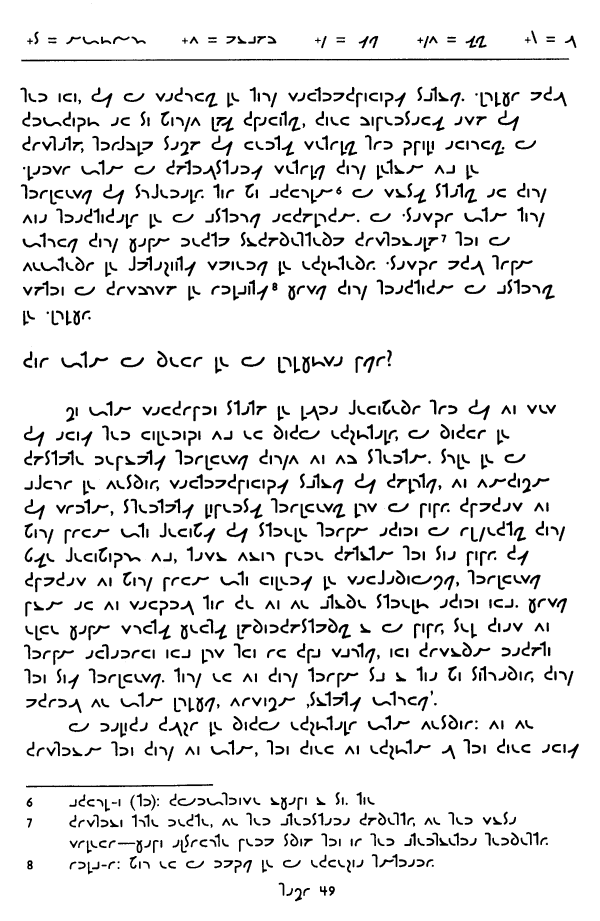

La Ŝava Alfabeto {#la-ŝava-alfabeto .center}
================

#### Ekzerco 3, paĝo 3 el 6 {#ekzerco-3-paĝo-3-el-6 .center}

#### `sxava_ekzerco_3c.png` {#sxava_ekzerco_3c.png .center}

{width="600" height="921"}

[{width="88"
height="31"}](http://validator.w3.org/check/referer)
