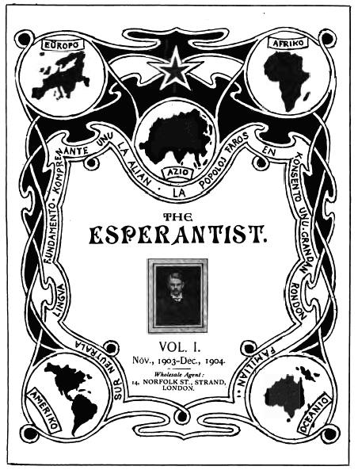
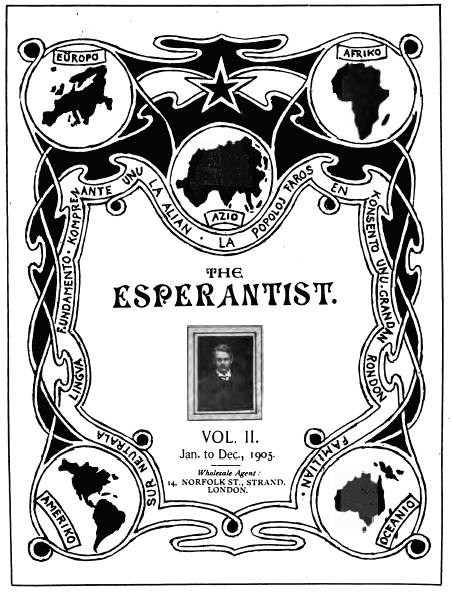

::: {#pg-header .section .pg-boilerplate .pgheader lang="en"}
The Project Gutenberg eBook of [The Esperantist, Complete]{lang="en"} {#pg-header-heading title=""}
---------------------------------------------------------------------

<div>

This ebook is for the use of anyone anywhere in the United States and
most other parts of the world at no cost and with almost no restrictions
whatsoever. You may copy it, give it away or re-use it under the terms
of the Project Gutenberg License included with this ebook or online at
[www.gutenberg.org](https://www.gutenberg.org){.reference .external}. If
you are not located in the United States, you will have to check the
laws of the country where you are located before using this eBook.

</div>

::: {#pg-machine-header .container}
**Title**: The Esperantist, Complete

::: {#pg-header-authlist}
**Editor**: H. Bolingbroke Mudie
:::

**Release date**: December 6, 2011 \[eBook \#38240\]\
Most recently updated: March 13, 2021

**Language**: English, Esperanto

**Credits**: Produced by David Starner, Andrew Sly and the Online\
Distributed Proofreading Team at http://www.pgdp.net. Music\
transcribed by Linda Cantoni. (This book was produced from\
scanned images of public domain material from the Google\
Print project.)
:::

::: {#pg-start-separator}
\*\*\* START OF THE PROJECT GUTENBERG EBOOK THE ESPERANTIST, COMPLETE
\*\*\*
:::
:::

::: {.tnotes}
*Transcriber's Notes*

Midi, PDF, and MusicXML files have been provided for the songs in this
e-book. To hear a song, click on the \[Listen\] link. To view it in
sheet-music form, click on the \[PDF\] link. To view MusicXML code for
it, click on the \[MusicXML\] link. All lyrics are set forth in text
below the music images. Obvious errors in the notation have been
corrected.

A few minor typographical errors have been corrected without notice.
However, many grammatical errors and odd spellings have been left as in
the original. Some un-indexed items have been added to the indexes.
:::

::: {.imgcenter}
[]{#est1-tp} {#id-7562604124573390624 width="452"
height="593"}
:::

::: {.titlepage}
THE ESPERANTIST. {#the-esperantist. style="font-size:150%;"}
----------------

VOL. I.

Nov., 1903--Dec., 1904.

*Wholesale Agent:*\
14, NORFOLK ST., STRAND,\
LONDON.
:::

-   [No. 1, November, 1903](vol1/e01.htm){#id-8071198870768122264}
-   [No. 2, December, 1903](vol1/e02.htm){#id-4032049801176650779}
-   [No. 3, January, 1904](vol1/e03.htm){#id-4112206923076787888}
-   [No. 4, February, 1904](vol1/e04.htm){#id-4632864764464710985}
-   [No. 5, March, 1904](vol1/e05.htm){#id-3743103420269124090}
-   [No. 6, April, 1904](vol1/e06.htm){#id-5042846875009741703}
-   [No. 7, May, 1904](vol1/e07.htm){#id-6611357687060948213}
-   [No. 8, June, 1904](vol1/e08.htm){#id-1564153586485559369}
-   [No. 9, July, 1904](vol1/e09.htm){#id-6790085864805322268}
-   [No. 10, August, 1904](vol1/e10.htm){#id-8275549046972059014}
-   [No. 11, September, 1904](vol1/e11.htm){#id-4322640493626635503}
-   [No. 12, October, 1904](vol1/e12.htm){#id-4031384635242811309}
-   [No. 13, November, 1904](vol1/e13.htm){#id-186295033137767114}
-   [No. 14, December, 1904](vol1/e14.htm){#id-949799559068386825}

::: {#est1-index lang="eo"}
### ENHAVARO DE \"THE ESPERANTIST.\" VOLUMO I. NUMEROJ 1--14.

-   [Anando.]{.index-name} Voĉo el la Himalajo,
    [193](vol1/e13.htm#est1-13-10){#id-1013774504548162682 .pgexternal}.
-   [Archibald, Jem Ross.]{.index-name} Kristnaska Pudingo,
    [212](vol1/e14.htm#est1-14-15){#id-3414700897114517968 .pgexternal}.
-   [Bauer, Elise.]{.index-name} La tri amikoj;\* kaj Legendo,\*
    [23](vol1/e02.htm#est1-2-17){#id-2682992155354298179 .pgexternal}.
-   ------ Ĉu vi estas preta,\*
    [64](vol1/e04.htm#est1-4-27){#id-4925052656524149518 .pgexternal}.
-   ------ Mateo Falkone,\*
    [70](vol1/e05.htm#est1-5-15){#id-8125510491940106614 .pgexternal}.
-   ------ La Mistera Edziĝo,\*
    [148](vol1/e10.htm#est1-10-11){#id-5186136643657666577 .pgexternal}.
-   ------ Havro, [164](vol1/e11.htm#est1-11-10){#id-3595066112318965793
    .pgexternal}.
-   [Bernard, E.]{.index-name} Letero el Genevo,
    [215](vol1/e14.htm#est1-14-18){#id-6332415119122160956 .pgexternal}.
-   [Bickell, C. S.]{.index-name} La Posteno de Robbie,\*
    [111](vol1/e07.htm#est1-7-18){#id-7535000753517180053 .pgexternal}.
-   [Bicknell, Clarence.]{.index-name} Itala Somero,
    [4](vol1/e01.htm#est1-1-13){#id-3031204156804405541 .pgexternal},
    [23](vol1/e02.htm#est1-2-20){#id-5314400356070813278 .pgexternal}.
-   ------ *La lasta rozo de somero*,\*
    [4](vol1/e01.htm#est1-1-13){#id-2105776118161612131 .pgexternal}.
-   ------ *L'Almozulino*,\*
    [20](vol1/e02.htm#est1-2-12){#id-109750910862609396 .pgexternal}.
-   ------ *Kazabianko*,\*
    [41](vol1/e03.htm#est1-3-15){#id-988458974577764056 .pgexternal}.
-   ------ Vera Rakonteto,
    [44](vol1/e03.htm#est1-3-22){#id-5339204909462361278 .pgexternal}.
-   ------ Diverslandaj Proverboj,\*
    [43](vol1/e03.htm#est1-3-20){#id-1022113218284397635 .pgexternal},
    [64](vol1/e04.htm#est1-4-24){#id-4827689968023517408 .pgexternal},
    [68](vol1/e05.htm#est1-5-13){#id-4329441233847806198 .pgexternal}.
-   ------ Itala Fablascienco,
    [68](vol1/e05.htm#est1-5-12){#id-9191622536131471371 .pgexternal}.
-   ------ *La Nova Jaro*,†
    [54](vol1/e04.htm#est1-4-13){#id-5084230955524176166 .pgexternal}.
-   ------ Militaj Rekrutoj en Italujo,
    [85](vol1/e06.htm#est1-6-16){#id-2013713198829675868 .pgexternal}.
-   ------ *Itala nacia Kanto. Addio*,\*
    [85](vol1/e06.htm#addio){#id-7704654345462192709 .pgexternal}.
-   ------ *Progressive Limerick*,
    [104](vol1/e07.htm#est1-7-9){#id-3303557333867940516 .pgexternal}.
-   ------ *Reveno al la Montaro*,
    [125](vol1/e08.htm#est1-8-19){#id-1558061510634276712 .pgexternal}.
-   ------ *Nesentimentala Amkanto*,
    [157](vol1/e10.htm#est1-10-17){#id-3947347117796523753 .pgexternal}.
-   ------ *La Rozo kaj la Lekanteto*,
    [176](vol1/e11.htm#est1-11-19){#id-8701669178510844369 .pgexternal}.
-   ------ *La Elmigrantoj*,
    [184](vol1/e12.htm#est1-12-15){#id-8105580066165645197 .pgexternal}.
-   ------ *La Malgrandegulo*,
    [205](vol1/e13.htm#est1-13-23){#id-8625918813598807702 .pgexternal}.
-   ------ *Muŝfiŝbirdratkathundo*,
    [222](vol1/e14.htm#est1-14-25){#id-3978893721220143631 .pgexternal}.
-   [Bono, Philip de.]{.index-name} Lertaj Respondoj,\*
    [84](vol1/e06.htm#est1-6-12){#id-621671520611202882 .pgexternal},
    [111](vol1/e07.htm#lerta2){#id-6733800627761001747 .pgexternal}.
-   [Boucon, H.]{.index-name} Fablo,\*
    [84](vol1/e06.htm#est1-6-14){#id-3665262075175438319 .pgexternal}.
-   [Boulet, Paul.]{.index-name} Nokto en Kalabro,\*
    [143](vol1/e09.htm#est1-9-23){#id-1355626011504125758 .pgexternal}.
-   [Bourlet, Carlo.]{.index-name} *Vespero*,
    [41](vol1/e03.htm#est1-3-16){#id-4265441496922605058 .pgexternal}.
-   ------ Esperanto kaj Pedagogio,
    [115](vol1/e08.htm#est1-8-9){#id-8966892930965532724 .pgexternal}.
-   [Buchanan, G. Douglas.]{.index-name} Atesto pri Kapableco,†
    [140](vol1/e09.htm#est1-9-20){#id-3292169403033904178 .pgexternal}.
-   [Catt, Elizabeth J.]{.index-name} La Strabulino,
    [111](vol1/e07.htm#est1-7-19){#id-2831496983406840952 .pgexternal}.
-   [Ĉervinski, Kolowrat.]{.index-name} *La plendo de la Luno*,
    [205](vol1/e13.htm#est1-13-20){#id-6334935479130336088 .pgexternal}.
-   [Clephan, H. W.]{.index-name} Kiel fondi Grupon,†
    [52](vol1/e04.htm#est1-4-12){#id-2022210648700038448 .pgexternal}.
-   [Crook, F.]{.index-name} *Esperantist's Hymn*,
    [64](vol1/e04.htm#est1-4-25){#id-5368324011644718532 .pgexternal}.
-   [Davis, Rev. R. A.]{.index-name} Unua Leciono,
    [151](vol1/e10.htm#est1-10-14){#id-4048442338380046973 .pgexternal}.
-   ------ Eterna Kalendaro,
    [166](vol1/e11.htm#est1-11-12){#id-2371120361019504585 .pgexternal}.
-   [Deshays, Rene.]{.index-name} *Vintra Dolĉeco*,
    [121](vol1/e08.htm#est1-8-15){#id-688712214920494424 .pgexternal}.
-   [Doorn, J. van.]{.index-name} Esperanto en Japonujo,
    [134](vol1/e09.htm#est1-9-13){#id-4837359711700795699 .pgexternal}.
-   [Elleder, Osip Ivanovitch.]{.index-name} Oje,
    [55](vol1/e04.htm#est1-4-14){#id-6910349948297361600 .pgexternal}.
-   [Ellis, John.]{.index-name} Esperanto por ĉiutaga vivado,†
    [6](vol1/e01.htm#est1-1-15){#id-6423559791668945965 .pgexternal}.
-   ------ La sono de Voĉo,\*
    [24](vol1/e02.htm#est1-2-21){#id-3474543023488437857 .pgexternal}.
-   ------ La deveno de Esperanto,†
    [76](vol1/e05.htm#est1-5-20){#id-6593614228777498070 .pgexternal},
    [87](vol1/e06.htm#est1-6-18){#id-5928466941209349017 .pgexternal}.
-   [Elmy, Ben.]{.index-name} *Vivo de Maristo*,†,
    [8](vol1/e01.htm#est1-1-18){#id-8952658787126619124 .pgexternal}.
-   ------ *Lekanteto Aŭtuna*,\*
    [22](vol1/e02.htm#est1-2-14){#id-4558004378324208487 .pgexternal}.
-   ------ *Kantetoj Infanaj*,\*
    [37](vol1/e03.htm#est1-3-12){#id-8340404060468322956 .pgexternal}.
-   ------ La Sfinkso,
    [43](vol1/e03.htm#est1-3-19){#id-8425112669524469144 .pgexternal}.
-   ------ La lingvo de la floroj,
    [79](vol1/e05.htm#est1-5-22){#id-4728608536816485309 .pgexternal},
    [138](vol1/e09.htm#est1-9-18){#id-3477080598503488790 .pgexternal}.
-   ------ *El la Rubajat*,†
    [107](vol1/e07.htm#est1-7-13){#id-5903965505905926188 .pgexternal}.
-   ------ Logiko kaj Instinkto,
    [122](vol1/e08.htm#est1-8-16){#id-6756652314530144869 .pgexternal}.
-   ------ *La Marseillaise*,\*
    [145](vol1/e10.htm#est1-10-8){#id-5462273535577224212 .pgexternal}.
-   ------ *Amikeco*,
    [192](vol1/e12.htm#est1-12-21){#id-6465580956944563935 .pgexternal}.
-   ------ *Nikotino*,
    [222](vol1/e14.htm#est1-14-24){#id-6711514334658601127 .pgexternal}.
-   [Eucharis, Kasimir.]{.index-name} El Marcus Aurelius,\*
    [131](vol1/e09.htm#est1-9-10){#id-8025820188705894581 .pgexternal}.
-   [Gambier, M. P. (O. W.).]{.index-name} Fabloj,\*
    [79](vol1/e05.htm#est1-5-23){#id-8322461470470669972 .pgexternal}.
-   ------ Instinkto aŭ Inteligenteco,
    [106](vol1/e07.htm#est1-7-12){#id-4541553712373204843 .pgexternal},
    [126](vol1/e08.htm#est1-8-23){#id-7473953131409565554 .pgexternal},
    [211](vol1/e14.htm#est1-14-14){#id-8865874903118900396 .pgexternal}.
-   ------ La Komercisto kaj la Rabistoj,
    [146](vol1/e10.htm#est1-10-10){#id-6997924093611123205 .pgexternal}.
-   [Hadfield, J.]{.index-name} Amikeco. Originala Muziko,
    [192](vol1/e12.htm#est1-12-21){#id-1648114656840953584 .pgexternal}.
-   [Hayes, C. F.]{.index-name} Humora Flanko de Telegrafo,\*
    [10](vol1/e01.htm#est1-1-22){#id-5034222454657828643 .pgexternal}.
-   [Henderson, George J.]{.index-name} Fonto de la Lingvoj,
    [213](vol1/e14.htm#est1-14-16){#id-8480932425256123668 .pgexternal}.
-   [Hunter, Thomas, M.A.]{.index-name} *Zenita Suno*,
    [135](vol1/e09.htm#est1-9-15){#id-7378766057664970320 .pgexternal}.
-   [Kabe (Polujo).]{.index-name} La Fajfilo de Franklin,\*
    [44](vol1/e03.htm#est1-3-24){#id-7769353479928829175 .pgexternal}.
-   [Kofman, A.]{.index-name} La XIX^a^ Jarcento,
    [180](vol1/e12.htm#est1-12-12){#id-7359261452300248123 .pgexternal}.
-   [Lambert, D. H., B. A.]{.index-name} Grafo Fathom,\*
    [118](vol1/e08.htm#est1-8-12){#id-4788024755973541170 .pgexternal},
    [133](vol1/e09.htm#est1-9-12){#id-3111872782503398825 .pgexternal}.
-   ------ Okazeto Venezia,
    [219](vol1/e14.htm#est1-14-21){#id-4951413162530105129 .pgexternal}.
-   [Law, G. C.]{.index-name} Peketoj de Eppie,\*
    [119](vol1/e08.htm#est1-8-13){#id-141149322151328857 .pgexternal}.
-   ------ Irlanda Leono,\*
    [67](vol1/e05.htm#est1-5-11){#id-8555236135980821293 .pgexternal}.
-   ------ Bruselo,
    [165](vol1/e11.htm#est1-11-11){#id-4053002471277318051 .pgexternal}.
-   ------ Alvoko de la Naturo,
    [223](vol1/e14.htm#est1-14-26){#id-7167439895180346531 .pgexternal}.
-   [Lawrence, E. A.]{.index-name} Niaj Bonegaj Amikoj,
    [13](vol1/e01.htm#est1-1-26){#id-5785699232942853326 .pgexternal}.
-   ------ La Parlamentejo,
    [93](vol1/e06.htm#est1-6-21){#id-4933289555764461902 .pgexternal}.
-   ------ Majtago en Anglujo,
    [112](vol1/e07.htm#est1-7-21){#id-8069577098753673967 .pgexternal}.
-   [Ledger, G.]{.index-name} Esperanto in Shorthand,
    [7](vol1/e01.htm#est1-1-16){#id-2068270926907841798 .pgexternal}.
-   [Legoffre, Ernest.]{.index-name} Anekdotoj,
    [7](vol1/e01.htm#est1-1-17){#id-324314831359128198 .pgexternal}.
-   ------ *Dio Savu la Reĝon*,\*
    [8](vol1/e01.htm#est1-1-20){#id-7688705853203765273 .pgexternal}.
-   [Lloyd, R. J., D. Lit., M. A.]{.index-name} La Esperantaj Vokaloj,
    [167](vol1/e11.htm#est1-11-13){#id-5261913781386510010 .pgexternal}.
-   ------ La Sonoj Esperantaj,
    [182](vol1/e12.htm#est1-12-13){#id-8119796830447011239 .pgexternal}.
-   [London Esperanto Club.]{.index-name} Official Reports,
    [168](vol1/e11.htm#est1-11-14){#id-9116667645395955534 .pgexternal},
    [185](vol1/e12.htm#est1-12-16){#id-7889880014017375366 .pgexternal},
    [199](vol1/e13.htm#est1-13-15){#id-2107404602067132271 .pgexternal},
    [216](vol1/e14.htm#est1-14-20){#id-4470478063046963978 .pgexternal}.
-   [Mathews, Paul, M.A.]{.index-name} Mordanto Mordita,
    [22](vol1/e02.htm#est1-2-15){#id-1757468602688372453 .pgexternal}.
-   ------ La Naskiĝejo,
    [123](vol1/e08.htm#est1-8-17){#id-930490458122808230 .pgexternal}.
-   [Mathys, Eugene (Filo).]{.index-name} Patrino kaj Infano,
    [125](vol1/e08.htm#est1-8-21){#id-146907837035382686 .pgexternal}.
-   [Mayer, A. von.]{.index-name} Surprizanta,
    [196](vol1/e13.htm#est1-13-13){#id-3150133172410512544 .pgexternal}.
-   [Mehrmann, Maurice.]{.index-name} La Simio,\*
    [106](vol1/e07.htm#est1-7-11){#id-7639543566655963143 .pgexternal}.
-   [Metcalfe, Edward, M.A.]{.index-name} Nokto Terura,
    [38](vol1/e03.htm#est1-3-13){#id-1711923492257525471 .pgexternal}.
-   ------ La Viro Verda,
    [86](vol1/e06.htm#est1-6-17){#id-8605636605717530969 .pgexternal}.
-   ------ La Sankta Fajro,
    [120](vol1/e08.htm#est1-8-14){#id-6208534330686762552 .pgexternal}.
-   ------ *Karulineto*,
    [157](vol1/e10.htm#est1-10-19){#id-2639940848451473671 .pgexternal}.
-   ------ *Dormu*,
    [205](vol1/e13.htm#est1-13-22){#id-2408497364367189574 .pgexternal}.
-   ------ *Knabeto*,
    [222](vol1/e14.htm#est1-14-23){#id-1543183071294740842 .pgexternal}.
-   [Meyrick, J. H.]{.index-name} La Ĉielaj Pordoj,
    [80](vol1/e05.htm#est1-5-24){#id-3220967030149453570 .pgexternal}.
-   [Moscheles, Felix.]{.index-name} Kion diris Max Muller,†
    [19](vol1/e02.htm#est1-2-11){#id-3604425651078103509 .pgexternal}.
-   [Motteau, A.]{.index-name} *La Ventego*,\*
    [5](vol1/e01.htm#est1-1-14){#id-4146502879091594195 .pgexternal},
    [21](vol1/e02.htm#est1-2-13){#id-7816595163063367732 .pgexternal},
    [40](vol1/e03.htm#est1-3-14){#id-1612529152171501736 .pgexternal},
    [56](vol1/e04.htm#est1-4-15){#id-7619406673430270792 .pgexternal},
    [69](vol1/e05.htm#est1-5-14){#id-7236529884907094410 .pgexternal},
    [91](vol1/e06.htm#est1-6-19){#id-7264336081809044940 .pgexternal},
    [105](vol1/e07.htm#est1-7-10){#id-2964642338074539598 .pgexternal},
    [124](vol1/e08.htm#est1-8-18){#id-5719405764671899102 .pgexternal},
    [131](vol1/e09.htm#est1-9-9){#id-8021016162827506963 .pgexternal}.
-   ------ Nacia Esperanta Himno kun Muziko,
    [16](vol1/e01.htm#est1-1-30){#id-7179618035778417540 .pgexternal}.
-   ------ *L'Anĝelo kaj la Infano*,\*
    [27](vol1/e02.htm#est1-2-26){#id-1836305913774015097 .pgexternal}.
-   ------ Kristnaskaj Problemoj,
    [41](vol1/e03.htm#est1-3-17){#id-7145843448360195360 .pgexternal}.
-   ------ Fabloj,\* [8](vol1/e01.htm#est1-1-19){#id-6184428695243082099
    .pgexternal}, [13](vol1/e01.htm#est1-1-27){#id-775257111389442138
    .pgexternal}, [27](vol1/e02.htm#est1-2-25){#id-5566738241031250309
    .pgexternal}, [37](vol1/e03.htm#est1-3-11){#id-1652811070546799636
    .pgexternal}, [84](vol1/e06.htm#est1-6-14){#id-6081284142893574104
    .pgexternal}, [125](vol1/e08.htm#est1-8-20){#id-8358053654496772885
    .pgexternal}, [150](vol1/e10.htm#est1-10-13){#id-4635825005161520523
    .pgexternal}.
-   ------ *La Spegulo*,
    [61](vol1/e04.htm#est1-4-20){#id-4196078759317420536 .pgexternal}.
-   ------ *Tom Bolin*,\*
    [72](vol1/e05.htm#est1-5-16){#id-3313884860423804234 .pgexternal}.
-   ------ *El Shakespeare*,\*
    [83](vol1/e06.htm#est1-6-11){#id-9133968383779631439 .pgexternal}.
-   ------ *Kiam nutro nin vivigas*,
    [139](vol1/e09.htm#est1-9-19){#id-858106541855706279 .pgexternal}.
-   ------ *Kion diras Birdideto?*,\*
    [176](vol1/e11.htm#est1-11-18){#id-1827862512877968892 .pgexternal}.
-   ------ *Vekiĝa Himno de Infano*,\*
    [184](vol1/e12.htm#est1-12-14){#id-8939171609273079825 .pgexternal}.
-   [Nankivell, Rev. A. H.]{.index-name} *Anakreonaĵo*,
    [205](vol1/e13.htm#est1-13-21){#id-1695492699814748318 .pgexternal}.
-   [Officer, William.]{.index-name} *Bonveno*,
    [10](vol1/e01.htm#bonveno){#id-5645870041074579562 .pgexternal}.
-   ------ Fablo, [27](vol1/e02.htm#est1-2-25){#id-2985615621467090556
    .pgexternal}.
-   ------ Februara Promeno,
    [67](vol1/e05.htm#est1-5-10){#id-5130282568428064574 .pgexternal}.
-   ------ *Karulino Mia*,†
    [135](vol1/e09.htm#est1-9-14){#id-1700801621849675959 .pgexternal}.
-   ------ *Antaŭen*,
    [204](vol1/e13.htm#est1-13-19){#id-531154014078939324 .pgexternal}.
-   [Oxenford, C.]{.index-name} Miaj Paper-Amikoj,
    [206](vol1/e13.htm#est1-13-24){#id-4489190760705939318 .pgexternal}.
-   [Ramsay, Sir William.]{.index-name} Radiumo,†
    [36](vol1/e03.htm#est1-3-10){#id-2303223940160455548 .pgexternal}.
-   [Reeve, C. W. T.]{.index-name} *Kara Lu*,\*
    [157](vol1/e10.htm#est1-10-20){#id-2649924362523060762 .pgexternal}.
-   [Rhodes, J.]{.index-name} Giganto Malespero,\*
    [60](vol1/e04.htm#est1-4-19){#id-6636112626394087901 .pgexternal}.
-   [Rowe. F. G.]{.index-name} *Nia Lando*, kaj Muziko,
    [208](vol1/e13.htm#est1-13-26){#id-3343775633148129744 .pgexternal}.
-   [Simper, Alfred.]{.index-name} Letero el Hindujo,
    [110](vol1/e07.htm#est1-7-15){#id-2230485852163206669 .pgexternal}.
-   ------ Bagh, la Tigro,
    [156](vol1/e10.htm#est1-10-16){#id-5848037831840188817 .pgexternal}.
-   ------ La Lupo-Knabo,
    [189](vol1/e12.htm#est1-12-18){#id-5922335715581929954 .pgexternal}.
-   [Southcombe, H. W.]{.index-name} La Libertempulo,
    [188](vol1/e12.htm#est1-12-17){#id-9216246935888397408 .pgexternal}.
-   [Stead, W. T.]{.index-name} Esperanto,†
    [1](vol1/e01.htm#est1-1-11){#id-8965375724033820576 .pgexternal}.
-   [Westcott, Martyn.]{.index-name} Strut-Maklero,\*
    [162](vol1/e11.htm#est1-11-9){#id-9128924262026328526 .pgexternal}.
-   ------ Trezoro en la Arbaro,\*
    [195](vol1/e13.htm#est1-13-12){#id-5008143820339264111 .pgexternal},
    [220](vol1/e14.htm#est1-14-22){#id-4466744161639718516 .pgexternal}.
-   [Woodward, J. F. H.]{.index-name} Fizika Kulturo,\*
    [179](vol1/e12.htm#est1-12-11){#id-6661423413066285531 .pgexternal}.
-   [Zamenhof, L. L.]{.index-name} Fonografa Parolado,
    [51](vol1/e04.htm#est1-4-11){#id-1978949495977753208 .pgexternal}.
-   ------ Pri Akademio,
    [58](vol1/e04.htm#est1-4-17){#id-2609872393018801818 .pgexternal}.
-   ------ La Deveno de Esperanto,†
    [76](vol1/e05.htm#est1-5-20){#id-2364597172678891419 .pgexternal},
    [87](vol1/e06.htm#est1-6-18){#id-5988607149335636174 .pgexternal}.
-   [Redaktoro.]{.index-name}
    [3](vol1/e01.htm#est1-1-12){#id-5321047714043488258 .pgexternal},
    [17](vol1/e02.htm#est1-2-10){#id-9130994569594905645 .pgexternal},
    [34](vol1/e03.htm#est1-3-9){#id-1222622262231280207 .pgexternal},
    [49](vol1/e04.htm#est1-4-10){#id-1612277147713082494 .pgexternal},
    [65](vol1/e05.htm#est1-5-9){#id-3034038561925194765 .pgexternal},
    [81](vol1/e06.htm#est1-6-9){#id-6120254786723064030 .pgexternal},
    [97](vol1/e07.htm#est1-7-8){#id-7980561357636048579 .pgexternal},
    [113](vol1/e08.htm#est1-8-8){#id-196923215952186052 .pgexternal},
    [129](vol1/e09.htm#est1-9-8){#id-5012266871902182637 .pgexternal},
    [161](vol1/e11.htm#est1-11-8){#id-503024135577562148 .pgexternal},
    [177](vol1/e12.htm#est1-12-10){#id-5852541874527816327 .pgexternal},
    [209](vol1/e14.htm#est1-14-12){#id-1087982134412563579 .pgexternal},
    k.t.p.
-   ------ Niaj Libertempoj,
    [78](vol1/e05.htm#est1-5-21){#id-7112564823429268126 .pgexternal}.
-   ------ Bulonjo,
    [136](vol1/e09.htm#est1-9-17){#id-3939732137095882765 .pgexternal}.
-   ------ Dovero,†
    [172](vol1/e11.htm#est1-11-17){#id-3512325281039024614 .pgexternal}.

```{=html}
<!-- -->
```
-   [Sennomaj.]{.index-name} Sonĝverigisto (8379),
    [44](vol1/e03.htm#est1-3-23){#id-6164411661577714610 .pgexternal}.
-   ------ Sciencaj Aferoj (8105),
    [23](vol1/e02.htm#est1-2-19){#id-2739376871139321998 .pgexternal},
    [64](vol1/e04.htm#est1-4-23){#id-3003637678137579813 .pgexternal},
    [83](vol1/e06.htm#est1-6-10){#id-922514672106044788 .pgexternal},
    [111](vol1/e07.htm#est1-7-17){#id-3551037630860318722 .pgexternal}.
-   ------ Limeriko (7891),
    [64](vol1/e04.htm#est1-4-26){#id-2783378757723884456 .pgexternal}.
-   ------ Maltaj Proverboj (8108),
    [84](vol1/e06.htm#est1-6-13){#id-826621027391215351 .pgexternal}.
-   ------ La Periskopo (Sir T. P. L.),\*
    [117](vol1/e08.htm#est1-8-11){#id-3763243832583073090 .pgexternal}.
-   ------ Kranioj (Dro. A.M.),
    [203](vol1/e13.htm#est1-13-17){#id-3217294592561768242 .pgexternal}.
-   ------ Hindaj Proverboj (8276),
    [110](vol1/e07.htm#est1-7-16){#id-2185454520502050816 .pgexternal},
    [214](vol1/e14.htm#est1-14-17){#id-4288170263666957129 .pgexternal}.
-   ------ Mia Avino (8384),
    [117](vol1/e08.htm#est1-8-10){#id-2660035304738998672 .pgexternal}.
-   ------ Kimraj Skizetoj (E.W.),
    [127](vol1/e08.htm#est1-8-24){#id-5917306187494497345 .pgexternal},
    [142](vol1/e09.htm#est1-9-22){#id-5083292957269456125 .pgexternal},
    [159](vol1/e10.htm#est1-10-22){#id-563077320887993464 .pgexternal},
    [171](vol1/e11.htm#est1-11-16){#id-6973581012279131134 .pgexternal},
    [190](vol1/e12.htm#est1-12-19){#id-8457800593794016824 .pgexternal},
    [207](vol1/e13.htm#est1-13-25){#id-8990917733914279145 .pgexternal},
    [210](vol1/e14.htm#est1-14-13){#id-5845095596168412546 .pgexternal}.
-   ------ Meditadoj en Westminster Abbey\* (Rev. N.B.).,
    [197](vol1/e13.htm#est1-13-14){#id-5133418111353499554 .pgexternal}.
-   [Grammatical Synopsis.]{.sc}
    [14--15](vol1/e01.htm#est1-1-28){#id-8600975478765324401
    .pgexternal}.

::: {.footnotes}
::: {.footnote}
\* Tradukaĵo.
:::

::: {.footnote}
† Dulingva.
:::
:::

::: {.imgcenter}
{#id-6651135194615265048 width="452" height="593"}
:::

::: {.titlepage}
THE ESPERANTIST. {#the-esperantist.-1 style="font-size:150%;"}
----------------

VOL. II.

Jan. to Dec., 1905.

*Wholesale Agent:*\
14, NORFOLK ST., STRAND,\
LONDON.
:::

-   [No. 15, January, 1905](vol2/e201.htm){#id-7431424940353903151}
-   [No. 16, February, 1905](vol2/e202.htm){#id-8611393793692188078}
-   [No. 17, March, 1905](vol2/e203.htm){#id-8931719341525963582}
-   [No. 18, April, 1905](vol2/e204.htm){#id-1945488335285908719}
-   [No. 19, May, 1905](vol2/e205.htm){#id-2860787739636170418}
-   [No. 20, June, 1905](vol2/e206.htm){#id-7569466395874119692}
-   [No. 21, July, 1905](vol2/e207.htm){#id-5688022228801539149}
-   [No. 22, August, 1905](vol2/e208.htm){#id-3944018566803369878}
-   [No. 23, September, 1905](vol2/e209.htm){#id-4210975919250497430}
-   [No. 24, October, 1905](vol2/e210.htm){#id-5687739732267577635}
-   [No. 25, November, 1905](vol2/e211.htm){#id-3180901078324166130}
-   [No. 26, December, 1905](vol2/e212.htm){#id-585120324053466796}

::: {#est2-index lang="eo"}
### ENHAVARO DE \"THE ESPERANTIST.\" VOLUMO II. NUMEROJ 15--26.

-   [Anando.]{.index-name} Voĉo el la Himalajo,
    [65](vol2/e205.htm#est2-5-11){#id-1204849764736423100 .pgexternal}.
-   [Archibald, J. R.]{.index-name} Kukaĵetoj,
    [43](vol2/e203.htm#est2-3-18){#id-9182395871522185203 .pgexternal}.
-   ------ Katino & Kokidoj,
    [67](vol2/e205.htm#est2-5-14){#id-2150660705258454253 .pgexternal}.
-   [B. 10549.]{.index-name} Pri Fantomo,
    [79](vol2/e205.htm#est2-5-28){#id-2295751144644194361 .pgexternal}.
-   ------ Tri Verdaj Kornoj,
    [108](vol2/e207.htm#est2-7-21){#id-1648199157362141655 .pgexternal}.
-   ------ Dialogo pri Elizio,
    [181](vol2/e212.htm#est2-12-19){#id-6827693712606782468
    .pgexternal}.
-   [Baissac, A.]{.index-name} La Papo Mortis,\*
    [156](vol2/e210.htm#est2-10-19){#id-1808255107145269350
    .pgexternal}.
-   [Bassett, W. M.]{.index-name} *Esperanto Hymn of Peace*,\*
    [191](vol2/e212.htm#est2-12-32){#id-8530800112522449586
    .pgexternal}.
-   [Bauer, E.]{.index-name} La Urbo de Demonoj,\*
    [71](vol2/e205.htm#est2-5-19){#id-7707121407942463608 .pgexternal}.
-   ------ Letero al Bapto-Patro,\*
    [119](vol2/e208.htm#est2-8-15){#id-5485883610771056886 .pgexternal}.
-   [Bearne, F. E.]{.index-name} La Griza Ĉevalo,
    [125](vol2/e208.htm#est2-8-20){#id-1925216295829524569 .pgexternal}.
-   [Bickell, C. S.]{.index-name} Ofero de Skulptisto,\*
    [47](vol2/e203.htm#est2-3-24){#id-5192522083166777670 .pgexternal}.
-   [Bicknell, C.]{.index-name} *Kristnasko*,
    [1](vol2/e201.htm#est2-1-9){#id-7209293535822303378 .pgexternal},
    [188](vol2/e212.htm#est2-12-29){#id-884435764629139558 .pgexternal}.
-   ------ *Fablo*,
    [27](vol2/e202.htm#est2-2-17){#id-8481968817356912468 .pgexternal}.
-   ------ *Papilio*,\*
    [37](vol2/e203.htm#est2-3-14){#id-4114709053090994044 .pgexternal}.
-   ------ *Hundaj Rimarkoj*,
    [59](vol2/e204.htm#est2-4-20){#id-7918416967998698722 .pgexternal}.
-   ------ *La Sonĝo de Klarenco*,\*
    [70](vol2/e205.htm#est2-5-18){#id-3772281912211240816 .pgexternal}.
-   ------ Moderna Ermito,
    [81](vol2/e206.htm#est2-6-11){#id-9128838836728351243 .pgexternal}.
-   ------ *Korsikujo de Italujo*,
    [112](vol2/e207.htm#est2-7-27){#id-5653910842295145836 .pgexternal}.
-   ------ *La Galanto*,
    [141](vol2/e209.htm#est2-9-20){#id-5244602443490115099 .pgexternal}.
-   ------ *Duobla Akrostiko*,
    [163](vol2/e211.htm#est2-11-15){#id-4087253076180476486
    .pgexternal},
    [188](vol2/e212.htm#est2-12-30){#id-4674345105830876268
    .pgexternal}.
-   ------ Memoraĵoj pri Kongreso,
    [168](vol2/e211.htm#est2-11-18){#id-4425888913210934624
    .pgexternal}.
-   ------ *Ho Lando Nia!*
    [169](vol2/e211.htm#est2-11-20){#id-657315649593358654 .pgexternal}.
-   ------ *Ho Vivadu!*
    [169](vol2/e211.htm#est2-11-21){#id-8084253169316731679
    .pgexternal}.
-   ------ *Malnovaj Kantoj*,\*
    [186](vol2/e212.htm#est2-12-26){#id-1737137190034812098
    .pgexternal}.
-   [B. & W.]{.index-name} Ethelwald kvietigas la Maron,\*
    [185](vol2/e212.htm#est2-12-25){#id-1034029290976613497
    .pgexternal}.
-   [Blott, A.]{.index-name} Bulonja Kongreso, Parto II.,
    [145](vol2/e210.htm#est2-10-12){#id-6302990159219431017
    .pgexternal}.
-   [Booth, J.]{.index-name} Ŝaftondado en Aŭstralio.
    [7](vol2/e201.htm#est2-1-14){#id-2378317793591386651 .pgexternal}.
-   [Burjade, P.]{.index-name} Renkontiĝo neatendita,\*
    [52](vol2/e204.htm#est2-4-13){#id-9132126409530654169 .pgexternal}.
-   [Busuttil, Dr. G.]{.index-name} Kapelo el Ostoj,
    [33](vol2/e203.htm#est2-3-11){#id-6593046596828413983 .pgexternal}.
-   [Catt, E. J.]{.index-name} Profesoro Vulpo,\*
    [15](vol2/e201.htm#est2-1-22){#id-8062864235317419217 .pgexternal}.
-   ------ Korbo por Forĵetitaĵoj,
    [181](vol2/e212.htm#est2-12-20){#id-6884933805719645123
    .pgexternal}.
-   [Cowan, A. A.]{.index-name} Sur la Glacio,\*
    [78](vol2/e205.htm#est2-5-26){#id-7549738412766624726 .pgexternal}.
-   ------ Stranga Aventuro de Ĉirkaŭkolo,\*
    [184](vol2/e212.htm#est2-12-24){#id-6281650084919657766
    .pgexternal}.
-   [Cox, Gen. G.]{.index-name} Koloniigado en Ameriko,
    [74](vol2/e205.htm#est2-5-20){#id-6323169565734801514 .pgexternal}.
-   ------ Savita de Morto,
    [98](vol2/e207.htm#est2-7-12){#id-3826495382730663943 .pgexternal},
    [126](vol2/e208.htm#est2-8-22){#id-6157617508949056069 .pgexternal},
    [136](vol2/e209.htm#est2-9-16){#id-7560159809606060949 .pgexternal},
    [149](vol2/e210.htm#est2-10-13){#id-4345449165419868308
    .pgexternal},
    [174](vol2/e211.htm#est2-11-27){#id-2979534576845729637
    .pgexternal}.
-   [Cynicus.]{.index-name} Li, Ŝi, Ĝi & Alia,
    [182](vol2/e212.htm#est2-12-21){#id-3314113654046023983
    .pgexternal}.
-   [Dexter, W.]{.index-name} Pri la Arto,
    [159](vol2/e210.htm#est2-10-23){#id-7625250692879035406
    .pgexternal}.
-   [E. W.]{.index-name} Vivieno,
    [11](vol2/e201.htm#est2-1-18){#id-6203570696074461208 .pgexternal},
    [22](vol2/e202.htm#est2-2-13){#id-4430193998667624957 .pgexternal}.
-   ------ Pri Infanoj, kiujn mi konas,
    [40](vol2/e203.htm#est2-3-16){#id-7092793238658885275 .pgexternal}.
-   ------ Davdo Dhu,
    [49](vol2/e204.htm#est2-4-11){#id-2098816715611263659 .pgexternal}.
-   ------ Doni aŭ ne Doni,
    [87](vol2/e206.htm#est2-6-15){#id-8406272127456887402 .pgexternal}.
-   ------ Ermito preskaŭ moderna,
    [100](vol2/e207.htm#est2-7-14){#id-5598515835172644114 .pgexternal}.
-   ------ Pri la Malsato,
    [124](vol2/e208.htm#est2-8-19){#id-2287734010740537516 .pgexternal}.
-   ------ Ĝako, [165](vol2/e211.htm#est2-11-17){#id-3450879645972532661
    .pgexternal}.
-   [Elleder, O. I.]{.index-name} Kiam ekfloradas Rezedoj,
    [13](vol2/e201.htm#est2-1-21){#id-2686602183766481074 .pgexternal},
    [24](vol2/e202.htm#est2-2-15){#id-2799230460643946664 .pgexternal},
    [38](vol2/e203.htm#est2-3-15){#id-4446059002923005605 .pgexternal}.
-   [Elmy, B.]{.index-name} *Nevenkebla*,\*
    [63](vol2/e204.htm#est2-4-24){#id-8089483420953187917 .pgexternal}.
-   ------ *La Hispana Armiŝparo*,\*
    [102](vol2/e207.htm#est2-7-15){#id-1330918692124622235 .pgexternal}.
-   [Emptage, S. H.]{.index-name} La Fratoj de Birchington,
    [92](vol2/e206.htm#est2-6-22){#id-1719251924597086824 .pgexternal}.
-   [Evans, Rev. T. E.]{.index-name} *La Ora Horo*,\*
    [90](vol2/e206.htm#est2-6-18){#id-772839195286940584 .pgexternal}.
-   [Frenkel, R.]{.index-name} *El Lermontov*,\*
    [155](vol2/e210.htm#est2-10-18){#id-8347885589708441255
    .pgexternal}.
-   [Gauntlett, E.]{.index-name} Protekto de Anglo,
    [77](vol2/e205.htm#est2-5-25){#id-838044103137532276 .pgexternal}.
-   [Gordon, Col. H. K.]{.index-name} Hindustani & Esperanto,
    [8](vol2/e201.htm#est2-1-15){#id-1858702383340717391 .pgexternal}.
-   ------ Stato de Esperanto en Britujo,
    [46](vol2/e203.htm#est2-3-23){#id-3321540259209336877 .pgexternal}.
-   ------ Orientaj Notoj,
    [107](vol2/e207.htm#est2-7-20){#id-7819283358744607429 .pgexternal},
    [114](vol2/e208.htm#est2-8-12){#id-4988883973021589223 .pgexternal},
    [135](vol2/e209.htm#est2-9-15){#id-3367085731571755304 .pgexternal},
    [150](vol2/e210.htm#est2-10-14){#id-5089140969172579465
    .pgexternal},
    [162](vol2/e211.htm#est2-11-14){#id-6047031137276219168
    .pgexternal}.
-   [Grabowski, A.]{.index-name} *Lasta Rozo de Somero*,\*
    [176](vol2/e211.htm#est2-11-31){#id-932335895035378266 .pgexternal}.
-   ------ *Kanto Pri l' Vento*,\*
    [178](vol2/e212.htm#est2-12-14){#id-3000589228781989470
    .pgexternal}.
-   [Guersent, C.]{.index-name} La Konscienco,\*
    [69](vol2/e205.htm#est2-5-17){#id-2361678321460311484 .pgexternal}.
-   [H.T.]{.index-name} Vizito al la Kortego Ĥina,
    [26](vol2/e202.htm#est2-2-16){#id-8176885856159236908 .pgexternal}.
-   [Haxton, J. T.]{.index-name} *La Domo de Ĵak*,\*
    [10](vol2/e201.htm#est2-1-17){#id-6547386516667715610 .pgexternal}.
-   ------ St. Andrews en Somero,
    [31](vol2/e202.htm#est2-2-21){#id-1374496838742995348 .pgexternal}.
-   [Heath, J.]{.index-name} Ŝtonigita Arbaro,
    [54](vol2/e204.htm#est2-4-15){#id-3936706788441949853 .pgexternal}.
-   [Henderson, G. J.]{.index-name} Internacia Lingvo de Hindujo,
    [45](vol2/e203.htm#est2-3-21){#id-4307860262538608495 .pgexternal}.
-   [Hoskison, T.]{.index-name} Eksterdoma Instruado,\*
    [58](vol2/e204.htm#est2-4-19){#id-8287919858443662836 .pgexternal}.
-   [Hulme, A. J.]{.index-name} Henriko VII. enirante Shrewsbury,
    [17](vol2/e202.htm#est2-2-9){#id-1593192077194509377 .pgexternal}.
-   ------ Iometo da Muziko,\*
    [103](vol2/e207.htm#est2-7-16){#id-5664695612949764104 .pgexternal}.
-   [Keesing, M.]{.index-name} *Klopodu!*
    [119](vol2/e208.htm#est2-8-14){#id-7807177040603923312 .pgexternal}.
-   [Kolowrat, G. Ĉ.]{.index-name} Revo,
    [74](vol2/e205.htm#est2-5-21){#id-8733048735976026661 .pgexternal}.
-   [Lambert, D. H.]{.index-name} *Pri Libreto*,
    [36](vol2/e203.htm#Footnote3){#id-5662206585182192468 .pgexternal}.
-   ------ Balo de Enmaskigitoj,\*
    [56](vol2/e204.htm#est2-4-17){#id-1914612820017045287 .pgexternal}.
-   ------ Koniston & Grasmere,\*
    [62](vol2/e204.htm#est2-4-23){#id-5194343739954752460 .pgexternal}.
-   ------ *Dante, Kanto I.*,\*
    [176](vol2/e211.htm#est2-11-30){#id-426715146174719874 .pgexternal}.
-   ------ Amuzaĵoj,
    [184](vol2/e212.htm#est2-12-23){#id-6861385922013694990
    .pgexternal}.
-   [Law, G. C.]{.index-name} Juna Financisto,
    [125](vol2/e208.htm#est2-8-21){#id-2798072701532602587 .pgexternal}.
-   ------ Virino la Nekomprenebla,\*
    [142](vol2/e209.htm#est2-9-22){#id-4480421208982356031 .pgexternal},
    [152](vol2/e210.htm#est2-10-16){#id-9147367118737198661
    .pgexternal},
    [164](vol2/e211.htm#est2-11-16){#id-8072574075246961772
    .pgexternal}.
-   [Legge, Dr. R.]{.index-name} La Kat-Nesto,
    [23](vol2/e202.htm#est2-2-14){#id-9025683053465491045 .pgexternal}.
-   [Leroux, C.]{.index-name} Hundo de Brisquet,\*
    [139](vol2/e209.htm#est2-9-18){#id-1133927736335248129 .pgexternal}.
-   [Lloyd, Dr. R. J.]{.index-name} Gramatika Terminaro,
    [116](vol2/e208.htm#est2-8-13){#id-2279295037004835903 .pgexternal}.
-   ------ Esperanta Subjunktivo,
    [170](vol2/e211.htm#est2-11-23){#id-6495923620110835415
    .pgexternal}.
-   [Lojko, V.]{.index-name} El \"Korbo de Pensoj,\"\*
    [64](vol2/e204.htm#est2-4-25){#id-2764258291065804889 .pgexternal}.
-   ------ *Pino*,\*
    [99](vol2/e207.htm#est2-7-13){#id-5052623265917193311 .pgexternal}.
-   [Maréchal, F. L. G.]{.index-name} Unua Violono,
    [28](vol2/e202.htm#est2-2-18){#id-8312527680039860830 .pgexternal},
    [44](vol2/e203.htm#est2-3-20){#id-8589412267624460484 .pgexternal},
    [53](vol2/e204.htm#est2-4-14){#id-7510070800578491095 .pgexternal}.
-   [Meigh, F. A.]{.index-name} Skota Persisto,
    [15](vol2/e201.htm#est2-1-25){#id-2211893840353727640 .pgexternal}.
-   ------ Konscienco Malkuraĝigas,
    [61](vol2/e204.htm#est2-4-22){#id-9037529622218326918 .pgexternal}.
-   ------ Vilaĝaj Sportoj,
    [75](vol2/e205.htm#est2-5-22){#id-3467862535879562088 .pgexternal}.
-   ------ Memoroj pri Irlando,
    [88](vol2/e206.htm#est2-6-16){#id-3524557463936532126 .pgexternal}.
-   ------ Pasko en Irlando,
    [122](vol2/e208.htm#est2-8-17){#id-2946128036216427956 .pgexternal}.
-   ------ Kamparaj Amuzaĵoj,
    [160](vol2/e210.htm#est2-10-25){#id-2384949080964214612
    .pgexternal}.
-   [Messerly, G. O.]{.index-name} La Insulo Margarita,
    [32](vol2/e202.htm#est2-2-22){#id-2136116958930548237 .pgexternal}.
-   [Metcalfe, E.]{.index-name} *Demando*,
    [1](vol2/e201.htm#est2-1-10){#id-5835715034992563078 .pgexternal}.
-   ------ Fragmentaj Memoroj,
    [12](vol2/e201.htm#est2-1-19){#id-9206036557870249042 .pgexternal},
    [29](vol2/e202.htm#est2-2-19){#id-304346899301578091 .pgexternal},
    [41](vol2/e203.htm#est2-3-17){#id-2648006451695711205 .pgexternal},
    [55](vol2/e204.htm#est2-4-16){#id-6320892192587786250 .pgexternal},
    [76](vol2/e205.htm#est2-5-24){#id-7883274472821213721 .pgexternal},
    [84](vol2/e206.htm#est2-6-13){#id-307415715105430988 .pgexternal},
    [104](vol2/e207.htm#est2-7-17){#id-9070027281894660587 .pgexternal},
    [113](vol2/e208.htm#est2-8-11){#id-7735669192727250685 .pgexternal},
    [137](vol2/e209.htm#est2-9-17){#id-8430116406684695230 .pgexternal},
    [154](vol2/e210.htm#est2-10-17){#id-1143078748925288537
    .pgexternal},
    [172](vol2/e211.htm#est2-11-25){#id-7755745972908681109
    .pgexternal},
    [187](vol2/e212.htm#est2-12-28){#id-6263789688944135479
    .pgexternal}.
-   [Motteau, A.]{.index-name} *Lampiro & Bufo*,\*
    [1](vol2/e201.htm#est2-1-11){#id-1758952705658425284 .pgexternal}.
-   ------ La Olivoj,\*
    [9](vol2/e201.htm#est2-1-16){#id-1008605968777554297 .pgexternal}.
-   ------ *Legendo de Animo Fidela*,\*
    [37](vol2/e203.htm#est2-3-13){#id-58630512775230533 .pgexternal}.
-   ------ *Leono & Kulo*,\*
    [57](vol2/e204.htm#est2-4-18){#id-275931462438293085 .pgexternal}.
-   ------ *Morgaŭ*,\*
    [68](vol2/e205.htm#est2-5-15){#id-6914068038782944504 .pgexternal}.
-   ------ *La Sinapsemero*,\*
    [91](vol2/e206.htm#est2-6-21){#id-6394544258501897285 .pgexternal}.
-   ------ La Kvar Henrikoj,\*
    [107](vol2/e207.htm#est2-7-19){#id-6828088669053207833 .pgexternal}.
-   ------ *Kverko & Kano*,\*
    [157](vol2/e210.htm#est2-10-20){#id-3235077071610843706
    .pgexternal}.
-   [Nippa, A.]{.index-name} *El Puŝkin & Lermontev*,\*
    [43](vol2/e203.htm#est2-3-19){#id-5156924424160179600 .pgexternal}.
-   ------ *Kaŭkazo*,\*
    [168](vol2/e211.htm#est2-11-19){#id-363460877893185797 .pgexternal}.
-   [Officer, W.]{.index-name} Aventuro Terura,
    [128](vol2/e208.htm#est2-8-25){#id-6718523827927177149 .pgexternal}.
-   ------ Mutulo de Kirkmillar,
    [177](vol2/e212.htm#est2-12-13){#id-8947987545189589324
    .pgexternal}.
-   [Oxenford, C.]{.index-name} La Ora Koro,
    [82](vol2/e206.htm#est2-6-12){#id-2181324770404704753 .pgexternal}.
-   [Parisot, J.]{.index-name} *Pluva Tago*,\*
    [75](vol2/e205.htm#est2-5-23){#id-8443511245969680025 .pgexternal}.
-   ------ *Neĝa Supro*,
    [159](vol2/e210.htm#est2-10-24){#id-7728578165856922685
    .pgexternal}.
-   [Petrov, P.]{.index-name} Pluvo,\*
    [60](vol2/e204.htm#est2-4-21){#id-4609168525385046322 .pgexternal}.
-   [Philippet, Dr.]{.index-name} La Malsanuleto,\*
    [144](vol2/e209.htm#est2-9-23){#id-5349370641473154677 .pgexternal}.
-   [Privat, E.]{.index-name} La Maro,\*
    [180](vol2/e212.htm#est2-12-17){#id-4339967952306482531
    .pgexternal}.
-   [Randall, A.]{.index-name} Sanskrita Legendo,\*
    [66](vol2/e205.htm#est2-5-12){#id-1509772135645580106 .pgexternal}.
-   [Raytcheff, I.]{.index-name} La Rozesenco,
    [93](vol2/e206.htm#est2-6-23){#id-5082644760978705041 .pgexternal}.
-   [Reddet, S.]{.index-name} *La Forĝisto*,
    [67](vol2/e205.htm#est2-5-13){#id-3647625410728060755 .pgexternal}.
-   ------ *Staru, Homaro, Staru*,
    [173](vol2/e211.htm#est2-11-26){#id-1702187169125897160
    .pgexternal}.
-   ------ *Revado*,
    [180](vol2/e212.htm#est2-12-18){#id-2507143551692334706
    .pgexternal}.
-   [Reeve, C. W. T.]{.index-name} *Fremdulo en Fremdalando*,
    [89](vol2/e206.htm#est2-6-17){#id-9003011414611665591 .pgexternal}.
-   [Rose, D. S.]{.index-name} *Barkarolo*,\*
    [18](vol2/e202.htm#est2-2-10){#id-639940406616213897 .pgexternal}.
-   [Rowe, F. G.]{.index-name} *Dormu* (Lulkanto),
    [48](vol2/e203.htm#est2-3-25){#id-239991361753373964 .pgexternal}.
-   [Sentis, H.]{.index-name} La Esperanta Subjunktivo,
    [186](vol2/e212.htm#est2-12-27){#id-8651856266961158345
    .pgexternal}.
-   [Simon, A.]{.index-name} *Popola Versaĵo*,\*
    [127](vol2/e208.htm#est2-8-24){#id-8372504774936682229 .pgexternal}.
-   ------ Budho la Semisto,\*
    [171](vol2/e211.htm#est2-11-24){#id-5957651702782286672
    .pgexternal}.
-   [Southcombe, H. W.]{.index-name} Parado ĉe Sherborne,
    [140](vol2/e209.htm#est2-9-19){#id-5409584481132076625 .pgexternal}.
-   [T.A.C.]{.index-name} La Fajr-trapaŝado,
    [31](vol2/e202.htm#est2-2-20){#id-6867167083952886498 .pgexternal}.
-   [Taylor, P. C.]{.index-name} Vera Rakonteto,
    [158](vol2/e210.htm#est2-10-22){#id-7115279774191865639
    .pgexternal}.
-   [Thilander, H. J. E.]{.index-name} Braille Vortaro,
    [127](vol2/e208.htm#est2-8-23){#id-1402328786053058674 .pgexternal}.
-   [Wachter, A.]{.index-name} Maljuna Sonorigisto,\*
    [5](vol2/e201.htm#est2-1-13){#id-6724973272403666732 .pgexternal}.
-   ------ Majstro Pasero,
    [80](vol2/e205.htm#est2-5-29){#id-7872446570816146985 .pgexternal}.
-   [Westcott, Dr. M.]{.index-name} El Egiptujo,
    [45](vol2/e203.htm#est2-3-22){#id-8250010275622974296 .pgexternal}.
-   ------ Esperanta Rondiranto,
    [111](vol2/e207.htm#est2-7-25){#id-6939830218650656416 .pgexternal}.
-   ------ Nova Libro pri Francoj,
    [123](vol2/e208.htm#est2-8-18){#id-4640595064496324173 .pgexternal}.
-   ------ Authoritative Teaching,
    [158](vol2/e210.htm#est2-10-21){#id-4244112728303630472
    .pgexternal}.
-   ------ La Fumpotĉapelo,
    [178](vol2/e212.htm#est2-12-15){#id-4053618856770087735
    .pgexternal}.
-   ------ Egiptujo kiel Vintra Loĝejo,
    [179](vol2/e212.htm#est2-12-16){#id-4651055717493124958
    .pgexternal}.
-   [Young, E.]{.index-name} *El Nova Zelando*,
    [112](vol2/e207.htm#est2-7-26){#id-1904013934823558197 .pgexternal}.
-   [Zamenhof, L. L.]{.index-name} Letero pri la Dua Universala
    Kongreso, [161](vol2/e211.htm#est2-11-13){#id-7442604859096705881
    .pgexternal}.
-   [Redaktoro.]{.index-name}
    [2](vol2/e201.htm#est2-1-12){#id-1749919386193352688 .pgexternal},
    [15](vol2/e201.htm#est2-1-24){#id-3347965397442452879 .pgexternal},
    [16](vol2/e201.htm#est2-1-26){#id-4500540503173573861 .pgexternal},
    [19](vol2/e202.htm#est2-2-11){#id-7193147846421215329 .pgexternal},
    [34](vol2/e203.htm#est2-3-12){#id-2864347228476709777 .pgexternal},
    [51](vol2/e204.htm#est2-4-12){#id-5662490114234001395 .pgexternal},
    [86](vol2/e206.htm#est2-6-14){#id-6721356956823219472 .pgexternal},
    [94](vol2/e206.htm#est2-6-24){#id-1632656579385275467 .pgexternal},
    [97](vol2/e207.htm#est2-7-11){#id-8452951756381042249 .pgexternal},
    [105](vol2/e207.htm#est2-7-18){#id-2040154827350010793 .pgexternal},
    [121](vol2/e208.htm#est2-8-16){#id-412218761358409749 .pgexternal},
    [130](vol2/e209.htm#est2-9-14){#id-4809957369041452599 .pgexternal},
    [142](vol2/e209.htm#est2-9-21){#id-6683188369894729281 .pgexternal},
    [151](vol2/e210.htm#est2-10-15){#id-2804922771656418017
    .pgexternal},
    [189](vol2/e212.htm#est2-12-31){#id-4699169165114926552
    .pgexternal}, k.t.p.

```{=html}
<!-- -->
```
-   [Sennomaj.]{.index-name} Antaŭ la Rigardo de la Vivo\* (------ko),
    [68](vol2/e205.htm#est2-5-16){#id-2396977868481892672 .pgexternal}.
-   ------ Leonoj de la Arbaro de Gir (H.K.G.),
    [96](vol2/e206.htm#est2-6-25){#id-6787354459650967689 .pgexternal}.
-   ------ Ideoj de Fraŭlo pri Aĉetado (9911),
    [110](vol2/e207.htm#est2-7-23){#id-9074449011610703105 .pgexternal}.
-   ------ La maljuna Pastro (10532),
    [128](vol2/e208.htm#est2-8-26){#id-8229867121750704675 .pgexternal}.
-   ------ *La Sago kaj la Kanto*\* (9639),
    [175](vol2/e211.htm#est2-11-28){#id-2323414279034335540
    .pgexternal}.

::: {.footnotes}
::: {.footnote}
\* Tradukaĵoj.
:::
:::
:::
:::

::: {#pg-footer .section .pg-boilerplate .pgheader lang="en"}
::: {#pg-end-separator}
\*\*\* END OF THE PROJECT GUTENBERG EBOOK THE ESPERANTIST, COMPLETE
\*\*\*
:::

<div>

Updated editions will replace the previous one---the old editions will
be renamed.

</div>

<div>

Creating the works from print editions not protected by U.S. copyright
law means that no one owns a United States copyright in these works, so
the Foundation (and you!) can copy and distribute it in the United
States without permission and without paying copyright royalties.
Special rules, set forth in the General Terms of Use part of this
license, apply to copying and distributing Project Gutenberg™ electronic
works to protect the PROJECT GUTENBERG™ concept and trademark. Project
Gutenberg is a registered trademark, and may not be used if you charge
for an eBook, except by following the terms of the trademark license,
including paying royalties for use of the Project Gutenberg trademark.
If you do not charge anything for copies of this eBook, complying with
the trademark license is very easy. You may use this eBook for nearly
any purpose such as creation of derivative works, reports, performances
and research. Project Gutenberg eBooks may be modified and printed and
given away---you may do practically ANYTHING in the United States with
eBooks not protected by U.S. copyright law. Redistribution is subject to
the trademark license, especially commercial redistribution.

</div>

::: {#project-gutenberg-license}
START: FULL LICENSE
:::

THE FULL PROJECT GUTENBERG LICENSE {#pg-footer-heading}
----------------------------------

::: {.agate}
PLEASE READ THIS BEFORE YOU DISTRIBUTE OR USE THIS WORK
:::

<div>

To protect the Project Gutenberg™ mission of promoting the free
distribution of electronic works, by using or distributing this work (or
any other work associated in any way with the phrase "Project
Gutenberg"), you agree to comply with all the terms of the Full Project
Gutenberg™ License available with this file or online at
www.gutenberg.org/license.

</div>

::: {.secthead}
Section 1. General Terms of Use and Redistributing Project Gutenberg™
electronic works
:::

<div>

1.A. By reading or using any part of this Project Gutenberg™ electronic
work, you indicate that you have read, understand, agree to and accept
all the terms of this license and intellectual property
(trademark/copyright) agreement. If you do not agree to abide by all the
terms of this agreement, you must cease using and return or destroy all
copies of Project Gutenberg™ electronic works in your possession. If you
paid a fee for obtaining a copy of or access to a Project Gutenberg™
electronic work and you do not agree to be bound by the terms of this
agreement, you may obtain a refund from the person or entity to whom you
paid the fee as set forth in paragraph 1.E.8.

</div>

<div>

1.B. "Project Gutenberg" is a registered trademark. It may only be used
on or associated in any way with an electronic work by people who agree
to be bound by the terms of this agreement. There are a few things that
you can do with most Project Gutenberg™ electronic works even without
complying with the full terms of this agreement. See paragraph 1.C
below. There are a lot of things you can do with Project Gutenberg™
electronic works if you follow the terms of this agreement and help
preserve free future access to Project Gutenberg™ electronic works. See
paragraph 1.E below.

</div>

<div>

1.C. The Project Gutenberg Literary Archive Foundation ("the Foundation"
or PGLAF), owns a compilation copyright in the collection of Project
Gutenberg™ electronic works. Nearly all the individual works in the
collection are in the public domain in the United States. If an
individual work is unprotected by copyright law in the United States and
you are located in the United States, we do not claim a right to prevent
you from copying, distributing, performing, displaying or creating
derivative works based on the work as long as all references to Project
Gutenberg are removed. Of course, we hope that you will support the
Project Gutenberg™ mission of promoting free access to electronic works
by freely sharing Project Gutenberg™ works in compliance with the terms
of this agreement for keeping the Project Gutenberg™ name associated
with the work. You can easily comply with the terms of this agreement by
keeping this work in the same format with its attached full Project
Gutenberg™ License when you share it without charge with others.

</div>

<div>

1.D. The copyright laws of the place where you are located also govern
what you can do with this work. Copyright laws in most countries are in
a constant state of change. If you are outside the United States, check
the laws of your country in addition to the terms of this agreement
before downloading, copying, displaying, performing, distributing or
creating derivative works based on this work or any other Project
Gutenberg™ work. The Foundation makes no representations concerning the
copyright status of any work in any country other than the United
States.

</div>

<div>

1.E. Unless you have removed all references to Project Gutenberg:

</div>

<div>

1.E.1. The following sentence, with active links to, or other immediate
access to, the full Project Gutenberg™ License must appear prominently
whenever any copy of a Project Gutenberg™ work (any work on which the
phrase "Project Gutenberg" appears, or with which the phrase "Project
Gutenberg" is associated) is accessed, displayed, performed, viewed,
copied or distributed:

</div>

> <div>
>
> This eBook is for the use of anyone anywhere in the United States and
> most other parts of the world at no cost and with almost no
> restrictions whatsoever. You may copy it, give it away or re-use it
> under the terms of the Project Gutenberg License included with this
> eBook or online at [www.gutenberg.org](https://www.gutenberg.org). If
> you are not located in the United States, you will have to check the
> laws of the country where you are located before using this eBook.
>
> </div>

<div>

1.E.2. If an individual Project Gutenberg™ electronic work is derived
from texts not protected by U.S. copyright law (does not contain a
notice indicating that it is posted with permission of the copyright
holder), the work can be copied and distributed to anyone in the United
States without paying any fees or charges. If you are redistributing or
providing access to a work with the phrase "Project Gutenberg"
associated with or appearing on the work, you must comply either with
the requirements of paragraphs 1.E.1 through 1.E.7 or obtain permission
for the use of the work and the Project Gutenberg™ trademark as set
forth in paragraphs 1.E.8 or 1.E.9.

</div>

<div>

1.E.3. If an individual Project Gutenberg™ electronic work is posted
with the permission of the copyright holder, your use and distribution
must comply with both paragraphs 1.E.1 through 1.E.7 and any additional
terms imposed by the copyright holder. Additional terms will be linked
to the Project Gutenberg™ License for all works posted with the
permission of the copyright holder found at the beginning of this work.

</div>

<div>

1.E.4. Do not unlink or detach or remove the full Project Gutenberg™
License terms from this work, or any files containing a part of this
work or any other work associated with Project Gutenberg™.

</div>

<div>

1.E.5. Do not copy, display, perform, distribute or redistribute this
electronic work, or any part of this electronic work, without
prominently displaying the sentence set forth in paragraph 1.E.1 with
active links or immediate access to the full terms of the Project
Gutenberg™ License.

</div>

<div>

1.E.6. You may convert to and distribute this work in any binary,
compressed, marked up, nonproprietary or proprietary form, including any
word processing or hypertext form. However, if you provide access to or
distribute copies of a Project Gutenberg™ work in a format other than
"Plain Vanilla ASCII" or other format used in the official version
posted on the official Project Gutenberg™ website (www.gutenberg.org),
you must, at no additional cost, fee or expense to the user, provide a
copy, a means of exporting a copy, or a means of obtaining a copy upon
request, of the work in its original "Plain Vanilla ASCII" or other
form. Any alternate format must include the full Project Gutenberg™
License as specified in paragraph 1.E.1.

</div>

<div>

1.E.7. Do not charge a fee for access to, viewing, displaying,
performing, copying or distributing any Project Gutenberg™ works unless
you comply with paragraph 1.E.8 or 1.E.9.

</div>

<div>

1.E.8. You may charge a reasonable fee for copies of or providing access
to or distributing Project Gutenberg™ electronic works provided that:

</div>

-   • You pay a royalty fee of 20% of the gross profits you derive from
    the use of Project Gutenberg™ works calculated using the method you
    already use to calculate your applicable taxes. The fee is owed to
    the owner of the Project Gutenberg™ trademark, but he has agreed to
    donate royalties under this paragraph to the Project Gutenberg
    Literary Archive Foundation. Royalty payments must be paid within 60
    days following each date on which you prepare (or are legally
    required to prepare) your periodic tax returns. Royalty payments
    should be clearly marked as such and sent to the Project Gutenberg
    Literary Archive Foundation at the address specified in Section 4,
    "Information about donations to the Project Gutenberg Literary
    Archive Foundation."
-   • You provide a full refund of any money paid by a user who notifies
    you in writing (or by e-mail) within 30 days of receipt that s/he
    does not agree to the terms of the full Project Gutenberg™ License.
    You must require such a user to return or destroy all copies of the
    works possessed in a physical medium and discontinue all use of and
    all access to other copies of Project Gutenberg™ works.
-   • You provide, in accordance with paragraph 1.F.3, a full refund of
    any money paid for a work or a replacement copy, if a defect in the
    electronic work is discovered and reported to you within 90 days of
    receipt of the work.
-   • You comply with all other terms of this agreement for free
    distribution of Project Gutenberg™ works.

<div>

1.E.9. If you wish to charge a fee or distribute a Project Gutenberg™
electronic work or group of works on different terms than are set forth
in this agreement, you must obtain permission in writing from the
Project Gutenberg Literary Archive Foundation, the manager of the
Project Gutenberg™ trademark. Contact the Foundation as set forth in
Section 3 below.

</div>

<div>

1.F.

</div>

<div>

1.F.1. Project Gutenberg volunteers and employees expend considerable
effort to identify, do copyright research on, transcribe and proofread
works not protected by U.S. copyright law in creating the Project
Gutenberg™ collection. Despite these efforts, Project Gutenberg™
electronic works, and the medium on which they may be stored, may
contain "Defects," such as, but not limited to, incomplete, inaccurate
or corrupt data, transcription errors, a copyright or other intellectual
property infringement, a defective or damaged disk or other medium, a
computer virus, or computer codes that damage or cannot be read by your
equipment.

</div>

<div>

1.F.2. LIMITED WARRANTY, DISCLAIMER OF DAMAGES - Except for the "Right
of Replacement or Refund" described in paragraph 1.F.3, the Project
Gutenberg Literary Archive Foundation, the owner of the Project
Gutenberg™ trademark, and any other party distributing a Project
Gutenberg™ electronic work under this agreement, disclaim all liability
to you for damages, costs and expenses, including legal fees. YOU AGREE
THAT YOU HAVE NO REMEDIES FOR NEGLIGENCE, STRICT LIABILITY, BREACH OF
WARRANTY OR BREACH OF CONTRACT EXCEPT THOSE PROVIDED IN PARAGRAPH 1.F.3.
YOU AGREE THAT THE FOUNDATION, THE TRADEMARK OWNER, AND ANY DISTRIBUTOR
UNDER THIS AGREEMENT WILL NOT BE LIABLE TO YOU FOR ACTUAL, DIRECT,
INDIRECT, CONSEQUENTIAL, PUNITIVE OR INCIDENTAL DAMAGES EVEN IF YOU GIVE
NOTICE OF THE POSSIBILITY OF SUCH DAMAGE.

</div>

<div>

1.F.3. LIMITED RIGHT OF REPLACEMENT OR REFUND - If you discover a defect
in this electronic work within 90 days of receiving it, you can receive
a refund of the money (if any) you paid for it by sending a written
explanation to the person you received the work from. If you received
the work on a physical medium, you must return the medium with your
written explanation. The person or entity that provided you with the
defective work may elect to provide a replacement copy in lieu of a
refund. If you received the work electronically, the person or entity
providing it to you may choose to give you a second opportunity to
receive the work electronically in lieu of a refund. If the second copy
is also defective, you may demand a refund in writing without further
opportunities to fix the problem.

</div>

<div>

1.F.4. Except for the limited right of replacement or refund set forth
in paragraph 1.F.3, this work is provided to you 'AS-IS', WITH NO OTHER
WARRANTIES OF ANY KIND, EXPRESS OR IMPLIED, INCLUDING BUT NOT LIMITED TO
WARRANTIES OF MERCHANTABILITY OR FITNESS FOR ANY PURPOSE.

</div>

<div>

1.F.5. Some states do not allow disclaimers of certain implied
warranties or the exclusion or limitation of certain types of damages.
If any disclaimer or limitation set forth in this agreement violates the
law of the state applicable to this agreement, the agreement shall be
interpreted to make the maximum disclaimer or limitation permitted by
the applicable state law. The invalidity or unenforceability of any
provision of this agreement shall not void the remaining provisions.

</div>

<div>

1.F.6. INDEMNITY - You agree to indemnify and hold the Foundation, the
trademark owner, any agent or employee of the Foundation, anyone
providing copies of Project Gutenberg™ electronic works in accordance
with this agreement, and any volunteers associated with the production,
promotion and distribution of Project Gutenberg™ electronic works,
harmless from all liability, costs and expenses, including legal fees,
that arise directly or indirectly from any of the following which you do
or cause to occur: (a) distribution of this or any Project Gutenberg™
work, (b) alteration, modification, or additions or deletions to any
Project Gutenberg™ work, and (c) any Defect you cause.

</div>

::: {.secthead}
Section 2. Information about the Mission of Project Gutenberg™
:::

<div>

Project Gutenberg™ is synonymous with the free distribution of
electronic works in formats readable by the widest variety of computers
including obsolete, old, middle-aged and new computers. It exists
because of the efforts of hundreds of volunteers and donations from
people in all walks of life.

</div>

<div>

Volunteers and financial support to provide volunteers with the
assistance they need are critical to reaching Project Gutenberg™'s goals
and ensuring that the Project Gutenberg™ collection will remain freely
available for generations to come. In 2001, the Project Gutenberg
Literary Archive Foundation was created to provide a secure and
permanent future for Project Gutenberg™ and future generations. To learn
more about the Project Gutenberg Literary Archive Foundation and how
your efforts and donations can help, see Sections 3 and 4 and the
Foundation information page at www.gutenberg.org.

</div>

::: {.secthead}
Section 3. Information about the Project Gutenberg Literary Archive
Foundation
:::

<div>

The Project Gutenberg Literary Archive Foundation is a non-profit
501(c)(3) educational corporation organized under the laws of the state
of Mississippi and granted tax exempt status by the Internal Revenue
Service. The Foundation's EIN or federal tax identification number is
64-6221541. Contributions to the Project Gutenberg Literary Archive
Foundation are tax deductible to the full extent permitted by U.S.
federal laws and your state's laws.

</div>

<div>

The Foundation's business office is located at 809 North 1500 West, Salt
Lake City, UT 84116, (801) 596-1887. Email contact links and up to date
contact information can be found at the Foundation's website and
official page at www.gutenberg.org/contact

</div>

::: {.secthead}
Section 4. Information about Donations to the Project Gutenberg Literary
Archive Foundation
:::

<div>

Project Gutenberg™ depends upon and cannot survive without widespread
public support and donations to carry out its mission of increasing the
number of public domain and licensed works that can be freely
distributed in machine-readable form accessible by the widest array of
equipment including outdated equipment. Many small donations (\$1 to
\$5,000) are particularly important to maintaining tax exempt status
with the IRS.

</div>

<div>

The Foundation is committed to complying with the laws regulating
charities and charitable donations in all 50 states of the United
States. Compliance requirements are not uniform and it takes a
considerable effort, much paperwork and many fees to meet and keep up
with these requirements. We do not solicit donations in locations where
we have not received written confirmation of compliance. To SEND
DONATIONS or determine the status of compliance for any particular state
visit [www.gutenberg.org/donate](https://www.gutenberg.org/donate/).

</div>

<div>

While we cannot and do not solicit contributions from states where we
have not met the solicitation requirements, we know of no prohibition
against accepting unsolicited donations from donors in such states who
approach us with offers to donate.

</div>

<div>

International donations are gratefully accepted, but we cannot make any
statements concerning tax treatment of donations received from outside
the United States. U.S. laws alone swamp our small staff.

</div>

<div>

Please check the Project Gutenberg web pages for current donation
methods and addresses. Donations are accepted in a number of other ways
including checks, online payments and credit card donations. To donate,
please visit: www.gutenberg.org/donate.

</div>

::: {.secthead}
Section 5. General Information About Project Gutenberg™ electronic works
:::

<div>

Professor Michael S. Hart was the originator of the Project Gutenberg™
concept of a library of electronic works that could be freely shared
with anyone. For forty years, he produced and distributed Project
Gutenberg™ eBooks with only a loose network of volunteer support.

</div>

<div>

Project Gutenberg™ eBooks are often created from several printed
editions, all of which are confirmed as not protected by copyright in
the U.S. unless a copyright notice is included. Thus, we do not
necessarily keep eBooks in compliance with any particular paper edition.

</div>

<div>

Most people start at our website which has the main PG search facility:
[www.gutenberg.org](https://www.gutenberg.org).

</div>

<div>

This website includes information about Project Gutenberg™, including
how to make donations to the Project Gutenberg Literary Archive
Foundation, how to help produce our new eBooks, and how to subscribe to
our email newsletter to hear about new eBooks.

</div>
:::
