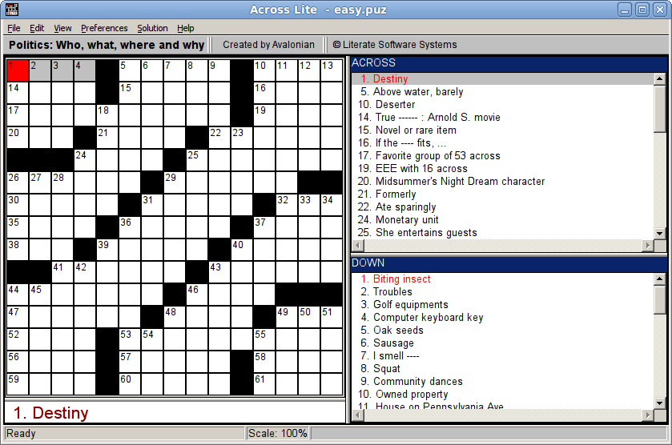
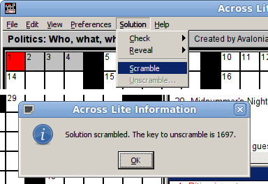

Cryptic Crossword
=================

Amateur Crypto and Reverse Engineering
--------------------------------------

------------------------------------------------------------------------

### Introduction

Reverse engineering is a special subgenre of computer programming. It\'s
about the closest that I as a programmer get to being a scientist.
Gather data, formulate a hypothesis, test, refine, repeat: reverse
engineering is basically applying the scientific method to a very, very
small knowledge domain. If you\'ve never tried to reverse-engineer a
program before, you may be wondering how one goes about such a task. The
following essay retraces one of the more colorful reverse-engineering
problems that I\'ve pursued.

How all this started was that a friend of mine was contributing to an
iOS application for crossword puzzles. This was in the early days of the
first iPhone, and they wanted to get their app into the store quickly,
before this tiny niche was saturated. The program was working, but it
was missing one very small feature --- namely that it couldn\'t
unscramble scrambled crossword puzzles.

Let me back up a bit and explain. There is a widely used file format for
crossword puzzles, called the `.puz` file format. (Or at least that\'s
what I called it; I don\'t know if it has a better name.) The file
format was created back in the 1990s by a software company called
Literate Software, and they used it in their own application, \"Across
Lite\". that allowed you to both create and solve crossword puzzles in
their file format. Apparently they had the good fortune to become a de
facto standard, so it\'s pretty much the main file format to use, if
you\'re a crossword application. As far as I know they never published a
spec for their format; however, other people had taken the time to
reverse-engineer it and make the description publicly available. My
understanding is that the company actually made its money not from the
software, but by licensing the right to sell crossword files made with
its software. So, even though they may not have officially approved of
the reverse engineering, they probably didn\'t mind, since it would only
help cement their file format as a standard. I\'m fuzzy on the
historical details here, but the upshot is that the only available
descriptions of this file format, which is pretty much the standard
format for crossword puzzles, were written by people outside of the
company.

Fortunately, the file format is pretty straightforward. As you might
expect, it\'s a binary file format. The header includes things like the
width and height of the grid, and the number of clues.

::: {.textsamp}
0000000: FC25 4143 524F 5353 2644 4F57 4E00 02EA .%ACROSS&DOWN\...
0000010: 4BD0 B00C ABE5 B845 312E 3200 0000 0000 K\...\...E1.2\.....
0000020: 0000 0000 0000 0000 0000 0000 0F0F 4E00 \...\...\...\.....N.
0000030: 0100 0000 4641 5445 2E41 5741 5348 2E41 \....FATE.AWASH.A
0000040: 574F 4C4C 4945 532E 4355 5249 4F2E 5348 WOLLIES.CURIO.SH
0000050: 4F45 454C 4543 544F 5241 5445 2E53 495A OEELECTORATE.SIZ
0000060: 4541 5353 2E45 5253 542E 4449 4554 4544 EASS.ERST.DIETED
0000070: 2E2E 2E43 454E 542E 484F 5354 4553 5352 \...CENT.HOSTESSR
:::

After the header, the file provides all the strings --- the first one
being the completed grid, which you can see the beginning of in the
sample here. Black squares are indicated with ASCII periods. After the
answer grid would come the player\'s working grid, then the list of
clues, and then some miscellaneous string data such as the crossword\'s
title and author.

Here\'s a breakdown of the file header.

  Description          Length Details
  ------------------ -------- -------------------------------------------------
  File checksum             2 short
  Magic                    12 The ASCII text: \"`ACROSS&DOWN\0`{.sample}\"
  Base checksum             2 short
  Masked checksums          8 short\[4\]
  File Version              4 The ASCII text: \"`1.N\0`{.sample}\" (N varies)
  Unused                    2 set to uninitialized garbage values
  Unknown                   2 zero unless scrambled
  Reserved                 12 set to uninitialized garbage values
  Width                     1 char
  Height                    1 char
  Number of clues           2 short
  Bitmask                   2 normally set to 0x0001
  Bitmask                   2 0x0004 = scrambled

I don\'t know why anybody thought the file needed six different
checksums. (Even better, four of the six checksums are masked: their
value is `XOR`ed with the ASCII characters \"`ICHEATED`{.sample}\". I\'m
guessing this was meant to discourage people from manually modifying
existing files to make their own crossword files without using the
software.) Fortunately, someone besides me had already figured this
stuff out. There was one aspect of the file format, however, that was
missing from the available descriptions.

One feature of the Across Lite program is that once you had created a
crossword, you could opt to have it \"scrambled\". Normally, the
completed grid (i.e. the crossword with all of the answers filled in)
was stored in the file in plaintext. But that meant that a motivated
user could examine the binary file contents to look up the answers (as
we just did). Scrambling gave the puzzle author a way to prevent that.

After scrambling a puzzle, the file contents might look like this:

::: {.textsamp}
0000000: EDFB 4143 524F 5353 2644 4F57 4E00 04EA ..ACROSS&DOWN\...
0000010: 4DF5 B00C AB05 B845 312E 3200 0000 8B6B M\...\...E1.2\....k
0000020: 0000 0000 0000 0000 0000 0000 0F0F 4E00 \...\...\...\.....N.
0000030: 0100 0400 4846 4A49 2E46 4241 4746 2E50 \....HFJI.FBAGF.P
0000040: 5A44 4C49 4342 5A2E 534D 4549 492E 485A ZDLICBZ.SMEII.HZ
0000050: 4F45 514C 564E 4E50 4E4B 4D56 2E54 414D OEQLVNNPNKMV.TAM
0000060: 5258 5358 2E4F 5557 4F2E 5848 5951 4C56 RXSX.OUWO.XHYQLV
0000070: 2E2E 2E46 5144 4C2E 5952 4659 4F4D 4157 \...FQDL.YRFYOMAW
:::

When you ask to have a puzzle scrambled, the application provides you
with a key in the form of a four-digit number. (In this particular case,
the key is 5274.) If someone later asks to unscramble the puzzle, the
Across Lite application will prompt them for the key. If they don\'t
provide the correct key, they can\'t unscramble the solution.

The reverse-engineered description of the `.puz` file format had
absolutely nothing to say about the nature of scrambled files. And this
was my friend\'s problem. Without that information, their app wouldn\'t
be able to unscramble a file, at all. The user could still work on the
crossword, of course: the scrambling doesn\'t affect the grid\'s layout,
or the clues. But users wouldn\'t be able to validate their answers.

+-----------------------+-----------------------+-----------------------+
|   --- --- --- --- -   | [➡]{.arrow}           |   --- --- --- --- -   |
| -- --- --- --- --- -- |                       | -- --- --- --- --- -- |
| - --- --- --- --- --- |                       | - --- --- --- --- --- |
|   F   A   T   E       |                       |   H   F   J   I       |
|      A   W   A   S    |                       |      F   B   A   G    |
| H       A   W   O   L |                       | F       P   Z   D   L |
|   L   I   E   S       |                       |   I   C   B   Z       |
|      C   U   R   I    |                       |      S   M   E   I    |
| O       S   H   O   E |                       | I       H   Z   O   E |
|   E   L   E   C       |                       |   Q   L   V   N       |
|  T   O   R   A   T    |                       |  N   P   N   K   M    |
| E       S   I   Z   E |                       | V       T   A   M   R |
|   A   S   S           |                       |   X   S   X           |
|  E   R   S   T        |                       |  O   U   W   O        |
| D   I   E   T   E   D |                       | X   H   Y   Q   L   V |
|               C       |                       |               F       |
|  E   N   T       H    |                       |  Q   D   L       Y    |
| O   S   T   E   S   S |                       | R   F   Y   O   M   A |
|   R   E   F   I       |                       |   W   M   I   V       |
|   T   S       J   E   |                       |   L   G       I   E   |
|  W   I   S   H        |                       |  X   A   G   C        |
|   A   R   I   T       |                       |   Y   M   U   X       |
|  H       K   E   R    |                       |  J       E   X   Z    |
| N   S       O   A   F |                       | Q   G       H   H   Z |
|   N   I   L   E       |                       |   M   H   I   A       |
|      A   N   N   E    |                       |      D   G   F   K    |
| S       D   U   P   E |                       | V       O   J   I   I |
|   D   E   I           |                       |   S   C   Y           |
|  O   V   E   N   S    |                       |  R   C   S   E   A    |
|     L   O   S   E   R |                       |     J   X   E   W   Q |
|           B   O       |                       |           X   I       |
|  D   I   L   Y        |                       |  A   M   K   Z        |
| R   A   C   E   R   S |                       | X   M   U   H   Y   P |
|   G   L   U   T       |                       |   W   G   U   C       |
|   E   A   L       P   |                       |   F   A   L       K   |
|  E   P   S            |                       |  Q   O   I            |
|   R   E   S   I       |                       |   X   L   R   I       |
|  S   T       S   L    |                       |  L   V       M   U    |
| U   E       S   K   I |                       | I   L       O   B   U |
|   O   T   T   O       |                       |   F   C   A   Z       |
|      R   E   P   U    |                       |      B   W   F   C    |
| B   L   I   C   A   N |                       | J   C   S   D   H   Z |
|   O   M   E   S       |                       |   V   W   W   U       |
|      I   R   A   T    |                       |      D   C   A   Z    |
| E       R   A   M   S |                       | R       X   G   L   T |
|   M   E   R   E       |                       |   T   I   C   T       |
|      X   E   N   O    |                       |      B   Z   D   N    |
| N       A   B   E   T |                       | M       B   H   M   T |
|   --- --- --- --- -   |                       |   --- --- --- --- -   |
| -- --- --- --- --- -- |                       | -- --- --- --- --- -- |
| - --- --- --- --- --- |                       | - --- --- --- --- --- |
+-----------------------+-----------------------+-----------------------+

One of the few advantages that crossword apps have over paper crosswords
is that at the end, you can check your answer, and the program can tell
you whether or not it\'s correct. Or it can tell you how many letters
are wrong, or it can highlight the squares that are wrong, or just one
wrong square, etcetera etcetera. But their app couldn\'t do that with a
scrambled file, *even if* the user had the four-digit key!

As it happened, the majority of crossword publishers didn\'t bother to
scramble their files. So they were tempted to just release their app
without proper support for that feature. Unfortunately, one of the few
publishers that did use scrambled files was the New York Times. (They
would publish the scrambled file, and then publish the four-digit key
the next day, on the same schedule as the print version published the
answer grids.) Having a feature that works on everyone\'s crosswords
except the New York Times is kind of like a wedding band that can play
everything except the Wedding March. For a lot of potential users, that
would be a deal-breaker.

So, my friend contacted me and described the situation, and asked: Do
you think you might be able to reverse-engineer this scrambling
algorithm? My response was: maybe. Hard to say, but I\'m willing to try.
Privately, though, my reaction was THIS IS MY DREAM PROJECT AND THERE IS
NO WAY I\'M NOT SPENDING ALL AVAILABLE FREE TIME ON THIS.

### Getting Started

::: {.centered}

:::

The first step, as it turned out, was just getting the Across Lite
program running for myself. To my surprise, they actually had a Linux
binary available. Unfortunately, it had a library dependency on a
remarkably ancient version of the C++ standard library that pre-dated
ANSIfication. After an unsuccessful attempt to track down a copy of this
library that would run on a modern kernel, I wound up just using the
Windows version of the program, running it under Wine. It was a bit slow
to start up, but otherwise ran fine.

::: {.illo}

:::

So this is what it looks like when you bring up the Across Lite program
with a `.puz` file. The main focus of this interface is for working on
solving the crossword, but this program also provides the ability to
scramble the crossword, as you can see from the opened menu.

When you use it, the program selects a four-digit unscrambling key,
which it gives to you in a message box. You can then save the scrambled
`.puz` file to disk. The key is not available after you close that
message box, so it\'s up to you to make a note of it.

Once that was working, my next step was to write my own program to
create unscrambled `.puz` files as input. I could have used someone
else\'s code, but since I was already studying the file format, it was
easy enough for me to slap together a script that generated a `.puz`
file from some basic input.

With that preparation out of the way, I was ready to actually start
work. After brainstorming for a bit on where to begin, here are some of
the things that I initially tried:

-   Conduct a thorough web search. Though I really wanted to solve this
    one entirely by myself, I knew that if anyone else had already
    solved it, I shouldn\'t be wasting other people\'s time. So I spent
    the better part of a day going through various web searches. The
    closest I came was a forum in which some people were discussing
    scrambled `.puz` files. One person there claimed to have cracked the
    scrambling algorithm, but had since lost the source code. Could be
    BS, but if not, then at least I knew that it could be done.
-   Look for easy-to-calculate invariants between a scrambled grid and
    its original contents. For example, is there a checksum or a parity
    value for a grid that remains the same after scrambling? Something
    like this could reveal possible mechanisms used in the scrambling
    algorithm. I tried a handful of possibilities; none of them worked.
-   Look for a way to control the selection of the four-digit key. The
    annoying aspect of the scrambling feature is that the program
    selects the key for you; you don\'t get to choose what it will be.
    If I could compare two or more grids that were scrambled with the
    same key, that might be a good place to start.
-   Finally, one approach that may seem obvious which I explicitly did
    *not* pursue: examining the Across Lite program directly with a
    debugger and/or disassembler. I took this approach off the list of
    available options right from the start, due to the project\'s
    ultimate goal. The law around reverse engineering is murky (though
    IANAL and things may well have changed since I last looked into it),
    but black-box reverse engineering generally appears to be on safer
    legal ground. By \"black box\", I mean figuring out how a program
    works by studying it from the outside, examining only those aspects
    that the program explicitly makes visible. By contrast, looking at a
    program\'s disassembly is a bit too similar to looking at source
    code, and I imagine this could be a thorny distinction to have to
    mount a defensive legal case with. Since the ultimate goal was to
    incorporate this into a program that would be sold for profit in
    Apple\'s online store, it only made sense that I should avoid
    potential gray areas as much as possible.

Something that my friend had noticed was that when we scrambled a puzzle
twice in a row, the two keys would be different, but only in the first
half. The third and fourth digits were the same. At first I thought that
this might be due to scrambling the same grid, but further exploration
suggested that it was entirely due to temporal proximity. So naturally,
I tried running two instances of the Across Lite program at the same
time, and hit [Alt-S S]{.kbd} on both of them as quickly as possible. In
this way I obtained two grids scrambled with the same key.

With this technique, I had my first inroad, a way to start making some
actual progress in the investigation. I could now create two crossword
grids that differed in some specific way, scramble them both with the
same key, and then compare the results, seeing directly how a change in
input affected the scrambled output. (In fact, I found I could do up to
four grids at once, and still have about a 50% chance of all four being
assigned the same key.)

### Initial Discoveries

One of the first things I tested was scrambling a grid of all As and an
otherwise identical grid of all Bs.

+-----------------------+-----------------------+-----------------------+
|   --- --- -           | [➡]{.arrow}           |   --- --- -           |
| -- --- --- --- --- -- |                       | -- --- --- --- --- -- |
| - --- --- --- --- --- |                       | - --- --- --- --- --- |
|   A   A               |                       |   S   O               |
|  A   A       A   A    |                       |  W   S       S   N    |
| A   A       A   A   A |                       | O   U       V   A   N |
|   A   A               |                       |   N   S               |
|  A   A       A   A    |                       |  O   T       W   X    |
| A   A       A   A   A |                       | S   W       W   S   X |
|   A   A               |                       |   X   K               |
|  A   A   A   A   A    |                       |  P   L   Q   Y   S    |
| A   A       A   A   A |                       | K   O       R   W   S |
|   A   A               |                       |   S   X               |
|  A       A   A   A    |                       |  K       U   Q   U    |
| A   A       A   A   A |                       | X   P       T   W   X |
|   A   A               |                       |   U   Z               |
|  A   A   A            |                       |  V   P   M            |
|     A   A   A   A   A |                       |     K   P   U   Q   V |
|   A   A               |                       |   V   U               |
|  A   A       A   A    |                       |  Z   V       R   V    |
| A   A   A   A   A   A |                       | Z   V   V   M   R   Q |
|                       |                       |                       |
|       A   A   A   A   |                       |       V   V   M   N   |
|  A   A   A            |                       |  U   Z   Q            |
|   A   A               |                       |   N   S               |
|  A   A   A   A   A    |                       |  R   W   X   T   R    |
| A       A   A   A   A |                       | S       S   V   M   R |
|   A   A               |                       |   R   N               |
|  A   A   A            |                       |  S   R   S            |
|     A   A   A   A   A |                       |     R   T   V   W   M |
|   A   A               |                       |   Y   P               |
|  A       A   A   A    |                       |  U       Q   X   X    |
| A   A       A   A   A |                       | N   S       S   X   T |
|   A   A               |                       |   T   Y               |
|  A       A   A   A    |                       |  P       L   P   T    |
| A   A   A   A   A   A |                       | P   X   L   Q   P   X |
|   A   A               |                       |   U   Q               |
|  A       A   A   A    |                       |  V       N   Q   U    |
| A       A   A   A   A |                       | Y       P   L   Q   P |
|   A   A               |                       |   P   U               |
|  A       A   A   A    |                       |  Q       A   S   P    |
| A       A   A   A   A |                       | Q       Q   Q   Q   Q |
|   --- --- -           |                       |   --- --- -           |
| -- --- --- --- --- -- |                       | -- --- --- --- --- -- |
| - --- --- --- --- --- |                       | - --- --- --- --- --- |
+-----------------------+-----------------------+-----------------------+
|   --- --- -           | [➡]{.arrow}           |   --- --- -           |
| -- --- --- --- --- -- |                       | -- --- --- --- --- -- |
| - --- --- --- --- --- |                       | - --- --- --- --- --- |
|   B   B               |                       |   T   P               |
|  B   B       B   B    |                       |  X   T       T   O    |
| B   B       B   B   B |                       | P   V       W   B   O |
|   B   B               |                       |   O   T               |
|  B   B       B   B    |                       |  P   U       X   Y    |
| B   B       B   B   B |                       | T   X       X   T   Y |
|   B   B               |                       |   Y   L               |
|  B   B   B   B   B    |                       |  Q   M   R   Z   T    |
| B   B       B   B   B |                       | L   P       S   X   T |
|   B   B               |                       |   T   Y               |
|  B       B   B   B    |                       |  L       V   R   V    |
| B   B       B   B   B |                       | Y   Q       U   X   Y |
|   B   B               |                       |   V   A               |
|  B   B   B            |                       |  W   Q   N            |
|     B   B   B   B   B |                       |     L   Q   V   R   W |
|   B   B               |                       |   W   V               |
|  B   B       B   B    |                       |  A   W       S   W    |
| B   B   B   B   B   B |                       | A   W   W   N   S   R |
|                       |                       |                       |
|       B   B   B   B   |                       |       W   W   N   O   |
|  B   B   B            |                       |  V   A   R            |
|   B   B               |                       |   O   T               |
|  B   B   B   B   B    |                       |  S   X   Y   U   S    |
| B       B   B   B   B |                       | T       T   W   N   S |
|   B   B               |                       |   S   O               |
|  B   B   B            |                       |  T   S   T            |
|     B   B   B   B   B |                       |     S   U   W   X   N |
|   B   B               |                       |   Z   Q               |
|  B       B   B   B    |                       |  V       R   Y   Y    |
| B   B       B   B   B |                       | O   T       T   Y   U |
|   B   B               |                       |   U   Z               |
|  B       B   B   B    |                       |  Q       M   Q   U    |
| B   B   B   B   B   B |                       | Q   Y   M   R   Q   Y |
|   B   B               |                       |   V   R               |
|  B       B   B   B    |                       |  W       O   R   V    |
| B       B   B   B   B |                       | Z       Q   M   R   Q |
|   B   B               |                       |   Q   V               |
|  B       B   B   B    |                       |  R       B   T   Q    |
| B       B   B   B   B |                       | R       R   R   R   R |
|   --- --- -           |                       |   --- --- -           |
| -- --- --- --- --- -- |                       | -- --- --- --- --- -- |
| - --- --- --- --- --- |                       | - --- --- --- --- --- |
+-----------------------+-----------------------+-----------------------+

The results were exactly what I had been hoping (though not really
expecting): the scrambled all-B grid\'s contents were exactly one letter
ahead of the contents of the scrambled all-A grid (with Z wrapping
around to A). This shows that the grid\'s *contents* were not an input
into the scrambling process, except at the very end. The scrambling
therefore can only depend on the shape of the grid (i.e. its size and
the placement of black squares), and of course on the four-digit key.
While that\'s still a big space to explore, it\'s nowhere near as big as
it would be if each letter in the grid could contribute to the
scrambling of the other letters.

This meant that from now on, I could examine nothing but all-A grids,
and not have to worry that I might be overlooking some important factor
in the scrambling process. This was the first point that I was willing
to say aloud that I thought that I would be able to solve it. I still
couldn\'t say how long it would take, but I felt confident in predicting
that it was ultimately doable.

The next thing to try, of course, was scrambling two grids of the same
size but with different shapes.

+-----------------------+-----------------------+-----------------------+
|   --- --- -           | [➡]{.arrow}           |   --- --- -           |
| -- --- --- --- --- -- |                       | -- --- --- --- --- -- |
| - --- --- --- --- --- |                       | - --- --- --- --- --- |
|   A   A               |                       |   S   O               |
|  A   A       A   A    |                       |  W   S       S   N    |
| A   A       A   A   A |                       | O   U       V   A   N |
|   A   A               |                       |   N   S               |
|  A   A       A   A    |                       |  O   T       W   X    |
| A   A       A   A   A |                       | S   W       W   S   X |
|   A   A               |                       |   X   K               |
|  A   A   A   A   A    |                       |  P   L   Q   Y   S    |
| A   A       A   A   A |                       | K   O       R   W   S |
|   A   A               |                       |   S   X               |
|  A       A   A   A    |                       |  K       U   Q   U    |
| A   A       A   A   A |                       | X   P       T   W   X |
|   A   A               |                       |   U   Z               |
|  A   A   A            |                       |  V   P   M            |
|     A   A   A   A   A |                       |     K   P   U   Q   V |
|   A   A               |                       |   V   U               |
|  A   A       A   A    |                       |  Z   V       R   V    |
| A   A   A   A   A   A |                       | Z   V   V   M   R   Q |
|                       |                       |                       |
|       A   A   A   A   |                       |       V   V   M   N   |
|  A   A   A            |                       |  U   Z   Q            |
|   A   A               |                       |   N   S               |
|  A   A   A   A   A    |                       |  R   W   X   T   R    |
| A       A   A   A   A |                       | S       S   V   M   R |
|   A   A               |                       |   R   N               |
|  A   A   A            |                       |  S   R   S            |
|     A   A   A   A   A |                       |     R   T   V   W   M |
|   A   A               |                       |   Y   P               |
|  A       A   A   A    |                       |  U       Q   X   X    |
| A   A       A   A   A |                       | N   S       S   X   T |
|   A   A               |                       |   T   Y               |
|  A       A   A   A    |                       |  P       L   P   T    |
| A   A   A   A   A   A |                       | P   X   L   Q   P   X |
|   A   A               |                       |   U   Q               |
|  A       A   A   A    |                       |  V       N   Q   U    |
| A       A   A   A   A |                       | Y       P   L   Q   P |
|   A   A               |                       |   P   U               |
|  A       A   A   A    |                       |  Q       A   S   P    |
| A       A   A   A   A |                       | Q       Q   Q   Q   Q |
|   --- --- -           |                       |   --- --- -           |
| -- --- --- --- --- -- |                       | -- --- --- --- --- -- |
| - --- --- --- --- --- |                       | - --- --- --- --- --- |
+-----------------------+-----------------------+-----------------------+
|   --- --- -           | [➡]{.arrow}           |   --- --- -           |
| -- --- --- --- --- -- |                       | -- --- --- --- --- -- |
| - --- --- --- --- --- |                       | - --- --- --- --- --- |
|   A   A               |                       |   S   P               |
|  A   A   A   A   A    |                       |  U   Q   U   W   S    |
|     A   A   A   A   A |                       |     Q   X   W   S   X |
|   A   A               |                       |   N   O               |
|  A   A   A   A   A    |                       |  W   S   M   Y   N    |
|     A   A   A   A   A |                       |     U   P   R   W   S |
|   A   A               |                       |   X   S               |
|  A   A   A   A   A    |                       |  O   T   V   Q   X    |
|     A   A   A   A   A |                       |     W   V   T   W   X |
|   A   A               |                       |   S   K               |
|  A           A   A    |                       |  P           R   S    |
| A   A       A   A   A |                       | S   O       U   Q   V |
|   A   A               |                       |   U   X               |
|  A   A       A   A    |                       |  K   L       M   U    |
| A           A   A   A |                       | K           M   R   Q |
|       A               |                       |       Z               |
|  A   A   A       A    |                       |  V   P   X       V    |
| A   A   A   A   A   A |                       | X   P   Q   V   M   R |
|                       |                       |                       |
|       A   A   A   A   |                       |       V   S   T   N   |
|  A   A   A            |                       |  Z   K   S            |
|   A   A               |                       |   V   U               |
|   A   A   A   A   A   |                       |   Z   V   Q   X   R   |
|      A   A   A   A    |                       |      V   T   V   W    |
|   A   A               |                       |   N   S               |
|  A           A   A    |                       |  R           P   X    |
| A       A   A   A   A |                       | U       L   S   X   M |
|   A   A               |                       |   R   N               |
|  A       A   A   A    |                       |  S       L   Q   T    |
| A           A   A   A |                       | S           Q   P   T |
|   A   A               |                       |   Y   P               |
|  A   A   A       A    |                       |  U   W   N       U    |
| A   A   A   A   A   A |                       | N   Z   P   L   Q   X |
|   A   A               |                       |   T   Y               |
|  A   A   A       A    |                       |  P   R   A       P    |
| A   A   A   A   A   A |                       | P   R   Q   Q   Q   P |
|   A   A               |                       |   U   Q               |
|  A   A   A       A    |                       |  V   Q   S       O    |
| A   A   A   A   A   A |                       | Y   S   V   A   N   Q |
|   --- --- -           |                       |   --- --- -           |
| -- --- --- --- --- -- |                       | -- --- --- --- --- -- |
| - --- --- --- --- --- |                       | - --- --- --- --- --- |
+-----------------------+-----------------------+-----------------------+

The total number of white and black squares are the same in each grid
--- just their positions are different. As you can see, this time I was
not so lucky: the two grids produced completely different encryptions,
despite both of them containing all As. Or mostly different --- as you
might be able to tell, there seem to be a lot of similarities between
the two scrambled grids, even though it\'s not clear that there\'s an
actual pattern present.

To study this further, I created a series of very small grids
(experimenting showed that the minimum grid size was twelve letters)
with only minor variations in their layout. Once I had succeeded in
scrambling all of them with the same key, I soon found the method for
how the scrambling algorithm was reading the layout. Can you spot the
rule?

+-----------------------+-----------------------+-----------------------+
|   ---                 | [➡]{.arrow}           |   ---                 |
|  --- --- --- -- -- -- |                       |  --- --- --- -- -- -- |
|   A                   |                       |   Z                   |
|    A   A   A          |                       |    S   M   O          |
|   A                   |                       |   U                   |
|    A   A   A          |                       |    T   P   S          |
|   A                   |                       |   S                   |
|    A   A   A          |                       |    Y   S   P          |
|   ---                 |                       |   ---                 |
|  --- --- --- -- -- -- |                       |  --- --- --- -- -- -- |
+-----------------------+-----------------------+-----------------------+
|   ---                 | [➡]{.arrow}           |   ---                 |
| --- --- --- --- -- -- |                       | --- --- --- --- -- -- |
|   A                   |                       |   Z                   |
|   A   A   A           |                       |   S   Y   S           |
|   A                   |                       |   U                   |
|   A   A   A           |                       |   S   M   O           |
|                       |                       |                       |
|   A   A   A   A       |                       |   T   P   S   P       |
|   ---                 |                       |   ---                 |
| --- --- --- --- -- -- |                       | --- --- --- --- -- -- |
+-----------------------+-----------------------+-----------------------+
|   --- -               | [➡]{.arrow}           |   --- -               |
| -- --- --- --- --- -- |                       | -- --- --- --- --- -- |
|   A                   |                       |   Z                   |
|  A   A   A            |                       |  S   T   P            |
|   A                   |                       |   U                   |
|  A   A   A            |                       |  S   Y   S            |
|                       |                       |                       |
|      A   A   A   A    |                       |      M   O   S   P    |
|   --- -               |                       |   --- -               |
| -- --- --- --- --- -- |                       | -- --- --- --- --- -- |
+-----------------------+-----------------------+-----------------------+
|   --- --              | [➡]{.arrow}           |   --- --              |
| - --- --- --- --- --- |                       | - --- --- --- --- --- |
|   A                   |                       |   Z                   |
|  A   A   A            |                       |  S   T   M            |
|   A                   |                       |   U                   |
|  A   A   A            |                       |  S   Y   P            |
|                       |                       |                       |
|         A   A   A   A |                       |         S   O   S   P |
|   --- --              |                       |   --- --              |
| - --- --- --- --- --- |                       | - --- --- --- --- --- |
+-----------------------+-----------------------+-----------------------+

It is simply that the letters are read from the grid vertically, not
horizontally. Top to bottom, then left to right. The letters are
assembled into a plain old one-dimensional string, scrambled, and then
the result is then put back into the grid the same way --- top to
bottom, left to right. The actual positioning of the black squares is
completely unimportant.

(This was further vindicated when I returned to considering the
unidentified value in the header. The header contains a run of 8 values,
each two bytes long, that are unused --- and in fact many files contain
random values here. Except, that is, for the second entry: This entry
(labeled \"Unknown\" in the table up above) is always zero for normal
`.puz` files, and non-zero for scrambled files. What its value meant,
though, was an open question. I had guessed that it was a checksum
representing the unscrambled grid, since Across Lite could tell if you
tried to unscramble a grid with an incorrect key. But the number didn\'t
actually match the checksum of the unscrambled grid, so I had set aside
that hypothesis for the time being. Now, though, I tried taking the
checksum of the unscrambled grid contents rearranged as a
one-dimensional string, top-to-bottom left-to-right, and this matched
the mysterious header value perfectly.)

So, I now knew that the main scrambling process was determined entirely
by the number of letters in the grid and the four-digit key. No other
aspect of the grid\'s contents or arrangement was an important factor.
Again, this was a huge decrease in the potential solution space to
explore.

The next test, though, was a point where things turned out to be less
simple than I had expected. I scrambled a series of grids that differed
in size by only one letter:

+-----------------------+-----------------------+-----------------------+
|   --- --- --- ---     | [➡]{.arrow}           |   --- --- --- ---     |
|  --- --- --- --- ---  |                       |  --- --- --- --- ---  |
| --- --- --- --- -- -- |                       | --- --- --- --- -- -- |
|   A   A   A   A       |                       |   T   Q   N   N       |
|    A   A   A   A   A  |                       |    X   W   W   U   M  |
|   A   A   A   A       |                       |   V   V   P   T       |
|   --- --- --- ---     |                       |   --- --- --- ---     |
|  --- --- --- --- ---  |                       |  --- --- --- --- ---  |
| --- --- --- --- -- -- |                       | --- --- --- --- -- -- |
+-----------------------+-----------------------+-----------------------+
|   --- --- --- ---     | [➡]{.arrow}           |   --- --- --- ---     |
| --- --- --- --- --- - |                       | --- --- --- --- --- - |
| -- --- --- --- --- -- |                       | -- --- --- --- --- -- |
|   A   A   A   A       |                       |   N   X   W   N       |
|   A   A   A   A   A   |                       |   Q   W   O   V   M   |
|  A   A   A   A   A    |                       |  V   S   P   P   T    |
|   --- --- --- ---     |                       |   --- --- --- ---     |
| --- --- --- --- --- - |                       | --- --- --- --- --- - |
| -- --- --- --- --- -- |                       | -- --- --- --- --- -- |
+-----------------------+-----------------------+-----------------------+
|   --- --- --- --- -   | [➡]{.arrow}           |   --- --- --- --- -   |
| -- --- --- --- --- -- |                       | -- --- --- --- --- -- |
| - --- --- --- --- --- |                       | - --- --- --- --- --- |
|   A   A   A   A       |                       |   T   Q   T   Q       |
|  A   A   A   A   A    |                       |  L   C   X   X   Q    |
| A   A   A   A   A   A |                       | U   M   P   Q   X   P |
|   --- --- --- --- -   |                       |   --- --- --- --- -   |
| -- --- --- --- --- -- |                       | -- --- --- --- --- -- |
| - --- --- --- --- --- |                       | - --- --- --- --- --- |
+-----------------------+-----------------------+-----------------------+

Although there are clear hints of shared patterns, the basic fact is
that changing the grid size can affect every single letter in the
scrambled grid. I had been hoping, now that I understood the ordering of
the scrambled grids\' contents, that I would find that even the size of
the grid wasn\'t actually an important factor, and that the contents of
smaller grids would just prove to be a subset of the larger ones. No
such luck.

The next test also showed me that things were still more complicated
than I had been expecting. Here are four crosswords, all scrambled with
the same key, in which each grid differs from the previous one by only
one letter. (Colors indicate the changed letter.)

+-----------------------+-----------------------+-----------------------+
|   --- --- -           | [➡]{.arrow}           |   --- --- -           |
| -- --- --- --- --- -- |                       | -- --- --- --- --- -- |
| - --- --- --- --- --- |                       | - --- --- --- --- --- |
|   A   A               |                       |   S   O               |
|  A   A       A   A    |                       |  W   S       S   N    |
| A   A       A   A   A |                       | O   U       V   A   N |
|   A   A               |                       |   N   S               |
|  A   A       A   A    |                       |  O   T       W   X    |
| A   A       A   A   A |                       | S   W       W   S   X |
|   A   A               |                       |   X   K               |
|  A   A   A   A   A    |                       |  P   L   Q   Y   S    |
| A   A       A   A   A |                       | K   O       R   W   S |
|   A   A               |                       |   S   X               |
|  A       A   A   A    |                       |  K       U   Q   U    |
| A   A       A   A   A |                       | X   P       T   W   X |
|   A   A               |                       |   U   Z               |
|  A   A   A            |                       |  V   P   M            |
|     A   A   A   A   A |                       |     K   P   U   Q   V |
|   A   A               |                       |   V   U               |
|  A   A       A   A    |                       |  Z   V       R   V    |
| A   A   A   A   A   A |                       | Z   V   V   M   R   Q |
|                       |                       |                       |
|       A   A   A   A   |                       |       V   V   M   N   |
|  A   A   A            |                       |  U   Z   Q            |
|   A   A               |                       |   N   S               |
|  A   A   A   A   A    |                       |  R   W   X   T   R    |
| A       A   A   A   A |                       | S       S   V   M   R |
|   A   A               |                       |   R   N               |
|  A   A   A            |                       |  S   R   S            |
|     A   A   A   A   A |                       |     R   T   V   W   M |
|   A   A               |                       |   Y   P               |
|  A       A   A   A    |                       |  U       Q   X   X    |
| A   A       A   A   A |                       | N   S       S   X   T |
|   A   A               |                       |   T   Y               |
|  A       A   A   A    |                       |  P       L   P   T    |
| A   A   A   A   A   A |                       | P   X   L   Q   P   X |
|   A   A               |                       |   U   Q               |
|  A       A   A   A    |                       |  V       N   Q   U    |
| A       A   A   A   A |                       | Y       P   L   Q   P |
|   A   A               |                       |   P   U               |
|  A       A   A   A    |                       |  Q       A   S   P    |
| A       A   A   A   A |                       | Q       Q   Q   Q   Q |
|   --- --- -           |                       |   --- --- -           |
| -- --- --- --- --- -- |                       | -- --- --- --- --- -- |
| - --- --- --- --- --- |                       | - --- --- --- --- --- |
+-----------------------+-----------------------+-----------------------+
|   --- --- -           | [➡]{.arrow}           |   --- --- -           |
| -- --- --- --- --- -- |                       | -- --- --- --- --- -- |
| - --- --- --- --- --- |                       | - --- --- --- --- --- |
|   B   A               |                       |   S   O               |
|  A   A       A   A    |                       |  X   S       S   N    |
| A   A       A   A   A |                       | O   U       V   A   N |
|   A   A               |                       |   N   S               |
|  A   A       A   A    |                       |  O   T       W   X    |
| A   A       A   A   A |                       | S   W       W   S   X |
|   A   A               |                       |   X   K               |
|  A   A   A   A   A    |                       |  P   L   Q   Y   S    |
| A   A       A   A   A |                       | K   O       R   W   S |
|   A   A               |                       |   S   X               |
|  A       A   A   A    |                       |  K       U   Q   U    |
| A   A       A   A   A |                       | X   P       T   W   X |
|   A   A               |                       |   U   Z               |
|  A   A   A            |                       |  V   P   M            |
|     A   A   A   A   A |                       |     K   P   U   Q   V |
|   A   A               |                       |   V   U               |
|  A   A       A   A    |                       |  Z   V       R   V    |
| A   A   A   A   A   A |                       | Z   V   V   M   R   Q |
|                       |                       |                       |
|       A   A   A   A   |                       |       V   V   M   N   |
|  A   A   A            |                       |  U   Z   Q            |
|   A   A               |                       |   N   S               |
|  A   A   A   A   A    |                       |  R   W   X   T   R    |
| A       A   A   A   A |                       | S       S   V   M   R |
|   A   A               |                       |   R   N               |
|  A   A   A            |                       |  S   R   S            |
|     A   A   A   A   A |                       |     R   T   V   W   M |
|   A   A               |                       |   Y   P               |
|  A       A   A   A    |                       |  U       Q   X   X    |
| A   A       A   A   A |                       | N   S       S   X   T |
|   A   A               |                       |   T   Y               |
|  A       A   A   A    |                       |  P       L   P   T    |
| A   A   A   A   A   A |                       | P   X   L   Q   P   X |
|   A   A               |                       |   U   Q               |
|  A       A   A   A    |                       |  V       N   Q   U    |
| A       A   A   A   A |                       | Y       P   L   Q   P |
|   A   A               |                       |   P   U               |
|  A       A   A   A    |                       |  Q       A   S   P    |
| A       A   A   A   A |                       | Q       Q   Q   Q   Q |
|   --- --- -           |                       |   --- --- -           |
| -- --- --- --- --- -- |                       | -- --- --- --- --- -- |
| - --- --- --- --- --- |                       | - --- --- --- --- --- |
+-----------------------+-----------------------+-----------------------+
|   --- --- -           | [➡]{.arrow}           |   --- --- -           |
| -- --- --- --- --- -- |                       | -- --- --- --- --- -- |
| - --- --- --- --- --- |                       | - --- --- --- --- --- |
|   B   A               |                       |   S   O               |
|  A   A       A   A    |                       |  X   S       S   N    |
| A   A       A   A   A |                       | O   U       V   A   N |
|   B   A               |                       |   N   S               |
|  A   A       A   A    |                       |  O   T       W   X    |
| A   A       A   A   A |                       | S   W       W   S   X |
|   A   A               |                       |   X   K               |
|  A   A   A   A   A    |                       |  P   L   Q   Y   S    |
| A   A       A   A   A |                       | K   O       R   W   S |
|   A   A               |                       |   S   X               |
|  A       A   A   A    |                       |  K       U   Q   U    |
| A   A       A   A   A |                       | X   P       T   W   X |
|   A   A               |                       |   U   Z               |
|  A   A   A            |                       |  V   P   M            |
|     A   A   A   A   A |                       |     K   P   U   Q   V |
|   A   A               |                       |   V   U               |
|  A   A       A   A    |                       |  Z   W       R   V    |
| A   A   A   A   A   A |                       | Z   V   V   M   R   Q |
|                       |                       |                       |
|       A   A   A   A   |                       |       V   V   M   N   |
|  A   A   A            |                       |  U   Z   Q            |
|   A   A               |                       |   N   S               |
|  A   A   A   A   A    |                       |  R   W   X   T   R    |
| A       A   A   A   A |                       | S       S   V   M   R |
|   A   A               |                       |   R   N               |
|  A   A   A            |                       |  S   R   S            |
|     A   A   A   A   A |                       |     R   T   V   W   M |
|   A   A               |                       |   Y   P               |
|  A       A   A   A    |                       |  U       Q   X   X    |
| A   A       A   A   A |                       | N   S       S   X   T |
|   A   A               |                       |   T   Y               |
|  A       A   A   A    |                       |  P       L   P   T    |
| A   A   A   A   A   A |                       | P   X   L   Q   P   X |
|   A   A               |                       |   U   Q               |
|  A       A   A   A    |                       |  V       N   Q   U    |
| A       A   A   A   A |                       | Y       P   L   Q   P |
|   A   A               |                       |   P   U               |
|  A       A   A   A    |                       |  Q       A   S   P    |
| A       A   A   A   A |                       | Q       Q   Q   Q   Q |
|   --- --- -           |                       |   --- --- -           |
| -- --- --- --- --- -- |                       | -- --- --- --- --- -- |
| - --- --- --- --- --- |                       | - --- --- --- --- --- |
+-----------------------+-----------------------+-----------------------+
|   --- --- -           | [➡]{.arrow}           |   --- --- -           |
| -- --- --- --- --- -- |                       | -- --- --- --- --- -- |
| - --- --- --- --- --- |                       | - --- --- --- --- --- |
|   B   A               |                       |   S   O               |
|  A   A       A   A    |                       |  X   S       S   N    |
| A   A       A   A   A |                       | O   U       V   A   N |
|   B   A               |                       |   N   S               |
|  A   A       A   A    |                       |  O   T       W   X    |
| A   A       A   A   A |                       | S   W       W   S   X |
|   B   A               |                       |   X   K               |
|  A   A   A   A   A    |                       |  P   L   Q   Z   S    |
| A   A       A   A   A |                       | K   O       R   W   S |
|   A   A               |                       |   S   X               |
|  A       A   A   A    |                       |  K       U   Q   U    |
| A   A       A   A   A |                       | X   P       T   W   X |
|   A   A               |                       |   U   Z               |
|  A   A   A            |                       |  V   P   M            |
|     A   A   A   A   A |                       |     K   P   U   Q   V |
|   A   A               |                       |   V   U               |
|  A   A       A   A    |                       |  Z   W       R   V    |
| A   A   A   A   A   A |                       | Z   V   V   M   R   Q |
|                       |                       |                       |
|       A   A   A   A   |                       |       V   V   M   N   |
|  A   A   A            |                       |  U   Z   Q            |
|   A   A               |                       |   N   S               |
|  A   A   A   A   A    |                       |  R   W   X   T   R    |
| A       A   A   A   A |                       | S       S   V   M   R |
|   A   A               |                       |   R   N               |
|  A   A   A            |                       |  S   R   S            |
|     A   A   A   A   A |                       |     R   T   V   W   M |
|   A   A               |                       |   Y   P               |
|  A       A   A   A    |                       |  U       Q   X   X    |
| A   A       A   A   A |                       | N   S       S   X   T |
|   A   A               |                       |   T   Y               |
|  A       A   A   A    |                       |  P       L   P   T    |
| A   A   A   A   A   A |                       | P   X   L   Q   P   X |
|   A   A               |                       |   U   Q               |
|  A       A   A   A    |                       |  V       N   Q   U    |
| A       A   A   A   A |                       | Y       P   L   Q   P |
|   A   A               |                       |   P   U               |
|  A       A   A   A    |                       |  Q       A   S   P    |
| A       A   A   A   A |                       | Q       Q   Q   Q   Q |
|   --- --- -           |                       |   --- --- -           |
| -- --- --- --- --- -- |                       | -- --- --- --- --- -- |
| - --- --- --- --- --- |                       | - --- --- --- --- --- |
+-----------------------+-----------------------+-----------------------+

As you can see, in addition to being encrypted, the letters of the grid
are also being reordered. So there was (at least) two steps to the
scrambling process. My hunch was that the letters were encrypted first,
and then scrambled. But that meant that I would need to be able to undo
the scrambling step before I could even start to tackle the decryption.
Of course it was entirely possible that I was wrong and the scrambling
was done first, or that there were multiple interleaved steps of
encryption and reordering. But as usual, we start by assuming that
things are simple until they are proven to be otherwise.

### Collecting Data: Script Everything

The other thing I found is that trying to obtain four separate files
scrambled with the same key was annoying. I had to launch four separate
windows, and then quickly select the scrambling menu option in each of
them. Even if I didn\'t make any slips, I found that it would fail
almost half the time, leaving some of the files with one key and the
rest with a second key. By now I was doing lots of different
comparisons, in search of more data, and so I realized that I needed a
more reliable technique.

I found a handy command-line program called `xdotool`, which allows one
to identify windows by their title text and inject mouse and keyboard
events. A simple shell script then allowed me to reliably scramble two
or more files in parallel.

::: {.textsamp}
for w in \`xdotool search \--title \'across lite\'\` ; do xdotool
windowactivate \$w sleep 0.1 xdotool key alt+s s 2\> /dev/null sleep 0.2
done
:::

This wasn\'t perfect --- every once in a while I would still get a split
of two different keys, but it was much, much rarer. And when it did
happen, I just deleted the output files and ran it again.

With the ability to scramble four or more files with the same key
easily, I realized I now had a way to fully expose the reordering that
had been done on a grid. It works like this. Make one grid with all As.
Make another grid with the first 25 letters replaced with B, C, D, on up
to Z. Make a third grid with the next 25 letters replaced with B through
Z. Make a fourth grid that replaces the next set of 25 letters, and so
on until every square is set to something other than A in exactly one
file. Scramble them all at once so they have the same key. Thanks to the
additive nature of the encryption, you can compare each of the
B-through-Z files with the all-As file to identify where each of the
B-through-Z letters were reordered to.

+-----------------------+-----------------------+-----------------------+
|   --- --- --          | [➡]{.arrow}           |   --- --- --          |
| - --- --- --- --- --- |                       | - --- --- --- --- --- |
|   A   A               |                       |   T   S               |
| A   A   A   A   A   A |                       | O   N   V   U   Q   P |
|   A   A               |                       |   T   S               |
| A   A   A   A   A   A |                       | O   N   V   U   Q   P |
|   A   A               |                       |   Q   P               |
| A   A   A   A   A   A |                       | L   K   S   R   N   M |
|   A   A               |                       |   Q   P               |
| A   A   A   A   A   A |                       | L   K   S   R   N   M |
|   A   A               |                       |   X   T               |
| A   A   A   A   A   A |                       | S   A   Z   V   U   Y |
|   A   A               |                       |   X   T               |
| A   A   A   A   A   A |                       | S   A   Z   V   U   Y |
|   A   A               |                       |   U   Q               |
| A   A   A   A   A   A |                       | P   X   W   S   R   V |
|   A   A               |                       |   U   Q               |
| A   A   A   A   A   A |                       | P   X   W   S   R   V |
|   --- --- --          |                       |   --- --- --          |
| - --- --- --- --- --- |                       | - --- --- --- --- --- |
+-----------------------+-----------------------+-----------------------+
|   --- --- --          | [➡]{.arrow}           |   --- --- --          |
| - --- --- --- --- --- |                       | - --- --- --- --- --- |
|   B   J               |                       |   T   N               |
| R   Z   A   A   A   A |                       | O   J   V   B   Q   F |
|   C   K               |                       |   T   J               |
| S   A   A   A   A   A |                       | O   F   V   N   Q   J |
|   D   L               |                       |   Q   C               |
| T   A   A   A   A   A |                       | L   Y   S   G   N   U |
|   E   M               |                       |   Q   Y               |
| U   A   A   A   A   A |                       | L   U   S   C   N   Y |
|   F   N               |                       |   X   T               |
| V   A   A   A   A   A |                       | Y   A   W   V   S   Z |
|   G   O               |                       |   X   V               |
| W   A   A   A   A   A |                       | S   D   Z   Z   U   D |
|   H   P               |                       |   U   Q               |
| X   A   A   A   A   A |                       | P   X   W   S   R   V |
|   I   Q               |                       |   T   Q               |
| Y   A   A   A   A   A |                       | P   X   W   S   R   V |
|   --- --- --          |                       |   --- --- --          |
| - --- --- --- --- --- |                       | - --- --- --- --- --- |
+-----------------------+-----------------------+-----------------------+

Thus, for example, looking at the two scrambled grids on the right, the
Y in the middle of the rightmost column of the top grid is a Z in the
second grid. A difference of 1 means that it must match the square that
went from A to B in the unscrambled grid. The S at the top of the second
column becomes an N in the next grid, for a difference of 21. This
corresponds to the square that contains a V (i.e. the letter shifted 21
from A) in the unscrambled grid. And finally the U in the bottom left
corner that becomes a T corresponds to the A that was replaced with Z.

+-----------------------+-----------------------+-----------------------+
|   --- --- --          | [➡]{.arrow}           |   --- --- --          |
| - --- --- --- --- --- |                       | - --- --- --- --- --- |
|   B   J               |                       |   T   N               |
| R   Z   I   Q   Y   A |                       | O   J   J   B   F   F |
|   C   K               |                       |   R   J               |
| S   B   J   R   Z   A |                       | N   F   V   N   Q   J |
|   D   L               |                       |   K   C               |
| T   C   K   S   A   A |                       | G   Y   O   G   K   U |
|   E   M               |                       |   G   Y               |
| U   D   L   T   A   A |                       | C   U   K   C   G   Y |
|   F   N               |                       |   J   G               |
| V   E   M   U   A   A |                       | Y   A   W   V   S   Z |
|   G   O               |                       |   F   V               |
| W   F   N   V   A   A |                       | B   D   J   Z   F   D |
|   H   P               |                       |   Y   Q               |
| X   G   O   W   A   A |                       | U   X   C   S   Y   V |
|   I   Q               |                       |   T   Q               |
| Y   H   P   X   A   A |                       | Q   X   Y   S   U   V |
|   --- --- --          |                       |   --- --- --          |
| - --- --- --- --- --- |                       | - --- --- --- --- --- |
+-----------------------+-----------------------+-----------------------+
|   --- --- --          | [➡]{.arrow}           |   --- --- --          |
| - --- --- --- --- --- |                       | - --- --- --- --- --- |
|   B   J               |                       |   W   N               |
| R   Z   I   Q   Y   H |                       | S   J   J   B   F   F |
|   C   K               |                       |   R   J               |
| S   B   J   R   Z   I |                       | N   F   W   N   S   J |
|   D   L               |                       |   K   C               |
| T   C   K   S   B   J |                       | G   Y   O   G   K   U |
|   E   M               |                       |   G   Y               |
| U   D   L   T   C   K |                       | C   U   K   C   G   Y |
|   F   N               |                       |   J   G               |
| V   E   M   U   D   L |                       | Y   F   W   B   S   Z |
|   G   O               |                       |   F   V               |
| W   F   N   V   E   M |                       | B   D   J   Z   F   D |
|   H   P               |                       |   Y   C               |
| X   G   O   W   F   N |                       | U   K   C   G   Y   C |
|   I   Q               |                       |   T   Y               |
| Y   H   P   X   G   O |                       | Q   G   Y   C   U   G |
|   --- --- --          |                       |   --- --- --          |
| - --- --- --- --- --- |                       | - --- --- --- --- --- |
+-----------------------+-----------------------+-----------------------+

By scrambling enough grids simultaneously, I could figure out where
every position in the original grid went to in the scrambled grid. (And
it was necessary to scramble them simultaneously; I verified that grids
assigned different four-digit keys were scrambled completely
differently.)

So this meant that I could completely separate out the encryption and
reordering steps, and study them independently. I cobbled together
another script that would take a set of such files, locate all of the
reordered letters, and then spit out the encrypted string in its
unscrambled order, along with the scrambled ordering sequence, all in a
single line of text. This had become easy enough to do that it was
little effort to accumulate multiple examples of the same size grid
scrambled with various keys. With this, I could then start looking more
widely for patterns.

::: {.term}
  --------------------------------------------------------------------------------------------------
  1228 EGAAZOUUNIONMGHTNNINGGHMF 1 12 23 9 20 6 17 3 14 0 11 22 8 19 5 16 2 13 24 10 21 7 18 4 15\
  1462 HKKJHMMOLUSQNMTIMLSJRMTIM 21 7 18 4 15 1 12 23 9 20 6 17 3 14 0 11 22 8 19 5 16 2 13 24 10\
  1849 LZPTMAFJCDAZWVUPKSZBWVUPO 14 0 11 22 8 19 5 16 2 13 24 10 21 7 18 4 15 1 12 23 9 20 6 17 3\
  2415 KJINPSORNQLQMLFIMNLMKLHNL 18 4 15 1 12 23 9 20 6 17 3 14 0 11 22 8 19 5 16 2 13 24 10 21 7\
  2439 QLMXTAUDRYMESZLSLPNUKNJXP 19 5 16 2 13 24 10 21 7 18 4 15 1 12 23 9 20 6 17 3 14 0 11 22 8\
  2532 KMOKPRSOOOMILLKKJPMMIMJKJ 3 14 0 11 22 8 19 5 16 2 13 24 10 21 7 18 4 15 1 12 23 9 20 6 17\
  2699 PTADTHHHXEADTHDKWEAEQBTWI 9 20 6 17 3 14 0 11 22 8 19 5 16 2 13 24 10 21 7 18 4 15 1 12 23\
  3247 LMNPUSZXVPTPQKSRMORTNLPPM 19 5 16 2 13 24 10 21 7 18 4 15 1 12 23 9 20 6 17 3 14 0 11 22 8\
  3461 NRQLKMJHGPOROSRNSOTJOMWNS 1 12 23 9 20 6 17 3 14 0 11 22 8 19 5 16 2 13 24 10 21 7 18 4 15\
  3627 PROTQSXBYVSWSURPKONXSWMSK 8 19 5 16 2 13 24 10 21 7 18 4 15 1 12 23 9 20 6 17 3 14 0 11 22\
  3719 QSOSOQYEAYUASAWYIOGCUAOYQ 21 7 18 4 15 1 12 23 9 20 6 17 3 14 0 11 22 8 19 5 16 2 13 24 10\
  4312 IKEIJLKKOMLMNLKJNJKINKLJL 16 2 13 24 10 21 7 18 4 15 1 12 23 9 20 6 17 3 14 0 11 22 8 19 5\
  4722 KUNPRPPPUSSNUPUPTROMMNKIM 12 23 9 20 6 17 3 14 0 11 22 8 19 5 16 2 13 24 10 21 7 18 4 15 1\
  5338 SRTWQMRRTMTTXTYYVQOYTTTAV 12 23 9 20 6 17 3 14 0 11 22 8 19 5 16 2 13 24 10 21 7 18 4 15 1\
  6174 AUZVYVQQJHKPTRSSRSAWRNSVW 0 11 22 8 19 5 16 2 13 24 10 21 7 18 4 15 1 12 23 9 20 6 17 3 14\
  6561 TSYSXWXOWRRIRRXOWRXTYSOJO 17 3 14 0 11 22 8 19 5 16 2 13 24 10 21 7 18 4 15 1 12 23 9 20 6\
  6699 BYEBBBEHBHHHBEEHBHHKEEEEY 13 24 10 21 7 18 4 15 1 12 23 9 20 6 17 3 14 0 11 22 8 19 5 16 2\
  6956 AEWYWAZXZZCEHHDBBBXXYZWWB 10 21 7 18 4 15 1 12 23 9 20 6 17 3 14 0 11 22 8 19 5 16 2 13 24\
  7216 XRVUBLQQVMPVAROPUGJPMNGWR 19 5 16 2 13 24 10 21 7 18 4 15 1 12 23 9 20 6 17 3 14 0 11 22 8\
  8181 SSGZZSZZSLLELLZSSLSSGSZLS 5 16 2 13 24 10 21 7 18 4 15 1 12 23 9 20 6 17 3 14 0 11 22 8 19\
  8241 SQUTWUYZAMIEMILKQJMOCQPIT 17 3 14 0 11 22 8 19 5 16 2 13 24 10 21 7 18 4 15 1 12 23 9 20 6\
  8345 WURVTSPZXTPSTPOWWTSAGXZTA 18 4 15 1 12 23 9 20 6 17 3 14 0 11 22 8 19 5 16 2 13 24 10 21 7\
  9436 APZWKWBYEUVUZSYZEUSTYTMWU 10 21 7 18 4 15 1 12 23 9 20 6 17 3 14 0 11 22 8 19 5 16 2 13 24\
  9911 CUUMCUUEUUEMMKUCCKUCUCMUU 2 13 24 10 21 7 18 4 15 1 12 23 9 20 6 17 3 14 0 11 22 8 19 5 16

  --------------------------------------------------------------------------------------------------
:::

I stored my collected information in files like this. Each file was
devoted to a specific grid size. (This one is of grids of size 25.) This
made it easy to write scripts to iterate over the grids of a particular
size, to search for specific patterns, or to verify hypothesized
invariants, or just to display information for me to stare at. Any time
I had a new idea, I could quickly produce a script to try it out.

### The Reordering Process: A Working Hypothesis

It didn\'t take much looking before some patterns started to become
clear in the reordering. I noticed that, typically, a letter in the grid
would wind up about 16 positions away from the previous letter (in the
original grid), wrapping around from the end to the beginning in the
usual fashion. If you examine the numbers on the right in one of the
lines in the sample of grids shown above, and pick a `0` on one of the
above lines, and then count 16 entries from there, you\'ll find yourself
on the `1`. Count 16 again to get to the `2`, and so on.

The pattern of intervals --- or \"strides\", as I wound up calling them
--- wasn\'t obvious until I started focusing on grids larger than size
32, but once I did it leaped out. In fact, the most common stride was
exactly 16, with 17 and 15 coming in a distant second and third place.
Looking at more examples showed that the stride could range all the way
from 7 to 30, but extreme examples never appeared more than once or
twice in a given grid. Almost all of a grid\'s strides would be in the
range of 14--18.

As I looked at a grids of various sizes to see if the pattern continued
to hold, I found that the reordering behavior was different for
even-sized grids and odd-sized grids. If the grid size was odd, then the
stride was exactly 16, every time, reliably. Irregular strides only
occurred in even-sized grids. I was surprised to see that the code was
making a distinction like that, but in a way it makes a kind of sense.
Because 16 is a power of 2, it will always be coprime with a odd number,
and therefore a stride of 16 is guaranteed to visit every square in an
odd grid. With an even-sized grid, you have to take at least one odd
stride in order to avoid revisiting a square before the grid is filled.

In any case, I found it strange that the reordering of even grids was so
much more complicated, but at least I could say that I had actually
figured out one small piece of the puzzle.

(None of these patterns applied to the initial position, by the way.
From what I could see, the first letter could go anywhere in the grid,
with equal probability.)

### Collecting Data: No Seriously, Script Everything

As I realized that I needed to collect grids scrambled with as many
different keys as possible, I wrote scripts to automate more and more of
the collection process. Eventually I had all of it scripted except for
one part --- namely, retrieving the four-digit key. The key was never
output anywhere; it was simply displayed to the user in a message box.
There wasn\'t a way to copy the key to the clipboard or anything like
that. So, I would run scripts that would do everything up to the
scrambling of the files, then I would read the displayed key and enter
it on the terminal command-line (or, if some of the keys failed to
match, abort and start over), and then the second set of scripts would
grab the scrambled files, extract the grids, determine the reordering
and store the information in the appropriate data file. I lived with
this for a while, until I was forced to acknowledge that this just
wasn\'t going to work for the amount of data that I wanted to collect.
So ... I started investigating OCR programs for Linux.

::: {.textsamp}
for w in \`xdotool search \--title \'across lite info\' \| tac\` ; do
xdotool windowactivate \$w sleep 0.3 k=\`xwd -id \$w -silent \| xwdtopnm
\--quiet \| gocr - \| sed -ne \'y/I/1/;s/
//g;s/.\*keytounscrambleis\\(\[1-9\]\\{4\\}\\).\*/\\1/p\'\` if test
\"\${key:=\$k}\" != \"\$k\" ; then test \$quiet \|\| echo Warning:
inconsistent keys \\(\$key vs \$k\\). \>&2 unset key break fi xdotool
key Return 2\> /dev/null sleep 0.2 done
:::

I found a very simple one called `gocr`{.sample} that worked on the
command line. It took a pixmap file as input and returned plain text on
standard output. The venerable `xwd`{.sample} utility has the ability to
select the window to capture by window ID, which could be turned into a
pixmap via one of the ImageMagick utilities, which `gocr`{.sample} could
then turn back into text.

(Side note: I don\'t hate GUIs per se. What I hate are GOUIs:
graphical-only user interfaces. They are the real blight. The above
snippet demonstrates one of the things I love about being a Unix
programmer: even when faced with a needless GOUI, there is always some
way to turn it back into a text-based interface. And then we are
unstoppable.)

So: I now had a fully automated system that could collect scrambled
grids without oversight. I couldn\'t use the computer for anything else
while it was running, of course, since it depended on screenshots and
simulated keyboard events. But in the morning I would set it running in
an infinite loop, collecting grids of a specific size, and when I came
home from work I would find hundreds of new examples in my data file. A
veritable mother lode.

### The Reordering Process: Visualizing Strides

Looking at the rows of raw numbers and hoping to notice a pattern was
futile, I quickly realized. So I started thinking about how I could
display them in ways that would make patterns show up more clearly.
Since I was storing all the data in easy-to-parse text files, it was a
simple matter to write a script that could display the contents in
different ways.

The first thing I wanted to do was display the strides instead of the
absolute positions. In order to pack the information more densely, I
displayed the stride value as a single character in base 36 --- i.e. A
being 10, B being 11, C being 12, and so on. (The four-digit key is
shown on the far left, and next to it is displayed the initial position
in base 16.)

::: {.term}
::: {.termout}
1117 3A UHGGGGGFGGGGGEHGGGGGFGGGGCJGGGGGGFGGGGEHGGGGGFGGGG8MHGGGGGFGGGGEHGGGGGGFGGGGEHGGGGGFGGGGGEHGGGGGFGGG\
1544 14 OGKIHGGGGGFGGGGGFGGGGGFGGGGCIHGGGGGFGGGGGFGGGGGGFG8GGKJGGGGGFGGGGGEHGGGGGFGGGGCJGGGGGGFGGGGEHGGGGGFG\
1936 59 NGGGKIHGGGGGFGGGGEHGGGGGFGGGGCIHGGGGGFGGGGGFGGGGGG7GGGGMHGGGGGFGGGGGEHGGGGGFGGGGCJGGGGGGFGGGGEHGGGGG\
2172 1C GSGJGGGGGFGGGGGEHGGGGGFGGGCGJGGGGGGFGGGGGFGGGGGFGGG8KIHGGGGGFGGGGGFGGGGGFGGGGCGJGGGGGFGGGGGFGGGGGGFG\
2746 55 FOGGKIHGGGGGFGGGGGFGGGGGGFGGGCIHGGGGGFGGGGGEHGGGGGF8GGGKJGGGGGGFGGGGEHGGGGGFGGGGCIHGGGGGFGGGGEHGGGGG\
2882 45 GNGGGKGJGGGGGFGGGGGFGGGGGGFGGGCGJGGGGGFGGGGGEHGGGGG7GGGKGJGGGGGGFGGGGGFGGGGGFGGGCGIHGGGGGFGGGGGFGGGG\
3147 0E GGSIHGGGGGFGGGGGEHGGGGGFGGGCIHGGGGGFGGGGGEHGGGGGFGGG8KJGGGGGGFGGGGEHGGGGGFGGGGCIHGGGGGFGGGGEHGGGGGGF\
3921 47 GFOGGGKJGGGGGFGGGGGFGGGGGGFGGGGCJGGGGGFGGGGGEHGGGGGF8GGGGNGGGGGFGGGGGGFGGGGGFGGGGGFGGGGGGFGGGGGFGGGG\
4312 04 GGGOMHGGGGGFGGGGGFGGGGGFGGGGGCJGGGGGFGGGGGFGGGGGGFGGG8GNGGGGGFGGGGGEHGGGGGFGGGGGFGGGGGGFGGGGGFGGGGGF\
4581 3F GGFOGKGJGGGGGFGGGGGGFGGGGGFGGGCGJGGGGGGFGGGGGFGGGGGFG8GGKGJGGGGGFGGGGGFGGGGGGFGGGCGJGGGGGFGGGGGEHGGG\
4759 2B GGGNGGKIHGGGGGGFGGGGEHGGGGGFGGGCGIHGGGGGFGGGGEHGGGGGG7GGGKIHGGGGGFGGGGEGHGGGGGFGGGCIHGGGGGFGGGGGEHGG\
4816 39 GGFOGGGMHGGGGGFGGGGEHGGGGGFGGGGGEHGGGGGFGGGGGFGGGGGGF8GGGMHGGGGGFGGGGGEHGGGGGFGGGGCJGGGGGGFGGGGEHGGG\
4915 33 GGGNGGGMHGGGGGFGGGGGEHGGGGGFGGGGCJGGGGGFGGGGGEHGGGGGF8GGGGNGGGGGGFGGGGEHGGGGGFGGGGGEHGGGGGFGGGGGFGGG\
4988 11 GGGOFGGKGIHGGGGGFGGGGGEHGGGGGFGGCGIHGGGGGGFGGGGEHGGGG8GFGGKGIHGGGGGFGGGGEHGGGGGFGGGCGIHGGGGGFGGGGEHG\
5596 21 GGGGNGKGIHGGGGGFGGGGGEHGGGGGFGGCGGJGGGGGGFGGGGEHGGGGGF8GGKGIHGGGGGFGGGGEHGGGGGFGGGCGIHGGGGGFGGGGGFGG\
5738 25 GGGFOGGKIHGGGGGFGGGGEHGGGGGGFGGGCIHGGGGGFGGGGGEHGGGGGF8GGGMHGGGGGGFGGGGEHGGGGGFGGGGCIHGGGGGFGGGGEHGG\
6147 43 GGFGGSIHGGGGGFGGGGGEHGGGGGFGGGCIHGGGGGFGGGGGEHGGGGGFGGG8KJGGGGGGFGGGGEHGGGGGFGGGGCIHGGGGGFGGGGEHGGGG\
6165 3F GGFGGSGJGGGGGFGGGGGEHGGGGGFGGGCGJGGGGGGFGGGGEHGGGGGFGGG8KIHGGGGGFGGGGGFGGGGGGFGGGCIHGGGGGFGGGGGEHGGG\
6673 17 GGGGFOGGKIHGGGGGFGGGGGFGGGGGGFGGGCGJGGGGGFGGGGGEHGGGGGF8GGKGJGGGGGFGGGGGEHGGGGGFGGGCGJGGGGGGFGGGGGFG\
6911 1B GGGGFOGGGNGGGGGGFGGGGGFGGGGGFGGGGGCJGGGGGFGGGGGFGGGGGGF8GGGGNGGGGGFGGGGGEHGGGGGFGGGGGFGGGGGFGGGGGGFG\
6947 03 GGGGGNGGGKIHGGGGGFGGGGGEHGGGGGFGGGCIHGGGGGFGGGGGEHGGGGG8FGGGKJGGGGGGFGGGGEHGGGGGFGGGGCIHGGGGGFGGGGEH\
7163 33 GGGFGGSGJGGGGGFGGGGGEHGGGGGFGGGCGJGGGGGFGGGGGEHGGGGGFGGG8KJGGGGGGFGGGGGFGGGGGFGGGGCIHGGGGGFGGGGGFGGG\
7356 21 GGGGFGOKIHGGGGGFGGGGGEHGGGGGFGGGCGJGGGGGGFGGGGEHGGGGGFGG8GKIHGGGGGFGGGGEHGGGGGFGGGGCIHGGGGGFGGGGGFGG\
7529 17 GGGGFGOGKIHGGGGGFGGGGEHGGGGGGFGGGCIHGGGGGFGGGGEGHGGGGGFG8GGMHGGGGGFGGGGGEHGGGGGFGGGGEHGGGGGGFGGGGEHG\
8381 0F GGGGGFGOKGJGGGGGFGGGGGGFGGGGGFGGGCGJGGGGGGFGGGGGFGGGGGFGG8GKGJGGGGGFGGGGGFGGGGGGFGGGCGJGGGGGFGGGGGEH\
8421 1F GGGGFGGOGNGGGGGFGGGGGGFGGGGGFGGGGGFGGGGGGFGGGGGFGGGGGFGGG8GKJGGGGGFGGGGGFGGGGGGFGGGGCJGGGGGFGGGGGEHG\
8583 5E HGGGGGFOGKGJGGGGGGFGGGGGFGGGGGFGGGCGIHGGGGGFGGGGGFGGGGGGF8GGKGJGGGGGFGGGGGEHGGGGGFGGGCGJGGGGGFGGGGGE\
9312 19 GGGGFGGGOMHGGGGGFGGGGGFGGGGGFGGGGGCJGGGGGFGGGGGFGGGGGGFGGG8GNGGGGGFGGGGGEHGGGGGFGGGGGFGGGGGGFGGGGGFG\
9324 11 GGGGGFGGOKJGGGGGFGGGGGEHGGGGGFGGGGCJGGGGGGFGGGGEHGGGGGFGGG8GMHGGGGGFGGGGGFGGGGGFGGGGGEHGGGGGFGGGGGFG\
9711 60 FGGGGGFGOGGNGGGGGGFGGGGGFGGGGGFGGGGGCJGGGGGFGGGGGFGGGGGGFG8GGGNGGGGGFGGGGGEHGGGGGFGGGGGFGGGGGFGGGGGG
:::
:::

G, representing 16, is clearly the most common value, as I already knew.
But other than that, it\'s hard to see much of anything. You can tell
that the non-G values tend to cluster in various places, but that\'s
about it. Obviously, this wasn\'t the right way to visualize my data.

My next thought was to use color to highlight values. Part of me
disliked having to use colorized output, because it pretty much makes it
impossible to pipe the output to anything else: it makes the program an
endpoint of any pipeline. But I was desperate, so I did it anyway. This
time, instead of displaying the stride\'s absolute value, I displayed
the stride\'s offset from 16. I chose to display a positive offset in
bright blue, and a negative offset in magenta. Zero would be displayed
in dark blue, so that the non-zero values would stand out.

Immediately I knew that, whatever problems it introduced, colorizing the
output was the right thing to do.

::: {.term}
::: {.termout}
1117 3A [E1]{.c36}[00000]{.c34}[1]{.c35}[00000]{.c34}[2]{.c35}[1]{.c36}[00000]{.c34}[1]{.c35}[0000]{.c34}[4]{.c35}[3]{.c36}[000000]{.c34}[1]{.c35}[0000]{.c34}[2]{.c35}[1]{.c36}[00000]{.c34}[1]{.c35}[0000]{.c34}[8]{.c35}[61]{.c36}[00000]{.c34}[1]{.c35}[0000]{.c34}[2]{.c35}[1]{.c36}[000000]{.c34}[1]{.c35}[0000]{.c34}[2]{.c35}[1]{.c36}[00000]{.c34}[1]{.c35}[00000]{.c34}[2]{.c35}[1]{.c36}[00000]{.c34}[1]{.c35}[000]{.c34}\
1544 14 [8]{.c36}[0]{.c34}[421]{.c36}[00000]{.c34}[1]{.c35}[00000]{.c34}[1]{.c35}[00000]{.c34}[1]{.c35}[0000]{.c34}[4]{.c35}[21]{.c36}[00000]{.c34}[1]{.c35}[00000]{.c34}[1]{.c35}[000000]{.c34}[1]{.c35}[0]{.c34}[8]{.c35}[00]{.c34}[43]{.c36}[00000]{.c34}[1]{.c35}[00000]{.c34}[2]{.c35}[1]{.c36}[00000]{.c34}[1]{.c35}[0000]{.c34}[4]{.c35}[3]{.c36}[000000]{.c34}[1]{.c35}[0000]{.c34}[2]{.c35}[1]{.c36}[00000]{.c34}[1]{.c35}[0]{.c34}\
1936 59 [7]{.c36}[000]{.c34}[421]{.c36}[00000]{.c34}[1]{.c35}[0000]{.c34}[2]{.c35}[1]{.c36}[00000]{.c34}[1]{.c35}[0000]{.c34}[4]{.c35}[21]{.c36}[00000]{.c34}[1]{.c35}[00000]{.c34}[1]{.c35}[000000]{.c34}[9]{.c35}[0000]{.c34}[61]{.c36}[00000]{.c34}[1]{.c35}[00000]{.c34}[2]{.c35}[1]{.c36}[00000]{.c34}[1]{.c35}[0000]{.c34}[4]{.c35}[3]{.c36}[000000]{.c34}[1]{.c35}[0000]{.c34}[2]{.c35}[1]{.c36}[00000]{.c34}\
2172 1C [0]{.c34}[C]{.c36}[0]{.c34}[3]{.c36}[00000]{.c34}[1]{.c35}[00000]{.c34}[2]{.c35}[1]{.c36}[00000]{.c34}[1]{.c35}[000]{.c34}[4]{.c35}[0]{.c34}[3]{.c36}[000000]{.c34}[1]{.c35}[00000]{.c34}[1]{.c35}[00000]{.c34}[1]{.c35}[000]{.c34}[8]{.c35}[421]{.c36}[00000]{.c34}[1]{.c35}[00000]{.c34}[1]{.c35}[00000]{.c34}[1]{.c35}[0000]{.c34}[4]{.c35}[0]{.c34}[3]{.c36}[00000]{.c34}[1]{.c35}[00000]{.c34}[1]{.c35}[000000]{.c34}[1]{.c35}[0]{.c34}\
2746 55 [1]{.c35}[8]{.c36}[00]{.c34}[421]{.c36}[00000]{.c34}[1]{.c35}[00000]{.c34}[1]{.c35}[000000]{.c34}[1]{.c35}[000]{.c34}[4]{.c35}[21]{.c36}[00000]{.c34}[1]{.c35}[00000]{.c34}[2]{.c35}[1]{.c36}[00000]{.c34}[18]{.c35}[000]{.c34}[43]{.c36}[000000]{.c34}[1]{.c35}[0000]{.c34}[2]{.c35}[1]{.c36}[00000]{.c34}[1]{.c35}[0000]{.c34}[4]{.c35}[21]{.c36}[00000]{.c34}[1]{.c35}[0000]{.c34}[2]{.c35}[1]{.c36}[00000]{.c34}\
2882 45 [0]{.c34}[7]{.c36}[000]{.c34}[4]{.c36}[0]{.c34}[3]{.c36}[00000]{.c34}[1]{.c35}[00000]{.c34}[1]{.c35}[000000]{.c34}[1]{.c35}[000]{.c34}[4]{.c35}[0]{.c34}[3]{.c36}[00000]{.c34}[1]{.c35}[00000]{.c34}[2]{.c35}[1]{.c36}[00000]{.c34}[9]{.c35}[000]{.c34}[4]{.c36}[0]{.c34}[3]{.c36}[000000]{.c34}[1]{.c35}[00000]{.c34}[1]{.c35}[00000]{.c34}[1]{.c35}[000]{.c34}[4]{.c35}[0]{.c34}[21]{.c36}[00000]{.c34}[1]{.c35}[00000]{.c34}[1]{.c35}[0000]{.c34}\
3147 0E [00]{.c34}[C21]{.c36}[00000]{.c34}[1]{.c35}[00000]{.c34}[2]{.c35}[1]{.c36}[00000]{.c34}[1]{.c35}[000]{.c34}[4]{.c35}[21]{.c36}[00000]{.c34}[1]{.c35}[00000]{.c34}[2]{.c35}[1]{.c36}[00000]{.c34}[1]{.c35}[000]{.c34}[8]{.c35}[43]{.c36}[000000]{.c34}[1]{.c35}[0000]{.c34}[2]{.c35}[1]{.c36}[00000]{.c34}[1]{.c35}[0000]{.c34}[4]{.c35}[21]{.c36}[00000]{.c34}[1]{.c35}[0000]{.c34}[2]{.c35}[1]{.c36}[000000]{.c34}[1]{.c35}\
3921 47 [0]{.c34}[1]{.c35}[8]{.c36}[000]{.c34}[43]{.c36}[00000]{.c34}[1]{.c35}[00000]{.c34}[1]{.c35}[000000]{.c34}[1]{.c35}[0000]{.c34}[4]{.c35}[3]{.c36}[00000]{.c34}[1]{.c35}[00000]{.c34}[2]{.c35}[1]{.c36}[00000]{.c34}[18]{.c35}[0000]{.c34}[7]{.c36}[00000]{.c34}[1]{.c35}[000000]{.c34}[1]{.c35}[00000]{.c34}[1]{.c35}[00000]{.c34}[1]{.c35}[000000]{.c34}[1]{.c35}[00000]{.c34}[1]{.c35}[0000]{.c34}\
4312 04 [000]{.c34}[861]{.c36}[00000]{.c34}[1]{.c35}[00000]{.c34}[1]{.c35}[00000]{.c34}[1]{.c35}[00000]{.c34}[4]{.c35}[3]{.c36}[00000]{.c34}[1]{.c35}[00000]{.c34}[1]{.c35}[000000]{.c34}[1]{.c35}[000]{.c34}[8]{.c35}[0]{.c34}[7]{.c36}[00000]{.c34}[1]{.c35}[00000]{.c34}[2]{.c35}[1]{.c36}[00000]{.c34}[1]{.c35}[00000]{.c34}[1]{.c35}[000000]{.c34}[1]{.c35}[00000]{.c34}[1]{.c35}[00000]{.c34}[1]{.c35}\
4581 3F [00]{.c34}[1]{.c35}[8]{.c36}[0]{.c34}[4]{.c36}[0]{.c34}[3]{.c36}[00000]{.c34}[1]{.c35}[000000]{.c34}[1]{.c35}[00000]{.c34}[1]{.c35}[000]{.c34}[4]{.c35}[0]{.c34}[3]{.c36}[000000]{.c34}[1]{.c35}[00000]{.c34}[1]{.c35}[00000]{.c34}[1]{.c35}[0]{.c34}[8]{.c35}[00]{.c34}[4]{.c36}[0]{.c34}[3]{.c36}[00000]{.c34}[1]{.c35}[00000]{.c34}[1]{.c35}[000000]{.c34}[1]{.c35}[000]{.c34}[4]{.c35}[0]{.c34}[3]{.c36}[00000]{.c34}[1]{.c35}[00000]{.c34}[2]{.c35}[1]{.c36}[000]{.c34}\
4759 2B [000]{.c34}[7]{.c36}[00]{.c34}[421]{.c36}[000000]{.c34}[1]{.c35}[0000]{.c34}[2]{.c35}[1]{.c36}[00000]{.c34}[1]{.c35}[000]{.c34}[4]{.c35}[0]{.c34}[21]{.c36}[00000]{.c34}[1]{.c35}[0000]{.c34}[2]{.c35}[1]{.c36}[000000]{.c34}[9]{.c35}[000]{.c34}[421]{.c36}[00000]{.c34}[1]{.c35}[0000]{.c34}[2]{.c35}[0]{.c34}[1]{.c36}[00000]{.c34}[1]{.c35}[000]{.c34}[4]{.c35}[21]{.c36}[00000]{.c34}[1]{.c35}[00000]{.c34}[2]{.c35}[1]{.c36}[00]{.c34}\
4816 39 [00]{.c34}[1]{.c35}[8]{.c36}[000]{.c34}[61]{.c36}[00000]{.c34}[1]{.c35}[0000]{.c34}[2]{.c35}[1]{.c36}[00000]{.c34}[1]{.c35}[00000]{.c34}[2]{.c35}[1]{.c36}[00000]{.c34}[1]{.c35}[00000]{.c34}[1]{.c35}[000000]{.c34}[18]{.c35}[000]{.c34}[61]{.c36}[00000]{.c34}[1]{.c35}[00000]{.c34}[2]{.c35}[1]{.c36}[00000]{.c34}[1]{.c35}[0000]{.c34}[4]{.c35}[3]{.c36}[000000]{.c34}[1]{.c35}[0000]{.c34}[2]{.c35}[1]{.c36}[000]{.c34}\
4915 33 [000]{.c34}[7]{.c36}[000]{.c34}[61]{.c36}[00000]{.c34}[1]{.c35}[00000]{.c34}[2]{.c35}[1]{.c36}[00000]{.c34}[1]{.c35}[0000]{.c34}[4]{.c35}[3]{.c36}[00000]{.c34}[1]{.c35}[00000]{.c34}[2]{.c35}[1]{.c36}[00000]{.c34}[18]{.c35}[0000]{.c34}[7]{.c36}[000000]{.c34}[1]{.c35}[0000]{.c34}[2]{.c35}[1]{.c36}[00000]{.c34}[1]{.c35}[00000]{.c34}[2]{.c35}[1]{.c36}[00000]{.c34}[1]{.c35}[00000]{.c34}[1]{.c35}[000]{.c34}\
4988 11 [000]{.c34}[8]{.c36}[1]{.c35}[00]{.c34}[4]{.c36}[0]{.c34}[21]{.c36}[00000]{.c34}[1]{.c35}[00000]{.c34}[2]{.c35}[1]{.c36}[00000]{.c34}[1]{.c35}[00]{.c34}[4]{.c35}[0]{.c34}[21]{.c36}[000000]{.c34}[1]{.c35}[0000]{.c34}[2]{.c35}[1]{.c36}[0000]{.c34}[8]{.c35}[0]{.c34}[1]{.c35}[00]{.c34}[4]{.c36}[0]{.c34}[21]{.c36}[00000]{.c34}[1]{.c35}[0000]{.c34}[2]{.c35}[1]{.c36}[00000]{.c34}[1]{.c35}[000]{.c34}[4]{.c35}[0]{.c34}[21]{.c36}[00000]{.c34}[1]{.c35}[0000]{.c34}[2]{.c35}[1]{.c36}[0]{.c34}\
5596 21 [0000]{.c34}[7]{.c36}[0]{.c34}[4]{.c36}[0]{.c34}[21]{.c36}[00000]{.c34}[1]{.c35}[00000]{.c34}[2]{.c35}[1]{.c36}[00000]{.c34}[1]{.c35}[00]{.c34}[4]{.c35}[00]{.c34}[3]{.c36}[000000]{.c34}[1]{.c35}[0000]{.c34}[2]{.c35}[1]{.c36}[00000]{.c34}[18]{.c35}[00]{.c34}[4]{.c36}[0]{.c34}[21]{.c36}[00000]{.c34}[1]{.c35}[0000]{.c34}[2]{.c35}[1]{.c36}[00000]{.c34}[1]{.c35}[000]{.c34}[4]{.c35}[0]{.c34}[21]{.c36}[00000]{.c34}[1]{.c35}[00000]{.c34}[1]{.c35}[00]{.c34}\
5738 25 [000]{.c34}[1]{.c35}[8]{.c36}[00]{.c34}[421]{.c36}[00000]{.c34}[1]{.c35}[0000]{.c34}[2]{.c35}[1]{.c36}[000000]{.c34}[1]{.c35}[000]{.c34}[4]{.c35}[21]{.c36}[00000]{.c34}[1]{.c35}[00000]{.c34}[2]{.c35}[1]{.c36}[00000]{.c34}[18]{.c35}[000]{.c34}[61]{.c36}[000000]{.c34}[1]{.c35}[0000]{.c34}[2]{.c35}[1]{.c36}[00000]{.c34}[1]{.c35}[0000]{.c34}[4]{.c35}[21]{.c36}[00000]{.c34}[1]{.c35}[0000]{.c34}[2]{.c35}[1]{.c36}[00]{.c34}\
6147 43 [00]{.c34}[1]{.c35}[00]{.c34}[C21]{.c36}[00000]{.c34}[1]{.c35}[00000]{.c34}[2]{.c35}[1]{.c36}[00000]{.c34}[1]{.c35}[000]{.c34}[4]{.c35}[21]{.c36}[00000]{.c34}[1]{.c35}[00000]{.c34}[2]{.c35}[1]{.c36}[00000]{.c34}[1]{.c35}[000]{.c34}[8]{.c35}[43]{.c36}[000000]{.c34}[1]{.c35}[0000]{.c34}[2]{.c35}[1]{.c36}[00000]{.c34}[1]{.c35}[0000]{.c34}[4]{.c35}[21]{.c36}[00000]{.c34}[1]{.c35}[0000]{.c34}[2]{.c35}[1]{.c36}[0000]{.c34}\
6165 3F [00]{.c34}[1]{.c35}[00]{.c34}[C]{.c36}[0]{.c34}[3]{.c36}[00000]{.c34}[1]{.c35}[00000]{.c34}[2]{.c35}[1]{.c36}[00000]{.c34}[1]{.c35}[000]{.c34}[4]{.c35}[0]{.c34}[3]{.c36}[000000]{.c34}[1]{.c35}[0000]{.c34}[2]{.c35}[1]{.c36}[00000]{.c34}[1]{.c35}[000]{.c34}[8]{.c35}[421]{.c36}[00000]{.c34}[1]{.c35}[00000]{.c34}[1]{.c35}[000000]{.c34}[1]{.c35}[000]{.c34}[4]{.c35}[21]{.c36}[00000]{.c34}[1]{.c35}[00000]{.c34}[2]{.c35}[1]{.c36}[000]{.c34}\
6673 17 [0000]{.c34}[1]{.c35}[8]{.c36}[00]{.c34}[421]{.c36}[00000]{.c34}[1]{.c35}[00000]{.c34}[1]{.c35}[000000]{.c34}[1]{.c35}[000]{.c34}[4]{.c35}[0]{.c34}[3]{.c36}[00000]{.c34}[1]{.c35}[00000]{.c34}[2]{.c35}[1]{.c36}[00000]{.c34}[18]{.c35}[00]{.c34}[4]{.c36}[0]{.c34}[3]{.c36}[00000]{.c34}[1]{.c35}[00000]{.c34}[2]{.c35}[1]{.c36}[00000]{.c34}[1]{.c35}[000]{.c34}[4]{.c35}[0]{.c34}[3]{.c36}[000000]{.c34}[1]{.c35}[00000]{.c34}[1]{.c35}[0]{.c34}\
6911 1B [0000]{.c34}[1]{.c35}[8]{.c36}[000]{.c34}[7]{.c36}[000000]{.c34}[1]{.c35}[00000]{.c34}[1]{.c35}[00000]{.c34}[1]{.c35}[00000]{.c34}[4]{.c35}[3]{.c36}[00000]{.c34}[1]{.c35}[00000]{.c34}[1]{.c35}[000000]{.c34}[18]{.c35}[0000]{.c34}[7]{.c36}[00000]{.c34}[1]{.c35}[00000]{.c34}[2]{.c35}[1]{.c36}[00000]{.c34}[1]{.c35}[00000]{.c34}[1]{.c35}[00000]{.c34}[1]{.c35}[000000]{.c34}[1]{.c35}[0]{.c34}\
6947 03 [00000]{.c34}[7]{.c36}[000]{.c34}[421]{.c36}[00000]{.c34}[1]{.c35}[00000]{.c34}[2]{.c35}[1]{.c36}[00000]{.c34}[1]{.c35}[000]{.c34}[4]{.c35}[21]{.c36}[00000]{.c34}[1]{.c35}[00000]{.c34}[2]{.c35}[1]{.c36}[00000]{.c34}[81]{.c35}[000]{.c34}[43]{.c36}[000000]{.c34}[1]{.c35}[0000]{.c34}[2]{.c35}[1]{.c36}[00000]{.c34}[1]{.c35}[0000]{.c34}[4]{.c35}[21]{.c36}[00000]{.c34}[1]{.c35}[0000]{.c34}[2]{.c35}[1]{.c36}\
7163 33 [000]{.c34}[1]{.c35}[00]{.c34}[C]{.c36}[0]{.c34}[3]{.c36}[00000]{.c34}[1]{.c35}[00000]{.c34}[2]{.c35}[1]{.c36}[00000]{.c34}[1]{.c35}[000]{.c34}[4]{.c35}[0]{.c34}[3]{.c36}[00000]{.c34}[1]{.c35}[00000]{.c34}[2]{.c35}[1]{.c36}[00000]{.c34}[1]{.c35}[000]{.c34}[8]{.c35}[43]{.c36}[000000]{.c34}[1]{.c35}[00000]{.c34}[1]{.c35}[00000]{.c34}[1]{.c35}[0000]{.c34}[4]{.c35}[21]{.c36}[00000]{.c34}[1]{.c35}[00000]{.c34}[1]{.c35}[000]{.c34}\
7356 21 [0000]{.c34}[1]{.c35}[0]{.c34}[8421]{.c36}[00000]{.c34}[1]{.c35}[00000]{.c34}[2]{.c35}[1]{.c36}[00000]{.c34}[1]{.c35}[000]{.c34}[4]{.c35}[0]{.c34}[3]{.c36}[000000]{.c34}[1]{.c35}[0000]{.c34}[2]{.c35}[1]{.c36}[00000]{.c34}[1]{.c35}[00]{.c34}[8]{.c35}[0]{.c34}[421]{.c36}[00000]{.c34}[1]{.c35}[0000]{.c34}[2]{.c35}[1]{.c36}[00000]{.c34}[1]{.c35}[0000]{.c34}[4]{.c35}[21]{.c36}[00000]{.c34}[1]{.c35}[00000]{.c34}[1]{.c35}[00]{.c34}\
7529 17 [0000]{.c34}[1]{.c35}[0]{.c34}[8]{.c36}[0]{.c34}[421]{.c36}[00000]{.c34}[1]{.c35}[0000]{.c34}[2]{.c35}[1]{.c36}[000000]{.c34}[1]{.c35}[000]{.c34}[4]{.c35}[21]{.c36}[00000]{.c34}[1]{.c35}[0000]{.c34}[2]{.c35}[0]{.c34}[1]{.c36}[00000]{.c34}[1]{.c35}[0]{.c34}[8]{.c35}[00]{.c34}[61]{.c36}[00000]{.c34}[1]{.c35}[00000]{.c34}[2]{.c35}[1]{.c36}[00000]{.c34}[1]{.c35}[0000]{.c34}[2]{.c35}[1]{.c36}[000000]{.c34}[1]{.c35}[0000]{.c34}[2]{.c35}[1]{.c36}[0]{.c34}\
8381 0F [00000]{.c34}[1]{.c35}[0]{.c34}[84]{.c36}[0]{.c34}[3]{.c36}[00000]{.c34}[1]{.c35}[000000]{.c34}[1]{.c35}[00000]{.c34}[1]{.c35}[000]{.c34}[4]{.c35}[0]{.c34}[3]{.c36}[000000]{.c34}[1]{.c35}[00000]{.c34}[1]{.c35}[00000]{.c34}[1]{.c35}[00]{.c34}[8]{.c35}[0]{.c34}[4]{.c36}[0]{.c34}[3]{.c36}[00000]{.c34}[1]{.c35}[00000]{.c34}[1]{.c35}[000000]{.c34}[1]{.c35}[000]{.c34}[4]{.c35}[0]{.c34}[3]{.c36}[00000]{.c34}[1]{.c35}[00000]{.c34}[2]{.c35}[1]{.c36}\
8421 1F [0000]{.c34}[1]{.c35}[00]{.c34}[8]{.c36}[0]{.c34}[7]{.c36}[00000]{.c34}[1]{.c35}[000000]{.c34}[1]{.c35}[00000]{.c34}[1]{.c35}[00000]{.c34}[1]{.c35}[000000]{.c34}[1]{.c35}[00000]{.c34}[1]{.c35}[00000]{.c34}[1]{.c35}[000]{.c34}[8]{.c35}[0]{.c34}[43]{.c36}[00000]{.c34}[1]{.c35}[00000]{.c34}[1]{.c35}[000000]{.c34}[1]{.c35}[0000]{.c34}[4]{.c35}[3]{.c36}[00000]{.c34}[1]{.c35}[00000]{.c34}[2]{.c35}[1]{.c36}[0]{.c34}\
8583 5E [1]{.c36}[00000]{.c34}[1]{.c35}[8]{.c36}[0]{.c34}[4]{.c36}[0]{.c34}[3]{.c36}[000000]{.c34}[1]{.c35}[00000]{.c34}[1]{.c35}[00000]{.c34}[1]{.c35}[000]{.c34}[4]{.c35}[0]{.c34}[21]{.c36}[00000]{.c34}[1]{.c35}[00000]{.c34}[1]{.c35}[000000]{.c34}[18]{.c35}[00]{.c34}[4]{.c36}[0]{.c34}[3]{.c36}[00000]{.c34}[1]{.c35}[00000]{.c34}[2]{.c35}[1]{.c36}[00000]{.c34}[1]{.c35}[000]{.c34}[4]{.c35}[0]{.c34}[3]{.c36}[00000]{.c34}[1]{.c35}[00000]{.c34}[2]{.c35}\
9312 19 [0000]{.c34}[1]{.c35}[000]{.c34}[861]{.c36}[00000]{.c34}[1]{.c35}[00000]{.c34}[1]{.c35}[00000]{.c34}[1]{.c35}[00000]{.c34}[4]{.c35}[3]{.c36}[00000]{.c34}[1]{.c35}[00000]{.c34}[1]{.c35}[000000]{.c34}[1]{.c35}[000]{.c34}[8]{.c35}[0]{.c34}[7]{.c36}[00000]{.c34}[1]{.c35}[00000]{.c34}[2]{.c35}[1]{.c36}[00000]{.c34}[1]{.c35}[00000]{.c34}[1]{.c35}[000000]{.c34}[1]{.c35}[00000]{.c34}[1]{.c35}[0]{.c34}\
9324 11 [00000]{.c34}[1]{.c35}[00]{.c34}[843]{.c36}[00000]{.c34}[1]{.c35}[00000]{.c34}[2]{.c35}[1]{.c36}[00000]{.c34}[1]{.c35}[0000]{.c34}[4]{.c35}[3]{.c36}[000000]{.c34}[1]{.c35}[0000]{.c34}[2]{.c35}[1]{.c36}[00000]{.c34}[1]{.c35}[000]{.c34}[8]{.c35}[0]{.c34}[61]{.c36}[00000]{.c34}[1]{.c35}[00000]{.c34}[1]{.c35}[00000]{.c34}[1]{.c35}[00000]{.c34}[2]{.c35}[1]{.c36}[00000]{.c34}[1]{.c35}[00000]{.c34}[1]{.c35}[0]{.c34}\
9711 60 [1]{.c35}[00000]{.c34}[1]{.c35}[0]{.c34}[8]{.c36}[00]{.c34}[7]{.c36}[000000]{.c34}[1]{.c35}[00000]{.c34}[1]{.c35}[00000]{.c34}[1]{.c35}[00000]{.c34}[4]{.c35}[3]{.c36}[00000]{.c34}[1]{.c35}[00000]{.c34}[1]{.c35}[000000]{.c34}[1]{.c35}[0]{.c34}[8]{.c35}[000]{.c34}[7]{.c36}[00000]{.c34}[1]{.c35}[00000]{.c34}[2]{.c35}[1]{.c36}[00000]{.c34}[1]{.c35}[00000]{.c34}[1]{.c35}[00000]{.c34}[1]{.c35}[000000]{.c34}
:::
:::

I quickly began noticing patterns in the data. I realized that there was
a \"seam\" of large positive numbers running down the left-hand edge,
with values like +7, +8, and +12. And down the middle of the sequence
list was a seam of large negative values, usually [--8]{.np}. No other
numbers in the stride sequence went outside the range of [±5]{.np}.

Going down the list, I noticed that the positive number seam slowly
moved away from the edge, and that that the negative number seam moved
at the exact same rate, so that they were always halfway across the
sequence from each other. Closer inspection suddenly brought forth the
realization: The position of the positive number seam was equal to the
first digit in the key. So, a key of 2358 would mean that the
maximum-width stride would be between the second and third square. No
exceptions.

Furthermore, I saw that the largest positive values, +11 and +12, only
occurred with keys with a second digit of 1. Any other second digit, and
the big positive value stayed in the range +7 to +10, with another +4
somewhere nearby. Eventually I realized that the +12 was actually a
separate +8 event and a +4 event that had coincided. There was another
+4 event near the halfway point, not far away from the [--8]{.np} event.

It appeared that the placement of these exceptions to the 16-stride rule
was partly based on the size of the grid and partly based on the
individual digits of the key. By looking at a larger grid size, I was
able to see the individual events more clearly:

::: {.term}
::: {.termout}
1318 44 [861]{.c36}[0000000]{.c34}[1]{.c35}[000000]{.c34}[2]{.c35}[1]{.c36}[0000000]{.c34}[1]{.c35}[000000]{.c34}[4]{.c35}[21]{.c36}[0000000]{.c34}[1]{.c35}[000000]{.c34}[2]{.c35}[1]{.c36}[0000000]{.c34}[1]{.c35}[0000]{.c34}[8]{.c35}[0]{.c34}[61]{.c36}[0000000]{.c34}[1]{.c35}[000000]{.c34}[2]{.c35}[1]{.c36}[0000000]{.c34}[1]{.c35}[000000]{.c34}[2]{.c35}[1]{.c36}[0000000]{.c34}[1]{.c35}[000000]{.c34}[2]{.c35}[1]{.c36}[0000000]{.c34}[1]{.c35}[0000]{.c34}\
1561 2E [8]{.c36}[0]{.c34}[4]{.c36}[0]{.c34}[3]{.c36}[0000000]{.c34}[1]{.c35}[0000000]{.c34}[1]{.c35}[0000000]{.c34}[1]{.c35}[00000]{.c34}[4]{.c35}[0]{.c34}[3]{.c36}[0000000]{.c34}[1]{.c35}[0000000]{.c34}[1]{.c35}[0000000]{.c34}[1]{.c35}[000]{.c34}[8]{.c35}[00]{.c34}[43]{.c36}[0000000]{.c34}[1]{.c35}[0000000]{.c34}[1]{.c35}[0000000]{.c34}[1]{.c35}[000000]{.c34}[4]{.c35}[3]{.c36}[0000000]{.c34}[1]{.c35}[0000000]{.c34}[2]{.c35}[1]{.c36}[0000000]{.c34}[1]{.c35}[00]{.c34}\
2156 38 [0]{.c34}[C21]{.c36}[0000000]{.c34}[1]{.c35}[000000]{.c34}[2]{.c35}[1]{.c36}[0000000]{.c34}[1]{.c35}[00000]{.c34}[4]{.c35}[0]{.c34}[3]{.c36}[0000000]{.c34}[1]{.c35}[0000000]{.c34}[1]{.c35}[0000000]{.c34}[1]{.c35}[00000]{.c34}[8]{.c35}[421]{.c36}[0000000]{.c34}[1]{.c35}[000000]{.c34}[2]{.c35}[1]{.c36}[0000000]{.c34}[1]{.c35}[00000]{.c34}[4]{.c35}[21]{.c36}[0000000]{.c34}[1]{.c35}[000000]{.c34}[2]{.c35}[1]{.c36}[0000000]{.c34}[1]{.c35}[000]{.c34}\
2172 38 [0]{.c34}[C]{.c36}[0]{.c34}[3]{.c36}[0000000]{.c34}[1]{.c35}[0000000]{.c34}[1]{.c35}[0000000]{.c34}[1]{.c35}[00000]{.c34}[4]{.c35}[0]{.c34}[3]{.c36}[0000000]{.c34}[1]{.c35}[0000000]{.c34}[1]{.c35}[0000000]{.c34}[1]{.c35}[00000]{.c34}[8]{.c35}[421]{.c36}[0000000]{.c34}[1]{.c35}[000000]{.c34}[2]{.c35}[1]{.c36}[0000000]{.c34}[1]{.c35}[00000]{.c34}[4]{.c35}[0]{.c34}[3]{.c36}[0000000]{.c34}[1]{.c35}[0000000]{.c34}[1]{.c35}[0000000]{.c34}[1]{.c35}[000]{.c34}\
2346 2C [0]{.c34}[8421]{.c36}[0000000]{.c34}[1]{.c35}[000000]{.c34}[2]{.c35}[1]{.c36}[0000000]{.c34}[1]{.c35}[00000]{.c34}[4]{.c35}[21]{.c36}[0000000]{.c34}[1]{.c35}[000000]{.c34}[2]{.c35}[1]{.c36}[0000000]{.c34}[1]{.c35}[0000]{.c34}[8]{.c35}[0]{.c34}[43]{.c36}[0000000]{.c34}[1]{.c35}[0000000]{.c34}[1]{.c35}[0000000]{.c34}[1]{.c35}[000000]{.c34}[4]{.c35}[21]{.c36}[0000000]{.c34}[1]{.c35}[000000]{.c34}[2]{.c35}[1]{.c36}[0000000]{.c34}[1]{.c35}[00]{.c34}\
3432 20 [00]{.c34}[8]{.c36}[0]{.c34}[61]{.c36}[0000000]{.c34}[1]{.c35}[000000]{.c34}[2]{.c35}[1]{.c36}[0000000]{.c34}[1]{.c35}[000000]{.c34}[4]{.c35}[3]{.c36}[0000000]{.c34}[1]{.c35}[0000000]{.c34}[1]{.c35}[0000000]{.c34}[1]{.c35}[0000]{.c34}[8]{.c35}[0]{.c34}[43]{.c36}[0000000]{.c34}[1]{.c35}[0000000]{.c34}[1]{.c35}[0000000]{.c34}[1]{.c35}[000000]{.c34}[4]{.c35}[3]{.c36}[0000000]{.c34}[1]{.c35}[0000000]{.c34}[1]{.c35}[0000000]{.c34}[1]{.c35}[00]{.c34}\
3626 0C [00]{.c34}[8]{.c36}[00]{.c34}[61]{.c36}[0000000]{.c34}[1]{.c35}[000000]{.c34}[2]{.c35}[1]{.c36}[0000000]{.c34}[1]{.c35}[000000]{.c34}[2]{.c35}[1]{.c36}[0000000]{.c34}[1]{.c35}[000000]{.c34}[2]{.c35}[1]{.c36}[0000000]{.c34}[1]{.c35}[000]{.c34}[8]{.c35}[00]{.c34}[43]{.c36}[0000000]{.c34}[1]{.c35}[0000000]{.c34}[1]{.c35}[0000000]{.c34}[1]{.c35}[000000]{.c34}[4]{.c35}[21]{.c36}[0000000]{.c34}[1]{.c35}[000000]{.c34}[2]{.c35}[1]{.c36}[0000000]{.c34}[1]{.c35}\
4296 00 [000]{.c34}[84]{.c36}[0]{.c34}[21]{.c36}[0000000]{.c34}[1]{.c35}[000000]{.c34}[2]{.c35}[1]{.c36}[0000000]{.c34}[1]{.c35}[0000]{.c34}[4]{.c35}[0]{.c34}[21]{.c36}[0000000]{.c34}[1]{.c35}[000000]{.c34}[2]{.c35}[1]{.c36}[0000000]{.c34}[1]{.c35}[000]{.c34}[8]{.c35}[4]{.c36}[0]{.c34}[21]{.c36}[0000000]{.c34}[1]{.c35}[000000]{.c34}[2]{.c35}[1]{.c36}[0000000]{.c34}[1]{.c35}[0000]{.c34}[4]{.c35}[00]{.c34}[3]{.c36}[0000000]{.c34}[1]{.c35}[0000000]{.c34}[1]{.c35}[0000000]{.c34}[1]{.c35}\
4362 0C [000]{.c34}[84]{.c36}[0]{.c34}[3]{.c36}[0000000]{.c34}[1]{.c35}[0000000]{.c34}[1]{.c35}[0000000]{.c34}[1]{.c35}[00000]{.c34}[4]{.c35}[0]{.c34}[3]{.c36}[0000000]{.c34}[1]{.c35}[0000000]{.c34}[1]{.c35}[0000000]{.c34}[1]{.c35}[0000]{.c34}[8]{.c35}[0]{.c34}[43]{.c36}[0000000]{.c34}[1]{.c35}[0000000]{.c34}[1]{.c35}[0000000]{.c34}[1]{.c35}[000000]{.c34}[4]{.c35}[21]{.c36}[0000000]{.c34}[1]{.c35}[000000]{.c34}[2]{.c35}[1]{.c36}[0000000]{.c34}[1]{.c35}\
4655 73 [1]{.c35}[00]{.c34}[8]{.c36}[00]{.c34}[43]{.c36}[0000000]{.c34}[1]{.c35}[0000000]{.c34}[2]{.c35}[1]{.c36}[0000000]{.c34}[1]{.c35}[00000]{.c34}[4]{.c35}[21]{.c36}[0000000]{.c34}[1]{.c35}[000000]{.c34}[2]{.c35}[1]{.c36}[0000000]{.c34}[1]{.c35}[00]{.c34}[8]{.c35}[00]{.c34}[421]{.c36}[0000000]{.c34}[1]{.c35}[000000]{.c34}[2]{.c35}[1]{.c36}[0000000]{.c34}[1]{.c35}[00000]{.c34}[4]{.c35}[0]{.c34}[3]{.c36}[0000000]{.c34}[1]{.c35}[0000000]{.c34}[1]{.c35}[0000000]{.c34}\
5217 0E [0000]{.c34}[861]{.c36}[0000000]{.c34}[1]{.c35}[000000]{.c34}[2]{.c35}[1]{.c36}[0000000]{.c34}[1]{.c35}[000000]{.c34}[2]{.c35}[1]{.c36}[0000000]{.c34}[1]{.c35}[000000]{.c34}[2]{.c35}[1]{.c36}[0000000]{.c34}[1]{.c35}[00000]{.c34}[8]{.c35}[61]{.c36}[0000000]{.c34}[1]{.c35}[000000]{.c34}[2]{.c35}[1]{.c36}[0000000]{.c34}[1]{.c35}[000000]{.c34}[4]{.c35}[3]{.c36}[0000000]{.c34}[1]{.c35}[0000000]{.c34}[2]{.c35}[1]{.c36}[0000000]{.c34}[1]{.c35}\
5519 73 [1]{.c35}[000]{.c34}[8]{.c36}[0]{.c34}[61]{.c36}[0000000]{.c34}[1]{.c35}[000000]{.c34}[2]{.c35}[0]{.c34}[1]{.c36}[0000000]{.c34}[1]{.c35}[00000]{.c34}[4]{.c35}[21]{.c36}[0000000]{.c34}[1]{.c35}[000000]{.c34}[2]{.c35}[1]{.c36}[0000000]{.c34}[1]{.c35}[000]{.c34}[8]{.c35}[00]{.c34}[61]{.c36}[0000000]{.c34}[1]{.c35}[000000]{.c34}[2]{.c35}[1]{.c36}[0000000]{.c34}[1]{.c35}[000000]{.c34}[2]{.c35}[1]{.c36}[0000000]{.c34}[1]{.c35}[000000]{.c34}[2]{.c35}[1]{.c36}[0000000]{.c34}\
5537 6F [0]{.c34}[1]{.c35}[00]{.c34}[8]{.c36}[0]{.c34}[421]{.c36}[0000000]{.c34}[1]{.c35}[000000]{.c34}[2]{.c35}[1]{.c36}[0000000]{.c34}[1]{.c35}[00000]{.c34}[4]{.c35}[21]{.c36}[0000000]{.c34}[1]{.c35}[000000]{.c34}[2]{.c35}[1]{.c36}[0000000]{.c34}[1]{.c35}[000]{.c34}[8]{.c35}[00]{.c34}[61]{.c36}[0000000]{.c34}[1]{.c35}[000000]{.c34}[2]{.c35}[1]{.c36}[0000000]{.c34}[1]{.c35}[000000]{.c34}[4]{.c35}[3]{.c36}[0000000]{.c34}[1]{.c35}[0000000]{.c34}[2]{.c35}[1]{.c36}[000000]{.c34}\
5563 6B [0]{.c34}[1]{.c35}[00]{.c34}[8]{.c36}[0]{.c34}[4]{.c36}[0]{.c34}[3]{.c36}[0000000]{.c34}[1]{.c35}[0000000]{.c34}[1]{.c35}[0000000]{.c34}[1]{.c35}[00000]{.c34}[4]{.c35}[0]{.c34}[3]{.c36}[0000000]{.c34}[1]{.c35}[0000000]{.c34}[1]{.c35}[0000000]{.c34}[1]{.c35}[000]{.c34}[8]{.c35}[00]{.c34}[43]{.c36}[0000000]{.c34}[1]{.c35}[0000000]{.c34}[2]{.c35}[1]{.c36}[0000000]{.c34}[1]{.c35}[00000]{.c34}[4]{.c35}[21]{.c36}[0000000]{.c34}[1]{.c35}[000000]{.c34}[2]{.c35}[1]{.c36}[000000]{.c34}\
5682 5D [00]{.c34}[1]{.c35}[0]{.c34}[8]{.c36}[00]{.c34}[4]{.c36}[0]{.c34}[3]{.c36}[0000000]{.c34}[1]{.c35}[0000000]{.c34}[1]{.c35}[0000000]{.c34}[1]{.c35}[00000]{.c34}[4]{.c35}[0]{.c34}[3]{.c36}[0000000]{.c34}[1]{.c35}[0000000]{.c34}[1]{.c35}[0000000]{.c34}[1]{.c35}[00]{.c34}[8]{.c35}[00]{.c34}[4]{.c36}[0]{.c34}[3]{.c36}[0000000]{.c34}[1]{.c35}[0000000]{.c34}[1]{.c35}[0000000]{.c34}[1]{.c35}[00000]{.c34}[4]{.c35}[0]{.c34}[21]{.c36}[0000000]{.c34}[1]{.c35}[000000]{.c34}[2]{.c35}[1]{.c36}[00000]{.c34}\
5781 57 [00]{.c34}[1]{.c35}[0]{.c34}[8]{.c36}[00]{.c34}[4]{.c36}[0]{.c34}[3]{.c36}[0000000]{.c34}[1]{.c35}[0000000]{.c34}[1]{.c35}[0000000]{.c34}[1]{.c35}[00000]{.c34}[4]{.c35}[0]{.c34}[3]{.c36}[0000000]{.c34}[1]{.c35}[0000000]{.c34}[2]{.c35}[1]{.c36}[0000000]{.c34}[1]{.c35}[0]{.c34}[8]{.c35}[000]{.c34}[4]{.c36}[0]{.c34}[3]{.c36}[0000000]{.c34}[1]{.c35}[0000000]{.c34}[1]{.c35}[0000000]{.c34}[1]{.c35}[00000]{.c34}[4]{.c35}[0]{.c34}[3]{.c36}[0000000]{.c34}[1]{.c35}[0000000]{.c34}[1]{.c35}[00000]{.c34}\
5936 51 [00]{.c34}[1]{.c35}[0]{.c34}[8]{.c36}[000]{.c34}[421]{.c36}[0000000]{.c34}[1]{.c35}[000000]{.c34}[2]{.c35}[1]{.c36}[0000000]{.c34}[1]{.c35}[00000]{.c34}[4]{.c35}[21]{.c36}[0000000]{.c34}[1]{.c35}[000000]{.c34}[2]{.c35}[1]{.c36}[0000000]{.c34}[1]{.c35}[0]{.c34}[8]{.c35}[0000]{.c34}[61]{.c36}[0000000]{.c34}[1]{.c35}[000000]{.c34}[2]{.c35}[1]{.c36}[0000000]{.c34}[1]{.c35}[000000]{.c34}[4]{.c35}[3]{.c36}[0000000]{.c34}[1]{.c35}[0000000]{.c34}[1]{.c35}[00000]{.c34}\
5975 43 [000]{.c34}[1]{.c35}[8]{.c36}[000]{.c34}[4]{.c36}[0]{.c34}[3]{.c36}[0000000]{.c34}[1]{.c35}[0000000]{.c34}[2]{.c35}[1]{.c36}[0000000]{.c34}[1]{.c35}[0000]{.c34}[4]{.c35}[0]{.c34}[21]{.c36}[0000000]{.c34}[1]{.c35}[000000]{.c34}[2]{.c35}[1]{.c36}[0000000]{.c34}[18]{.c35}[0000]{.c34}[421]{.c36}[0000000]{.c34}[1]{.c35}[000000]{.c34}[2]{.c35}[1]{.c36}[0000000]{.c34}[1]{.c35}[00000]{.c34}[4]{.c35}[0]{.c34}[3]{.c36}[0000000]{.c34}[1]{.c35}[0000000]{.c34}[1]{.c35}[0000]{.c34}\
6264 71 [1]{.c35}[0000]{.c34}[8421]{.c36}[0000000]{.c34}[1]{.c35}[000000]{.c34}[2]{.c35}[1]{.c36}[0000000]{.c34}[1]{.c35}[00000]{.c34}[4]{.c35}[21]{.c36}[0000000]{.c34}[1]{.c35}[000000]{.c34}[2]{.c35}[1]{.c36}[0000000]{.c34}[1]{.c35}[0000]{.c34}[8]{.c35}[4]{.c36}[0]{.c34}[3]{.c36}[0000000]{.c34}[1]{.c35}[0000000]{.c34}[1]{.c35}[0000000]{.c34}[1]{.c35}[00000]{.c34}[4]{.c35}[0]{.c34}[3]{.c36}[0000000]{.c34}[1]{.c35}[0000000]{.c34}[1]{.c35}[0000000]{.c34}\
6645 57 [00]{.c34}[1]{.c35}[00]{.c34}[8]{.c36}[00]{.c34}[43]{.c36}[0000000]{.c34}[1]{.c35}[0000000]{.c34}[1]{.c35}[0000000]{.c34}[1]{.c35}[000000]{.c34}[4]{.c35}[3]{.c36}[0000000]{.c34}[1]{.c35}[0000000]{.c34}[2]{.c35}[1]{.c36}[0000000]{.c34}[1]{.c35}[00]{.c34}[8]{.c35}[00]{.c34}[421]{.c36}[0000000]{.c34}[1]{.c35}[000000]{.c34}[2]{.c35}[1]{.c36}[0000000]{.c34}[1]{.c35}[00000]{.c34}[4]{.c35}[21]{.c36}[0000000]{.c34}[1]{.c35}[000000]{.c34}[2]{.c35}[1]{.c36}[00000]{.c34}\
6794 3D [0000]{.c34}[1]{.c35}[8]{.c36}[00]{.c34}[4]{.c36}[0]{.c34}[21]{.c36}[0000000]{.c34}[1]{.c35}[000000]{.c34}[2]{.c35}[1]{.c36}[0000000]{.c34}[1]{.c35}[0000]{.c34}[4]{.c35}[00]{.c34}[3]{.c36}[0000000]{.c34}[1]{.c35}[0000000]{.c34}[1]{.c35}[0000000]{.c34}[1]{.c35}[0]{.c34}[8]{.c35}[000]{.c34}[4]{.c36}[0]{.c34}[3]{.c36}[0000000]{.c34}[1]{.c35}[0000000]{.c34}[1]{.c35}[0000000]{.c34}[1]{.c35}[00000]{.c34}[4]{.c35}[0]{.c34}[21]{.c36}[0000000]{.c34}[1]{.c35}[000000]{.c34}[2]{.c35}[1]{.c36}[000]{.c34}\
7252 69 [0]{.c34}[1]{.c35}[0000]{.c34}[843]{.c36}[0000000]{.c34}[1]{.c35}[0000000]{.c34}[1]{.c35}[0000000]{.c34}[1]{.c35}[000000]{.c34}[4]{.c35}[3]{.c36}[0000000]{.c34}[1]{.c35}[0000000]{.c34}[1]{.c35}[0000000]{.c34}[1]{.c35}[00000]{.c34}[8]{.c35}[421]{.c36}[0000000]{.c34}[1]{.c35}[000000]{.c34}[2]{.c35}[1]{.c36}[0000000]{.c34}[1]{.c35}[00000]{.c34}[4]{.c35}[0]{.c34}[3]{.c36}[0000000]{.c34}[1]{.c35}[0000000]{.c34}[1]{.c35}[000000]{.c34}\
8376 41 [000]{.c34}[1]{.c35}[000]{.c34}[84]{.c36}[0]{.c34}[21]{.c36}[0000000]{.c34}[1]{.c35}[000000]{.c34}[2]{.c35}[1]{.c36}[0000000]{.c34}[1]{.c35}[0000]{.c34}[4]{.c35}[0]{.c34}[21]{.c36}[0000000]{.c34}[1]{.c35}[000000]{.c34}[2]{.c35}[1]{.c36}[0000000]{.c34}[1]{.c35}[000]{.c34}[8]{.c35}[0]{.c34}[421]{.c36}[0000000]{.c34}[1]{.c35}[000000]{.c34}[2]{.c35}[1]{.c36}[0000000]{.c34}[1]{.c35}[00000]{.c34}[4]{.c35}[0]{.c34}[3]{.c36}[0000000]{.c34}[1]{.c35}[0000000]{.c34}[1]{.c35}[0000]{.c34}\
8729 2F [00000]{.c34}[1]{.c35}[0]{.c34}[8]{.c36}[00]{.c34}[421]{.c36}[0000000]{.c34}[1]{.c35}[000000]{.c34}[2]{.c35}[1]{.c36}[0000000]{.c34}[1]{.c35}[00000]{.c34}[4]{.c35}[21]{.c36}[0000000]{.c34}[1]{.c35}[000000]{.c34}[2]{.c35}[1]{.c36}[0000000]{.c34}[1]{.c35}[00]{.c34}[8]{.c35}[000]{.c34}[61]{.c36}[0000000]{.c34}[1]{.c35}[000000]{.c34}[2]{.c35}[1]{.c36}[0000000]{.c34}[1]{.c35}[000000]{.c34}[2]{.c35}[1]{.c36}[0000000]{.c34}[1]{.c35}[000000]{.c34}[2]{.c35}[0]{.c34}[1]{.c36}[00]{.c34}\
9421 47 [000]{.c34}[1]{.c35}[0000]{.c34}[8]{.c36}[0]{.c34}[7]{.c36}[0000000]{.c34}[1]{.c35}[0000000]{.c34}[1]{.c35}[0000000]{.c34}[1]{.c35}[0000000]{.c34}[1]{.c35}[0000000]{.c34}[1]{.c35}[0000000]{.c34}[2]{.c35}[1]{.c36}[0000000]{.c34}[1]{.c35}[0000]{.c34}[8]{.c35}[0]{.c34}[43]{.c36}[0000000]{.c34}[1]{.c35}[0000000]{.c34}[1]{.c35}[0000000]{.c34}[1]{.c35}[000000]{.c34}[4]{.c35}[3]{.c36}[0000000]{.c34}[1]{.c35}[0000000]{.c34}[1]{.c35}[0000]{.c34}\
9548 29 [00000]{.c34}[1]{.c35}[00]{.c34}[8]{.c36}[0]{.c34}[421]{.c36}[0000000]{.c34}[1]{.c35}[000000]{.c34}[2]{.c35}[1]{.c36}[0000000]{.c34}[1]{.c35}[00000]{.c34}[4]{.c35}[21]{.c36}[0000000]{.c34}[1]{.c35}[000000]{.c34}[2]{.c35}[1]{.c36}[0000000]{.c34}[1]{.c35}[000]{.c34}[8]{.c35}[00]{.c34}[421]{.c36}[0000000]{.c34}[1]{.c35}[000000]{.c34}[2]{.c35}[1]{.c36}[0000000]{.c34}[1]{.c35}[00000]{.c34}[4]{.c35}[21]{.c36}[0000000]{.c34}[1]{.c35}[000000]{.c34}[2]{.c35}[1]{.c36}[00]{.c34}\
9581 27 [00000]{.c34}[1]{.c35}[00]{.c34}[8]{.c36}[0]{.c34}[4]{.c36}[0]{.c34}[3]{.c36}[0000000]{.c34}[1]{.c35}[0000000]{.c34}[1]{.c35}[0000000]{.c34}[1]{.c35}[00000]{.c34}[4]{.c35}[0]{.c34}[3]{.c36}[0000000]{.c34}[1]{.c35}[0000000]{.c34}[2]{.c35}[1]{.c36}[0000000]{.c34}[1]{.c35}[00]{.c34}[8]{.c35}[00]{.c34}[4]{.c36}[0]{.c34}[3]{.c36}[0000000]{.c34}[1]{.c35}[0000000]{.c34}[1]{.c35}[0000000]{.c34}[1]{.c35}[00000]{.c34}[4]{.c35}[0]{.c34}[3]{.c36}[0000000]{.c34}[1]{.c35}[0000000]{.c34}[1]{.c35}[00]{.c34}\
9634 2D [00000]{.c34}[1]{.c35}[00]{.c34}[8]{.c36}[00]{.c34}[61]{.c36}[0000000]{.c34}[1]{.c35}[000000]{.c34}[2]{.c35}[1]{.c36}[0000000]{.c34}[1]{.c35}[000000]{.c34}[4]{.c35}[3]{.c36}[0000000]{.c34}[1]{.c35}[0000000]{.c34}[1]{.c35}[0000000]{.c34}[1]{.c35}[000]{.c34}[8]{.c35}[00]{.c34}[43]{.c36}[0000000]{.c34}[1]{.c35}[0000000]{.c34}[1]{.c35}[0000000]{.c34}[1]{.c35}[000000]{.c34}[4]{.c35}[21]{.c36}[0000000]{.c34}[1]{.c35}[000000]{.c34}[2]{.c35}[1]{.c36}[00]{.c34}\
9782 15 [000000]{.c34}[1]{.c35}[0]{.c34}[8]{.c36}[00]{.c34}[4]{.c36}[0]{.c34}[3]{.c36}[0000000]{.c34}[1]{.c35}[0000000]{.c34}[1]{.c35}[0000000]{.c34}[1]{.c35}[00000]{.c34}[4]{.c35}[0]{.c34}[21]{.c36}[0000000]{.c34}[1]{.c35}[000000]{.c34}[2]{.c35}[1]{.c36}[0000000]{.c34}[1]{.c35}[0]{.c34}[8]{.c35}[000]{.c34}[4]{.c36}[0]{.c34}[3]{.c36}[0000000]{.c34}[1]{.c35}[0000000]{.c34}[1]{.c35}[0000000]{.c34}[1]{.c35}[00000]{.c34}[4]{.c35}[0]{.c34}[3]{.c36}[0000000]{.c34}[1]{.c35}[0000000]{.c34}[1]{.c35}[0]{.c34}\
9895 03 [0000000]{.c34}[1]{.c35}[8]{.c36}[000]{.c34}[4]{.c36}[0]{.c34}[3]{.c36}[0000000]{.c34}[1]{.c35}[0000000]{.c34}[2]{.c35}[1]{.c36}[0000000]{.c34}[1]{.c35}[0000]{.c34}[4]{.c35}[0]{.c34}[21]{.c36}[0000000]{.c34}[1]{.c35}[000000]{.c34}[2]{.c35}[1]{.c36}[0000000]{.c34}[18]{.c35}[000]{.c34}[4]{.c36}[0]{.c34}[21]{.c36}[0000000]{.c34}[1]{.c35}[000000]{.c34}[2]{.c35}[1]{.c36}[0000000]{.c34}[1]{.c35}[0000]{.c34}[4]{.c35}[00]{.c34}[3]{.c36}[0000000]{.c34}[1]{.c35}[0000000]{.c34}[1]{.c35}
:::
:::

I now could see that there was a consistent pattern of one +8 event, two
+4 events, four +2 events, and eight +1 events. These were balanced by
an equal number of negative events, offset for maximum distance from the
matching positive events, more or less. And the events could overlap
each other, in which case they would just add together, like waves
passing through each other.

I found myself imagining the underlying mechanism using physical
imagery. Specifically, I imagined the four digits of the key as being
like four timing wheels that would turn with each step of the reordering
process, periodically firing to create the positive and negative changes
in the stride. I therefore wound up referring to the events as
\"firings\". The +8 and [--8]{.np} wheels fire once, the [±4]{.np}
wheels fire twice, etc.

I labelled the four separate digits of the key **a**, **b**, **c**, and
**d**, and set out to create formulas that gave the location of every
firing. The +8 firing occurred at position **a**. The [--8]{.np} firing
could be expressed as **a** `+` **N**`/`2 (where **N** stood for the
size of the grid). The +4 mechanism produced two firings, and it didn\'t
take long to determine that they took place **b**`/`2 positions after
the [±8]{.np} firings. Although if **b** was odd, then the second firing
would actually be at (**b** `+` 1)`/`2. Or, put another way, the value
was (**b** `+` *i*)`/`2, where *i* was 0 or 1 depending on the firing.
(Note that the slash specifically represents integer division, where any
remainders are discarded.)

The two [--4]{.np} firings proved to be a little more complicated, but
not intractable. Encouraged by these results, I dove headfirst into the
[±2]{.np} and [±1]{.np} firings. When I was done, I had this:

::: {.mathcode}
  --------------- ----- -------------------------------------------------------------------------------------------------------------------------
  *F*^+8^         `=`   **a**
  *F*^--8^        `=`   **a** `+` **N**`/`2
  *F*~*i*~^+4^    `=`   *F*^±8^ `+` (**b** `+` *i*)`/`2
  *F*~*i*~^--4^   `=`   *F*^±8^ `+` (**b** `+` (**N**`/`2)`%`2 `+` *i*)`/`2
  *F*~*i*~^+2^    `=`   *F*^±4^ `+` (**c** `+` (2`·`(**b**`%`2) `+` *i*`·`(2`·`((**N**`/`2)`%`2) `+` 1))`%`4)`/`4
  *F*~*i*~^--2^   `=`   *F*^±4^ `+` (**c** `+` (**N**`/`2)`%`4 `+` (2`·`(**b**`%`2) `+` *i*`·`(2`·`((**N**`/`2)`%`2) `+` 1))`%`4)`/`4
  *F*~*i*~^+1^    `=`   *F*^±2^ `+` (**d** `+` (2`·`((2`·`(**b**`%`2) `+` **c**)`%`4) `+` *i*`·`(**N**`%`8 `+` 1))`%`8)`/`8
  *F*~*i*~^--1^   `=`   *F*^±2^ `+` (**d** `+` (**N**`/`2)`%`8 `+` (2`·`((2`·`(**b**`%`2) `+` **c**)`%`4) `+` *i*`·`(**N**`%`8 `+` 1))`%`8)`/`8
  --------------- ----- -------------------------------------------------------------------------------------------------------------------------
:::

As you can see, it got a lot uglier pretty quickly. And I\'m skipping
over a bunch of time here. There were some failed attempts that only
worked some of the time, and there were formulas that were much more
complicated than these. But this was the first set of formulas that
accurately predicted the reordering of every single grid of size 128
that I had collected so far. I then tried it on a larger grid size, size
140, and again it correctly predicted every single one. I also tried it
on a smaller grid size, size 122 --- and it got exactly one grid wrong,
in one place.

I wanted to cry.

But this wasn\'t an anomaly. The more I looked at the smaller grids, the
more divergences I found from my model. By focusing on the larger grid,
I had apparently not been able to see some further set of complications
to my model. Not that this model was simple, mind you. But apparently it
was still too simple. After all, it did work consistently for larger
grids. That couldn\'t be accidental. So the fact that it worked
sometimes but not all the time seemed to indicate that the real answer
was more complicated still.

In parallel with this, I had been trying to figure out how the initial
position was selected. Since that was just a single number, it was a
little easier to explore. I looked for scrambled grids where the keys
differed from each other by only one number, and could see some obvious
patterns. In fact, I soon realized that, once again, the odd-sized grids
followed a relatively simple rule:

::: {.mathcode}
*IP* `=` 15 `–` 2`·`(8**a** `+` 4**b** `+` 2**c** `+` **d**) `%` **N**
:::

But even-sized grids followed a slightly more complicated rule, one that
usually produced similar results, but with occasional disruptions.
(Sound familiar?)

::: {.mathcode}
*IP* `=` `–`2`·`(8**a** `+` 4**b** `+` 2**c** `+` **d**)\
*parity* `=` 1\
`while` *IP* \< 0\

::: {.indent}
*IP* `+=` **N**\
*parity* `=` 1 `–` *parity*\
:::

*IP* `+=` *parity*
:::

Oh and also when I tried to apply the rule to smaller grids, I found
more exceptions where these rules stopped working.

### Interlude: Epicycles

At this point, I felt like I was inventing epicycles. Are you familiar
with epicycles? They were circles-upon-circles that earlier astronomers
theorized to explain the motion of the sun, moon, and planets ---
specifically to explain why they periodically sped up and slowed down,
even to the point of going backwards at times. I mean, if they were
rotating at constant speed in perfect circles, how could there be all
these variations? Epicycles were the theory that the celestial bodies
were really attached to a secondary circle that rotated around the point
of attachment to the main circle. A slight complication to the original
picture. It did a great job of explaining the orbit of the sun and moon,
for example. But when you applied the same approach to the planets, this
simple model isn\'t quite enough. More epicycles are needed, but also
things like deferents and equants. In the end the (known) solar system
requires dozens of epicycles to cover all the observed motions.

Despite the complexity, this system did a pretty good job of predicting
the motion of the heavenly bodies. But even so, there were hints that it
wasn\'t the right answer. For example, all the planets have completely
independent motions, yet why do the orbits of the two fastest planets,
Mercury and Venus, never take them very far away from the position of
the sun? Under the epicycle model, this could only be considered a
coincidence. Like the Ptolemaic astronomer, I found myself unable to
explain certain features of my stride equations. You\'ll notice that
certain terms, like 2`·`(**b**`%`2), crop up in several places, while
most terms only appear once. That suggests that there\'s something in
there that hasn\'t been factored out correctly. But there\'s something
else that\'s much more troubling. Would you guess, just from looking at
these equations and knowing how they\'re used to guide the reordering
step, that it would always assign exactly one letter to every position
in the output, never accidentally trying to put two letters into the
same position? I mean, it just so happens to be true --- but it\'s far
from obvious. Usually when a sensible person writes something like a
reordering algorithm, a necessary feature like that will usually be a
clear feature of the code.

Things like this convinced me that what I had created was an effective
system of epicycles. But then the next question was: how do I go from
epicycles to ellipses? If this system of stride formulas isn\'t the
right answer, then how do I get from here to a better answer?

Of course, during this time I wasn\'t just looking at the reordering
process. There was also the actual encryption. I worked on both in
parallel, so that when I got frustrated with one I would switch over to
the other. So, let\'s set the reordering problem aside for now, rewind a
bit, and cover the other half of the scrambling process.

### The Encryption Process: Various Visualizations

Remembering how color had helped me to see patterns in the reordering
process, I started by writing scripts to colorize the encrypted grids in
various ways, looking for an entry point. One of the first I tried was
to color each letter based on how distant it was from the previous
letter in grid.

::: {.term}
::: {.termout}
1117 [K]{.c31}[QK]{.c32}[KKK]{.c31}[EKQKEKQK]{.c32}[KK]{.c31}[E]{.c32}[Q]{.c35}[K]{.c32}[KKKK]{.c31}[EKQ]{.c32}[E]{.c35}[KQK]{.c32}[K]{.c31}[EK]{.c32}[KK]{.c31}[QK]{.c32}[KKKKKK]{.c31}[E]{.c32}[Q]{.c35}[Q]{.c31}[KEKQ]{.c32}[E]{.c35}[KQ]{.c32}[E]{.c35}[K]{.c32}[KKK]{.c31}[EK]{.c32}[KK]{.c31}[Q]{.c32}[E]{.c35}[KQK]{.c32}[KKK]{.c31}[EKQK]{.c32}[KK]{.c31}[QK]{.c32}[KK]{.c31}[E]{.c32}[Q]{.c35}[K]{.c32}[KKKK]{.c31}[E]{.c32}[E]{.c31}[Q]{.c35}[K]{.c32}[KKKK]{.c31}[EK]{.c32}[K]{.c31}[E]{.c32}[Q]{.c35}\
1544 [S]{.c33}[K]{.c32}[O]{.c33}[O]{.c31}[K]{.c33}[T]{.c36}[L]{.c32}[N]{.c31}[QL]{.c33}[S]{.c32}[O]{.c33}[MNO]{.c31}[TOLQ]{.c33}[P]{.c31}[K]{.c33}[R]{.c32}[Q]{.c31}[N]{.c33}[NNOP]{.c31}[KO]{.c33}[O]{.c31}[R]{.c33}[T]{.c31}[H]{.c35}[N]{.c32}[R]{.c33}[KS]{.c32}[O]{.c33}[ON]{.c31}[K]{.c33}[T]{.c36}[L]{.c32}[M]{.c31}[Q]{.c33}[P]{.c31}[S]{.c33}[R]{.c31}[M]{.c33}[NO]{.c31}[KO]{.c33}[PQO]{.c31}[K]{.c33}[R]{.c32}[Q]{.c31}[K]{.c32}[NROS]{.c33}[K]{.c32}[O]{.c33}[O]{.c31}[L]{.c33}[TL]{.c32}[N]{.c31}[QL]{.c33}[S]{.c32}[O]{.c33}[HN]{.c32}[O]{.c31}[T]{.c33}[S]{.c31}[L]{.c32}[Q]{.c33}[P]{.c31}[K]{.c33}[R]{.c32}[Q]{.c31}[NQN]{.c33}[OP]{.c31}[KO]{.c33}[QR]{.c31}[N]{.c33}[HO]{.c32}[R]{.c33}\
1936 [CLW]{.c36}[P]{.c32}[N]{.c31}[Z]{.c35}[QZ]{.c36}[L]{.c35}[N]{.c31}[KO]{.c33}[W]{.c32}[N]{.c36}[T]{.c32}[HT]{.c35}[WTQ]{.c33}[KR]{.c32}[W]{.c33}[V]{.c31}[R]{.c33}[K]{.c32}[B]{.c36}[Z]{.c31}[N]{.c35}[OP]{.c31}[Z]{.c36}[Z]{.c31}[NZN]{.c35}[Q]{.c33}[CO]{.c35}[W]{.c32}[N]{.c36}[Q]{.c33}[HQ]{.c36}[T]{.c33}[L]{.c32}[Q]{.c33}[KR]{.c32}[TVT]{.c31}[MTZT]{.c32}[O]{.c33}[M]{.c31}[Z]{.c35}[W]{.c33}[L]{.c36}[R]{.c32}[N]{.c33}[B]{.c35}[C]{.c31}[LW]{.c36}[P]{.c32}[N]{.c31}[Z]{.c35}[QZ]{.c36}[L]{.c35}[N]{.c31}[KO]{.c33}[NN]{.c31}[T]{.c32}[H]{.c35}[C]{.c33}[W]{.c32}[TQ]{.c33}[QR]{.c31}[W]{.c33}[VT]{.c31}[KT]{.c36}[Z]{.c32}[M]{.c35}[O]{.c31}[W]{.c32}[Z]{.c33}[R]{.c32}[N]{.c33}[BN]{.c35}\
2172 [M]{.c31}[SK]{.c32}[HM]{.c33}[N]{.c31}[S]{.c33}[F]{.c35}[H]{.c31}[R]{.c36}[L]{.c32}[N]{.c31}[XG]{.c36}[H]{.c31}[M]{.c33}[N]{.c31}[WG]{.c36}[M]{.c32}[M]{.c31}[I]{.c33}[S]{.c36}[F]{.c35}[G]{.c31}[N]{.c32}[M]{.c31}[R]{.c33}[S]{.c31}[L]{.c32}[H]{.c33}[H]{.c31}[N]{.c32}[X]{.c36}[F]{.c32}[I]{.c33}[R]{.c36}[M]{.c33}[N]{.c31}[KG]{.c33}[M]{.c32}[M]{.c31}[S]{.c32}[W]{.c33}[H]{.c36}[M]{.c33}[L]{.c31}[I]{.c33}[X]{.c36}[F]{.c32}[H]{.c31}[N]{.c32}[N]{.c31}[R]{.c33}[G]{.c36}[L]{.c33}[M]{.c31}[H]{.c33}[S]{.c36}[S]{.c31}[G]{.c35}[I]{.c31}[M]{.c33}[M]{.c31}[SK]{.c32}[H]{.c33}[N]{.c32}[N]{.c31}[S]{.c33}[F]{.c35}[LRL]{.c32}[N]{.c31}[XG]{.c36}[H]{.c31}[M]{.c33}[M]{.c31}[WG]{.c36}[M]{.c32}[M]{.c31}[I]{.c33}[S]{.c36}[F]{.c35}[H]{.c31}[N]{.c32}[M]{.c31}[R]{.c33}[X]{.c32}[L]{.c35}[H]{.c33}[HG]{.c31}[XM]{.c36}[I]{.c33}\
2746 [R]{.c31}[X]{.c32}[UX]{.c33}[O]{.c36}[Q]{.c31}[A]{.c36}[S]{.c32}[QQ]{.c31}[W]{.c32}[ZWR]{.c33}[Q]{.c31}[V]{.c33}[KU]{.c36}[V]{.c31}[SV]{.c33}[K]{.c36}[Y]{.c35}[W]{.c31}[P]{.c32}[URW]{.c33}[X]{.c31}[PXP]{.c32}[R]{.c31}[YS]{.c32}[W]{.c33}[Q]{.c32}[R]{.c31}[Z]{.c32}[UQ]{.c33}[O]{.c31}[V]{.c32}[A]{.c33}[U]{.c32}[Q]{.c33}[S]{.c31}[W]{.c33}[MW]{.c36}[W]{.c31}[Q]{.c32}[U]{.c33}[M]{.c32}[W]{.c36}[V]{.c31}[NVP]{.c32}[Y]{.c36}[Y]{.c31}[NW]{.c36}[R]{.c33}[Q]{.c31}[X]{.c32}[UX]{.c33}[O]{.c36}[Q]{.c31}[A]{.c36}[S]{.c32}[P]{.c33}[Q]{.c31}[W]{.c32}[Z]{.c33}[Y]{.c31}[R]{.c32}[Q]{.c31}[VRU]{.c33}[V]{.c31}[SOK]{.c33}[Y]{.c35}[W]{.c31}[M]{.c36}[U]{.c32}[VWV]{.c31}[P]{.c32}[YP]{.c36}[N]{.c31}[Y]{.c36}[R]{.c32}[W]{.c33}\
2882 [IU]{.c35}[UU]{.c31}[G]{.c35}[I]{.c31}[U]{.c35}[A]{.c32}[AA]{.c31}[UO]{.c32}[O]{.c31}[A]{.c35}[A]{.c31}[O]{.c35}[U]{.c32}[U]{.c31}[AUAU]{.c32}[I]{.c35}[G]{.c31}[OU]{.c32}[U]{.c31}[OUOUA]{.c32}[OA]{.c35}[A]{.c31}[OAO]{.c35}[O]{.c31}[U]{.c32}[U]{.c31}[G]{.c35}[OU]{.c32}[UUUU]{.c31}[O]{.c32}[O]{.c31}[GAUO]{.c32}[O]{.c31}[A]{.c35}[UA]{.c32}[A]{.c31}[IAUOU]{.c32}[UUUUU]{.c31}[IU]{.c35}[A]{.c32}[OA]{.c35}[UO]{.c32}[A]{.c35}[AA]{.c31}[O]{.c35}[O]{.c31}[UAU]{.c32}[GUI]{.c35}[G]{.c31}[U]{.c35}[UU]{.c31}[O]{.c32}[OO]{.c31}[UAUAUO]{.c32}\
3147 [O]{.c31}[Y]{.c36}[T]{.c33}[L]{.c32}[Q]{.c33}[P]{.c31}[I]{.c32}[S]{.c36}[PKP]{.c33}[O]{.c31}[W]{.c32}[J]{.c35}[O]{.c33}[Q]{.c31}[GV]{.c36}[V]{.c31}[P]{.c32}[S]{.c33}[M]{.c32}[R]{.c33}[P]{.c31}[M]{.c33}[T]{.c32}[H]{.c35}[Q]{.c36}[Y]{.c32}[N]{.c36}[LNP]{.c31}[S]{.c33}[SR]{.c31}[K]{.c32}[O]{.c33}[O]{.c31}[T]{.c33}[J]{.c36}[Q]{.c32}[Q]{.c31}[I]{.c32}[V]{.c35}[P]{.c32}[PP]{.c31}[M]{.c33}[W]{.c36}[P]{.c32}[O]{.c31}[T]{.c33}[G]{.c35}[Q]{.c36}[V]{.c33}[N]{.c32}[SNR]{.c33}[S]{.c31}[M]{.c32}[L]{.c31}[H]{.c33}[O]{.c32}[Y]{.c36}[T]{.c33}[L]{.c32}[Q]{.c33}[PQS]{.c31}[PKN]{.c33}[O]{.c31}[W]{.c32}[J]{.c35}[R]{.c32}[Q]{.c31}[GV]{.c36}[T]{.c31}[PS]{.c33}[M]{.c32}[OP]{.c31}[G]{.c36}[T]{.c35}[V]{.c31}[Q]{.c33}[S]{.c31}[NRN]{.c33}[M]{.c31}[S]{.c32}[HR]{.c36}\
3921 [HPJPW]{.c32}[GP]{.c36}[KN]{.c33}[E]{.c36}[K]{.c32}[H]{.c33}[P]{.c32}[O]{.c31}[V]{.c32}[J]{.c35}[O]{.c33}[QR]{.c31}[DQ]{.c35}[G]{.c36}[H]{.c31}[R]{.c36}[UP]{.c33}[Q]{.c31}[IP]{.c32}[CP]{.c35}[Q]{.c31}[GX]{.c36}[J]{.c35}[O]{.c33}[E]{.c36}[H]{.c33}[HJ]{.c31}[O]{.c33}[W]{.c32}[K]{.c35}[P]{.c33}[Q]{.c31}[N]{.c33}[D]{.c36}[K]{.c32}[G]{.c33}[P]{.c36}[J]{.c32}[V]{.c35}[P]{.c32}[O]{.c31}[I]{.c32}[J]{.c31}[C]{.c32}[Q]{.c35}[Y]{.c32}[HX]{.c36}[U]{.c33}[O]{.c32}[YH]{.c36}[P]{.c32}[KP]{.c33}[W]{.c32}[GP]{.c36}[KN]{.c33}[E]{.c36}[J]{.c33}[H]{.c31}[P]{.c32}[O]{.c31}[V]{.c32}[J]{.c35}[O]{.c33}[QR]{.c31}[DQ]{.c35}[G]{.c36}[H]{.c31}[R]{.c36}[UPK]{.c33}[I]{.c31}[P]{.c32}[C]{.c35}[V]{.c32}[Q]{.c33}[GX]{.c36}[Y]{.c31}[O]{.c36}\
4312 [OJ]{.c33}[K]{.c31}[HK]{.c33}[LLN]{.c31}[J]{.c33}[H]{.c31}[N]{.c32}[K]{.c33}[JKLKMM]{.c31}[I]{.c33}[IG]{.c31}[L]{.c33}[KJ]{.c31}[O]{.c33}[F]{.c36}[L]{.c32}[N]{.c31}[J]{.c33}[L]{.c31}[HK]{.c33}[LK]{.c31}[N]{.c33}[G]{.c32}[H]{.c31}[O]{.c32}[K]{.c33}[KKKKLM]{.c31}[J]{.c33}[I]{.c31}[N]{.c33}[LJJL]{.c31}[FM]{.c32}[N]{.c31}[ILGK]{.c33}[KK]{.c31}[O]{.c33}[G]{.c32}[LOJ]{.c33}[K]{.c31}[H]{.c33}[H]{.c31}[L]{.c33}[LN]{.c31}[J]{.c33}[H]{.c31}[N]{.c32}[K]{.c33}[MKLKMM]{.c31}[I]{.c33}[I]{.c31}[F]{.c33}[L]{.c32}[KJ]{.c31}[O]{.c33}[F]{.c36}[L]{.c32}[N]{.c31}[J]{.c33}[L]{.c31}[HKOK]{.c33}[L]{.c31}[G]{.c33}\
4581 [T]{.c31}[P]{.c33}[RS]{.c31}[Z]{.c32}[P]{.c36}[P]{.c31}[VPV]{.c32}[VTS]{.c31}[L]{.c32}[V]{.c36}[Z]{.c33}[I]{.c36}[W]{.c35}[O]{.c32}[RW]{.c33}[MW]{.c36}[K]{.c35}[O]{.c33}[A]{.c35}[YA]{.c31}[P]{.c36}[K]{.c33}[SY]{.c32}[P]{.c36}[L]{.c33}[R]{.c32}[W]{.c33}[VTTR]{.c31}[L]{.c32}[Z]{.c35}[V]{.c33}[PWP]{.c32}[R]{.c31}[V]{.c33}[M]{.c36}[S]{.c32}[O]{.c33}[V]{.c32}[A]{.c33}[IA]{.c32}[O]{.c35}[K]{.c33}[W]{.c35}[UW]{.c31}[L]{.c36}[O]{.c33}[W]{.c32}[UT]{.c31}[PK]{.c33}[SZ]{.c32}[PA]{.c36}[V]{.c33}[PV]{.c32}[YT]{.c33}[S]{.c31}[L]{.c32}[W]{.c36}[Z]{.c33}[I]{.c36}[W]{.c35}[R]{.c33}[R]{.c31}[W]{.c33}[M]{.c36}[PKO]{.c33}[A]{.c35}[VA]{.c33}[P]{.c36}[K]{.c33}[V]{.c36}[Y]{.c33}[P]{.c36}[L]{.c33}[U]{.c36}[W]{.c31}\
4759 [C]{.c33}[E]{.c31}[W]{.c32}[B]{.c33}[ZA]{.c31}[T]{.c32}[X]{.c33}[D]{.c32}[YB]{.c33}[TZF]{.c32}[U]{.c36}[ZWA]{.c33}[B]{.c31}[U]{.c32}[E]{.c36}[X]{.c32}[Y]{.c31}[DZC]{.c33}[V]{.c32}[Y]{.c33}[EY]{.c32}[Z]{.c31}[WA]{.c33}[G]{.c32}[X]{.c36}[ZY]{.c31}[C]{.c33}[S]{.c36}[W]{.c33}[F]{.c36}[Z]{.c32}[Z]{.c31}[SA]{.c32}[D]{.c33}[VB]{.c32}[X]{.c33}[Z]{.c31}[D]{.c33}[VCW]{.c32}[W]{.c31}[BY]{.c33}[EW]{.c32}[W]{.c31}[G]{.c36}[Z]{.c32}[U]{.c33}[V]{.c31}[C]{.c32}[EDBZAYX]{.c31}[D]{.c32}[Y]{.c33}[W]{.c31}[T]{.c33}[ZFZ]{.c32}[Z]{.c31}[WA]{.c33}[B]{.c31}[U]{.c32}[Z]{.c33}[XV]{.c31}[DWC]{.c32}[B]{.c31}[Y]{.c33}[EY]{.c32}[WW]{.c31}[Z]{.c33}[G]{.c32}[V]{.c36}[Z]{.c33}\
4816 [W]{.c33}[L]{.c36}[Z]{.c35}[SM]{.c32}[Y]{.c35}[TX]{.c33}[R]{.c32}[O]{.c33}[A]{.c35}[Q]{.c36}[Q]{.c31}[UR]{.c33}[C]{.c36}[WOV]{.c32}[T]{.c31}[KT]{.c36}[V]{.c31}[YT]{.c33}[KA]{.c36}[T]{.c32}[O]{.c33}[V]{.c32}[SX]{.c33}[Y]{.c31}[OX]{.c36}[P]{.c32}[M]{.c33}[W]{.c36}[Q]{.c32}[Z]{.c36}[U]{.c33}[M]{.c32}[CT]{.c36}[Q]{.c33}[RT]{.c31}[AT]{.c32}[Q]{.c33}[YR]{.c32}[N]{.c33}[W]{.c36}[T]{.c33}[VV]{.c31}[N]{.c32}[X]{.c36}[V]{.c31}[L]{.c36}[T]{.c32}[P]{.c33}[A]{.c36}[W]{.c33}[L]{.c36}[Z]{.c35}[S]{.c32}[O]{.c33}[Y]{.c36}[TX]{.c33}[R]{.c32}[O]{.c33}[A]{.c35}[Q]{.c36}[O]{.c31}[U]{.c32}[R]{.c33}[C]{.c36}[WOV]{.c32}[T]{.c31}[MT]{.c32}[V]{.c31}[Y]{.c33}[W]{.c31}[K]{.c35}[V]{.c36}[T]{.c31}[NV]{.c32}[VX]{.c31}[TO]{.c33}[A]{.c35}[P]{.c36}\
4915 [W]{.c33}[U]{.c31}[O]{.c32}[M]{.c31}[CT]{.c36}[TR]{.c31}[M]{.c33}[GA]{.c32}[P]{.c36}[TQ]{.c33}[HX]{.c36}[XW]{.c31}[PH]{.c32}[F]{.c31}[T]{.c35}[ST]{.c31}[O]{.c33}[C]{.c35}[B]{.c31}[S]{.c36}[U]{.c31}[L]{.c36}[I]{.c33}[X]{.c36}[TY]{.c33}[R]{.c32}[I]{.c36}[G]{.c31}[W]{.c36}[TO]{.c33}[Q]{.c31}[C]{.c35}[XTW]{.c33}[M]{.c36}[K]{.c31}[A]{.c36}[T]{.c32}[TT]{.c31}[K]{.c36}[C]{.c32}[X]{.c33}[P]{.c32}[P]{.c31}[L]{.c33}[FXP]{.c32}[YO]{.c36}[M]{.c31}[B]{.c36}[W]{.c33}[U]{.c31}[O]{.c32}[M]{.c31}[CT]{.c36}[P]{.c33}[R]{.c31}[M]{.c33}[GA]{.c32}[P]{.c36}[TQ]{.c33}[HX]{.c36}[XW]{.c31}[PH]{.c32}[F]{.c31}[T]{.c35}[TT]{.c31}[O]{.c33}[CP]{.c35}[S]{.c33}[F]{.c35}[L]{.c32}[P]{.c33}[X]{.c32}[OY]{.c36}[B]{.c33}[I]{.c32}\
4988 [YC]{.c33}[IA]{.c32}[Z]{.c31}[C]{.c33}[I]{.c32}[HI]{.c31}[Z]{.c36}[Y]{.c31}[H]{.c36}[U]{.c35}[E]{.c36}[DC]{.c31}[H]{.c33}[UI]{.c35}[EZ]{.c33}[G]{.c32}[D]{.c33}[E]{.c31}[H]{.c33}[ZHZ]{.c32}[DI]{.c33}[AG]{.c32}[C]{.c33}[D]{.c31}[HE]{.c33}[Y]{.c32}[Y]{.c31}[H]{.c36}[I]{.c31}[E]{.c33}[Y]{.c32}[C]{.c33}[I]{.c32}[YI]{.c36}[E]{.c33}[YGYE]{.c32}[D]{.c31}[Z]{.c33}[HZ]{.c32}[I]{.c36}[E]{.c33}[VG]{.c36}[D]{.c33}[U]{.c36}[H]{.c35}[EH]{.c33}[G]{.c31}[C]{.c33}[IA]{.c32}[Z]{.c31}[C]{.c33}[I]{.c32}[HI]{.c31}[Z]{.c36}[Y]{.c31}[H]{.c36}[D]{.c33}[EDC]{.c31}[Y]{.c33}[Y]{.c31}[I]{.c36}[E]{.c33}[YG]{.c32}[D]{.c33}[E]{.c31}[H]{.c33}[VI]{.c35}[Z]{.c36}[V]{.c33}[I]{.c35}[DG]{.c33}[H]{.c31}[CHE]{.c33}\
5596 [W]{.c33}[K]{.c35}[V]{.c36}[W]{.c31}[DVD]{.c32}[ZUZW]{.c33}[H]{.c36}[D]{.c33}[V]{.c32}[AVZD]{.c33}[U]{.c36}[WY]{.c31}[DZVZ]{.c33}[YZA]{.c31}[G]{.c32}[V]{.c36}[W]{.c31}[DV]{.c32}[G]{.c36}[Z]{.c32}[V]{.c33}[DW]{.c32}[H]{.c36}[V]{.c35}[V]{.c31}[DVD]{.c32}[C]{.c31}[U]{.c32}[WW]{.c31}[D]{.c32}[C]{.c31}[V]{.c32}[A]{.c33}[ZZA]{.c31}[U]{.c32}[V]{.c31}[ZDZDZVZD]{.c33}[K]{.c32}[V]{.c36}[WY]{.c31}[V]{.c33}[D]{.c32}[ZVZW]{.c33}[H]{.c36}[G]{.c31}[V]{.c36}[AV]{.c33}[W]{.c31}[D]{.c32}[U]{.c36}[W]{.c31}[D]{.c32}[D]{.c31}[ZVZ]{.c33}[Y]{.c31}[U]{.c33}[A]{.c32}[Z]{.c31}[VZDZ]{.c33}[GZ]{.c32}[V]{.c33}\
5738 [OX]{.c36}[BXA]{.c33}[M]{.c35}[B]{.c36}[C]{.c31}[T]{.c36}[ZTZ]{.c32}[A]{.c31}[V]{.c33}[C]{.c32}[R]{.c36}[T]{.c31}[B]{.c32}[YB]{.c33}[V]{.c32}[T]{.c31}[C]{.c36}[A]{.c31}[WTX]{.c33}[DX]{.c32}[WXY]{.c31}[OZ]{.c36}[C]{.c33}[V]{.c32}[Z]{.c33}[OZ]{.c36}[B]{.c31}[TA]{.c32}[RB]{.c36}[B]{.c31}[TBT]{.c32}[S]{.c31}[A]{.c32}[AC]{.c31}[T]{.c36}[S]{.c31}[D]{.c36}[Y]{.c33}[XV]{.c31}[YCZ]{.c33}[XVX]{.c31}[MX]{.c36}[BXA]{.c33}[M]{.c35}[B]{.c36}[C]{.c31}[W]{.c32}[Z]{.c33}[TZ]{.c32}[Z]{.c31}[V]{.c33}[C]{.c32}[R]{.c36}[O]{.c33}[B]{.c35}[YB]{.c33}[A]{.c31}[T]{.c32}[C]{.c36}[A]{.c31}[S]{.c32}[T]{.c31}[YD]{.c33}[V]{.c32}[W]{.c31}[C]{.c32}[Y]{.c33}[XZXV]{.c31}\
6147 [VY]{.c33}[QW]{.c32}[N]{.c36}[P]{.c31}[TW]{.c33}[P]{.c32}[P]{.c31}[T]{.c33}[RTR]{.c31}[V]{.c33}[N]{.c32}[O]{.c31}[Z]{.c36}[V]{.c33}[PW]{.c32}[M]{.c36}[U]{.c32}[X]{.c33}[Q]{.c32}[Q]{.c31}[M]{.c33}[A]{.c35}[Y]{.c31}[KWK]{.c35}[P]{.c33}[A]{.c36}[W]{.c33}[U]{.c31}[P]{.c33}[V]{.c32}[R]{.c33}[QR]{.c31}[N]{.c33}[N]{.c31}[TZ]{.c32}[P]{.c36}[P]{.c31}[T]{.c33}[MT]{.c32}[X]{.c33}[V]{.c31}[Q]{.c33}[O]{.c31}[A]{.c35}[V]{.c33}[K]{.c36}[WK]{.c35}[U]{.c36}[A]{.c32}[Q]{.c36}[W]{.c32}[MV]{.c36}[Y]{.c33}[QW]{.c32}[N]{.c36}[P]{.c31}[A]{.c36}[W]{.c33}[P]{.c32}[P]{.c31}[K]{.c33}[R]{.c32}[TR]{.c31}[U]{.c33}[N]{.c32}[O]{.c31}[ZQ]{.c36}[P]{.c31}[W]{.c32}[MV]{.c36}[X]{.c31}[O]{.c36}[Q]{.c31}[VAW]{.c33}[K]{.c35}[UK]{.c36}[Q]{.c32}[A]{.c36}[M]{.c35}[U]{.c32}\
6165 [N]{.c33}[N]{.c31}[T]{.c32}[WT]{.c33}[N]{.c32}[R]{.c33}[TRT]{.c31}[X]{.c33}[N]{.c36}[O]{.c31}[V]{.c32}[X]{.c31}[TQ]{.c33}[O]{.c31}[SXS]{.c33}[M]{.c32}[O]{.c31}[W]{.c32}[W]{.c31}[O]{.c32}[YO]{.c36}[N]{.c31}[W]{.c36}[WY]{.c31}[N]{.c36}[R]{.c33}[TST]{.c31}[N]{.c32}[N]{.c31}[T]{.c32}[VTTR]{.c31}[OR]{.c33}[X]{.c32}[X]{.c31}[M]{.c36}[O]{.c31}[W]{.c32}[X]{.c31}[O]{.c36}[QO]{.c31}[SWS]{.c33}[Y]{.c32}[O]{.c36}[RWS]{.c33}[Y]{.c32}[N]{.c36}[N]{.c31}[W]{.c36}[W]{.c31}[T]{.c33}[N]{.c32}[O]{.c31}[T]{.c33}[RT]{.c31}[Y]{.c33}[N]{.c36}[O]{.c31}[V]{.c32}[S]{.c33}[T]{.c31}[Q]{.c33}[O]{.c31}[TXS]{.c33}[M]{.c32}[RW]{.c33}[W]{.c31}[O]{.c32}[SOSW]{.c33}[O]{.c32}[Y]{.c36}[W]{.c31}[R]{.c33}[YS]{.c32}\
6673 [WW]{.c31}[A]{.c33}[P]{.c36}[X]{.c32}[ZYX]{.c31}[SW]{.c33}[U]{.c31}[ZW]{.c33}[PW]{.c32}[XY]{.c31}[T]{.c33}[Z]{.c32}[VQ]{.c33}[Z]{.c36}[ZZ]{.c31}[WT]{.c33}[B]{.c32}[W]{.c33}[WV]{.c31}[P]{.c32}[B]{.c35}[Z]{.c31}[VA]{.c33}[S]{.c32}[W]{.c33}[W]{.c31}[Z]{.c33}[A]{.c31}[P]{.c36}[X]{.c32}[UYT]{.c33}[S]{.c31}[V]{.c33}[U]{.c31}[ZWAWTY]{.c33}[W]{.c31}[AVQ]{.c33}[A]{.c36}[Z]{.c31}[V]{.c33}[W]{.c31}[S]{.c33}[A]{.c32}[W]{.c33}[W]{.c31}[Z]{.c33}[P]{.c36}[X]{.c32}[Z]{.c31}[W]{.c33}[X]{.c31}[SWB]{.c33}[Z]{.c31}[W]{.c33}[P]{.c32}[SX]{.c33}[Y]{.c31}[T]{.c33}[A]{.c32}[VQ]{.c33}[Z]{.c36}[YZ]{.c31}[WT]{.c33}[UWWV]{.c31}[Z]{.c33}[B]{.c31}[W]{.c33}[V]{.c31}[A]{.c33}[S]{.c32}\
6911 [O]{.c33}[C]{.c35}[ZW]{.c33}[M]{.c36}[JMR]{.c33}[R]{.c31}[U]{.c33}[T]{.c31}[E]{.c36}[C]{.c31}[W]{.c32}[J]{.c35}[O]{.c33}[M]{.c31}[U]{.c32}[Z]{.c33}[R]{.c32}[W]{.c33}[E]{.c32}[OE]{.c36}[J]{.c33}[R]{.c32}[R]{.c31}[O]{.c33}[C]{.c35}[R]{.c36}[R]{.c31}[J]{.c32}[JH]{.c31}[R]{.c36}[R]{.c31}[U]{.c33}[O]{.c32}[M]{.c31}[Z]{.c35}[W]{.c33}[M]{.c36}[OM]{.c31}[U]{.c32}[R]{.c33}[J]{.c32}[TE]{.c36}[CE]{.c31}[J]{.c33}[R]{.c32}[MJ]{.c33}[Z]{.c36}[R]{.c32}[W]{.c33}[J]{.c35}[JHJ]{.c31}[W]{.c35}[RO]{.c33}[C]{.c35}[ZW]{.c33}[M]{.c36}[JE]{.c33}[R]{.c35}[R]{.c31}[U]{.c33}[T]{.c31}[E]{.c36}[C]{.c31}[W]{.c32}[RO]{.c33}[M]{.c31}[U]{.c32}[Z]{.c33}[R]{.c32}[W]{.c33}[E]{.c32}[OE]{.c36}[J]{.c33}[R]{.c32}[R]{.c31}[O]{.c33}[C]{.c35}[R]{.c36}[J]{.c32}[JJH]{.c31}[R]{.c36}[R]{.c31}\
6947 [DY]{.c33}[YW]{.c31}[D]{.c32}[F]{.c31}[Z]{.c32}[W]{.c33}[X]{.c31}[F]{.c32}[B]{.c33}[ZBZX]{.c31}[D]{.c32}[E]{.c31}[ZV]{.c33}[X]{.c31}[E]{.c32}[CA]{.c31}[X]{.c33}[Y]{.c31}[G]{.c32}[C]{.c33}[AYA]{.c31}[UA]{.c32}[FAW]{.c33}[U]{.c31}[F]{.c36}[DB]{.c31}[Y]{.c33}[Z]{.c31}[D]{.c33}[DBZXV]{.c31}[B]{.c32}[CB]{.c31}[X]{.c33}[V]{.c31}[G]{.c36}[EC]{.c31}[V]{.c32}[AEA]{.c33}[CAYW]{.c31}[C]{.c32}[D]{.c31}[Y]{.c33}[YW]{.c31}[D]{.c32}[F]{.c31}[AW]{.c33}[X]{.c31}[F]{.c32}[A]{.c33}[ZBZ]{.c31}[U]{.c33}[D]{.c36}[E]{.c31}[Z]{.c33}[YX]{.c31}[E]{.c32}[C]{.c31}[V]{.c32}[X]{.c31}[E]{.c32}[G]{.c31}[V]{.c36}[AEA]{.c33}[CAYAC]{.c31}[W]{.c32}\
7163 [SQ]{.c31}[V]{.c33}[V]{.c31}[I]{.c35}[R]{.c36}[Q]{.c31}[W]{.c32}[R]{.c33}[GR]{.c36}[SS]{.c31}[P]{.c33}[AQ]{.c36}[K]{.c32}[T]{.c36}[T]{.c31}[Z]{.c32}[O]{.c36}[M]{.c31}[X]{.c36}[R]{.c32}[U]{.c33}[N]{.c32}[J]{.c33}[Y]{.c36}[Q]{.c32}[T]{.c33}[V]{.c31}[L]{.c36}[R]{.c32}[O]{.c33}[W]{.c32}[X]{.c31}[G]{.c36}[S]{.c35}[S]{.c31}[V]{.c33}[PIQ]{.c32}[Q]{.c31}[T]{.c33}[R]{.c31}[ZR]{.c32}[M]{.c33}[S]{.c32}[R]{.c31}[A]{.c36}[N]{.c35}[K]{.c33}[Y]{.c35}[T]{.c33}[T]{.c31}[OL]{.c33}[X]{.c35}[O]{.c36}[U]{.c32}[V]{.c31}[J]{.c35}[S]{.c36}[Q]{.c31}[V]{.c33}[V]{.c31}[I]{.c35}[R]{.c36}[Y]{.c32}[W]{.c31}[R]{.c33}[G]{.c36}[L]{.c33}[S]{.c32}[S]{.c31}[P]{.c33}[XQK]{.c32}[T]{.c36}[V]{.c31}[Z]{.c33}[O]{.c36}[M]{.c31}[Q]{.c33}[R]{.c31}[U]{.c33}[N]{.c32}[R]{.c33}[YQ]{.c32}[TX]{.c33}[L]{.c35}[U]{.c36}[O]{.c32}[J]{.c33}[X]{.c35}\
7356 [A]{.c33}[U]{.c32}[T]{.c31}[W]{.c33}[XXX]{.c31}[R]{.c32}[Q]{.c31}[Z]{.c36}[W]{.c33}[VUT]{.c31}[YT]{.c33}[Z]{.c32}[X]{.c31}[M]{.c36}[A]{.c35}[V]{.c33}[XV]{.c31}[PV]{.c32}[SVYUX]{.c33}[W]{.c31}[TX]{.c33}[W]{.c31}[R]{.c33}[T]{.c31}[Z]{.c32}[A]{.c31}[V]{.c33}[TT]{.c31}[XTXUQ]{.c33}[A]{.c36}[W]{.c33}[X]{.c31}[UP]{.c33}[Y]{.c36}[VZ]{.c33}[Y]{.c31}[M]{.c35}[X]{.c36}[VTVUVTV]{.c31}[A]{.c33}[U]{.c32}[T]{.c31}[WSX]{.c33}[X]{.c31}[RX]{.c32}[Z]{.c31}[W]{.c33}[VW]{.c31}[TYT]{.c33}[A]{.c32}[X]{.c33}[M]{.c36}[A]{.c35}[X]{.c33}[XV]{.c31}[P]{.c32}[Z]{.c36}[SM]{.c32}[Y]{.c35}[V]{.c33}[XVTVWVT]{.c31}\
7529 [I]{.c36}[L]{.c33}[V]{.c36}[VX]{.c31}[E]{.c32}[U]{.c36}[Z]{.c33}[Y]{.c31}[C]{.c33}[C]{.c31}[P]{.c35}[T]{.c33}[CS]{.c36}[Y]{.c32}[BX]{.c33}[NX]{.c36}[AW]{.c33}[X]{.c31}[S]{.c33}[Z]{.c32}[W]{.c33}[E]{.c32}[B]{.c33}[L]{.c36}[E]{.c32}[V]{.c36}[ZE]{.c33}[Q]{.c35}[VR]{.c33}[C]{.c36}[IPVC]{.c32}[XC]{.c33}[U]{.c32}[X]{.c33}[YX]{.c31}[C]{.c33}[W]{.c32}[T]{.c33}[N]{.c32}[SWB]{.c33}[B]{.c31}[N]{.c35}[E]{.c36}[AE]{.c33}[XQ]{.c32}[Z]{.c36}[R]{.c32}[E]{.c35}[IL]{.c33}[Z]{.c35}[V]{.c33}[X]{.c31}[E]{.c32}[U]{.c36}[Z]{.c33}[Y]{.c31}[CZ]{.c33}[P]{.c36}[T]{.c33}[CR]{.c36}[Y]{.c32}[BXCXTWS]{.c33}[S]{.c31}[B]{.c36}[W]{.c33}[N]{.c36}[B]{.c35}[A]{.c31}[E]{.c33}[X]{.c32}[ZZ]{.c31}[Q]{.c36}[ER]{.c35}\
8381 [IW]{.c35}[S]{.c33}[Z]{.c32}[W]{.c33}[GW]{.c36}[USU]{.c31}[G]{.c35}[WN]{.c36}[S]{.c33}[U]{.c31}[G]{.c35}[P]{.c36}[P]{.c31}[B]{.c35}[SB]{.c36}[P]{.c35}[N]{.c31}[BNB]{.c35}[Z]{.c31}[P]{.c36}[W]{.c32}[L]{.c36}[Z]{.c35}[B]{.c31}[G]{.c33}[W]{.c36}[U]{.c31}[ZU]{.c33}[IW]{.c35}[S]{.c33}[S]{.c31}[W]{.c33}[GW]{.c36}[P]{.c32}[S]{.c33}[S]{.c31}[G]{.c35}[P]{.c36}[N]{.c31}[B]{.c35}[UB]{.c32}[P]{.c35}[P]{.c31}[B]{.c35}[LB]{.c36}[Z]{.c31}[N]{.c35}[WN]{.c36}[Z]{.c35}[Z]{.c31}[I]{.c36}[W]{.c35}[B]{.c33}[Z]{.c31}[W]{.c33}[GP]{.c36}[U]{.c33}[SU]{.c31}[B]{.c32}[W]{.c33}[N]{.c36}[S]{.c33}[ZG]{.c32}[P]{.c36}[P]{.c31}[S]{.c33}[S]{.c31}[B]{.c36}[P]{.c35}[W]{.c32}[B]{.c33}[NB]{.c35}[G]{.c33}[P]{.c36}[W]{.c32}[LU]{.c36}[B]{.c32}[G]{.c33}[W]{.c36}[Z]{.c33}[Z]{.c31}\
8421 [O]{.c31}[IQ]{.c32}[M]{.c33}[C]{.c36}[I]{.c32}[I]{.c31}[WIW]{.c35}[W]{.c31}[F]{.c36}[M]{.c32}[L]{.c31}[W]{.c36}[T]{.c33}[H]{.c35}[S]{.c36}[M]{.c32}[Q]{.c33}[S]{.c31}[E]{.c35}[J]{.c33}[PVP]{.c32}[AP]{.c36}[IP]{.c32}[M]{.c33}[G]{.c32}[I]{.c31}[L]{.c33}[W]{.c36}[JW]{.c35}[O]{.c32}[FQ]{.c36}[L]{.c33}[CTISI]{.c36}[QWEM]{.c32}[P]{.c33}[WPHP]{.c32}[MPS]{.c33}[A]{.c32}[J]{.c36}[L]{.c31}[V]{.c36}[J]{.c35}[A]{.c36}[O]{.c35}[I]{.c32}[W]{.c35}[MC]{.c36}[I]{.c32}[I]{.c31}[WIW]{.c35}[T]{.c33}[F]{.c35}[M]{.c32}[L]{.c31}[W]{.c36}[T]{.c33}[H]{.c35}[S]{.c36}[P]{.c33}[QS]{.c31}[E]{.c35}[J]{.c33}[PVPWPIPW]{.c32}[G]{.c36}[I]{.c31}[L]{.c33}[AJ]{.c36}\
8583 [D]{.c33}[V]{.c32}[T]{.c31}[DTD]{.c36}[B]{.c31}[V]{.c32}[A]{.c33}[RB]{.c36}[D]{.c31}[O]{.c36}[A]{.c35}[Y]{.c31}[BY]{.c33}[Q]{.c32}[A]{.c36}[W]{.c33}[W]{.c31}[A]{.c33}[GA]{.c32}[V]{.c33}[WW]{.c31}[GV]{.c36}[T]{.c31}[D]{.c36}[YD]{.c33}[V]{.c32}[V]{.c31}[D]{.c32}[RD]{.c35}[B]{.c31}[TATB]{.c32}[B]{.c31}[QA]{.c36}[Y]{.c31}[B]{.c33}[A]{.c31}[OA]{.c35}[YWY]{.c31}[GAT]{.c32}[W]{.c33}[Y]{.c31}[G]{.c32}[V]{.c36}[VWW]{.c31}[DV]{.c32}[AD]{.c33}[TD]{.c36}[G]{.c33}[V]{.c36}[A]{.c33}[R]{.c36}[Y]{.c32}[D]{.c33}[O]{.c36}[A]{.c35}[D]{.c33}[B]{.c31}[Y]{.c33}[Q]{.c32}[TW]{.c33}[W]{.c31}[A]{.c33}[BA]{.c31}[V]{.c33}[W]{.c31}[BG]{.c33}[V]{.c36}[T]{.c31}[G]{.c35}[Y]{.c32}[V]{.c33}[VW]{.c31}[D]{.c32}\
9312 [SVQ]{.c33}[FO]{.c36}[RORV]{.c33}[N]{.c32}[M]{.c31}[W]{.c36}[P]{.c32}[NP]{.c31}[LP]{.c33}[QPO]{.c31}[E]{.c36}[XQ]{.c32}[HXM]{.c36}[J]{.c33}[R]{.c32}[V]{.c33}[W]{.c31}[F]{.c36}[R]{.c35}[R]{.c31}[NRN]{.c33}[N]{.c31}[SW]{.c33}[Q]{.c32}[N]{.c33}[O]{.c31}[LO]{.c33}[Q]{.c31}[V]{.c33}[O]{.c32}[M]{.c31}[X]{.c36}[PHP]{.c32}[MP]{.c33}[RP]{.c31}[WE]{.c32}[R]{.c35}[Q]{.c31}[N]{.c33}[XN]{.c36}[J]{.c33}[S]{.c36}[VQ]{.c33}[F]{.c36}[N]{.c32}[RORV]{.c33}[N]{.c32}[M]{.c31}[W]{.c36}[Q]{.c32}[N]{.c33}[P]{.c31}[LP]{.c33}[QPOM]{.c31}[X]{.c36}[Q]{.c32}[HXM]{.c36}[J]{.c33}[R]{.c32}[P]{.c31}[W]{.c32}[F]{.c36}[R]{.c35}[X]{.c32}[N]{.c36}[JN]{.c33}\
9324 [R]{.c31}[Y]{.c32}[N]{.c36}[Z]{.c35}[Z]{.c31}[K]{.c36}[R]{.c32}[OL]{.c33}[Y]{.c35}[T]{.c33}[S]{.c31}[PS]{.c33}[T]{.c31}[MS]{.c32}[W]{.c33}[N]{.c36}[S]{.c33}[FT]{.c35}[JU]{.c36}[M]{.c32}[Y]{.c35}[UQ]{.c33}[Y]{.c32}[LZ]{.c35}[V]{.c33}[K]{.c36}[X]{.c35}[O]{.c36}[S]{.c33}[YR]{.c32}[S]{.c31}[NS]{.c33}[Z]{.c32}[M]{.c35}[RW]{.c33}[L]{.c36}[S]{.c32}[TT]{.c31}[PU]{.c33}[T]{.c31}[Y]{.c33}[S]{.c32}[Q]{.c31}[N]{.c33}[L]{.c31}[F]{.c32}[V]{.c36}[J]{.c35}[Y]{.c36}[M]{.c35}[S]{.c32}[U]{.c31}[R]{.c33}[Y]{.c32}[N]{.c36}[Z]{.c35}[Y]{.c31}[K]{.c35}[R]{.c32}[OL]{.c33}[Y]{.c35}[T]{.c33}[S]{.c31}[WS]{.c33}[T]{.c31}[MS]{.c32}[W]{.c33}[N]{.c36}[S]{.c33}[ZT]{.c32}[JUL]{.c36}[Y]{.c35}[UQ]{.c33}[F]{.c36}[L]{.c32}[J]{.c31}[V]{.c35}[MX]{.c36}[U]{.c33}[S]{.c31}\
9711 [E]{.c35}[Y]{.c32}[Y]{.c31}[MYM]{.c35}[M]{.c31}[E]{.c32}[U]{.c36}[S]{.c31}[MS]{.c32}[W]{.c33}[M]{.c36}[Y]{.c35}[U]{.c33}[M]{.c32}[C]{.c36}[A]{.c31}[SKSMSYS]{.c32}[U]{.c31}[E]{.c36}[YSM]{.c32}[AM]{.c35}[Q]{.c33}[E]{.c35}[U]{.c36}[S]{.c31}[E]{.c35}[M]{.c32}[YMY]{.c35}[U]{.c33}[M]{.c32}[C]{.c36}[U]{.c32}[Y]{.c33}[M]{.c35}[S]{.c32}[WS]{.c33}[YSM]{.c32}[M]{.c31}[A]{.c35}[SK]{.c32}[A]{.c36}[M]{.c35}[Q]{.c33}[Y]{.c32}[M]{.c35}[U]{.c32}[E]{.c36}[Y]{.c32}[Y]{.c31}[MYM]{.c35}[S]{.c32}[E]{.c35}[U]{.c36}[S]{.c31}[MS]{.c32}[W]{.c33}[M]{.c36}[S]{.c32}[U]{.c31}[M]{.c32}[C]{.c36}[A]{.c31}[SKS]{.c32}[ES]{.c35}[YS]{.c32}[U]{.c31}[E]{.c36}[YSY]{.c32}[A]{.c31}[M]{.c35}[QU]{.c33}[U]{.c31}
:::
:::

Red for closest, violet for most distant. Since the plaintext letter is
always A, any variance or pattern from letter to letter should be
entirely due to the encryption process. Note, however, that this display
is showing the grids as they appeared in the scrambled output file. In
contrast, here is the same colorization filter applied to the encrypted
grids after undoing the reordering step:

::: {.term}
::: {.termout}
1117 [E]{.c32}[E]{.c31}[K]{.c32}[KK]{.c31}[EK]{.c32}[KK]{.c31}[EK]{.c32}[KK]{.c31}[EK]{.c32}[KK]{.c31}[EK]{.c32}[KK]{.c31}[EK]{.c32}[KK]{.c31}[EKQ]{.c32}[Q]{.c31}[KQ]{.c32}[QQ]{.c31}[KQ]{.c32}[QQ]{.c31}[KQK]{.c32}[K]{.c31}[EK]{.c32}[KK]{.c31}[EK]{.c32}[KK]{.c31}[EK]{.c32}[KKKK]{.c31}[QK]{.c32}[KK]{.c31}[QK]{.c32}[KK]{.c31}[QK]{.c32}[KK]{.c31}[QK]{.c32}[KK]{.c31}[QK]{.c32}[KK]{.c31}[QK]{.c32}[KK]{.c31}[QK]{.c32}[KK]{.c31}[QK]{.c32}[KK]{.c31}[QK]{.c32}[K]{.c31}[EKE]{.c32}[EE]{.c31}[KE]{.c32}[EE]{.c31}[K]{.c32}\
1544 [K]{.c33}[MK]{.c31}[S]{.c32}[OT]{.c33}[RS]{.c31}[OT]{.c33}[RS]{.c31}[OT]{.c33}[RS]{.c31}[OT]{.c33}[RS]{.c31}[OT]{.c33}[RS]{.c31}[OT]{.c33}[RS]{.c31}[HQ]{.c36}[OP]{.c31}[LQ]{.c33}[OP]{.c31}[LQ]{.c33}[OP]{.c31}[LQ]{.c33}[K]{.c32}[L]{.c31}[HM]{.c33}[KL]{.c31}[HM]{.c33}[KKKL]{.c31}[QN]{.c33}[NOQ]{.c31}[N]{.c33}[NOQ]{.c31}[N]{.c33}[NOQ]{.c31}[N]{.c33}[NOQ]{.c31}[N]{.c33}[NOQ]{.c31}[N]{.c33}[NOQ]{.c31}[K]{.c32}[O]{.c33}[PR]{.c31}[O]{.c33}[OPR]{.c31}[O]{.c33}[OPR]{.c31}[OK]{.c33}[LN]{.c31}[K]{.c33}[KLN]{.c31}[K]{.c33}\
1936 [K]{.c36}[W]{.c35}[N]{.c36}[TL]{.c32}[C]{.c36}[B]{.c31}[HZ]{.c32}[KB]{.c36}[HZ]{.c32}[KB]{.c36}[HZ]{.c32}[KT]{.c36}[ZR]{.c32}[CT]{.c36}[ZR]{.c32}[CT]{.c36}[ZR]{.c32}[CNW]{.c36}[O]{.c32}[ZQ]{.c36}[WO]{.c32}[ZQ]{.c36}[WO]{.c32}[ZQ]{.c36}[W]{.c32}[LWN]{.c36}[TL]{.c32}[WN]{.c36}[N]{.c31}[K]{.c33}[Q]{.c32}[M]{.c33}[N]{.c31}[TZ]{.c32}[V]{.c33}[W]{.c31}[T]{.c33}[Z]{.c32}[V]{.c33}[W]{.c31}[T]{.c33}[Z]{.c32}[V]{.c33}[W]{.c31}[T]{.c33}[R]{.c31}[N]{.c33}[O]{.c31}[L]{.c33}[R]{.c32}[N]{.c33}[O]{.c31}[L]{.c33}[R]{.c32}[N]{.c33}[O]{.c31}[LQ]{.c33}[PQ]{.c31}[N]{.c33}[T]{.c32}[P]{.c33}[Q]{.c31}[N]{.c33}[T]{.c32}[P]{.c33}[Q]{.c31}[N]{.c33}[TM]{.c32}[N]{.c31}[K]{.c33}[Q]{.c32}[M]{.c33}[N]{.c31}\
2172 [S]{.c32}[W]{.c33}[L]{.c36}[H]{.c33}[FF]{.c31}[KG]{.c33}[FF]{.c31}[KG]{.c33}[FF]{.c31}[KG]{.c33}[GG]{.c31}[LH]{.c33}[GG]{.c31}[LH]{.c33}[GG]{.c31}[L]{.c33}[NM]{.c31}[HMI]{.c33}[HH]{.c31}[MI]{.c33}[HH]{.c31}[MI]{.c33}[HH]{.c31}[R]{.c36}[N]{.c33}[MM]{.c31}[RN]{.c33}[MM]{.c31}[RNS]{.c33}[M]{.c32}[MM]{.c31}[HL]{.c33}[MM]{.c31}[HL]{.c33}[MM]{.c31}[HL]{.c33}[MN]{.c31}[IM]{.c33}[NN]{.c31}[IM]{.c33}[NN]{.c31}[IM]{.c33}[X]{.c36}[X]{.c31}[N]{.c36}[R]{.c33}[SS]{.c31}[NR]{.c33}[SS]{.c31}[NR]{.c33}[SSS]{.c31}[W]{.c33}[XX]{.c31}[SW]{.c33}[XX]{.c31}\
2746 [K]{.c36}[R]{.c32}[PQ]{.c31}[N]{.c33}[Y]{.c36}[YZ]{.c31}[WA]{.c33}[YZ]{.c31}[WA]{.c33}[YZ]{.c31}[WA]{.c33}[YX]{.c31}[UY]{.c33}[WX]{.c31}[UY]{.c33}[WX]{.c31}[UY]{.c33}[P]{.c36}[V]{.c32}[SW]{.c33}[UV]{.c31}[SW]{.c33}[UV]{.c31}[SW]{.c33}[UV]{.c31}[N]{.c32}[R]{.c33}[PQ]{.c31}[NR]{.c33}[PQ]{.c31}[KR]{.c32}[MQ]{.c33}[O]{.c31}[X]{.c36}[SW]{.c33}[QX]{.c32}[SW]{.c33}[QX]{.c32}[SW]{.c33}[Q]{.c32}[VQU]{.c33}[OV]{.c32}[QU]{.c33}[OV]{.c32}[QU]{.c33}[O]{.c32}[R]{.c33}[R]{.c31}[V]{.c33}[PW]{.c32}[RV]{.c33}[PW]{.c32}[RV]{.c33}[PW]{.c32}[M]{.c36}[Q]{.c33}[KR]{.c32}[MQ]{.c33}\
2882 [IU]{.c35}[A]{.c32}[O]{.c35}[U]{.c32}[U]{.c31}[A]{.c32}[O]{.c35}[OO]{.c31}[U]{.c32}[I]{.c35}[O]{.c32}[O]{.c31}[U]{.c32}[I]{.c35}[O]{.c32}[O]{.c31}[U]{.c32}[IU]{.c35}[U]{.c31}[A]{.c32}[O]{.c35}[U]{.c32}[U]{.c31}[A]{.c32}[O]{.c35}[U]{.c32}[U]{.c31}[A]{.c32}[O]{.c35}[UAG]{.c32}[U]{.c35}[A]{.c32}[A]{.c31}[G]{.c32}[U]{.c35}[A]{.c32}[A]{.c31}[G]{.c32}[U]{.c35}[AUA]{.c32}[O]{.c35}[U]{.c32}[U]{.c31}[A]{.c32}[O]{.c35}[I]{.c32}[U]{.c35}[O]{.c32}[O]{.c31}[U]{.c32}[GU]{.c35}[U]{.c31}[O]{.c32}[A]{.c35}[U]{.c32}[U]{.c31}[O]{.c32}[A]{.c35}[U]{.c32}[U]{.c31}[O]{.c32}[A]{.c35}[UAU]{.c32}[G]{.c35}[A]{.c32}[A]{.c31}[U]{.c32}[G]{.c35}[A]{.c32}[A]{.c31}[U]{.c32}[U]{.c31}[OUO]{.c32}[A]{.c35}[U]{.c32}[U]{.c31}[O]{.c32}[A]{.c35}[U]{.c32}[U]{.c31}[O]{.c32}[A]{.c35}[U]{.c32}[U]{.c31}[IU]{.c35}[O]{.c32}[O]{.c31}\
3147 [O]{.c31}[LP]{.c33}[N]{.c31}[S]{.c33}[K]{.c32}[T]{.c36}[Q]{.c33}[S]{.c31}[K]{.c32}[T]{.c36}[Q]{.c33}[S]{.c31}[K]{.c32}[T]{.c36}[Q]{.c33}[S]{.c31}[HQ]{.c36}[N]{.c33}[P]{.c31}[H]{.c32}[Q]{.c36}[N]{.c33}[P]{.c31}[H]{.c32}[Q]{.c36}[NQ]{.c33}[GP]{.c36}[M]{.c33}[O]{.c31}[G]{.c32}[P]{.c36}[M]{.c33}[O]{.c31}[G]{.c32}[P]{.c36}[M]{.c33}[O]{.c31}[G]{.c32}[R]{.c36}[O]{.c33}[Q]{.c31}[I]{.c32}[R]{.c36}[O]{.c33}[Q]{.c31}[I]{.c32}[R]{.c36}[O]{.c33}[Q]{.c31}[L]{.c33}[T]{.c32}[YVSW]{.c33}[Y]{.c31}[VSW]{.c33}[Y]{.c31}[VSW]{.c33}[V]{.c31}[SPT]{.c33}[V]{.c31}[SPT]{.c33}[V]{.c31}[SPT]{.c33}[R]{.c31}[MJN]{.c33}[P]{.c31}[MJN]{.c33}[P]{.c31}[MJN]{.c33}[PO]{.c31}[LP]{.c33}[R]{.c31}[OLP]{.c33}[R]{.c31}\
3921 [K]{.c33}[RJQK]{.c32}[Y]{.c35}[J]{.c36}[V]{.c35}[O]{.c32}[C]{.c35}[N]{.c36}[UO]{.c32}[C]{.c35}[N]{.c36}[UO]{.c32}[C]{.c35}[N]{.c36}[U]{.c32}[P]{.c33}[D]{.c35}[O]{.c36}[VP]{.c32}[D]{.c35}[O]{.c36}[VP]{.c32}[D]{.c35}[O]{.c36}[V]{.c32}[K]{.c36}[E]{.c32}[P]{.c36}[WQ]{.c32}[E]{.c35}[P]{.c36}[WQ]{.c32}[E]{.c35}[P]{.c36}[WQY]{.c32}[J]{.c36}[QK]{.c32}[Y]{.c35}[J]{.c36}[QKRJ]{.c32}[JK]{.c31}[R]{.c32}[G]{.c36}[GH]{.c31}[OG]{.c32}[GH]{.c31}[OG]{.c32}[GH]{.c31}[OG]{.c32}[HI]{.c31}[PH]{.c32}[HI]{.c31}[PH]{.c32}[HI]{.c31}[PHP]{.c32}[Q]{.c31}[XP]{.c32}[PQ]{.c31}[XP]{.c32}[PQ]{.c31}[XP]{.c32}[P]{.c31}[K]{.c33}[RJ]{.c32}[J]{.c31}\
4312 [K]{.c31}[G]{.c33}[HF]{.c31}[M]{.c32}[LKK]{.c31}[N]{.c33}[LKK]{.c31}[N]{.c33}[LKK]{.c31}[N]{.c33}[LLL]{.c31}[O]{.c33}[MLL]{.c31}[O]{.c33}[MLL]{.c31}[O]{.c33}[M]{.c31}[J]{.c33}[K]{.c31}[N]{.c33}[LKK]{.c31}[N]{.c33}[LKK]{.c31}[N]{.c33}[LKJ]{.c31}[M]{.c33}[KJJ]{.c31}[M]{.c33}[KJJ]{.c31}[M]{.c33}[K]{.c31}[H]{.c33}[F]{.c31}[N]{.c32}[J]{.c33}[KI]{.c31}[NJ]{.c33}[KI]{.c31}[NJ]{.c33}[KI]{.c31}[O]{.c32}[K]{.c33}[LJ]{.c31}[OK]{.c33}[LJ]{.c31}[OK]{.c33}[LJ]{.c31}[O]{.c33}[H]{.c32}[IG]{.c31}[LH]{.c33}[IG]{.c31}[LH]{.c33}[IG]{.c31}[LH]{.c33}[HF]{.c31}[KG]{.c33}[HF]{.c31}\
4581 [U]{.c31}[Z]{.c33}[Y]{.c31}[VRO]{.c33}[A]{.c35}[P]{.c36}[P]{.c31}[M]{.c33}[T]{.c32}[I]{.c36}[P]{.c32}[M]{.c33}[T]{.c32}[I]{.c36}[P]{.c32}[M]{.c33}[T]{.c32}[I]{.c36}[P]{.c32}[T]{.c33}[A]{.c32}[P]{.c36}[W]{.c32}[T]{.c33}[A]{.c32}[P]{.c36}[W]{.c32}[T]{.c33}[A]{.c32}[K]{.c36}[R]{.c32}[P]{.c31}[W]{.c32}[L]{.c36}[S]{.c32}[P]{.c33}[W]{.c32}[L]{.c36}[S]{.c32}[P]{.c33}[W]{.c32}[L]{.c36}[S]{.c32}[P]{.c33}[V]{.c32}[K]{.c36}[R]{.c32}[O]{.c33}[V]{.c32}[K]{.c36}[R]{.c32}[O]{.c33}[Y]{.c36}[V]{.c33}[UWV]{.c31}[L]{.c36}[K]{.c31}[P]{.c33}[O]{.c31}[L]{.c33}[K]{.c31}[P]{.c33}[O]{.c31}[L]{.c33}[K]{.c31}[P]{.c33}[O]{.c31}[S]{.c33}[R]{.c31}[W]{.c33}[V]{.c31}[S]{.c33}[R]{.c31}[W]{.c33}[V]{.c31}[S]{.c33}[R]{.c31}[W]{.c33}[Y]{.c31}[V]{.c33}[V]{.c31}[A]{.c33}[Z]{.c31}[W]{.c33}[V]{.c31}[A]{.c33}[Z]{.c31}[W]{.c33}[V]{.c31}[A]{.c33}[Z]{.c31}[W]{.c33}[U]{.c31}[Z]{.c33}[Y]{.c31}[V]{.c33}\
4759 [S]{.c32}[WTYUZV]{.c33}[D]{.c32}[ZEA]{.c33}[GZ]{.c32}[EA]{.c33}[GZ]{.c32}[EA]{.c33}[GZ]{.c32}[B]{.c31}[X]{.c33}[DW]{.c32}[BX]{.c33}[DW]{.c32}[BX]{.c33}[D]{.c32}[U]{.c36}[Z]{.c33}[Z]{.c31}[FY]{.c32}[DZ]{.c33}[FY]{.c32}[DZ]{.c33}[FY]{.c32}[D]{.c33}[VBU]{.c32}[ZV]{.c33}[BU]{.c32}[Z]{.c33}[T]{.c32}[Y]{.c33}[S]{.c32}[W]{.c33}[W]{.c31}[EY]{.c32}[CZE]{.c33}[Y]{.c32}[CZE]{.c33}[Y]{.c32}[CZ]{.c33}[B]{.c31}[V]{.c32}[ZWB]{.c33}[V]{.c32}[ZWB]{.c33}[V]{.c32}[ZW]{.c33}[YW]{.c31}[AXC]{.c33}[W]{.c32}[AXC]{.c33}[W]{.c32}[AXC]{.c33}[W]{.c32}[W]{.c31}[TY]{.c33}\
4816 [N]{.c32}[O]{.c31}[K]{.c33}[MOQ]{.c31}[LO]{.c33}[A]{.c35}[C]{.c31}[XA]{.c33}[AC]{.c31}[XA]{.c33}[AC]{.c31}[XAW]{.c33}[Y]{.c31}[TW]{.c33}[WY]{.c31}[TW]{.c33}[WY]{.c31}[TW]{.c33}[WV]{.c31}[QT]{.c33}[TV]{.c31}[QT]{.c33}[TV]{.c31}[QT]{.c33}[TV]{.c31}[L]{.c36}[O]{.c33}[OQ]{.c31}[LO]{.c33}[OQ]{.c31}[K]{.c32}[MNO]{.c31}[V]{.c32}[XYZ]{.c31}[V]{.c33}[XYZ]{.c31}[V]{.c33}[XYZ]{.c31}[V]{.c33}[TUV]{.c31}[R]{.c33}[TUV]{.c31}[R]{.c33}[TUV]{.c31}[RM]{.c33}[S]{.c32}[T]{.c31}[P]{.c33}[RST]{.c31}[P]{.c33}[RST]{.c31}[P]{.c33}[R]{.c31}[N]{.c33}[O]{.c31}[K]{.c33}[M]{.c31}\
4915 [K]{.c36}[M]{.c31}[H]{.c33}[I]{.c31}[S]{.c36}[T]{.c31}[P]{.c33}[P]{.c31}[F]{.c36}[G]{.c31}[C]{.c33}[C]{.c31}[F]{.c33}[G]{.c31}[C]{.c33}[C]{.c31}[F]{.c33}[G]{.c31}[C]{.c33}[C]{.c31}[FBX]{.c33}[X]{.c31}[A]{.c33}[B]{.c31}[X]{.c33}[X]{.c31}[A]{.c33}[B]{.c31}[X]{.c33}[X]{.c31}[A]{.c33}[T]{.c32}[TT]{.c31}[W]{.c33}[X]{.c31}[T]{.c33}[T]{.c31}[W]{.c33}[X]{.c31}[T]{.c33}[T]{.c31}[W]{.c33}[X]{.c31}[P]{.c32}[P]{.c31}[S]{.c33}[T]{.c31}[P]{.c33}[P]{.c31}[S]{.c33}[T]{.c31}[H]{.c35}[IKM]{.c31}[H]{.c33}[U]{.c35}[WY]{.c31}[T]{.c33}[UWY]{.c31}[T]{.c33}[UWY]{.c31}[TP]{.c33}[RT]{.c31}[O]{.c33}[PRT]{.c31}[O]{.c33}[PRT]{.c31}[O]{.c33}[POQ]{.c31}[L]{.c33}[MOQ]{.c31}[L]{.c33}[MOQ]{.c31}[L]{.c33}[MOM]{.c31}[H]{.c33}[I]{.c31}\
4988 [UD]{.c36}[YC]{.c33}[V]{.c32}[Z]{.c33}[ZY]{.c31}[E]{.c32}[I]{.c33}[IH]{.c31}[EI]{.c33}[IH]{.c31}[EI]{.c33}[IH]{.c31}[EI]{.c33}[IH]{.c31}[EI]{.c33}[IH]{.c31}[EI]{.c33}[IH]{.c31}[EZ]{.c33}[Z]{.c31}[DAE]{.c33}[ED]{.c31}[AE]{.c33}[ED]{.c31}[AE]{.c33}[ED]{.c31}[V]{.c32}[Z]{.c33}[ZY]{.c31}[VZ]{.c33}[Y]{.c31}[C]{.c33}[U]{.c32}[D]{.c36}[Y]{.c33}[GY]{.c32}[H]{.c36}[CG]{.c33}[Y]{.c32}[H]{.c36}[CG]{.c33}[Y]{.c32}[H]{.c36}[CG]{.c33}[Y]{.c32}[H]{.c36}[CG]{.c33}[Y]{.c32}[H]{.c36}[CG]{.c33}[Y]{.c32}[H]{.c36}[CG]{.c33}[U]{.c35}[D]{.c36}[D]{.c31}[H]{.c33}[Z]{.c32}[I]{.c36}[DH]{.c33}[Z]{.c32}[I]{.c36}[DH]{.c33}[Z]{.c32}[IY]{.c36}[C]{.c33}\
5596 [G]{.c32}[C]{.c33}[KD]{.c32}[G]{.c33}[Y]{.c32}[D]{.c33}[V]{.c32}[VU]{.c31}[ZV]{.c33}[VU]{.c31}[ZV]{.c33}[VU]{.c31}[ZV]{.c33}[VU]{.c31}[ZV]{.c33}[VU]{.c31}[ZV]{.c33}[VU]{.c31}[ZVZ]{.c33}[Y]{.c31}[D]{.c33}[W]{.c32}[WV]{.c31}[AW]{.c33}[WV]{.c31}[AW]{.c33}[WV]{.c31}[A]{.c33}[ZZY]{.c31}[DZ]{.c33}[ZY]{.c31}[D]{.c33}[D]{.c31}[GC]{.c33}[D]{.c31}[W]{.c32}[ZV]{.c33}[DW]{.c32}[ZV]{.c33}[DW]{.c32}[ZV]{.c33}[DW]{.c32}[ZV]{.c33}[DW]{.c32}[ZV]{.c33}[DW]{.c32}[ZV]{.c33}[D]{.c32}[D]{.c31}[G]{.c33}[ZHA]{.c32}[DZ]{.c33}[HA]{.c32}[DZ]{.c33}[HA]{.c32}[DZ]{.c33}[K]{.c36}[D]{.c32}\
5738 [O]{.c36}[S]{.c33}[MT]{.c32}[O]{.c33}[W]{.c32}[TX]{.c33}[Z]{.c31}[CZD]{.c33}[BC]{.c31}[ZD]{.c33}[BC]{.c31}[ZD]{.c33}[BA]{.c31}[XB]{.c33}[ZA]{.c31}[XB]{.c33}[ZA]{.c31}[XB]{.c33}[Z]{.c31}[W]{.c33}[Y]{.c31}[C]{.c33}[AB]{.c31}[YC]{.c33}[AB]{.c31}[YC]{.c33}[AB]{.c31}[Y]{.c33}[XVW]{.c31}[TX]{.c33}[VW]{.c31}[T]{.c33}[T]{.c31}[OS]{.c33}[M]{.c32}[C]{.c36}[XB]{.c33}[VC]{.c32}[XB]{.c33}[VC]{.c32}[XB]{.c33}[VCV]{.c32}[Z]{.c33}[TA]{.c32}[VZ]{.c33}[TA]{.c32}[VZ]{.c33}[TA]{.c32}[O]{.c35}[X]{.c36}[RY]{.c32}[TX]{.c33}[RY]{.c32}[TX]{.c33}[RY]{.c32}[T]{.c33}[S]{.c31}[MT]{.c32}\
6147 [W]{.c33}[P]{.c32}[U]{.c33}[VW]{.c31}[P]{.c32}[K]{.c33}[W]{.c35}[P]{.c32}[Q]{.c31}[N]{.c33}[W]{.c36}[P]{.c32}[Q]{.c31}[N]{.c33}[W]{.c36}[P]{.c32}[Q]{.c31}[N]{.c33}[WM]{.c36}[N]{.c31}[K]{.c33}[T]{.c36}[M]{.c32}[N]{.c31}[K]{.c33}[T]{.c36}[M]{.c32}[N]{.c31}[K]{.c33}[A]{.c36}[O]{.c35}[P]{.c31}[M]{.c33}[V]{.c36}[O]{.c32}[P]{.c31}[M]{.c33}[V]{.c36}[O]{.c32}[P]{.c31}[M]{.c33}[V]{.c36}[OU]{.c32}[R]{.c33}[A]{.c36}[T]{.c32}[U]{.c31}[R]{.c33}[A]{.c36}[T]{.c32}[U]{.c31}[R]{.c33}[A]{.c36}[W]{.c33}[QY]{.c32}[ZA]{.c31}[T]{.c32}[Y]{.c33}[ZA]{.c31}[T]{.c32}[Y]{.c33}[ZA]{.c31}[T]{.c32}[VWX]{.c31}[Q]{.c32}[V]{.c33}[WX]{.c31}[Q]{.c32}[V]{.c33}[WX]{.c31}[Q]{.c32}[UQ]{.c33}[R]{.c31}[K]{.c32}[P]{.c33}[QR]{.c31}[K]{.c32}[P]{.c33}[QR]{.c31}[K]{.c32}[P]{.c33}[V]{.c32}[W]{.c31}[P]{.c32}[U]{.c33}[V]{.c31}\
6165 [Y]{.c32}[TY]{.c33}[XY]{.c31}[TORN]{.c33}[MN]{.c31}[QN]{.c33}[MN]{.c31}[QN]{.c33}[MN]{.c31}[Q]{.c33}[ONO]{.c31}[RO]{.c33}[NO]{.c31}[RO]{.c33}[NO]{.c31}[W]{.c32}[T]{.c33}[N]{.c32}[O]{.c31}[RO]{.c33}[NO]{.c31}[RO]{.c33}[NO]{.c31}[ROS]{.c33}[T]{.c31}[WT]{.c33}[ST]{.c31}[WT]{.c33}[ST]{.c31}[W]{.c33}[Y]{.c31}[S]{.c32}[W]{.c33}[VW]{.c31}[RW]{.c33}[VW]{.c31}[RW]{.c33}[VW]{.c31}[RW]{.c33}[WX]{.c31}[SX]{.c33}[WX]{.c31}[SX]{.c33}[WX]{.c31}[S]{.c33}[YS]{.c32}[T]{.c31}[OT]{.c33}[ST]{.c31}[OT]{.c33}[ST]{.c31}[OT]{.c33}[S]{.c31}[Y]{.c32}[TY]{.c33}[X]{.c31}\
6673 [Z]{.c33}[AA]{.c31}[X]{.c33}[ZAB]{.c31}[UAS]{.c32}[W]{.c33}[PV]{.c32}[SW]{.c33}[PV]{.c32}[SW]{.c33}[PV]{.c32}[SW]{.c33}[PV]{.c32}[SW]{.c33}[PV]{.c32}[SW]{.c33}[PV]{.c32}[S]{.c33}[B]{.c36}[U]{.c32}[W]{.c31}[TX]{.c33}[QW]{.c32}[TX]{.c33}[QW]{.c32}[TX]{.c33}[Q]{.c32}[A]{.c36}[XB]{.c33}[UA]{.c32}[XB]{.c33}[U]{.c32}[Z]{.c33}[AA]{.c31}[W]{.c33}[YZZ]{.c31}[W]{.c33}[YZZ]{.c31}[W]{.c33}[YZZ]{.c31}[W]{.c33}[YZZ]{.c31}[W]{.c33}[YZZ]{.c31}[W]{.c33}[YZZ]{.c31}[WZ]{.c33}[A]{.c31}[WT]{.c33}[VWW]{.c31}[T]{.c33}[VWW]{.c31}[T]{.c33}[VWWX]{.c31}\
6911 [O]{.c33}[M]{.c31}[JE]{.c33}[O]{.c36}[M]{.c31}[R]{.c33}[J]{.c32}[W]{.c35}[R]{.c33}[C]{.c36}[U]{.c32}[H]{.c35}[C]{.c33}[C]{.c31}[U]{.c32}[H]{.c35}[C]{.c33}[C]{.c31}[U]{.c32}[H]{.c35}[C]{.c33}[C]{.c31}[R]{.c36}[E]{.c35}[Z]{.c33}[Z]{.c31}[R]{.c32}[E]{.c35}[Z]{.c33}[Z]{.c31}[R]{.c32}[E]{.c35}[Z]{.c33}[Z]{.c31}[J]{.c36}[W]{.c35}[R]{.c33}[R]{.c31}[J]{.c32}[W]{.c35}[R]{.c33}[R]{.c31}[J]{.c32}[W]{.c35}[R]{.c33}[R]{.c31}[J]{.c32}[W]{.c35}[R]{.c33}[R]{.c31}[J]{.c32}[W]{.c35}[R]{.c33}[R]{.c31}[J]{.c32}[O]{.c33}[M]{.c31}[JE]{.c33}[O]{.c36}[U]{.c32}[RM]{.c33}[W]{.c36}[U]{.c31}[RM]{.c33}[W]{.c36}[U]{.c31}[RM]{.c33}[W]{.c36}[ROJ]{.c33}[T]{.c36}[R]{.c31}[OJ]{.c33}[T]{.c36}[R]{.c31}[OJ]{.c33}[T]{.c36}[R]{.c31}[J]{.c32}[E]{.c33}[O]{.c36}[M]{.c31}[JE]{.c33}[O]{.c36}[M]{.c31}[JE]{.c33}[O]{.c36}[M]{.c31}[JE]{.c33}\
6947 [W]{.c33}[X]{.c31}[U]{.c33}[VWXZABCA]{.c31}[E]{.c33}[FG]{.c31}[D]{.c33}[EFG]{.c31}[D]{.c33}[EFG]{.c31}[D]{.c33}[ECD]{.c31}[A]{.c33}[BCD]{.c31}[A]{.c33}[BCD]{.c31}[A]{.c33}[A]{.c31}[E]{.c33}[F]{.c31}[C]{.c33}[DEF]{.c31}[C]{.c33}[DEF]{.c31}[C]{.c33}[DEC]{.c31}[Z]{.c33}[ABC]{.c31}[Z]{.c33}[A]{.c31}[W]{.c33}[X]{.c31}[U]{.c33}[VWYYZAB]{.c31}[Y]{.c33}[ZAB]{.c31}[Y]{.c33}[ZAB]{.c31}[V]{.c32}[WXY]{.c31}[V]{.c33}[WXY]{.c31}[V]{.c33}[WXY]{.c31}[UY]{.c33}[ZA]{.c31}[X]{.c33}[YZA]{.c31}[X]{.c33}[YZA]{.c31}[X]{.c33}[V]{.c31}\
7163 [A]{.c36}[VZ]{.c33}[X]{.c31}[AVZ]{.c33}[L]{.c35}[R]{.c32}[G]{.c36}[N]{.c32}[I]{.c33}[OGN]{.c32}[I]{.c33}[OGN]{.c32}[I]{.c33}[O]{.c32}[J]{.c33}[Q]{.c32}[L]{.c33}[RJQ]{.c32}[L]{.c33}[RJQ]{.c32}[L]{.c33}[Y]{.c35}[Q]{.c32}[R]{.c31}[M]{.c33}[SKR]{.c32}[M]{.c33}[SKR]{.c32}[M]{.c33}[SK]{.c32}[X]{.c35}[S]{.c33}[YQX]{.c32}[S]{.c33}[YQX]{.c32}[S]{.c33}[Y]{.c32}[V]{.c33}[V]{.c31}[QTOS]{.c33}[Q]{.c31}[TOS]{.c33}[Q]{.c31}[TOS]{.c33}[Q]{.c31}[W]{.c32}[RV]{.c33}[T]{.c31}[WRV]{.c33}[T]{.c31}[WRV]{.c33}[X]{.c31}[UPT]{.c33}[R]{.c31}[UPT]{.c33}[R]{.c31}[UPT]{.c33}[R]{.c31}[U]{.c33}[V]{.c31}[Z]{.c33}[X]{.c31}\
7356 [WUU]{.c31}[X]{.c33}[WUUVX]{.c31}[M]{.c36}[R]{.c33}[P]{.c31}[T]{.c33}[M]{.c32}[R]{.c33}[P]{.c31}[T]{.c33}[M]{.c32}[R]{.c33}[P]{.c31}[T]{.c33}[M]{.c32}[V]{.c36}[T]{.c31}[X]{.c33}[Q]{.c32}[V]{.c33}[T]{.c31}[X]{.c33}[Q]{.c32}[V]{.c33}[T]{.c31}[XSX]{.c33}[W]{.c31}[A]{.c33}[T]{.c32}[Y]{.c33}[W]{.c31}[A]{.c33}[T]{.c32}[Y]{.c33}[W]{.c31}[A]{.c33}[T]{.c32}[YVZ]{.c33}[S]{.c32}[X]{.c33}[V]{.c31}[Z]{.c33}[S]{.c32}[X]{.c33}[V]{.c31}[ZU]{.c33}[U]{.c31}[A]{.c32}[V]{.c33}[TT]{.c31}[W]{.c33}[VTT]{.c31}[W]{.c33}[VTT]{.c31}[WZ]{.c33}[XX]{.c31}[A]{.c33}[ZXX]{.c31}[A]{.c33}[ZXX]{.c31}[AW]{.c33}[VV]{.c31}[Y]{.c33}[XVV]{.c31}[Y]{.c33}[XVV]{.c31}[Y]{.c33}[XVU]{.c31}[X]{.c33}\
7529 [SV]{.c33}[N]{.c32}[Z]{.c35}[S]{.c32}[V]{.c33}[N]{.c32}[C]{.c36}[E]{.c31}[R]{.c35}[Z]{.c32}[C]{.c33}[E]{.c31}[Y]{.c32}[Z]{.c31}[C]{.c33}[E]{.c31}[Y]{.c32}[Z]{.c31}[C]{.c33}[E]{.c31}[YS]{.c32}[V]{.c33}[X]{.c31}[R]{.c32}[S]{.c31}[V]{.c33}[X]{.c31}[R]{.c32}[S]{.c31}[V]{.c33}[X]{.c31}[RZ]{.c32}[AC]{.c31}[W]{.c32}[X]{.c31}[A]{.c33}[C]{.c31}[W]{.c32}[X]{.c31}[A]{.c33}[C]{.c31}[W]{.c32}[X]{.c31}[C]{.c33}[E]{.c31}[Y]{.c32}[Z]{.c31}[C]{.c33}[E]{.c31}[Y]{.c32}[Z]{.c31}[C]{.c33}[E]{.c31}[V]{.c36}[N]{.c32}[Z]{.c35}[B]{.c31}[E]{.c33}[W]{.c32}[I]{.c35}[B]{.c32}[E]{.c33}[W]{.c32}[I]{.c35}[B]{.c32}[E]{.c33}[W]{.c32}[I]{.c35}[B]{.c32}[X]{.c33}[P]{.c32}[B]{.c35}[U]{.c32}[X]{.c33}[P]{.c32}[B]{.c35}[U]{.c32}[X]{.c33}[P]{.c32}[B]{.c35}[U]{.c32}[T]{.c31}[L]{.c32}[X]{.c35}[Q]{.c32}[T]{.c33}[L]{.c32}[X]{.c35}[Q]{.c32}[T]{.c33}[L]{.c32}[X]{.c35}[Q]{.c32}[T]{.c33}[N]{.c32}[Z]{.c35}\
8381 [G]{.c35}[BG]{.c33}[ZG]{.c32}[BG]{.c33}[Z]{.c32}[B]{.c31}[P]{.c35}[W]{.c32}[GP]{.c36}[IP]{.c32}[GP]{.c36}[IP]{.c32}[GP]{.c36}[IP]{.c32}[GW]{.c36}[PW]{.c32}[NW]{.c36}[PW]{.c32}[NW]{.c36}[P]{.c32}[B]{.c35}[S]{.c36}[W]{.c33}[PW]{.c32}[NW]{.c36}[PW]{.c32}[NW]{.c36}[PW]{.c32}[NW]{.c36}[U]{.c31}[B]{.c32}[SB]{.c36}[UB]{.c32}[SB]{.c36}[U]{.c32}[G]{.c35}[Z]{.c32}[Z]{.c31}[U]{.c33}[S]{.c31}[LS]{.c32}[NS]{.c33}[LS]{.c32}[NS]{.c33}[LS]{.c32}[N]{.c33}[Z]{.c35}[SZ]{.c32}[UZ]{.c33}[SZ]{.c32}[UZ]{.c33}[SZ]{.c32}[B]{.c31}[G]{.c33}[U]{.c35}[B]{.c32}[WB]{.c33}[UB]{.c32}[WB]{.c33}[UB]{.c32}[WB]{.c33}[Z]{.c31}\
8421 [GW]{.c36}[A]{.c33}[T]{.c32}[G]{.c35}[W]{.c36}[A]{.c33}[T]{.c32}[W]{.c33}[PI]{.c32}[E]{.c33}[O]{.c36}[H]{.c32}[I]{.c31}[E]{.c33}[O]{.c36}[H]{.c32}[I]{.c31}[E]{.c33}[O]{.c36}[H]{.c32}[I]{.c31}[F]{.c33}[P]{.c36}[I]{.c32}[J]{.c31}[F]{.c33}[P]{.c36}[I]{.c32}[J]{.c31}[F]{.c33}[P]{.c36}[I]{.c32}[JI]{.c31}[S]{.c36}[L]{.c32}[M]{.c31}[I]{.c33}[S]{.c36}[L]{.c32}[M]{.c31}[I]{.c33}[S]{.c36}[L]{.c32}[M]{.c31}[I]{.c33}[W]{.c35}[P]{.c32}[Q]{.c31}[M]{.c33}[W]{.c36}[P]{.c32}[Q]{.c31}[M]{.c33}[W]{.c36}[P]{.c32}[A]{.c36}[T]{.c32}[W]{.c33}[L]{.c36}[P]{.c33}[I]{.c32}[V]{.c35}[L]{.c36}[P]{.c33}[I]{.c32}[V]{.c35}[L]{.c36}[P]{.c33}[I]{.c32}[V]{.c35}[M]{.c36}[Q]{.c33}[J]{.c32}[W]{.c35}[M]{.c36}[Q]{.c33}[J]{.c32}[W]{.c35}[M]{.c36}[Q]{.c33}[J]{.c32}[W]{.c35}[WW]{.c31}[P]{.c32}[C]{.c35}[S]{.c36}[W]{.c33}[P]{.c32}[C]{.c35}[S]{.c36}[W]{.c33}[P]{.c32}[C]{.c35}[S]{.c36}[AT]{.c32}\
8583 [G]{.c32}[DGBGDGB]{.c33}[D]{.c31}[Y]{.c33}[A]{.c31}[T]{.c32}[V]{.c31}[QV]{.c33}[OV]{.c32}[QV]{.c33}[OV]{.c32}[QV]{.c33}[OV]{.c32}[V]{.c31}[A]{.c33}[TA]{.c32}[VA]{.c33}[TA]{.c32}[VAW]{.c33}[DV]{.c32}[A]{.c33}[TA]{.c32}[VA]{.c33}[TA]{.c32}[VA]{.c33}[TA]{.c32}[V]{.c33}[DWD]{.c32}[YD]{.c33}[WD]{.c32}[Y]{.c33}[G]{.c32}[BG]{.c33}[Y]{.c32}[B]{.c33}[R]{.c36}[WTWRWTWRWTW]{.c33}[W]{.c31}[BYBWBYBWBY]{.c33}[G]{.c32}[B]{.c33}[D]{.c31}[ADYDADYDADY]{.c33}\
9312 [M]{.c33}[O]{.c31}[EN]{.c36}[MO]{.c31}[EN]{.c36}[M]{.c31}[Q]{.c33}[J]{.c32}[L]{.c31}[R]{.c32}[MJ]{.c33}[L]{.c31}[R]{.c32}[MJ]{.c33}[L]{.c31}[R]{.c32}[MJ]{.c33}[RX]{.c32}[SP]{.c33}[R]{.c31}[X]{.c32}[SP]{.c33}[R]{.c31}[X]{.c32}[SP]{.c33}[P]{.c31}[W]{.c32}[RO]{.c33}[Q]{.c31}[W]{.c32}[RO]{.c33}[Q]{.c31}[W]{.c32}[RO]{.c33}[Q]{.c31}[VQN]{.c33}[P]{.c31}[V]{.c32}[QN]{.c33}[P]{.c31}[V]{.c32}[QN]{.c33}[NM]{.c31}[R]{.c33}[HQ]{.c36}[PR]{.c31}[HQ]{.c36}[PR]{.c31}[HQ]{.c36}[P]{.c31}[X]{.c32}[NW]{.c36}[VX]{.c31}[NW]{.c36}[VX]{.c31}[NW]{.c36}[VX]{.c31}[F]{.c32}[O]{.c36}[NP]{.c31}[FO]{.c36}[NP]{.c31}[FO]{.c36}[NP]{.c31}[F]{.c36}[N]{.c32}\
9324 [W]{.c33}[X]{.c31}[P]{.c32}[Y]{.c36}[WX]{.c31}[P]{.c32}[Y]{.c36}[WY]{.c31}[L]{.c35}[O]{.c33}[UN]{.c32}[NO]{.c31}[UN]{.c32}[NO]{.c31}[UN]{.c32}[NM]{.c31}[SL]{.c32}[LM]{.c31}[SL]{.c32}[LM]{.c31}[SL]{.c32}[L]{.c31}[Z]{.c35}[Z]{.c31}[S]{.c32}[ST]{.c31}[ZS]{.c32}[ST]{.c31}[ZS]{.c32}[ST]{.c31}[F]{.c35}[Y]{.c32}[YZ]{.c31}[FY]{.c32}[YZ]{.c31}[FY]{.c32}[YYWU]{.c31}[M]{.c32}[V]{.c36}[TU]{.c31}[M]{.c32}[V]{.c36}[TU]{.c31}[M]{.c32}[V]{.c36}[TU]{.c31}[KT]{.c36}[RS]{.c31}[K]{.c32}[T]{.c36}[RS]{.c31}[K]{.c32}[T]{.c36}[RS]{.c31}[JS]{.c36}[QR]{.c31}[J]{.c32}[S]{.c36}[QR]{.c31}[J]{.c32}[S]{.c36}[QR]{.c31}[J]{.c32}[Y]{.c36}\
9711 [MS]{.c32}[E]{.c35}[M]{.c32}[M]{.c31}[S]{.c32}[E]{.c35}[M]{.c32}[M]{.c31}[YM]{.c35}[SY]{.c32}[C]{.c33}[Q]{.c35}[W]{.c32}[Y]{.c31}[C]{.c33}[Q]{.c35}[W]{.c32}[Y]{.c31}[C]{.c33}[Q]{.c35}[W]{.c32}[Y]{.c31}[E]{.c32}[S]{.c35}[Y]{.c32}[A]{.c31}[E]{.c33}[S]{.c35}[Y]{.c32}[A]{.c31}[E]{.c33}[S]{.c35}[Y]{.c32}[AY]{.c31}[M]{.c35}[S]{.c32}[U]{.c31}[Y]{.c33}[M]{.c35}[S]{.c32}[U]{.c31}[Y]{.c33}[M]{.c35}[S]{.c32}[U]{.c31}[Y]{.c33}[M]{.c35}[S]{.c32}[U]{.c31}[Y]{.c33}[M]{.c35}[S]{.c32}[U]{.c31}[Y]{.c33}[M]{.c35}[MM]{.c31}[S]{.c32}[ES]{.c35}[S]{.c31}[Y]{.c32}[K]{.c35}[S]{.c32}[S]{.c31}[Y]{.c32}[K]{.c35}[S]{.c32}[S]{.c31}[Y]{.c32}[K]{.c35}[U]{.c36}[U]{.c31}[A]{.c32}[M]{.c35}[U]{.c32}[U]{.c31}[A]{.c32}[M]{.c35}[U]{.c32}[U]{.c31}[A]{.c32}[M]{.c35}[UMS]{.c32}[E]{.c35}[M]{.c32}[M]{.c31}[S]{.c32}[E]{.c35}[M]{.c32}[M]{.c31}[S]{.c32}[E]{.c35}[M]{.c32}
:::
:::

As you can see, this output has more suggestion of patterns being
present, in the form of short columns of colors as patterns align across
grids. I had originally guessed, just as a hunch, that the encryption
step came first, followed by the reordering step. This output seemed to
confirm that my hunch was correct.

I also couldn\'t help noticing that a few of the entries had long
sections of red, and that they happened to be entries with repeated
digits in the key. So I tried an experiment where instead of sorting my
grids by the key\'s numerical order, I sorted it so that keys with
digits that were close together came earlier than keys with widely
varying digits.

::: {.term}
::: {.termout}
4312 [K]{.c31}[G]{.c33}[HF]{.c31}[M]{.c32}[LKK]{.c31}[N]{.c33}[LKK]{.c31}[N]{.c33}[LKK]{.c31}[N]{.c33}[LLL]{.c31}[O]{.c33}[MLL]{.c31}[O]{.c33}[MLL]{.c31}[O]{.c33}[M]{.c31}[J]{.c33}[K]{.c31}[N]{.c33}[LKK]{.c31}[N]{.c33}[LKK]{.c31}[N]{.c33}[LKJ]{.c31}[M]{.c33}[KJJ]{.c31}[M]{.c33}[KJJ]{.c31}[M]{.c33}[K]{.c31}[H]{.c33}[F]{.c31}[N]{.c32}[J]{.c33}[KI]{.c31}[NJ]{.c33}[KI]{.c31}[NJ]{.c33}[KI]{.c31}[O]{.c32}[K]{.c33}[LJ]{.c31}[OK]{.c33}[LJ]{.c31}[OK]{.c33}[LJ]{.c31}[O]{.c33}[H]{.c32}[IG]{.c31}[LH]{.c33}[IG]{.c31}[LH]{.c33}[IG]{.c31}[LH]{.c33}[HF]{.c31}[KG]{.c33}[HF]{.c31}\
1544 [K]{.c33}[MK]{.c31}[S]{.c32}[OT]{.c33}[RS]{.c31}[OT]{.c33}[RS]{.c31}[OT]{.c33}[RS]{.c31}[OT]{.c33}[RS]{.c31}[OT]{.c33}[RS]{.c31}[OT]{.c33}[RS]{.c31}[HQ]{.c36}[OP]{.c31}[LQ]{.c33}[OP]{.c31}[LQ]{.c33}[OP]{.c31}[LQ]{.c33}[K]{.c32}[L]{.c31}[HM]{.c33}[KL]{.c31}[HM]{.c33}[KKKL]{.c31}[QN]{.c33}[NOQ]{.c31}[N]{.c33}[NOQ]{.c31}[N]{.c33}[NOQ]{.c31}[N]{.c33}[NOQ]{.c31}[N]{.c33}[NOQ]{.c31}[N]{.c33}[NOQ]{.c31}[K]{.c32}[O]{.c33}[PR]{.c31}[O]{.c33}[OPR]{.c31}[O]{.c33}[OPR]{.c31}[OK]{.c33}[LN]{.c31}[K]{.c33}[KLN]{.c31}[K]{.c33}\
6673 [Z]{.c33}[AA]{.c31}[X]{.c33}[ZAB]{.c31}[UAS]{.c32}[W]{.c33}[PV]{.c32}[SW]{.c33}[PV]{.c32}[SW]{.c33}[PV]{.c32}[SW]{.c33}[PV]{.c32}[SW]{.c33}[PV]{.c32}[SW]{.c33}[PV]{.c32}[S]{.c33}[B]{.c36}[U]{.c32}[W]{.c31}[TX]{.c33}[QW]{.c32}[TX]{.c33}[QW]{.c32}[TX]{.c33}[Q]{.c32}[A]{.c36}[XB]{.c33}[UA]{.c32}[XB]{.c33}[U]{.c32}[Z]{.c33}[AA]{.c31}[W]{.c33}[YZZ]{.c31}[W]{.c33}[YZZ]{.c31}[W]{.c33}[YZZ]{.c31}[W]{.c33}[YZZ]{.c31}[W]{.c33}[YZZ]{.c31}[W]{.c33}[YZZ]{.c31}[WZ]{.c33}[A]{.c31}[WT]{.c33}[VWW]{.c31}[T]{.c33}[VWW]{.c31}[T]{.c33}[VWWX]{.c31}\
5596 [G]{.c32}[C]{.c33}[KD]{.c32}[G]{.c33}[Y]{.c32}[D]{.c33}[V]{.c32}[VU]{.c31}[ZV]{.c33}[VU]{.c31}[ZV]{.c33}[VU]{.c31}[ZV]{.c33}[VU]{.c31}[ZV]{.c33}[VU]{.c31}[ZV]{.c33}[VU]{.c31}[ZVZ]{.c33}[Y]{.c31}[D]{.c33}[W]{.c32}[WV]{.c31}[AW]{.c33}[WV]{.c31}[AW]{.c33}[WV]{.c31}[A]{.c33}[ZZY]{.c31}[DZ]{.c33}[ZY]{.c31}[D]{.c33}[D]{.c31}[GC]{.c33}[D]{.c31}[W]{.c32}[ZV]{.c33}[DW]{.c32}[ZV]{.c33}[DW]{.c32}[ZV]{.c33}[DW]{.c32}[ZV]{.c33}[DW]{.c32}[ZV]{.c33}[DW]{.c32}[ZV]{.c33}[D]{.c32}[D]{.c31}[G]{.c33}[ZHA]{.c32}[DZ]{.c33}[HA]{.c32}[DZ]{.c33}[HA]{.c32}[DZ]{.c33}[K]{.c36}[D]{.c32}\
7356 [WUU]{.c31}[X]{.c33}[WUUVX]{.c31}[M]{.c36}[R]{.c33}[P]{.c31}[T]{.c33}[M]{.c32}[R]{.c33}[P]{.c31}[T]{.c33}[M]{.c32}[R]{.c33}[P]{.c31}[T]{.c33}[M]{.c32}[V]{.c36}[T]{.c31}[X]{.c33}[Q]{.c32}[V]{.c33}[T]{.c31}[X]{.c33}[Q]{.c32}[V]{.c33}[T]{.c31}[XSX]{.c33}[W]{.c31}[A]{.c33}[T]{.c32}[Y]{.c33}[W]{.c31}[A]{.c33}[T]{.c32}[Y]{.c33}[W]{.c31}[A]{.c33}[T]{.c32}[YVZ]{.c33}[S]{.c32}[X]{.c33}[V]{.c31}[Z]{.c33}[S]{.c32}[X]{.c33}[V]{.c31}[ZU]{.c33}[U]{.c31}[A]{.c32}[V]{.c33}[TT]{.c31}[W]{.c33}[VTT]{.c31}[W]{.c33}[VTT]{.c31}[WZ]{.c33}[XX]{.c31}[A]{.c33}[ZXX]{.c31}[A]{.c33}[ZXX]{.c31}[AW]{.c33}[VV]{.c31}[Y]{.c33}[XVV]{.c31}[Y]{.c33}[XVV]{.c31}[Y]{.c33}[XVU]{.c31}[X]{.c33}\
4988 [UD]{.c36}[YC]{.c33}[V]{.c32}[Z]{.c33}[ZY]{.c31}[E]{.c32}[I]{.c33}[IH]{.c31}[EI]{.c33}[IH]{.c31}[EI]{.c33}[IH]{.c31}[EI]{.c33}[IH]{.c31}[EI]{.c33}[IH]{.c31}[EI]{.c33}[IH]{.c31}[EZ]{.c33}[Z]{.c31}[DAE]{.c33}[ED]{.c31}[AE]{.c33}[ED]{.c31}[AE]{.c33}[ED]{.c31}[V]{.c32}[Z]{.c33}[ZY]{.c31}[VZ]{.c33}[Y]{.c31}[C]{.c33}[U]{.c32}[D]{.c36}[Y]{.c33}[GY]{.c32}[H]{.c36}[CG]{.c33}[Y]{.c32}[H]{.c36}[CG]{.c33}[Y]{.c32}[H]{.c36}[CG]{.c33}[Y]{.c32}[H]{.c36}[CG]{.c33}[Y]{.c32}[H]{.c36}[CG]{.c33}[Y]{.c32}[H]{.c36}[CG]{.c33}[U]{.c35}[D]{.c36}[D]{.c31}[H]{.c33}[Z]{.c32}[I]{.c36}[DH]{.c33}[Z]{.c32}[I]{.c36}[DH]{.c33}[Z]{.c32}[IY]{.c36}[C]{.c33}\
6165 [Y]{.c32}[TY]{.c33}[XY]{.c31}[TORN]{.c33}[MN]{.c31}[QN]{.c33}[MN]{.c31}[QN]{.c33}[MN]{.c31}[Q]{.c33}[ONO]{.c31}[RO]{.c33}[NO]{.c31}[RO]{.c33}[NO]{.c31}[W]{.c32}[T]{.c33}[N]{.c32}[O]{.c31}[RO]{.c33}[NO]{.c31}[RO]{.c33}[NO]{.c31}[ROS]{.c33}[T]{.c31}[WT]{.c33}[ST]{.c31}[WT]{.c33}[ST]{.c31}[W]{.c33}[Y]{.c31}[S]{.c32}[W]{.c33}[VW]{.c31}[RW]{.c33}[VW]{.c31}[RW]{.c33}[VW]{.c31}[RW]{.c33}[WX]{.c31}[SX]{.c33}[WX]{.c31}[SX]{.c33}[WX]{.c31}[S]{.c33}[YS]{.c32}[T]{.c31}[OT]{.c33}[ST]{.c31}[OT]{.c33}[ST]{.c31}[OT]{.c33}[S]{.c31}[Y]{.c32}[TY]{.c33}[X]{.c31}\
6947 [W]{.c33}[X]{.c31}[U]{.c33}[VWXZABCA]{.c31}[E]{.c33}[FG]{.c31}[D]{.c33}[EFG]{.c31}[D]{.c33}[EFG]{.c31}[D]{.c33}[ECD]{.c31}[A]{.c33}[BCD]{.c31}[A]{.c33}[BCD]{.c31}[A]{.c33}[A]{.c31}[E]{.c33}[F]{.c31}[C]{.c33}[DEF]{.c31}[C]{.c33}[DEF]{.c31}[C]{.c33}[DEC]{.c31}[Z]{.c33}[ABC]{.c31}[Z]{.c33}[A]{.c31}[W]{.c33}[X]{.c31}[U]{.c33}[VWYYZAB]{.c31}[Y]{.c33}[ZAB]{.c31}[Y]{.c33}[ZAB]{.c31}[V]{.c32}[WXY]{.c31}[V]{.c33}[WXY]{.c31}[V]{.c33}[WXY]{.c31}[UY]{.c33}[ZA]{.c31}[X]{.c33}[YZA]{.c31}[X]{.c33}[YZA]{.c31}[X]{.c33}[V]{.c31}\
2746 [K]{.c36}[R]{.c32}[PQ]{.c31}[N]{.c33}[Y]{.c36}[YZ]{.c31}[WA]{.c33}[YZ]{.c31}[WA]{.c33}[YZ]{.c31}[WA]{.c33}[YX]{.c31}[UY]{.c33}[WX]{.c31}[UY]{.c33}[WX]{.c31}[UY]{.c33}[P]{.c36}[V]{.c32}[SW]{.c33}[UV]{.c31}[SW]{.c33}[UV]{.c31}[SW]{.c33}[UV]{.c31}[N]{.c32}[R]{.c33}[PQ]{.c31}[NR]{.c33}[PQ]{.c31}[KR]{.c32}[MQ]{.c33}[O]{.c31}[X]{.c36}[SW]{.c33}[QX]{.c32}[SW]{.c33}[QX]{.c32}[SW]{.c33}[Q]{.c32}[VQU]{.c33}[OV]{.c32}[QU]{.c33}[OV]{.c32}[QU]{.c33}[O]{.c32}[R]{.c33}[R]{.c31}[V]{.c33}[PW]{.c32}[RV]{.c33}[PW]{.c32}[RV]{.c33}[PW]{.c32}[M]{.c36}[Q]{.c33}[KR]{.c32}[MQ]{.c33}\
4759 [S]{.c32}[WTYUZV]{.c33}[D]{.c32}[ZEA]{.c33}[GZ]{.c32}[EA]{.c33}[GZ]{.c32}[EA]{.c33}[GZ]{.c32}[B]{.c31}[X]{.c33}[DW]{.c32}[BX]{.c33}[DW]{.c32}[BX]{.c33}[D]{.c32}[U]{.c36}[Z]{.c33}[Z]{.c31}[FY]{.c32}[DZ]{.c33}[FY]{.c32}[DZ]{.c33}[FY]{.c32}[D]{.c33}[VBU]{.c32}[ZV]{.c33}[BU]{.c32}[Z]{.c33}[T]{.c32}[Y]{.c33}[S]{.c32}[W]{.c33}[W]{.c31}[EY]{.c32}[CZE]{.c33}[Y]{.c32}[CZE]{.c33}[Y]{.c32}[CZ]{.c33}[B]{.c31}[V]{.c32}[ZWB]{.c33}[V]{.c32}[ZWB]{.c33}[V]{.c32}[ZW]{.c33}[YW]{.c31}[AXC]{.c33}[W]{.c32}[AXC]{.c33}[W]{.c32}[AXC]{.c33}[W]{.c32}[W]{.c31}[TY]{.c33}\
5738 [O]{.c36}[S]{.c33}[MT]{.c32}[O]{.c33}[W]{.c32}[TX]{.c33}[Z]{.c31}[CZD]{.c33}[BC]{.c31}[ZD]{.c33}[BC]{.c31}[ZD]{.c33}[BA]{.c31}[XB]{.c33}[ZA]{.c31}[XB]{.c33}[ZA]{.c31}[XB]{.c33}[Z]{.c31}[W]{.c33}[Y]{.c31}[C]{.c33}[AB]{.c31}[YC]{.c33}[AB]{.c31}[YC]{.c33}[AB]{.c31}[Y]{.c33}[XVW]{.c31}[TX]{.c33}[VW]{.c31}[T]{.c33}[T]{.c31}[OS]{.c33}[M]{.c32}[C]{.c36}[XB]{.c33}[VC]{.c32}[XB]{.c33}[VC]{.c32}[XB]{.c33}[VCV]{.c32}[Z]{.c33}[TA]{.c32}[VZ]{.c33}[TA]{.c32}[VZ]{.c33}[TA]{.c32}[O]{.c35}[X]{.c36}[RY]{.c32}[TX]{.c33}[RY]{.c32}[TX]{.c33}[RY]{.c32}[T]{.c33}[S]{.c31}[MT]{.c32}\
1117 [E]{.c32}[E]{.c31}[K]{.c32}[KK]{.c31}[EK]{.c32}[KK]{.c31}[EK]{.c32}[KK]{.c31}[EK]{.c32}[KK]{.c31}[EK]{.c32}[KK]{.c31}[EK]{.c32}[KK]{.c31}[EKQ]{.c32}[Q]{.c31}[KQ]{.c32}[QQ]{.c31}[KQ]{.c32}[QQ]{.c31}[KQK]{.c32}[K]{.c31}[EK]{.c32}[KK]{.c31}[EK]{.c32}[KK]{.c31}[EK]{.c32}[KKKK]{.c31}[QK]{.c32}[KK]{.c31}[QK]{.c32}[KK]{.c31}[QK]{.c32}[KK]{.c31}[QK]{.c32}[KK]{.c31}[QK]{.c32}[KK]{.c31}[QK]{.c32}[KK]{.c31}[QK]{.c32}[KK]{.c31}[QK]{.c32}[KK]{.c31}[QK]{.c32}[K]{.c31}[EKE]{.c32}[EE]{.c31}[KE]{.c32}[EE]{.c31}[K]{.c32}\
2172 [S]{.c32}[W]{.c33}[L]{.c36}[H]{.c33}[FF]{.c31}[KG]{.c33}[FF]{.c31}[KG]{.c33}[FF]{.c31}[KG]{.c33}[GG]{.c31}[LH]{.c33}[GG]{.c31}[LH]{.c33}[GG]{.c31}[L]{.c33}[NM]{.c31}[HMI]{.c33}[HH]{.c31}[MI]{.c33}[HH]{.c31}[MI]{.c33}[HH]{.c31}[R]{.c36}[N]{.c33}[MM]{.c31}[RN]{.c33}[MM]{.c31}[RNS]{.c33}[M]{.c32}[MM]{.c31}[HL]{.c33}[MM]{.c31}[HL]{.c33}[MM]{.c31}[HL]{.c33}[MN]{.c31}[IM]{.c33}[NN]{.c31}[IM]{.c33}[NN]{.c31}[IM]{.c33}[X]{.c36}[X]{.c31}[N]{.c36}[R]{.c33}[SS]{.c31}[NR]{.c33}[SS]{.c31}[NR]{.c33}[SSS]{.c31}[W]{.c33}[XX]{.c31}[SW]{.c33}[XX]{.c31}\
8583 [G]{.c32}[DGBGDGB]{.c33}[D]{.c31}[Y]{.c33}[A]{.c31}[T]{.c32}[V]{.c31}[QV]{.c33}[OV]{.c32}[QV]{.c33}[OV]{.c32}[QV]{.c33}[OV]{.c32}[V]{.c31}[A]{.c33}[TA]{.c32}[VA]{.c33}[TA]{.c32}[VAW]{.c33}[DV]{.c32}[A]{.c33}[TA]{.c32}[VA]{.c33}[TA]{.c32}[VA]{.c33}[TA]{.c32}[V]{.c33}[DWD]{.c32}[YD]{.c33}[WD]{.c32}[Y]{.c33}[G]{.c32}[BG]{.c33}[Y]{.c32}[B]{.c33}[R]{.c36}[WTWRWTWRWTW]{.c33}[W]{.c31}[BYBWBYBWBY]{.c33}[G]{.c32}[B]{.c33}[D]{.c31}[ADYDADYDADY]{.c33}\
3147 [O]{.c31}[LP]{.c33}[N]{.c31}[S]{.c33}[K]{.c32}[T]{.c36}[Q]{.c33}[S]{.c31}[K]{.c32}[T]{.c36}[Q]{.c33}[S]{.c31}[K]{.c32}[T]{.c36}[Q]{.c33}[S]{.c31}[HQ]{.c36}[N]{.c33}[P]{.c31}[H]{.c32}[Q]{.c36}[N]{.c33}[P]{.c31}[H]{.c32}[Q]{.c36}[NQ]{.c33}[GP]{.c36}[M]{.c33}[O]{.c31}[G]{.c32}[P]{.c36}[M]{.c33}[O]{.c31}[G]{.c32}[P]{.c36}[M]{.c33}[O]{.c31}[G]{.c32}[R]{.c36}[O]{.c33}[Q]{.c31}[I]{.c32}[R]{.c36}[O]{.c33}[Q]{.c31}[I]{.c32}[R]{.c36}[O]{.c33}[Q]{.c31}[L]{.c33}[T]{.c32}[YVSW]{.c33}[Y]{.c31}[VSW]{.c33}[Y]{.c31}[VSW]{.c33}[V]{.c31}[SPT]{.c33}[V]{.c31}[SPT]{.c33}[V]{.c31}[SPT]{.c33}[R]{.c31}[MJN]{.c33}[P]{.c31}[MJN]{.c33}[P]{.c31}[MJN]{.c33}[PO]{.c31}[LP]{.c33}[R]{.c31}[OLP]{.c33}[R]{.c31}\
6147 [W]{.c33}[P]{.c32}[U]{.c33}[VW]{.c31}[P]{.c32}[K]{.c33}[W]{.c35}[P]{.c32}[Q]{.c31}[N]{.c33}[W]{.c36}[P]{.c32}[Q]{.c31}[N]{.c33}[W]{.c36}[P]{.c32}[Q]{.c31}[N]{.c33}[WM]{.c36}[N]{.c31}[K]{.c33}[T]{.c36}[M]{.c32}[N]{.c31}[K]{.c33}[T]{.c36}[M]{.c32}[N]{.c31}[K]{.c33}[A]{.c36}[O]{.c35}[P]{.c31}[M]{.c33}[V]{.c36}[O]{.c32}[P]{.c31}[M]{.c33}[V]{.c36}[O]{.c32}[P]{.c31}[M]{.c33}[V]{.c36}[OU]{.c32}[R]{.c33}[A]{.c36}[T]{.c32}[U]{.c31}[R]{.c33}[A]{.c36}[T]{.c32}[U]{.c31}[R]{.c33}[A]{.c36}[W]{.c33}[QY]{.c32}[ZA]{.c31}[T]{.c32}[Y]{.c33}[ZA]{.c31}[T]{.c32}[Y]{.c33}[ZA]{.c31}[T]{.c32}[VWX]{.c31}[Q]{.c32}[V]{.c33}[WX]{.c31}[Q]{.c32}[V]{.c33}[WX]{.c31}[Q]{.c32}[UQ]{.c33}[R]{.c31}[K]{.c32}[P]{.c33}[QR]{.c31}[K]{.c32}[P]{.c33}[QR]{.c31}[K]{.c32}[P]{.c33}[V]{.c32}[W]{.c31}[P]{.c32}[U]{.c33}[V]{.c31}\
7163 [A]{.c36}[VZ]{.c33}[X]{.c31}[AVZ]{.c33}[L]{.c35}[R]{.c32}[G]{.c36}[N]{.c32}[I]{.c33}[OGN]{.c32}[I]{.c33}[OGN]{.c32}[I]{.c33}[O]{.c32}[J]{.c33}[Q]{.c32}[L]{.c33}[RJQ]{.c32}[L]{.c33}[RJQ]{.c32}[L]{.c33}[Y]{.c35}[Q]{.c32}[R]{.c31}[M]{.c33}[SKR]{.c32}[M]{.c33}[SKR]{.c32}[M]{.c33}[SK]{.c32}[X]{.c35}[S]{.c33}[YQX]{.c32}[S]{.c33}[YQX]{.c32}[S]{.c33}[Y]{.c32}[V]{.c33}[V]{.c31}[QTOS]{.c33}[Q]{.c31}[TOS]{.c33}[Q]{.c31}[TOS]{.c33}[Q]{.c31}[W]{.c32}[RV]{.c33}[T]{.c31}[WRV]{.c33}[T]{.c31}[WRV]{.c33}[X]{.c31}[UPT]{.c33}[R]{.c31}[UPT]{.c33}[R]{.c31}[UPT]{.c33}[R]{.c31}[U]{.c33}[V]{.c31}[Z]{.c33}[X]{.c31}\
4581 [U]{.c31}[Z]{.c33}[Y]{.c31}[VRO]{.c33}[A]{.c35}[P]{.c36}[P]{.c31}[M]{.c33}[T]{.c32}[I]{.c36}[P]{.c32}[M]{.c33}[T]{.c32}[I]{.c36}[P]{.c32}[M]{.c33}[T]{.c32}[I]{.c36}[P]{.c32}[T]{.c33}[A]{.c32}[P]{.c36}[W]{.c32}[T]{.c33}[A]{.c32}[P]{.c36}[W]{.c32}[T]{.c33}[A]{.c32}[K]{.c36}[R]{.c32}[P]{.c31}[W]{.c32}[L]{.c36}[S]{.c32}[P]{.c33}[W]{.c32}[L]{.c36}[S]{.c32}[P]{.c33}[W]{.c32}[L]{.c36}[S]{.c32}[P]{.c33}[V]{.c32}[K]{.c36}[R]{.c32}[O]{.c33}[V]{.c32}[K]{.c36}[R]{.c32}[O]{.c33}[Y]{.c36}[V]{.c33}[UWV]{.c31}[L]{.c36}[K]{.c31}[P]{.c33}[O]{.c31}[L]{.c33}[K]{.c31}[P]{.c33}[O]{.c31}[L]{.c33}[K]{.c31}[P]{.c33}[O]{.c31}[S]{.c33}[R]{.c31}[W]{.c33}[V]{.c31}[S]{.c33}[R]{.c31}[W]{.c33}[V]{.c31}[S]{.c33}[R]{.c31}[W]{.c33}[Y]{.c31}[V]{.c33}[V]{.c31}[A]{.c33}[Z]{.c31}[W]{.c33}[V]{.c31}[A]{.c33}[Z]{.c31}[W]{.c33}[V]{.c31}[A]{.c33}[Z]{.c31}[W]{.c33}[U]{.c31}[Z]{.c33}[Y]{.c31}[V]{.c33}\
9324 [W]{.c33}[X]{.c31}[P]{.c32}[Y]{.c36}[WX]{.c31}[P]{.c32}[Y]{.c36}[WY]{.c31}[L]{.c35}[O]{.c33}[UN]{.c32}[NO]{.c31}[UN]{.c32}[NO]{.c31}[UN]{.c32}[NM]{.c31}[SL]{.c32}[LM]{.c31}[SL]{.c32}[LM]{.c31}[SL]{.c32}[L]{.c31}[Z]{.c35}[Z]{.c31}[S]{.c32}[ST]{.c31}[ZS]{.c32}[ST]{.c31}[ZS]{.c32}[ST]{.c31}[F]{.c35}[Y]{.c32}[YZ]{.c31}[FY]{.c32}[YZ]{.c31}[FY]{.c32}[YYWU]{.c31}[M]{.c32}[V]{.c36}[TU]{.c31}[M]{.c32}[V]{.c36}[TU]{.c31}[M]{.c32}[V]{.c36}[TU]{.c31}[KT]{.c36}[RS]{.c31}[K]{.c32}[T]{.c36}[RS]{.c31}[K]{.c32}[T]{.c36}[RS]{.c31}[JS]{.c36}[QR]{.c31}[J]{.c32}[S]{.c36}[QR]{.c31}[J]{.c32}[S]{.c36}[QR]{.c31}[J]{.c32}[Y]{.c36}\
4816 [N]{.c32}[O]{.c31}[K]{.c33}[MOQ]{.c31}[LO]{.c33}[A]{.c35}[C]{.c31}[XA]{.c33}[AC]{.c31}[XA]{.c33}[AC]{.c31}[XAW]{.c33}[Y]{.c31}[TW]{.c33}[WY]{.c31}[TW]{.c33}[WY]{.c31}[TW]{.c33}[WV]{.c31}[QT]{.c33}[TV]{.c31}[QT]{.c33}[TV]{.c31}[QT]{.c33}[TV]{.c31}[L]{.c36}[O]{.c33}[OQ]{.c31}[LO]{.c33}[OQ]{.c31}[K]{.c32}[MNO]{.c31}[V]{.c32}[XYZ]{.c31}[V]{.c33}[XYZ]{.c31}[V]{.c33}[XYZ]{.c31}[V]{.c33}[TUV]{.c31}[R]{.c33}[TUV]{.c31}[R]{.c33}[TUV]{.c31}[RM]{.c33}[S]{.c32}[T]{.c31}[P]{.c33}[RST]{.c31}[P]{.c33}[RST]{.c31}[P]{.c33}[R]{.c31}[N]{.c33}[O]{.c31}[K]{.c33}[M]{.c31}\
7529 [SV]{.c33}[N]{.c32}[Z]{.c35}[S]{.c32}[V]{.c33}[N]{.c32}[C]{.c36}[E]{.c31}[R]{.c35}[Z]{.c32}[C]{.c33}[E]{.c31}[Y]{.c32}[Z]{.c31}[C]{.c33}[E]{.c31}[Y]{.c32}[Z]{.c31}[C]{.c33}[E]{.c31}[YS]{.c32}[V]{.c33}[X]{.c31}[R]{.c32}[S]{.c31}[V]{.c33}[X]{.c31}[R]{.c32}[S]{.c31}[V]{.c33}[X]{.c31}[RZ]{.c32}[AC]{.c31}[W]{.c32}[X]{.c31}[A]{.c33}[C]{.c31}[W]{.c32}[X]{.c31}[A]{.c33}[C]{.c31}[W]{.c32}[X]{.c31}[C]{.c33}[E]{.c31}[Y]{.c32}[Z]{.c31}[C]{.c33}[E]{.c31}[Y]{.c32}[Z]{.c31}[C]{.c33}[E]{.c31}[V]{.c36}[N]{.c32}[Z]{.c35}[B]{.c31}[E]{.c33}[W]{.c32}[I]{.c35}[B]{.c32}[E]{.c33}[W]{.c32}[I]{.c35}[B]{.c32}[E]{.c33}[W]{.c32}[I]{.c35}[B]{.c32}[X]{.c33}[P]{.c32}[B]{.c35}[U]{.c32}[X]{.c33}[P]{.c32}[B]{.c35}[U]{.c32}[X]{.c33}[P]{.c32}[B]{.c35}[U]{.c32}[T]{.c31}[L]{.c32}[X]{.c35}[Q]{.c32}[T]{.c33}[L]{.c32}[X]{.c35}[Q]{.c32}[T]{.c33}[L]{.c32}[X]{.c35}[Q]{.c32}[T]{.c33}[N]{.c32}[Z]{.c35}\
8421 [GW]{.c36}[A]{.c33}[T]{.c32}[G]{.c35}[W]{.c36}[A]{.c33}[T]{.c32}[W]{.c33}[PI]{.c32}[E]{.c33}[O]{.c36}[H]{.c32}[I]{.c31}[E]{.c33}[O]{.c36}[H]{.c32}[I]{.c31}[E]{.c33}[O]{.c36}[H]{.c32}[I]{.c31}[F]{.c33}[P]{.c36}[I]{.c32}[J]{.c31}[F]{.c33}[P]{.c36}[I]{.c32}[J]{.c31}[F]{.c33}[P]{.c36}[I]{.c32}[JI]{.c31}[S]{.c36}[L]{.c32}[M]{.c31}[I]{.c33}[S]{.c36}[L]{.c32}[M]{.c31}[I]{.c33}[S]{.c36}[L]{.c32}[M]{.c31}[I]{.c33}[W]{.c35}[P]{.c32}[Q]{.c31}[M]{.c33}[W]{.c36}[P]{.c32}[Q]{.c31}[M]{.c33}[W]{.c36}[P]{.c32}[A]{.c36}[T]{.c32}[W]{.c33}[L]{.c36}[P]{.c33}[I]{.c32}[V]{.c35}[L]{.c36}[P]{.c33}[I]{.c32}[V]{.c35}[L]{.c36}[P]{.c33}[I]{.c32}[V]{.c35}[M]{.c36}[Q]{.c33}[J]{.c32}[W]{.c35}[M]{.c36}[Q]{.c33}[J]{.c32}[W]{.c35}[M]{.c36}[Q]{.c33}[J]{.c32}[W]{.c35}[WW]{.c31}[P]{.c32}[C]{.c35}[S]{.c36}[W]{.c33}[P]{.c32}[C]{.c35}[S]{.c36}[W]{.c33}[P]{.c32}[C]{.c35}[S]{.c36}[AT]{.c32}\
2882 [IU]{.c35}[A]{.c32}[O]{.c35}[U]{.c32}[U]{.c31}[A]{.c32}[O]{.c35}[OO]{.c31}[U]{.c32}[I]{.c35}[O]{.c32}[O]{.c31}[U]{.c32}[I]{.c35}[O]{.c32}[O]{.c31}[U]{.c32}[IU]{.c35}[U]{.c31}[A]{.c32}[O]{.c35}[U]{.c32}[U]{.c31}[A]{.c32}[O]{.c35}[U]{.c32}[U]{.c31}[A]{.c32}[O]{.c35}[UAG]{.c32}[U]{.c35}[A]{.c32}[A]{.c31}[G]{.c32}[U]{.c35}[A]{.c32}[A]{.c31}[G]{.c32}[U]{.c35}[AUA]{.c32}[O]{.c35}[U]{.c32}[U]{.c31}[A]{.c32}[O]{.c35}[I]{.c32}[U]{.c35}[O]{.c32}[O]{.c31}[U]{.c32}[GU]{.c35}[U]{.c31}[O]{.c32}[A]{.c35}[U]{.c32}[U]{.c31}[O]{.c32}[A]{.c35}[U]{.c32}[U]{.c31}[O]{.c32}[A]{.c35}[UAU]{.c32}[G]{.c35}[A]{.c32}[A]{.c31}[U]{.c32}[G]{.c35}[A]{.c32}[A]{.c31}[U]{.c32}[U]{.c31}[OUO]{.c32}[A]{.c35}[U]{.c32}[U]{.c31}[O]{.c32}[A]{.c35}[U]{.c32}[U]{.c31}[O]{.c32}[A]{.c35}[U]{.c32}[U]{.c31}[IU]{.c35}[O]{.c32}[O]{.c31}\
3921 [K]{.c33}[RJQK]{.c32}[Y]{.c35}[J]{.c36}[V]{.c35}[O]{.c32}[C]{.c35}[N]{.c36}[UO]{.c32}[C]{.c35}[N]{.c36}[UO]{.c32}[C]{.c35}[N]{.c36}[U]{.c32}[P]{.c33}[D]{.c35}[O]{.c36}[VP]{.c32}[D]{.c35}[O]{.c36}[VP]{.c32}[D]{.c35}[O]{.c36}[V]{.c32}[K]{.c36}[E]{.c32}[P]{.c36}[WQ]{.c32}[E]{.c35}[P]{.c36}[WQ]{.c32}[E]{.c35}[P]{.c36}[WQY]{.c32}[J]{.c36}[QK]{.c32}[Y]{.c35}[J]{.c36}[QKRJ]{.c32}[JK]{.c31}[R]{.c32}[G]{.c36}[GH]{.c31}[OG]{.c32}[GH]{.c31}[OG]{.c32}[GH]{.c31}[OG]{.c32}[HI]{.c31}[PH]{.c32}[HI]{.c31}[PH]{.c32}[HI]{.c31}[PHP]{.c32}[Q]{.c31}[XP]{.c32}[PQ]{.c31}[XP]{.c32}[PQ]{.c31}[XP]{.c32}[P]{.c31}[K]{.c33}[RJ]{.c32}[J]{.c31}\
4915 [K]{.c36}[M]{.c31}[H]{.c33}[I]{.c31}[S]{.c36}[T]{.c31}[P]{.c33}[P]{.c31}[F]{.c36}[G]{.c31}[C]{.c33}[C]{.c31}[F]{.c33}[G]{.c31}[C]{.c33}[C]{.c31}[F]{.c33}[G]{.c31}[C]{.c33}[C]{.c31}[FBX]{.c33}[X]{.c31}[A]{.c33}[B]{.c31}[X]{.c33}[X]{.c31}[A]{.c33}[B]{.c31}[X]{.c33}[X]{.c31}[A]{.c33}[T]{.c32}[TT]{.c31}[W]{.c33}[X]{.c31}[T]{.c33}[T]{.c31}[W]{.c33}[X]{.c31}[T]{.c33}[T]{.c31}[W]{.c33}[X]{.c31}[P]{.c32}[P]{.c31}[S]{.c33}[T]{.c31}[P]{.c33}[P]{.c31}[S]{.c33}[T]{.c31}[H]{.c35}[IKM]{.c31}[H]{.c33}[U]{.c35}[WY]{.c31}[T]{.c33}[UWY]{.c31}[T]{.c33}[UWY]{.c31}[TP]{.c33}[RT]{.c31}[O]{.c33}[PRT]{.c31}[O]{.c33}[PRT]{.c31}[O]{.c33}[POQ]{.c31}[L]{.c33}[MOQ]{.c31}[L]{.c33}[MOQ]{.c31}[L]{.c33}[MOM]{.c31}[H]{.c33}[I]{.c31}\
9312 [M]{.c33}[O]{.c31}[EN]{.c36}[MO]{.c31}[EN]{.c36}[M]{.c31}[Q]{.c33}[J]{.c32}[L]{.c31}[R]{.c32}[MJ]{.c33}[L]{.c31}[R]{.c32}[MJ]{.c33}[L]{.c31}[R]{.c32}[MJ]{.c33}[RX]{.c32}[SP]{.c33}[R]{.c31}[X]{.c32}[SP]{.c33}[R]{.c31}[X]{.c32}[SP]{.c33}[P]{.c31}[W]{.c32}[RO]{.c33}[Q]{.c31}[W]{.c32}[RO]{.c33}[Q]{.c31}[W]{.c32}[RO]{.c33}[Q]{.c31}[VQN]{.c33}[P]{.c31}[V]{.c32}[QN]{.c33}[P]{.c31}[V]{.c32}[QN]{.c33}[NM]{.c31}[R]{.c33}[HQ]{.c36}[PR]{.c31}[HQ]{.c36}[PR]{.c31}[HQ]{.c36}[P]{.c31}[X]{.c32}[NW]{.c36}[VX]{.c31}[NW]{.c36}[VX]{.c31}[NW]{.c36}[VX]{.c31}[F]{.c32}[O]{.c36}[NP]{.c31}[FO]{.c36}[NP]{.c31}[FO]{.c36}[NP]{.c31}[F]{.c36}[N]{.c32}\
8381 [G]{.c35}[BG]{.c33}[ZG]{.c32}[BG]{.c33}[Z]{.c32}[B]{.c31}[P]{.c35}[W]{.c32}[GP]{.c36}[IP]{.c32}[GP]{.c36}[IP]{.c32}[GP]{.c36}[IP]{.c32}[GW]{.c36}[PW]{.c32}[NW]{.c36}[PW]{.c32}[NW]{.c36}[P]{.c32}[B]{.c35}[S]{.c36}[W]{.c33}[PW]{.c32}[NW]{.c36}[PW]{.c32}[NW]{.c36}[PW]{.c32}[NW]{.c36}[U]{.c31}[B]{.c32}[SB]{.c36}[UB]{.c32}[SB]{.c36}[U]{.c32}[G]{.c35}[Z]{.c32}[Z]{.c31}[U]{.c33}[S]{.c31}[LS]{.c32}[NS]{.c33}[LS]{.c32}[NS]{.c33}[LS]{.c32}[N]{.c33}[Z]{.c35}[SZ]{.c32}[UZ]{.c33}[SZ]{.c32}[UZ]{.c33}[SZ]{.c32}[B]{.c31}[G]{.c33}[U]{.c35}[B]{.c32}[WB]{.c33}[UB]{.c32}[WB]{.c33}[UB]{.c32}[WB]{.c33}[Z]{.c31}\
1936 [K]{.c36}[W]{.c35}[N]{.c36}[TL]{.c32}[C]{.c36}[B]{.c31}[HZ]{.c32}[KB]{.c36}[HZ]{.c32}[KB]{.c36}[HZ]{.c32}[KT]{.c36}[ZR]{.c32}[CT]{.c36}[ZR]{.c32}[CT]{.c36}[ZR]{.c32}[CNW]{.c36}[O]{.c32}[ZQ]{.c36}[WO]{.c32}[ZQ]{.c36}[WO]{.c32}[ZQ]{.c36}[W]{.c32}[LWN]{.c36}[TL]{.c32}[WN]{.c36}[N]{.c31}[K]{.c33}[Q]{.c32}[M]{.c33}[N]{.c31}[TZ]{.c32}[V]{.c33}[W]{.c31}[T]{.c33}[Z]{.c32}[V]{.c33}[W]{.c31}[T]{.c33}[Z]{.c32}[V]{.c33}[W]{.c31}[T]{.c33}[R]{.c31}[N]{.c33}[O]{.c31}[L]{.c33}[R]{.c32}[N]{.c33}[O]{.c31}[L]{.c33}[R]{.c32}[N]{.c33}[O]{.c31}[LQ]{.c33}[PQ]{.c31}[N]{.c33}[T]{.c32}[P]{.c33}[Q]{.c31}[N]{.c33}[T]{.c32}[P]{.c33}[Q]{.c31}[N]{.c33}[TM]{.c32}[N]{.c31}[K]{.c33}[Q]{.c32}[M]{.c33}[N]{.c31}\
6911 [O]{.c33}[M]{.c31}[JE]{.c33}[O]{.c36}[M]{.c31}[R]{.c33}[J]{.c32}[W]{.c35}[R]{.c33}[C]{.c36}[U]{.c32}[H]{.c35}[C]{.c33}[C]{.c31}[U]{.c32}[H]{.c35}[C]{.c33}[C]{.c31}[U]{.c32}[H]{.c35}[C]{.c33}[C]{.c31}[R]{.c36}[E]{.c35}[Z]{.c33}[Z]{.c31}[R]{.c32}[E]{.c35}[Z]{.c33}[Z]{.c31}[R]{.c32}[E]{.c35}[Z]{.c33}[Z]{.c31}[J]{.c36}[W]{.c35}[R]{.c33}[R]{.c31}[J]{.c32}[W]{.c35}[R]{.c33}[R]{.c31}[J]{.c32}[W]{.c35}[R]{.c33}[R]{.c31}[J]{.c32}[W]{.c35}[R]{.c33}[R]{.c31}[J]{.c32}[W]{.c35}[R]{.c33}[R]{.c31}[J]{.c32}[O]{.c33}[M]{.c31}[JE]{.c33}[O]{.c36}[U]{.c32}[RM]{.c33}[W]{.c36}[U]{.c31}[RM]{.c33}[W]{.c36}[U]{.c31}[RM]{.c33}[W]{.c36}[ROJ]{.c33}[T]{.c36}[R]{.c31}[OJ]{.c33}[T]{.c36}[R]{.c31}[OJ]{.c33}[T]{.c36}[R]{.c31}[J]{.c32}[E]{.c33}[O]{.c36}[M]{.c31}[JE]{.c33}[O]{.c36}[M]{.c31}[JE]{.c33}[O]{.c36}[M]{.c31}[JE]{.c33}\
9711 [MS]{.c32}[E]{.c35}[M]{.c32}[M]{.c31}[S]{.c32}[E]{.c35}[M]{.c32}[M]{.c31}[YM]{.c35}[SY]{.c32}[C]{.c33}[Q]{.c35}[W]{.c32}[Y]{.c31}[C]{.c33}[Q]{.c35}[W]{.c32}[Y]{.c31}[C]{.c33}[Q]{.c35}[W]{.c32}[Y]{.c31}[E]{.c32}[S]{.c35}[Y]{.c32}[A]{.c31}[E]{.c33}[S]{.c35}[Y]{.c32}[A]{.c31}[E]{.c33}[S]{.c35}[Y]{.c32}[AY]{.c31}[M]{.c35}[S]{.c32}[U]{.c31}[Y]{.c33}[M]{.c35}[S]{.c32}[U]{.c31}[Y]{.c33}[M]{.c35}[S]{.c32}[U]{.c31}[Y]{.c33}[M]{.c35}[S]{.c32}[U]{.c31}[Y]{.c33}[M]{.c35}[S]{.c32}[U]{.c31}[Y]{.c33}[M]{.c35}[MM]{.c31}[S]{.c32}[ES]{.c35}[S]{.c31}[Y]{.c32}[K]{.c35}[S]{.c32}[S]{.c31}[Y]{.c32}[K]{.c35}[S]{.c32}[S]{.c31}[Y]{.c32}[K]{.c35}[U]{.c36}[U]{.c31}[A]{.c32}[M]{.c35}[U]{.c32}[U]{.c31}[A]{.c32}[M]{.c35}[U]{.c32}[U]{.c31}[A]{.c32}[M]{.c35}[UMS]{.c32}[E]{.c35}[M]{.c32}[M]{.c31}[S]{.c32}[E]{.c35}[M]{.c32}[M]{.c31}[S]{.c32}[E]{.c35}[M]{.c32}
:::
:::

This output confirmed that general pattern, with red colors at the top
slowly shifting across the spectrum into more blue and violet colors at
the bottom.

Perhaps the most striking example was a single grid I had managed to
find in which the key was 8888 --- a single repeated digit. The
scrambled grid for this key was all Gs. That suggested a number of
possible underlying mechanisms for the encryption process, which
unfortunately proved not to hold up. For example, you might naively
expect that a key of three repeated digits might tend to have three out
of every four letters be identical, but this was not the case. (Although
such grids did tend to have a lot of repeated letters, demonstrating
that this idea likely wasn\'t entirely wrong, just oversimplified.)

Still, you can see that there does seem to be an erratically recurring
rhythm of fours in the grids. With the key being four digits long, there
was definitely an attraction to the idea of the encryption process being
based on a cycle of four steps, rotating through the digits of the key
in some way or another. I found myself imagining a series of rotors,
sort of like parts of the Enigma machine, for those of you who\'ve read
about that.

So the next colorizing display I tried out specifically indicated when a
sequence of four letters was repeated.

::: {.term}
::: {.termout}
1117 [EEKKK]{.c36}[EKKK]{.c32}[EKKK]{.c35}[EKKK]{.c33}[EKKK]{.c31}[EKKK]{.b30}[EKQQKQ]{.c36}[QQKQ]{.c32}[QQKQ]{.c35}[KKEK]{.c36}[KKEK]{.c32}[KKEK]{.c35}[KKKKQ]{.c36}[KKKQ]{.c32}[KKKQ]{.c35}[KKKQ]{.c33}[KKKQ]{.c31}[KKKQ]{.b30}[KKKQKKKQKKKQ]{.c34}[KKEKEE]{.c36}[EKEE]{.c32}[EK]{.c36}\
1544 [KMKSOTR]{.c36}[SOTR]{.c32}[SOTR]{.c35}[SOTR]{.c33}[SOTR]{.c31}[SOTR]{.b30}[SHQOPL]{.c36}[QOPL]{.c32}[QOPL]{.c35}[QKLHM]{.c36}[KLHM]{.c32}[KKKLQNNO]{.c36}[QNNO]{.c32}[QNNO]{.c35}[QNNO]{.c33}[QNNO]{.c31}[QNNO]{.b30}[QKOPRO]{.c36}[OPRO]{.c32}[OPRO]{.c35}[KLNK]{.c36}[KLNK]{.c32}\
1936 [KWNTLCBHZK]{.c36}[BHZK]{.c32}[BHZK]{.c35}[TZRC]{.c36}[TZRC]{.c32}[TZRC]{.c35}[NWOZQ]{.c36}[WOZQ]{.c32}[WOZQ]{.c35}[WLWNTLWNNKQMNTZVW]{.c36}[TZVW]{.c32}[TZVW]{.c35}[TRNOL]{.c36}[RNOL]{.c32}[RNOL]{.c35}[QPQNT]{.c36}[PQNT]{.c32}[PQNT]{.c35}[MNKQMN]{.c36}\
2172 [SWLHFFKG]{.c36}[FFKG]{.c32}[FFKG]{.c35}[GGLH]{.c36}[GGLH]{.c32}[GGLNMHMIH]{.c36}[HMIH]{.c32}[HMIH]{.c35}[HRNMM]{.c36}[RNMM]{.c32}[RNSMMMHL]{.c36}[MMHL]{.c32}[MMHL]{.c35}[MNIMN]{.c36}[NIMN]{.c32}[NIMXXNRSS]{.c36}[NRSS]{.c32}[NRSS]{.c35}[SWXX]{.c36}[SWXX]{.c32}\
2746 [KRPQNYYZWA]{.c36}[YZWA]{.c32}[YZWA]{.c35}[YXUYW]{.c36}[XUYW]{.c32}[XUYPVSWU]{.c36}[VSWU]{.c32}[VSWU]{.c35}[VNRPQ]{.c36}[NRPQ]{.c32}[KRMQOXSWQ]{.c36}[XSWQ]{.c32}[XSWQ]{.c35}[VQUO]{.c36}[VQUO]{.c32}[VQUO]{.c35}[RRVPW]{.c36}[RVPW]{.c32}[RVPW]{.c35}[MQKRMQ]{.c36}\
2882 [IUAOUUAOOOUI]{.c36}[OOUI]{.c32}[OOUI]{.c35}[UUAO]{.c36}[UUAO]{.c32}[UUAO]{.c35}[UAGUA]{.c36}[AGUA]{.c32}[AGUA]{.c35}[UAOUUAOIUOOUGUUOA]{.c36}[UUOA]{.c32}[UUOA]{.c35}[UAUGA]{.c36}[AUGA]{.c32}[AUUOUOAU]{.c36}[UOAU]{.c32}[UOAU]{.c35}[UIUOO]{.c36}\
3147 [OLPNSKTQ]{.c36}[SKTQ]{.c32}[SKTQ]{.c35}[SHQNP]{.c36}[HQNP]{.c32}[HQNQGPMO]{.c36}[GPMO]{.c32}[GPMO]{.c35}[GROQI]{.c36}[ROQI]{.c32}[ROQLTYVSW]{.c36}[YVSW]{.c32}[YVSW]{.c35}[VSPT]{.c36}[VSPT]{.c32}[VSPT]{.c35}[RMJNP]{.c36}[MJNP]{.c32}[MJNP]{.c35}[OLPR]{.c36}[OLPR]{.c32}\
3921 [KRJQKYJVOCNU]{.c36}[OCNU]{.c32}[OCNU]{.c35}[PDOV]{.c36}[PDOV]{.c32}[PDOV]{.c35}[KEPWQ]{.c36}[EPWQ]{.c32}[EPWQ]{.c35}[YJQK]{.c36}[YJQK]{.c32}[RJJKRGGHO]{.c36}[GGHO]{.c32}[GGHO]{.c35}[GHIPH]{.c36}[HIPH]{.c32}[HIPH]{.c35}[PQXP]{.c36}[PQXP]{.c32}[PQXP]{.c35}[PKRJJ]{.c36}\
4312 [KGHFMLKKN]{.c36}[LKKN]{.c32}[LKKN]{.c35}[LLLOM]{.c36}[LLOM]{.c32}[LLOM]{.c35}[JKNLK]{.c36}[KNLK]{.c32}[KNLK]{.c35}[JMKJ]{.c36}[JMKJ]{.c32}[JMKHFNJKI]{.c36}[NJKI]{.c32}[NJKI]{.c35}[OKLJ]{.c36}[OKLJ]{.c32}[OKLJ]{.c35}[OHIGL]{.c36}[HIGL]{.c32}[HIGL]{.c35}[HHFKGHF]{.c36}\
4581 [UZYVROAPPMTI]{.c36}[PMTI]{.c32}[PMTI]{.c35}[PTAPW]{.c36}[TAPW]{.c32}[TAKRPWLS]{.c36}[PWLS]{.c32}[PWLS]{.c35}[PVKRO]{.c36}[VKRO]{.c32}[YVUWVLKPO]{.c36}[LKPO]{.c32}[LKPO]{.c35}[SRWV]{.c36}[SRWV]{.c32}[SRWYVVAZW]{.c36}[VAZW]{.c32}[VAZW]{.c35}[UZYV]{.c36}\
4759 [SWTYUZVDZEAG]{.c36}[ZEAG]{.c32}[ZEAG]{.c35}[ZBXDW]{.c36}[BXDW]{.c32}[BXDUZZFYD]{.c36}[ZFYD]{.c32}[ZFYD]{.c35}[VBUZ]{.c36}[VBUZ]{.c32}[TYSWWEYCZ]{.c36}[EYCZ]{.c32}[EYCZ]{.c35}[BVZW]{.c36}[BVZW]{.c32}[BVZW]{.c35}[YWAXC]{.c36}[WAXC]{.c32}[WAXC]{.c35}[WWTY]{.c36}\
4816 [NOKMOQLOACXA]{.c36}[ACXA]{.c32}[ACXA]{.c35}[WYTW]{.c36}[WYTW]{.c32}[WYTW]{.c35}[WVQTT]{.c36}[VQTT]{.c32}[VQTT]{.c35}[VLOOQ]{.c36}[LOOQ]{.c32}[KMNOVXYZ]{.c36}[VXYZ]{.c32}[VXYZ]{.c35}[VTUVR]{.c36}[TUVR]{.c32}[TUVR]{.c35}[MSTPR]{.c36}[STPR]{.c32}[STPR]{.c35}[NOKM]{.c36}\
4915 [KMHISTPPFGCC]{.c36}[FGCC]{.c32}[FGCC]{.c35}[FBXXA]{.c36}[BXXA]{.c32}[BXXA]{.c35}[TTTWX]{.c36}[TTWX]{.c32}[TTWX]{.c35}[PPST]{.c36}[PPST]{.c32}[HIKMHUWYT]{.c36}[UWYT]{.c32}[UWYT]{.c35}[PRTO]{.c36}[PRTO]{.c32}[PRTO]{.c35}[POQLM]{.c36}[OQLM]{.c32}[OQLM]{.c35}[OMHI]{.c36}\
4988 [UDYCVZZYEIIH]{.c36}[EIIH]{.c32}[EIIH]{.c35}[EIIH]{.c33}[EIIH]{.c31}[EIIH]{.b30}[EZZDAEE]{.c36}[DAEE]{.c32}[DAEE]{.c35}[DVZZYVZYCUDYGYHC]{.c36}[GYHC]{.c32}[GYHC]{.c35}[GYHC]{.c33}[GYHC]{.c31}[GYHC]{.b30}[GUDDHZI]{.c36}[DHZI]{.c32}[DHZI]{.c35}[YC]{.c36}\
5596 [GCKDGYDVVUZ]{.c36}[VVUZ]{.c32}[VVUZ]{.c35}[VVUZ]{.c33}[VVUZ]{.c31}[VVUZ]{.b30}[VZYDWWVA]{.c36}[WWVA]{.c32}[WWVA]{.c35}[ZZYD]{.c36}[ZZYD]{.c32}[DGCDWZV]{.c36}[DWZV]{.c32}[DWZV]{.c35}[DWZV]{.c33}[DWZV]{.c31}[DWZV]{.b30}[DDGZHAD]{.c36}[ZHAD]{.c32}[ZHAD]{.c35}[ZKD]{.c36}\
5738 [OSMTOWTXZCZDB]{.c36}[CZDB]{.c32}[CZDB]{.c35}[AXBZ]{.c36}[AXBZ]{.c32}[AXBZ]{.c35}[WYCAB]{.c36}[YCAB]{.c32}[YCAB]{.c35}[YXVWT]{.c36}[XVWT]{.c32}[TOSMCXBV]{.c36}[CXBV]{.c32}[CXBV]{.c35}[CVZTA]{.c36}[VZTA]{.c32}[VZTA]{.c35}[OXRYT]{.c36}[XRYT]{.c32}[XRYT]{.c35}[SMT]{.c36}\
6147 [WPUVWPKWPQN]{.c36}[WPQN]{.c32}[WPQN]{.c35}[WMNKT]{.c36}[MNKT]{.c32}[MNKAOPMV]{.c36}[OPMV]{.c32}[OPMV]{.c35}[OURAT]{.c36}[URAT]{.c32}[URAWQYZAT]{.c36}[YZAT]{.c32}[YZAT]{.c35}[VWXQ]{.c36}[VWXQ]{.c32}[VWXQ]{.c35}[UQRKP]{.c36}[QRKP]{.c32}[QRKP]{.c35}[VWPUV]{.c36}\
6165 [YTYXYTORNMNQ]{.c36}[NMNQ]{.c32}[NMNQ]{.c35}[ONOR]{.c36}[ONOR]{.c32}[ONOWTNORO]{.c36}[NORO]{.c32}[NORO]{.c35}[STWT]{.c36}[STWT]{.c32}[STWYSWVWR]{.c36}[WVWR]{.c32}[WVWR]{.c35}[WWXSX]{.c36}[WXSX]{.c32}[WXSYSTOT]{.c36}[STOT]{.c32}[STOT]{.c35}[SYTYX]{.c36}\
6673 [ZAAXZABUASWPV]{.c36}[SWPV]{.c32}[SWPV]{.c35}[SWPV]{.c33}[SWPV]{.c31}[SWPV]{.b30}[SBUWTXQ]{.c36}[WTXQ]{.c32}[WTXQ]{.c35}[AXBU]{.c36}[AXBU]{.c32}[ZAAWYZZ]{.c36}[WYZZ]{.c32}[WYZZ]{.c35}[WYZZ]{.c33}[WYZZ]{.c31}[WYZZ]{.b30}[WZAWTVW]{.c36}[WTVW]{.c32}[WTVW]{.c35}[WX]{.c36}\
6911 [OMJEOMRJWRCUHC]{.c36}[CUHC]{.c32}[CUHC]{.c35}[CREZZ]{.c36}[REZZ]{.c32}[REZZ]{.c35}[JWRR]{.c36}[JWRR]{.c32}[JWRR]{.c35}[JWRR]{.c33}[JWRR]{.c31}[JOMJEOURMW]{.c36}[URMW]{.c32}[URMW]{.c35}[ROJT]{.c36}[ROJT]{.c32}[ROJT]{.c35}[RJEOM]{.c36}[JEOM]{.c32}[JEOM]{.c35}[JE]{.c36}\
6947 [WXUVWXZABCAEFGD]{.c36}[EFGD]{.c32}[EFGD]{.c35}[ECDAB]{.c36}[CDAB]{.c32}[CDAAEFCD]{.c36}[EFCD]{.c32}[EFCD]{.c35}[ECZABCZAWXUVWYYZAB]{.c36}[YZAB]{.c32}[YZAB]{.c35}[VWXY]{.c36}[VWXY]{.c32}[VWXY]{.c35}[UYZAX]{.c36}[YZAX]{.c32}[YZAX]{.c35}[V]{.c36}\
7163 [AVZXAVZLRGNIO]{.c36}[GNIO]{.c32}[GNIO]{.c35}[JQLR]{.c36}[JQLR]{.c32}[JQLYQRMSK]{.c36}[RMSK]{.c32}[RMSK]{.c35}[XSYQ]{.c36}[XSYQ]{.c32}[XSYVVQTOS]{.c36}[QTOS]{.c32}[QTOS]{.c35}[QWRVT]{.c36}[WRVT]{.c32}[WRVXUPTR]{.c36}[UPTR]{.c32}[UPTR]{.c35}[UVZX]{.c36}\
7356 [WUUXWUUVXMRPT]{.c36}[MRPT]{.c32}[MRPT]{.c35}[MVTXQ]{.c36}[VTXQ]{.c32}[VTXSXWATY]{.c36}[WATY]{.c32}[WATY]{.c35}[VZSX]{.c36}[VZSX]{.c32}[VZUUAVTTW]{.c36}[VTTW]{.c32}[VTTW]{.c35}[ZXXA]{.c36}[ZXXA]{.c32}[ZXXA]{.c35}[WVVYX]{.c36}[VVYX]{.c32}[VVYX]{.c35}[VUX]{.c36}\
7529 [SVNZSVNCERZCEY]{.c36}[ZCEY]{.c32}[ZCEY]{.c35}[SVXR]{.c36}[SVXR]{.c32}[SVXR]{.c35}[ZACWX]{.c36}[ACWX]{.c32}[ACWX]{.c35}[CEYZ]{.c36}[CEYZ]{.c32}[CEVNZBEWI]{.c36}[BEWI]{.c32}[BEWI]{.c35}[BXPBU]{.c36}[XPBU]{.c32}[XPBU]{.c35}[TLXQ]{.c36}[TLXQ]{.c32}[TLXQ]{.c35}[TNZ]{.c36}\
8381 [GBGZ]{.c36}[GBGZ]{.c32}[BPWGPIP]{.c36}[GPIP]{.c32}[GPIP]{.c35}[GWPWN]{.c36}[WPWN]{.c32}[WPBSWPWN]{.c36}[WPWN]{.c32}[WPWN]{.c35}[WUBSB]{.c36}[UBSB]{.c32}[UGZZUSLSN]{.c36}[SLSN]{.c32}[SLSN]{.c35}[ZSZU]{.c36}[ZSZU]{.c32}[ZSZBGUBWB]{.c36}[UBWB]{.c32}[UBWB]{.c35}[Z]{.c36}\
8421 [GWAT]{.c36}[GWAT]{.c32}[WPIEOH]{.c36}[IEOH]{.c32}[IEOH]{.c35}[IFPIJ]{.c36}[FPIJ]{.c32}[FPIJ]{.c35}[ISLM]{.c36}[ISLM]{.c32}[ISLM]{.c35}[IWPQM]{.c36}[WPQM]{.c32}[WPATWLPIV]{.c36}[LPIV]{.c32}[LPIV]{.c35}[MQJW]{.c36}[MQJW]{.c32}[MQJW]{.c35}[WWPCS]{.c36}[WPCS]{.c32}[WPCS]{.c35}[AT]{.c36}\
8583 [GDGB]{.c36}[GDGB]{.c32}[DYATVQVO]{.c36}[VQVO]{.c32}[VQVO]{.c35}[VVATA]{.c36}[VATA]{.c32}[VAWDVATA]{.c36}[VATA]{.c32}[VATA]{.c35}[VDWDY]{.c36}[DWDY]{.c32}[GBGYBRWTW]{.c36}[RWTW]{.c32}[RWTW]{.c35}[WBYB]{.c36}[WBYB]{.c32}[WBYGBDADY]{.c36}[DADY]{.c32}[DADY]{.c35}\
9312 [MOEN]{.c36}[MOEN]{.c32}[MQJLRM]{.c36}[JLRM]{.c32}[JLRM]{.c35}[JRXSP]{.c36}[RXSP]{.c32}[RXSP]{.c35}[PWROQ]{.c36}[WROQ]{.c32}[WROQ]{.c35}[VQNP]{.c36}[VQNP]{.c32}[VQNNMRHQP]{.c36}[RHQP]{.c32}[RHQP]{.c35}[XNWV]{.c36}[XNWV]{.c32}[XNWV]{.c35}[XFONP]{.c36}[FONP]{.c32}[FONP]{.c35}[FN]{.c36}\
9324 [WXPY]{.c36}[WXPY]{.c32}[WYLOUNN]{.c36}[OUNN]{.c32}[OUNN]{.c35}[MSLL]{.c36}[MSLL]{.c32}[MSLL]{.c35}[ZZSST]{.c36}[ZSST]{.c32}[ZSST]{.c35}[FYYZ]{.c36}[FYYZ]{.c32}[FYYYWUMVT]{.c36}[UMVT]{.c32}[UMVT]{.c35}[UKTRS]{.c36}[KTRS]{.c32}[KTRS]{.c35}[JSQR]{.c36}[JSQR]{.c32}[JSQR]{.c35}[JY]{.c36}\
9711 [MSEM]{.c36}[MSEM]{.c32}[MYMSYCQW]{.c36}[YCQW]{.c32}[YCQW]{.c35}[YESYA]{.c36}[ESYA]{.c32}[ESYA]{.c35}[YMSU]{.c36}[YMSU]{.c32}[YMSU]{.c35}[YMSU]{.c33}[YMSU]{.c31}[YMMMSESSYK]{.c36}[SSYK]{.c32}[SSYK]{.c35}[UUAM]{.c36}[UUAM]{.c32}[UUAM]{.c35}[UMSEM]{.c36}[MSEM]{.c32}[MSEM]{.c35}
:::
:::

In this display, the bland cyan is the background color. Green shows
when a sequence of four letters is repeated once. Magenta indicates a
\"three-peat\", i.e. another repetition, followed by yellow, then red,
and so on. Once again, we see that there are vague patterns occurring
across grids, and roughly moving towards the right as the digits in the
key get larger.

However, what eventually caught my eye in this display was the stumpy
little column of green down in the lower left. It surprised me because,
unlike the other patterns, it was exactly vertical, straight up and
down. And it was so close to the left edge, showing that these grids had
a repeating pattern of four right from the start.

Upon studying this anomaly more closely, I realized that the column
began right when the leftmost digit of the key increased to 8. Looking
at the first eight letters of grids with a key starting with 7 revealed
that they repeated three of the first four letters, but then the last
letter invariably diverged. And likewise, keys starting with 6 suggested
that they had the repeating-fours pattern as well, but interrupted after
the sixth letter in the grid. Even more exciting, I noticed that when
the key started with 4, then first four letters of the grid was repeated
at the *end* of the grid.

Based on these observations, I theorized that this \"quartet\"
encryption pattern actually ran all the way through the grid, from
beginning to end. Mostly it was obscured with another layer of
encryption, but it was visible along the leftmost edge, as long as the
first digit of the key was greater than or equal to 4. I further
theorized that if I isolated the underlying quartet pattern, I could
subtract it out of the encrypted grid, and hopefully what remained would
be simplified as a result. So instead of thinking of rotor wheels, I
began to imagine the encryption process as a set of layers, each one
applied in turn atop the other.

If I could completely associate the pattern of the underlying quartet to
the four-digit key (and possibly the grid size), that would be a real
milestone. In order to do that, I needed more data.

### Interlude: Epicycles, Revisited

A while ago I drew comparisons with the my reordering model and the
Ptolemaic system of planetary orbits, and I asked rhetorically, how does
one go from epicycles to ellipses? I mentioned some of the facts that
hinted at the incompleteness of the older model --- Mercury and Venus,
and the fixed stars --- but really those were hints that the the
geocentric model was wrong. Those hints led to the heliocentric model,
but heliocentrism alone doesn\'t actually get rid of epicycles. You
still need them to match the orbits of the planets, because you\'re
still using circles for everything. In fact when Nicolaus Copernicus
advanced his heliocentric system, he required more epicycles, not fewer,
because he used them instead of equants, which geocentrism made
necessary. Copernicus advocated for heliocentrism in part because it
explained the aforementioned coincidences, but mainly because it allowed
him to get rid of the equant points, which were hard to calculate with
and, in Copernicus\'s opinion, aesthetically ugly. They sullied the
perfection of the circles.

But if you\'re looking to ditch epicycles --- if you want to make the
leap to elliptical orbits, as Johannes Kepler did --- those facts
aren\'t enough. So: what did Kepler have that Copernicus didn\'t, that
led him to leave circles behind completely, and consider a completely
different model in search of simplicity? Probably more than anything, he
had Tycho Brahe\'s data. Tycho Brahe compiled some of the most precise
and thorough astronomical observations made before the invention of the
telescope. It was by studying his numbers, and the story that they told,
that Kepler could see the flaws in even the best epicyclical model, and
was forced to abandon that system entirely, and to finally consider the
possibility of orbits in the shape of imperfect, lopsided ellipses.

### Collecting Data: Time For A New Approach

Like Kepler, I needed more data. In particular, I was now occasionally
wanting to see the grid for a specific key. For example, I had noticed
that most of the grids where my reordering algorithm failed were ones
that had 1 or 2 for the first digit and 8 or 9 for the remaining digits.
But I only had a few example of these. I needed more of them to see if
this pattern held, or if it was just a coincidence. In order to do that,
I either had to be extremely patient, or I had to figure out how to
control which four-digit key was selected. Knowing that it was somehow
related to the current time, I sat down and started doing some
experiments. And in very little time I worked out the exact process by
which the key was selected:

1.  Take the current Unix time as a decimal number.
2.  Read the digits from right to left.
3.  Skip over the first (lowest) digit, and any zeros.
4.  Stop once four digits have been obtained.

For example:

::: {.textsamp}
`time(0)` =

::: {#keyextract}
::: {#top}
[1]{.char}[2]{.char}[1]{.char}[8]{.char}[8]{.char}[6]{.char}[8]{.char}[0]{.char}[9]{.char}[5]{.char}[➡]{.arrow}[9]{.char}[8]{.char}[6]{.char}8
:::

::: {#bottom}
::: {#line1 .box}
::: {#line2 .box}
::: {#line3 .box}
::: {#line4 .box}
:::
:::
:::
:::
:::
:::
:::

So now I knew how to pick a current time in order to get Across Lite to
use a specific key. I could have set the computer clock just before
scrambling a grid, but of course there\'s a much easier way. You may
already be familiar with Unix\'s `$LD_PRELOAD` environment variable. By
providing a path to a shared-object library in this variable, you can
force it to be loaded ahead of any other dynamic libraries when a
program is run --- even before system libraries like libc. It\'s
sometimes used to replace `malloc()` et al. with debugging versions, but
a very common use, at least at one time, was to change the system time
for a single program, typically demo programs that were set to expire at
the end of some trial period. I did some poking around online and
quickly found sample code that showed how to create a library that
provided a replacement `gettimeofday()` system call. With the help of
`$LD_PRELOAD`, I set it up so that this library was feeding the current
time to my wine process, and thus by extension to the Across Lite
windows program.

(Interesting aside: My first version of this library simply always
returned the same time every time it was invoked, but to my surprise
this caused the Across Lite program to malfunction, producing a negative
value for the scrambling key. So I then tried just having my library set
the initial time, but then count time normally afterwards. However, wine
could sometimes be slow to initialize, and I found that starting too
many wine processes simultaneously could cause one of them to crash,
presumably due to some race-condition bug. So finally I modified my
library so that it advanced the clock one microsecond every time
`gettimeofday()` was invoked, and that worked perfectly. I also
discovered that just starting a single wine process running Across Lite
and then immediately shutting it down caused `gettimeofday()` to be
invoked over 3000 times.)

Since I was already making changes to how I collected my data, I took
this opportunity to do a major overhaul on the whole process. As proud
as I was of my Rube Goldberg solution of cobbled-together scripts and
obscure utilities, it really was a complicated and brittle solution. I
have some experience with Windows code, and I knew that a Windows
program would be able to handle all of the interactions with the Across
Lite application, and it would be able to do so in a much more direct
manner, for example not having to use OCR in order to read the text in a
message box.

::: {.textsamp}
HWND wnd = NULL; int counter = 0; for (;;) { wnd = FindWindowEx(NULL,
wnd, AL\_WINDOW\_CLASS, NULL); if (!wnd) break; char
buf\[AL\_WINDOW\_TITLE\_PREFIX\_LEN + 1\]; GetWindowText(wnd, buf,
sizeof buf); if (strcmp(buf, AL\_WINDOW\_TITLE\_PREFIX)) continue; if
(!PostMessage(wnd, WM\_COMMAND, AL\_IDM\_SCRAMBLE, 0)) {
warn(\"PostMessage to window %04X: %s\", wnd, GetLastError());
++failures; break; } ++counter; }
:::

Here\'s a brief sample from the C program I wrote, which selects the
\"scramble\" menu command on all running instances of Across Lite. Not
only was this faster and more reliable, it was also much simpler.

Armed with my Windows program and my time-setting script, I set up a new
data collection process. Now, instead of just fishing for grids at
random, my scripts specifically gathered grids for every key in order
(skipping over keys that were already in my collection). And this turned
out to be extremely important. Because once I had long stretches of
adjacent keys, I finally was able to see the patterns in explicit
detail.

### The Encryption Process: Layers Upon Layers

Here\'s an example of what some of the new data looked like:

::: {.term}
::: {.termout}
7581 [EBFXEBFUWXWMOQPMOQPMOQPMVXWTVXWTVXXUUWVSUWVSUWVSUYXUWYXUWBFXYVSKROSKROSKROZRYVZRYVZRYBFVCZDVCZDVCZDX]{.c34}\
7582 [EBF]{.c36}[Y]{.c32}[EBF]{.c36}[VX]{.c32}[X]{.c36}[X]{.c32}[OQ]{.c33}[R]{.c32}[ROQ]{.c33}[R]{.c32}[ROQ]{.c33}[R]{.c32}[RO]{.c33}[W]{.c32}[X]{.c36}[XUW]{.c32}[X]{.c36}[XUW]{.c32}[X]{.c36}[YVV]{.c32}[W]{.c36}[WTV]{.c32}[W]{.c36}[WTV]{.c32}[W]{.c36}[WTV]{.c32}[Y]{.c36}[YVX]{.c32}[Y]{.c36}[YVX]{.c32}[BF]{.c36}[YZW]{.c32}[U]{.c33}[N]{.c35}[TQU]{.c33}[N]{.c35}[TQU]{.c33}[N]{.c35}[TQ]{.c33}[A]{.c32}[T]{.c33}[ZWA]{.c32}[T]{.c33}[ZWA]{.c32}[T]{.c33}[Z]{.c32}[BF]{.c36}[W]{.c32}[CZD]{.c36}[W]{.c32}[CZD]{.c36}[W]{.c32}[CZD]{.c36}[Y]{.c32}\
7583 [EBF]{.c36}[Z]{.c32}[EBF]{.c36}[WY]{.c32}[X]{.c36}[Y]{.c32}[QS]{.c33}[S]{.c32}[TQS]{.c33}[S]{.c32}[TQS]{.c33}[S]{.c32}[TQ]{.c33}[X]{.c32}[X]{.c36}[YVX]{.c32}[X]{.c36}[YVX]{.c32}[X]{.c36}[ZWW]{.c32}[W]{.c36}[XUW]{.c32}[W]{.c36}[XUW]{.c32}[W]{.c36}[XUW]{.c32}[Y]{.c36}[ZWY]{.c32}[Y]{.c36}[ZWY]{.c32}[BF]{.c36}[ZAX]{.c32}[W]{.c33}[Q]{.c35}[VSW]{.c33}[Q]{.c35}[VSW]{.c33}[Q]{.c35}[VS]{.c33}[B]{.c32}[V]{.c33}[AXB]{.c32}[V]{.c33}[AXB]{.c32}[V]{.c33}[A]{.c32}[BF]{.c36}[X]{.c32}[CZD]{.c36}[X]{.c32}[CZD]{.c36}[X]{.c32}[CZD]{.c36}[Z]{.c32}\
7584 [EBF]{.c36}[A]{.c32}[EBF]{.c36}[XZ]{.c32}[X]{.c36}[Z]{.c32}[SU]{.c33}[T]{.c32}[VSU]{.c33}[T]{.c32}[VSU]{.c33}[T]{.c32}[VS]{.c33}[Y]{.c32}[X]{.c36}[ZWY]{.c32}[X]{.c36}[ZWY]{.c32}[X]{.c36}[AXX]{.c32}[W]{.c36}[YVX]{.c32}[W]{.c36}[YVX]{.c32}[W]{.c36}[YVX]{.c32}[Y]{.c36}[AXZ]{.c32}[Y]{.c36}[AXZ]{.c32}[BF]{.c36}[ABY]{.c32}[Y]{.c33}[T]{.c35}[XUY]{.c33}[T]{.c35}[XUY]{.c33}[T]{.c35}[XU]{.c33}[C]{.c32}[X]{.c33}[BYC]{.c32}[X]{.c33}[BYC]{.c32}[X]{.c33}[B]{.c32}[BF]{.c36}[Y]{.c32}[CZD]{.c36}[Y]{.c32}[CZD]{.c36}[Y]{.c32}[CZD]{.c36}[A]{.c32}\
7585 [EBF]{.c36}[B]{.c32}[EBF]{.c36}[YA]{.c32}[X]{.c36}[A]{.c32}[UW]{.c33}[U]{.c32}[XUW]{.c33}[U]{.c32}[XUW]{.c33}[U]{.c32}[XU]{.c33}[Z]{.c32}[X]{.c36}[AXZ]{.c32}[X]{.c36}[AXZ]{.c32}[X]{.c36}[BYY]{.c32}[W]{.c36}[ZWY]{.c32}[W]{.c36}[ZWY]{.c32}[W]{.c36}[ZWY]{.c32}[Y]{.c36}[BYA]{.c32}[Y]{.c36}[BYA]{.c32}[BF]{.c36}[BCZ]{.c32}[A]{.c33}[W]{.c35}[ZWA]{.c33}[W]{.c35}[ZWA]{.c33}[W]{.c35}[ZW]{.c33}[D]{.c32}[Z]{.c33}[CZD]{.c32}[Z]{.c33}[CZD]{.c32}[Z]{.c33}[C]{.c32}[BF]{.c36}[Z]{.c32}[CZD]{.c36}[Z]{.c32}[CZD]{.c36}[Z]{.c32}[CZD]{.c36}[B]{.c32}\
7586 [EBF]{.c36}[C]{.c32}[EBF]{.c36}[ZB]{.c32}[X]{.c36}[B]{.c32}[WY]{.c33}[V]{.c32}[ZWY]{.c33}[V]{.c32}[ZWY]{.c33}[V]{.c32}[ZW]{.c33}[A]{.c32}[X]{.c36}[BYA]{.c32}[X]{.c36}[BYA]{.c32}[X]{.c36}[CZZ]{.c32}[W]{.c36}[AXZ]{.c32}[W]{.c36}[AXZ]{.c32}[W]{.c36}[AXZ]{.c32}[Y]{.c36}[CZB]{.c32}[Y]{.c36}[CZB]{.c32}[BF]{.c36}[CDA]{.c32}[C]{.c33}[Z]{.c35}[BYC]{.c33}[Z]{.c35}[BYC]{.c33}[Z]{.c35}[BY]{.c33}[E]{.c32}[B]{.c33}[DAE]{.c32}[B]{.c33}[DAE]{.c32}[B]{.c33}[D]{.c32}[BF]{.c36}[A]{.c32}[CZD]{.c36}[A]{.c32}[CZD]{.c36}[A]{.c32}[CZD]{.c36}[C]{.c32}\
7587 [EBF]{.c36}[D]{.c32}[EBF]{.c36}[AC]{.c32}[X]{.c36}[C]{.c32}[YA]{.c33}[W]{.c32}[BYA]{.c33}[W]{.c32}[BYA]{.c33}[W]{.c32}[BY]{.c33}[B]{.c32}[X]{.c36}[CZB]{.c32}[X]{.c36}[CZB]{.c32}[X]{.c36}[DAA]{.c32}[W]{.c36}[BYA]{.c32}[W]{.c36}[BYA]{.c32}[W]{.c36}[BYA]{.c32}[Y]{.c36}[DAC]{.c32}[Y]{.c36}[DAC]{.c32}[BF]{.c36}[DEB]{.c32}[E]{.c33}[C]{.c35}[DAE]{.c33}[C]{.c35}[DAE]{.c33}[C]{.c35}[DA]{.c33}[F]{.c32}[D]{.c33}[EBF]{.c32}[D]{.c33}[EBF]{.c32}[D]{.c33}[E]{.c32}[BF]{.c36}[B]{.c32}[CZD]{.c36}[B]{.c32}[CZD]{.c36}[B]{.c32}[CZD]{.c36}[D]{.c32}\
7588 [EBF]{.c36}[E]{.c32}[EBF]{.c36}[BD]{.c32}[X]{.c36}[D]{.c32}[AC]{.c33}[X]{.c32}[DAC]{.c33}[X]{.c32}[DAC]{.c33}[X]{.c32}[DA]{.c33}[C]{.c32}[X]{.c36}[DAC]{.c32}[X]{.c36}[DAC]{.c32}[X]{.c36}[EBB]{.c32}[W]{.c36}[CZB]{.c32}[W]{.c36}[CZB]{.c32}[W]{.c36}[CZB]{.c32}[Y]{.c36}[EBD]{.c32}[Y]{.c36}[EBD]{.c32}[BF]{.c36}[EFC]{.c32}[G]{.c33}[F]{.c35}[FCG]{.c33}[F]{.c35}[FCG]{.c33}[F]{.c35}[FC]{.c33}[G]{.c32}[F]{.c33}[FCG]{.c32}[F]{.c33}[FCG]{.c32}[F]{.c33}[F]{.c32}[BF]{.c36}[C]{.c32}[CZD]{.c36}[C]{.c32}[CZD]{.c36}[C]{.c32}[CZD]{.c36}[E]{.c32}\
7589 [EBF]{.c36}[F]{.c32}[EBF]{.c36}[CE]{.c32}[X]{.c36}[E]{.c32}[CE]{.c33}[Y]{.c32}[FCE]{.c33}[Y]{.c32}[FCE]{.c33}[Y]{.c32}[FC]{.c33}[D]{.c32}[X]{.c36}[EBD]{.c32}[X]{.c36}[EBD]{.c32}[X]{.c36}[FCC]{.c32}[W]{.c36}[DAC]{.c32}[W]{.c36}[DAC]{.c32}[W]{.c36}[DAC]{.c32}[Y]{.c36}[FCE]{.c32}[Y]{.c36}[FCE]{.c32}[BF]{.c36}[FGD]{.c32}[I]{.c33}[I]{.c35}[HEI]{.c33}[I]{.c35}[HEI]{.c33}[I]{.c35}[HE]{.c33}[H]{.c32}[H]{.c33}[GDH]{.c32}[H]{.c33}[GDH]{.c32}[H]{.c33}[G]{.c32}[BF]{.c36}[D]{.c32}[CZD]{.c36}[D]{.c32}[CZD]{.c36}[D]{.c32}[CZD]{.c36}[F]{.c32}\
7591 [I]{.c31}[E]{.c35}[KA]{.c34}[I]{.c31}[E]{.c35}[KWY]{.c34}[W]{.b30}[WQSUUQSUUQSUUQU]{.c34}[W]{.b30}[WSU]{.c34}[W]{.b30}[WSU]{.c34}[W]{.b30}[AWYSSOQSSOQSSOQ]{.c34}[A]{.c33}[AWY]{.c34}[A]{.c33}[AWY]{.c34}[E]{.c35}[KAYUYOWSYOWSYOWSAQYUAQYUAQY]{.c34}[E]{.c35}[KSAW]{.c34}[C]{.b30}[SAW]{.c34}[C]{.b30}[SAW]{.c34}[C]{.b30}[S]{.c34}\
7592 [IEK]{.c36}[B]{.c32}[IEK]{.c36}[XZ]{.c32}[W]{.c36}[XRT]{.c32}[U]{.c36}[VRT]{.c32}[U]{.c36}[VRT]{.c32}[U]{.c36}[VRV]{.c32}[W]{.c36}[XTV]{.c32}[W]{.c36}[XTV]{.c32}[W]{.c36}[BXZT]{.c32}[UQS]{.c33}[T]{.c32}[UQS]{.c33}[T]{.c32}[UQS]{.c33}[A]{.c36}[BXZ]{.c32}[A]{.c36}[BXZ]{.c32}[EK]{.c36}[BZVZ]{.c32}[Q]{.c33}[XTZ]{.c32}[Q]{.c33}[XTZ]{.c32}[Q]{.c33}[XTB]{.c32}[S]{.c33}[ZVB]{.c32}[S]{.c33}[ZVB]{.c32}[S]{.c33}[Z]{.c32}[EK]{.c36}[U]{.c33}[BXD]{.c32}[U]{.c33}[BXD]{.c32}[U]{.c33}[BXD]{.c32}[U]{.c33}\
7593 [IEK]{.c36}[C]{.c32}[IEK]{.c36}[YA]{.c32}[W]{.c36}[YSU]{.c32}[U]{.c36}[WSU]{.c32}[U]{.c36}[WSU]{.c32}[U]{.c36}[WSW]{.c32}[W]{.c36}[YUW]{.c32}[W]{.c36}[YUW]{.c32}[W]{.c36}[CYAU]{.c32}[WSU]{.c33}[U]{.c32}[WSU]{.c33}[U]{.c32}[WSU]{.c33}[A]{.c36}[CYA]{.c32}[A]{.c36}[CYA]{.c32}[EK]{.c36}[CAWA]{.c32}[S]{.c33}[YUA]{.c32}[S]{.c33}[YUA]{.c32}[S]{.c33}[YUC]{.c32}[U]{.c33}[AWC]{.c32}[U]{.c33}[AWC]{.c32}[U]{.c33}[A]{.c32}[EK]{.c36}[W]{.c33}[CYE]{.c32}[W]{.c33}[CYE]{.c32}[W]{.c33}[CYE]{.c32}[W]{.c33}\
7594 [IEK]{.c36}[D]{.c32}[IEK]{.c36}[ZB]{.c32}[W]{.c36}[ZTV]{.c32}[U]{.c36}[XTV]{.c32}[U]{.c36}[XTV]{.c32}[U]{.c36}[XTX]{.c32}[W]{.c36}[ZVX]{.c32}[W]{.c36}[ZVX]{.c32}[W]{.c36}[DZBV]{.c32}[YUW]{.c33}[V]{.c32}[YUW]{.c33}[V]{.c32}[YUW]{.c33}[A]{.c36}[DZB]{.c32}[A]{.c36}[DZB]{.c32}[EK]{.c36}[DBXB]{.c32}[U]{.c33}[ZVB]{.c32}[U]{.c33}[ZVB]{.c32}[U]{.c33}[ZVD]{.c32}[W]{.c33}[BXD]{.c32}[W]{.c33}[BXD]{.c32}[W]{.c33}[B]{.c32}[EK]{.c36}[Y]{.c33}[DZF]{.c32}[Y]{.c33}[DZF]{.c32}[Y]{.c33}[DZF]{.c32}[Y]{.c33}\
7595 [IEK]{.c36}[E]{.c32}[IEK]{.c36}[AC]{.c32}[W]{.c36}[AUW]{.c32}[U]{.c36}[YUW]{.c32}[U]{.c36}[YUW]{.c32}[U]{.c36}[YUY]{.c32}[W]{.c36}[AWY]{.c32}[W]{.c36}[AWY]{.c32}[W]{.c36}[EACW]{.c32}[AWY]{.c33}[W]{.c32}[AWY]{.c33}[W]{.c32}[AWY]{.c33}[A]{.c36}[EAC]{.c32}[A]{.c36}[EAC]{.c32}[EK]{.c36}[ECYC]{.c32}[W]{.c33}[AWC]{.c32}[W]{.c33}[AWC]{.c32}[W]{.c33}[AWE]{.c32}[Y]{.c33}[CYE]{.c32}[Y]{.c33}[CYE]{.c32}[Y]{.c33}[C]{.c32}[EK]{.c36}[A]{.c33}[EAG]{.c32}[A]{.c33}[EAG]{.c32}[A]{.c33}[EAG]{.c32}[A]{.c33}\
7596 [IEK]{.c36}[F]{.c32}[IEK]{.c36}[BD]{.c32}[W]{.c36}[BVX]{.c32}[U]{.c36}[ZVX]{.c32}[U]{.c36}[ZVX]{.c32}[U]{.c36}[ZVZ]{.c32}[W]{.c36}[BXZ]{.c32}[W]{.c36}[BXZ]{.c32}[W]{.c36}[FBDX]{.c32}[CYA]{.c33}[X]{.c32}[CYA]{.c33}[X]{.c32}[CYA]{.c33}[A]{.c36}[FBD]{.c32}[A]{.c36}[FBD]{.c32}[EK]{.c36}[FDZD]{.c32}[Y]{.c33}[BXD]{.c32}[Y]{.c33}[BXD]{.c32}[Y]{.c33}[BXF]{.c32}[A]{.c33}[DZF]{.c32}[A]{.c33}[DZF]{.c32}[A]{.c33}[D]{.c32}[EK]{.c36}[C]{.c33}[FBH]{.c32}[C]{.c33}[FBH]{.c32}[C]{.c33}[FBH]{.c32}[C]{.c33}\
7597 [IEK]{.c36}[G]{.c32}[IEK]{.c36}[CE]{.c32}[W]{.c36}[CWY]{.c32}[U]{.c36}[AWY]{.c32}[U]{.c36}[AWY]{.c32}[U]{.c36}[AWA]{.c32}[W]{.c36}[CYA]{.c32}[W]{.c36}[CYA]{.c32}[W]{.c36}[GCEY]{.c32}[EAC]{.c33}[Y]{.c32}[EAC]{.c33}[Y]{.c32}[EAC]{.c33}[A]{.c36}[GCE]{.c32}[A]{.c36}[GCE]{.c32}[EK]{.c36}[GEAE]{.c32}[A]{.c33}[CYE]{.c32}[A]{.c33}[CYE]{.c32}[A]{.c33}[CYG]{.c32}[C]{.c33}[EAG]{.c32}[C]{.c33}[EAG]{.c32}[C]{.c33}[E]{.c32}[EK]{.c36}[E]{.c33}[GCI]{.c32}[E]{.c33}[GCI]{.c32}[E]{.c33}[GCI]{.c32}[E]{.c33}\
7598 [IEK]{.c36}[H]{.c32}[IEK]{.c36}[DF]{.c32}[W]{.c36}[DXZ]{.c32}[U]{.c36}[BXZ]{.c32}[U]{.c36}[BXZ]{.c32}[U]{.c36}[BXB]{.c32}[W]{.c36}[DZB]{.c32}[W]{.c36}[DZB]{.c32}[W]{.c36}[HDFZ]{.c32}[GCE]{.c33}[Z]{.c32}[GCE]{.c33}[Z]{.c32}[GCE]{.c33}[A]{.c36}[HDF]{.c32}[A]{.c36}[HDF]{.c32}[EK]{.c36}[HFBF]{.c32}[C]{.c33}[DZF]{.c32}[C]{.c33}[DZF]{.c32}[C]{.c33}[DZH]{.c32}[E]{.c33}[FBH]{.c32}[E]{.c33}[FBH]{.c32}[E]{.c33}[F]{.c32}[EK]{.c36}[G]{.c33}[HDJ]{.c32}[G]{.c33}[HDJ]{.c32}[G]{.c33}[HDJ]{.c32}[G]{.c33}\
7599 [IEK]{.c36}[I]{.c32}[IEK]{.c36}[EG]{.c32}[W]{.c36}[EYA]{.c32}[U]{.c36}[CYA]{.c32}[U]{.c36}[CYA]{.c32}[U]{.c36}[CYC]{.c32}[W]{.c36}[EAC]{.c32}[W]{.c36}[EAC]{.c32}[W]{.c36}[IEGA]{.c32}[IEG]{.c33}[A]{.c32}[IEG]{.c33}[A]{.c32}[IEG]{.c33}[A]{.c36}[IEG]{.c32}[A]{.c36}[IEG]{.c32}[EK]{.c36}[IGCG]{.c32}[E]{.c33}[EAG]{.c32}[E]{.c33}[EAG]{.c32}[E]{.c33}[EAI]{.c32}[G]{.c33}[GCI]{.c32}[G]{.c33}[GCI]{.c32}[G]{.c33}[G]{.c32}[EK]{.c36}[I]{.c33}[IEK]{.c32}[I]{.c33}[IEK]{.c32}[I]{.c33}[IEK]{.c32}[I]{.c33}\
7611 [QV]{.c34}[K]{.c36}[QQV]{.c34}[K]{.c36}[J]{.c34}[K]{.c31}[OJOP]{.c34}[T]{.b30}[JOP]{.c34}[T]{.b30}[JOP]{.c34}[T]{.b30}[KPQUKPQUKPQU]{.c34}[K]{.c33}[J]{.c34}[K]{.c31}[OEJ]{.c34}[K]{.c31}[OEJ]{.c34}[K]{.c31}[OEJ]{.c34}[K]{.c31}[OEJ]{.c34}[K]{.c31}[OEJ]{.c34}[K]{.c31}[V]{.c34}[K]{.c36}[QUZOUU]{.c34}[Z]{.b30}[OUU]{.c34}[Z]{.b30}[OUU]{.c34}[A]{.c36}[PVVAPVVAPVVV]{.c34}[K]{.c36}[QQV]{.c34}[K]{.c36}[QQV]{.c34}[K]{.c36}[QQV]{.c34}[K]{.c36}[Q]{.c34}\
7612 [QVK]{.c36}[R]{.c32}[QVK]{.c36}[KL]{.c32}[O]{.c36}[LQR]{.c33}[U]{.c32}[LQR]{.c33}[U]{.c32}[LQR]{.c33}[U]{.c32}[MRS]{.c33}[V]{.c32}[MRS]{.c33}[V]{.c32}[MRS]{.c33}[V]{.c32}[MLM]{.c33}[P]{.c32}[GLM]{.c33}[P]{.c32}[GLM]{.c33}[P]{.c32}[GL]{.c33}[L]{.c32}[O]{.c36}[FKL]{.c32}[O]{.c36}[FKL]{.c32}[VK]{.c36}[R]{.c32}[UZO]{.c36}[V]{.c32}[UZO]{.c36}[V]{.c32}[UZO]{.c36}[V]{.c32}[UAP]{.c36}[W]{.c32}[VAP]{.c36}[W]{.c32}[VAP]{.c36}[W]{.c32}[VV]{.c36}[L]{.c32}[S]{.c33}[RWL]{.c32}[S]{.c33}[RWL]{.c32}[S]{.c33}[RW]{.c32}[K]{.c36}[R]{.c32}\
7613 [QVK]{.c36}[S]{.c32}[QVK]{.c36}[LM]{.c32}[O]{.c36}[NST]{.c33}[V]{.c32}[NST]{.c33}[V]{.c32}[NST]{.c33}[V]{.c32}[OTU]{.c33}[W]{.c32}[OTU]{.c33}[W]{.c32}[OTU]{.c33}[W]{.c32}[ONO]{.c33}[Q]{.c32}[INO]{.c33}[Q]{.c32}[INO]{.c33}[Q]{.c32}[IN]{.c33}[M]{.c32}[O]{.c36}[GLM]{.c32}[O]{.c36}[GLM]{.c32}[VK]{.c36}[S]{.c32}[UZO]{.c36}[W]{.c32}[UZO]{.c36}[W]{.c32}[UZO]{.c36}[W]{.c32}[UAP]{.c36}[X]{.c32}[VAP]{.c36}[X]{.c32}[VAP]{.c36}[X]{.c32}[VV]{.c36}[M]{.c32}[U]{.c33}[SXM]{.c32}[U]{.c33}[SXM]{.c32}[U]{.c33}[SX]{.c32}[K]{.c36}[S]{.c32}\
7614 [QVK]{.c36}[T]{.c32}[QVK]{.c36}[MN]{.c32}[O]{.c36}[PUV]{.c33}[W]{.c32}[PUV]{.c33}[W]{.c32}[PUV]{.c33}[W]{.c32}[QVW]{.c33}[X]{.c32}[QVW]{.c33}[X]{.c32}[QVW]{.c33}[X]{.c32}[QPQ]{.c33}[R]{.c32}[KPQ]{.c33}[R]{.c32}[KPQ]{.c33}[R]{.c32}[KP]{.c33}[N]{.c32}[O]{.c36}[HMN]{.c32}[O]{.c36}[HMN]{.c32}[VK]{.c36}[T]{.c32}[UZO]{.c36}[X]{.c32}[UZO]{.c36}[X]{.c32}[UZO]{.c36}[X]{.c32}[UAP]{.c36}[Y]{.c32}[VAP]{.c36}[Y]{.c32}[VAP]{.c36}[Y]{.c32}[VV]{.c36}[N]{.c32}[W]{.c33}[TYN]{.c32}[W]{.c33}[TYN]{.c32}[W]{.c33}[TY]{.c32}[K]{.c36}[T]{.c32}\
7615 [QVK]{.c36}[U]{.c32}[QVK]{.c36}[NO]{.c32}[O]{.c36}[RWX]{.c33}[X]{.c32}[RWX]{.c33}[X]{.c32}[RWX]{.c33}[X]{.c32}[SXY]{.c33}[Y]{.c32}[SXY]{.c33}[Y]{.c32}[SXY]{.c33}[Y]{.c32}[SRS]{.c33}[S]{.c32}[MRS]{.c33}[S]{.c32}[MRS]{.c33}[S]{.c32}[MR]{.c33}[O]{.c32}[O]{.c36}[INO]{.c32}[O]{.c36}[INO]{.c32}[VK]{.c36}[U]{.c32}[UZO]{.c36}[Y]{.c32}[UZO]{.c36}[Y]{.c32}[UZO]{.c36}[Y]{.c32}[UAP]{.c36}[Z]{.c32}[VAP]{.c36}[Z]{.c32}[VAP]{.c36}[Z]{.c32}[VV]{.c36}[O]{.c32}[Y]{.c33}[UZO]{.c32}[Y]{.c33}[UZO]{.c32}[Y]{.c33}[UZ]{.c32}[K]{.c36}[U]{.c32}\
7616 [QVK]{.c36}[V]{.c32}[QVK]{.c36}[OP]{.c32}[O]{.c36}[TYZ]{.c33}[Y]{.c32}[TYZ]{.c33}[Y]{.c32}[TYZ]{.c33}[Y]{.c32}[UZA]{.c33}[Z]{.c32}[UZA]{.c33}[Z]{.c32}[UZA]{.c33}[Z]{.c32}[UTU]{.c33}[T]{.c32}[OTU]{.c33}[T]{.c32}[OTU]{.c33}[T]{.c32}[OT]{.c33}[P]{.c32}[O]{.c36}[JOP]{.c32}[O]{.c36}[JOP]{.c32}[VK]{.c36}[V]{.c32}[UZO]{.c36}[Z]{.c32}[UZO]{.c36}[Z]{.c32}[UZO]{.c36}[Z]{.c32}[UAP]{.c36}[A]{.c32}[VAP]{.c36}[A]{.c32}[VAP]{.c36}[A]{.c32}[VV]{.c36}[P]{.c32}[A]{.c33}[VAP]{.c32}[A]{.c33}[VAP]{.c32}[A]{.c33}[VA]{.c32}[K]{.c36}[V]{.c32}\
7617 [QVK]{.c36}[W]{.c32}[QVK]{.c36}[PQ]{.c32}[O]{.c36}[VAB]{.c33}[Z]{.c32}[VAB]{.c33}[Z]{.c32}[VAB]{.c33}[Z]{.c32}[WBC]{.c33}[A]{.c32}[WBC]{.c33}[A]{.c32}[WBC]{.c33}[A]{.c32}[WVW]{.c33}[U]{.c32}[QVW]{.c33}[U]{.c32}[QVW]{.c33}[U]{.c32}[QV]{.c33}[Q]{.c32}[O]{.c36}[KPQ]{.c32}[O]{.c36}[KPQ]{.c32}[VK]{.c36}[W]{.c32}[UZO]{.c36}[A]{.c32}[UZO]{.c36}[A]{.c32}[UZO]{.c36}[A]{.c32}[UAP]{.c36}[B]{.c32}[VAP]{.c36}[B]{.c32}[VAP]{.c36}[B]{.c32}[VV]{.c36}[Q]{.c32}[C]{.c33}[WBQ]{.c32}[C]{.c33}[WBQ]{.c32}[C]{.c33}[WB]{.c32}[K]{.c36}[W]{.c32}\
7618 [QVK]{.c36}[X]{.c32}[QVK]{.c36}[QR]{.c32}[O]{.c36}[XCD]{.c33}[A]{.c32}[XCD]{.c33}[A]{.c32}[XCD]{.c33}[A]{.c32}[YDE]{.c33}[B]{.c32}[YDE]{.c33}[B]{.c32}[YDE]{.c33}[B]{.c32}[YXY]{.c33}[V]{.c32}[SXY]{.c33}[V]{.c32}[SXY]{.c33}[V]{.c32}[SX]{.c33}[R]{.c32}[O]{.c36}[LQR]{.c32}[O]{.c36}[LQR]{.c32}[VK]{.c36}[X]{.c32}[UZO]{.c36}[B]{.c32}[UZO]{.c36}[B]{.c32}[UZO]{.c36}[B]{.c32}[UAP]{.c36}[C]{.c32}[VAP]{.c36}[C]{.c32}[VAP]{.c36}[C]{.c32}[VV]{.c36}[R]{.c32}[E]{.c33}[XCR]{.c32}[E]{.c33}[XCR]{.c32}[E]{.c33}[XC]{.c32}[K]{.c36}[X]{.c32}\
7619 [QVK]{.c36}[Y]{.c32}[QVK]{.c36}[RS]{.c32}[O]{.c36}[ZEF]{.c33}[B]{.c32}[ZEF]{.c33}[B]{.c32}[ZEF]{.c33}[B]{.c32}[AFG]{.c33}[C]{.c32}[AFG]{.c33}[C]{.c32}[AFG]{.c33}[C]{.c32}[AZA]{.c33}[W]{.c32}[UZA]{.c33}[W]{.c32}[UZA]{.c33}[W]{.c32}[UZ]{.c33}[S]{.c32}[O]{.c36}[MRS]{.c32}[O]{.c36}[MRS]{.c32}[VK]{.c36}[Y]{.c32}[UZO]{.c36}[C]{.c32}[UZO]{.c36}[C]{.c32}[UZO]{.c36}[C]{.c32}[UAP]{.c36}[D]{.c32}[VAP]{.c36}[D]{.c32}[VAP]{.c36}[D]{.c32}[VV]{.c36}[S]{.c32}[G]{.c33}[YDS]{.c32}[G]{.c33}[YDS]{.c32}[G]{.c33}[YD]{.c32}[K]{.c36}[Y]{.c32}\
7621 [XBSWXBS]{.c34}[QR]{.b30}[VFJKOFJKOFJKOFKLPGKLPGKLPGPQULPQULPQULP]{.c34}[R]{.b30}[V]{.c34}[M]{.c36}[QR]{.b30}[V]{.c34}[M]{.c36}[QR]{.b30}[BSWRULPQULPQULPQVMQRVMQRVMQRB]{.c34}[R]{.b30}[VWA]{.c34}[R]{.b30}[VWA]{.c34}[R]{.b30}[VWASW]{.c34}\
7622 [XBS]{.c36}[X]{.c32}[XBS]{.c36}[RS]{.c32}[V]{.c36}[IMN]{.c35}[Q]{.c33}[IMN]{.c35}[Q]{.c33}[IMN]{.c35}[Q]{.c33}[I]{.c35}[MN]{.c33}[Q]{.c32}[IMN]{.c33}[Q]{.c32}[IMN]{.c33}[Q]{.c32}[I]{.c33}[QR]{.c32}[U]{.c36}[MQR]{.c32}[U]{.c36}[MQR]{.c32}[U]{.c36}[MQS]{.c32}[V]{.c36}[NRS]{.c32}[V]{.c36}[NRS]{.c32}[BS]{.c36}[X]{.c32}[R]{.c36}[VM]{.c32}[R]{.c33}[RVM]{.c32}[R]{.c33}[RVM]{.c32}[R]{.c33}[R]{.c32}[VM]{.c36}[R]{.c32}[RVM]{.c36}[R]{.c32}[RVM]{.c36}[R]{.c32}[RBR]{.c36}[W]{.c32}[WAR]{.c36}[W]{.c32}[WAR]{.c36}[W]{.c32}[WAS]{.c36}[X]{.c32}\
7623 [XBS]{.c36}[Y]{.c32}[XBS]{.c36}[ST]{.c32}[V]{.c36}[LPQ]{.c35}[S]{.c33}[LPQ]{.c35}[S]{.c33}[LPQ]{.c35}[S]{.c33}[L]{.c35}[OP]{.c33}[R]{.c32}[KOP]{.c33}[R]{.c32}[KOP]{.c33}[R]{.c32}[K]{.c33}[RS]{.c32}[U]{.c36}[NRS]{.c32}[U]{.c36}[NRS]{.c32}[U]{.c36}[NRT]{.c32}[V]{.c36}[OST]{.c32}[V]{.c36}[OST]{.c32}[BS]{.c36}[Y]{.c32}[R]{.c36}[WN]{.c32}[T]{.c33}[SWN]{.c32}[T]{.c33}[SWN]{.c32}[T]{.c33}[S]{.c32}[VM]{.c36}[S]{.c32}[RVM]{.c36}[S]{.c32}[RVM]{.c36}[S]{.c32}[RBR]{.c36}[X]{.c32}[WAR]{.c36}[X]{.c32}[WAR]{.c36}[X]{.c32}[WAS]{.c36}[Y]{.c32}\
7624 [XBS]{.c36}[Z]{.c32}[XBS]{.c36}[TU]{.c32}[V]{.c36}[OST]{.c35}[U]{.c33}[OST]{.c35}[U]{.c33}[OST]{.c35}[U]{.c33}[O]{.c35}[QR]{.c33}[S]{.c32}[MQR]{.c33}[S]{.c32}[MQR]{.c33}[S]{.c32}[M]{.c33}[ST]{.c32}[U]{.c36}[OST]{.c32}[U]{.c36}[OST]{.c32}[U]{.c36}[OSU]{.c32}[V]{.c36}[PTU]{.c32}[V]{.c36}[PTU]{.c32}[BS]{.c36}[Z]{.c32}[R]{.c36}[XO]{.c32}[V]{.c33}[TXO]{.c32}[V]{.c33}[TXO]{.c32}[V]{.c33}[T]{.c32}[VM]{.c36}[T]{.c32}[RVM]{.c36}[T]{.c32}[RVM]{.c36}[T]{.c32}[RBR]{.c36}[Y]{.c32}[WAR]{.c36}[Y]{.c32}[WAR]{.c36}[Y]{.c32}[WAS]{.c36}[Z]{.c32}\
7625 [XBS]{.c36}[A]{.c32}[XBS]{.c36}[UV]{.c32}[V]{.c36}[RVW]{.c35}[W]{.c33}[RVW]{.c35}[W]{.c33}[RVW]{.c35}[W]{.c33}[R]{.c35}[ST]{.c33}[T]{.c32}[OST]{.c33}[T]{.c32}[OST]{.c33}[T]{.c32}[O]{.c33}[TU]{.c32}[U]{.c36}[PTU]{.c32}[U]{.c36}[PTU]{.c32}[U]{.c36}[PTV]{.c32}[V]{.c36}[QUV]{.c32}[V]{.c36}[QUV]{.c32}[BS]{.c36}[A]{.c32}[R]{.c36}[YP]{.c32}[X]{.c33}[UYP]{.c32}[X]{.c33}[UYP]{.c32}[X]{.c33}[U]{.c32}[VM]{.c36}[U]{.c32}[RVM]{.c36}[U]{.c32}[RVM]{.c36}[U]{.c32}[RBR]{.c36}[Z]{.c32}[WAR]{.c36}[Z]{.c32}[WAR]{.c36}[Z]{.c32}[WAS]{.c36}[A]{.c32}\
7626 [XBS]{.c36}[B]{.c32}[XBS]{.c36}[VW]{.c32}[V]{.c36}[UYZ]{.c35}[Y]{.c33}[UYZ]{.c35}[Y]{.c33}[UYZ]{.c35}[Y]{.c33}[U]{.c35}[UV]{.c33}[U]{.c32}[QUV]{.c33}[U]{.c32}[QUV]{.c33}[U]{.c32}[Q]{.c33}[UV]{.c32}[U]{.c36}[QUV]{.c32}[U]{.c36}[QUV]{.c32}[U]{.c36}[QUW]{.c32}[V]{.c36}[RVW]{.c32}[V]{.c36}[RVW]{.c32}[BS]{.c36}[B]{.c32}[R]{.c36}[ZQ]{.c32}[Z]{.c33}[VZQ]{.c32}[Z]{.c33}[VZQ]{.c32}[Z]{.c33}[V]{.c32}[VM]{.c36}[V]{.c32}[RVM]{.c36}[V]{.c32}[RVM]{.c36}[V]{.c32}[RBR]{.c36}[A]{.c32}[WAR]{.c36}[A]{.c32}[WAR]{.c36}[A]{.c32}[WAS]{.c36}[B]{.c32}\
7627 [XBS]{.c36}[C]{.c32}[XBS]{.c36}[WX]{.c32}[V]{.c36}[XBC]{.c35}[A]{.c33}[XBC]{.c35}[A]{.c33}[XBC]{.c35}[A]{.c33}[X]{.c35}[WX]{.c33}[V]{.c32}[SWX]{.c33}[V]{.c32}[SWX]{.c33}[V]{.c32}[S]{.c33}[VW]{.c32}[U]{.c36}[RVW]{.c32}[U]{.c36}[RVW]{.c32}[U]{.c36}[RVX]{.c32}[V]{.c36}[SWX]{.c32}[V]{.c36}[SWX]{.c32}[BS]{.c36}[C]{.c32}[R]{.c36}[AR]{.c32}[B]{.c33}[WAR]{.c32}[B]{.c33}[WAR]{.c32}[B]{.c33}[W]{.c32}[VM]{.c36}[W]{.c32}[RVM]{.c36}[W]{.c32}[RVM]{.c36}[W]{.c32}[RBR]{.c36}[B]{.c32}[WAR]{.c36}[B]{.c32}[WAR]{.c36}[B]{.c32}[WAS]{.c36}[C]{.c32}\
7628 [XBS]{.c36}[D]{.c32}[XBS]{.c36}[XY]{.c32}[V]{.c36}[AEF]{.c35}[C]{.c33}[AEF]{.c35}[C]{.c33}[AEF]{.c35}[C]{.c33}[A]{.c35}[YZ]{.c33}[W]{.c32}[UYZ]{.c33}[W]{.c32}[UYZ]{.c33}[W]{.c32}[U]{.c33}[WX]{.c32}[U]{.c36}[SWX]{.c32}[U]{.c36}[SWX]{.c32}[U]{.c36}[SWY]{.c32}[V]{.c36}[TXY]{.c32}[V]{.c36}[TXY]{.c32}[BS]{.c36}[D]{.c32}[R]{.c36}[BS]{.c32}[D]{.c33}[XBS]{.c32}[D]{.c33}[XBS]{.c32}[D]{.c33}[X]{.c32}[VM]{.c36}[X]{.c32}[RVM]{.c36}[X]{.c32}[RVM]{.c36}[X]{.c32}[RBR]{.c36}[C]{.c32}[WAR]{.c36}[C]{.c32}[WAR]{.c36}[C]{.c32}[WAS]{.c36}[D]{.c32}\
7629 [XBS]{.c36}[E]{.c32}[XBS]{.c36}[YZ]{.c32}[V]{.c36}[DHI]{.c35}[E]{.c33}[DHI]{.c35}[E]{.c33}[DHI]{.c35}[E]{.c33}[D]{.c35}[AB]{.c33}[X]{.c32}[WAB]{.c33}[X]{.c32}[WAB]{.c33}[X]{.c32}[W]{.c33}[XY]{.c32}[U]{.c36}[TXY]{.c32}[U]{.c36}[TXY]{.c32}[U]{.c36}[TXZ]{.c32}[V]{.c36}[UYZ]{.c32}[V]{.c36}[UYZ]{.c32}[BS]{.c36}[E]{.c32}[R]{.c36}[CT]{.c32}[F]{.c33}[YCT]{.c32}[F]{.c33}[YCT]{.c32}[F]{.c33}[Y]{.c32}[VM]{.c36}[Y]{.c32}[RVM]{.c36}[Y]{.c32}[RVM]{.c36}[Y]{.c32}[RBR]{.c36}[D]{.c32}[WAR]{.c36}[D]{.c32}[WAR]{.c36}[D]{.c32}[WAS]{.c36}[E]{.c32}
:::
:::

Since I now had every single key value in sequence, I introduced a
different coloring process. Here, the colors of each letter indicates
its relationship with the same letter in the previous grid. Cyan
indicates a letter that\'s the same as the one above it. Green marks a
letter that\'s exactly one after the one above it. Yellow if it jumps by
two, magenta if jumps by three. Dark blue if it appears to be unrelated.
The grids making those dark blue dividing lines correspond, as you can
see, to the points where the rightmost digits rolls back from 9 to 1,
and the second-to-last digit increments.

Look at this. It\'s abundantly clear here, that when only the rightmost
digit is changing, you can easily see its effect. And the effect remains
consistent as long as the other digits are consistent. (The effect is
not the same regardless of the other digits, though. It\'s not quite
that simple.)

Anyway, the original motivation for collecting such complete data was
trying to study the \"underlying quartet\" pattern. With this extra
data, all it took was a single all-nighter, and I managed to work out
the formulas that completely described the underlying quartet for all
grid sizes.

::: {.mathcode}
::: {.indent}
if **N**`%`4 == 0 or 1:
:::

*z* `=` **a**`·`(2 `–` **b**`%`2 `–` **c**`%`2) `+` **c**`·`(0 `+`
**b**`%`2 `+` **c**`%`2)

::: {.indent}
else if **N**`%`4 == 2 or 3:
:::

*z* `=` **a**`·`(0 `+` **b**`%`2 `+` **c**`%`2) `+` **c**`·`(2 `–`
**b**`%`2 `–` **c**`%`2)

 

::: {.indent}
then, if **N**`%`4 == 0 or 3:
:::

*q*~0~ `=` *z* `+` **a**`·`(2 `–` **a**`%`2) `+` **c**`·`(0 `+`
**a**`%`2)\
*q*~1~ `=` *z* `+` **a**`·`(0 `+` **a**`%`2) `+` **c**`·`(1 `–`
**a**`%`2) `+` **b**\
*q*~2~ `=` *z* `+` **a**`·`(1 `–` **a**`%`2) `+` **c**`·`(1 `+`
**a**`%`2)\
*q*~3~ `=` *z* `+` **a**`·`(0 `+` **a**`%`2) `+` **c**`·`(1 `–`
**a**`%`2) `+` **d**\

::: {.indent}
else if **N**`%`4 == 1 or 2:
:::

*q*~0~ `=` *z* `+` **a**`·`(1 `+` **a**`%`2) `+` **c**`·`(1 `–`
**a**`%`2)\
*q*~1~ `=` *z* `+` **a**`·`(1 `–` **a**`%`2) `+` **c**`·`(0 `+`
**a**`%`2) `+` **b**\
*q*~2~ `=` *z* `+` **a**`·`(0 `+` **a**`%`2) `+` **c**`·`(2 `–`
**a**`%`2)\
*q*~3~ `=` *z* `+` **a**`·`(1 `–` **a**`%`2) `+` **c**`·`(0 `+`
**a**`%`2) `+` **d**\
:::

Plugging in the grid size for **N** and the four digits of the key for
**a** **b** **c** **d**, this spits out four numbers which consistently
matched the underlying quartet for all grids that I could examine.

::: {.smallterm}
::: {.termout}
8891 [HIIBHIIBIBJUZSALZSALZSALZSALZSALZSALZSALZSALIBBMATBMATBMATBMATJUIBJUIBJUHIIBGHHAGHHAGHHAGHHAGHHAGHHAGHHAGHHAHIITZAATZAATZAATZAAB]{.c34}\
8892 [HII]{.c36}[C]{.c32}[HII]{.c36}[C]{.c32}[I]{.c36}[C]{.c32}[J]{.c36}[W]{.c33}[A]{.c32}[U]{.c33}[B]{.c32}[O]{.c35}[A]{.c32}[U]{.c33}[B]{.c32}[O]{.c35}[A]{.c32}[U]{.c33}[B]{.c32}[O]{.c35}[A]{.c32}[U]{.c33}[B]{.c32}[O]{.c35}[A]{.c32}[U]{.c33}[B]{.c32}[O]{.c35}[A]{.c32}[U]{.c33}[B]{.c32}[O]{.c35}[A]{.c32}[U]{.c33}[B]{.c32}[O]{.c35}[A]{.c32}[U]{.c33}[B]{.c32}[O]{.c35}[I]{.c36}[CC]{.c32}[P]{.c35}[B]{.c32}[V]{.c33}[C]{.c32}[P]{.c35}[B]{.c32}[V]{.c33}[C]{.c32}[P]{.c35}[B]{.c32}[V]{.c33}[C]{.c32}[P]{.c35}[B]{.c32}[V]{.c33}[J]{.c36}[W]{.c33}[I]{.c36}[C]{.c32}[J]{.c36}[W]{.c33}[I]{.c36}[C]{.c32}[J]{.c36}[W]{.c33}[HII]{.c36}[C]{.c32}[GHH]{.c36}[B]{.c32}[GHH]{.c36}[B]{.c32}[GHH]{.c36}[B]{.c32}[GHH]{.c36}[B]{.c32}[GHH]{.c36}[B]{.c32}[GHH]{.c36}[B]{.c32}[GHH]{.c36}[B]{.c32}[GHH]{.c36}[B]{.c32}[HII]{.c36}[V]{.c33}[ABB]{.c32}[V]{.c33}[ABB]{.c32}[V]{.c33}[ABB]{.c32}[V]{.c33}[ABBC]{.c32}\
8893 [HII]{.c36}[D]{.c32}[HII]{.c36}[D]{.c32}[I]{.c36}[D]{.c32}[J]{.c36}[Y]{.c33}[B]{.c32}[W]{.c33}[C]{.c32}[R]{.c35}[B]{.c32}[W]{.c33}[C]{.c32}[R]{.c35}[B]{.c32}[W]{.c33}[C]{.c32}[R]{.c35}[B]{.c32}[W]{.c33}[C]{.c32}[R]{.c35}[B]{.c32}[W]{.c33}[C]{.c32}[R]{.c35}[B]{.c32}[W]{.c33}[C]{.c32}[R]{.c35}[B]{.c32}[W]{.c33}[C]{.c32}[R]{.c35}[B]{.c32}[W]{.c33}[C]{.c32}[R]{.c35}[I]{.c36}[DD]{.c32}[S]{.c35}[C]{.c32}[X]{.c33}[D]{.c32}[S]{.c35}[C]{.c32}[X]{.c33}[D]{.c32}[S]{.c35}[C]{.c32}[X]{.c33}[D]{.c32}[S]{.c35}[C]{.c32}[X]{.c33}[J]{.c36}[Y]{.c33}[I]{.c36}[D]{.c32}[J]{.c36}[Y]{.c33}[I]{.c36}[D]{.c32}[J]{.c36}[Y]{.c33}[HII]{.c36}[D]{.c32}[GHH]{.c36}[C]{.c32}[GHH]{.c36}[C]{.c32}[GHH]{.c36}[C]{.c32}[GHH]{.c36}[C]{.c32}[GHH]{.c36}[C]{.c32}[GHH]{.c36}[C]{.c32}[GHH]{.c36}[C]{.c32}[GHH]{.c36}[C]{.c32}[HII]{.c36}[X]{.c33}[BCC]{.c32}[X]{.c33}[BCC]{.c32}[X]{.c33}[BCC]{.c32}[X]{.c33}[BCCD]{.c32}\
8894 [HII]{.c36}[E]{.c32}[HII]{.c36}[E]{.c32}[I]{.c36}[E]{.c32}[J]{.c36}[A]{.c33}[C]{.c32}[Y]{.c33}[D]{.c32}[U]{.c35}[C]{.c32}[Y]{.c33}[D]{.c32}[U]{.c35}[C]{.c32}[Y]{.c33}[D]{.c32}[U]{.c35}[C]{.c32}[Y]{.c33}[D]{.c32}[U]{.c35}[C]{.c32}[Y]{.c33}[D]{.c32}[U]{.c35}[C]{.c32}[Y]{.c33}[D]{.c32}[U]{.c35}[C]{.c32}[Y]{.c33}[D]{.c32}[U]{.c35}[C]{.c32}[Y]{.c33}[D]{.c32}[U]{.c35}[I]{.c36}[EE]{.c32}[V]{.c35}[D]{.c32}[Z]{.c33}[E]{.c32}[V]{.c35}[D]{.c32}[Z]{.c33}[E]{.c32}[V]{.c35}[D]{.c32}[Z]{.c33}[E]{.c32}[V]{.c35}[D]{.c32}[Z]{.c33}[J]{.c36}[A]{.c33}[I]{.c36}[E]{.c32}[J]{.c36}[A]{.c33}[I]{.c36}[E]{.c32}[J]{.c36}[A]{.c33}[HII]{.c36}[E]{.c32}[GHH]{.c36}[D]{.c32}[GHH]{.c36}[D]{.c32}[GHH]{.c36}[D]{.c32}[GHH]{.c36}[D]{.c32}[GHH]{.c36}[D]{.c32}[GHH]{.c36}[D]{.c32}[GHH]{.c36}[D]{.c32}[GHH]{.c36}[D]{.c32}[HII]{.c36}[Z]{.c33}[CDD]{.c32}[Z]{.c33}[CDD]{.c32}[Z]{.c33}[CDD]{.c32}[Z]{.c33}[CDDE]{.c32}\
8895 [HII]{.c36}[F]{.c32}[HII]{.c36}[F]{.c32}[I]{.c36}[F]{.c32}[J]{.c36}[C]{.c33}[D]{.c32}[A]{.c33}[E]{.c32}[X]{.c35}[D]{.c32}[A]{.c33}[E]{.c32}[X]{.c35}[D]{.c32}[A]{.c33}[E]{.c32}[X]{.c35}[D]{.c32}[A]{.c33}[E]{.c32}[X]{.c35}[D]{.c32}[A]{.c33}[E]{.c32}[X]{.c35}[D]{.c32}[A]{.c33}[E]{.c32}[X]{.c35}[D]{.c32}[A]{.c33}[E]{.c32}[X]{.c35}[D]{.c32}[A]{.c33}[E]{.c32}[X]{.c35}[I]{.c36}[FF]{.c32}[Y]{.c35}[E]{.c32}[B]{.c33}[F]{.c32}[Y]{.c35}[E]{.c32}[B]{.c33}[F]{.c32}[Y]{.c35}[E]{.c32}[B]{.c33}[F]{.c32}[Y]{.c35}[E]{.c32}[B]{.c33}[J]{.c36}[C]{.c33}[I]{.c36}[F]{.c32}[J]{.c36}[C]{.c33}[I]{.c36}[F]{.c32}[J]{.c36}[C]{.c33}[HII]{.c36}[F]{.c32}[GHH]{.c36}[E]{.c32}[GHH]{.c36}[E]{.c32}[GHH]{.c36}[E]{.c32}[GHH]{.c36}[E]{.c32}[GHH]{.c36}[E]{.c32}[GHH]{.c36}[E]{.c32}[GHH]{.c36}[E]{.c32}[GHH]{.c36}[E]{.c32}[HII]{.c36}[B]{.c33}[DEE]{.c32}[B]{.c33}[DEE]{.c32}[B]{.c33}[DEE]{.c32}[B]{.c33}[DEEF]{.c32}\
8896 [HII]{.c36}[G]{.c32}[HII]{.c36}[G]{.c32}[I]{.c36}[G]{.c32}[J]{.c36}[E]{.c33}[E]{.c32}[C]{.c33}[F]{.c32}[A]{.c35}[E]{.c32}[C]{.c33}[F]{.c32}[A]{.c35}[E]{.c32}[C]{.c33}[F]{.c32}[A]{.c35}[E]{.c32}[C]{.c33}[F]{.c32}[A]{.c35}[E]{.c32}[C]{.c33}[F]{.c32}[A]{.c35}[E]{.c32}[C]{.c33}[F]{.c32}[A]{.c35}[E]{.c32}[C]{.c33}[F]{.c32}[A]{.c35}[E]{.c32}[C]{.c33}[F]{.c32}[A]{.c35}[I]{.c36}[GG]{.c32}[B]{.c35}[F]{.c32}[D]{.c33}[G]{.c32}[B]{.c35}[F]{.c32}[D]{.c33}[G]{.c32}[B]{.c35}[F]{.c32}[D]{.c33}[G]{.c32}[B]{.c35}[F]{.c32}[D]{.c33}[J]{.c36}[E]{.c33}[I]{.c36}[G]{.c32}[J]{.c36}[E]{.c33}[I]{.c36}[G]{.c32}[J]{.c36}[E]{.c33}[HII]{.c36}[G]{.c32}[GHH]{.c36}[F]{.c32}[GHH]{.c36}[F]{.c32}[GHH]{.c36}[F]{.c32}[GHH]{.c36}[F]{.c32}[GHH]{.c36}[F]{.c32}[GHH]{.c36}[F]{.c32}[GHH]{.c36}[F]{.c32}[GHH]{.c36}[F]{.c32}[HII]{.c36}[D]{.c33}[EFF]{.c32}[D]{.c33}[EFF]{.c32}[D]{.c33}[EFF]{.c32}[D]{.c33}[EFFG]{.c32}\
8897 [HII]{.c36}[H]{.c32}[HII]{.c36}[H]{.c32}[I]{.c36}[H]{.c32}[J]{.c36}[G]{.c33}[F]{.c32}[E]{.c33}[G]{.c32}[D]{.c35}[F]{.c32}[E]{.c33}[G]{.c32}[D]{.c35}[F]{.c32}[E]{.c33}[G]{.c32}[D]{.c35}[F]{.c32}[E]{.c33}[G]{.c32}[D]{.c35}[F]{.c32}[E]{.c33}[G]{.c32}[D]{.c35}[F]{.c32}[E]{.c33}[G]{.c32}[D]{.c35}[F]{.c32}[E]{.c33}[G]{.c32}[D]{.c35}[F]{.c32}[E]{.c33}[G]{.c32}[D]{.c35}[I]{.c36}[HH]{.c32}[E]{.c35}[G]{.c32}[F]{.c33}[H]{.c32}[E]{.c35}[G]{.c32}[F]{.c33}[H]{.c32}[E]{.c35}[G]{.c32}[F]{.c33}[H]{.c32}[E]{.c35}[G]{.c32}[F]{.c33}[J]{.c36}[G]{.c33}[I]{.c36}[H]{.c32}[J]{.c36}[G]{.c33}[I]{.c36}[H]{.c32}[J]{.c36}[G]{.c33}[HII]{.c36}[H]{.c32}[GHH]{.c36}[G]{.c32}[GHH]{.c36}[G]{.c32}[GHH]{.c36}[G]{.c32}[GHH]{.c36}[G]{.c32}[GHH]{.c36}[G]{.c32}[GHH]{.c36}[G]{.c32}[GHH]{.c36}[G]{.c32}[GHH]{.c36}[G]{.c32}[HII]{.c36}[F]{.c33}[FGG]{.c32}[F]{.c33}[FGG]{.c32}[F]{.c33}[FGG]{.c32}[F]{.c33}[FGGH]{.c32}\
8898 [HII]{.c36}[I]{.c32}[HII]{.c36}[I]{.c32}[I]{.c36}[I]{.c32}[J]{.c36}[I]{.c33}[G]{.c32}[G]{.c33}[H]{.c32}[G]{.c35}[G]{.c32}[G]{.c33}[H]{.c32}[G]{.c35}[G]{.c32}[G]{.c33}[H]{.c32}[G]{.c35}[G]{.c32}[G]{.c33}[H]{.c32}[G]{.c35}[G]{.c32}[G]{.c33}[H]{.c32}[G]{.c35}[G]{.c32}[G]{.c33}[H]{.c32}[G]{.c35}[G]{.c32}[G]{.c33}[H]{.c32}[G]{.c35}[G]{.c32}[G]{.c33}[H]{.c32}[G]{.c35}[I]{.c36}[II]{.c32}[H]{.c35}[H]{.c32}[H]{.c33}[I]{.c32}[H]{.c35}[H]{.c32}[H]{.c33}[I]{.c32}[H]{.c35}[H]{.c32}[H]{.c33}[I]{.c32}[H]{.c35}[H]{.c32}[H]{.c33}[J]{.c36}[I]{.c33}[I]{.c36}[I]{.c32}[J]{.c36}[I]{.c33}[I]{.c36}[I]{.c32}[J]{.c36}[I]{.c33}[HII]{.c36}[I]{.c32}[GHH]{.c36}[H]{.c32}[GHH]{.c36}[H]{.c32}[GHH]{.c36}[H]{.c32}[GHH]{.c36}[H]{.c32}[GHH]{.c36}[H]{.c32}[GHH]{.c36}[H]{.c32}[GHH]{.c36}[H]{.c32}[GHH]{.c36}[H]{.c32}[HII]{.c36}[H]{.c33}[GHH]{.c32}[H]{.c33}[GHH]{.c32}[H]{.c33}[GHH]{.c32}[H]{.c33}[GHHI]{.c32}\
8899 [HII]{.c36}[J]{.c32}[HII]{.c36}[J]{.c32}[I]{.c36}[J]{.c32}[J]{.c36}[K]{.c33}[H]{.c32}[I]{.c33}[I]{.c32}[J]{.c35}[H]{.c32}[I]{.c33}[I]{.c32}[J]{.c35}[H]{.c32}[I]{.c33}[I]{.c32}[J]{.c35}[H]{.c32}[I]{.c33}[I]{.c32}[J]{.c35}[H]{.c32}[I]{.c33}[I]{.c32}[J]{.c35}[H]{.c32}[I]{.c33}[I]{.c32}[J]{.c35}[H]{.c32}[I]{.c33}[I]{.c32}[J]{.c35}[H]{.c32}[I]{.c33}[I]{.c32}[J]{.c35}[I]{.c36}[JJ]{.c32}[K]{.c35}[I]{.c32}[J]{.c33}[J]{.c32}[K]{.c35}[I]{.c32}[J]{.c33}[J]{.c32}[K]{.c35}[I]{.c32}[J]{.c33}[J]{.c32}[K]{.c35}[I]{.c32}[J]{.c33}[J]{.c36}[K]{.c33}[I]{.c36}[J]{.c32}[J]{.c36}[K]{.c33}[I]{.c36}[J]{.c32}[J]{.c36}[K]{.c33}[HII]{.c36}[J]{.c32}[GHH]{.c36}[I]{.c32}[GHH]{.c36}[I]{.c32}[GHH]{.c36}[I]{.c32}[GHH]{.c36}[I]{.c32}[GHH]{.c36}[I]{.c32}[GHH]{.c36}[I]{.c32}[GHH]{.c36}[I]{.c32}[GHH]{.c36}[I]{.c32}[HII]{.c36}[J]{.c33}[HII]{.c32}[J]{.c33}[HII]{.c32}[J]{.c33}[HII]{.c32}[J]{.c33}[HIIJ]{.c32}\
8911 [S]{.c34}[M]{.c31}[L]{.c35}[ES]{.c34}[M]{.c31}[L]{.c35}[EATT]{.c34}[L]{.c32}[J]{.c33}[CCU]{.c34}[J]{.c33}[CCU]{.c34}[J]{.c33}[CCU]{.c34}[J]{.c33}[CCU]{.c34}[I]{.c32}[BBT]{.c34}[I]{.c32}[BBT]{.c34}[I]{.c32}[BBT]{.c34}[I]{.c32}[BBTATT]{.c34}[L]{.c32}[ATT]{.c34}[L]{.c32}[ATT]{.c34}[L]{.c32}[ATT]{.c34}[L]{.c32}[ATT]{.c34}[L]{.c32}[ATT]{.c34}[L]{.c32}[ATT]{.c34}[L]{.c32}[S]{.c34}[M]{.c31}[L]{.c35}[ESUT]{.c34}[M]{.c31}[AUT]{.c34}[M]{.c31}[AUT]{.c34}[M]{.c31}[AUT]{.c34}[M]{.c31}[ATS]{.c34}[L]{.c35}[ZTS]{.c34}[L]{.c35}[ZTS]{.c34}[L]{.c35}[ZTS]{.c34}[L]{.c35}[Z]{.c34}[M]{.c31}[L]{.c35}[ES]{.c34}[M]{.c31}[L]{.c35}[ES]{.c34}[M]{.c31}[L]{.c35}[ES]{.c34}[M]{.c31}[L]{.c35}[ES]{.c34}[M]{.c31}[L]{.c35}[E]{.c34}\
8912 [SML]{.c36}[F]{.c32}[SML]{.c36}[F]{.c32}[A]{.c36}[U]{.c32}[T]{.c36}[N]{.c33}[J]{.c36}[D]{.c32}[C]{.c36}[W]{.c33}[J]{.c36}[D]{.c32}[C]{.c36}[W]{.c33}[J]{.c36}[D]{.c32}[C]{.c36}[W]{.c33}[J]{.c36}[D]{.c32}[C]{.c36}[W]{.c33}[I]{.c36}[C]{.c32}[B]{.c36}[V]{.c33}[I]{.c36}[C]{.c32}[B]{.c36}[V]{.c33}[I]{.c36}[C]{.c32}[B]{.c36}[V]{.c33}[I]{.c36}[C]{.c32}[B]{.c36}[V]{.c33}[A]{.c36}[V]{.c33}[U]{.c32}[O]{.c35}[B]{.c32}[V]{.c33}[U]{.c32}[O]{.c35}[B]{.c32}[V]{.c33}[U]{.c32}[O]{.c35}[B]{.c32}[V]{.c33}[U]{.c32}[O]{.c35}[BU]{.c32}[T]{.c36}[N]{.c33}[A]{.c36}[U]{.c32}[T]{.c36}[N]{.c33}[A]{.c36}[U]{.c32}[T]{.c36}[N]{.c33}[SML]{.c36}[F]{.c32}[S]{.c36}[VU]{.c32}[O]{.c33}[BVU]{.c32}[O]{.c33}[BVU]{.c32}[O]{.c33}[BVU]{.c32}[O]{.c33}[BUT]{.c32}[N]{.c33}[AUT]{.c32}[N]{.c33}[AUT]{.c32}[N]{.c33}[AUT]{.c32}[N]{.c33}[ANM]{.c32}[G]{.c33}[TNM]{.c32}[G]{.c33}[TNM]{.c32}[G]{.c33}[TNM]{.c32}[G]{.c33}[T]{.c32}[ML]{.c36}[F]{.c32}\
8913 [SML]{.c36}[G]{.c32}[SML]{.c36}[G]{.c32}[A]{.c36}[V]{.c32}[T]{.c36}[P]{.c33}[J]{.c36}[E]{.c32}[C]{.c36}[Y]{.c33}[J]{.c36}[E]{.c32}[C]{.c36}[Y]{.c33}[J]{.c36}[E]{.c32}[C]{.c36}[Y]{.c33}[J]{.c36}[E]{.c32}[C]{.c36}[Y]{.c33}[I]{.c36}[D]{.c32}[B]{.c36}[X]{.c33}[I]{.c36}[D]{.c32}[B]{.c36}[X]{.c33}[I]{.c36}[D]{.c32}[B]{.c36}[X]{.c33}[I]{.c36}[D]{.c32}[B]{.c36}[X]{.c33}[A]{.c36}[X]{.c33}[V]{.c32}[R]{.c35}[C]{.c32}[X]{.c33}[V]{.c32}[R]{.c35}[C]{.c32}[X]{.c33}[V]{.c32}[R]{.c35}[C]{.c32}[X]{.c33}[V]{.c32}[R]{.c35}[CV]{.c32}[T]{.c36}[P]{.c33}[A]{.c36}[V]{.c32}[T]{.c36}[P]{.c33}[A]{.c36}[V]{.c32}[T]{.c36}[P]{.c33}[SML]{.c36}[G]{.c32}[S]{.c36}[WV]{.c32}[Q]{.c33}[CWV]{.c32}[Q]{.c33}[CWV]{.c32}[Q]{.c33}[CWV]{.c32}[Q]{.c33}[CVU]{.c32}[P]{.c33}[BVU]{.c32}[P]{.c33}[BVU]{.c32}[P]{.c33}[BVU]{.c32}[P]{.c33}[BON]{.c32}[I]{.c33}[UON]{.c32}[I]{.c33}[UON]{.c32}[I]{.c33}[UON]{.c32}[I]{.c33}[U]{.c32}[ML]{.c36}[G]{.c32}\
8914 [SML]{.c36}[H]{.c32}[SML]{.c36}[H]{.c32}[A]{.c36}[W]{.c32}[T]{.c36}[R]{.c33}[J]{.c36}[F]{.c32}[C]{.c36}[A]{.c33}[J]{.c36}[F]{.c32}[C]{.c36}[A]{.c33}[J]{.c36}[F]{.c32}[C]{.c36}[A]{.c33}[J]{.c36}[F]{.c32}[C]{.c36}[A]{.c33}[I]{.c36}[E]{.c32}[B]{.c36}[Z]{.c33}[I]{.c36}[E]{.c32}[B]{.c36}[Z]{.c33}[I]{.c36}[E]{.c32}[B]{.c36}[Z]{.c33}[I]{.c36}[E]{.c32}[B]{.c36}[Z]{.c33}[A]{.c36}[Z]{.c33}[W]{.c32}[U]{.c35}[D]{.c32}[Z]{.c33}[W]{.c32}[U]{.c35}[D]{.c32}[Z]{.c33}[W]{.c32}[U]{.c35}[D]{.c32}[Z]{.c33}[W]{.c32}[U]{.c35}[DW]{.c32}[T]{.c36}[R]{.c33}[A]{.c36}[W]{.c32}[T]{.c36}[R]{.c33}[A]{.c36}[W]{.c32}[T]{.c36}[R]{.c33}[SML]{.c36}[H]{.c32}[S]{.c36}[XW]{.c32}[S]{.c33}[DXW]{.c32}[S]{.c33}[DXW]{.c32}[S]{.c33}[DXW]{.c32}[S]{.c33}[DWV]{.c32}[R]{.c33}[CWV]{.c32}[R]{.c33}[CWV]{.c32}[R]{.c33}[CWV]{.c32}[R]{.c33}[CPO]{.c32}[K]{.c33}[VPO]{.c32}[K]{.c33}[VPO]{.c32}[K]{.c33}[VPO]{.c32}[K]{.c33}[V]{.c32}[ML]{.c36}[H]{.c32}\
8915 [SML]{.c36}[I]{.c32}[SML]{.c36}[I]{.c32}[A]{.c36}[X]{.c32}[T]{.c36}[T]{.c33}[J]{.c36}[G]{.c32}[C]{.c36}[C]{.c33}[J]{.c36}[G]{.c32}[C]{.c36}[C]{.c33}[J]{.c36}[G]{.c32}[C]{.c36}[C]{.c33}[J]{.c36}[G]{.c32}[C]{.c36}[C]{.c33}[I]{.c36}[F]{.c32}[B]{.c36}[B]{.c33}[I]{.c36}[F]{.c32}[B]{.c36}[B]{.c33}[I]{.c36}[F]{.c32}[B]{.c36}[B]{.c33}[I]{.c36}[F]{.c32}[B]{.c36}[B]{.c33}[A]{.c36}[B]{.c33}[X]{.c32}[X]{.c35}[E]{.c32}[B]{.c33}[X]{.c32}[X]{.c35}[E]{.c32}[B]{.c33}[X]{.c32}[X]{.c35}[E]{.c32}[B]{.c33}[X]{.c32}[X]{.c35}[EX]{.c32}[T]{.c36}[T]{.c33}[A]{.c36}[X]{.c32}[T]{.c36}[T]{.c33}[A]{.c36}[X]{.c32}[T]{.c36}[T]{.c33}[SML]{.c36}[I]{.c32}[S]{.c36}[YX]{.c32}[U]{.c33}[EYX]{.c32}[U]{.c33}[EYX]{.c32}[U]{.c33}[EYX]{.c32}[U]{.c33}[EXW]{.c32}[T]{.c33}[DXW]{.c32}[T]{.c33}[DXW]{.c32}[T]{.c33}[DXW]{.c32}[T]{.c33}[DQP]{.c32}[M]{.c33}[WQP]{.c32}[M]{.c33}[WQP]{.c32}[M]{.c33}[WQP]{.c32}[M]{.c33}[W]{.c32}[ML]{.c36}[I]{.c32}\
8916 [SML]{.c36}[J]{.c32}[SML]{.c36}[J]{.c32}[A]{.c36}[Y]{.c32}[T]{.c36}[V]{.c33}[J]{.c36}[H]{.c32}[C]{.c36}[E]{.c33}[J]{.c36}[H]{.c32}[C]{.c36}[E]{.c33}[J]{.c36}[H]{.c32}[C]{.c36}[E]{.c33}[J]{.c36}[H]{.c32}[C]{.c36}[E]{.c33}[I]{.c36}[G]{.c32}[B]{.c36}[D]{.c33}[I]{.c36}[G]{.c32}[B]{.c36}[D]{.c33}[I]{.c36}[G]{.c32}[B]{.c36}[D]{.c33}[I]{.c36}[G]{.c32}[B]{.c36}[D]{.c33}[A]{.c36}[D]{.c33}[Y]{.c32}[A]{.c35}[F]{.c32}[D]{.c33}[Y]{.c32}[A]{.c35}[F]{.c32}[D]{.c33}[Y]{.c32}[A]{.c35}[F]{.c32}[D]{.c33}[Y]{.c32}[A]{.c35}[FY]{.c32}[T]{.c36}[V]{.c33}[A]{.c36}[Y]{.c32}[T]{.c36}[V]{.c33}[A]{.c36}[Y]{.c32}[T]{.c36}[V]{.c33}[SML]{.c36}[J]{.c32}[S]{.c36}[ZY]{.c32}[W]{.c33}[FZY]{.c32}[W]{.c33}[FZY]{.c32}[W]{.c33}[FZY]{.c32}[W]{.c33}[FYX]{.c32}[V]{.c33}[EYX]{.c32}[V]{.c33}[EYX]{.c32}[V]{.c33}[EYX]{.c32}[V]{.c33}[ERQ]{.c32}[O]{.c33}[XRQ]{.c32}[O]{.c33}[XRQ]{.c32}[O]{.c33}[XRQ]{.c32}[O]{.c33}[X]{.c32}[ML]{.c36}[J]{.c32}\
8917 [SML]{.c36}[K]{.c32}[SML]{.c36}[K]{.c32}[A]{.c36}[Z]{.c32}[T]{.c36}[X]{.c33}[J]{.c36}[I]{.c32}[C]{.c36}[G]{.c33}[J]{.c36}[I]{.c32}[C]{.c36}[G]{.c33}[J]{.c36}[I]{.c32}[C]{.c36}[G]{.c33}[J]{.c36}[I]{.c32}[C]{.c36}[G]{.c33}[I]{.c36}[H]{.c32}[B]{.c36}[F]{.c33}[I]{.c36}[H]{.c32}[B]{.c36}[F]{.c33}[I]{.c36}[H]{.c32}[B]{.c36}[F]{.c33}[I]{.c36}[H]{.c32}[B]{.c36}[F]{.c33}[A]{.c36}[F]{.c33}[Z]{.c32}[D]{.c35}[G]{.c32}[F]{.c33}[Z]{.c32}[D]{.c35}[G]{.c32}[F]{.c33}[Z]{.c32}[D]{.c35}[G]{.c32}[F]{.c33}[Z]{.c32}[D]{.c35}[GZ]{.c32}[T]{.c36}[X]{.c33}[A]{.c36}[Z]{.c32}[T]{.c36}[X]{.c33}[A]{.c36}[Z]{.c32}[T]{.c36}[X]{.c33}[SML]{.c36}[K]{.c32}[S]{.c36}[AZ]{.c32}[Y]{.c33}[GAZ]{.c32}[Y]{.c33}[GAZ]{.c32}[Y]{.c33}[GAZ]{.c32}[Y]{.c33}[GZY]{.c32}[X]{.c33}[FZY]{.c32}[X]{.c33}[FZY]{.c32}[X]{.c33}[FZY]{.c32}[X]{.c33}[FSR]{.c32}[Q]{.c33}[YSR]{.c32}[Q]{.c33}[YSR]{.c32}[Q]{.c33}[YSR]{.c32}[Q]{.c33}[Y]{.c32}[ML]{.c36}[K]{.c32}\
8918 [SML]{.c36}[L]{.c32}[SML]{.c36}[L]{.c32}[A]{.c36}[A]{.c32}[T]{.c36}[Z]{.c33}[J]{.c36}[J]{.c32}[C]{.c36}[I]{.c33}[J]{.c36}[J]{.c32}[C]{.c36}[I]{.c33}[J]{.c36}[J]{.c32}[C]{.c36}[I]{.c33}[J]{.c36}[J]{.c32}[C]{.c36}[I]{.c33}[I]{.c36}[I]{.c32}[B]{.c36}[H]{.c33}[I]{.c36}[I]{.c32}[B]{.c36}[H]{.c33}[I]{.c36}[I]{.c32}[B]{.c36}[H]{.c33}[I]{.c36}[I]{.c32}[B]{.c36}[H]{.c33}[A]{.c36}[H]{.c33}[A]{.c32}[G]{.c35}[H]{.c32}[H]{.c33}[A]{.c32}[G]{.c35}[H]{.c32}[H]{.c33}[A]{.c32}[G]{.c35}[H]{.c32}[H]{.c33}[A]{.c32}[G]{.c35}[HA]{.c32}[T]{.c36}[Z]{.c33}[A]{.c36}[A]{.c32}[T]{.c36}[Z]{.c33}[A]{.c36}[A]{.c32}[T]{.c36}[Z]{.c33}[SML]{.c36}[L]{.c32}[S]{.c36}[BA]{.c32}[A]{.c33}[HBA]{.c32}[A]{.c33}[HBA]{.c32}[A]{.c33}[HBA]{.c32}[A]{.c33}[HAZ]{.c32}[Z]{.c33}[GAZ]{.c32}[Z]{.c33}[GAZ]{.c32}[Z]{.c33}[GAZ]{.c32}[Z]{.c33}[GTS]{.c32}[S]{.c33}[ZTS]{.c32}[S]{.c33}[ZTS]{.c32}[S]{.c33}[ZTS]{.c32}[S]{.c33}[Z]{.c32}[ML]{.c36}[L]{.c32}\
8919 [SML]{.c36}[M]{.c32}[SML]{.c36}[M]{.c32}[A]{.c36}[B]{.c32}[T]{.c36}[B]{.c33}[J]{.c36}[K]{.c32}[C]{.c36}[K]{.c33}[J]{.c36}[K]{.c32}[C]{.c36}[K]{.c33}[J]{.c36}[K]{.c32}[C]{.c36}[K]{.c33}[J]{.c36}[K]{.c32}[C]{.c36}[K]{.c33}[I]{.c36}[J]{.c32}[B]{.c36}[J]{.c33}[I]{.c36}[J]{.c32}[B]{.c36}[J]{.c33}[I]{.c36}[J]{.c32}[B]{.c36}[J]{.c33}[I]{.c36}[J]{.c32}[B]{.c36}[J]{.c33}[A]{.c36}[J]{.c33}[B]{.c32}[J]{.c35}[I]{.c32}[J]{.c33}[B]{.c32}[J]{.c35}[I]{.c32}[J]{.c33}[B]{.c32}[J]{.c35}[I]{.c32}[J]{.c33}[B]{.c32}[J]{.c35}[IB]{.c32}[T]{.c36}[B]{.c33}[A]{.c36}[B]{.c32}[T]{.c36}[B]{.c33}[A]{.c36}[B]{.c32}[T]{.c36}[B]{.c33}[SML]{.c36}[M]{.c32}[S]{.c36}[CB]{.c32}[C]{.c33}[ICB]{.c32}[C]{.c33}[ICB]{.c32}[C]{.c33}[ICB]{.c32}[C]{.c33}[IBA]{.c32}[B]{.c33}[HBA]{.c32}[B]{.c33}[HBA]{.c32}[B]{.c33}[HBA]{.c32}[B]{.c33}[HUT]{.c32}[U]{.c33}[AUT]{.c32}[U]{.c33}[AUT]{.c32}[U]{.c33}[AUT]{.c32}[U]{.c33}[A]{.c32}[ML]{.c36}[M]{.c32}\
8921 [AVU]{.c34}[N]{.c32}[AVU]{.c34}[N]{.c32}[H]{.c34}[A]{.b30}[BSCUV]{.c34}[M]{.c33}[BUV]{.c34}[M]{.c33}[BUV]{.c34}[M]{.c33}[BUV]{.c34}[M]{.c33}[BVW]{.c34}[N]{.c31}[CVW]{.c34}[N]{.c31}[CVW]{.c34}[N]{.c31}[CVW]{.c34}[N]{.c31}[HB]{.c34}[C]{.c32}[T]{.c34}[I]{.c36}[B]{.c34}[C]{.c32}[T]{.c34}[I]{.c36}[B]{.c34}[C]{.c32}[T]{.c34}[I]{.c36}[B]{.c34}[C]{.c32}[T]{.c34}[I]{.c36}[A]{.b30}[BSH]{.c34}[A]{.b30}[BSH]{.c34}[A]{.b30}[BSAVU]{.c34}[N]{.c32}[ANM]{.c34}[F]{.c35}[SNM]{.c34}[F]{.c35}[SNM]{.c34}[F]{.c35}[SNM]{.c34}[F]{.c35}[SONGTONGTONGTONGT]{.c34}[WV]{.c33}[O]{.c34}[B]{.c32}[WV]{.c33}[O]{.c34}[B]{.c32}[WV]{.c33}[O]{.c34}[B]{.c32}[WV]{.c33}[O]{.c34}[B]{.c32}[VU]{.c34}[N]{.c32}\
8922 [AVU]{.c36}[O]{.c32}[AVU]{.c36}[O]{.c32}[H]{.c36}[B]{.c32}[B]{.c36}[U]{.c33}[C]{.c36}[W]{.c33}[W]{.c32}[P]{.c35}[C]{.c32}[W]{.c33}[W]{.c32}[P]{.c35}[C]{.c32}[W]{.c33}[W]{.c32}[P]{.c35}[C]{.c32}[W]{.c33}[W]{.c32}[P]{.c35}[CW]{.c32}[W]{.c36}[P]{.c33}[C]{.c36}[W]{.c32}[W]{.c36}[P]{.c33}[C]{.c36}[W]{.c32}[W]{.c36}[P]{.c33}[C]{.c36}[W]{.c32}[W]{.c36}[P]{.c33}[H]{.c36}[C]{.c32}[C]{.c36}[V]{.c33}[I]{.c36}[C]{.c32}[C]{.c36}[V]{.c33}[I]{.c36}[C]{.c32}[C]{.c36}[V]{.c33}[I]{.c36}[C]{.c32}[C]{.c36}[V]{.c33}[I]{.c36}[B]{.c32}[B]{.c36}[U]{.c33}[H]{.c36}[B]{.c32}[B]{.c36}[U]{.c33}[H]{.c36}[B]{.c32}[B]{.c36}[U]{.c33}[AVU]{.c36}[O]{.c32}[A]{.c36}[PO]{.c33}[I]{.c35}[UPO]{.c33}[I]{.c35}[UPO]{.c33}[I]{.c35}[UPO]{.c33}[I]{.c35}[U]{.c33}[PO]{.c32}[I]{.c33}[UPO]{.c32}[I]{.c33}[UPO]{.c32}[I]{.c33}[UPO]{.c32}[I]{.c33}[U]{.c32}[WV]{.c36}[P]{.c32}[BWV]{.c36}[P]{.c32}[BWV]{.c36}[P]{.c32}[BWV]{.c36}[P]{.c32}[BVU]{.c36}[O]{.c32}\
8923 [AVU]{.c36}[P]{.c32}[AVU]{.c36}[P]{.c32}[H]{.c36}[C]{.c32}[B]{.c36}[W]{.c33}[C]{.c36}[Y]{.c33}[X]{.c32}[S]{.c35}[D]{.c32}[Y]{.c33}[X]{.c32}[S]{.c35}[D]{.c32}[Y]{.c33}[X]{.c32}[S]{.c35}[D]{.c32}[Y]{.c33}[X]{.c32}[S]{.c35}[DX]{.c32}[W]{.c36}[R]{.c33}[C]{.c36}[X]{.c32}[W]{.c36}[R]{.c33}[C]{.c36}[X]{.c32}[W]{.c36}[R]{.c33}[C]{.c36}[X]{.c32}[W]{.c36}[R]{.c33}[H]{.c36}[D]{.c32}[C]{.c36}[X]{.c33}[I]{.c36}[D]{.c32}[C]{.c36}[X]{.c33}[I]{.c36}[D]{.c32}[C]{.c36}[X]{.c33}[I]{.c36}[D]{.c32}[C]{.c36}[X]{.c33}[I]{.c36}[C]{.c32}[B]{.c36}[W]{.c33}[H]{.c36}[C]{.c32}[B]{.c36}[W]{.c33}[H]{.c36}[C]{.c32}[B]{.c36}[W]{.c33}[AVU]{.c36}[P]{.c32}[A]{.c36}[RQ]{.c33}[L]{.c35}[WRQ]{.c33}[L]{.c35}[WRQ]{.c33}[L]{.c35}[WRQ]{.c33}[L]{.c35}[W]{.c33}[QP]{.c32}[K]{.c33}[VQP]{.c32}[K]{.c33}[VQP]{.c32}[K]{.c33}[VQP]{.c32}[K]{.c33}[V]{.c32}[WV]{.c36}[Q]{.c32}[BWV]{.c36}[Q]{.c32}[BWV]{.c36}[Q]{.c32}[BWV]{.c36}[Q]{.c32}[BVU]{.c36}[P]{.c32}\
8924 [AVU]{.c36}[Q]{.c32}[AVU]{.c36}[Q]{.c32}[H]{.c36}[D]{.c32}[B]{.c36}[Y]{.c33}[C]{.c36}[A]{.c33}[Y]{.c32}[V]{.c35}[E]{.c32}[A]{.c33}[Y]{.c32}[V]{.c35}[E]{.c32}[A]{.c33}[Y]{.c32}[V]{.c35}[E]{.c32}[A]{.c33}[Y]{.c32}[V]{.c35}[EY]{.c32}[W]{.c36}[T]{.c33}[C]{.c36}[Y]{.c32}[W]{.c36}[T]{.c33}[C]{.c36}[Y]{.c32}[W]{.c36}[T]{.c33}[C]{.c36}[Y]{.c32}[W]{.c36}[T]{.c33}[H]{.c36}[E]{.c32}[C]{.c36}[Z]{.c33}[I]{.c36}[E]{.c32}[C]{.c36}[Z]{.c33}[I]{.c36}[E]{.c32}[C]{.c36}[Z]{.c33}[I]{.c36}[E]{.c32}[C]{.c36}[Z]{.c33}[I]{.c36}[D]{.c32}[B]{.c36}[Y]{.c33}[H]{.c36}[D]{.c32}[B]{.c36}[Y]{.c33}[H]{.c36}[D]{.c32}[B]{.c36}[Y]{.c33}[AVU]{.c36}[Q]{.c32}[A]{.c36}[TS]{.c33}[O]{.c35}[YTS]{.c33}[O]{.c35}[YTS]{.c33}[O]{.c35}[YTS]{.c33}[O]{.c35}[Y]{.c33}[RQ]{.c32}[M]{.c33}[WRQ]{.c32}[M]{.c33}[WRQ]{.c32}[M]{.c33}[WRQ]{.c32}[M]{.c33}[W]{.c32}[WV]{.c36}[R]{.c32}[BWV]{.c36}[R]{.c32}[BWV]{.c36}[R]{.c32}[BWV]{.c36}[R]{.c32}[BVU]{.c36}[Q]{.c32}\
8925 [AVU]{.c36}[R]{.c32}[AVU]{.c36}[R]{.c32}[H]{.c36}[E]{.c32}[B]{.c36}[A]{.c33}[C]{.c36}[C]{.c33}[Z]{.c32}[Y]{.c35}[F]{.c32}[C]{.c33}[Z]{.c32}[Y]{.c35}[F]{.c32}[C]{.c33}[Z]{.c32}[Y]{.c35}[F]{.c32}[C]{.c33}[Z]{.c32}[Y]{.c35}[FZ]{.c32}[W]{.c36}[V]{.c33}[C]{.c36}[Z]{.c32}[W]{.c36}[V]{.c33}[C]{.c36}[Z]{.c32}[W]{.c36}[V]{.c33}[C]{.c36}[Z]{.c32}[W]{.c36}[V]{.c33}[H]{.c36}[F]{.c32}[C]{.c36}[B]{.c33}[I]{.c36}[F]{.c32}[C]{.c36}[B]{.c33}[I]{.c36}[F]{.c32}[C]{.c36}[B]{.c33}[I]{.c36}[F]{.c32}[C]{.c36}[B]{.c33}[I]{.c36}[E]{.c32}[B]{.c36}[A]{.c33}[H]{.c36}[E]{.c32}[B]{.c36}[A]{.c33}[H]{.c36}[E]{.c32}[B]{.c36}[A]{.c33}[AVU]{.c36}[R]{.c32}[A]{.c36}[VU]{.c33}[R]{.c35}[AVU]{.c33}[R]{.c35}[AVU]{.c33}[R]{.c35}[AVU]{.c33}[R]{.c35}[A]{.c33}[SR]{.c32}[O]{.c33}[XSR]{.c32}[O]{.c33}[XSR]{.c32}[O]{.c33}[XSR]{.c32}[O]{.c33}[X]{.c32}[WV]{.c36}[S]{.c32}[BWV]{.c36}[S]{.c32}[BWV]{.c36}[S]{.c32}[BWV]{.c36}[S]{.c32}[BVU]{.c36}[R]{.c32}\
8926 [AVU]{.c36}[S]{.c32}[AVU]{.c36}[S]{.c32}[H]{.c36}[F]{.c32}[B]{.c36}[C]{.c33}[C]{.c36}[E]{.c33}[A]{.c32}[B]{.c35}[G]{.c32}[E]{.c33}[A]{.c32}[B]{.c35}[G]{.c32}[E]{.c33}[A]{.c32}[B]{.c35}[G]{.c32}[E]{.c33}[A]{.c32}[B]{.c35}[GA]{.c32}[W]{.c36}[X]{.c33}[C]{.c36}[A]{.c32}[W]{.c36}[X]{.c33}[C]{.c36}[A]{.c32}[W]{.c36}[X]{.c33}[C]{.c36}[A]{.c32}[W]{.c36}[X]{.c33}[H]{.c36}[G]{.c32}[C]{.c36}[D]{.c33}[I]{.c36}[G]{.c32}[C]{.c36}[D]{.c33}[I]{.c36}[G]{.c32}[C]{.c36}[D]{.c33}[I]{.c36}[G]{.c32}[C]{.c36}[D]{.c33}[I]{.c36}[F]{.c32}[B]{.c36}[C]{.c33}[H]{.c36}[F]{.c32}[B]{.c36}[C]{.c33}[H]{.c36}[F]{.c32}[B]{.c36}[C]{.c33}[AVU]{.c36}[S]{.c32}[A]{.c36}[XW]{.c33}[U]{.c35}[CXW]{.c33}[U]{.c35}[CXW]{.c33}[U]{.c35}[CXW]{.c33}[U]{.c35}[C]{.c33}[TS]{.c32}[Q]{.c33}[YTS]{.c32}[Q]{.c33}[YTS]{.c32}[Q]{.c33}[YTS]{.c32}[Q]{.c33}[Y]{.c32}[WV]{.c36}[T]{.c32}[BWV]{.c36}[T]{.c32}[BWV]{.c36}[T]{.c32}[BWV]{.c36}[T]{.c32}[BVU]{.c36}[S]{.c32}\
8927 [AVU]{.c36}[T]{.c32}[AVU]{.c36}[T]{.c32}[H]{.c36}[G]{.c32}[B]{.c36}[E]{.c33}[C]{.c36}[G]{.c33}[B]{.c32}[E]{.c35}[H]{.c32}[G]{.c33}[B]{.c32}[E]{.c35}[H]{.c32}[G]{.c33}[B]{.c32}[E]{.c35}[H]{.c32}[G]{.c33}[B]{.c32}[E]{.c35}[HB]{.c32}[W]{.c36}[Z]{.c33}[C]{.c36}[B]{.c32}[W]{.c36}[Z]{.c33}[C]{.c36}[B]{.c32}[W]{.c36}[Z]{.c33}[C]{.c36}[B]{.c32}[W]{.c36}[Z]{.c33}[H]{.c36}[H]{.c32}[C]{.c36}[F]{.c33}[I]{.c36}[H]{.c32}[C]{.c36}[F]{.c33}[I]{.c36}[H]{.c32}[C]{.c36}[F]{.c33}[I]{.c36}[H]{.c32}[C]{.c36}[F]{.c33}[I]{.c36}[G]{.c32}[B]{.c36}[E]{.c33}[H]{.c36}[G]{.c32}[B]{.c36}[E]{.c33}[H]{.c36}[G]{.c32}[B]{.c36}[E]{.c33}[AVU]{.c36}[T]{.c32}[A]{.c36}[ZY]{.c33}[X]{.c35}[EZY]{.c33}[X]{.c35}[EZY]{.c33}[X]{.c35}[EZY]{.c33}[X]{.c35}[E]{.c33}[UT]{.c32}[S]{.c33}[ZUT]{.c32}[S]{.c33}[ZUT]{.c32}[S]{.c33}[ZUT]{.c32}[S]{.c33}[Z]{.c32}[WV]{.c36}[U]{.c32}[BWV]{.c36}[U]{.c32}[BWV]{.c36}[U]{.c32}[BWV]{.c36}[U]{.c32}[BVU]{.c36}[T]{.c32}\
8928 [AVU]{.c36}[U]{.c32}[AVU]{.c36}[U]{.c32}[H]{.c36}[H]{.c32}[B]{.c36}[G]{.c33}[C]{.c36}[I]{.c33}[C]{.c32}[H]{.c35}[I]{.c32}[I]{.c33}[C]{.c32}[H]{.c35}[I]{.c32}[I]{.c33}[C]{.c32}[H]{.c35}[I]{.c32}[I]{.c33}[C]{.c32}[H]{.c35}[IC]{.c32}[W]{.c36}[B]{.c33}[C]{.c36}[C]{.c32}[W]{.c36}[B]{.c33}[C]{.c36}[C]{.c32}[W]{.c36}[B]{.c33}[C]{.c36}[C]{.c32}[W]{.c36}[B]{.c33}[H]{.c36}[I]{.c32}[C]{.c36}[H]{.c33}[I]{.c36}[I]{.c32}[C]{.c36}[H]{.c33}[I]{.c36}[I]{.c32}[C]{.c36}[H]{.c33}[I]{.c36}[I]{.c32}[C]{.c36}[H]{.c33}[I]{.c36}[H]{.c32}[B]{.c36}[G]{.c33}[H]{.c36}[H]{.c32}[B]{.c36}[G]{.c33}[H]{.c36}[H]{.c32}[B]{.c36}[G]{.c33}[AVU]{.c36}[U]{.c32}[A]{.c36}[BA]{.c33}[A]{.c35}[GBA]{.c33}[A]{.c35}[GBA]{.c33}[A]{.c35}[GBA]{.c33}[A]{.c35}[G]{.c33}[VU]{.c32}[U]{.c33}[AVU]{.c32}[U]{.c33}[AVU]{.c32}[U]{.c33}[AVU]{.c32}[U]{.c33}[A]{.c32}[WV]{.c36}[V]{.c32}[BWV]{.c36}[V]{.c32}[BWV]{.c36}[V]{.c32}[BWV]{.c36}[V]{.c32}[BVU]{.c36}[U]{.c32}\
8929 [AVU]{.c36}[V]{.c32}[AVU]{.c36}[V]{.c32}[H]{.c36}[I]{.c32}[B]{.c36}[I]{.c33}[C]{.c36}[K]{.c33}[D]{.c32}[K]{.c35}[J]{.c32}[K]{.c33}[D]{.c32}[K]{.c35}[J]{.c32}[K]{.c33}[D]{.c32}[K]{.c35}[J]{.c32}[K]{.c33}[D]{.c32}[K]{.c35}[JD]{.c32}[W]{.c36}[D]{.c33}[C]{.c36}[D]{.c32}[W]{.c36}[D]{.c33}[C]{.c36}[D]{.c32}[W]{.c36}[D]{.c33}[C]{.c36}[D]{.c32}[W]{.c36}[D]{.c33}[H]{.c36}[J]{.c32}[C]{.c36}[J]{.c33}[I]{.c36}[J]{.c32}[C]{.c36}[J]{.c33}[I]{.c36}[J]{.c32}[C]{.c36}[J]{.c33}[I]{.c36}[J]{.c32}[C]{.c36}[J]{.c33}[I]{.c36}[I]{.c32}[B]{.c36}[I]{.c33}[H]{.c36}[I]{.c32}[B]{.c36}[I]{.c33}[H]{.c36}[I]{.c32}[B]{.c36}[I]{.c33}[AVU]{.c36}[V]{.c32}[A]{.c36}[DC]{.c33}[D]{.c35}[IDC]{.c33}[D]{.c35}[IDC]{.c33}[D]{.c35}[IDC]{.c33}[D]{.c35}[I]{.c33}[WV]{.c32}[W]{.c33}[BWV]{.c32}[W]{.c33}[BWV]{.c32}[W]{.c33}[BWV]{.c32}[W]{.c33}[B]{.c32}[WV]{.c36}[W]{.c32}[BWV]{.c36}[W]{.c32}[BWV]{.c36}[W]{.c32}[BWV]{.c36}[W]{.c32}[BVU]{.c36}[V]{.c32}\
8931 [WSRKWSRKCVXNIC]{.c34}[E]{.c32}[U]{.c34}[J]{.c36}[C]{.c34}[E]{.c32}[U]{.c34}[J]{.c36}[C]{.c34}[E]{.c32}[U]{.c34}[J]{.c36}[C]{.c34}[E]{.c32}[U]{.c34}[J]{.c36}[BDTIBDTIBDTIBDTCTV]{.c34}[L]{.c33}[ATV]{.c34}[L]{.c33}[ATV]{.c34}[L]{.c33}[ATV]{.c34}[L]{.c33}[AVXNCVXNCVXNWSRKWWVOAWVOAWVOAWVOA]{.c34}[VU]{.b30}[NZ]{.c34}[VU]{.b30}[NZ]{.c34}[VU]{.b30}[NZ]{.c34}[VU]{.b30}[NZSPIUQPIUQPIUQPIUQRK]{.c34}\
8932 [WSR]{.c36}[L]{.c32}[WSR]{.c36}[L]{.c32}[C]{.c36}[W]{.c32}[X]{.c36}[P]{.c33}[I]{.c36}[D]{.c32}[E]{.c36}[W]{.c33}[J]{.c36}[D]{.c32}[E]{.c36}[W]{.c33}[J]{.c36}[D]{.c32}[E]{.c36}[W]{.c33}[J]{.c36}[D]{.c32}[E]{.c36}[W]{.c33}[J]{.c36}[C]{.c32}[D]{.c36}[V]{.c33}[I]{.c36}[C]{.c32}[D]{.c36}[V]{.c33}[I]{.c36}[C]{.c32}[D]{.c36}[V]{.c33}[I]{.c36}[C]{.c32}[D]{.c36}[V]{.c33}[C]{.c36}[V]{.c33}[W]{.c32}[O]{.c35}[B]{.c32}[V]{.c33}[W]{.c32}[O]{.c35}[B]{.c32}[V]{.c33}[W]{.c32}[O]{.c35}[B]{.c32}[V]{.c33}[W]{.c32}[O]{.c35}[BW]{.c32}[X]{.c36}[P]{.c33}[C]{.c36}[W]{.c32}[X]{.c36}[P]{.c33}[C]{.c36}[W]{.c32}[X]{.c36}[P]{.c33}[WSR]{.c36}[L]{.c32}[W]{.c36}[XW]{.c32}[Q]{.c33}[BXW]{.c32}[Q]{.c33}[BXW]{.c32}[Q]{.c33}[BXW]{.c32}[Q]{.c33}[BWV]{.c32}[P]{.c33}[AWV]{.c32}[P]{.c33}[AWV]{.c32}[P]{.c33}[AWV]{.c32}[P]{.c33}[A]{.c32}[S]{.c36}[Q]{.c32}[K]{.c33}[VRQ]{.c32}[K]{.c33}[VRQ]{.c32}[K]{.c33}[VRQ]{.c32}[K]{.c33}[VR]{.c32}[R]{.c36}[L]{.c32}\
8933 [WSR]{.c36}[M]{.c32}[WSR]{.c36}[M]{.c32}[C]{.c36}[X]{.c32}[X]{.c36}[R]{.c33}[I]{.c36}[E]{.c32}[E]{.c36}[Y]{.c33}[J]{.c36}[E]{.c32}[E]{.c36}[Y]{.c33}[J]{.c36}[E]{.c32}[E]{.c36}[Y]{.c33}[J]{.c36}[E]{.c32}[E]{.c36}[Y]{.c33}[J]{.c36}[D]{.c32}[D]{.c36}[X]{.c33}[I]{.c36}[D]{.c32}[D]{.c36}[X]{.c33}[I]{.c36}[D]{.c32}[D]{.c36}[X]{.c33}[I]{.c36}[D]{.c32}[D]{.c36}[X]{.c33}[C]{.c36}[X]{.c33}[X]{.c32}[R]{.c35}[C]{.c32}[X]{.c33}[X]{.c32}[R]{.c35}[C]{.c32}[X]{.c33}[X]{.c32}[R]{.c35}[C]{.c32}[X]{.c33}[X]{.c32}[R]{.c35}[CX]{.c32}[X]{.c36}[R]{.c33}[C]{.c36}[X]{.c32}[X]{.c36}[R]{.c33}[C]{.c36}[X]{.c32}[X]{.c36}[R]{.c33}[WSR]{.c36}[M]{.c32}[W]{.c36}[YX]{.c32}[S]{.c33}[CYX]{.c32}[S]{.c33}[CYX]{.c32}[S]{.c33}[CYX]{.c32}[S]{.c33}[CXW]{.c32}[R]{.c33}[BXW]{.c32}[R]{.c33}[BXW]{.c32}[R]{.c33}[BXW]{.c32}[R]{.c33}[B]{.c32}[S]{.c36}[R]{.c32}[M]{.c33}[WSR]{.c32}[M]{.c33}[WSR]{.c32}[M]{.c33}[WSR]{.c32}[M]{.c33}[WS]{.c32}[R]{.c36}[M]{.c32}\
8934 [WSR]{.c36}[N]{.c32}[WSR]{.c36}[N]{.c32}[C]{.c36}[Y]{.c32}[X]{.c36}[T]{.c33}[I]{.c36}[F]{.c32}[E]{.c36}[A]{.c33}[J]{.c36}[F]{.c32}[E]{.c36}[A]{.c33}[J]{.c36}[F]{.c32}[E]{.c36}[A]{.c33}[J]{.c36}[F]{.c32}[E]{.c36}[A]{.c33}[J]{.c36}[E]{.c32}[D]{.c36}[Z]{.c33}[I]{.c36}[E]{.c32}[D]{.c36}[Z]{.c33}[I]{.c36}[E]{.c32}[D]{.c36}[Z]{.c33}[I]{.c36}[E]{.c32}[D]{.c36}[Z]{.c33}[C]{.c36}[Z]{.c33}[Y]{.c32}[U]{.c35}[D]{.c32}[Z]{.c33}[Y]{.c32}[U]{.c35}[D]{.c32}[Z]{.c33}[Y]{.c32}[U]{.c35}[D]{.c32}[Z]{.c33}[Y]{.c32}[U]{.c35}[DY]{.c32}[X]{.c36}[T]{.c33}[C]{.c36}[Y]{.c32}[X]{.c36}[T]{.c33}[C]{.c36}[Y]{.c32}[X]{.c36}[T]{.c33}[WSR]{.c36}[N]{.c32}[W]{.c36}[ZY]{.c32}[U]{.c33}[DZY]{.c32}[U]{.c33}[DZY]{.c32}[U]{.c33}[DZY]{.c32}[U]{.c33}[DYX]{.c32}[T]{.c33}[CYX]{.c32}[T]{.c33}[CYX]{.c32}[T]{.c33}[CYX]{.c32}[T]{.c33}[C]{.c32}[S]{.c36}[S]{.c32}[O]{.c33}[XTS]{.c32}[O]{.c33}[XTS]{.c32}[O]{.c33}[XTS]{.c32}[O]{.c33}[XT]{.c32}[R]{.c36}[N]{.c32}\
8935 [WSR]{.c36}[O]{.c32}[WSR]{.c36}[O]{.c32}[C]{.c36}[Z]{.c32}[X]{.c36}[V]{.c33}[I]{.c36}[G]{.c32}[E]{.c36}[C]{.c33}[J]{.c36}[G]{.c32}[E]{.c36}[C]{.c33}[J]{.c36}[G]{.c32}[E]{.c36}[C]{.c33}[J]{.c36}[G]{.c32}[E]{.c36}[C]{.c33}[J]{.c36}[F]{.c32}[D]{.c36}[B]{.c33}[I]{.c36}[F]{.c32}[D]{.c36}[B]{.c33}[I]{.c36}[F]{.c32}[D]{.c36}[B]{.c33}[I]{.c36}[F]{.c32}[D]{.c36}[B]{.c33}[C]{.c36}[B]{.c33}[Z]{.c32}[X]{.c35}[E]{.c32}[B]{.c33}[Z]{.c32}[X]{.c35}[E]{.c32}[B]{.c33}[Z]{.c32}[X]{.c35}[E]{.c32}[B]{.c33}[Z]{.c32}[X]{.c35}[EZ]{.c32}[X]{.c36}[V]{.c33}[C]{.c36}[Z]{.c32}[X]{.c36}[V]{.c33}[C]{.c36}[Z]{.c32}[X]{.c36}[V]{.c33}[WSR]{.c36}[O]{.c32}[W]{.c36}[AZ]{.c32}[W]{.c33}[EAZ]{.c32}[W]{.c33}[EAZ]{.c32}[W]{.c33}[EAZ]{.c32}[W]{.c33}[EZY]{.c32}[V]{.c33}[DZY]{.c32}[V]{.c33}[DZY]{.c32}[V]{.c33}[DZY]{.c32}[V]{.c33}[D]{.c32}[S]{.c36}[T]{.c32}[Q]{.c33}[YUT]{.c32}[Q]{.c33}[YUT]{.c32}[Q]{.c33}[YUT]{.c32}[Q]{.c33}[YU]{.c32}[R]{.c36}[O]{.c32}\
8936 [WSR]{.c36}[P]{.c32}[WSR]{.c36}[P]{.c32}[C]{.c36}[A]{.c32}[X]{.c36}[X]{.c33}[I]{.c36}[H]{.c32}[E]{.c36}[E]{.c33}[J]{.c36}[H]{.c32}[E]{.c36}[E]{.c33}[J]{.c36}[H]{.c32}[E]{.c36}[E]{.c33}[J]{.c36}[H]{.c32}[E]{.c36}[E]{.c33}[J]{.c36}[G]{.c32}[D]{.c36}[D]{.c33}[I]{.c36}[G]{.c32}[D]{.c36}[D]{.c33}[I]{.c36}[G]{.c32}[D]{.c36}[D]{.c33}[I]{.c36}[G]{.c32}[D]{.c36}[D]{.c33}[C]{.c36}[D]{.c33}[A]{.c32}[A]{.c35}[F]{.c32}[D]{.c33}[A]{.c32}[A]{.c35}[F]{.c32}[D]{.c33}[A]{.c32}[A]{.c35}[F]{.c32}[D]{.c33}[A]{.c32}[A]{.c35}[FA]{.c32}[X]{.c36}[X]{.c33}[C]{.c36}[A]{.c32}[X]{.c36}[X]{.c33}[C]{.c36}[A]{.c32}[X]{.c36}[X]{.c33}[WSR]{.c36}[P]{.c32}[W]{.c36}[BA]{.c32}[Y]{.c33}[FBA]{.c32}[Y]{.c33}[FBA]{.c32}[Y]{.c33}[FBA]{.c32}[Y]{.c33}[FAZ]{.c32}[X]{.c33}[EAZ]{.c32}[X]{.c33}[EAZ]{.c32}[X]{.c33}[EAZ]{.c32}[X]{.c33}[E]{.c32}[S]{.c36}[U]{.c32}[S]{.c33}[ZVU]{.c32}[S]{.c33}[ZVU]{.c32}[S]{.c33}[ZVU]{.c32}[S]{.c33}[ZV]{.c32}[R]{.c36}[P]{.c32}\
8937 [WSR]{.c36}[Q]{.c32}[WSR]{.c36}[Q]{.c32}[C]{.c36}[B]{.c32}[X]{.c36}[Z]{.c33}[I]{.c36}[I]{.c32}[E]{.c36}[G]{.c33}[J]{.c36}[I]{.c32}[E]{.c36}[G]{.c33}[J]{.c36}[I]{.c32}[E]{.c36}[G]{.c33}[J]{.c36}[I]{.c32}[E]{.c36}[G]{.c33}[J]{.c36}[H]{.c32}[D]{.c36}[F]{.c33}[I]{.c36}[H]{.c32}[D]{.c36}[F]{.c33}[I]{.c36}[H]{.c32}[D]{.c36}[F]{.c33}[I]{.c36}[H]{.c32}[D]{.c36}[F]{.c33}[C]{.c36}[F]{.c33}[B]{.c32}[D]{.c35}[G]{.c32}[F]{.c33}[B]{.c32}[D]{.c35}[G]{.c32}[F]{.c33}[B]{.c32}[D]{.c35}[G]{.c32}[F]{.c33}[B]{.c32}[D]{.c35}[GB]{.c32}[X]{.c36}[Z]{.c33}[C]{.c36}[B]{.c32}[X]{.c36}[Z]{.c33}[C]{.c36}[B]{.c32}[X]{.c36}[Z]{.c33}[WSR]{.c36}[Q]{.c32}[W]{.c36}[CB]{.c32}[A]{.c33}[GCB]{.c32}[A]{.c33}[GCB]{.c32}[A]{.c33}[GCB]{.c32}[A]{.c33}[GBA]{.c32}[Z]{.c33}[FBA]{.c32}[Z]{.c33}[FBA]{.c32}[Z]{.c33}[FBA]{.c32}[Z]{.c33}[F]{.c32}[S]{.c36}[V]{.c32}[U]{.c33}[AWV]{.c32}[U]{.c33}[AWV]{.c32}[U]{.c33}[AWV]{.c32}[U]{.c33}[AW]{.c32}[R]{.c36}[Q]{.c32}\
8938 [WSR]{.c36}[R]{.c32}[WSR]{.c36}[R]{.c32}[C]{.c36}[C]{.c32}[X]{.c36}[B]{.c33}[I]{.c36}[J]{.c32}[E]{.c36}[I]{.c33}[J]{.c36}[J]{.c32}[E]{.c36}[I]{.c33}[J]{.c36}[J]{.c32}[E]{.c36}[I]{.c33}[J]{.c36}[J]{.c32}[E]{.c36}[I]{.c33}[J]{.c36}[I]{.c32}[D]{.c36}[H]{.c33}[I]{.c36}[I]{.c32}[D]{.c36}[H]{.c33}[I]{.c36}[I]{.c32}[D]{.c36}[H]{.c33}[I]{.c36}[I]{.c32}[D]{.c36}[H]{.c33}[C]{.c36}[H]{.c33}[C]{.c32}[G]{.c35}[H]{.c32}[H]{.c33}[C]{.c32}[G]{.c35}[H]{.c32}[H]{.c33}[C]{.c32}[G]{.c35}[H]{.c32}[H]{.c33}[C]{.c32}[G]{.c35}[HC]{.c32}[X]{.c36}[B]{.c33}[C]{.c36}[C]{.c32}[X]{.c36}[B]{.c33}[C]{.c36}[C]{.c32}[X]{.c36}[B]{.c33}[WSR]{.c36}[R]{.c32}[W]{.c36}[DC]{.c32}[C]{.c33}[HDC]{.c32}[C]{.c33}[HDC]{.c32}[C]{.c33}[HDC]{.c32}[C]{.c33}[HCB]{.c32}[B]{.c33}[GCB]{.c32}[B]{.c33}[GCB]{.c32}[B]{.c33}[GCB]{.c32}[B]{.c33}[G]{.c32}[S]{.c36}[W]{.c32}[W]{.c33}[BXW]{.c32}[W]{.c33}[BXW]{.c32}[W]{.c33}[BXW]{.c32}[W]{.c33}[BX]{.c32}[R]{.c36}[R]{.c32}\
8939 [WSR]{.c36}[S]{.c32}[WSR]{.c36}[S]{.c32}[C]{.c36}[D]{.c32}[X]{.c36}[D]{.c33}[I]{.c36}[K]{.c32}[E]{.c36}[K]{.c33}[J]{.c36}[K]{.c32}[E]{.c36}[K]{.c33}[J]{.c36}[K]{.c32}[E]{.c36}[K]{.c33}[J]{.c36}[K]{.c32}[E]{.c36}[K]{.c33}[J]{.c36}[J]{.c32}[D]{.c36}[J]{.c33}[I]{.c36}[J]{.c32}[D]{.c36}[J]{.c33}[I]{.c36}[J]{.c32}[D]{.c36}[J]{.c33}[I]{.c36}[J]{.c32}[D]{.c36}[J]{.c33}[C]{.c36}[J]{.c33}[D]{.c32}[J]{.c35}[I]{.c32}[J]{.c33}[D]{.c32}[J]{.c35}[I]{.c32}[J]{.c33}[D]{.c32}[J]{.c35}[I]{.c32}[J]{.c33}[D]{.c32}[J]{.c35}[ID]{.c32}[X]{.c36}[D]{.c33}[C]{.c36}[D]{.c32}[X]{.c36}[D]{.c33}[C]{.c36}[D]{.c32}[X]{.c36}[D]{.c33}[WSR]{.c36}[S]{.c32}[W]{.c36}[ED]{.c32}[E]{.c33}[IED]{.c32}[E]{.c33}[IED]{.c32}[E]{.c33}[IED]{.c32}[E]{.c33}[IDC]{.c32}[D]{.c33}[HDC]{.c32}[D]{.c33}[HDC]{.c32}[D]{.c33}[HDC]{.c32}[D]{.c33}[H]{.c32}[S]{.c36}[X]{.c32}[Y]{.c33}[CYX]{.c32}[Y]{.c33}[CYX]{.c32}[Y]{.c33}[CYX]{.c32}[Y]{.c33}[CY]{.c32}[R]{.c36}[S]{.c32}
:::
:::

With this in hand, I wrote a filter script that would compute the
underlying quartet for a key and then subtract it from the grid. This
would then let me see what the remaining steps of the encryption looked
like in isolation:

::: {.smallterm}
::: {.termout}
8891 [AAAAAAAABTBTSKSKSKSKSKSKSKSKSKSKSKSKSKSKSKSKBTTLTLTLTLTLTLTLTLBTBTBTBTBTAAAAZZZZZZZZZZZZZZZZZZZZZZZZZZZZZZZZAAASSSSSSSSSSSSSSSSA]{.c34}\
8892 [AAAAAAAAB]{.c36}[U]{.c32}[B]{.c36}[UT]{.c32}[M]{.c33}[T]{.c32}[M]{.c33}[T]{.c32}[M]{.c33}[T]{.c32}[M]{.c33}[T]{.c32}[M]{.c33}[T]{.c32}[M]{.c33}[T]{.c32}[M]{.c33}[T]{.c32}[M]{.c33}[T]{.c32}[M]{.c33}[T]{.c32}[M]{.c33}[T]{.c32}[M]{.c33}[T]{.c32}[M]{.c33}[T]{.c32}[M]{.c33}[T]{.c32}[M]{.c33}[T]{.c32}[M]{.c33}[T]{.c32}[M]{.c33}[B]{.c36}[UU]{.c32}[N]{.c33}[U]{.c32}[N]{.c33}[U]{.c32}[N]{.c33}[U]{.c32}[N]{.c33}[U]{.c32}[N]{.c33}[U]{.c32}[N]{.c33}[U]{.c32}[N]{.c33}[U]{.c32}[N]{.c33}[B]{.c36}[U]{.c32}[B]{.c36}[U]{.c32}[B]{.c36}[U]{.c32}[B]{.c36}[U]{.c32}[B]{.c36}[U]{.c32}[AAAAZZZZZZZZZZZZZZZZZZZZZZZZZZZZZZZZAAA]{.c36}[TTTTTTTTTTTTTTTT]{.c32}[A]{.c36}\
8893 [AAAAAAAAB]{.c36}[V]{.c32}[B]{.c36}[VU]{.c32}[O]{.c33}[U]{.c32}[O]{.c33}[U]{.c32}[O]{.c33}[U]{.c32}[O]{.c33}[U]{.c32}[O]{.c33}[U]{.c32}[O]{.c33}[U]{.c32}[O]{.c33}[U]{.c32}[O]{.c33}[U]{.c32}[O]{.c33}[U]{.c32}[O]{.c33}[U]{.c32}[O]{.c33}[U]{.c32}[O]{.c33}[U]{.c32}[O]{.c33}[U]{.c32}[O]{.c33}[U]{.c32}[O]{.c33}[U]{.c32}[O]{.c33}[B]{.c36}[VV]{.c32}[P]{.c33}[V]{.c32}[P]{.c33}[V]{.c32}[P]{.c33}[V]{.c32}[P]{.c33}[V]{.c32}[P]{.c33}[V]{.c32}[P]{.c33}[V]{.c32}[P]{.c33}[V]{.c32}[P]{.c33}[B]{.c36}[V]{.c32}[B]{.c36}[V]{.c32}[B]{.c36}[V]{.c32}[B]{.c36}[V]{.c32}[B]{.c36}[V]{.c32}[AAAAZZZZZZZZZZZZZZZZZZZZZZZZZZZZZZZZAAA]{.c36}[UUUUUUUUUUUUUUUU]{.c32}[A]{.c36}\
8894 [AAAAAAAAB]{.c36}[W]{.c32}[B]{.c36}[WV]{.c32}[Q]{.c33}[V]{.c32}[Q]{.c33}[V]{.c32}[Q]{.c33}[V]{.c32}[Q]{.c33}[V]{.c32}[Q]{.c33}[V]{.c32}[Q]{.c33}[V]{.c32}[Q]{.c33}[V]{.c32}[Q]{.c33}[V]{.c32}[Q]{.c33}[V]{.c32}[Q]{.c33}[V]{.c32}[Q]{.c33}[V]{.c32}[Q]{.c33}[V]{.c32}[Q]{.c33}[V]{.c32}[Q]{.c33}[V]{.c32}[Q]{.c33}[V]{.c32}[Q]{.c33}[B]{.c36}[WW]{.c32}[R]{.c33}[W]{.c32}[R]{.c33}[W]{.c32}[R]{.c33}[W]{.c32}[R]{.c33}[W]{.c32}[R]{.c33}[W]{.c32}[R]{.c33}[W]{.c32}[R]{.c33}[W]{.c32}[R]{.c33}[B]{.c36}[W]{.c32}[B]{.c36}[W]{.c32}[B]{.c36}[W]{.c32}[B]{.c36}[W]{.c32}[B]{.c36}[W]{.c32}[AAAAZZZZZZZZZZZZZZZZZZZZZZZZZZZZZZZZAAA]{.c36}[VVVVVVVVVVVVVVVV]{.c32}[A]{.c36}\
8895 [AAAAAAAAB]{.c36}[X]{.c32}[B]{.c36}[XW]{.c32}[S]{.c33}[W]{.c32}[S]{.c33}[W]{.c32}[S]{.c33}[W]{.c32}[S]{.c33}[W]{.c32}[S]{.c33}[W]{.c32}[S]{.c33}[W]{.c32}[S]{.c33}[W]{.c32}[S]{.c33}[W]{.c32}[S]{.c33}[W]{.c32}[S]{.c33}[W]{.c32}[S]{.c33}[W]{.c32}[S]{.c33}[W]{.c32}[S]{.c33}[W]{.c32}[S]{.c33}[W]{.c32}[S]{.c33}[W]{.c32}[S]{.c33}[B]{.c36}[XX]{.c32}[T]{.c33}[X]{.c32}[T]{.c33}[X]{.c32}[T]{.c33}[X]{.c32}[T]{.c33}[X]{.c32}[T]{.c33}[X]{.c32}[T]{.c33}[X]{.c32}[T]{.c33}[X]{.c32}[T]{.c33}[B]{.c36}[X]{.c32}[B]{.c36}[X]{.c32}[B]{.c36}[X]{.c32}[B]{.c36}[X]{.c32}[B]{.c36}[X]{.c32}[AAAAZZZZZZZZZZZZZZZZZZZZZZZZZZZZZZZZAAA]{.c36}[WWWWWWWWWWWWWWWW]{.c32}[A]{.c36}\
8896 [AAAAAAAAB]{.c36}[Y]{.c32}[B]{.c36}[YX]{.c32}[U]{.c33}[X]{.c32}[U]{.c33}[X]{.c32}[U]{.c33}[X]{.c32}[U]{.c33}[X]{.c32}[U]{.c33}[X]{.c32}[U]{.c33}[X]{.c32}[U]{.c33}[X]{.c32}[U]{.c33}[X]{.c32}[U]{.c33}[X]{.c32}[U]{.c33}[X]{.c32}[U]{.c33}[X]{.c32}[U]{.c33}[X]{.c32}[U]{.c33}[X]{.c32}[U]{.c33}[X]{.c32}[U]{.c33}[X]{.c32}[U]{.c33}[B]{.c36}[YY]{.c32}[V]{.c33}[Y]{.c32}[V]{.c33}[Y]{.c32}[V]{.c33}[Y]{.c32}[V]{.c33}[Y]{.c32}[V]{.c33}[Y]{.c32}[V]{.c33}[Y]{.c32}[V]{.c33}[Y]{.c32}[V]{.c33}[B]{.c36}[Y]{.c32}[B]{.c36}[Y]{.c32}[B]{.c36}[Y]{.c32}[B]{.c36}[Y]{.c32}[B]{.c36}[Y]{.c32}[AAAAZZZZZZZZZZZZZZZZZZZZZZZZZZZZZZZZAAA]{.c36}[XXXXXXXXXXXXXXXX]{.c32}[A]{.c36}\
8897 [AAAAAAAAB]{.c36}[Z]{.c32}[B]{.c36}[ZY]{.c32}[W]{.c33}[Y]{.c32}[W]{.c33}[Y]{.c32}[W]{.c33}[Y]{.c32}[W]{.c33}[Y]{.c32}[W]{.c33}[Y]{.c32}[W]{.c33}[Y]{.c32}[W]{.c33}[Y]{.c32}[W]{.c33}[Y]{.c32}[W]{.c33}[Y]{.c32}[W]{.c33}[Y]{.c32}[W]{.c33}[Y]{.c32}[W]{.c33}[Y]{.c32}[W]{.c33}[Y]{.c32}[W]{.c33}[Y]{.c32}[W]{.c33}[Y]{.c32}[W]{.c33}[B]{.c36}[ZZ]{.c32}[X]{.c33}[Z]{.c32}[X]{.c33}[Z]{.c32}[X]{.c33}[Z]{.c32}[X]{.c33}[Z]{.c32}[X]{.c33}[Z]{.c32}[X]{.c33}[Z]{.c32}[X]{.c33}[Z]{.c32}[X]{.c33}[B]{.c36}[Z]{.c32}[B]{.c36}[Z]{.c32}[B]{.c36}[Z]{.c32}[B]{.c36}[Z]{.c32}[B]{.c36}[Z]{.c32}[AAAAZZZZZZZZZZZZZZZZZZZZZZZZZZZZZZZZAAA]{.c36}[YYYYYYYYYYYYYYYY]{.c32}[A]{.c36}\
8898 [AAAAAAAAB]{.c36}[A]{.c32}[B]{.c36}[AZ]{.c32}[Y]{.c33}[Z]{.c32}[Y]{.c33}[Z]{.c32}[Y]{.c33}[Z]{.c32}[Y]{.c33}[Z]{.c32}[Y]{.c33}[Z]{.c32}[Y]{.c33}[Z]{.c32}[Y]{.c33}[Z]{.c32}[Y]{.c33}[Z]{.c32}[Y]{.c33}[Z]{.c32}[Y]{.c33}[Z]{.c32}[Y]{.c33}[Z]{.c32}[Y]{.c33}[Z]{.c32}[Y]{.c33}[Z]{.c32}[Y]{.c33}[Z]{.c32}[Y]{.c33}[Z]{.c32}[Y]{.c33}[B]{.c36}[AA]{.c32}[Z]{.c33}[A]{.c32}[Z]{.c33}[A]{.c32}[Z]{.c33}[A]{.c32}[Z]{.c33}[A]{.c32}[Z]{.c33}[A]{.c32}[Z]{.c33}[A]{.c32}[Z]{.c33}[A]{.c32}[Z]{.c33}[B]{.c36}[A]{.c32}[B]{.c36}[A]{.c32}[B]{.c36}[A]{.c32}[B]{.c36}[A]{.c32}[B]{.c36}[A]{.c32}[AAAAZZZZZZZZZZZZZZZZZZZZZZZZZZZZZZZZAAA]{.c36}[ZZZZZZZZZZZZZZZZ]{.c32}[A]{.c36}\
8899 [AAAAAAAAB]{.c36}[B]{.c32}[B]{.c36}[BA]{.c32}[A]{.c33}[A]{.c32}[A]{.c33}[A]{.c32}[A]{.c33}[A]{.c32}[A]{.c33}[A]{.c32}[A]{.c33}[A]{.c32}[A]{.c33}[A]{.c32}[A]{.c33}[A]{.c32}[A]{.c33}[A]{.c32}[A]{.c33}[A]{.c32}[A]{.c33}[A]{.c32}[A]{.c33}[A]{.c32}[A]{.c33}[A]{.c32}[A]{.c33}[A]{.c32}[A]{.c33}[A]{.c32}[A]{.c33}[A]{.c32}[A]{.c33}[B]{.c36}[BB]{.c32}[B]{.c33}[B]{.c32}[B]{.c33}[B]{.c32}[B]{.c33}[B]{.c32}[B]{.c33}[B]{.c32}[B]{.c33}[B]{.c32}[B]{.c33}[B]{.c32}[B]{.c33}[B]{.c32}[B]{.c33}[B]{.c36}[B]{.c32}[B]{.c36}[B]{.c32}[B]{.c36}[B]{.c32}[B]{.c36}[B]{.c32}[B]{.c36}[B]{.c32}[AAAAZZZZZZZZZZZZZZZZZZZZZZZZZZZZZZZZAAA]{.c36}[AAAAAAAAAAAAAAAA]{.c32}[A]{.c36}\
8911 [AAAAAAAA]{.c36}[IHIHRQRQRQRQRQRQRQRQQPQPQPQPQPQPQPQPIHIHIHIHIHIHIHIHIHIHIHIHIHIH]{.c34}[AAAA]{.c36}[A]{.c32}[IIIIIIIIIIIIIIIIHHHHHHHHHHHHHHHH]{.c34}[AAAAAAAAAAAAAAAAAAA]{.c36}\
8912 [AAAAAAAAI]{.c36}[I]{.c32}[I]{.c36}[I]{.c32}[R]{.c36}[R]{.c32}[R]{.c36}[R]{.c32}[R]{.c36}[R]{.c32}[R]{.c36}[R]{.c32}[R]{.c36}[R]{.c32}[R]{.c36}[R]{.c32}[R]{.c36}[R]{.c32}[R]{.c36}[R]{.c32}[Q]{.c36}[Q]{.c32}[Q]{.c36}[Q]{.c32}[Q]{.c36}[Q]{.c32}[Q]{.c36}[Q]{.c32}[Q]{.c36}[Q]{.c32}[Q]{.c36}[Q]{.c32}[Q]{.c36}[Q]{.c32}[Q]{.c36}[Q]{.c32}[I]{.c36}[J]{.c33}[J]{.c32}[J]{.c33}[J]{.c32}[J]{.c33}[J]{.c32}[J]{.c33}[J]{.c32}[J]{.c33}[J]{.c32}[J]{.c33}[J]{.c32}[J]{.c33}[J]{.c32}[J]{.c33}[JI]{.c32}[I]{.c36}[I]{.c32}[I]{.c36}[I]{.c32}[I]{.c36}[I]{.c32}[I]{.c36}[I]{.c32}[I]{.c36}[I]{.c32}[AAAAA]{.c36}[JJJJJJJJJJJJJJJJIIIIIIIIIIIIIIIIBBBBBBBBBBBBBBBB]{.c32}[AAA]{.c36}\
8913 [AAAAAAAAI]{.c36}[J]{.c32}[I]{.c36}[J]{.c32}[R]{.c36}[S]{.c32}[R]{.c36}[S]{.c32}[R]{.c36}[S]{.c32}[R]{.c36}[S]{.c32}[R]{.c36}[S]{.c32}[R]{.c36}[S]{.c32}[R]{.c36}[S]{.c32}[R]{.c36}[S]{.c32}[Q]{.c36}[R]{.c32}[Q]{.c36}[R]{.c32}[Q]{.c36}[R]{.c32}[Q]{.c36}[R]{.c32}[Q]{.c36}[R]{.c32}[Q]{.c36}[R]{.c32}[Q]{.c36}[R]{.c32}[Q]{.c36}[R]{.c32}[I]{.c36}[L]{.c33}[K]{.c32}[L]{.c33}[K]{.c32}[L]{.c33}[K]{.c32}[L]{.c33}[K]{.c32}[L]{.c33}[K]{.c32}[L]{.c33}[K]{.c32}[L]{.c33}[K]{.c32}[L]{.c33}[KJ]{.c32}[I]{.c36}[J]{.c32}[I]{.c36}[J]{.c32}[I]{.c36}[J]{.c32}[I]{.c36}[J]{.c32}[I]{.c36}[J]{.c32}[AAAAA]{.c36}[KKKKKKKKKKKKKKKKJJJJJJJJJJJJJJJJCCCCCCCCCCCCCCCC]{.c32}[AAA]{.c36}\
8914 [AAAAAAAAI]{.c36}[K]{.c32}[I]{.c36}[K]{.c32}[R]{.c36}[T]{.c32}[R]{.c36}[T]{.c32}[R]{.c36}[T]{.c32}[R]{.c36}[T]{.c32}[R]{.c36}[T]{.c32}[R]{.c36}[T]{.c32}[R]{.c36}[T]{.c32}[R]{.c36}[T]{.c32}[Q]{.c36}[S]{.c32}[Q]{.c36}[S]{.c32}[Q]{.c36}[S]{.c32}[Q]{.c36}[S]{.c32}[Q]{.c36}[S]{.c32}[Q]{.c36}[S]{.c32}[Q]{.c36}[S]{.c32}[Q]{.c36}[S]{.c32}[I]{.c36}[N]{.c33}[L]{.c32}[N]{.c33}[L]{.c32}[N]{.c33}[L]{.c32}[N]{.c33}[L]{.c32}[N]{.c33}[L]{.c32}[N]{.c33}[L]{.c32}[N]{.c33}[L]{.c32}[N]{.c33}[LK]{.c32}[I]{.c36}[K]{.c32}[I]{.c36}[K]{.c32}[I]{.c36}[K]{.c32}[I]{.c36}[K]{.c32}[I]{.c36}[K]{.c32}[AAAAA]{.c36}[LLLLLLLLLLLLLLLLKKKKKKKKKKKKKKKKDDDDDDDDDDDDDDDD]{.c32}[AAA]{.c36}\
8915 [AAAAAAAAI]{.c36}[L]{.c32}[I]{.c36}[L]{.c32}[R]{.c36}[U]{.c32}[R]{.c36}[U]{.c32}[R]{.c36}[U]{.c32}[R]{.c36}[U]{.c32}[R]{.c36}[U]{.c32}[R]{.c36}[U]{.c32}[R]{.c36}[U]{.c32}[R]{.c36}[U]{.c32}[Q]{.c36}[T]{.c32}[Q]{.c36}[T]{.c32}[Q]{.c36}[T]{.c32}[Q]{.c36}[T]{.c32}[Q]{.c36}[T]{.c32}[Q]{.c36}[T]{.c32}[Q]{.c36}[T]{.c32}[Q]{.c36}[T]{.c32}[I]{.c36}[P]{.c33}[M]{.c32}[P]{.c33}[M]{.c32}[P]{.c33}[M]{.c32}[P]{.c33}[M]{.c32}[P]{.c33}[M]{.c32}[P]{.c33}[M]{.c32}[P]{.c33}[M]{.c32}[P]{.c33}[ML]{.c32}[I]{.c36}[L]{.c32}[I]{.c36}[L]{.c32}[I]{.c36}[L]{.c32}[I]{.c36}[L]{.c32}[I]{.c36}[L]{.c32}[AAAAA]{.c36}[MMMMMMMMMMMMMMMMLLLLLLLLLLLLLLLLEEEEEEEEEEEEEEEE]{.c32}[AAA]{.c36}\
8916 [AAAAAAAAI]{.c36}[M]{.c32}[I]{.c36}[M]{.c32}[R]{.c36}[V]{.c32}[R]{.c36}[V]{.c32}[R]{.c36}[V]{.c32}[R]{.c36}[V]{.c32}[R]{.c36}[V]{.c32}[R]{.c36}[V]{.c32}[R]{.c36}[V]{.c32}[R]{.c36}[V]{.c32}[Q]{.c36}[U]{.c32}[Q]{.c36}[U]{.c32}[Q]{.c36}[U]{.c32}[Q]{.c36}[U]{.c32}[Q]{.c36}[U]{.c32}[Q]{.c36}[U]{.c32}[Q]{.c36}[U]{.c32}[Q]{.c36}[U]{.c32}[I]{.c36}[R]{.c33}[N]{.c32}[R]{.c33}[N]{.c32}[R]{.c33}[N]{.c32}[R]{.c33}[N]{.c32}[R]{.c33}[N]{.c32}[R]{.c33}[N]{.c32}[R]{.c33}[N]{.c32}[R]{.c33}[NM]{.c32}[I]{.c36}[M]{.c32}[I]{.c36}[M]{.c32}[I]{.c36}[M]{.c32}[I]{.c36}[M]{.c32}[I]{.c36}[M]{.c32}[AAAAA]{.c36}[NNNNNNNNNNNNNNNNMMMMMMMMMMMMMMMMFFFFFFFFFFFFFFFF]{.c32}[AAA]{.c36}\
8917 [AAAAAAAAI]{.c36}[N]{.c32}[I]{.c36}[N]{.c32}[R]{.c36}[W]{.c32}[R]{.c36}[W]{.c32}[R]{.c36}[W]{.c32}[R]{.c36}[W]{.c32}[R]{.c36}[W]{.c32}[R]{.c36}[W]{.c32}[R]{.c36}[W]{.c32}[R]{.c36}[W]{.c32}[Q]{.c36}[V]{.c32}[Q]{.c36}[V]{.c32}[Q]{.c36}[V]{.c32}[Q]{.c36}[V]{.c32}[Q]{.c36}[V]{.c32}[Q]{.c36}[V]{.c32}[Q]{.c36}[V]{.c32}[Q]{.c36}[V]{.c32}[I]{.c36}[T]{.c33}[O]{.c32}[T]{.c33}[O]{.c32}[T]{.c33}[O]{.c32}[T]{.c33}[O]{.c32}[T]{.c33}[O]{.c32}[T]{.c33}[O]{.c32}[T]{.c33}[O]{.c32}[T]{.c33}[ON]{.c32}[I]{.c36}[N]{.c32}[I]{.c36}[N]{.c32}[I]{.c36}[N]{.c32}[I]{.c36}[N]{.c32}[I]{.c36}[N]{.c32}[AAAAA]{.c36}[OOOOOOOOOOOOOOOONNNNNNNNNNNNNNNNGGGGGGGGGGGGGGGG]{.c32}[AAA]{.c36}\
8918 [AAAAAAAAI]{.c36}[O]{.c32}[I]{.c36}[O]{.c32}[R]{.c36}[X]{.c32}[R]{.c36}[X]{.c32}[R]{.c36}[X]{.c32}[R]{.c36}[X]{.c32}[R]{.c36}[X]{.c32}[R]{.c36}[X]{.c32}[R]{.c36}[X]{.c32}[R]{.c36}[X]{.c32}[Q]{.c36}[W]{.c32}[Q]{.c36}[W]{.c32}[Q]{.c36}[W]{.c32}[Q]{.c36}[W]{.c32}[Q]{.c36}[W]{.c32}[Q]{.c36}[W]{.c32}[Q]{.c36}[W]{.c32}[Q]{.c36}[W]{.c32}[I]{.c36}[V]{.c33}[P]{.c32}[V]{.c33}[P]{.c32}[V]{.c33}[P]{.c32}[V]{.c33}[P]{.c32}[V]{.c33}[P]{.c32}[V]{.c33}[P]{.c32}[V]{.c33}[P]{.c32}[V]{.c33}[PO]{.c32}[I]{.c36}[O]{.c32}[I]{.c36}[O]{.c32}[I]{.c36}[O]{.c32}[I]{.c36}[O]{.c32}[I]{.c36}[O]{.c32}[AAAAA]{.c36}[PPPPPPPPPPPPPPPPOOOOOOOOOOOOOOOOHHHHHHHHHHHHHHHH]{.c32}[AAA]{.c36}\
8919 [AAAAAAAAI]{.c36}[P]{.c32}[I]{.c36}[P]{.c32}[R]{.c36}[Y]{.c32}[R]{.c36}[Y]{.c32}[R]{.c36}[Y]{.c32}[R]{.c36}[Y]{.c32}[R]{.c36}[Y]{.c32}[R]{.c36}[Y]{.c32}[R]{.c36}[Y]{.c32}[R]{.c36}[Y]{.c32}[Q]{.c36}[X]{.c32}[Q]{.c36}[X]{.c32}[Q]{.c36}[X]{.c32}[Q]{.c36}[X]{.c32}[Q]{.c36}[X]{.c32}[Q]{.c36}[X]{.c32}[Q]{.c36}[X]{.c32}[Q]{.c36}[X]{.c32}[I]{.c36}[X]{.c33}[Q]{.c32}[X]{.c33}[Q]{.c32}[X]{.c33}[Q]{.c32}[X]{.c33}[Q]{.c32}[X]{.c33}[Q]{.c32}[X]{.c33}[Q]{.c32}[X]{.c33}[Q]{.c32}[X]{.c33}[QP]{.c32}[I]{.c36}[P]{.c32}[I]{.c36}[P]{.c32}[I]{.c36}[P]{.c32}[I]{.c36}[P]{.c32}[I]{.c36}[P]{.c32}[AAAAA]{.c36}[QQQQQQQQQQQQQQQQPPPPPPPPPPPPPPPPIIIIIIIIIIIIIIII]{.c32}[AAA]{.c36}\
8921 [AAAAAAAA]{.c36}[H]{.b30}[F]{.c34}[H]{.b30}[FC]{.c34}[Z]{.c32}[B]{.c34}[Z]{.c32}[B]{.c34}[Z]{.c32}[B]{.c34}[Z]{.c32}[B]{.c34}[Z]{.c32}[B]{.c34}[Z]{.c32}[B]{.c34}[Z]{.c32}[B]{.c34}[Z]{.c32}[B]{.c34}[A]{.c35}[C]{.c34}[A]{.c35}[C]{.c34}[A]{.c35}[C]{.c34}[A]{.c35}[C]{.c34}[A]{.c35}[C]{.c34}[A]{.c35}[C]{.c34}[A]{.c35}[C]{.c34}[A]{.c35}[H]{.b30}[GIGIGIGIGIGIGIGIF]{.c34}[H]{.b30}[F]{.c34}[H]{.b30}[F]{.c34}[H]{.b30}[F]{.c34}[H]{.b30}[F]{.c34}[H]{.b30}[F]{.c34}[AAAAA]{.c36}[SSSSSSSSSSSSSSSS]{.c33}[TTTTTTTTTTTTTTTT]{.c31}[BBBBBBBBBBBBBBBB]{.c34}[AAA]{.c36}\
8922 [AAAAAAAAH]{.c36}[G]{.c32}[H]{.c36}[G]{.c32}[C]{.c36}[B]{.c33}[C]{.c32}[B]{.c33}[C]{.c32}[B]{.c33}[C]{.c32}[B]{.c33}[C]{.c32}[B]{.c33}[C]{.c32}[B]{.c33}[C]{.c32}[B]{.c33}[C]{.c32}[B]{.c33}[CB]{.c32}[C]{.c36}[B]{.c32}[C]{.c36}[B]{.c32}[C]{.c36}[B]{.c32}[C]{.c36}[B]{.c32}[C]{.c36}[B]{.c32}[C]{.c36}[B]{.c32}[C]{.c36}[B]{.c32}[H]{.c36}[H]{.c32}[I]{.c36}[H]{.c32}[I]{.c36}[H]{.c32}[I]{.c36}[H]{.c32}[I]{.c36}[H]{.c32}[I]{.c36}[H]{.c32}[I]{.c36}[H]{.c32}[I]{.c36}[H]{.c32}[I]{.c36}[G]{.c32}[H]{.c36}[G]{.c32}[H]{.c36}[G]{.c32}[H]{.c36}[G]{.c32}[H]{.c36}[G]{.c32}[H]{.c36}[G]{.c32}[AAAAA]{.c36}[UUUUUUUUUUUUUUUU]{.c33}[UUUUUUUUUUUUUUUU]{.c32}[BBBBBBBBBBBBBBBBAAA]{.c36}\
8923 [AAAAAAAAH]{.c36}[H]{.c32}[H]{.c36}[H]{.c32}[C]{.c36}[D]{.c33}[D]{.c32}[D]{.c33}[D]{.c32}[D]{.c33}[D]{.c32}[D]{.c33}[D]{.c32}[D]{.c33}[D]{.c32}[D]{.c33}[D]{.c32}[D]{.c33}[D]{.c32}[D]{.c33}[DC]{.c32}[C]{.c36}[C]{.c32}[C]{.c36}[C]{.c32}[C]{.c36}[C]{.c32}[C]{.c36}[C]{.c32}[C]{.c36}[C]{.c32}[C]{.c36}[C]{.c32}[C]{.c36}[C]{.c32}[H]{.c36}[I]{.c32}[I]{.c36}[I]{.c32}[I]{.c36}[I]{.c32}[I]{.c36}[I]{.c32}[I]{.c36}[I]{.c32}[I]{.c36}[I]{.c32}[I]{.c36}[I]{.c32}[I]{.c36}[I]{.c32}[I]{.c36}[H]{.c32}[H]{.c36}[H]{.c32}[H]{.c36}[H]{.c32}[H]{.c36}[H]{.c32}[H]{.c36}[H]{.c32}[H]{.c36}[H]{.c32}[AAAAA]{.c36}[WWWWWWWWWWWWWWWW]{.c33}[VVVVVVVVVVVVVVVV]{.c32}[BBBBBBBBBBBBBBBBAAA]{.c36}\
8924 [AAAAAAAAH]{.c36}[I]{.c32}[H]{.c36}[I]{.c32}[C]{.c36}[F]{.c33}[E]{.c32}[F]{.c33}[E]{.c32}[F]{.c33}[E]{.c32}[F]{.c33}[E]{.c32}[F]{.c33}[E]{.c32}[F]{.c33}[E]{.c32}[F]{.c33}[E]{.c32}[F]{.c33}[ED]{.c32}[C]{.c36}[D]{.c32}[C]{.c36}[D]{.c32}[C]{.c36}[D]{.c32}[C]{.c36}[D]{.c32}[C]{.c36}[D]{.c32}[C]{.c36}[D]{.c32}[C]{.c36}[D]{.c32}[H]{.c36}[J]{.c32}[I]{.c36}[J]{.c32}[I]{.c36}[J]{.c32}[I]{.c36}[J]{.c32}[I]{.c36}[J]{.c32}[I]{.c36}[J]{.c32}[I]{.c36}[J]{.c32}[I]{.c36}[J]{.c32}[I]{.c36}[I]{.c32}[H]{.c36}[I]{.c32}[H]{.c36}[I]{.c32}[H]{.c36}[I]{.c32}[H]{.c36}[I]{.c32}[H]{.c36}[I]{.c32}[AAAAA]{.c36}[YYYYYYYYYYYYYYYY]{.c33}[WWWWWWWWWWWWWWWW]{.c32}[BBBBBBBBBBBBBBBBAAA]{.c36}\
8925 [AAAAAAAAH]{.c36}[J]{.c32}[H]{.c36}[J]{.c32}[C]{.c36}[H]{.c33}[F]{.c32}[H]{.c33}[F]{.c32}[H]{.c33}[F]{.c32}[H]{.c33}[F]{.c32}[H]{.c33}[F]{.c32}[H]{.c33}[F]{.c32}[H]{.c33}[F]{.c32}[H]{.c33}[FE]{.c32}[C]{.c36}[E]{.c32}[C]{.c36}[E]{.c32}[C]{.c36}[E]{.c32}[C]{.c36}[E]{.c32}[C]{.c36}[E]{.c32}[C]{.c36}[E]{.c32}[C]{.c36}[E]{.c32}[H]{.c36}[K]{.c32}[I]{.c36}[K]{.c32}[I]{.c36}[K]{.c32}[I]{.c36}[K]{.c32}[I]{.c36}[K]{.c32}[I]{.c36}[K]{.c32}[I]{.c36}[K]{.c32}[I]{.c36}[K]{.c32}[I]{.c36}[J]{.c32}[H]{.c36}[J]{.c32}[H]{.c36}[J]{.c32}[H]{.c36}[J]{.c32}[H]{.c36}[J]{.c32}[H]{.c36}[J]{.c32}[AAAAA]{.c36}[AAAAAAAAAAAAAAAA]{.c33}[XXXXXXXXXXXXXXXX]{.c32}[BBBBBBBBBBBBBBBBAAA]{.c36}\
8926 [AAAAAAAAH]{.c36}[K]{.c32}[H]{.c36}[K]{.c32}[C]{.c36}[J]{.c33}[G]{.c32}[J]{.c33}[G]{.c32}[J]{.c33}[G]{.c32}[J]{.c33}[G]{.c32}[J]{.c33}[G]{.c32}[J]{.c33}[G]{.c32}[J]{.c33}[G]{.c32}[J]{.c33}[GF]{.c32}[C]{.c36}[F]{.c32}[C]{.c36}[F]{.c32}[C]{.c36}[F]{.c32}[C]{.c36}[F]{.c32}[C]{.c36}[F]{.c32}[C]{.c36}[F]{.c32}[C]{.c36}[F]{.c32}[H]{.c36}[L]{.c32}[I]{.c36}[L]{.c32}[I]{.c36}[L]{.c32}[I]{.c36}[L]{.c32}[I]{.c36}[L]{.c32}[I]{.c36}[L]{.c32}[I]{.c36}[L]{.c32}[I]{.c36}[L]{.c32}[I]{.c36}[K]{.c32}[H]{.c36}[K]{.c32}[H]{.c36}[K]{.c32}[H]{.c36}[K]{.c32}[H]{.c36}[K]{.c32}[H]{.c36}[K]{.c32}[AAAAA]{.c36}[CCCCCCCCCCCCCCCC]{.c33}[YYYYYYYYYYYYYYYY]{.c32}[BBBBBBBBBBBBBBBBAAA]{.c36}\
8927 [AAAAAAAAH]{.c36}[L]{.c32}[H]{.c36}[L]{.c32}[C]{.c36}[L]{.c33}[H]{.c32}[L]{.c33}[H]{.c32}[L]{.c33}[H]{.c32}[L]{.c33}[H]{.c32}[L]{.c33}[H]{.c32}[L]{.c33}[H]{.c32}[L]{.c33}[H]{.c32}[L]{.c33}[HG]{.c32}[C]{.c36}[G]{.c32}[C]{.c36}[G]{.c32}[C]{.c36}[G]{.c32}[C]{.c36}[G]{.c32}[C]{.c36}[G]{.c32}[C]{.c36}[G]{.c32}[C]{.c36}[G]{.c32}[H]{.c36}[M]{.c32}[I]{.c36}[M]{.c32}[I]{.c36}[M]{.c32}[I]{.c36}[M]{.c32}[I]{.c36}[M]{.c32}[I]{.c36}[M]{.c32}[I]{.c36}[M]{.c32}[I]{.c36}[M]{.c32}[I]{.c36}[L]{.c32}[H]{.c36}[L]{.c32}[H]{.c36}[L]{.c32}[H]{.c36}[L]{.c32}[H]{.c36}[L]{.c32}[H]{.c36}[L]{.c32}[AAAAA]{.c36}[EEEEEEEEEEEEEEEE]{.c33}[ZZZZZZZZZZZZZZZZ]{.c32}[BBBBBBBBBBBBBBBBAAA]{.c36}\
8928 [AAAAAAAAH]{.c36}[M]{.c32}[H]{.c36}[M]{.c32}[C]{.c36}[N]{.c33}[I]{.c32}[N]{.c33}[I]{.c32}[N]{.c33}[I]{.c32}[N]{.c33}[I]{.c32}[N]{.c33}[I]{.c32}[N]{.c33}[I]{.c32}[N]{.c33}[I]{.c32}[N]{.c33}[IH]{.c32}[C]{.c36}[H]{.c32}[C]{.c36}[H]{.c32}[C]{.c36}[H]{.c32}[C]{.c36}[H]{.c32}[C]{.c36}[H]{.c32}[C]{.c36}[H]{.c32}[C]{.c36}[H]{.c32}[H]{.c36}[N]{.c32}[I]{.c36}[N]{.c32}[I]{.c36}[N]{.c32}[I]{.c36}[N]{.c32}[I]{.c36}[N]{.c32}[I]{.c36}[N]{.c32}[I]{.c36}[N]{.c32}[I]{.c36}[N]{.c32}[I]{.c36}[M]{.c32}[H]{.c36}[M]{.c32}[H]{.c36}[M]{.c32}[H]{.c36}[M]{.c32}[H]{.c36}[M]{.c32}[H]{.c36}[M]{.c32}[AAAAA]{.c36}[GGGGGGGGGGGGGGGG]{.c33}[AAAAAAAAAAAAAAAA]{.c32}[BBBBBBBBBBBBBBBBAAA]{.c36}\
8929 [AAAAAAAAH]{.c36}[N]{.c32}[H]{.c36}[N]{.c32}[C]{.c36}[P]{.c33}[J]{.c32}[P]{.c33}[J]{.c32}[P]{.c33}[J]{.c32}[P]{.c33}[J]{.c32}[P]{.c33}[J]{.c32}[P]{.c33}[J]{.c32}[P]{.c33}[J]{.c32}[P]{.c33}[JI]{.c32}[C]{.c36}[I]{.c32}[C]{.c36}[I]{.c32}[C]{.c36}[I]{.c32}[C]{.c36}[I]{.c32}[C]{.c36}[I]{.c32}[C]{.c36}[I]{.c32}[C]{.c36}[I]{.c32}[H]{.c36}[O]{.c32}[I]{.c36}[O]{.c32}[I]{.c36}[O]{.c32}[I]{.c36}[O]{.c32}[I]{.c36}[O]{.c32}[I]{.c36}[O]{.c32}[I]{.c36}[O]{.c32}[I]{.c36}[O]{.c32}[I]{.c36}[N]{.c32}[H]{.c36}[N]{.c32}[H]{.c36}[N]{.c32}[H]{.c36}[N]{.c32}[H]{.c36}[N]{.c32}[H]{.c36}[N]{.c32}[AAAAA]{.c36}[IIIIIIIIIIIIIIII]{.c33}[BBBBBBBBBBBBBBBB]{.c32}[BBBBBBBBBBBBBBBBAAA]{.c36}\
8931 [AAAAAAAA]{.c36}[G]{.b30}[D]{.c34}[G]{.b30}[DMK]{.c34}[N]{.c31}[K]{.c34}[N]{.c31}[K]{.c34}[N]{.c31}[K]{.c34}[N]{.c31}[K]{.c34}[N]{.c31}[K]{.c34}[N]{.c31}[K]{.c34}[N]{.c31}[K]{.c34}[N]{.c31}[J]{.c32}[M]{.c34}[J]{.c32}[M]{.c34}[J]{.c32}[M]{.c34}[J]{.c32}[M]{.c34}[J]{.c32}[M]{.c34}[J]{.c32}[M]{.c34}[J]{.c32}[M]{.c34}[J]{.c32}[G]{.b30}[BEBEBEBEBEBEBEBED]{.c34}[G]{.b30}[D]{.c34}[G]{.b30}[D]{.c34}[G]{.b30}[D]{.c34}[G]{.b30}[D]{.c34}[G]{.b30}[D]{.c34}[AAAAA]{.c36}[EEEEEEEEEEEEEEEE]{.c34}[DDDDDDDDDDDDDDDD]{.c33}[A]{.b30}[YYYYYYYYYYYYYYYY]{.c34}[AA]{.c36}\
8932 [AAAAAAAAG]{.c36}[E]{.c32}[G]{.c36}[E]{.c32}[M]{.c36}[L]{.c32}[N]{.c36}[L]{.c32}[N]{.c36}[L]{.c32}[N]{.c36}[L]{.c32}[N]{.c36}[L]{.c32}[N]{.c36}[L]{.c32}[N]{.c36}[L]{.c32}[N]{.c36}[L]{.c32}[N]{.c36}[K]{.c32}[M]{.c36}[K]{.c32}[M]{.c36}[K]{.c32}[M]{.c36}[K]{.c32}[M]{.c36}[K]{.c32}[M]{.c36}[K]{.c32}[M]{.c36}[K]{.c32}[M]{.c36}[K]{.c32}[G]{.c36}[D]{.c33}[F]{.c32}[D]{.c33}[F]{.c32}[D]{.c33}[F]{.c32}[D]{.c33}[F]{.c32}[D]{.c33}[F]{.c32}[D]{.c33}[F]{.c32}[D]{.c33}[F]{.c32}[D]{.c33}[FE]{.c32}[G]{.c36}[E]{.c32}[G]{.c36}[E]{.c32}[G]{.c36}[E]{.c32}[G]{.c36}[E]{.c32}[G]{.c36}[E]{.c32}[AAAAA]{.c36}[FFFFFFFFFFFFFFFFEEEEEEEEEEEEEEEE]{.c32}[A]{.c36}[ZZZZZZZZZZZZZZZZ]{.c32}[AA]{.c36}\
8933 [AAAAAAAAG]{.c36}[F]{.c32}[G]{.c36}[F]{.c32}[M]{.c36}[M]{.c32}[N]{.c36}[M]{.c32}[N]{.c36}[M]{.c32}[N]{.c36}[M]{.c32}[N]{.c36}[M]{.c32}[N]{.c36}[M]{.c32}[N]{.c36}[M]{.c32}[N]{.c36}[M]{.c32}[N]{.c36}[L]{.c32}[M]{.c36}[L]{.c32}[M]{.c36}[L]{.c32}[M]{.c36}[L]{.c32}[M]{.c36}[L]{.c32}[M]{.c36}[L]{.c32}[M]{.c36}[L]{.c32}[M]{.c36}[L]{.c32}[G]{.c36}[F]{.c33}[G]{.c32}[F]{.c33}[G]{.c32}[F]{.c33}[G]{.c32}[F]{.c33}[G]{.c32}[F]{.c33}[G]{.c32}[F]{.c33}[G]{.c32}[F]{.c33}[G]{.c32}[F]{.c33}[GF]{.c32}[G]{.c36}[F]{.c32}[G]{.c36}[F]{.c32}[G]{.c36}[F]{.c32}[G]{.c36}[F]{.c32}[G]{.c36}[F]{.c32}[AAAAA]{.c36}[GGGGGGGGGGGGGGGGFFFFFFFFFFFFFFFF]{.c32}[A]{.c36}[AAAAAAAAAAAAAAAA]{.c32}[AA]{.c36}\
8934 [AAAAAAAAG]{.c36}[G]{.c32}[G]{.c36}[G]{.c32}[M]{.c36}[N]{.c32}[N]{.c36}[N]{.c32}[N]{.c36}[N]{.c32}[N]{.c36}[N]{.c32}[N]{.c36}[N]{.c32}[N]{.c36}[N]{.c32}[N]{.c36}[N]{.c32}[N]{.c36}[N]{.c32}[N]{.c36}[M]{.c32}[M]{.c36}[M]{.c32}[M]{.c36}[M]{.c32}[M]{.c36}[M]{.c32}[M]{.c36}[M]{.c32}[M]{.c36}[M]{.c32}[M]{.c36}[M]{.c32}[M]{.c36}[M]{.c32}[G]{.c36}[H]{.c33}[H]{.c32}[H]{.c33}[H]{.c32}[H]{.c33}[H]{.c32}[H]{.c33}[H]{.c32}[H]{.c33}[H]{.c32}[H]{.c33}[H]{.c32}[H]{.c33}[H]{.c32}[H]{.c33}[HG]{.c32}[G]{.c36}[G]{.c32}[G]{.c36}[G]{.c32}[G]{.c36}[G]{.c32}[G]{.c36}[G]{.c32}[G]{.c36}[G]{.c32}[AAAAA]{.c36}[HHHHHHHHHHHHHHHHGGGGGGGGGGGGGGGG]{.c32}[A]{.c36}[BBBBBBBBBBBBBBBB]{.c32}[AA]{.c36}\
8935 [AAAAAAAAG]{.c36}[H]{.c32}[G]{.c36}[H]{.c32}[M]{.c36}[O]{.c32}[N]{.c36}[O]{.c32}[N]{.c36}[O]{.c32}[N]{.c36}[O]{.c32}[N]{.c36}[O]{.c32}[N]{.c36}[O]{.c32}[N]{.c36}[O]{.c32}[N]{.c36}[O]{.c32}[N]{.c36}[N]{.c32}[M]{.c36}[N]{.c32}[M]{.c36}[N]{.c32}[M]{.c36}[N]{.c32}[M]{.c36}[N]{.c32}[M]{.c36}[N]{.c32}[M]{.c36}[N]{.c32}[M]{.c36}[N]{.c32}[G]{.c36}[J]{.c33}[I]{.c32}[J]{.c33}[I]{.c32}[J]{.c33}[I]{.c32}[J]{.c33}[I]{.c32}[J]{.c33}[I]{.c32}[J]{.c33}[I]{.c32}[J]{.c33}[I]{.c32}[J]{.c33}[IH]{.c32}[G]{.c36}[H]{.c32}[G]{.c36}[H]{.c32}[G]{.c36}[H]{.c32}[G]{.c36}[H]{.c32}[G]{.c36}[H]{.c32}[AAAAA]{.c36}[IIIIIIIIIIIIIIIIHHHHHHHHHHHHHHHH]{.c32}[A]{.c36}[CCCCCCCCCCCCCCCC]{.c32}[AA]{.c36}\
8936 [AAAAAAAAG]{.c36}[I]{.c32}[G]{.c36}[I]{.c32}[M]{.c36}[P]{.c32}[N]{.c36}[P]{.c32}[N]{.c36}[P]{.c32}[N]{.c36}[P]{.c32}[N]{.c36}[P]{.c32}[N]{.c36}[P]{.c32}[N]{.c36}[P]{.c32}[N]{.c36}[P]{.c32}[N]{.c36}[O]{.c32}[M]{.c36}[O]{.c32}[M]{.c36}[O]{.c32}[M]{.c36}[O]{.c32}[M]{.c36}[O]{.c32}[M]{.c36}[O]{.c32}[M]{.c36}[O]{.c32}[M]{.c36}[O]{.c32}[G]{.c36}[L]{.c33}[J]{.c32}[L]{.c33}[J]{.c32}[L]{.c33}[J]{.c32}[L]{.c33}[J]{.c32}[L]{.c33}[J]{.c32}[L]{.c33}[J]{.c32}[L]{.c33}[J]{.c32}[L]{.c33}[JI]{.c32}[G]{.c36}[I]{.c32}[G]{.c36}[I]{.c32}[G]{.c36}[I]{.c32}[G]{.c36}[I]{.c32}[G]{.c36}[I]{.c32}[AAAAA]{.c36}[JJJJJJJJJJJJJJJJIIIIIIIIIIIIIIII]{.c32}[A]{.c36}[DDDDDDDDDDDDDDDD]{.c32}[AA]{.c36}\
8937 [AAAAAAAAG]{.c36}[J]{.c32}[G]{.c36}[J]{.c32}[M]{.c36}[Q]{.c32}[N]{.c36}[Q]{.c32}[N]{.c36}[Q]{.c32}[N]{.c36}[Q]{.c32}[N]{.c36}[Q]{.c32}[N]{.c36}[Q]{.c32}[N]{.c36}[Q]{.c32}[N]{.c36}[Q]{.c32}[N]{.c36}[P]{.c32}[M]{.c36}[P]{.c32}[M]{.c36}[P]{.c32}[M]{.c36}[P]{.c32}[M]{.c36}[P]{.c32}[M]{.c36}[P]{.c32}[M]{.c36}[P]{.c32}[M]{.c36}[P]{.c32}[G]{.c36}[N]{.c33}[K]{.c32}[N]{.c33}[K]{.c32}[N]{.c33}[K]{.c32}[N]{.c33}[K]{.c32}[N]{.c33}[K]{.c32}[N]{.c33}[K]{.c32}[N]{.c33}[K]{.c32}[N]{.c33}[KJ]{.c32}[G]{.c36}[J]{.c32}[G]{.c36}[J]{.c32}[G]{.c36}[J]{.c32}[G]{.c36}[J]{.c32}[G]{.c36}[J]{.c32}[AAAAA]{.c36}[KKKKKKKKKKKKKKKKJJJJJJJJJJJJJJJJ]{.c32}[A]{.c36}[EEEEEEEEEEEEEEEE]{.c32}[AA]{.c36}\
8938 [AAAAAAAAG]{.c36}[K]{.c32}[G]{.c36}[K]{.c32}[M]{.c36}[R]{.c32}[N]{.c36}[R]{.c32}[N]{.c36}[R]{.c32}[N]{.c36}[R]{.c32}[N]{.c36}[R]{.c32}[N]{.c36}[R]{.c32}[N]{.c36}[R]{.c32}[N]{.c36}[R]{.c32}[N]{.c36}[Q]{.c32}[M]{.c36}[Q]{.c32}[M]{.c36}[Q]{.c32}[M]{.c36}[Q]{.c32}[M]{.c36}[Q]{.c32}[M]{.c36}[Q]{.c32}[M]{.c36}[Q]{.c32}[M]{.c36}[Q]{.c32}[G]{.c36}[P]{.c33}[L]{.c32}[P]{.c33}[L]{.c32}[P]{.c33}[L]{.c32}[P]{.c33}[L]{.c32}[P]{.c33}[L]{.c32}[P]{.c33}[L]{.c32}[P]{.c33}[L]{.c32}[P]{.c33}[LK]{.c32}[G]{.c36}[K]{.c32}[G]{.c36}[K]{.c32}[G]{.c36}[K]{.c32}[G]{.c36}[K]{.c32}[G]{.c36}[K]{.c32}[AAAAA]{.c36}[LLLLLLLLLLLLLLLLKKKKKKKKKKKKKKKK]{.c32}[A]{.c36}[FFFFFFFFFFFFFFFF]{.c32}[AA]{.c36}\
8939 [AAAAAAAAG]{.c36}[L]{.c32}[G]{.c36}[L]{.c32}[M]{.c36}[S]{.c32}[N]{.c36}[S]{.c32}[N]{.c36}[S]{.c32}[N]{.c36}[S]{.c32}[N]{.c36}[S]{.c32}[N]{.c36}[S]{.c32}[N]{.c36}[S]{.c32}[N]{.c36}[S]{.c32}[N]{.c36}[R]{.c32}[M]{.c36}[R]{.c32}[M]{.c36}[R]{.c32}[M]{.c36}[R]{.c32}[M]{.c36}[R]{.c32}[M]{.c36}[R]{.c32}[M]{.c36}[R]{.c32}[M]{.c36}[R]{.c32}[G]{.c36}[R]{.c33}[M]{.c32}[R]{.c33}[M]{.c32}[R]{.c33}[M]{.c32}[R]{.c33}[M]{.c32}[R]{.c33}[M]{.c32}[R]{.c33}[M]{.c32}[R]{.c33}[M]{.c32}[R]{.c33}[ML]{.c32}[G]{.c36}[L]{.c32}[G]{.c36}[L]{.c32}[G]{.c36}[L]{.c32}[G]{.c36}[L]{.c32}[G]{.c36}[L]{.c32}[AAAAA]{.c36}[MMMMMMMMMMMMMMMMLLLLLLLLLLLLLLLL]{.c32}[A]{.c36}[GGGGGGGGGGGGGGGG]{.c32}[AA]{.c36}
:::
:::

When I first saw this, I felt pretty good about myself. The resulting
encrypted grids were clearly simpler with the underlying quartet
removed. The remaining patterns appeared to be larger and slower to
change, which made them easier to see and isolate. So I picked another
pattern, came up with a set of formula that described it in isolation,
and wrote another filter script to subtract it as well.

::: {.smallterm}
::: {.termout}
8891 [AAAAAAAAAAAARRRRRRRRRRRRRRRRRRRRRRRRRRRRRRRRAASSSSSSSSSSSSSSSSAAAAAAAAAAAAAAZZZZZZZZZZZZZZZZZZZZZZZZZZZZZZZZAAASSSSSSSSSSSSSSSSA]{.c34}\
8892 [AAAAAAAAAAAA]{.c36}[SSSSSSSSSSSSSSSSSSSSSSSSSSSSSSSS]{.c32}[AA]{.c36}[TTTTTTTTTTTTTTTT]{.c32}[AAAAAAAAAAAAAAZZZZZZZZZZZZZZZZZZZZZZZZZZZZZZZZAAA]{.c36}[TTTTTTTTTTTTTTTT]{.c32}[A]{.c36}\
8893 [AAAAAAAAAAAA]{.c36}[TTTTTTTTTTTTTTTTTTTTTTTTTTTTTTTT]{.c32}[AA]{.c36}[UUUUUUUUUUUUUUUU]{.c32}[AAAAAAAAAAAAAAZZZZZZZZZZZZZZZZZZZZZZZZZZZZZZZZAAA]{.c36}[UUUUUUUUUUUUUUUU]{.c32}[A]{.c36}\
8894 [AAAAAAAAAAAA]{.c36}[UUUUUUUUUUUUUUUUUUUUUUUUUUUUUUUU]{.c32}[AA]{.c36}[VVVVVVVVVVVVVVVV]{.c32}[AAAAAAAAAAAAAAZZZZZZZZZZZZZZZZZZZZZZZZZZZZZZZZAAA]{.c36}[VVVVVVVVVVVVVVVV]{.c32}[A]{.c36}\
8895 [AAAAAAAAAAAA]{.c36}[VVVVVVVVVVVVVVVVVVVVVVVVVVVVVVVV]{.c32}[AA]{.c36}[WWWWWWWWWWWWWWWW]{.c32}[AAAAAAAAAAAAAAZZZZZZZZZZZZZZZZZZZZZZZZZZZZZZZZAAA]{.c36}[WWWWWWWWWWWWWWWW]{.c32}[A]{.c36}\
8896 [AAAAAAAAAAAA]{.c36}[WWWWWWWWWWWWWWWWWWWWWWWWWWWWWWWW]{.c32}[AA]{.c36}[XXXXXXXXXXXXXXXX]{.c32}[AAAAAAAAAAAAAAZZZZZZZZZZZZZZZZZZZZZZZZZZZZZZZZAAA]{.c36}[XXXXXXXXXXXXXXXX]{.c32}[A]{.c36}\
8897 [AAAAAAAAAAAA]{.c36}[XXXXXXXXXXXXXXXXXXXXXXXXXXXXXXXX]{.c32}[AA]{.c36}[YYYYYYYYYYYYYYYY]{.c32}[AAAAAAAAAAAAAAZZZZZZZZZZZZZZZZZZZZZZZZZZZZZZZZAAA]{.c36}[YYYYYYYYYYYYYYYY]{.c32}[A]{.c36}\
8898 [AAAAAAAAAAAA]{.c36}[YYYYYYYYYYYYYYYYYYYYYYYYYYYYYYYY]{.c32}[AA]{.c36}[ZZZZZZZZZZZZZZZZ]{.c32}[AAAAAAAAAAAAAAZZZZZZZZZZZZZZZZZZZZZZZZZZZZZZZZAAA]{.c36}[ZZZZZZZZZZZZZZZZ]{.c32}[A]{.c36}\
8899 [AAAAAAAAAAAA]{.c36}[ZZZZZZZZZZZZZZZZZZZZZZZZZZZZZZZZ]{.c32}[AA]{.c36}[AAAAAAAAAAAAAAAA]{.c32}[AAAAAAAAAAAAAAZZZZZZZZZZZZZZZZZZZZZZZZZZZZZZZZAAA]{.c36}[AAAAAAAAAAAAAAAA]{.c32}[A]{.c36}\
8911 [AAAAAAAAAAAA]{.c36}[JJJJJJJJJJJJJJJJIIIIIIIIIIIIIIII]{.c34}[AAAAAAAAAAAAAAAAAAAAAAAAAAAAAAAA]{.c36}[A]{.c32}[IIIIIIIIIIIIIIIIHHHHHHHHHHHHHHHH]{.c34}[AAAAAAAAAAAAAAAAAAA]{.c36}\
8912 [AAAAAAAAAAAAJJJJJJJJJJJJJJJJIIIIIIIIIIIIIIIIA]{.c36}[BBBBBBBBBBBBBBBB]{.c32}[AAAAAAAAAAAAAAAA]{.c36}[JJJJJJJJJJJJJJJJIIIIIIIIIIIIIIIIBBBBBBBBBBBBBBBB]{.c32}[AAA]{.c36}\
8913 [AAAAAAAAAAAAJJJJJJJJJJJJJJJJIIIIIIIIIIIIIIIIA]{.c36}[CCCCCCCCCCCCCCCC]{.c32}[AAAAAAAAAAAAAAAA]{.c36}[KKKKKKKKKKKKKKKKJJJJJJJJJJJJJJJJCCCCCCCCCCCCCCCC]{.c32}[AAA]{.c36}\
8914 [AAAAAAAAAAAAJJJJJJJJJJJJJJJJIIIIIIIIIIIIIIIIA]{.c36}[DDDDDDDDDDDDDDDD]{.c32}[AAAAAAAAAAAAAAAA]{.c36}[LLLLLLLLLLLLLLLLKKKKKKKKKKKKKKKKDDDDDDDDDDDDDDDD]{.c32}[AAA]{.c36}\
8915 [AAAAAAAAAAAAJJJJJJJJJJJJJJJJIIIIIIIIIIIIIIIIA]{.c36}[EEEEEEEEEEEEEEEE]{.c32}[AAAAAAAAAAAAAAAA]{.c36}[MMMMMMMMMMMMMMMMLLLLLLLLLLLLLLLLEEEEEEEEEEEEEEEE]{.c32}[AAA]{.c36}\
8916 [AAAAAAAAAAAAJJJJJJJJJJJJJJJJIIIIIIIIIIIIIIIIA]{.c36}[FFFFFFFFFFFFFFFF]{.c32}[AAAAAAAAAAAAAAAA]{.c36}[NNNNNNNNNNNNNNNNMMMMMMMMMMMMMMMMFFFFFFFFFFFFFFFF]{.c32}[AAA]{.c36}\
8917 [AAAAAAAAAAAAJJJJJJJJJJJJJJJJIIIIIIIIIIIIIIIIA]{.c36}[GGGGGGGGGGGGGGGG]{.c32}[AAAAAAAAAAAAAAAA]{.c36}[OOOOOOOOOOOOOOOONNNNNNNNNNNNNNNNGGGGGGGGGGGGGGGG]{.c32}[AAA]{.c36}\
8918 [AAAAAAAAAAAAJJJJJJJJJJJJJJJJIIIIIIIIIIIIIIIIA]{.c36}[HHHHHHHHHHHHHHHH]{.c32}[AAAAAAAAAAAAAAAA]{.c36}[PPPPPPPPPPPPPPPPOOOOOOOOOOOOOOOOHHHHHHHHHHHHHHHH]{.c32}[AAA]{.c36}\
8919 [AAAAAAAAAAAAJJJJJJJJJJJJJJJJIIIIIIIIIIIIIIIIA]{.c36}[IIIIIIIIIIIIIIII]{.c32}[AAAAAAAAAAAAAAAA]{.c36}[QQQQQQQQQQQQQQQQPPPPPPPPPPPPPPPPIIIIIIIIIIIIIIII]{.c32}[AAA]{.c36}\
8921 [AAAAAAAAAAAA]{.c36}[VUUUUUUUUUUUUUUUUVVVVVVVVVVVVVVV]{.c34}[A]{.c36}[BBBBBBBBBBBBBBBB]{.c34}[AAAAAAAAAAAAAAAA]{.c36}[SSSSSSSSSSSSSSSS]{.c33}[TTTTTTTTTTTTTTTT]{.c31}[BBBBBBBBBBBBBBBB]{.c34}[AAA]{.c36}\
8922 [AAAAAAAAAAAAV]{.c36}[VVVVVVVVVVVVVVVV]{.c32}[VVVVVVVVVVVVVVVABBBBBBBBBBBBBBBBAAAAAAAAAAAAAAAA]{.c36}[UUUUUUUUUUUUUUUU]{.c33}[UUUUUUUUUUUUUUUU]{.c32}[BBBBBBBBBBBBBBBBAAA]{.c36}\
8923 [AAAAAAAAAAAAV]{.c36}[WWWWWWWWWWWWWWWW]{.c32}[VVVVVVVVVVVVVVVABBBBBBBBBBBBBBBBAAAAAAAAAAAAAAAA]{.c36}[WWWWWWWWWWWWWWWW]{.c33}[VVVVVVVVVVVVVVVV]{.c32}[BBBBBBBBBBBBBBBBAAA]{.c36}\
8924 [AAAAAAAAAAAAV]{.c36}[XXXXXXXXXXXXXXXX]{.c32}[VVVVVVVVVVVVVVVABBBBBBBBBBBBBBBBAAAAAAAAAAAAAAAA]{.c36}[YYYYYYYYYYYYYYYY]{.c33}[WWWWWWWWWWWWWWWW]{.c32}[BBBBBBBBBBBBBBBBAAA]{.c36}\
8925 [AAAAAAAAAAAAV]{.c36}[YYYYYYYYYYYYYYYY]{.c32}[VVVVVVVVVVVVVVVABBBBBBBBBBBBBBBBAAAAAAAAAAAAAAAA]{.c36}[AAAAAAAAAAAAAAAA]{.c33}[XXXXXXXXXXXXXXXX]{.c32}[BBBBBBBBBBBBBBBBAAA]{.c36}\
8926 [AAAAAAAAAAAAV]{.c36}[ZZZZZZZZZZZZZZZZ]{.c32}[VVVVVVVVVVVVVVVABBBBBBBBBBBBBBBBAAAAAAAAAAAAAAAA]{.c36}[CCCCCCCCCCCCCCCC]{.c33}[YYYYYYYYYYYYYYYY]{.c32}[BBBBBBBBBBBBBBBBAAA]{.c36}\
8927 [AAAAAAAAAAAAV]{.c36}[AAAAAAAAAAAAAAAA]{.c32}[VVVVVVVVVVVVVVVABBBBBBBBBBBBBBBBAAAAAAAAAAAAAAAA]{.c36}[EEEEEEEEEEEEEEEE]{.c33}[ZZZZZZZZZZZZZZZZ]{.c32}[BBBBBBBBBBBBBBBBAAA]{.c36}\
8928 [AAAAAAAAAAAAV]{.c36}[BBBBBBBBBBBBBBBB]{.c32}[VVVVVVVVVVVVVVVABBBBBBBBBBBBBBBBAAAAAAAAAAAAAAAA]{.c36}[GGGGGGGGGGGGGGGG]{.c33}[AAAAAAAAAAAAAAAA]{.c32}[BBBBBBBBBBBBBBBBAAA]{.c36}\
8929 [AAAAAAAAAAAAV]{.c36}[CCCCCCCCCCCCCCCC]{.c32}[VVVVVVVVVVVVVVVABBBBBBBBBBBBBBBBAAAAAAAAAAAAAAAA]{.c36}[IIIIIIIIIIIIIIII]{.c33}[BBBBBBBBBBBBBBBB]{.c32}[BBBBBBBBBBBBBBBBAAA]{.c36}\
8931 [AAAAAAAAAAAA]{.c36}[GHHHHHHHHHHHHHHHHGGGGGGGGGGGGGGG]{.c34}[A]{.c36}[YYYYYYYYYYYYYYYY]{.c34}[AAAAAAAAAAAAAAAA]{.c36}[EEEEEEEEEEEEEEEE]{.c34}[DDDDDDDDDDDDDDDD]{.c33}[A]{.b30}[YYYYYYYYYYYYYYYY]{.c34}[AA]{.c36}\
8932 [AAAAAAAAAAAAGHHHHHHHHHHHHHHHHGGGGGGGGGGGGGGGA]{.c36}[ZZZZZZZZZZZZZZZZ]{.c32}[AAAAAAAAAAAAAAAA]{.c36}[FFFFFFFFFFFFFFFFEEEEEEEEEEEEEEEE]{.c32}[A]{.c36}[ZZZZZZZZZZZZZZZZ]{.c32}[AA]{.c36}\
8933 [AAAAAAAAAAAAGHHHHHHHHHHHHHHHHGGGGGGGGGGGGGGGA]{.c36}[AAAAAAAAAAAAAAAA]{.c32}[AAAAAAAAAAAAAAAA]{.c36}[GGGGGGGGGGGGGGGGFFFFFFFFFFFFFFFF]{.c32}[A]{.c36}[AAAAAAAAAAAAAAAA]{.c32}[AA]{.c36}\
8934 [AAAAAAAAAAAAGHHHHHHHHHHHHHHHHGGGGGGGGGGGGGGGA]{.c36}[BBBBBBBBBBBBBBBB]{.c32}[AAAAAAAAAAAAAAAA]{.c36}[HHHHHHHHHHHHHHHHGGGGGGGGGGGGGGGG]{.c32}[A]{.c36}[BBBBBBBBBBBBBBBB]{.c32}[AA]{.c36}\
8935 [AAAAAAAAAAAAGHHHHHHHHHHHHHHHHGGGGGGGGGGGGGGGA]{.c36}[CCCCCCCCCCCCCCCC]{.c32}[AAAAAAAAAAAAAAAA]{.c36}[IIIIIIIIIIIIIIIIHHHHHHHHHHHHHHHH]{.c32}[A]{.c36}[CCCCCCCCCCCCCCCC]{.c32}[AA]{.c36}\
8936 [AAAAAAAAAAAAGHHHHHHHHHHHHHHHHGGGGGGGGGGGGGGGA]{.c36}[DDDDDDDDDDDDDDDD]{.c32}[AAAAAAAAAAAAAAAA]{.c36}[JJJJJJJJJJJJJJJJIIIIIIIIIIIIIIII]{.c32}[A]{.c36}[DDDDDDDDDDDDDDDD]{.c32}[AA]{.c36}\
8937 [AAAAAAAAAAAAGHHHHHHHHHHHHHHHHGGGGGGGGGGGGGGGA]{.c36}[EEEEEEEEEEEEEEEE]{.c32}[AAAAAAAAAAAAAAAA]{.c36}[KKKKKKKKKKKKKKKKJJJJJJJJJJJJJJJJ]{.c32}[A]{.c36}[EEEEEEEEEEEEEEEE]{.c32}[AA]{.c36}\
8938 [AAAAAAAAAAAAGHHHHHHHHHHHHHHHHGGGGGGGGGGGGGGGA]{.c36}[FFFFFFFFFFFFFFFF]{.c32}[AAAAAAAAAAAAAAAA]{.c36}[LLLLLLLLLLLLLLLLKKKKKKKKKKKKKKKK]{.c32}[A]{.c36}[FFFFFFFFFFFFFFFF]{.c32}[AA]{.c36}\
8939 [AAAAAAAAAAAAGHHHHHHHHHHHHHHHHGGGGGGGGGGGGGGGA]{.c36}[GGGGGGGGGGGGGGGG]{.c32}[AAAAAAAAAAAAAAAA]{.c36}[MMMMMMMMMMMMMMMMLLLLLLLLLLLLLLLL]{.c32}[A]{.c36}[GGGGGGGGGGGGGGGG]{.c32}[AA]{.c36}
:::
:::

Once again, the remaining patterns in the encrypted grids were blockier
and easier to see. Hot on these successes, I continued to identify
patterns, describe them, and subtract them out. Before long, there was
nothing left but some odd patches:

::: {.smallterm}
::: {.termout}
8891 [AAAAAAAAAAAAAAAAAAAAAAAAAAAAAAAAAAAAAAAAAAAAAASSSSSSSSSSSSSSSSAAAAAAAAAAAAAAAAAAAAAAAAAAAAAAAAAAAAAAAAAAAAAAAAASSSSSSSSSSSSSSSSA]{.c34}\
8892 [AAAAAAAAAAAAAAAAAAAAAAAAAAAAAAAAAAAAAAAAAAAAAA]{.c36}[TTTTTTTTTTTTTTTT]{.c32}[AAAAAAAAAAAAAAAAAAAAAAAAAAAAAAAAAAAAAAAAAAAAAAAAA]{.c36}[TTTTTTTTTTTTTTTT]{.c32}[A]{.c36}\
8893 [AAAAAAAAAAAAAAAAAAAAAAAAAAAAAAAAAAAAAAAAAAAAAA]{.c36}[UUUUUUUUUUUUUUUU]{.c32}[AAAAAAAAAAAAAAAAAAAAAAAAAAAAAAAAAAAAAAAAAAAAAAAAA]{.c36}[UUUUUUUUUUUUUUUU]{.c32}[A]{.c36}\
8894 [AAAAAAAAAAAAAAAAAAAAAAAAAAAAAAAAAAAAAAAAAAAAAA]{.c36}[VVVVVVVVVVVVVVVV]{.c32}[AAAAAAAAAAAAAAAAAAAAAAAAAAAAAAAAAAAAAAAAAAAAAAAAA]{.c36}[VVVVVVVVVVVVVVVV]{.c32}[A]{.c36}\
8895 [AAAAAAAAAAAAAAAAAAAAAAAAAAAAAAAAAAAAAAAAAAAAAA]{.c36}[WWWWWWWWWWWWWWWW]{.c32}[AAAAAAAAAAAAAAAAAAAAAAAAAAAAAAAAAAAAAAAAAAAAAAAAA]{.c36}[WWWWWWWWWWWWWWWW]{.c32}[A]{.c36}\
8896 [AAAAAAAAAAAAAAAAAAAAAAAAAAAAAAAAAAAAAAAAAAAAAA]{.c36}[XXXXXXXXXXXXXXXX]{.c32}[AAAAAAAAAAAAAAAAAAAAAAAAAAAAAAAAAAAAAAAAAAAAAAAAA]{.c36}[XXXXXXXXXXXXXXXX]{.c32}[A]{.c36}\
8897 [AAAAAAAAAAAAAAAAAAAAAAAAAAAAAAAAAAAAAAAAAAAAAA]{.c36}[YYYYYYYYYYYYYYYY]{.c32}[AAAAAAAAAAAAAAAAAAAAAAAAAAAAAAAAAAAAAAAAAAAAAAAAA]{.c36}[YYYYYYYYYYYYYYYY]{.c32}[A]{.c36}\
8898 [AAAAAAAAAAAAAAAAAAAAAAAAAAAAAAAAAAAAAAAAAAAAAA]{.c36}[ZZZZZZZZZZZZZZZZ]{.c32}[AAAAAAAAAAAAAAAAAAAAAAAAAAAAAAAAAAAAAAAAAAAAAAAAA]{.c36}[ZZZZZZZZZZZZZZZZ]{.c32}[A]{.c36}\
8899 [AAAAAAAAAAAAAAAAAAAAAAAAAAAAAAAAAAAAAAAAAAAAAA]{.c36}[AAAAAAAAAAAAAAAA]{.c32}[AAAAAAAAAAAAAAAAAAAAAAAAAAAAAAAAAAAAAAAAAAAAAAAAA]{.c36}[AAAAAAAAAAAAAAAA]{.c32}[A]{.c36}\
8911 [AAAAAAAAAAAA]{.c36}[BBBBBBBBBBBBBBBB]{.c32}[AAAAAAAAAAAAAAAAAAAAAAAAAAAAAAAAAAAAAAAAAAAAAAAAA]{.c36}[BBBBBBBBBBBBBBBB]{.c32}[AAAAAAAAAAAAAAAAAAAAAAAAAAAAAAAAAAA]{.c36}\
8912 [AAAAAAAAAAAABBBBBBBBBBBBBBBBAAAAAAAAAAAAAAAAA]{.c36}[BBBBBBBBBBBBBBBB]{.c32}[AAAAAAAAAAAAAAAABBBBBBBBBBBBBBBBAAAAAAAAAAAAAAAA]{.c36}[BBBBBBBBBBBBBBBB]{.c32}[AAA]{.c36}\
8913 [AAAAAAAAAAAABBBBBBBBBBBBBBBBAAAAAAAAAAAAAAAAA]{.c36}[CCCCCCCCCCCCCCCC]{.c32}[AAAAAAAAAAAAAAAABBBBBBBBBBBBBBBBAAAAAAAAAAAAAAAA]{.c36}[CCCCCCCCCCCCCCCC]{.c32}[AAA]{.c36}\
8914 [AAAAAAAAAAAABBBBBBBBBBBBBBBBAAAAAAAAAAAAAAAAA]{.c36}[DDDDDDDDDDDDDDDD]{.c32}[AAAAAAAAAAAAAAAABBBBBBBBBBBBBBBBAAAAAAAAAAAAAAAA]{.c36}[DDDDDDDDDDDDDDDD]{.c32}[AAA]{.c36}\
8915 [AAAAAAAAAAAABBBBBBBBBBBBBBBBAAAAAAAAAAAAAAAAA]{.c36}[EEEEEEEEEEEEEEEE]{.c32}[AAAAAAAAAAAAAAAABBBBBBBBBBBBBBBBAAAAAAAAAAAAAAAA]{.c36}[EEEEEEEEEEEEEEEE]{.c32}[AAA]{.c36}\
8916 [AAAAAAAAAAAABBBBBBBBBBBBBBBBAAAAAAAAAAAAAAAAA]{.c36}[FFFFFFFFFFFFFFFF]{.c32}[AAAAAAAAAAAAAAAABBBBBBBBBBBBBBBBAAAAAAAAAAAAAAAA]{.c36}[FFFFFFFFFFFFFFFF]{.c32}[AAA]{.c36}\
8917 [AAAAAAAAAAAABBBBBBBBBBBBBBBBAAAAAAAAAAAAAAAAA]{.c36}[GGGGGGGGGGGGGGGG]{.c32}[AAAAAAAAAAAAAAAABBBBBBBBBBBBBBBBAAAAAAAAAAAAAAAA]{.c36}[GGGGGGGGGGGGGGGG]{.c32}[AAA]{.c36}\
8918 [AAAAAAAAAAAABBBBBBBBBBBBBBBBAAAAAAAAAAAAAAAAA]{.c36}[HHHHHHHHHHHHHHHH]{.c32}[AAAAAAAAAAAAAAAABBBBBBBBBBBBBBBBAAAAAAAAAAAAAAAA]{.c36}[HHHHHHHHHHHHHHHH]{.c32}[AAA]{.c36}\
8919 [AAAAAAAAAAAABBBBBBBBBBBBBBBBAAAAAAAAAAAAAAAAA]{.c36}[IIIIIIIIIIIIIIII]{.c32}[AAAAAAAAAAAAAAAABBBBBBBBBBBBBBBBAAAAAAAAAAAAAAAA]{.c36}[IIIIIIIIIIIIIIII]{.c32}[AAA]{.c36}\
8921 [AAAAAAAAAAAA]{.c36}[A]{.b30}[ZZZZZZZZZZZZZZZ]{.c34}[Z]{.b30}[AAAAAAAAAAAAAAAA]{.c36}[BBBBBBBBBBBBBBBB]{.c34}[AAAAAAAAAAAAAAAA]{.c36}[ZZZZZZZZZZZZZZZZ]{.c34}[AAAAAAAAAAAAAAAA]{.c36}[BBBBBBBBBBBBBBBB]{.c34}[AAA]{.c36}\
8922 [AAAAAAAAAAAAA]{.c36}[AAAAAAAAAAAAAAAA]{.c32}[AAAAAAAAAAAAAAAABBBBBBBBBBBBBBBBAAAAAAAAAAAAAAAA]{.c36}[AAAAAAAAAAAAAAAA]{.c32}[AAAAAAAAAAAAAAAABBBBBBBBBBBBBBBBAAA]{.c36}\
8923 [AAAAAAAAAAAAA]{.c36}[BBBBBBBBBBBBBBBB]{.c32}[AAAAAAAAAAAAAAAABBBBBBBBBBBBBBBBAAAAAAAAAAAAAAAA]{.c36}[BBBBBBBBBBBBBBBB]{.c32}[AAAAAAAAAAAAAAAABBBBBBBBBBBBBBBBAAA]{.c36}\
8924 [AAAAAAAAAAAAA]{.c36}[CCCCCCCCCCCCCCCC]{.c32}[AAAAAAAAAAAAAAAABBBBBBBBBBBBBBBBAAAAAAAAAAAAAAAA]{.c36}[CCCCCCCCCCCCCCCC]{.c32}[AAAAAAAAAAAAAAAABBBBBBBBBBBBBBBBAAA]{.c36}\
8925 [AAAAAAAAAAAAA]{.c36}[DDDDDDDDDDDDDDDD]{.c32}[AAAAAAAAAAAAAAAABBBBBBBBBBBBBBBBAAAAAAAAAAAAAAAA]{.c36}[DDDDDDDDDDDDDDDD]{.c32}[AAAAAAAAAAAAAAAABBBBBBBBBBBBBBBBAAA]{.c36}\
8926 [AAAAAAAAAAAAA]{.c36}[EEEEEEEEEEEEEEEE]{.c32}[AAAAAAAAAAAAAAAABBBBBBBBBBBBBBBBAAAAAAAAAAAAAAAA]{.c36}[EEEEEEEEEEEEEEEE]{.c32}[AAAAAAAAAAAAAAAABBBBBBBBBBBBBBBBAAA]{.c36}\
8927 [AAAAAAAAAAAAA]{.c36}[FFFFFFFFFFFFFFFF]{.c32}[AAAAAAAAAAAAAAAABBBBBBBBBBBBBBBBAAAAAAAAAAAAAAAA]{.c36}[FFFFFFFFFFFFFFFF]{.c32}[AAAAAAAAAAAAAAAABBBBBBBBBBBBBBBBAAA]{.c36}\
8928 [AAAAAAAAAAAAA]{.c36}[GGGGGGGGGGGGGGGG]{.c32}[AAAAAAAAAAAAAAAABBBBBBBBBBBBBBBBAAAAAAAAAAAAAAAA]{.c36}[GGGGGGGGGGGGGGGG]{.c32}[AAAAAAAAAAAAAAAABBBBBBBBBBBBBBBBAAA]{.c36}\
8929 [AAAAAAAAAAAAA]{.c36}[HHHHHHHHHHHHHHHH]{.c32}[AAAAAAAAAAAAAAAABBBBBBBBBBBBBBBBAAAAAAAAAAAAAAAA]{.c36}[HHHHHHHHHHHHHHHH]{.c32}[AAAAAAAAAAAAAAAABBBBBBBBBBBBBBBBAAA]{.c36}\
8931 [AAAAAAAAAAAAA]{.c36}[BBBBBBBBBBBBBBBB]{.c34}[AAAAAAAAAAAAAAAA]{.c36}[YYYYYYYYYYYYYYYY]{.c34}[AAAAAAAAAAAAAAAA]{.c36}[BBBBBBBBBBBBBBBB]{.c34}[AAAAAAAAAAAAAAAA]{.c36}[A]{.b30}[YYYYYYYYYYYYYYYY]{.c34}[AA]{.c36}\
8932 [AAAAAAAAAAAAABBBBBBBBBBBBBBBBAAAAAAAAAAAAAAAA]{.c36}[ZZZZZZZZZZZZZZZZ]{.c32}[AAAAAAAAAAAAAAAABBBBBBBBBBBBBBBBAAAAAAAAAAAAAAAAA]{.c36}[ZZZZZZZZZZZZZZZZ]{.c32}[AA]{.c36}\
8933 [AAAAAAAAAAAAABBBBBBBBBBBBBBBBAAAAAAAAAAAAAAAA]{.c36}[AAAAAAAAAAAAAAAA]{.c32}[AAAAAAAAAAAAAAAABBBBBBBBBBBBBBBBAAAAAAAAAAAAAAAAA]{.c36}[AAAAAAAAAAAAAAAA]{.c32}[AA]{.c36}\
8934 [AAAAAAAAAAAAABBBBBBBBBBBBBBBBAAAAAAAAAAAAAAAA]{.c36}[BBBBBBBBBBBBBBBB]{.c32}[AAAAAAAAAAAAAAAABBBBBBBBBBBBBBBBAAAAAAAAAAAAAAAAA]{.c36}[BBBBBBBBBBBBBBBB]{.c32}[AA]{.c36}\
8935 [AAAAAAAAAAAAABBBBBBBBBBBBBBBBAAAAAAAAAAAAAAAA]{.c36}[CCCCCCCCCCCCCCCC]{.c32}[AAAAAAAAAAAAAAAABBBBBBBBBBBBBBBBAAAAAAAAAAAAAAAAA]{.c36}[CCCCCCCCCCCCCCCC]{.c32}[AA]{.c36}\
8936 [AAAAAAAAAAAAABBBBBBBBBBBBBBBBAAAAAAAAAAAAAAAA]{.c36}[DDDDDDDDDDDDDDDD]{.c32}[AAAAAAAAAAAAAAAABBBBBBBBBBBBBBBBAAAAAAAAAAAAAAAAA]{.c36}[DDDDDDDDDDDDDDDD]{.c32}[AA]{.c36}\
8937 [AAAAAAAAAAAAABBBBBBBBBBBBBBBBAAAAAAAAAAAAAAAA]{.c36}[EEEEEEEEEEEEEEEE]{.c32}[AAAAAAAAAAAAAAAABBBBBBBBBBBBBBBBAAAAAAAAAAAAAAAAA]{.c36}[EEEEEEEEEEEEEEEE]{.c32}[AA]{.c36}\
8938 [AAAAAAAAAAAAABBBBBBBBBBBBBBBBAAAAAAAAAAAAAAAA]{.c36}[FFFFFFFFFFFFFFFF]{.c32}[AAAAAAAAAAAAAAAABBBBBBBBBBBBBBBBAAAAAAAAAAAAAAAAA]{.c36}[FFFFFFFFFFFFFFFF]{.c32}[AA]{.c36}\
8939 [AAAAAAAAAAAAABBBBBBBBBBBBBBBBAAAAAAAAAAAAAAAA]{.c36}[GGGGGGGGGGGGGGGG]{.c32}[AAAAAAAAAAAAAAAABBBBBBBBBBBBBBBBAAAAAAAAAAAAAAAAA]{.c36}[GGGGGGGGGGGGGGGG]{.c32}[AA]{.c36}
:::
:::

And when I subtracted those out, all that was left was a sea of As that
represented the original, unencrypted grids:

::: {.smallterm}
::: {.termout}
8891 [AAAAAAAAAAAAAAAAAAAAAAAAAAAAAAAAAAAAAAAAAAAAAAAAAAAAAAAAAAAAAAAAAAAAAAAAAAAAAAAAAAAAAAAAAAAAAAAAAAAAAAAAAAAAAAAAAAAAAAAAAAAAAAAA]{.c34}\
8892 [AAAAAAAAAAAAAAAAAAAAAAAAAAAAAAAAAAAAAAAAAAAAAAAAAAAAAAAAAAAAAAAAAAAAAAAAAAAAAAAAAAAAAAAAAAAAAAAAAAAAAAAAAAAAAAAAAAAAAAAAAAAAAAAA]{.c36}\
8893 [AAAAAAAAAAAAAAAAAAAAAAAAAAAAAAAAAAAAAAAAAAAAAAAAAAAAAAAAAAAAAAAAAAAAAAAAAAAAAAAAAAAAAAAAAAAAAAAAAAAAAAAAAAAAAAAAAAAAAAAAAAAAAAAA]{.c36}\
8894 [AAAAAAAAAAAAAAAAAAAAAAAAAAAAAAAAAAAAAAAAAAAAAAAAAAAAAAAAAAAAAAAAAAAAAAAAAAAAAAAAAAAAAAAAAAAAAAAAAAAAAAAAAAAAAAAAAAAAAAAAAAAAAAAA]{.c36}\
8895 [AAAAAAAAAAAAAAAAAAAAAAAAAAAAAAAAAAAAAAAAAAAAAAAAAAAAAAAAAAAAAAAAAAAAAAAAAAAAAAAAAAAAAAAAAAAAAAAAAAAAAAAAAAAAAAAAAAAAAAAAAAAAAAAA]{.c36}\
8896 [AAAAAAAAAAAAAAAAAAAAAAAAAAAAAAAAAAAAAAAAAAAAAAAAAAAAAAAAAAAAAAAAAAAAAAAAAAAAAAAAAAAAAAAAAAAAAAAAAAAAAAAAAAAAAAAAAAAAAAAAAAAAAAAA]{.c36}\
8897 [AAAAAAAAAAAAAAAAAAAAAAAAAAAAAAAAAAAAAAAAAAAAAAAAAAAAAAAAAAAAAAAAAAAAAAAAAAAAAAAAAAAAAAAAAAAAAAAAAAAAAAAAAAAAAAAAAAAAAAAAAAAAAAAA]{.c36}\
8898 [AAAAAAAAAAAAAAAAAAAAAAAAAAAAAAAAAAAAAAAAAAAAAAAAAAAAAAAAAAAAAAAAAAAAAAAAAAAAAAAAAAAAAAAAAAAAAAAAAAAAAAAAAAAAAAAAAAAAAAAAAAAAAAAA]{.c36}\
8899 [AAAAAAAAAAAAAAAAAAAAAAAAAAAAAAAAAAAAAAAAAAAAAAAAAAAAAAAAAAAAAAAAAAAAAAAAAAAAAAAAAAAAAAAAAAAAAAAAAAAAAAAAAAAAAAAAAAAAAAAAAAAAAAAA]{.c36}\
8911 [AAAAAAAAAAAAAAAAAAAAAAAAAAAAAAAAAAAAAAAAAAAAAAAAAAAAAAAAAAAAAAAAAAAAAAAAAAAAAAAAAAAAAAAAAAAAAAAAAAAAAAAAAAAAAAAAAAAAAAAAAAAAAAAA]{.c36}\
8912 [AAAAAAAAAAAAAAAAAAAAAAAAAAAAAAAAAAAAAAAAAAAAAAAAAAAAAAAAAAAAAAAAAAAAAAAAAAAAAAAAAAAAAAAAAAAAAAAAAAAAAAAAAAAAAAAAAAAAAAAAAAAAAAAA]{.c36}\
8913 [AAAAAAAAAAAAAAAAAAAAAAAAAAAAAAAAAAAAAAAAAAAAAAAAAAAAAAAAAAAAAAAAAAAAAAAAAAAAAAAAAAAAAAAAAAAAAAAAAAAAAAAAAAAAAAAAAAAAAAAAAAAAAAAA]{.c36}\
8914 [AAAAAAAAAAAAAAAAAAAAAAAAAAAAAAAAAAAAAAAAAAAAAAAAAAAAAAAAAAAAAAAAAAAAAAAAAAAAAAAAAAAAAAAAAAAAAAAAAAAAAAAAAAAAAAAAAAAAAAAAAAAAAAAA]{.c36}\
8915 [AAAAAAAAAAAAAAAAAAAAAAAAAAAAAAAAAAAAAAAAAAAAAAAAAAAAAAAAAAAAAAAAAAAAAAAAAAAAAAAAAAAAAAAAAAAAAAAAAAAAAAAAAAAAAAAAAAAAAAAAAAAAAAAA]{.c36}\
8916 [AAAAAAAAAAAAAAAAAAAAAAAAAAAAAAAAAAAAAAAAAAAAAAAAAAAAAAAAAAAAAAAAAAAAAAAAAAAAAAAAAAAAAAAAAAAAAAAAAAAAAAAAAAAAAAAAAAAAAAAAAAAAAAAA]{.c36}\
8917 [AAAAAAAAAAAAAAAAAAAAAAAAAAAAAAAAAAAAAAAAAAAAAAAAAAAAAAAAAAAAAAAAAAAAAAAAAAAAAAAAAAAAAAAAAAAAAAAAAAAAAAAAAAAAAAAAAAAAAAAAAAAAAAAA]{.c36}\
8918 [AAAAAAAAAAAAAAAAAAAAAAAAAAAAAAAAAAAAAAAAAAAAAAAAAAAAAAAAAAAAAAAAAAAAAAAAAAAAAAAAAAAAAAAAAAAAAAAAAAAAAAAAAAAAAAAAAAAAAAAAAAAAAAAA]{.c36}\
8919 [AAAAAAAAAAAAAAAAAAAAAAAAAAAAAAAAAAAAAAAAAAAAAAAAAAAAAAAAAAAAAAAAAAAAAAAAAAAAAAAAAAAAAAAAAAAAAAAAAAAAAAAAAAAAAAAAAAAAAAAAAAAAAAAA]{.c36}\
8921 [AAAAAAAAAAAAAAAAAAAAAAAAAAAAAAAAAAAAAAAAAAAAAAAAAAAAAAAAAAAAAAAAAAAAAAAAAAAAAAAAAAAAAAAAAAAAAAAAAAAAAAAAAAAAAAAAAAAAAAAAAAAAAAAA]{.c36}\
8922 [AAAAAAAAAAAAAAAAAAAAAAAAAAAAAAAAAAAAAAAAAAAAAAAAAAAAAAAAAAAAAAAAAAAAAAAAAAAAAAAAAAAAAAAAAAAAAAAAAAAAAAAAAAAAAAAAAAAAAAAAAAAAAAAA]{.c36}\
8923 [AAAAAAAAAAAAAAAAAAAAAAAAAAAAAAAAAAAAAAAAAAAAAAAAAAAAAAAAAAAAAAAAAAAAAAAAAAAAAAAAAAAAAAAAAAAAAAAAAAAAAAAAAAAAAAAAAAAAAAAAAAAAAAAA]{.c36}\
8924 [AAAAAAAAAAAAAAAAAAAAAAAAAAAAAAAAAAAAAAAAAAAAAAAAAAAAAAAAAAAAAAAAAAAAAAAAAAAAAAAAAAAAAAAAAAAAAAAAAAAAAAAAAAAAAAAAAAAAAAAAAAAAAAAA]{.c36}\
8925 [AAAAAAAAAAAAAAAAAAAAAAAAAAAAAAAAAAAAAAAAAAAAAAAAAAAAAAAAAAAAAAAAAAAAAAAAAAAAAAAAAAAAAAAAAAAAAAAAAAAAAAAAAAAAAAAAAAAAAAAAAAAAAAAA]{.c36}\
8926 [AAAAAAAAAAAAAAAAAAAAAAAAAAAAAAAAAAAAAAAAAAAAAAAAAAAAAAAAAAAAAAAAAAAAAAAAAAAAAAAAAAAAAAAAAAAAAAAAAAAAAAAAAAAAAAAAAAAAAAAAAAAAAAAA]{.c36}\
8927 [AAAAAAAAAAAAAAAAAAAAAAAAAAAAAAAAAAAAAAAAAAAAAAAAAAAAAAAAAAAAAAAAAAAAAAAAAAAAAAAAAAAAAAAAAAAAAAAAAAAAAAAAAAAAAAAAAAAAAAAAAAAAAAAA]{.c36}\
8928 [AAAAAAAAAAAAAAAAAAAAAAAAAAAAAAAAAAAAAAAAAAAAAAAAAAAAAAAAAAAAAAAAAAAAAAAAAAAAAAAAAAAAAAAAAAAAAAAAAAAAAAAAAAAAAAAAAAAAAAAAAAAAAAAA]{.c36}\
8929 [AAAAAAAAAAAAAAAAAAAAAAAAAAAAAAAAAAAAAAAAAAAAAAAAAAAAAAAAAAAAAAAAAAAAAAAAAAAAAAAAAAAAAAAAAAAAAAAAAAAAAAAAAAAAAAAAAAAAAAAAAAAAAAAA]{.c36}\
8931 [AAAAAAAAAAAAAAAAAAAAAAAAAAAAAAAAAAAAAAAAAAAAAAAAAAAAAAAAAAAAAAAAAAAAAAAAAAAAAAAAAAAAAAAAAAAAAAAAAAAAAAAAAAAAAAAAAAAAAAAAAAAAAAAA]{.c36}\
8932 [AAAAAAAAAAAAAAAAAAAAAAAAAAAAAAAAAAAAAAAAAAAAAAAAAAAAAAAAAAAAAAAAAAAAAAAAAAAAAAAAAAAAAAAAAAAAAAAAAAAAAAAAAAAAAAAAAAAAAAAAAAAAAAAA]{.c36}\
8933 [AAAAAAAAAAAAAAAAAAAAAAAAAAAAAAAAAAAAAAAAAAAAAAAAAAAAAAAAAAAAAAAAAAAAAAAAAAAAAAAAAAAAAAAAAAAAAAAAAAAAAAAAAAAAAAAAAAAAAAAAAAAAAAAA]{.c36}\
8934 [AAAAAAAAAAAAAAAAAAAAAAAAAAAAAAAAAAAAAAAAAAAAAAAAAAAAAAAAAAAAAAAAAAAAAAAAAAAAAAAAAAAAAAAAAAAAAAAAAAAAAAAAAAAAAAAAAAAAAAAAAAAAAAAA]{.c36}\
8935 [AAAAAAAAAAAAAAAAAAAAAAAAAAAAAAAAAAAAAAAAAAAAAAAAAAAAAAAAAAAAAAAAAAAAAAAAAAAAAAAAAAAAAAAAAAAAAAAAAAAAAAAAAAAAAAAAAAAAAAAAAAAAAAAA]{.c36}\
8936 [AAAAAAAAAAAAAAAAAAAAAAAAAAAAAAAAAAAAAAAAAAAAAAAAAAAAAAAAAAAAAAAAAAAAAAAAAAAAAAAAAAAAAAAAAAAAAAAAAAAAAAAAAAAAAAAAAAAAAAAAAAAAAAAA]{.c36}\
8937 [AAAAAAAAAAAAAAAAAAAAAAAAAAAAAAAAAAAAAAAAAAAAAAAAAAAAAAAAAAAAAAAAAAAAAAAAAAAAAAAAAAAAAAAAAAAAAAAAAAAAAAAAAAAAAAAAAAAAAAAAAAAAAAAA]{.c36}\
8938 [AAAAAAAAAAAAAAAAAAAAAAAAAAAAAAAAAAAAAAAAAAAAAAAAAAAAAAAAAAAAAAAAAAAAAAAAAAAAAAAAAAAAAAAAAAAAAAAAAAAAAAAAAAAAAAAAAAAAAAAAAAAAAAAA]{.c36}\
8939 [AAAAAAAAAAAAAAAAAAAAAAAAAAAAAAAAAAAAAAAAAAAAAAAAAAAAAAAAAAAAAAAAAAAAAAAAAAAAAAAAAAAAAAAAAAAAAAAAAAAAAAAAAAAAAAAAAAAAAAAAAAAAAAAA]{.c36}
:::
:::

I now had a sequence of steps that described the encryption process as
the union of five or six simpler processes. I thought of them as layers,
each one overlaid on top of the others. Like the reordering formulas, it
seemed a little too complicated to be the actual process, but
nonetheless it worked.

Except, that is, when it didn\'t:

::: {.smallterm}
::: {.termout}
7581 [AAAAAAA]{.c31}[ZZ]{.c35}[AA]{.c31}[ZZZZZZZZZZZZZZZZZZZZZZZZZZZZZZZ]{.c35}[AAAAAAAAAAAAAAAAAAAAAAAAAAACAB]{.c31}[Z]{.c35}[A]{.c31}[Y]{.c35}[A]{.c31}[Y]{.c35}[A]{.c31}[Y]{.c35}[A]{.c31}[Y]{.c35}[A]{.c31}[Y]{.c35}[A]{.c31}[Y]{.c35}[A]{.c31}[Y]{.c35}[A]{.c31}[Y]{.c35}[A]{.c31}[Y]{.c35}[A]{.c31}[Y]{.c35}[A]{.c31}[Y]{.c35}[A]{.c31}[Y]{.c35}[A]{.c31}[Y]{.c35}[A]{.c31}[Y]{.c35}[A]{.c31}[Y]{.c35}[B]{.c31}[Z]{.c35}[B]{.c31}[Z]{.c35}[B]{.c31}[Z]{.c35}[B]{.c31}[Z]{.c35}[B]{.c31}[Z]{.c35}[B]{.c31}[Z]{.c35}[B]{.c31}[Z]{.c35}[B]{.c31}[Z]{.c35}[B]{.c31}[Z]{.c35}[B]{.c31}[Z]{.c35}\
7582 [AAAAAAA]{.c31}[ZZ]{.c35}[AA]{.c31}[ZZZZZZZZZZZZZZZZZZZZZZZZZZZZZZZ]{.c35}[AAAAAAAAAAAAAAAAAAAAAAAAAAACAB]{.c31}[Z]{.c35}[A]{.c31}[Y]{.c35}[A]{.c31}[Y]{.c35}[A]{.c31}[Y]{.c35}[A]{.c31}[Y]{.c35}[A]{.c31}[Y]{.c35}[A]{.c31}[Y]{.c35}[A]{.c31}[Y]{.c35}[A]{.c31}[Y]{.c35}[A]{.c31}[Y]{.c35}[A]{.c31}[Y]{.c35}[A]{.c31}[Y]{.c35}[A]{.c31}[Y]{.c35}[A]{.c31}[Y]{.c35}[A]{.c31}[Y]{.c35}[A]{.c31}[Y]{.c35}[B]{.c31}[Z]{.c35}[B]{.c31}[Z]{.c35}[B]{.c31}[Z]{.c35}[B]{.c31}[Z]{.c35}[B]{.c31}[Z]{.c35}[B]{.c31}[Z]{.c35}[B]{.c31}[Z]{.c35}[B]{.c31}[Z]{.c35}[B]{.c31}[Z]{.c35}[B]{.c31}[Z]{.c35}\
7583 [AAAAAAA]{.c31}[ZZ]{.c35}[AA]{.c31}[ZZZZZZZZZZZZZZZZZZZZZZZZZZZZZZZ]{.c35}[AAAAAAAAAAAAAAAAAAAAAAAAAAACAB]{.c31}[Z]{.c35}[A]{.c31}[Y]{.c35}[A]{.c31}[Y]{.c35}[A]{.c31}[Y]{.c35}[A]{.c31}[Y]{.c35}[A]{.c31}[Y]{.c35}[A]{.c31}[Y]{.c35}[A]{.c31}[Y]{.c35}[A]{.c31}[Y]{.c35}[A]{.c31}[Y]{.c35}[A]{.c31}[Y]{.c35}[A]{.c31}[Y]{.c35}[A]{.c31}[Y]{.c35}[A]{.c31}[Y]{.c35}[A]{.c31}[Y]{.c35}[A]{.c31}[Y]{.c35}[B]{.c31}[Z]{.c35}[B]{.c31}[Z]{.c35}[B]{.c31}[Z]{.c35}[B]{.c31}[Z]{.c35}[B]{.c31}[Z]{.c35}[B]{.c31}[Z]{.c35}[B]{.c31}[Z]{.c35}[B]{.c31}[Z]{.c35}[B]{.c31}[Z]{.c35}[B]{.c31}[Z]{.c35}\
7584 [AAAAAAA]{.c31}[ZZ]{.c35}[AA]{.c31}[ZZZZZZZZZZZZZZZZZZZZZZZZZZZZZZZ]{.c35}[AAAAAAAAAAAAAAAAAAAAAAAAAAACAB]{.c31}[Z]{.c35}[A]{.c31}[Y]{.c35}[A]{.c31}[Y]{.c35}[A]{.c31}[Y]{.c35}[A]{.c31}[Y]{.c35}[A]{.c31}[Y]{.c35}[A]{.c31}[Y]{.c35}[A]{.c31}[Y]{.c35}[A]{.c31}[Y]{.c35}[A]{.c31}[Y]{.c35}[A]{.c31}[Y]{.c35}[A]{.c31}[Y]{.c35}[A]{.c31}[Y]{.c35}[A]{.c31}[Y]{.c35}[A]{.c31}[Y]{.c35}[A]{.c31}[Y]{.c35}[B]{.c31}[Z]{.c35}[B]{.c31}[Z]{.c35}[B]{.c31}[Z]{.c35}[B]{.c31}[Z]{.c35}[B]{.c31}[Z]{.c35}[B]{.c31}[Z]{.c35}[B]{.c31}[Z]{.c35}[B]{.c31}[Z]{.c35}[B]{.c31}[Z]{.c35}[B]{.c31}[Z]{.c35}\
7585 [AAAAAAA]{.c31}[ZZ]{.c35}[AA]{.c31}[ZZZZZZZZZZZZZZZZZZZZZZZZZZZZZZZ]{.c35}[AAAAAAAAAAAAAAAAAAAAAAAAAAACAB]{.c31}[Z]{.c35}[A]{.c31}[Y]{.c35}[A]{.c31}[Y]{.c35}[A]{.c31}[Y]{.c35}[A]{.c31}[Y]{.c35}[A]{.c31}[Y]{.c35}[A]{.c31}[Y]{.c35}[A]{.c31}[Y]{.c35}[A]{.c31}[Y]{.c35}[A]{.c31}[Y]{.c35}[A]{.c31}[Y]{.c35}[A]{.c31}[Y]{.c35}[A]{.c31}[Y]{.c35}[A]{.c31}[Y]{.c35}[A]{.c31}[Y]{.c35}[A]{.c31}[Y]{.c35}[B]{.c31}[Z]{.c35}[B]{.c31}[Z]{.c35}[B]{.c31}[Z]{.c35}[B]{.c31}[Z]{.c35}[B]{.c31}[Z]{.c35}[B]{.c31}[Z]{.c35}[B]{.c31}[Z]{.c35}[B]{.c31}[Z]{.c35}[B]{.c31}[Z]{.c35}[B]{.c31}[Z]{.c35}\
7586 [AAAAAAA]{.c31}[ZZ]{.c35}[AA]{.c31}[ZZZZZZZZZZZZZZZZZZZZZZZZZZZZZZZ]{.c35}[AAAAAAAAAAAAAAAAAAAAAAAAAAACAB]{.c31}[Z]{.c35}[A]{.c31}[Y]{.c35}[A]{.c31}[Y]{.c35}[A]{.c31}[Y]{.c35}[A]{.c31}[Y]{.c35}[A]{.c31}[Y]{.c35}[A]{.c31}[Y]{.c35}[A]{.c31}[Y]{.c35}[A]{.c31}[Y]{.c35}[A]{.c31}[Y]{.c35}[A]{.c31}[Y]{.c35}[A]{.c31}[Y]{.c35}[A]{.c31}[Y]{.c35}[A]{.c31}[Y]{.c35}[A]{.c31}[Y]{.c35}[A]{.c31}[Y]{.c35}[B]{.c31}[Z]{.c35}[B]{.c31}[Z]{.c35}[B]{.c31}[Z]{.c35}[B]{.c31}[Z]{.c35}[B]{.c31}[Z]{.c35}[B]{.c31}[Z]{.c35}[B]{.c31}[Z]{.c35}[B]{.c31}[Z]{.c35}[B]{.c31}[Z]{.c35}[B]{.c31}[Z]{.c35}\
7587 [AAAAAAA]{.c31}[ZZ]{.c35}[AA]{.c31}[ZZZZZZZZZZZZZZZZZZZZZZZZZZZZZZZ]{.c35}[AAAAAAAAAAAAAAAAAAAAAAAAAAACAB]{.c31}[Z]{.c35}[A]{.c31}[Y]{.c35}[A]{.c31}[Y]{.c35}[A]{.c31}[Y]{.c35}[A]{.c31}[Y]{.c35}[A]{.c31}[Y]{.c35}[A]{.c31}[Y]{.c35}[A]{.c31}[Y]{.c35}[A]{.c31}[Y]{.c35}[A]{.c31}[Y]{.c35}[A]{.c31}[Y]{.c35}[A]{.c31}[Y]{.c35}[A]{.c31}[Y]{.c35}[A]{.c31}[Y]{.c35}[A]{.c31}[Y]{.c35}[A]{.c31}[Y]{.c35}[B]{.c31}[Z]{.c35}[B]{.c31}[Z]{.c35}[B]{.c31}[Z]{.c35}[B]{.c31}[Z]{.c35}[B]{.c31}[Z]{.c35}[B]{.c31}[Z]{.c35}[B]{.c31}[Z]{.c35}[B]{.c31}[Z]{.c35}[B]{.c31}[Z]{.c35}[B]{.c31}[Z]{.c35}\
7588 [AAAAAAA]{.c31}[ZZ]{.c35}[AA]{.c31}[ZZZZZZZZZZZZZZZZZZZZZZZZZZZZZZZ]{.c35}[AAAAAAAAAAAAAAAAAAAAAAAAAAACAB]{.c31}[Z]{.c35}[A]{.c31}[Y]{.c35}[A]{.c31}[Y]{.c35}[A]{.c31}[Y]{.c35}[A]{.c31}[Y]{.c35}[A]{.c31}[Y]{.c35}[A]{.c31}[Y]{.c35}[A]{.c31}[Y]{.c35}[A]{.c31}[Y]{.c35}[A]{.c31}[Y]{.c35}[A]{.c31}[Y]{.c35}[A]{.c31}[Y]{.c35}[A]{.c31}[Y]{.c35}[A]{.c31}[Y]{.c35}[A]{.c31}[Y]{.c35}[A]{.c31}[Y]{.c35}[B]{.c31}[Z]{.c35}[B]{.c31}[Z]{.c35}[B]{.c31}[Z]{.c35}[B]{.c31}[Z]{.c35}[B]{.c31}[Z]{.c35}[B]{.c31}[Z]{.c35}[B]{.c31}[Z]{.c35}[B]{.c31}[Z]{.c35}[B]{.c31}[Z]{.c35}[B]{.c31}[Z]{.c35}\
7589 [AAAAAAA]{.c31}[ZZ]{.c35}[AA]{.c31}[ZZZZZZZZZZZZZZZZZZZZZZZZZZZZZZZ]{.c35}[AAAAAAAAAAAAAAAAAAAAAAAAAAACAB]{.c31}[Z]{.c35}[A]{.c31}[Y]{.c35}[A]{.c31}[Y]{.c35}[A]{.c31}[Y]{.c35}[A]{.c31}[Y]{.c35}[A]{.c31}[Y]{.c35}[A]{.c31}[Y]{.c35}[A]{.c31}[Y]{.c35}[A]{.c31}[Y]{.c35}[A]{.c31}[Y]{.c35}[A]{.c31}[Y]{.c35}[A]{.c31}[Y]{.c35}[A]{.c31}[Y]{.c35}[A]{.c31}[Y]{.c35}[A]{.c31}[Y]{.c35}[A]{.c31}[Y]{.c35}[B]{.c31}[Z]{.c35}[B]{.c31}[Z]{.c35}[B]{.c31}[Z]{.c35}[B]{.c31}[Z]{.c35}[B]{.c31}[Z]{.c35}[B]{.c31}[Z]{.c35}[B]{.c31}[Z]{.c35}[B]{.c31}[Z]{.c35}[B]{.c31}[Z]{.c35}[B]{.c31}[Z]{.c35}\
7591 [AAAAAAA]{.c31}[YY]{.c35}[AACCCCCCCCCCCCCCCCCCCCCCCCCCCCCCCAAAAAAAAAAAAAAAAAAAAAAAAAAAEAC]{.c31}[Y]{.c35}[EAEAEAEAEAEAEAEAEAEAEAEAEAEAEAE]{.c31}[Y]{.c35}[C]{.c31}[Y]{.c35}[C]{.c31}[Y]{.c35}[C]{.c31}[Y]{.c35}[C]{.c31}[Y]{.c35}[C]{.c31}[Y]{.c35}[C]{.c31}[Y]{.c35}[C]{.c31}[Y]{.c35}[C]{.c31}[Y]{.c35}[C]{.c31}[Y]{.c35}\
7592 [AAAAAAA]{.c31}[YY]{.c35}[AACCCCCCCCCCCCCCCCCCCCCCCCCCCCCCCAAAAAAAAAAAAAAAAAAAAAAAAAAAEAC]{.c31}[Y]{.c35}[EAEAEAEAEAEAEAEAEAEAEAEAEAEAEAE]{.c31}[Y]{.c35}[C]{.c31}[Y]{.c35}[C]{.c31}[Y]{.c35}[C]{.c31}[Y]{.c35}[C]{.c31}[Y]{.c35}[C]{.c31}[Y]{.c35}[C]{.c31}[Y]{.c35}[C]{.c31}[Y]{.c35}[C]{.c31}[Y]{.c35}[C]{.c31}[Y]{.c35}\
7593 [AAAAAAA]{.c31}[YY]{.c35}[AACCCCCCCCCCCCCCCCCCCCCCCCCCCCCCCAAAAAAAAAAAAAAAAAAAAAAAAAAAEAC]{.c31}[Y]{.c35}[EAEAEAEAEAEAEAEAEAEAEAEAEAEAEAE]{.c31}[Y]{.c35}[C]{.c31}[Y]{.c35}[C]{.c31}[Y]{.c35}[C]{.c31}[Y]{.c35}[C]{.c31}[Y]{.c35}[C]{.c31}[Y]{.c35}[C]{.c31}[Y]{.c35}[C]{.c31}[Y]{.c35}[C]{.c31}[Y]{.c35}[C]{.c31}[Y]{.c35}\
7594 [AAAAAAA]{.c31}[YY]{.c35}[AACCCCCCCCCCCCCCCCCCCCCCCCCCCCCCCAAAAAAAAAAAAAAAAAAAAAAAAAAAEAC]{.c31}[Y]{.c35}[EAEAEAEAEAEAEAEAEAEAEAEAEAEAEAE]{.c31}[Y]{.c35}[C]{.c31}[Y]{.c35}[C]{.c31}[Y]{.c35}[C]{.c31}[Y]{.c35}[C]{.c31}[Y]{.c35}[C]{.c31}[Y]{.c35}[C]{.c31}[Y]{.c35}[C]{.c31}[Y]{.c35}[C]{.c31}[Y]{.c35}[C]{.c31}[Y]{.c35}\
7595 [AAAAAAA]{.c31}[YY]{.c35}[AACCCCCCCCCCCCCCCCCCCCCCCCCCCCCCCAAAAAAAAAAAAAAAAAAAAAAAAAAAEAC]{.c31}[Y]{.c35}[EAEAEAEAEAEAEAEAEAEAEAEAEAEAEAE]{.c31}[Y]{.c35}[C]{.c31}[Y]{.c35}[C]{.c31}[Y]{.c35}[C]{.c31}[Y]{.c35}[C]{.c31}[Y]{.c35}[C]{.c31}[Y]{.c35}[C]{.c31}[Y]{.c35}[C]{.c31}[Y]{.c35}[C]{.c31}[Y]{.c35}[C]{.c31}[Y]{.c35}\
7596 [AAAAAAA]{.c31}[YY]{.c35}[AACCCCCCCCCCCCCCCCCCCCCCCCCCCCCCCAAAAAAAAAAAAAAAAAAAAAAAAAAAEAC]{.c31}[Y]{.c35}[EAEAEAEAEAEAEAEAEAEAEAEAEAEAEAE]{.c31}[Y]{.c35}[C]{.c31}[Y]{.c35}[C]{.c31}[Y]{.c35}[C]{.c31}[Y]{.c35}[C]{.c31}[Y]{.c35}[C]{.c31}[Y]{.c35}[C]{.c31}[Y]{.c35}[C]{.c31}[Y]{.c35}[C]{.c31}[Y]{.c35}[C]{.c31}[Y]{.c35}\
7597 [AAAAAAA]{.c31}[YY]{.c35}[AACCCCCCCCCCCCCCCCCCCCCCCCCCCCCCCAAAAAAAAAAAAAAAAAAAAAAAAAAAEAC]{.c31}[Y]{.c35}[EAEAEAEAEAEAEAEAEAEAEAEAEAEAEAE]{.c31}[Y]{.c35}[C]{.c31}[Y]{.c35}[C]{.c31}[Y]{.c35}[C]{.c31}[Y]{.c35}[C]{.c31}[Y]{.c35}[C]{.c31}[Y]{.c35}[C]{.c31}[Y]{.c35}[C]{.c31}[Y]{.c35}[C]{.c31}[Y]{.c35}[C]{.c31}[Y]{.c35}\
7598 [AAAAAAA]{.c31}[YY]{.c35}[AACCCCCCCCCCCCCCCCCCCCCCCCCCCCCCCAAAAAAAAAAAAAAAAAAAAAAAAAAAEAC]{.c31}[Y]{.c35}[EAEAEAEAEAEAEAEAEAEAEAEAEAEAEAE]{.c31}[Y]{.c35}[C]{.c31}[Y]{.c35}[C]{.c31}[Y]{.c35}[C]{.c31}[Y]{.c35}[C]{.c31}[Y]{.c35}[C]{.c31}[Y]{.c35}[C]{.c31}[Y]{.c35}[C]{.c31}[Y]{.c35}[C]{.c31}[Y]{.c35}[C]{.c31}[Y]{.c35}\
7599 [AAAAAAA]{.c31}[YY]{.c35}[AACCCCCCCCCCCCCCCCCCCCCCCCCCCCCCCAAAAAAAAAAAAAAAAAAAAAAAAAAAEAC]{.c31}[Y]{.c35}[EAEAEAEAEAEAEAEAEAEAEAEAEAEAEAE]{.c31}[Y]{.c35}[C]{.c31}[Y]{.c35}[C]{.c31}[Y]{.c35}[C]{.c31}[Y]{.c35}[C]{.c31}[Y]{.c35}[C]{.c31}[Y]{.c35}[C]{.c31}[Y]{.c35}[C]{.c31}[Y]{.c35}[C]{.c31}[Y]{.c35}[C]{.c31}[Y]{.c35}\
7611 [AAAAAAA]{.c31}[UUUUUUUUUUUUUUUUUUUUUUUUUUUUUUUUUU]{.c35}[AAAAAAAAAAAAAAAAAAAAAAAAAAA]{.c31}[M]{.c32}[A]{.c31}[MO]{.c32}[A]{.c31}[O]{.c32}[A]{.c31}[O]{.c32}[A]{.c31}[O]{.c32}[A]{.c31}[O]{.c32}[A]{.c31}[O]{.c32}[A]{.c31}[O]{.c32}[A]{.c31}[O]{.c32}[A]{.c31}[O]{.c32}[A]{.c31}[O]{.c32}[A]{.c31}[O]{.c32}[A]{.c31}[O]{.c32}[A]{.c31}[O]{.c32}[A]{.c31}[O]{.c32}[A]{.c31}[O]{.c32}[A]{.c31}[O]{.c32}[G]{.c33}[U]{.c35}[G]{.c33}[U]{.c35}[G]{.c33}[U]{.c35}[G]{.c33}[U]{.c35}[G]{.c33}[U]{.c35}[G]{.c33}[U]{.c35}[G]{.c33}[U]{.c35}[G]{.c33}[U]{.c35}[G]{.c33}[U]{.c35}[G]{.c33}[U]{.c35}[G]{.c33}\
7612 [AAAAAAA]{.c31}[UUUUUUUUUUUUUUUUUUUUUUUUUUUUUUUUUU]{.c35}[AAAAAAAAAAAAAAAAAAAAAAAAAAA]{.c31}[M]{.c32}[A]{.c31}[MO]{.c32}[A]{.c31}[O]{.c32}[A]{.c31}[O]{.c32}[A]{.c31}[O]{.c32}[A]{.c31}[O]{.c32}[A]{.c31}[O]{.c32}[A]{.c31}[O]{.c32}[A]{.c31}[O]{.c32}[A]{.c31}[O]{.c32}[A]{.c31}[O]{.c32}[A]{.c31}[O]{.c32}[A]{.c31}[O]{.c32}[A]{.c31}[O]{.c32}[A]{.c31}[O]{.c32}[A]{.c31}[O]{.c32}[A]{.c31}[O]{.c32}[G]{.c33}[U]{.c35}[G]{.c33}[U]{.c35}[G]{.c33}[U]{.c35}[G]{.c33}[U]{.c35}[G]{.c33}[U]{.c35}[G]{.c33}[U]{.c35}[G]{.c33}[U]{.c35}[G]{.c33}[U]{.c35}[G]{.c33}[U]{.c35}[G]{.c33}[U]{.c35}[G]{.c33}\
7613 [AAAAAAA]{.c31}[UUUUUUUUUUUUUUUUUUUUUUUUUUUUUUUUUU]{.c35}[AAAAAAAAAAAAAAAAAAAAAAAAAAA]{.c31}[M]{.c32}[A]{.c31}[MO]{.c32}[A]{.c31}[O]{.c32}[A]{.c31}[O]{.c32}[A]{.c31}[O]{.c32}[A]{.c31}[O]{.c32}[A]{.c31}[O]{.c32}[A]{.c31}[O]{.c32}[A]{.c31}[O]{.c32}[A]{.c31}[O]{.c32}[A]{.c31}[O]{.c32}[A]{.c31}[O]{.c32}[A]{.c31}[O]{.c32}[A]{.c31}[O]{.c32}[A]{.c31}[O]{.c32}[A]{.c31}[O]{.c32}[A]{.c31}[O]{.c32}[G]{.c33}[U]{.c35}[G]{.c33}[U]{.c35}[G]{.c33}[U]{.c35}[G]{.c33}[U]{.c35}[G]{.c33}[U]{.c35}[G]{.c33}[U]{.c35}[G]{.c33}[U]{.c35}[G]{.c33}[U]{.c35}[G]{.c33}[U]{.c35}[G]{.c33}[U]{.c35}[G]{.c33}\
7614 [AAAAAAA]{.c31}[UUUUUUUUUUUUUUUUUUUUUUUUUUUUUUUUUU]{.c35}[AAAAAAAAAAAAAAAAAAAAAAAAAAA]{.c31}[M]{.c32}[A]{.c31}[MO]{.c32}[A]{.c31}[O]{.c32}[A]{.c31}[O]{.c32}[A]{.c31}[O]{.c32}[A]{.c31}[O]{.c32}[A]{.c31}[O]{.c32}[A]{.c31}[O]{.c32}[A]{.c31}[O]{.c32}[A]{.c31}[O]{.c32}[A]{.c31}[O]{.c32}[A]{.c31}[O]{.c32}[A]{.c31}[O]{.c32}[A]{.c31}[O]{.c32}[A]{.c31}[O]{.c32}[A]{.c31}[O]{.c32}[A]{.c31}[O]{.c32}[G]{.c33}[U]{.c35}[G]{.c33}[U]{.c35}[G]{.c33}[U]{.c35}[G]{.c33}[U]{.c35}[G]{.c33}[U]{.c35}[G]{.c33}[U]{.c35}[G]{.c33}[U]{.c35}[G]{.c33}[U]{.c35}[G]{.c33}[U]{.c35}[G]{.c33}[U]{.c35}[G]{.c33}\
7615 [AAAAAAA]{.c31}[UUUUUUUUUUUUUUUUUUUUUUUUUUUUUUUUUU]{.c35}[AAAAAAAAAAAAAAAAAAAAAAAAAAA]{.c31}[M]{.c32}[A]{.c31}[MO]{.c32}[A]{.c31}[O]{.c32}[A]{.c31}[O]{.c32}[A]{.c31}[O]{.c32}[A]{.c31}[O]{.c32}[A]{.c31}[O]{.c32}[A]{.c31}[O]{.c32}[A]{.c31}[O]{.c32}[A]{.c31}[O]{.c32}[A]{.c31}[O]{.c32}[A]{.c31}[O]{.c32}[A]{.c31}[O]{.c32}[A]{.c31}[O]{.c32}[A]{.c31}[O]{.c32}[A]{.c31}[O]{.c32}[A]{.c31}[O]{.c32}[G]{.c33}[U]{.c35}[G]{.c33}[U]{.c35}[G]{.c33}[U]{.c35}[G]{.c33}[U]{.c35}[G]{.c33}[U]{.c35}[G]{.c33}[U]{.c35}[G]{.c33}[U]{.c35}[G]{.c33}[U]{.c35}[G]{.c33}[U]{.c35}[G]{.c33}[U]{.c35}[G]{.c33}\
7616 [AAAAAAA]{.c31}[UUUUUUUUUUUUUUUUUUUUUUUUUUUUUUUUUU]{.c35}[AAAAAAAAAAAAAAAAAAAAAAAAAAA]{.c31}[M]{.c32}[A]{.c31}[MO]{.c32}[A]{.c31}[O]{.c32}[A]{.c31}[O]{.c32}[A]{.c31}[O]{.c32}[A]{.c31}[O]{.c32}[A]{.c31}[O]{.c32}[A]{.c31}[O]{.c32}[A]{.c31}[O]{.c32}[A]{.c31}[O]{.c32}[A]{.c31}[O]{.c32}[A]{.c31}[O]{.c32}[A]{.c31}[O]{.c32}[A]{.c31}[O]{.c32}[A]{.c31}[O]{.c32}[A]{.c31}[O]{.c32}[A]{.c31}[O]{.c32}[G]{.c33}[U]{.c35}[G]{.c33}[U]{.c35}[G]{.c33}[U]{.c35}[G]{.c33}[U]{.c35}[G]{.c33}[U]{.c35}[G]{.c33}[U]{.c35}[G]{.c33}[U]{.c35}[G]{.c33}[U]{.c35}[G]{.c33}[U]{.c35}[G]{.c33}[U]{.c35}[G]{.c33}\
7617 [AAAAAAA]{.c31}[UUUUUUUUUUUUUUUUUUUUUUUUUUUUUUUUUU]{.c35}[AAAAAAAAAAAAAAAAAAAAAAAAAAA]{.c31}[M]{.c32}[A]{.c31}[MO]{.c32}[A]{.c31}[O]{.c32}[A]{.c31}[O]{.c32}[A]{.c31}[O]{.c32}[A]{.c31}[O]{.c32}[A]{.c31}[O]{.c32}[A]{.c31}[O]{.c32}[A]{.c31}[O]{.c32}[A]{.c31}[O]{.c32}[A]{.c31}[O]{.c32}[A]{.c31}[O]{.c32}[A]{.c31}[O]{.c32}[A]{.c31}[O]{.c32}[A]{.c31}[O]{.c32}[A]{.c31}[O]{.c32}[A]{.c31}[O]{.c32}[G]{.c33}[U]{.c35}[G]{.c33}[U]{.c35}[G]{.c33}[U]{.c35}[G]{.c33}[U]{.c35}[G]{.c33}[U]{.c35}[G]{.c33}[U]{.c35}[G]{.c33}[U]{.c35}[G]{.c33}[U]{.c35}[G]{.c33}[U]{.c35}[G]{.c33}[U]{.c35}[G]{.c33}\
7618 [AAAAAAA]{.c31}[UUUUUUUUUUUUUUUUUUUUUUUUUUUUUUUUUU]{.c35}[AAAAAAAAAAAAAAAAAAAAAAAAAAA]{.c31}[M]{.c32}[A]{.c31}[MO]{.c32}[A]{.c31}[O]{.c32}[A]{.c31}[O]{.c32}[A]{.c31}[O]{.c32}[A]{.c31}[O]{.c32}[A]{.c31}[O]{.c32}[A]{.c31}[O]{.c32}[A]{.c31}[O]{.c32}[A]{.c31}[O]{.c32}[A]{.c31}[O]{.c32}[A]{.c31}[O]{.c32}[A]{.c31}[O]{.c32}[A]{.c31}[O]{.c32}[A]{.c31}[O]{.c32}[A]{.c31}[O]{.c32}[A]{.c31}[O]{.c32}[G]{.c33}[U]{.c35}[G]{.c33}[U]{.c35}[G]{.c33}[U]{.c35}[G]{.c33}[U]{.c35}[G]{.c33}[U]{.c35}[G]{.c33}[U]{.c35}[G]{.c33}[U]{.c35}[G]{.c33}[U]{.c35}[G]{.c33}[U]{.c35}[G]{.c33}[U]{.c35}[G]{.c33}\
7619 [AAAAAAA]{.c31}[UUUUUUUUUUUUUUUUUUUUUUUUUUUUUUUUUU]{.c35}[AAAAAAAAAAAAAAAAAAAAAAAAAAA]{.c31}[M]{.c32}[A]{.c31}[MO]{.c32}[A]{.c31}[O]{.c32}[A]{.c31}[O]{.c32}[A]{.c31}[O]{.c32}[A]{.c31}[O]{.c32}[A]{.c31}[O]{.c32}[A]{.c31}[O]{.c32}[A]{.c31}[O]{.c32}[A]{.c31}[O]{.c32}[A]{.c31}[O]{.c32}[A]{.c31}[O]{.c32}[A]{.c31}[O]{.c32}[A]{.c31}[O]{.c32}[A]{.c31}[O]{.c32}[A]{.c31}[O]{.c32}[A]{.c31}[O]{.c32}[G]{.c33}[U]{.c35}[G]{.c33}[U]{.c35}[G]{.c33}[U]{.c35}[G]{.c33}[U]{.c35}[G]{.c33}[U]{.c35}[G]{.c33}[U]{.c35}[G]{.c33}[U]{.c35}[G]{.c33}[U]{.c35}[G]{.c33}[U]{.c35}[G]{.c33}[U]{.c35}[G]{.c33}\
7621 [AAAAAAA]{.c31}[VVV]{.c35}[FFFFFFFFFFFFFFFFFFFFFFFFFFFFFFF]{.c33}[AAAAAAAAAAAAAAAAAAAAAAAAAAA]{.c31}[K]{.c32}[A]{.c31}[K]{.c32}[V]{.c35}[K]{.c32}[A]{.c31}[K]{.c32}[A]{.c31}[K]{.c32}[A]{.c31}[K]{.c32}[A]{.c31}[K]{.c32}[A]{.c31}[K]{.c32}[A]{.c31}[K]{.c32}[A]{.c31}[K]{.c32}[A]{.c31}[K]{.c32}[A]{.c31}[K]{.c32}[A]{.c31}[K]{.c32}[A]{.c31}[K]{.c32}[A]{.c31}[K]{.c32}[A]{.c31}[K]{.c32}[A]{.c31}[K]{.c32}[A]{.c31}[F]{.c33}[V]{.c35}[F]{.c33}[V]{.c35}[F]{.c33}[V]{.c35}[F]{.c33}[V]{.c35}[F]{.c33}[V]{.c35}[F]{.c33}[V]{.c35}[F]{.c33}[V]{.c35}[F]{.c33}[V]{.c35}[F]{.c33}[V]{.c35}[F]{.c33}[V]{.c35}[F]{.c33}\
7622 [AAAAAAA]{.c31}[VVV]{.c35}[FFFFFFFFFFFFFFFFFFFFFFFFFFFFFFF]{.c33}[AAAAAAAAAAAAAAAAAAAAAAAAAAA]{.c31}[K]{.c32}[A]{.c31}[K]{.c32}[V]{.c35}[K]{.c32}[A]{.c31}[K]{.c32}[A]{.c31}[K]{.c32}[A]{.c31}[K]{.c32}[A]{.c31}[K]{.c32}[A]{.c31}[K]{.c32}[A]{.c31}[K]{.c32}[A]{.c31}[K]{.c32}[A]{.c31}[K]{.c32}[A]{.c31}[K]{.c32}[A]{.c31}[K]{.c32}[A]{.c31}[K]{.c32}[A]{.c31}[K]{.c32}[A]{.c31}[K]{.c32}[A]{.c31}[K]{.c32}[A]{.c31}[F]{.c33}[V]{.c35}[F]{.c33}[V]{.c35}[F]{.c33}[V]{.c35}[F]{.c33}[V]{.c35}[F]{.c33}[V]{.c35}[F]{.c33}[V]{.c35}[F]{.c33}[V]{.c35}[F]{.c33}[V]{.c35}[F]{.c33}[V]{.c35}[F]{.c33}[V]{.c35}[F]{.c33}\
7623 [AAAAAAA]{.c31}[VVV]{.c35}[FFFFFFFFFFFFFFFFFFFFFFFFFFFFFFF]{.c33}[AAAAAAAAAAAAAAAAAAAAAAAAAAA]{.c31}[K]{.c32}[A]{.c31}[K]{.c32}[V]{.c35}[K]{.c32}[A]{.c31}[K]{.c32}[A]{.c31}[K]{.c32}[A]{.c31}[K]{.c32}[A]{.c31}[K]{.c32}[A]{.c31}[K]{.c32}[A]{.c31}[K]{.c32}[A]{.c31}[K]{.c32}[A]{.c31}[K]{.c32}[A]{.c31}[K]{.c32}[A]{.c31}[K]{.c32}[A]{.c31}[K]{.c32}[A]{.c31}[K]{.c32}[A]{.c31}[K]{.c32}[A]{.c31}[K]{.c32}[A]{.c31}[F]{.c33}[V]{.c35}[F]{.c33}[V]{.c35}[F]{.c33}[V]{.c35}[F]{.c33}[V]{.c35}[F]{.c33}[V]{.c35}[F]{.c33}[V]{.c35}[F]{.c33}[V]{.c35}[F]{.c33}[V]{.c35}[F]{.c33}[V]{.c35}[F]{.c33}[V]{.c35}[F]{.c33}\
7624 [AAAAAAA]{.c31}[VVV]{.c35}[FFFFFFFFFFFFFFFFFFFFFFFFFFFFFFF]{.c33}[AAAAAAAAAAAAAAAAAAAAAAAAAAA]{.c31}[K]{.c32}[A]{.c31}[K]{.c32}[V]{.c35}[K]{.c32}[A]{.c31}[K]{.c32}[A]{.c31}[K]{.c32}[A]{.c31}[K]{.c32}[A]{.c31}[K]{.c32}[A]{.c31}[K]{.c32}[A]{.c31}[K]{.c32}[A]{.c31}[K]{.c32}[A]{.c31}[K]{.c32}[A]{.c31}[K]{.c32}[A]{.c31}[K]{.c32}[A]{.c31}[K]{.c32}[A]{.c31}[K]{.c32}[A]{.c31}[K]{.c32}[A]{.c31}[K]{.c32}[A]{.c31}[F]{.c33}[V]{.c35}[F]{.c33}[V]{.c35}[F]{.c33}[V]{.c35}[F]{.c33}[V]{.c35}[F]{.c33}[V]{.c35}[F]{.c33}[V]{.c35}[F]{.c33}[V]{.c35}[F]{.c33}[V]{.c35}[F]{.c33}[V]{.c35}[F]{.c33}[V]{.c35}[F]{.c33}\
7625 [AAAAAAA]{.c31}[VVV]{.c35}[FFFFFFFFFFFFFFFFFFFFFFFFFFFFFFF]{.c33}[AAAAAAAAAAAAAAAAAAAAAAAAAAA]{.c31}[K]{.c32}[A]{.c31}[K]{.c32}[V]{.c35}[K]{.c32}[A]{.c31}[K]{.c32}[A]{.c31}[K]{.c32}[A]{.c31}[K]{.c32}[A]{.c31}[K]{.c32}[A]{.c31}[K]{.c32}[A]{.c31}[K]{.c32}[A]{.c31}[K]{.c32}[A]{.c31}[K]{.c32}[A]{.c31}[K]{.c32}[A]{.c31}[K]{.c32}[A]{.c31}[K]{.c32}[A]{.c31}[K]{.c32}[A]{.c31}[K]{.c32}[A]{.c31}[K]{.c32}[A]{.c31}[F]{.c33}[V]{.c35}[F]{.c33}[V]{.c35}[F]{.c33}[V]{.c35}[F]{.c33}[V]{.c35}[F]{.c33}[V]{.c35}[F]{.c33}[V]{.c35}[F]{.c33}[V]{.c35}[F]{.c33}[V]{.c35}[F]{.c33}[V]{.c35}[F]{.c33}[V]{.c35}[F]{.c33}\
7626 [AAAAAAA]{.c31}[VVV]{.c35}[FFFFFFFFFFFFFFFFFFFFFFFFFFFFFFF]{.c33}[AAAAAAAAAAAAAAAAAAAAAAAAAAA]{.c31}[K]{.c32}[A]{.c31}[K]{.c32}[V]{.c35}[K]{.c32}[A]{.c31}[K]{.c32}[A]{.c31}[K]{.c32}[A]{.c31}[K]{.c32}[A]{.c31}[K]{.c32}[A]{.c31}[K]{.c32}[A]{.c31}[K]{.c32}[A]{.c31}[K]{.c32}[A]{.c31}[K]{.c32}[A]{.c31}[K]{.c32}[A]{.c31}[K]{.c32}[A]{.c31}[K]{.c32}[A]{.c31}[K]{.c32}[A]{.c31}[K]{.c32}[A]{.c31}[K]{.c32}[A]{.c31}[F]{.c33}[V]{.c35}[F]{.c33}[V]{.c35}[F]{.c33}[V]{.c35}[F]{.c33}[V]{.c35}[F]{.c33}[V]{.c35}[F]{.c33}[V]{.c35}[F]{.c33}[V]{.c35}[F]{.c33}[V]{.c35}[F]{.c33}[V]{.c35}[F]{.c33}[V]{.c35}[F]{.c33}\
7627 [AAAAAAA]{.c31}[VVV]{.c35}[FFFFFFFFFFFFFFFFFFFFFFFFFFFFFFF]{.c33}[AAAAAAAAAAAAAAAAAAAAAAAAAAA]{.c31}[K]{.c32}[A]{.c31}[K]{.c32}[V]{.c35}[K]{.c32}[A]{.c31}[K]{.c32}[A]{.c31}[K]{.c32}[A]{.c31}[K]{.c32}[A]{.c31}[K]{.c32}[A]{.c31}[K]{.c32}[A]{.c31}[K]{.c32}[A]{.c31}[K]{.c32}[A]{.c31}[K]{.c32}[A]{.c31}[K]{.c32}[A]{.c31}[K]{.c32}[A]{.c31}[K]{.c32}[A]{.c31}[K]{.c32}[A]{.c31}[K]{.c32}[A]{.c31}[K]{.c32}[A]{.c31}[F]{.c33}[V]{.c35}[F]{.c33}[V]{.c35}[F]{.c33}[V]{.c35}[F]{.c33}[V]{.c35}[F]{.c33}[V]{.c35}[F]{.c33}[V]{.c35}[F]{.c33}[V]{.c35}[F]{.c33}[V]{.c35}[F]{.c33}[V]{.c35}[F]{.c33}[V]{.c35}[F]{.c33}\
7628 [AAAAAAA]{.c31}[VVV]{.c35}[FFFFFFFFFFFFFFFFFFFFFFFFFFFFFFF]{.c33}[AAAAAAAAAAAAAAAAAAAAAAAAAAA]{.c31}[K]{.c32}[A]{.c31}[K]{.c32}[V]{.c35}[K]{.c32}[A]{.c31}[K]{.c32}[A]{.c31}[K]{.c32}[A]{.c31}[K]{.c32}[A]{.c31}[K]{.c32}[A]{.c31}[K]{.c32}[A]{.c31}[K]{.c32}[A]{.c31}[K]{.c32}[A]{.c31}[K]{.c32}[A]{.c31}[K]{.c32}[A]{.c31}[K]{.c32}[A]{.c31}[K]{.c32}[A]{.c31}[K]{.c32}[A]{.c31}[K]{.c32}[A]{.c31}[K]{.c32}[A]{.c31}[F]{.c33}[V]{.c35}[F]{.c33}[V]{.c35}[F]{.c33}[V]{.c35}[F]{.c33}[V]{.c35}[F]{.c33}[V]{.c35}[F]{.c33}[V]{.c35}[F]{.c33}[V]{.c35}[F]{.c33}[V]{.c35}[F]{.c33}[V]{.c35}[F]{.c33}[V]{.c35}[F]{.c33}\
7629 [AAAAAAA]{.c31}[VVV]{.c35}[FFFFFFFFFFFFFFFFFFFFFFFFFFFFFFF]{.c33}[AAAAAAAAAAAAAAAAAAAAAAAAAAA]{.c31}[K]{.c32}[A]{.c31}[K]{.c32}[V]{.c35}[K]{.c32}[A]{.c31}[K]{.c32}[A]{.c31}[K]{.c32}[A]{.c31}[K]{.c32}[A]{.c31}[K]{.c32}[A]{.c31}[K]{.c32}[A]{.c31}[K]{.c32}[A]{.c31}[K]{.c32}[A]{.c31}[K]{.c32}[A]{.c31}[K]{.c32}[A]{.c31}[K]{.c32}[A]{.c31}[K]{.c32}[A]{.c31}[K]{.c32}[A]{.c31}[K]{.c32}[A]{.c31}[K]{.c32}[A]{.c31}[F]{.c33}[V]{.c35}[F]{.c33}[V]{.c35}[F]{.c33}[V]{.c35}[F]{.c33}[V]{.c35}[F]{.c33}[V]{.c35}[F]{.c33}[V]{.c35}[F]{.c33}[V]{.c35}[F]{.c33}[V]{.c35}[F]{.c33}[V]{.c35}[F]{.c33}[V]{.c35}[F]{.c33}
:::
:::

Odd-sized grids proved to be different in ways that I couldn\'t just
capture as a minor variation (as I had with the formulas for the
underlying quartet layer), and I wound up identifying three more layers
that only appeared on odd grids. Worse yet, even after adding these, I
found that smaller-sized grids turned up more exceptions, just as it had
with my description of the reordering algorithm.

### The Reordering Process: The Brick Wall

Let me switch gears again to the reordering process. All of my original
attempts to describe the reordering were done with scattered data
points. Now that I had a full set of data for several different grid
sizes, I had a different view of the stride patterns.

::: {.term}
::: {.termout}
7581 0F [00000]{.c34}[1]{.c35}[8]{.c36}[0]{.c34}[4]{.c36}[0]{.c34}[3]{.c36}[00000]{.c34}[1]{.c35}[000000]{.c34}[1]{.c35}[00000]{.c34}[1]{.c35}[000]{.c34}[4]{.c35}[0]{.c34}[3]{.c36}[000000]{.c34}[1]{.c35}[00000]{.c34}[1]{.c35}[00000]{.c34}[1]{.c35}[0]{.c34}[8]{.c35}[00]{.c34}[4]{.c36}[0]{.c34}[3]{.c36}[00000]{.c34}[1]{.c35}[00000]{.c34}[1]{.c35}[000000]{.c34}[1]{.c35}[000]{.c34}[4]{.c35}[0]{.c34}[3]{.c36}[00000]{.c34}[1]{.c35}[00000]{.c34}[2]{.c35}[1]{.c36}\
7582 0D [00000]{.c34}[1]{.c35}[8]{.c36}[0]{.c34}[4]{.c36}[0]{.c34}[3]{.c36}[000000]{.c34}[1]{.c35}[00000]{.c34}[1]{.c35}[00000]{.c34}[1]{.c35}[000]{.c34}[4]{.c35}[0]{.c34}[21]{.c36}[00000]{.c34}[1]{.c35}[00000]{.c34}[1]{.c35}[00000]{.c34}[1]{.c35}[0]{.c34}[8]{.c35}[00]{.c34}[4]{.c36}[0]{.c34}[3]{.c36}[00000]{.c34}[1]{.c35}[00000]{.c34}[1]{.c35}[000000]{.c34}[1]{.c35}[000]{.c34}[4]{.c35}[0]{.c34}[3]{.c36}[00000]{.c34}[1]{.c35}[00000]{.c34}[2]{.c35}[1]{.c36}\
7583 0B [00000]{.c34}[1]{.c35}[8]{.c36}[0]{.c34}[4]{.c36}[0]{.c34}[3]{.c36}[000000]{.c34}[1]{.c35}[00000]{.c34}[1]{.c35}[00000]{.c34}[1]{.c35}[000]{.c34}[4]{.c35}[0]{.c34}[21]{.c36}[00000]{.c34}[1]{.c35}[00000]{.c34}[1]{.c35}[000000]{.c34}[18]{.c35}[00]{.c34}[4]{.c36}[0]{.c34}[3]{.c36}[00000]{.c34}[1]{.c35}[00000]{.c34}[2]{.c35}[1]{.c36}[00000]{.c34}[1]{.c35}[000]{.c34}[4]{.c35}[0]{.c34}[3]{.c36}[00000]{.c34}[1]{.c35}[00000]{.c34}[2]{.c35}[1]{.c36}\
7584 09 [00000]{.c34}[1]{.c35}[8]{.c36}[0]{.c34}[4]{.c36}[0]{.c34}[21]{.c36}[00000]{.c34}[1]{.c35}[00000]{.c34}[1]{.c35}[00000]{.c34}[1]{.c35}[000]{.c34}[4]{.c35}[0]{.c34}[21]{.c36}[00000]{.c34}[1]{.c35}[00000]{.c34}[1]{.c35}[000000]{.c34}[18]{.c35}[00]{.c34}[4]{.c36}[0]{.c34}[3]{.c36}[00000]{.c34}[1]{.c35}[00000]{.c34}[2]{.c35}[1]{.c36}[00000]{.c34}[1]{.c35}[000]{.c34}[4]{.c35}[0]{.c34}[3]{.c36}[000000]{.c34}[1]{.c35}[0000]{.c34}[2]{.c35}[1]{.c36}\
7585 07 [00000]{.c34}[1]{.c35}[8]{.c36}[0]{.c34}[4]{.c36}[0]{.c34}[21]{.c36}[00000]{.c34}[1]{.c35}[00000]{.c34}[1]{.c35}[000000]{.c34}[1]{.c35}[00]{.c34}[4]{.c35}[0]{.c34}[21]{.c36}[00000]{.c34}[1]{.c35}[00000]{.c34}[2]{.c35}[1]{.c36}[00000]{.c34}[18]{.c35}[00]{.c34}[4]{.c36}[0]{.c34}[3]{.c36}[00000]{.c34}[1]{.c35}[00000]{.c34}[2]{.c35}[1]{.c36}[00000]{.c34}[1]{.c35}[000]{.c34}[4]{.c35}[0]{.c34}[3]{.c36}[000000]{.c34}[1]{.c35}[0000]{.c34}[2]{.c35}[1]{.c36}\
7586 05 [00000]{.c34}[1]{.c35}[8]{.c36}[0]{.c34}[4]{.c36}[0]{.c34}[21]{.c36}[00000]{.c34}[1]{.c35}[00000]{.c34}[1]{.c35}[000000]{.c34}[1]{.c35}[00]{.c34}[4]{.c35}[0]{.c34}[21]{.c36}[00000]{.c34}[1]{.c35}[00000]{.c34}[2]{.c35}[1]{.c36}[00000]{.c34}[18]{.c35}[00]{.c34}[4]{.c36}[0]{.c34}[3]{.c36}[000000]{.c34}[1]{.c35}[0000]{.c34}[2]{.c35}[1]{.c36}[00000]{.c34}[1]{.c35}[000]{.c34}[4]{.c35}[0]{.c34}[21]{.c36}[00000]{.c34}[1]{.c35}[0000]{.c34}[2]{.c35}[1]{.c36}\
7587 03 [000000]{.c34}[7]{.c36}[0]{.c34}[4]{.c36}[0]{.c34}[21]{.c36}[00000]{.c34}[1]{.c35}[00000]{.c34}[2]{.c35}[1]{.c36}[00000]{.c34}[1]{.c35}[00]{.c34}[4]{.c35}[0]{.c34}[21]{.c36}[00000]{.c34}[1]{.c35}[00000]{.c34}[2]{.c35}[1]{.c36}[00000]{.c34}[18]{.c35}[00]{.c34}[4]{.c36}[0]{.c34}[3]{.c36}[000000]{.c34}[1]{.c35}[0000]{.c34}[2]{.c35}[1]{.c36}[00000]{.c34}[1]{.c35}[000]{.c34}[4]{.c35}[0]{.c34}[21]{.c36}[00000]{.c34}[1]{.c35}[0000]{.c34}[2]{.c35}[1]{.c36}\
7588 01 [000000]{.c34}[7]{.c36}[0]{.c34}[4]{.c36}[0]{.c34}[21]{.c36}[00000]{.c34}[1]{.c35}[00000]{.c34}[2]{.c35}[1]{.c36}[00000]{.c34}[1]{.c35}[00]{.c34}[4]{.c35}[0]{.c34}[21]{.c36}[000000]{.c34}[1]{.c35}[0000]{.c34}[2]{.c35}[1]{.c36}[00000]{.c34}[18]{.c35}[00]{.c34}[4]{.c36}[0]{.c34}[21]{.c36}[00000]{.c34}[1]{.c35}[0000]{.c34}[2]{.c35}[1]{.c36}[00000]{.c34}[1]{.c35}[000]{.c34}[4]{.c35}[0]{.c34}[21]{.c36}[00000]{.c34}[1]{.c35}[0000]{.c34}[2]{.c35}[1]{.c36}\
7589 62 [1]{.c36}[00000]{.c34}[7]{.c36}[0]{.c34}[4]{.c36}[0]{.c34}[21]{.c36}[00000]{.c34}[1]{.c35}[00000]{.c34}[2]{.c35}[1]{.c36}[00000]{.c34}[1]{.c35}[00]{.c34}[4]{.c35}[0]{.c34}[21]{.c36}[000000]{.c34}[1]{.c35}[0000]{.c34}[2]{.c35}[1]{.c36}[00000]{.c34}[18]{.c35}[00]{.c34}[4]{.c36}[0]{.c34}[21]{.c36}[00000]{.c34}[1]{.c35}[0000]{.c34}[2]{.c35}[1]{.c36}[000000]{.c34}[1]{.c35}[00]{.c34}[4]{.c35}[0]{.c34}[21]{.c36}[00000]{.c34}[1]{.c35}[0000]{.c34}[2]{.c35}[0]{.c34}\
7591 0B [00000]{.c34}[1]{.c35}[8]{.c36}[0]{.c34}[4]{.c36}[0]{.c34}[3]{.c36}[000000]{.c34}[1]{.c35}[00000]{.c34}[1]{.c35}[00000]{.c34}[1]{.c35}[000]{.c34}[4]{.c35}[00]{.c34}[3]{.c36}[00000]{.c34}[1]{.c35}[00000]{.c34}[1]{.c35}[000000]{.c34}[18]{.c35}[00]{.c34}[4]{.c36}[0]{.c34}[3]{.c36}[00000]{.c34}[1]{.c35}[00000]{.c34}[2]{.c35}[1]{.c36}[00000]{.c34}[1]{.c35}[000]{.c34}[4]{.c35}[0]{.c34}[3]{.c36}[00000]{.c34}[1]{.c35}[000000]{.c34}[1]{.c35}\
7592 09 [00000]{.c34}[1]{.c35}[8]{.c36}[0]{.c34}[4]{.c36}[0]{.c34}[21]{.c36}[00000]{.c34}[1]{.c35}[00000]{.c34}[1]{.c35}[00000]{.c34}[1]{.c35}[000]{.c34}[4]{.c35}[00]{.c34}[3]{.c36}[00000]{.c34}[1]{.c35}[00000]{.c34}[1]{.c35}[000000]{.c34}[18]{.c35}[00]{.c34}[4]{.c36}[0]{.c34}[3]{.c36}[00000]{.c34}[1]{.c35}[00000]{.c34}[2]{.c35}[1]{.c36}[00000]{.c34}[1]{.c35}[000]{.c34}[4]{.c35}[0]{.c34}[3]{.c36}[000000]{.c34}[1]{.c35}[00000]{.c34}[1]{.c35}\
7593 07 [00000]{.c34}[1]{.c35}[8]{.c36}[0]{.c34}[4]{.c36}[0]{.c34}[21]{.c36}[00000]{.c34}[1]{.c35}[00000]{.c34}[1]{.c35}[000000]{.c34}[1]{.c35}[00]{.c34}[4]{.c35}[00]{.c34}[3]{.c36}[00000]{.c34}[1]{.c35}[00000]{.c34}[2]{.c35}[1]{.c36}[00000]{.c34}[18]{.c35}[00]{.c34}[4]{.c36}[0]{.c34}[3]{.c36}[00000]{.c34}[1]{.c35}[00000]{.c34}[2]{.c35}[1]{.c36}[00000]{.c34}[1]{.c35}[000]{.c34}[4]{.c35}[0]{.c34}[3]{.c36}[000000]{.c34}[1]{.c35}[00000]{.c34}[1]{.c35}\
7594 05 [00000]{.c34}[1]{.c35}[8]{.c36}[0]{.c34}[4]{.c36}[0]{.c34}[21]{.c36}[00000]{.c34}[1]{.c35}[00000]{.c34}[1]{.c35}[000000]{.c34}[1]{.c35}[00]{.c34}[4]{.c35}[00]{.c34}[3]{.c36}[00000]{.c34}[1]{.c35}[00000]{.c34}[2]{.c35}[1]{.c36}[00000]{.c34}[18]{.c35}[00]{.c34}[4]{.c36}[0]{.c34}[3]{.c36}[000000]{.c34}[1]{.c35}[0000]{.c34}[2]{.c35}[1]{.c36}[00000]{.c34}[1]{.c35}[000]{.c34}[4]{.c35}[0]{.c34}[21]{.c36}[00000]{.c34}[1]{.c35}[00000]{.c34}[1]{.c35}\
7595 03 [000000]{.c34}[7]{.c36}[0]{.c34}[4]{.c36}[0]{.c34}[21]{.c36}[00000]{.c34}[1]{.c35}[00000]{.c34}[2]{.c35}[1]{.c36}[00000]{.c34}[1]{.c35}[00]{.c34}[4]{.c35}[00]{.c34}[3]{.c36}[00000]{.c34}[1]{.c35}[00000]{.c34}[2]{.c35}[1]{.c36}[00000]{.c34}[18]{.c35}[00]{.c34}[4]{.c36}[0]{.c34}[3]{.c36}[000000]{.c34}[1]{.c35}[0000]{.c34}[2]{.c35}[1]{.c36}[00000]{.c34}[1]{.c35}[000]{.c34}[4]{.c35}[0]{.c34}[21]{.c36}[00000]{.c34}[1]{.c35}[00000]{.c34}[1]{.c35}\
7596 01 [000000]{.c34}[7]{.c36}[0]{.c34}[4]{.c36}[0]{.c34}[21]{.c36}[00000]{.c34}[1]{.c35}[00000]{.c34}[2]{.c35}[1]{.c36}[00000]{.c34}[1]{.c35}[00]{.c34}[4]{.c35}[00]{.c34}[3]{.c36}[000000]{.c34}[1]{.c35}[0000]{.c34}[2]{.c35}[1]{.c36}[00000]{.c34}[18]{.c35}[00]{.c34}[4]{.c36}[0]{.c34}[21]{.c36}[00000]{.c34}[1]{.c35}[0000]{.c34}[2]{.c35}[1]{.c36}[00000]{.c34}[1]{.c35}[000]{.c34}[4]{.c35}[0]{.c34}[21]{.c36}[00000]{.c34}[1]{.c35}[00000]{.c34}[1]{.c35}\
7597 62 [1]{.c36}[00000]{.c34}[7]{.c36}[0]{.c34}[4]{.c36}[0]{.c34}[21]{.c36}[00000]{.c34}[1]{.c35}[00000]{.c34}[2]{.c35}[1]{.c36}[00000]{.c34}[1]{.c35}[00]{.c34}[4]{.c35}[00]{.c34}[3]{.c36}[000000]{.c34}[1]{.c35}[0000]{.c34}[2]{.c35}[1]{.c36}[00000]{.c34}[18]{.c35}[00]{.c34}[4]{.c36}[0]{.c34}[21]{.c36}[00000]{.c34}[1]{.c35}[0000]{.c34}[2]{.c35}[1]{.c36}[000000]{.c34}[1]{.c35}[00]{.c34}[4]{.c35}[0]{.c34}[21]{.c36}[00000]{.c34}[1]{.c35}[00000]{.c34}[2]{.c35}\
7598 60 [1]{.c36}[00000]{.c34}[7]{.c36}[0]{.c34}[4]{.c36}[0]{.c34}[21]{.c36}[000000]{.c34}[1]{.c35}[0000]{.c34}[2]{.c35}[1]{.c36}[00000]{.c34}[1]{.c35}[00]{.c34}[4]{.c35}[00]{.c34}[21]{.c36}[00000]{.c34}[1]{.c35}[0000]{.c34}[2]{.c35}[1]{.c36}[00000]{.c34}[18]{.c35}[00]{.c34}[4]{.c36}[0]{.c34}[21]{.c36}[00000]{.c34}[1]{.c35}[0000]{.c34}[2]{.c35}[1]{.c36}[000000]{.c34}[1]{.c35}[00]{.c34}[4]{.c35}[0]{.c34}[21]{.c36}[00000]{.c34}[1]{.c35}[00000]{.c34}[2]{.c35}\
7599 5E [1]{.c36}[00000]{.c34}[7]{.c36}[0]{.c34}[4]{.c36}[0]{.c34}[21]{.c36}[000000]{.c34}[1]{.c35}[0000]{.c34}[2]{.c35}[1]{.c36}[00000]{.c34}[1]{.c35}[00]{.c34}[4]{.c35}[00]{.c34}[21]{.c36}[00000]{.c34}[1]{.c35}[0000]{.c34}[2]{.c35}[1]{.c36}[000000]{.c34}[9]{.c35}[00]{.c34}[4]{.c36}[0]{.c34}[21]{.c36}[00000]{.c34}[1]{.c35}[0000]{.c34}[2]{.c35}[0]{.c34}[1]{.c36}[00000]{.c34}[1]{.c35}[00]{.c34}[4]{.c35}[0]{.c34}[21]{.c36}[00000]{.c34}[1]{.c35}[00000]{.c34}[2]{.c35}\
7611 23 [0000]{.c34}[1]{.c35}[0]{.c34}[8]{.c36}[00]{.c34}[7]{.c36}[00000]{.c34}[1]{.c35}[00000]{.c34}[2]{.c35}[1]{.c36}[00000]{.c34}[1]{.c35}[00000]{.c34}[1]{.c35}[00000]{.c34}[1]{.c35}[000000]{.c34}[1]{.c35}[00000]{.c34}[1]{.c35}[00]{.c34}[8]{.c35}[00]{.c34}[7]{.c36}[000000]{.c34}[1]{.c35}[00000]{.c34}[1]{.c35}[00000]{.c34}[1]{.c35}[00000]{.c34}[4]{.c35}[3]{.c36}[00000]{.c34}[1]{.c35}[00000]{.c34}[1]{.c35}[00]{.c34}\
7612 21 [0000]{.c34}[1]{.c35}[0]{.c34}[8]{.c36}[00]{.c34}[7]{.c36}[00000]{.c34}[1]{.c35}[00000]{.c34}[2]{.c35}[1]{.c36}[00000]{.c34}[1]{.c35}[00000]{.c34}[1]{.c35}[000000]{.c34}[1]{.c35}[00000]{.c34}[1]{.c35}[00000]{.c34}[1]{.c35}[00]{.c34}[8]{.c35}[00]{.c34}[61]{.c36}[00000]{.c34}[1]{.c35}[00000]{.c34}[1]{.c35}[00000]{.c34}[1]{.c35}[00000]{.c34}[4]{.c35}[3]{.c36}[00000]{.c34}[1]{.c35}[00000]{.c34}[1]{.c35}[00]{.c34}\
7613 1F [0000]{.c34}[1]{.c35}[0]{.c34}[8]{.c36}[00]{.c34}[7]{.c36}[00000]{.c34}[1]{.c35}[00000]{.c34}[2]{.c35}[1]{.c36}[00000]{.c34}[1]{.c35}[00000]{.c34}[1]{.c35}[000000]{.c34}[1]{.c35}[00000]{.c34}[1]{.c35}[00000]{.c34}[1]{.c35}[00]{.c34}[8]{.c35}[00]{.c34}[61]{.c36}[00000]{.c34}[1]{.c35}[00000]{.c34}[1]{.c35}[000000]{.c34}[1]{.c35}[0000]{.c34}[4]{.c35}[3]{.c36}[00000]{.c34}[1]{.c35}[00000]{.c34}[2]{.c35}[1]{.c36}[0]{.c34}\
7614 1D [0000]{.c34}[1]{.c35}[0]{.c34}[8]{.c36}[00]{.c34}[7]{.c36}[000000]{.c34}[1]{.c35}[0000]{.c34}[2]{.c35}[1]{.c36}[00000]{.c34}[1]{.c35}[00000]{.c34}[2]{.c35}[1]{.c36}[00000]{.c34}[1]{.c35}[00000]{.c34}[1]{.c35}[00000]{.c34}[1]{.c35}[00]{.c34}[8]{.c35}[00]{.c34}[61]{.c36}[00000]{.c34}[1]{.c35}[00000]{.c34}[1]{.c35}[000000]{.c34}[1]{.c35}[0000]{.c34}[4]{.c35}[3]{.c36}[00000]{.c34}[1]{.c35}[00000]{.c34}[2]{.c35}[1]{.c36}[0]{.c34}\
7615 1B [0000]{.c34}[1]{.c35}[0]{.c34}[8]{.c36}[00]{.c34}[7]{.c36}[000000]{.c34}[1]{.c35}[0000]{.c34}[2]{.c35}[1]{.c36}[00000]{.c34}[1]{.c35}[00000]{.c34}[2]{.c35}[1]{.c36}[00000]{.c34}[1]{.c35}[00000]{.c34}[1]{.c35}[000000]{.c34}[1]{.c35}[0]{.c34}[8]{.c35}[00]{.c34}[61]{.c36}[00000]{.c34}[1]{.c35}[00000]{.c34}[2]{.c35}[1]{.c36}[00000]{.c34}[1]{.c35}[0000]{.c34}[4]{.c35}[3]{.c36}[00000]{.c34}[1]{.c35}[00000]{.c34}[2]{.c35}[1]{.c36}[0]{.c34}\
7616 19 [0000]{.c34}[1]{.c35}[0]{.c34}[8]{.c36}[00]{.c34}[61]{.c36}[00000]{.c34}[1]{.c35}[0000]{.c34}[2]{.c35}[1]{.c36}[00000]{.c34}[1]{.c35}[00000]{.c34}[2]{.c35}[1]{.c36}[00000]{.c34}[1]{.c35}[00000]{.c34}[1]{.c35}[000000]{.c34}[1]{.c35}[0]{.c34}[8]{.c35}[00]{.c34}[61]{.c36}[00000]{.c34}[1]{.c35}[00000]{.c34}[2]{.c35}[1]{.c36}[00000]{.c34}[1]{.c35}[0000]{.c34}[4]{.c35}[3]{.c36}[000000]{.c34}[1]{.c35}[0000]{.c34}[2]{.c35}[1]{.c36}[0]{.c34}\
7617 17 [0000]{.c34}[1]{.c35}[0]{.c34}[8]{.c36}[00]{.c34}[61]{.c36}[00000]{.c34}[1]{.c35}[0000]{.c34}[2]{.c35}[1]{.c36}[000000]{.c34}[1]{.c35}[0000]{.c34}[2]{.c35}[1]{.c36}[00000]{.c34}[1]{.c35}[00000]{.c34}[2]{.c35}[1]{.c36}[00000]{.c34}[1]{.c35}[0]{.c34}[8]{.c35}[00]{.c34}[61]{.c36}[00000]{.c34}[1]{.c35}[00000]{.c34}[2]{.c35}[1]{.c36}[00000]{.c34}[1]{.c35}[0000]{.c34}[4]{.c35}[3]{.c36}[000000]{.c34}[1]{.c35}[0000]{.c34}[2]{.c35}[1]{.c36}[0]{.c34}\
7618 15 [0000]{.c34}[1]{.c35}[0]{.c34}[8]{.c36}[00]{.c34}[61]{.c36}[00000]{.c34}[1]{.c35}[0000]{.c34}[2]{.c35}[1]{.c36}[000000]{.c34}[1]{.c35}[0000]{.c34}[2]{.c35}[1]{.c36}[00000]{.c34}[1]{.c35}[00000]{.c34}[2]{.c35}[1]{.c36}[00000]{.c34}[1]{.c35}[0]{.c34}[8]{.c35}[00]{.c34}[61]{.c36}[000000]{.c34}[1]{.c35}[0000]{.c34}[2]{.c35}[1]{.c36}[00000]{.c34}[1]{.c35}[0000]{.c34}[4]{.c35}[21]{.c36}[00000]{.c34}[1]{.c35}[0000]{.c34}[2]{.c35}[1]{.c36}[0]{.c34}\
7619 13 [00000]{.c34}[1]{.c35}[8]{.c36}[00]{.c34}[61]{.c36}[00000]{.c34}[1]{.c35}[0000]{.c34}[2]{.c35}[0]{.c34}[1]{.c36}[00000]{.c34}[1]{.c35}[0000]{.c34}[2]{.c35}[1]{.c36}[00000]{.c34}[1]{.c35}[00000]{.c34}[2]{.c35}[1]{.c36}[00000]{.c34}[1]{.c35}[0]{.c34}[8]{.c35}[00]{.c34}[61]{.c36}[000000]{.c34}[1]{.c35}[0000]{.c34}[2]{.c35}[1]{.c36}[00000]{.c34}[1]{.c35}[0000]{.c34}[4]{.c35}[21]{.c36}[00000]{.c34}[1]{.c35}[0000]{.c34}[2]{.c35}[1]{.c36}[0]{.c34}\
7621 1F [0000]{.c34}[1]{.c35}[0]{.c34}[8]{.c36}[00]{.c34}[7]{.c36}[00000]{.c34}[1]{.c35}[000000]{.c34}[1]{.c35}[00000]{.c34}[1]{.c35}[00000]{.c34}[1]{.c35}[000000]{.c34}[1]{.c35}[00000]{.c34}[1]{.c35}[00000]{.c34}[1]{.c35}[00]{.c34}[8]{.c35}[00]{.c34}[43]{.c36}[00000]{.c34}[1]{.c35}[00000]{.c34}[1]{.c35}[000000]{.c34}[1]{.c35}[0000]{.c34}[4]{.c35}[3]{.c36}[00000]{.c34}[1]{.c35}[00000]{.c34}[2]{.c35}[1]{.c36}[0]{.c34}\
7622 1D [0000]{.c34}[1]{.c35}[0]{.c34}[8]{.c36}[00]{.c34}[7]{.c36}[000000]{.c34}[1]{.c35}[00000]{.c34}[1]{.c35}[00000]{.c34}[1]{.c35}[00000]{.c34}[2]{.c35}[1]{.c36}[00000]{.c34}[1]{.c35}[00000]{.c34}[1]{.c35}[00000]{.c34}[1]{.c35}[00]{.c34}[8]{.c35}[00]{.c34}[43]{.c36}[00000]{.c34}[1]{.c35}[00000]{.c34}[1]{.c35}[000000]{.c34}[1]{.c35}[0000]{.c34}[4]{.c35}[3]{.c36}[00000]{.c34}[1]{.c35}[00000]{.c34}[2]{.c35}[1]{.c36}[0]{.c34}\
7623 1B [0000]{.c34}[1]{.c35}[0]{.c34}[8]{.c36}[00]{.c34}[7]{.c36}[000000]{.c34}[1]{.c35}[00000]{.c34}[1]{.c35}[00000]{.c34}[1]{.c35}[00000]{.c34}[2]{.c35}[1]{.c36}[00000]{.c34}[1]{.c35}[00000]{.c34}[1]{.c35}[000000]{.c34}[1]{.c35}[0]{.c34}[8]{.c35}[00]{.c34}[43]{.c36}[00000]{.c34}[1]{.c35}[00000]{.c34}[2]{.c35}[1]{.c36}[00000]{.c34}[1]{.c35}[0000]{.c34}[4]{.c35}[3]{.c36}[00000]{.c34}[1]{.c35}[00000]{.c34}[2]{.c35}[1]{.c36}[0]{.c34}\
7624 19 [0000]{.c34}[1]{.c35}[0]{.c34}[8]{.c36}[00]{.c34}[61]{.c36}[00000]{.c34}[1]{.c35}[00000]{.c34}[1]{.c35}[00000]{.c34}[1]{.c35}[00000]{.c34}[2]{.c35}[1]{.c36}[00000]{.c34}[1]{.c35}[00000]{.c34}[1]{.c35}[000000]{.c34}[1]{.c35}[0]{.c34}[8]{.c35}[00]{.c34}[43]{.c36}[00000]{.c34}[1]{.c35}[00000]{.c34}[2]{.c35}[1]{.c36}[00000]{.c34}[1]{.c35}[0000]{.c34}[4]{.c35}[3]{.c36}[000000]{.c34}[1]{.c35}[0000]{.c34}[2]{.c35}[1]{.c36}[0]{.c34}\
7625 17 [0000]{.c34}[1]{.c35}[0]{.c34}[8]{.c36}[00]{.c34}[61]{.c36}[00000]{.c34}[1]{.c35}[00000]{.c34}[1]{.c35}[000000]{.c34}[1]{.c35}[0000]{.c34}[2]{.c35}[1]{.c36}[00000]{.c34}[1]{.c35}[00000]{.c34}[2]{.c35}[1]{.c36}[00000]{.c34}[1]{.c35}[0]{.c34}[8]{.c35}[00]{.c34}[43]{.c36}[00000]{.c34}[1]{.c35}[00000]{.c34}[2]{.c35}[1]{.c36}[00000]{.c34}[1]{.c35}[0000]{.c34}[4]{.c35}[3]{.c36}[000000]{.c34}[1]{.c35}[0000]{.c34}[2]{.c35}[1]{.c36}[0]{.c34}\
7626 15 [0000]{.c34}[1]{.c35}[0]{.c34}[8]{.c36}[00]{.c34}[61]{.c36}[00000]{.c34}[1]{.c35}[00000]{.c34}[1]{.c35}[000000]{.c34}[1]{.c35}[0000]{.c34}[2]{.c35}[1]{.c36}[00000]{.c34}[1]{.c35}[00000]{.c34}[2]{.c35}[1]{.c36}[00000]{.c34}[1]{.c35}[0]{.c34}[8]{.c35}[00]{.c34}[43]{.c36}[000000]{.c34}[1]{.c35}[0000]{.c34}[2]{.c35}[1]{.c36}[00000]{.c34}[1]{.c35}[0000]{.c34}[4]{.c35}[21]{.c36}[00000]{.c34}[1]{.c35}[0000]{.c34}[2]{.c35}[1]{.c36}[0]{.c34}\
7627 13 [00000]{.c34}[1]{.c35}[8]{.c36}[00]{.c34}[61]{.c36}[00000]{.c34}[1]{.c35}[00000]{.c34}[2]{.c35}[1]{.c36}[00000]{.c34}[1]{.c35}[0000]{.c34}[2]{.c35}[1]{.c36}[00000]{.c34}[1]{.c35}[00000]{.c34}[2]{.c35}[1]{.c36}[00000]{.c34}[1]{.c35}[0]{.c34}[8]{.c35}[00]{.c34}[43]{.c36}[000000]{.c34}[1]{.c35}[0000]{.c34}[2]{.c35}[1]{.c36}[00000]{.c34}[1]{.c35}[0000]{.c34}[4]{.c35}[21]{.c36}[00000]{.c34}[1]{.c35}[0000]{.c34}[2]{.c35}[1]{.c36}[0]{.c34}\
7628 11 [00000]{.c34}[1]{.c35}[8]{.c36}[00]{.c34}[61]{.c36}[00000]{.c34}[1]{.c35}[00000]{.c34}[2]{.c35}[1]{.c36}[00000]{.c34}[1]{.c35}[0000]{.c34}[2]{.c35}[1]{.c36}[000000]{.c34}[1]{.c35}[0000]{.c34}[2]{.c35}[1]{.c36}[00000]{.c34}[1]{.c35}[0]{.c34}[8]{.c35}[00]{.c34}[421]{.c36}[00000]{.c34}[1]{.c35}[0000]{.c34}[2]{.c35}[1]{.c36}[00000]{.c34}[1]{.c35}[0000]{.c34}[4]{.c35}[21]{.c36}[00000]{.c34}[1]{.c35}[0000]{.c34}[2]{.c35}[1]{.c36}[0]{.c34}\
7629 0F [00000]{.c34}[1]{.c35}[8]{.c36}[00]{.c34}[61]{.c36}[00000]{.c34}[1]{.c35}[00000]{.c34}[2]{.c35}[1]{.c36}[00000]{.c34}[1]{.c35}[0000]{.c34}[2]{.c35}[1]{.c36}[000000]{.c34}[1]{.c35}[0000]{.c34}[2]{.c35}[1]{.c36}[00000]{.c34}[1]{.c35}[0]{.c34}[8]{.c35}[00]{.c34}[421]{.c36}[00000]{.c34}[1]{.c35}[0000]{.c34}[2]{.c35}[1]{.c36}[000000]{.c34}[1]{.c35}[000]{.c34}[4]{.c35}[21]{.c36}[00000]{.c34}[1]{.c35}[0000]{.c34}[2]{.c35}[0]{.c34}[1]{.c36}
:::
:::

Comparing with some of the earlier images of the where the strides
appeared, it was now easier to find commonalities in the places where my
current algorithm got the placement of the firings wrong. Notice, for
example, the four lines in the above output where a +1 firing occurs at
the very first position (in bright blue). An unusual thing, and not
something that my equations currently allowed for at all. What\'s really
happening, though, is that the rightmost +1 firing is wrapping around to
the front again. If you look closely, you can see that +1 firing
disappearing off the right edge and reappearing on the left for those
values. Notice that those grids are ones with high values for **c** and
**d**. And, notice that those grids also have very different values for
the initial position. (The initial position is indicated by the
two-digit hex value immediately after the key.) Now what\'s interesting
here is that my current equation for calculating the initial position
correctly predicted the wraparound here, but its values were actually
off by one. If you look at the initial position values immediately
before the wraparound, you can see that they diminish by two as the
value of **d** increases. But then, at the point of wraparound the value
suddenly changes from odd to even, as the value diminishes by three
instead of two. Why? I couldn\'t say. Once again, this only happened for
even grids; on odd grids, a simple modulus operations captured the
wraparound. But I did my best to capture this behavior in another
equation and added it as a further refinement to my reordering
algorithm. Some random spot checking suggested that I now could
correctly predict the reordering of all grids that were larger than 55
or so. Below that, errors started to appear, getting more numerous as
the grid size got smaller and smaller. (At the minimum grid size of 12,
almost every grid had at least one error.)

So here is where things stood for me. On the one hand, I had a complete
unscrambling algorithm, covering both encryption and reordering, that
worked correctly for something like 90% of all possible grids, including
almost all real-word crosswords. (Even a small crossword puzzle
typically has over 100 white squares.) On the other hand, the algorithm
was ridiculously complicated, spread out over several scripts, and it
was obviously not correct, since its errors got worse and worse as the
grid size shrank. There was no way that the algorithm I had, for all of
its successes, looked anything the real unscrambling algorithm.

I felt strongly that I had come to a turning point. The fact that both
my reordering and my encryption algorithms failed as the grid decreased
in size felt too compelling to be a coincidence. I felt that I was at
the point where I had to turn my back on epicycles and embrace ellipses.
But I still had no idea what that meant; I had no idea what my ellipses
were. But my gut told me that collecting more data wasn\'t going to help
any more. I was at the point where I had to start making mental leaps.

Part of the problem, of course, was that I had collected all these
scripts that provided visualizations based on my current approach. All
the ways I had of looking at my data were colored by my current model
(quite literally, in most cases). So I started forcing myself to get
away from my computer and think about alternate ways to model the
behavior.

I spent some time floundering like this, toying with alternative models.
Despite the effort I put into it, I only came up with one idea that
appealed to me at all.

This idea was to view the grid not as a single row, but as a sequence of
rows, each 16 positions long. With the rows stacked up from top to
bottom, this would create a set of 16 columns. This was attractive for
the reordering process, because it meant that most of the letters would
be filled in by simply going down the columns. My so-called firings
would then appear as points in which the sequence jumped from one column
to a different column. I hoped that looking at it this way might cause
the firings (or rather, the column changes) to fall into a more visible
pattern.

### The Reordering Process: Sixteen Columns

So, after a period of time in which I failed to come up with a better
idea for a new model, I sat down and started writing some new scripts to
display my collected data in this way. Right off I found it frustrating
because, since I was using a two-dimensional shape to display the grids,
I couldn\'t fit nearly as many grids into a single window. But after
looking at them for a while, I began to see some promising avenues.

::: {.term}
::: {.termout}
5936\
      [   3]{.c36}[ 123]{.b35}[ 115]{.c36}[ 107]{.b33}[  99]{.c36}[  91]{.c33}[  83]{.c36}[  75]{.c33}[  67]{.c36}[  59]{.c33}[  51]{.c36}[  43]{.c33}[  35]{.c36}[  27]{.c33}[  19]{.c36}[  11]{.c33}\
      [   4]{.b32}[ 124]{.c33}[ 116]{.c36}[ 108]{.c33}[ 100]{.c36}[  92]{.c33}[  84]{.c36}[  76]{.c33}[  68]{.b34}[  60]{.c33}[  52]{.c36}[  44]{.c33}[  36]{.c36}[  28]{.c33}[  20]{.c36}[  12]{.c33}\
      [  69]{.b35}[ 125]{.c33}[ 117]{.c36}[ 109]{.c33}[ 101]{.c36}[  93]{.c33}[  85]{.c36}[  77]{.c33}[   5]{.b33}[  61]{.c33}[  53]{.c36}[  45]{.c33}[  37]{.c36}[  29]{.c33}[  21]{.c36}[  13]{.c33}\
      [  70]{.c36}[ 126]{.c33}[ 118]{.c36}[ 110]{.c33}[ 102]{.c36}[  94]{.c33}[  86]{.c36}[  78]{.c33}[   6]{.c36}[  62]{.c33}[  54]{.c36}[  46]{.c33}[  38]{.c36}[  30]{.c33}[  22]{.c36}[  14]{.c33}\
      [  71]{.c36}[ 127]{.c33}[ 119]{.c36}[ 111]{.c33}[ 103]{.c36}[  95]{.c33}[  87]{.c36}[  79]{.c33}[   7]{.c36}[  63]{.c33}[  55]{.c36}[  47]{.c33}[  39]{.c36}[  31]{.c33}[  23]{.c36}[  15]{.c33}\
      [  72]{.c36}[   0]{.c33}[ 120]{.c36}[ 112]{.c33}[ 104]{.c36}[  96]{.c33}[  88]{.c36}[  80]{.c33}[   8]{.b32}[  64]{.c33}[  56]{.c36}[  48]{.c33}[  40]{.b34}[  32]{.c33}[  24]{.c36}[  16]{.c33}\
      [  73]{.b32}[   1]{.c33}[ 121]{.c36}[ 113]{.c33}[ 105]{.b34}[  97]{.c33}[  89]{.b34}[  81]{.c33}  41[  65]{.c33}[  57]{.b34}[  49]{.c33}   9[  33]{.c33}[  25]{.b34}[  17]{.c33}\
       106[   2]{.c33}[ 122]{.b34}[ 114]{.c33}[  90]{.b35}[  98]{.c33}[  74]{.b33}[  82]{.c33}[  58]{.b35}[  66]{.c33}[  42]{.b33}[  50]{.c33}[  26]{.b35}[  34]{.c33}[  10]{.b33}[  18]{.c33}\
5975\
      [  19]{.c36}[  11]{.b33}[   4]{.b32}[ 124]{.b35}[ 116]{.c36}[ 108]{.b33}[ 100]{.c36}[  92]{.c33}[  84]{.c36}[  76]{.c33}[  68]{.b34}[  60]{.c33}[  52]{.c36}[  44]{.c33}[  36]{.c36}[  28]{.c33}\
      [  20]{.c36}[  12]{.c33}[  69]{.b35}[ 125]{.c33}[ 117]{.c36}[ 109]{.c33}[ 101]{.c36}[  93]{.c33}[  85]{.c36}[  77]{.c33}[   5]{.b33}[  61]{.c33}[  53]{.c36}[  45]{.c33}[  37]{.c36}[  29]{.c33}\
      [  21]{.c36}[  13]{.c33}[  70]{.c36}[ 126]{.c33}[ 118]{.c36}[ 110]{.c33}[ 102]{.c36}[  94]{.c33}[  86]{.c36}[  78]{.c33}[   6]{.c36}[  62]{.c33}[  54]{.c36}[  46]{.c33}[  38]{.c36}[  30]{.c33}\
      [  22]{.c36}[  14]{.c33}[  71]{.c36}[ 127]{.c33}[ 119]{.c36}[ 111]{.c33}[ 103]{.c36}[  95]{.c33}[  87]{.c36}[  79]{.c33}[   7]{.c36}[  63]{.c33}[  55]{.c36}[  47]{.c33}[  39]{.c36}[  31]{.c33}\
      [  23]{.c36}[  15]{.c33}[  72]{.c36}[   0]{.c33}[ 120]{.c36}[ 112]{.c33}[ 104]{.c36}[  96]{.c33}[  88]{.c36}[  80]{.c33}[   8]{.b32}[  64]{.c33}[  56]{.c36}[  48]{.c33}[  40]{.b34}[  32]{.c33}\
      [  24]{.c36}[  16]{.c33}[  73]{.b32}[   1]{.c33}[ 121]{.c36}[ 113]{.c33}[ 105]{.b34}[  97]{.c33}[  89]{.c36}[  81]{.c33}[  41]{.b35}[  65]{.c33}[  57]{.c36}[  49]{.c33}[   9]{.b33}[  33]{.c33}\
      [  25]{.c36}[  17]{.c33}[ 106]{.b35}[   2]{.c33}[ 122]{.c36}[ 114]{.c33}  74[  98]{.c33}[  90]{.b34}[  82]{.c33}[  42]{.b32}[  66]{.c33}[  58]{.b34}[  50]{.c33}[  10]{.b32}[  34]{.c33}\
      [  26]{.b34}[  18]{.c33}[ 107]{.b32}[   3]{.c33}[ 123]{.b34}[ 115]{.c33}[  91]{.b35}[  99]{.c33}[  75]{.b33}[  83]{.c33}[  59]{.b35}[  67]{.c33}[  43]{.b33}[  51]{.c33}[  27]{.b35}[  35]{.c33}\
6264\
      [   1]{.c36}[ 121]{.b35}[ 113]{.c36}[ 105]{.b33}[  97]{.c36}[  89]{.b35}[  81]{.c36}[  73]{.b33}[  65]{.c36}[  57]{.c33}[  49]{.c36}[  41]{.c33}[  33]{.c36}[  25]{.c33}[  17]{.c36}[   9]{.c33}\
      [   2]{.c36}[ 122]{.c33}[ 114]{.c36}[ 106]{.c33}[  98]{.c36}[  90]{.c33}[  82]{.c36}[  74]{.c33}[  66]{.c36}[  58]{.c33}[  50]{.c36}[  42]{.c33}[  34]{.c36}[  26]{.c33}[  18]{.c36}[  10]{.c33}\
      [   3]{.c36}[ 123]{.c33}[ 115]{.c36}[ 107]{.c33}[  99]{.c36}[  91]{.c33}[  83]{.c36}[  75]{.c33}[  67]{.c36}[  59]{.c33}[  51]{.c36}[  43]{.c33}[  35]{.c36}[  27]{.c33}[  19]{.c36}[  11]{.c33}\
      [   4]{.c36}[ 124]{.c33}[ 116]{.c36}[ 108]{.c33}[ 100]{.c36}[  92]{.c33}[  84]{.c36}[  76]{.c33}[  68]{.c36}[  60]{.c33}[  52]{.c36}[  44]{.c33}[  36]{.c36}[  28]{.c33}[  20]{.c36}[  12]{.c33}\
      [   5]{.b32}[ 125]{.c33}[ 117]{.c36}[ 109]{.c33}[ 101]{.c36}[  93]{.c33}[  85]{.c36}[  77]{.c33}[  69]{.b34}[  61]{.c33}[  53]{.c36}[  45]{.c33}[  37]{.c36}[  29]{.c33}[  21]{.c36}[  13]{.c33}\
        70[ 126]{.c33}[ 118]{.c36}[ 110]{.c33}[ 102]{.b34}[  94]{.c33}[  86]{.c36}[  78]{.c33}   6[  62]{.c33}[  54]{.c36}[  46]{.c33}[  38]{.b34}[  30]{.c33}[  22]{.c36}[  14]{.c33}\
      [ 103]{.b35}[ 127]{.c33}[ 119]{.c36}[ 111]{.c33}[  71]{.b33}[  95]{.c33}[  87]{.c36}[  79]{.c33}  39[  63]{.c33}[  55]{.b34}[  47]{.c33}   7[  31]{.c33}[  23]{.b34}[  15]{.c33}\
      [ 104]{.b32}[   0]{.c33}[ 120]{.b34}[ 112]{.c33}[  72]{.b32}[  96]{.c33}[  88]{.b34}[  80]{.c33}[  56]{.b35}[  64]{.c33}[  40]{.b33}[  48]{.c33}[  24]{.b35}[  32]{.c33}[   8]{.b33}[  16]{.c33}\
6645\
      [  50]{.c36}[  42]{.b33}[  34]{.c36}[  26]{.b35}[  18]{.c36}[  10]{.b33}[   3]{.c36}[ 123]{.c33}[ 115]{.c36}[ 107]{.c33}[  99]{.c36}[  91]{.c33}[  83]{.c36}[  75]{.c33}[  67]{.c36}[  59]{.c33}\
      [  51]{.c36}[  43]{.c33}[  35]{.c36}[  27]{.c33}[  19]{.c36}[  11]{.c33}[   4]{.c36}[ 124]{.c33}[ 116]{.c36}[ 108]{.c33}[ 100]{.c36}[  92]{.c33}[  84]{.c36}[  76]{.c33}[  68]{.c36}[  60]{.c33}\
      [  52]{.c36}[  44]{.c33}[  36]{.c36}[  28]{.c33}[  20]{.c36}[  12]{.c33}[   5]{.b32}[ 125]{.c33}[ 117]{.c36}[ 109]{.c33}[ 101]{.c36}[  93]{.c33}[  85]{.c36}[  77]{.c33}[  69]{.b34}[  61]{.c33}\
      [  53]{.c36}[  45]{.c33}[  37]{.c36}[  29]{.c33}[  21]{.c36}[  13]{.c33}[  70]{.b35}[ 126]{.c33}[ 118]{.c36}[ 110]{.c33}[ 102]{.c36}[  94]{.c33}[  86]{.c36}[  78]{.c33}[   6]{.b33}[  62]{.c33}\
      [  54]{.c36}[  46]{.c33}[  38]{.c36}[  30]{.c33}[  22]{.c36}[  14]{.c33}[  71]{.c36}[ 127]{.c33}[ 119]{.c36}[ 111]{.c33}[ 103]{.c36}[  95]{.c33}[  87]{.c36}[  79]{.c33}[   7]{.c36}[  63]{.c33}\
      [  55]{.c36}[  47]{.c33}[  39]{.c36}[  31]{.c33}[  23]{.c36}[  15]{.c33}[  72]{.b32}[   0]{.c33}[ 120]{.c36}[ 112]{.c33}[ 104]{.b34}[  96]{.c33}[  88]{.c36}[  80]{.c33}[   8]{.b32}[  64]{.c33}\
      [  56]{.c36}[  48]{.c33}[  40]{.b34}[  32]{.c33}[  24]{.c36}[  16]{.c33} 105[   1]{.c33}[ 121]{.b34}[ 113]{.c33}  73[  97]{.c33}[  89]{.b34}[  81]{.c33}  41[  65]{.c33}\
      [  57]{.b34}[  49]{.c33}   9[  33]{.c33}[  25]{.b34}[  17]{.c33}[ 122]{.b35}[   2]{.c33}[ 106]{.b33}[ 114]{.c33}[  90]{.b35}[  98]{.c33}[  74]{.b33}[  82]{.c33}[  58]{.b35}[  66]{.c33}
:::
:::

Since the strides are now displayed spatially instead of numerically,
the contents of the grid are just indicated by the numbers 0 through 127
(since this shows grids of size 128). The brightly-colored numbers show
the column switches, where the sequence switches from one column to
another. Beyond that the columns are color-coded for even and odd
columns, just as a minor visual aid.

Right away I started noticing patterns in this new visualization. The +1
and [--1]{.np} jumps (i.e. the firings in the previous model) only occur
at the end of the columns, just before jumping back to the top of
another column. Likewise, the +2 and [--2]{.np} jumps occured close to
the end of columns, though almost never at the very end. I also noticed
that the places where my old model was still mis-predicting a +1 or
[--1]{.np} firing were, in the new model, where the column jump caused a
wraparound from the end of the buffer to the front. Of course, these
patterns were still pretty vague, but the new model seemed to have
promise.

At some point I was looking at the initial position. As mentioned
earlier, the initial position tended to decrease by two as the last
digit in the key increased by one, with exceptions such as when it
wrapped around from the front to the back.

::: {.term}
::: {.termout}
8936\
      [   6]{.c36}[ 126]{.b35}[ 118]{.c36}[ 110]{.b33}[ 102]{.c36}[  94]{.c33}[  86]{.c36}[  78]{.c33}[  70]{.c36}[  62]{.c33}[  54]{.c36}[  46]{.c33}[  38]{.c36}[  30]{.c33}[  22]{.c36}[  14]{.c33}\
      [   7]{.b32}[ 127]{.c33}[ 119]{.c36}[ 111]{.c33}[ 103]{.c36}[  95]{.c33}[  87]{.c36}[  79]{.c33}[  71]{.b34}[  63]{.c33}[  55]{.c36}[  47]{.c33}[  39]{.c36}[  31]{.c33}[  23]{.c36}[  15]{.c33}\
      [  72]{.b35}[   0]{.c33}[ 120]{.c36}[ 112]{.c33}[ 104]{.c36}[  96]{.c33}[  88]{.c36}[  80]{.c33}[   8]{.b33}[  64]{.c33}[  56]{.c36}[  48]{.c33}[  40]{.c36}[  32]{.c33}[  24]{.c36}[  16]{.c33}\
      [  73]{.c36}[   1]{.c33}[ 121]{.c36}[ 113]{.c33}[ 105]{.c36}[  97]{.c33}[  89]{.c36}[  81]{.c33}[   9]{.c36}[  65]{.c33}[  57]{.c36}[  49]{.c33}[  41]{.c36}[  33]{.c33}[  25]{.c36}[  17]{.c33}\
      [  74]{.c36}[   2]{.c33}[ 122]{.c36}[ 114]{.c33}[ 106]{.c36}[  98]{.c33}[  90]{.c36}[  82]{.c33}[  10]{.c36}[  66]{.c33}[  58]{.c36}[  50]{.c33}[  42]{.c36}[  34]{.c33}[  26]{.c36}[  18]{.c33}\
      [  75]{.c36}[   3]{.c33}[ 123]{.c36}[ 115]{.c33}[ 107]{.c36}[  99]{.c33}[  91]{.c36}[  83]{.c33}[  11]{.b32}[  67]{.c33}[  59]{.c36}[  51]{.c33}[  43]{.b34}[  35]{.c33}[  27]{.c36}[  19]{.c33}\
      [  76]{.b32}[   4]{.c33}[ 124]{.c36}[ 116]{.c33}[ 108]{.b34}[ 100]{.c33}[  92]{.b34}[  84]{.c33}  44[  68]{.c33}[  60]{.b34}[  52]{.c33}  12[  36]{.c33}[  28]{.b34}[  20]{.c33}\
       109[   5]{.c33}[ 125]{.b34}[ 117]{.c33}[  93]{.b35}[ 101]{.c33}[  77]{.b33}[  85]{.c33}[  61]{.b35}[  69]{.c33}[  45]{.b33}[  53]{.c33}[  29]{.b35}[  37]{.c33}[  13]{.b33}[  21]{.c33}\
8937\
      [ 118]{.c36}[ 110]{.b33}[ 102]{.c36}[  94]{.c33}[  86]{.c36}[  78]{.c33}[  70]{.c36}[  62]{.c33}[  54]{.c36}[  46]{.c33}[  38]{.c36}[  30]{.c33}[  22]{.c36}[  14]{.c33}[   7]{.b32}[ 127]{.c33}\
      [ 119]{.c36}[ 111]{.c33}[ 103]{.c36}[  95]{.c33}[  87]{.c36}[  79]{.c33}[  71]{.b34}[  63]{.c33}[  55]{.c36}[  47]{.c33}[  39]{.c36}[  31]{.c33}[  23]{.c36}[  15]{.c33}[  72]{.b35}[   0]{.c33}\
      [ 120]{.c36}[ 112]{.c33}[ 104]{.c36}[  96]{.c33}[  88]{.c36}[  80]{.c33}[   8]{.b33}[  64]{.c33}[  56]{.c36}[  48]{.c33}[  40]{.c36}[  32]{.c33}[  24]{.c36}[  16]{.c33}[  73]{.c36}[   1]{.c33}\
      [ 121]{.c36}[ 113]{.c33}[ 105]{.c36}[  97]{.c33}[  89]{.c36}[  81]{.c33}[   9]{.c36}[  65]{.c33}[  57]{.c36}[  49]{.c33}[  41]{.c36}[  33]{.c33}[  25]{.c36}[  17]{.c33}[  74]{.c36}[   2]{.c33}\
      [ 122]{.c36}[ 114]{.c33}[ 106]{.c36}[  98]{.c33}[  90]{.c36}[  82]{.c33}[  10]{.c36}[  66]{.c33}[  58]{.c36}[  50]{.c33}[  42]{.c36}[  34]{.c33}[  26]{.c36}[  18]{.c33}[  75]{.c36}[   3]{.c33}\
      [ 123]{.c36}[ 115]{.c33}[ 107]{.c36}[  99]{.c33}[  91]{.c36}[  83]{.c33}[  11]{.b32}[  67]{.c33}[  59]{.c36}[  51]{.c33}[  43]{.b34}[  35]{.c33}[  27]{.c36}[  19]{.c33}[  76]{.b32}[   4]{.c33}\
      [ 124]{.c36}[ 116]{.c33}[ 108]{.b34}[ 100]{.c33}[  92]{.b34}[  84]{.c33}  44[  68]{.c33}[  60]{.b34}[  52]{.c33}  12[  36]{.c33}[  28]{.b34}[  20]{.c33} 109[   5]{.c33}\
      [ 125]{.b34}[ 117]{.c33}[  93]{.b35}[ 101]{.c33}[  77]{.b33}[  85]{.c33}[  61]{.b35}[  69]{.c33}[  45]{.b33}[  53]{.c33}[  29]{.b35}[  37]{.c33}[  13]{.b33}[  21]{.c33}[ 126]{.b35}[   6]{.c33}\
8938\
      [ 102]{.c36}[  94]{.c33}[  86]{.c36}[  78]{.c33}[  70]{.c36}[  62]{.c33}[  54]{.c36}[  46]{.c33}[  38]{.c36}[  30]{.c33}[  22]{.c36}[  14]{.c33}[   7]{.b32}[ 127]{.c33}[ 119]{.c36}[ 111]{.c33}\
      [ 103]{.c36}[  95]{.c33}[  87]{.c36}[  79]{.c33}[  71]{.b34}[  63]{.c33}[  55]{.c36}[  47]{.c33}[  39]{.c36}[  31]{.c33}[  23]{.c36}[  15]{.c33}[  72]{.b35}[   0]{.c33}[ 120]{.c36}[ 112]{.c33}\
      [ 104]{.c36}[  96]{.c33}[  88]{.c36}[  80]{.c33}[   8]{.b33}[  64]{.c33}[  56]{.c36}[  48]{.c33}[  40]{.c36}[  32]{.c33}[  24]{.c36}[  16]{.c33}[  73]{.c36}[   1]{.c33}[ 121]{.c36}[ 113]{.c33}\
      [ 105]{.c36}[  97]{.c33}[  89]{.c36}[  81]{.c33}[   9]{.c36}[  65]{.c33}[  57]{.c36}[  49]{.c33}[  41]{.c36}[  33]{.c33}[  25]{.c36}[  17]{.c33}[  74]{.c36}[   2]{.c33}[ 122]{.c36}[ 114]{.c33}\
      [ 106]{.c36}[  98]{.c33}[  90]{.c36}[  82]{.c33}[  10]{.c36}[  66]{.c33}[  58]{.c36}[  50]{.c33}[  42]{.c36}[  34]{.c33}[  26]{.c36}[  18]{.c33}[  75]{.c36}[   3]{.c33}[ 123]{.c36}[ 115]{.c33}\
      [ 107]{.c36}[  99]{.c33}[  91]{.c36}[  83]{.c33}[  11]{.b32}[  67]{.c33}[  59]{.c36}[  51]{.c33}[  43]{.b34}[  35]{.c33}[  27]{.c36}[  19]{.c33}[  76]{.b32}[   4]{.c33}[ 124]{.c36}[ 116]{.c33}\
      [ 108]{.b34}[ 100]{.c33}[  92]{.b34}[  84]{.c33}  44[  68]{.c33}[  60]{.b34}[  52]{.c33}  12[  36]{.c33}[  28]{.b34}[  20]{.c33} 109[   5]{.c33}[ 125]{.b34}[ 117]{.c33}\
      [  93]{.b35}[ 101]{.c33}[  77]{.b33}[  85]{.c33}[  61]{.b35}[  69]{.c33}[  45]{.b33}[  53]{.c33}[  29]{.b35}[  37]{.c33}[  13]{.b33}[  21]{.c33}[ 126]{.b35}[   6]{.c33}[ 110]{.b33}[ 118]{.c33}\
8939\
      [  86]{.c36}[  78]{.c33}[  70]{.c36}[  62]{.c33}[  54]{.c36}[  46]{.c33}[  38]{.c36}[  30]{.c33}[  22]{.c36}[  14]{.c33}[   7]{.b32}[ 127]{.c33}[ 119]{.c36}[ 111]{.c33}[ 103]{.c36}[  95]{.c33}\
      [  87]{.c36}[  79]{.c33}[  71]{.b34}[  63]{.c33}[  55]{.c36}[  47]{.c33}[  39]{.c36}[  31]{.c33}[  23]{.c36}[  15]{.c33}[  72]{.b35}[   0]{.c33}[ 120]{.c36}[ 112]{.c33}[ 104]{.c36}[  96]{.c33}\
      [  88]{.c36}[  80]{.c33}[   8]{.b33}[  64]{.c33}[  56]{.c36}[  48]{.c33}[  40]{.c36}[  32]{.c33}[  24]{.c36}[  16]{.c33}[  73]{.c36}[   1]{.c33}[ 121]{.c36}[ 113]{.c33}[ 105]{.c36}[  97]{.c33}\
      [  89]{.c36}[  81]{.c33}[   9]{.c36}[  65]{.c33}[  57]{.c36}[  49]{.c33}[  41]{.c36}[  33]{.c33}[  25]{.c36}[  17]{.c33}[  74]{.c36}[   2]{.c33}[ 122]{.c36}[ 114]{.c33}[ 106]{.c36}[  98]{.c33}\
      [  90]{.c36}[  82]{.c33}[  10]{.c36}[  66]{.c33}[  58]{.c36}[  50]{.c33}[  42]{.c36}[  34]{.c33}[  26]{.c36}[  18]{.c33}[  75]{.c36}[   3]{.c33}[ 123]{.c36}[ 115]{.c33}[ 107]{.c36}[  99]{.c33}\
      [  91]{.c36}[  83]{.c33}[  11]{.b32}[  67]{.c33}[  59]{.c36}[  51]{.c33}[  43]{.b34}[  35]{.c33}[  27]{.c36}[  19]{.c33}[  76]{.b32}[   4]{.c33}[ 124]{.c36}[ 116]{.c33}[ 108]{.b34}[ 100]{.c33}\
      [  92]{.b34}[  84]{.c33}  44[  68]{.c33}[  60]{.b34}[  52]{.c33}  12[  36]{.c33}[  28]{.b34}[  20]{.c33} 109[   5]{.c33}[ 125]{.b34}[ 117]{.c33}[  93]{.b35}[ 101]{.c33}\
      [  77]{.b33}[  85]{.c33}[  61]{.b35}[  69]{.c33}[  45]{.b33}[  53]{.c33}[  29]{.b35}[  37]{.c33}[  13]{.b33}[  21]{.c33}[ 126]{.b35}[   6]{.c33}[ 110]{.b33}[ 118]{.c33}[  94]{.c36}[ 102]{.c33}
:::
:::

As I mentioned, it was harder to see patterns in consecutive grids in
the new display, but eventually I realized: It wasn\'t just the initial
position that was moving back two places as the key increased. Actually,
the *entire grid* was moving back two places, as a solid block. The only
exception were the two positions that fell off the very front and
wrapped around to the end: they had swapped positions with each other. I
looked more closely and saw that, yes, this was a consistent pattern. As
positions wrapped around from the front to the back in pairs, their
order would be reversed. Spot-checking throughout my collected data sets
showed that this behavior was consistent regardless of the grid size.
Consistent among even grids, that is: odd grids didn\'t reverse the pair
order when wrapping around, but otherwise showed the same shifting
pattern.

This may sound too obvious to be worth pointing out explicitly, but I\'m
going to anyway: This pattern of left-shifting constituted the full
contribution of the key\'s fourth digit to the reordering process. It\'s
not used any further. (Because it if was, it would be visible.) So we
can factor it out, just like we factored out the various encryption
layers, and hopefully what\'s left will be simplified. In this case,
there\'s an obvious way to factor the fourth digit out, and that is to
extrapolate backwards to a zero digit. Real keys never contains a zero
digit, but as we right-shift to go from a digit of three to two to one,
one more shift will give us the grid for a zero digit.

So I wrote a script to generate a full set of 729 grids that had a zero
for the fourth digit, for a handful of grid sizes, and examined them.

::: {.term}
::: {.termout}
8910\
      [  36]{.c36}[  28]{.b35}[  20]{.c36}[  12]{.b33}[   5]{.c36}[ 125]{.b35}[ 117]{.c36}[ 109]{.b35}[ 101]{.c36}[  93]{.b35}[  85]{.c36}[  77]{.b33}[  69]{.c36}[  61]{.b35}[  53]{.c36}[  45]{.b33}\
      [  37]{.c36}[  29]{.c33}[  21]{.c36}[  13]{.c33}[   6]{.c36}[ 126]{.c33}[ 118]{.c36}[ 110]{.c33}[ 102]{.c36}[  94]{.c33}[  86]{.c36}[  78]{.c33}[  70]{.c36}[  62]{.c33}[  54]{.c36}[  46]{.c33}\
      [  38]{.c36}[  30]{.c33}[  22]{.c36}[  14]{.c33}[   7]{.b32}[ 127]{.c33}[ 119]{.c36}[ 111]{.c33}[ 103]{.c36}[  95]{.c33}[  87]{.c36}[  79]{.c33}[  71]{.b34}[  63]{.c33}[  55]{.c36}[  47]{.c33}\
      [  39]{.c36}[  31]{.c33}[  23]{.c36}[  15]{.c33}[  72]{.b35}[   0]{.c33}[ 120]{.c36}[ 112]{.c33}[ 104]{.c36}[  96]{.c33}[  88]{.c36}[  80]{.c33}[   8]{.b33}[  64]{.c33}[  56]{.c36}[  48]{.c33}\
      [  40]{.c36}[  32]{.c33}[  24]{.c36}[  16]{.c33}[  73]{.c36}[   1]{.c33}[ 121]{.c36}[ 113]{.c33}[ 105]{.c36}[  97]{.c33}[  89]{.c36}[  81]{.c33}[   9]{.c36}[  65]{.c33}[  57]{.c36}[  49]{.c33}\
      [  41]{.c36}[  33]{.c33}[  25]{.c36}[  17]{.c33}[  74]{.c36}[   2]{.c33}[ 122]{.c36}[ 114]{.c33}[ 106]{.c36}[  98]{.c33}[  90]{.c36}[  82]{.c33}[  10]{.c36}[  66]{.c33}[  58]{.c36}[  50]{.c33}\
      [  42]{.c36}[  34]{.c33}[  26]{.c36}[  18]{.c33}[  75]{.c36}[   3]{.c33}[ 123]{.c36}[ 115]{.c33}[ 107]{.c36}[  99]{.c33}[  91]{.c36}[  83]{.c33}[  11]{.b32}[  67]{.c33}[  59]{.c36}[  51]{.c33}\
      [  43]{.b34}[  35]{.c33}[  27]{.b34}[  19]{.c33}[  76]{.b32}[   4]{.c33}[ 124]{.b34}[ 116]{.c33}[ 108]{.b34}[ 100]{.c33}[  92]{.b34}[  84]{.c33}  44[  68]{.c33}[  60]{.b34}[  52]{.c33}\
8920\
      [   5]{.c36}[ 125]{.b35}[ 117]{.c36}[ 109]{.b35}[ 101]{.c36}[  93]{.b35}[  85]{.c36}[  77]{.b33}[  69]{.c36}[  61]{.b35}[  53]{.c36}[  45]{.b33}[  37]{.c36}[  29]{.b35}[  21]{.c36}[  13]{.b33}\
      [   6]{.c36}[ 126]{.c33}[ 118]{.c36}[ 110]{.c33}[ 102]{.c36}[  94]{.c33}[  86]{.c36}[  78]{.c33}[  70]{.c36}[  62]{.c33}[  54]{.c36}[  46]{.c33}[  38]{.c36}[  30]{.c33}[  22]{.c36}[  14]{.c33}\
      [   7]{.b32}[ 127]{.c33}[ 119]{.c36}[ 111]{.c33}[ 103]{.c36}[  95]{.c33}[  87]{.c36}[  79]{.c33}[  71]{.b34}[  63]{.c33}[  55]{.c36}[  47]{.c33}[  39]{.c36}[  31]{.c33}[  23]{.c36}[  15]{.c33}\
      [  72]{.b35}[   0]{.c33}[ 120]{.c36}[ 112]{.c33}[ 104]{.c36}[  96]{.c33}[  88]{.c36}[  80]{.c33}[   8]{.b33}[  64]{.c33}[  56]{.c36}[  48]{.c33}[  40]{.c36}[  32]{.c33}[  24]{.c36}[  16]{.c33}\
      [  73]{.c36}[   1]{.c33}[ 121]{.c36}[ 113]{.c33}[ 105]{.c36}[  97]{.c33}[  89]{.c36}[  81]{.c33}[   9]{.c36}[  65]{.c33}[  57]{.c36}[  49]{.c33}[  41]{.c36}[  33]{.c33}[  25]{.c36}[  17]{.c33}\
      [  74]{.c36}[   2]{.c33}[ 122]{.c36}[ 114]{.c33}[ 106]{.c36}[  98]{.c33}[  90]{.c36}[  82]{.c33}[  10]{.c36}[  66]{.c33}[  58]{.c36}[  50]{.c33}[  42]{.c36}[  34]{.c33}[  26]{.c36}[  18]{.c33}\
      [  75]{.c36}[   3]{.c33}[ 123]{.c36}[ 115]{.c33}[ 107]{.c36}[  99]{.c33}[  91]{.c36}[  83]{.c33}[  11]{.b32}[  67]{.c33}[  59]{.c36}[  51]{.c33}[  43]{.b34}[  35]{.c33}[  27]{.c36}[  19]{.c33}\
      [  76]{.b32}[   4]{.c33}[ 124]{.b34}[ 116]{.c33}[ 108]{.b34}[ 100]{.c33}[  92]{.b34}[  84]{.c33}  44[  68]{.c33}[  60]{.b34}[  52]{.c33}  12[  36]{.c33}[  28]{.b34}[  20]{.c33}\
8930\
      [ 101]{.c36}[  93]{.b35}[  85]{.c36}[  77]{.b33}[  69]{.c36}[  61]{.b35}[  53]{.c36}[  45]{.b33}[  37]{.c36}[  29]{.b35}[  21]{.c36}[  13]{.b33}[   6]{.c36}[ 126]{.b35}[ 118]{.c36}[ 110]{.b33}\
      [ 102]{.c36}[  94]{.c33}[  86]{.c36}[  78]{.c33}[  70]{.c36}[  62]{.c33}[  54]{.c36}[  46]{.c33}[  38]{.c36}[  30]{.c33}[  22]{.c36}[  14]{.c33}[   7]{.b32}[ 127]{.c33}[ 119]{.c36}[ 111]{.c33}\
      [ 103]{.c36}[  95]{.c33}[  87]{.c36}[  79]{.c33}[  71]{.b34}[  63]{.c33}[  55]{.c36}[  47]{.c33}[  39]{.c36}[  31]{.c33}[  23]{.c36}[  15]{.c33}[  72]{.b35}[   0]{.c33}[ 120]{.c36}[ 112]{.c33}\
      [ 104]{.c36}[  96]{.c33}[  88]{.c36}[  80]{.c33}[   8]{.b33}[  64]{.c33}[  56]{.c36}[  48]{.c33}[  40]{.c36}[  32]{.c33}[  24]{.c36}[  16]{.c33}[  73]{.c36}[   1]{.c33}[ 121]{.c36}[ 113]{.c33}\
      [ 105]{.c36}[  97]{.c33}[  89]{.c36}[  81]{.c33}[   9]{.c36}[  65]{.c33}[  57]{.c36}[  49]{.c33}[  41]{.c36}[  33]{.c33}[  25]{.c36}[  17]{.c33}[  74]{.c36}[   2]{.c33}[ 122]{.c36}[ 114]{.c33}\
      [ 106]{.c36}[  98]{.c33}[  90]{.c36}[  82]{.c33}[  10]{.c36}[  66]{.c33}[  58]{.c36}[  50]{.c33}[  42]{.c36}[  34]{.c33}[  26]{.c36}[  18]{.c33}[  75]{.c36}[   3]{.c33}[ 123]{.c36}[ 115]{.c33}\
      [ 107]{.c36}[  99]{.c33}[  91]{.c36}[  83]{.c33}[  11]{.b32}[  67]{.c33}[  59]{.c36}[  51]{.c33}[  43]{.b34}[  35]{.c33}[  27]{.c36}[  19]{.c33}[  76]{.b32}[   4]{.c33}[ 124]{.c36}[ 116]{.c33}\
      [ 108]{.b34}[ 100]{.c33}[  92]{.b34}[  84]{.c33}  44[  68]{.c33}[  60]{.b34}[  52]{.c33}  12[  36]{.c33}[  28]{.b34}[  20]{.c33} 109[   5]{.c33}[ 125]{.b34}[ 117]{.c33}\
8940\
      [  69]{.c36}[  61]{.b35}[  53]{.c36}[  45]{.b33}[  37]{.c36}[  29]{.b35}[  21]{.c36}[  13]{.b33}[   6]{.c36}[ 126]{.b35}[ 118]{.c36}[ 110]{.b33}[ 102]{.c36}[  94]{.b35}[  86]{.c36}[  78]{.b33}\
      [  70]{.c36}[  62]{.c33}[  54]{.c36}[  46]{.c33}[  38]{.c36}[  30]{.c33}[  22]{.c36}[  14]{.c33}[   7]{.b32}[ 127]{.c33}[ 119]{.c36}[ 111]{.c33}[ 103]{.c36}[  95]{.c33}[  87]{.c36}[  79]{.c33}\
      [  71]{.b34}[  63]{.c33}[  55]{.c36}[  47]{.c33}[  39]{.c36}[  31]{.c33}[  23]{.c36}[  15]{.c33}[  72]{.b35}[   0]{.c33}[ 120]{.c36}[ 112]{.c33}[ 104]{.c36}[  96]{.c33}[  88]{.c36}[  80]{.c33}\
      [   8]{.b33}[  64]{.c33}[  56]{.c36}[  48]{.c33}[  40]{.c36}[  32]{.c33}[  24]{.c36}[  16]{.c33}[  73]{.c36}[   1]{.c33}[ 121]{.c36}[ 113]{.c33}[ 105]{.c36}[  97]{.c33}[  89]{.c36}[  81]{.c33}\
      [   9]{.c36}[  65]{.c33}[  57]{.c36}[  49]{.c33}[  41]{.c36}[  33]{.c33}[  25]{.c36}[  17]{.c33}[  74]{.c36}[   2]{.c33}[ 122]{.c36}[ 114]{.c33}[ 106]{.c36}[  98]{.c33}[  90]{.c36}[  82]{.c33}\
      [  10]{.c36}[  66]{.c33}[  58]{.c36}[  50]{.c33}[  42]{.c36}[  34]{.c33}[  26]{.c36}[  18]{.c33}[  75]{.c36}[   3]{.c33}[ 123]{.c36}[ 115]{.c33}[ 107]{.c36}[  99]{.c33}[  91]{.c36}[  83]{.c33}\
      [  11]{.b32}[  67]{.c33}[  59]{.c36}[  51]{.c33}[  43]{.b34}[  35]{.c33}[  27]{.c36}[  19]{.c33}[  76]{.b32}[   4]{.c33}[ 124]{.c36}[ 116]{.c33}[ 108]{.b34}[ 100]{.c33}[  92]{.c36}[  84]{.c33}\
        44[  68]{.c33}[  60]{.b34}[  52]{.c33}  12[  36]{.c33}[  28]{.b34}[  20]{.c33} 109[   5]{.c33}[ 125]{.b34}[ 117]{.c33}  77[ 101]{.c33}[  93]{.b34}[  85]{.c33}
:::
:::

It\'s now easy to see the influence of the third digit on the reordering
process. It proves to be similar in nature, but now four positions are
getting shifted left instead of two. And we can see that the four
positions that wrap around aren\'t getting completely reversed, but
rather than the last position is getting shifted to the first. (Sort of
a right-shift inside of a left-shift: *mobilis in mobili*.) Again, the
odd-sized grids show the same shifting-by-four but without the
back-to-front shuffle.

The next step, of course, is to extrapolate to grids with a zero digit
in the third position, and generate a set of 81 grids for keys ending in
00:

::: {.term}
::: {.termout}
8600\
      [   3]{.c36}[ 123]{.b35}[ 115]{.c36}[ 107]{.b35}[  99]{.c36}[  91]{.b35}[  83]{.c36}[  75]{.b33}[  67]{.c36}[  59]{.b35}[  51]{.c36}[  43]{.b35}[  35]{.c36}[  27]{.b35}[  19]{.c36}[  11]{.b33}\
      [   4]{.c36}[ 124]{.c33}[ 116]{.c36}[ 108]{.c33}[ 100]{.c36}[  92]{.c33}[  84]{.c36}[  76]{.c33}[  68]{.c36}[  60]{.c33}[  52]{.c36}[  44]{.c33}[  36]{.c36}[  28]{.c33}[  20]{.c36}[  12]{.c33}\
      [   5]{.c36}[ 125]{.c33}[ 117]{.c36}[ 109]{.c33}[ 101]{.c36}[  93]{.c33}[  85]{.c36}[  77]{.c33}[  69]{.c36}[  61]{.c33}[  53]{.c36}[  45]{.c33}[  37]{.c36}[  29]{.c33}[  21]{.c36}[  13]{.c33}\
      [   6]{.c36}[ 126]{.c33}[ 118]{.c36}[ 110]{.c33}[ 102]{.c36}[  94]{.c33}[  86]{.c36}[  78]{.c33}[  70]{.c36}[  62]{.c33}[  54]{.c36}[  46]{.c33}[  38]{.c36}[  30]{.c33}[  22]{.c36}[  14]{.c33}\
      [   7]{.b32}[ 127]{.c33}[ 119]{.c36}[ 111]{.c33}[ 103]{.c36}[  95]{.c33}[  87]{.c36}[  79]{.c33}[  71]{.b34}[  63]{.c33}[  55]{.c36}[  47]{.c33}[  39]{.c36}[  31]{.c33}[  23]{.c36}[  15]{.c33}\
      [  72]{.b35}[   0]{.c33}[ 120]{.c36}[ 112]{.c33}[ 104]{.c36}[  96]{.c33}[  88]{.c36}[  80]{.c33}[   8]{.b33}[  64]{.c33}[  56]{.c36}[  48]{.c33}[  40]{.c36}[  32]{.c33}[  24]{.c36}[  16]{.c33}\
      [  73]{.c36}[   1]{.c33}[ 121]{.c36}[ 113]{.c33}[ 105]{.c36}[  97]{.c33}[  89]{.c36}[  81]{.c33}[   9]{.c36}[  65]{.c33}[  57]{.c36}[  49]{.c33}[  41]{.c36}[  33]{.c33}[  25]{.c36}[  17]{.c33}\
      [  74]{.b32}[   2]{.c33}[ 122]{.b34}[ 114]{.c33}[ 106]{.b34}[  98]{.c33}[  90]{.b34}[  82]{.c33}[  10]{.b32}[  66]{.c33}[  58]{.b34}[  50]{.c33}[  42]{.b34}[  34]{.c33}[  26]{.b34}[  18]{.c33}\
8700\
      [  67]{.c36}[  59]{.b35}[  51]{.c36}[  43]{.b35}[  35]{.c36}[  27]{.b35}[  19]{.c36}[  11]{.b33}[   4]{.c36}[ 124]{.b35}[ 116]{.c36}[ 108]{.b35}[ 100]{.c36}[  92]{.b35}[  84]{.c36}[  76]{.b33}\
      [  68]{.c36}[  60]{.c33}[  52]{.c36}[  44]{.c33}[  36]{.c36}[  28]{.c33}[  20]{.c36}[  12]{.c33}[   5]{.c36}[ 125]{.c33}[ 117]{.c36}[ 109]{.c33}[ 101]{.c36}[  93]{.c33}[  85]{.c36}[  77]{.c33}\
      [  69]{.c36}[  61]{.c33}[  53]{.c36}[  45]{.c33}[  37]{.c36}[  29]{.c33}[  21]{.c36}[  13]{.c33}[   6]{.c36}[ 126]{.c33}[ 118]{.c36}[ 110]{.c33}[ 102]{.c36}[  94]{.c33}[  86]{.c36}[  78]{.c33}\
      [  70]{.c36}[  62]{.c33}[  54]{.c36}[  46]{.c33}[  38]{.c36}[  30]{.c33}[  22]{.c36}[  14]{.c33}[   7]{.b32}[ 127]{.c33}[ 119]{.c36}[ 111]{.c33}[ 103]{.c36}[  95]{.c33}[  87]{.c36}[  79]{.c33}\
      [  71]{.b34}[  63]{.c33}[  55]{.c36}[  47]{.c33}[  39]{.c36}[  31]{.c33}[  23]{.c36}[  15]{.c33}[  72]{.b35}[   0]{.c33}[ 120]{.c36}[ 112]{.c33}[ 104]{.c36}[  96]{.c33}[  88]{.c36}[  80]{.c33}\
      [   8]{.b33}[  64]{.c33}[  56]{.c36}[  48]{.c33}[  40]{.c36}[  32]{.c33}[  24]{.c36}[  16]{.c33}[  73]{.c36}[   1]{.c33}[ 121]{.c36}[ 113]{.c33}[ 105]{.c36}[  97]{.c33}[  89]{.c36}[  81]{.c33}\
      [   9]{.c36}[  65]{.c33}[  57]{.c36}[  49]{.c33}[  41]{.c36}[  33]{.c33}[  25]{.c36}[  17]{.c33}[  74]{.c36}[   2]{.c33}[ 122]{.c36}[ 114]{.c33}[ 106]{.c36}[  98]{.c33}[  90]{.c36}[  82]{.c33}\
      [  10]{.b32}[  66]{.c33}[  58]{.b34}[  50]{.c33}[  42]{.b34}[  34]{.c33}[  26]{.b34}[  18]{.c33}[  75]{.b32}[   3]{.c33}[ 123]{.b34}[ 115]{.c33}[ 107]{.b34}[  99]{.c33}[  91]{.b34}[  83]{.c33}\
8800\
      [   4]{.c36}[ 124]{.b35}[ 116]{.c36}[ 108]{.b35}[ 100]{.c36}[  92]{.b35}[  84]{.c36}[  76]{.b33}[  68]{.c36}[  60]{.b35}[  52]{.c36}[  44]{.b35}[  36]{.c36}[  28]{.b35}[  20]{.c36}[  12]{.b33}\
      [   5]{.c36}[ 125]{.c33}[ 117]{.c36}[ 109]{.c33}[ 101]{.c36}[  93]{.c33}[  85]{.c36}[  77]{.c33}[  69]{.c36}[  61]{.c33}[  53]{.c36}[  45]{.c33}[  37]{.c36}[  29]{.c33}[  21]{.c36}[  13]{.c33}\
      [   6]{.c36}[ 126]{.c33}[ 118]{.c36}[ 110]{.c33}[ 102]{.c36}[  94]{.c33}[  86]{.c36}[  78]{.c33}[  70]{.c36}[  62]{.c33}[  54]{.c36}[  46]{.c33}[  38]{.c36}[  30]{.c33}[  22]{.c36}[  14]{.c33}\
      [   7]{.b32}[ 127]{.c33}[ 119]{.c36}[ 111]{.c33}[ 103]{.c36}[  95]{.c33}[  87]{.c36}[  79]{.c33}[  71]{.b34}[  63]{.c33}[  55]{.c36}[  47]{.c33}[  39]{.c36}[  31]{.c33}[  23]{.c36}[  15]{.c33}\
      [  72]{.b35}[   0]{.c33}[ 120]{.c36}[ 112]{.c33}[ 104]{.c36}[  96]{.c33}[  88]{.c36}[  80]{.c33}[   8]{.b33}[  64]{.c33}[  56]{.c36}[  48]{.c33}[  40]{.c36}[  32]{.c33}[  24]{.c36}[  16]{.c33}\
      [  73]{.c36}[   1]{.c33}[ 121]{.c36}[ 113]{.c33}[ 105]{.c36}[  97]{.c33}[  89]{.c36}[  81]{.c33}[   9]{.c36}[  65]{.c33}[  57]{.c36}[  49]{.c33}[  41]{.c36}[  33]{.c33}[  25]{.c36}[  17]{.c33}\
      [  74]{.c36}[   2]{.c33}[ 122]{.c36}[ 114]{.c33}[ 106]{.c36}[  98]{.c33}[  90]{.c36}[  82]{.c33}[  10]{.c36}[  66]{.c33}[  58]{.c36}[  50]{.c33}[  42]{.c36}[  34]{.c33}[  26]{.c36}[  18]{.c33}\
      [  75]{.b32}[   3]{.c33}[ 123]{.b34}[ 115]{.c33}[ 107]{.b34}[  99]{.c33}[  91]{.b34}[  83]{.c33}[  11]{.b32}[  67]{.c33}[  59]{.b34}[  51]{.c33}[  43]{.b34}[  35]{.c33}[  27]{.b34}[  19]{.c33}\
8900\
      [  68]{.c36}[  60]{.b35}[  52]{.c36}[  44]{.b35}[  36]{.c36}[  28]{.b35}[  20]{.c36}[  12]{.b33}[   5]{.c36}[ 125]{.b35}[ 117]{.c36}[ 109]{.b35}[ 101]{.c36}[  93]{.b35}[  85]{.c36}[  77]{.b33}\
      [  69]{.c36}[  61]{.c33}[  53]{.c36}[  45]{.c33}[  37]{.c36}[  29]{.c33}[  21]{.c36}[  13]{.c33}[   6]{.c36}[ 126]{.c33}[ 118]{.c36}[ 110]{.c33}[ 102]{.c36}[  94]{.c33}[  86]{.c36}[  78]{.c33}\
      [  70]{.c36}[  62]{.c33}[  54]{.c36}[  46]{.c33}[  38]{.c36}[  30]{.c33}[  22]{.c36}[  14]{.c33}[   7]{.b32}[ 127]{.c33}[ 119]{.c36}[ 111]{.c33}[ 103]{.c36}[  95]{.c33}[  87]{.c36}[  79]{.c33}\
      [  71]{.b34}[  63]{.c33}[  55]{.c36}[  47]{.c33}[  39]{.c36}[  31]{.c33}[  23]{.c36}[  15]{.c33}[  72]{.b35}[   0]{.c33}[ 120]{.c36}[ 112]{.c33}[ 104]{.c36}[  96]{.c33}[  88]{.c36}[  80]{.c33}\
      [   8]{.b33}[  64]{.c33}[  56]{.c36}[  48]{.c33}[  40]{.c36}[  32]{.c33}[  24]{.c36}[  16]{.c33}[  73]{.c36}[   1]{.c33}[ 121]{.c36}[ 113]{.c33}[ 105]{.c36}[  97]{.c33}[  89]{.c36}[  81]{.c33}\
      [   9]{.c36}[  65]{.c33}[  57]{.c36}[  49]{.c33}[  41]{.c36}[  33]{.c33}[  25]{.c36}[  17]{.c33}[  74]{.c36}[   2]{.c33}[ 122]{.c36}[ 114]{.c33}[ 106]{.c36}[  98]{.c33}[  90]{.c36}[  82]{.c33}\
      [  10]{.c36}[  66]{.c33}[  58]{.c36}[  50]{.c33}[  42]{.c36}[  34]{.c33}[  26]{.c36}[  18]{.c33}[  75]{.c36}[   3]{.c33}[ 123]{.c36}[ 115]{.c33}[ 107]{.c36}[  99]{.c33}[  91]{.c36}[  83]{.c33}\
      [  11]{.b32}[  67]{.c33}[  59]{.b34}[  51]{.c33}[  43]{.b34}[  35]{.c33}[  27]{.b34}[  19]{.c33}[  76]{.b32}[   4]{.c33}[ 124]{.b34}[ 116]{.c33}[ 108]{.b34}[ 100]{.c33}[  92]{.b34}[  84]{.c33}
:::
:::

As I\'m sure you\'ve already guessed, they show a left-shift of eight
positions as the second digit increases, and with the same back-to-front
shuffle on wraparound for the even grids. There are only 9 grids for
keys that end in 000, giving this:

::: {.term}
::: {.termout}
6000\
      [ 126]{.c36}[ 118]{.b35}[ 110]{.c36}[ 102]{.b35}[  94]{.c36}[  86]{.b35}[  78]{.c36}[  70]{.b35}[  62]{.c36}[  54]{.b35}[  46]{.c36}[  38]{.b35}[  30]{.c36}[  22]{.b35}[  14]{.c36}[   6]{.b33}\
      [ 127]{.c36}[ 119]{.c33}[ 111]{.c36}[ 103]{.c33}[  95]{.c36}[  87]{.c33}[  79]{.c36}[  71]{.c33}[  63]{.c36}[  55]{.c33}[  47]{.c36}[  39]{.c33}[  31]{.c36}[  23]{.c33}[  15]{.c36}[   7]{.c33}\
      [   0]{.c36}[ 120]{.c33}[ 112]{.c36}[ 104]{.c33}[  96]{.c36}[  88]{.c33}[  80]{.c36}[  72]{.c33}[  64]{.c36}[  56]{.c33}[  48]{.c36}[  40]{.c33}[  32]{.c36}[  24]{.c33}[  16]{.c36}[   8]{.c33}\
      [   1]{.c36}[ 121]{.c33}[ 113]{.c36}[ 105]{.c33}[  97]{.c36}[  89]{.c33}[  81]{.c36}[  73]{.c33}[  65]{.c36}[  57]{.c33}[  49]{.c36}[  41]{.c33}[  33]{.c36}[  25]{.c33}[  17]{.c36}[   9]{.c33}\
      [   2]{.c36}[ 122]{.c33}[ 114]{.c36}[ 106]{.c33}[  98]{.c36}[  90]{.c33}[  82]{.c36}[  74]{.c33}[  66]{.c36}[  58]{.c33}[  50]{.c36}[  42]{.c33}[  34]{.c36}[  26]{.c33}[  18]{.c36}[  10]{.c33}\
      [   3]{.c36}[ 123]{.c33}[ 115]{.c36}[ 107]{.c33}[  99]{.c36}[  91]{.c33}[  83]{.c36}[  75]{.c33}[  67]{.c36}[  59]{.c33}[  51]{.c36}[  43]{.c33}[  35]{.c36}[  27]{.c33}[  19]{.c36}[  11]{.c33}\
      [   4]{.c36}[ 124]{.c33}[ 116]{.c36}[ 108]{.c33}[ 100]{.c36}[  92]{.c33}[  84]{.c36}[  76]{.c33}[  68]{.c36}[  60]{.c33}[  52]{.c36}[  44]{.c33}[  36]{.c36}[  28]{.c33}[  20]{.c36}[  12]{.c33}\
      [   5]{.b32}[ 125]{.c33}[ 117]{.b34}[ 109]{.c33}[ 101]{.b34}[  93]{.c33}[  85]{.b34}[  77]{.c33}[  69]{.b34}[  61]{.c33}[  53]{.b34}[  45]{.c33}[  37]{.b34}[  29]{.c33}[  21]{.b34}[  13]{.c33}\
7000\
      [ 127]{.c36}[ 119]{.b35}[ 111]{.c36}[ 103]{.b35}[  95]{.c36}[  87]{.b35}[  79]{.c36}[  71]{.b35}[  63]{.c36}[  55]{.b35}[  47]{.c36}[  39]{.b35}[  31]{.c36}[  23]{.b35}[  15]{.c36}[   7]{.b33}\
      [   0]{.c36}[ 120]{.c33}[ 112]{.c36}[ 104]{.c33}[  96]{.c36}[  88]{.c33}[  80]{.c36}[  72]{.c33}[  64]{.c36}[  56]{.c33}[  48]{.c36}[  40]{.c33}[  32]{.c36}[  24]{.c33}[  16]{.c36}[   8]{.c33}\
      [   1]{.c36}[ 121]{.c33}[ 113]{.c36}[ 105]{.c33}[  97]{.c36}[  89]{.c33}[  81]{.c36}[  73]{.c33}[  65]{.c36}[  57]{.c33}[  49]{.c36}[  41]{.c33}[  33]{.c36}[  25]{.c33}[  17]{.c36}[   9]{.c33}\
      [   2]{.c36}[ 122]{.c33}[ 114]{.c36}[ 106]{.c33}[  98]{.c36}[  90]{.c33}[  82]{.c36}[  74]{.c33}[  66]{.c36}[  58]{.c33}[  50]{.c36}[  42]{.c33}[  34]{.c36}[  26]{.c33}[  18]{.c36}[  10]{.c33}\
      [   3]{.c36}[ 123]{.c33}[ 115]{.c36}[ 107]{.c33}[  99]{.c36}[  91]{.c33}[  83]{.c36}[  75]{.c33}[  67]{.c36}[  59]{.c33}[  51]{.c36}[  43]{.c33}[  35]{.c36}[  27]{.c33}[  19]{.c36}[  11]{.c33}\
      [   4]{.c36}[ 124]{.c33}[ 116]{.c36}[ 108]{.c33}[ 100]{.c36}[  92]{.c33}[  84]{.c36}[  76]{.c33}[  68]{.c36}[  60]{.c33}[  52]{.c36}[  44]{.c33}[  36]{.c36}[  28]{.c33}[  20]{.c36}[  12]{.c33}\
      [   5]{.c36}[ 125]{.c33}[ 117]{.c36}[ 109]{.c33}[ 101]{.c36}[  93]{.c33}[  85]{.c36}[  77]{.c33}[  69]{.c36}[  61]{.c33}[  53]{.c36}[  45]{.c33}[  37]{.c36}[  29]{.c33}[  21]{.c36}[  13]{.c33}\
      [   6]{.b32}[ 126]{.c33}[ 118]{.b34}[ 110]{.c33}[ 102]{.b34}[  94]{.c33}[  86]{.b34}[  78]{.c33}[  70]{.b34}[  62]{.c33}[  54]{.b34}[  46]{.c33}[  38]{.b34}[  30]{.c33}[  22]{.b34}[  14]{.c33}\
8000\
      [   0]{.c36}[ 120]{.b35}[ 112]{.c36}[ 104]{.b35}[  96]{.c36}[  88]{.b35}[  80]{.c36}[  72]{.b35}[  64]{.c36}[  56]{.b35}[  48]{.c36}[  40]{.b35}[  32]{.c36}[  24]{.b35}[  16]{.c36}[   8]{.b33}\
      [   1]{.c36}[ 121]{.c33}[ 113]{.c36}[ 105]{.c33}[  97]{.c36}[  89]{.c33}[  81]{.c36}[  73]{.c33}[  65]{.c36}[  57]{.c33}[  49]{.c36}[  41]{.c33}[  33]{.c36}[  25]{.c33}[  17]{.c36}[   9]{.c33}\
      [   2]{.c36}[ 122]{.c33}[ 114]{.c36}[ 106]{.c33}[  98]{.c36}[  90]{.c33}[  82]{.c36}[  74]{.c33}[  66]{.c36}[  58]{.c33}[  50]{.c36}[  42]{.c33}[  34]{.c36}[  26]{.c33}[  18]{.c36}[  10]{.c33}\
      [   3]{.c36}[ 123]{.c33}[ 115]{.c36}[ 107]{.c33}[  99]{.c36}[  91]{.c33}[  83]{.c36}[  75]{.c33}[  67]{.c36}[  59]{.c33}[  51]{.c36}[  43]{.c33}[  35]{.c36}[  27]{.c33}[  19]{.c36}[  11]{.c33}\
      [   4]{.c36}[ 124]{.c33}[ 116]{.c36}[ 108]{.c33}[ 100]{.c36}[  92]{.c33}[  84]{.c36}[  76]{.c33}[  68]{.c36}[  60]{.c33}[  52]{.c36}[  44]{.c33}[  36]{.c36}[  28]{.c33}[  20]{.c36}[  12]{.c33}\
      [   5]{.c36}[ 125]{.c33}[ 117]{.c36}[ 109]{.c33}[ 101]{.c36}[  93]{.c33}[  85]{.c36}[  77]{.c33}[  69]{.c36}[  61]{.c33}[  53]{.c36}[  45]{.c33}[  37]{.c36}[  29]{.c33}[  21]{.c36}[  13]{.c33}\
      [   6]{.c36}[ 126]{.c33}[ 118]{.c36}[ 110]{.c33}[ 102]{.c36}[  94]{.c33}[  86]{.c36}[  78]{.c33}[  70]{.c36}[  62]{.c33}[  54]{.c36}[  46]{.c33}[  38]{.c36}[  30]{.c33}[  22]{.c36}[  14]{.c33}\
      [   7]{.b32}[ 127]{.c33}[ 119]{.b34}[ 111]{.c33}[ 103]{.b34}[  95]{.c33}[  87]{.b34}[  79]{.c33}[  71]{.b34}[  63]{.c33}[  55]{.b34}[  47]{.c33}[  39]{.b34}[  31]{.c33}[  23]{.b34}[  15]{.c33}\
9000\
      [   1]{.c36}[ 121]{.b35}[ 113]{.c36}[ 105]{.b35}[  97]{.c36}[  89]{.b35}[  81]{.c36}[  73]{.b35}[  65]{.c36}[  57]{.b35}[  49]{.c36}[  41]{.b35}[  33]{.c36}[  25]{.b35}[  17]{.c36}[   9]{.b33}\
      [   2]{.c36}[ 122]{.c33}[ 114]{.c36}[ 106]{.c33}[  98]{.c36}[  90]{.c33}[  82]{.c36}[  74]{.c33}[  66]{.c36}[  58]{.c33}[  50]{.c36}[  42]{.c33}[  34]{.c36}[  26]{.c33}[  18]{.c36}[  10]{.c33}\
      [   3]{.c36}[ 123]{.c33}[ 115]{.c36}[ 107]{.c33}[  99]{.c36}[  91]{.c33}[  83]{.c36}[  75]{.c33}[  67]{.c36}[  59]{.c33}[  51]{.c36}[  43]{.c33}[  35]{.c36}[  27]{.c33}[  19]{.c36}[  11]{.c33}\
      [   4]{.c36}[ 124]{.c33}[ 116]{.c36}[ 108]{.c33}[ 100]{.c36}[  92]{.c33}[  84]{.c36}[  76]{.c33}[  68]{.c36}[  60]{.c33}[  52]{.c36}[  44]{.c33}[  36]{.c36}[  28]{.c33}[  20]{.c36}[  12]{.c33}\
      [   5]{.c36}[ 125]{.c33}[ 117]{.c36}[ 109]{.c33}[ 101]{.c36}[  93]{.c33}[  85]{.c36}[  77]{.c33}[  69]{.c36}[  61]{.c33}[  53]{.c36}[  45]{.c33}[  37]{.c36}[  29]{.c33}[  21]{.c36}[  13]{.c33}\
      [   6]{.c36}[ 126]{.c33}[ 118]{.c36}[ 110]{.c33}[ 102]{.c36}[  94]{.c33}[  86]{.c36}[  78]{.c33}[  70]{.c36}[  62]{.c33}[  54]{.c36}[  46]{.c33}[  38]{.c36}[  30]{.c33}[  22]{.c36}[  14]{.c33}\
      [   7]{.c36}[ 127]{.c33}[ 119]{.c36}[ 111]{.c33}[ 103]{.c36}[  95]{.c33}[  87]{.c36}[  79]{.c33}[  71]{.c36}[  63]{.c33}[  55]{.c36}[  47]{.c33}[  39]{.c36}[  31]{.c33}[  23]{.c36}[  15]{.c33}\
      [   8]{.b32}[   0]{.c33}[ 120]{.b34}[ 112]{.c33}[ 104]{.b34}[  96]{.c33}[  88]{.b34}[  80]{.c33}[  72]{.b34}[  64]{.c33}[  56]{.b34}[  48]{.c33}[  40]{.b34}[  32]{.c33}[  24]{.b34}[  16]{.c33}
:::
:::

The pattern continues: a left-shift of sixteen positions as the first
digit increases. So we extrapolate backwards from these:

::: {.term}
::: {.termout}
0000\
      [ 120]{.c36}[ 112]{.b35}[ 104]{.c36}[  96]{.b35}[  88]{.c36}[  80]{.b35}[  72]{.c36}[  64]{.b35}[  56]{.c36}[  48]{.b35}[  40]{.c36}[  32]{.b35}[  24]{.c36}[  16]{.b35}[   8]{.c36}[   0]{.c33}\
      [ 121]{.c36}[ 113]{.c33}[ 105]{.c36}[  97]{.c33}[  89]{.c36}[  81]{.c33}[  73]{.c36}[  65]{.c33}[  57]{.c36}[  49]{.c33}[  41]{.c36}[  33]{.c33}[  25]{.c36}[  17]{.c33}[   9]{.c36}[   1]{.c33}\
      [ 122]{.c36}[ 114]{.c33}[ 106]{.c36}[  98]{.c33}[  90]{.c36}[  82]{.c33}[  74]{.c36}[  66]{.c33}[  58]{.c36}[  50]{.c33}[  42]{.c36}[  34]{.c33}[  26]{.c36}[  18]{.c33}[  10]{.c36}[   2]{.c33}\
      [ 123]{.c36}[ 115]{.c33}[ 107]{.c36}[  99]{.c33}[  91]{.c36}[  83]{.c33}[  75]{.c36}[  67]{.c33}[  59]{.c36}[  51]{.c33}[  43]{.c36}[  35]{.c33}[  27]{.c36}[  19]{.c33}[  11]{.c36}[   3]{.c33}\
      [ 124]{.c36}[ 116]{.c33}[ 108]{.c36}[ 100]{.c33}[  92]{.c36}[  84]{.c33}[  76]{.c36}[  68]{.c33}[  60]{.c36}[  52]{.c33}[  44]{.c36}[  36]{.c33}[  28]{.c36}[  20]{.c33}[  12]{.c36}[   4]{.c33}\
      [ 125]{.c36}[ 117]{.c33}[ 109]{.c36}[ 101]{.c33}[  93]{.c36}[  85]{.c33}[  77]{.c36}[  69]{.c33}[  61]{.c36}[  53]{.c33}[  45]{.c36}[  37]{.c33}[  29]{.c36}[  21]{.c33}[  13]{.c36}[   5]{.c33}\
      [ 126]{.c36}[ 118]{.c33}[ 110]{.c36}[ 102]{.c33}[  94]{.c36}[  86]{.c33}[  78]{.c36}[  70]{.c33}[  62]{.c36}[  54]{.c33}[  46]{.c36}[  38]{.c33}[  30]{.c36}[  22]{.c33}[  14]{.c36}[   6]{.c33}\
      [ 127]{.c36}[ 119]{.c33}[ 111]{.b34}[ 103]{.c33}[  95]{.b34}[  87]{.c33}[  79]{.b34}[  71]{.c33}[  63]{.b34}[  55]{.c33}[  47]{.b34}[  39]{.c33}[  31]{.b34}[  23]{.c33}[  15]{.b34}[   7]{.c33}\
\
:::
:::

And here, at last, is the original Ur-sequence: The ordering of
positions before the key-based scrambling is done. With this, I had
finally cracked the actual scrambling algorithm once and for all. My
pseudocode looked like this:

::: {.mathcode}
*tmp*\[0..**N**\] `=` *solution*\[0..**N**\]\
*j* `=` `–`1\
`for` 0 ≤ *i* \< **N**\

::: {.indent}
*j* `+=` 16\
*j* `–=` **N** `|` 1 `while` *j* ≥ **N**\
*solution*\[*j*\] = *tmp*\[*i*\]
:::

`for` 0 ≤ *k* \< 4\

::: {.indent}
*n* = 2^4`–`*k*^\
*n* `–=` **N** `|` 1 `if` *n* \> **N**\
`for` 0 ≤ *i* \< **key**\[*k*\]\

::: {.indent}
`rotate` *solution*\[0..*n*\], `+`1 `if` **N** `%` 2 == 0\
`rotate` *solution*\[0..**N**\], `–`*n*\
:::
:::
:::

The unusual adjustment of line 9 is to handle the special case of a grid
that has less than 16 positions. You may recall that the scrambling
algorithm permits grid sizes as small as 12 positions. That special case
also the reason why line 5 needs to use `while` instead of `if`. (If
you\'re unfamiliar with the C bitwise operators, the expression
**N** `|` 1 simply gives **N** when **N** is odd, and **N** `+` 1 when
**N** is even.)

It was a little humbling that this short little algorithm had had me
running around in circles for weeks. And really, it was mainly due to a
single line --- namely, line 11, since that\'s the line that introduces
the irregularities that are unique to even-sized grids.

With this major milestone checked off of my to-do list, I could then
turn my full attention back to the encryption process.

### The Encryption Process: Layers Between Layers

My current set of layers worked for grid sizes down to about 50 or so.
By adding more layers, layers that had no effect on larger grids, I
managed to improve my encryption model so that it worked correctly for
all grids of size 20 and above. For all practical purposes, I had a
working encryption algorithm --- who cares about crossword puzzles with
less than 20 squares? --- but it was ridiculously complicated and
obviously not representative of the real algorithm.

Instinctively, I guessed that I had incorrectly identified several of
the layers, and that certain layers, when combined, would cancel out a
lot of unnecessary complexity and leave me with fewer layers that were
more well-behaved. Unfortunately, this theory failed to be borne out in
practice: The layers kept failing to line up with each other
consistently.

But: I was still better off than I was. The nice thing about having a
overly-complicated working model, is that I had a working model that
expressed the change to each letter in terms of the digits from the key.
Instead of just saying e.g. \"This position had thirteen added to it,\"
I could say, \"This position had been increased by **c** plus three
times **d**.\" This would represent the sum total of all of the
encryption layers onto a single position. I therefore started working on
a tool that would display the encryption for each position by how many
times each key digit was added (or subtracted) from the original letter.
My hope, of course, was that displaying the four coefficients for each
position might make new patterns visible, and point the way to
reorganizing the layers.

I never came up with a good way to represent this information visually,
but as it turned out it didn\'t matter. The first rough version of my
script quickly showed me two new facts. First, I found that the
coefficients were never negative. This was surprising, since nearly all
of the layers subtracted some values. But all of the subtractions were
balanced out by other additions. That argued strongly that all of the
subtractions were just manifestations of incorrect layer separation ---
which worried me, since that included pretty much all of them. The
second fact, however, rendered that nearly irrelevant. I realized that
the total number of factors (i.e. the sum of all four coefficients)
always added up to four. For every position in every grid, without fail.

This is a pretty big example of an invariant that one would expect to be
more prominently visible in the actual algorithm.

My initial gut reaction was to throw out the all of my layer work and
start over. Once I calmed down, however, and started looking at it with
a clearer head, I began to look for new ways forward.

First I made a handful of attempts to construct a model that enforced
the four-coefficients requirement, but I quickly discarded them all as
being unlikely. Eventually I connected the requirement with the fact
that there were four stages to the reordering process. For most of this
time, I had tentatively assumed that the encryption and reordering
processes were separate stages. But now that I had a clear understanding
of the reordering process --- i.e. I knew that it occurred in four
phases, and I had a sense what the grid looked like in between each
phase --- it seemed entirely possible that some or all of the
irregularities in the positioning of the encryption layers could be
because they were done in between the reordering steps, on a partly
rearranged grid.

### The Scrambling Process

Investigating this called for some new tools. Up until then I had been
doing colorized output separately in each script, hardcoding the colors
for whatever feature I was trying to look at. Now that I wanted to
display a lot more data at once, I decided to try a different approach.
My new scripts would \"mark up\" each character in the output with
arbitrary attributes, by appending extra data to each character of
output. I then had a separate script that would read in all of the
output, and dynamically select colors at runtime for each unique
combination of attributes. This put all the colorizing in one place,
which made it easier to write scripts that could read the output of
another script (since it was easier to subject my markup to a
read-modify-write process than ANSI escape sequences).

I had already written a nice little script that could do selective
decryption. As I had separated out the various layers, I had given each
one a vaguely descriptive name (stripes, bands, spike, and so on), and I
had written a script that removed layers selectively, allowing me to
specify on the command line which ones to undo and which ones to leave
in the output. Now that I understood how the reordering was done, I
wrote another script that allowed me to selectively undo the various
reordering phases. With this arsenal, I could now do some serious
exploration of how the reordering and the encryption steps interacted
with each other.

::: {.smallterm}
::: {.termout}
8891             8892             8893             8894             8895             8896             8897             8898             8899\
[HII]{.c32}[B]{.c31}[HII]{.c32}[B]{.c31}[I]{.c32}[B]{.c31}[J]{.c32}[U]{.c33}[Z]{.c31}[S]{.c33}[A]{.c31}[L ]{.b34}[HII]{.c32}[C]{.c31}[HII]{.c32}[C]{.c31}[I]{.c32}[C]{.c31}[J]{.c32}[W]{.c33}[A]{.c31}[U]{.c33}[B]{.c31}[O ]{.b34}[HII]{.c32}[D]{.c31}[HII]{.c32}[D]{.c31}[I]{.c32}[D]{.c31}[J]{.c32}[Y]{.c33}[B]{.c31}[W]{.c33}[C]{.c31}[R ]{.b34}[HII]{.c32}[E]{.c31}[HII]{.c32}[E]{.c31}[I]{.c32}[E]{.c31}[J]{.c32}[A]{.c33}[C]{.c31}[Y]{.c33}[D]{.c31}[U ]{.b34}[HII]{.c32}[F]{.c31}[HII]{.c32}[F]{.c31}[I]{.c32}[F]{.c31}[J]{.c32}[C]{.c33}[D]{.c31}[A]{.c33}[E]{.c31}[X ]{.b34}[HII]{.c32}[G]{.c31}[HII]{.c32}[G]{.c31}[I]{.c32}[G]{.c31}[J]{.c32}[E]{.c33}[E]{.c31}[C]{.c33}[F]{.c31}[A ]{.b34}[HII]{.c32}[H]{.c31}[HII]{.c32}[H]{.c31}[I]{.c32}[H]{.c31}[J]{.c32}[G]{.c33}[F]{.c31}[E]{.c33}[G]{.c31}[D ]{.b34}[HII]{.c32}[I]{.c31}[HII]{.c32}[I]{.c31}[I]{.c32}[I]{.c31}[J]{.c32}[I]{.c33}[G]{.c31}[G]{.c33}[H]{.c31}[G ]{.b34}[HII]{.c32}[J]{.c31}[HII]{.c32}[J]{.c31}[I]{.c32}[J]{.c31}[J]{.c32}[K]{.c33}[H]{.c31}[I]{.c33}[I]{.c31}[J]{.b34}\
[Z]{.c31}[S]{.c33}[A]{.c31}[L]{.b34}[Z]{.c31}[S]{.c33}[A]{.c31}[L]{.b34}[Z]{.c31}[S]{.c33}[A]{.c31}[L]{.b34}[Z]{.c31}[S]{.c33}[A]{.c31}[L ]{.b34}[A]{.c31}[U]{.c33}[B]{.c31}[O]{.b34}[A]{.c31}[U]{.c33}[B]{.c31}[O]{.b34}[A]{.c31}[U]{.c33}[B]{.c31}[O]{.b34}[A]{.c31}[U]{.c33}[B]{.c31}[O ]{.b34}[B]{.c31}[W]{.c33}[C]{.c31}[R]{.b34}[B]{.c31}[W]{.c33}[C]{.c31}[R]{.b34}[B]{.c31}[W]{.c33}[C]{.c31}[R]{.b34}[B]{.c31}[W]{.c33}[C]{.c31}[R ]{.b34}[C]{.c31}[Y]{.c33}[D]{.c31}[U]{.b34}[C]{.c31}[Y]{.c33}[D]{.c31}[U]{.b34}[C]{.c31}[Y]{.c33}[D]{.c31}[U]{.b34}[C]{.c31}[Y]{.c33}[D]{.c31}[U ]{.b34}[D]{.c31}[A]{.c33}[E]{.c31}[X]{.b34}[D]{.c31}[A]{.c33}[E]{.c31}[X]{.b34}[D]{.c31}[A]{.c33}[E]{.c31}[X]{.b34}[D]{.c31}[A]{.c33}[E]{.c31}[X ]{.b34}[E]{.c31}[C]{.c33}[F]{.c31}[A]{.b34}[E]{.c31}[C]{.c33}[F]{.c31}[A]{.b34}[E]{.c31}[C]{.c33}[F]{.c31}[A]{.b34}[E]{.c31}[C]{.c33}[F]{.c31}[A ]{.b34}[F]{.c31}[E]{.c33}[G]{.c31}[D]{.b34}[F]{.c31}[E]{.c33}[G]{.c31}[D]{.b34}[F]{.c31}[E]{.c33}[G]{.c31}[D]{.b34}[F]{.c31}[E]{.c33}[G]{.c31}[D ]{.b34}[G]{.c31}[G]{.c33}[H]{.c31}[G]{.b34}[G]{.c31}[G]{.c33}[H]{.c31}[G]{.b34}[G]{.c31}[G]{.c33}[H]{.c31}[G]{.b34}[G]{.c31}[G]{.c33}[H]{.c31}[G ]{.b34}[H]{.c31}[I]{.c33}[I]{.c31}[J]{.b34}[H]{.c31}[I]{.c33}[I]{.c31}[J]{.b34}[H]{.c31}[I]{.c33}[I]{.c31}[J]{.b34}[H]{.c31}[I]{.c33}[I]{.c31}[J]{.b34}\
[Z]{.c31}[S]{.c33}[A]{.c31}[L]{.b34}[Z]{.c31}[S]{.c33}[A]{.c31}[L]{.b34}[Z]{.c31}[S]{.c33}[A]{.c31}[L]{.b34}[I]{.c32}[BB]{.c31}[M ]{.b34}[A]{.c31}[U]{.c33}[B]{.c31}[O]{.b34}[A]{.c31}[U]{.c33}[B]{.c31}[O]{.b34}[A]{.c31}[U]{.c33}[B]{.c31}[O]{.b34}[I]{.c32}[CC]{.c31}[P ]{.b34}[B]{.c31}[W]{.c33}[C]{.c31}[R]{.b34}[B]{.c31}[W]{.c33}[C]{.c31}[R]{.b34}[B]{.c31}[W]{.c33}[C]{.c31}[R]{.b34}[I]{.c32}[DD]{.c31}[S ]{.b34}[C]{.c31}[Y]{.c33}[D]{.c31}[U]{.b34}[C]{.c31}[Y]{.c33}[D]{.c31}[U]{.b34}[C]{.c31}[Y]{.c33}[D]{.c31}[U]{.b34}[I]{.c32}[EE]{.c31}[V ]{.b34}[D]{.c31}[A]{.c33}[E]{.c31}[X]{.b34}[D]{.c31}[A]{.c33}[E]{.c31}[X]{.b34}[D]{.c31}[A]{.c33}[E]{.c31}[X]{.b34}[I]{.c32}[FF]{.c31}[Y ]{.b34}[E]{.c31}[C]{.c33}[F]{.c31}[A]{.b34}[E]{.c31}[C]{.c33}[F]{.c31}[A]{.b34}[E]{.c31}[C]{.c33}[F]{.c31}[A]{.b34}[I]{.c32}[GG]{.c31}[B ]{.b34}[F]{.c31}[E]{.c33}[G]{.c31}[D]{.b34}[F]{.c31}[E]{.c33}[G]{.c31}[D]{.b34}[F]{.c31}[E]{.c33}[G]{.c31}[D]{.b34}[I]{.c32}[HH]{.c31}[E ]{.b34}[G]{.c31}[G]{.c33}[H]{.c31}[G]{.b34}[G]{.c31}[G]{.c33}[H]{.c31}[G]{.b34}[G]{.c31}[G]{.c33}[H]{.c31}[G]{.b34}[I]{.c32}[II]{.c31}[H ]{.b34}[H]{.c31}[I]{.c33}[I]{.c31}[J]{.b34}[H]{.c31}[I]{.c33}[I]{.c31}[J]{.b34}[H]{.c31}[I]{.c33}[I]{.c31}[J]{.b34}[I]{.c32}[JJ]{.c31}[K]{.b34}\
[A]{.c31}[T]{.c33}[B]{.c31}[M]{.b34}[A]{.c31}[T]{.c33}[B]{.c31}[M]{.b34}[A]{.c31}[T]{.c33}[B]{.c31}[M]{.b34}[A]{.c31}[T]{.c33}[J]{.c32}[U ]{.c33}[B]{.c31}[V]{.c33}[C]{.c31}[P]{.b34}[B]{.c31}[V]{.c33}[C]{.c31}[P]{.b34}[B]{.c31}[V]{.c33}[C]{.c31}[P]{.b34}[B]{.c31}[V]{.c33}[J]{.c32}[W ]{.c33}[C]{.c31}[X]{.c33}[D]{.c31}[S]{.b34}[C]{.c31}[X]{.c33}[D]{.c31}[S]{.b34}[C]{.c31}[X]{.c33}[D]{.c31}[S]{.b34}[C]{.c31}[X]{.c33}[J]{.c32}[Y ]{.c33}[D]{.c31}[Z]{.c33}[E]{.c31}[V]{.b34}[D]{.c31}[Z]{.c33}[E]{.c31}[V]{.b34}[D]{.c31}[Z]{.c33}[E]{.c31}[V]{.b34}[D]{.c31}[Z]{.c33}[J]{.c32}[A ]{.c33}[E]{.c31}[B]{.c33}[F]{.c31}[Y]{.b34}[E]{.c31}[B]{.c33}[F]{.c31}[Y]{.b34}[E]{.c31}[B]{.c33}[F]{.c31}[Y]{.b34}[E]{.c31}[B]{.c33}[J]{.c32}[C ]{.c33}[F]{.c31}[D]{.c33}[G]{.c31}[B]{.b34}[F]{.c31}[D]{.c33}[G]{.c31}[B]{.b34}[F]{.c31}[D]{.c33}[G]{.c31}[B]{.b34}[F]{.c31}[D]{.c33}[J]{.c32}[E ]{.c33}[G]{.c31}[F]{.c33}[H]{.c31}[E]{.b34}[G]{.c31}[F]{.c33}[H]{.c31}[E]{.b34}[G]{.c31}[F]{.c33}[H]{.c31}[E]{.b34}[G]{.c31}[F]{.c33}[J]{.c32}[G ]{.c33}[H]{.c31}[H]{.c33}[I]{.c31}[H]{.b34}[H]{.c31}[H]{.c33}[I]{.c31}[H]{.b34}[H]{.c31}[H]{.c33}[I]{.c31}[H]{.b34}[H]{.c31}[H]{.c33}[J]{.c32}[I ]{.c33}[I]{.c31}[J]{.c33}[J]{.c31}[K]{.b34}[I]{.c31}[J]{.c33}[J]{.c31}[K]{.b34}[I]{.c31}[J]{.c33}[J]{.c31}[K]{.b34}[I]{.c31}[J]{.c33}[J]{.c32}[K]{.c33}\
[I]{.c32}[B]{.c31}[J]{.c32}[U]{.c33}[I]{.c32}[B]{.c31}[J]{.c32}[U]{.c33}[HII]{.c32}[B]{.c31}[GHH]{.c32}[A ]{.c31}[I]{.c32}[C]{.c31}[J]{.c32}[W]{.c33}[I]{.c32}[C]{.c31}[J]{.c32}[W]{.c33}[HII]{.c32}[C]{.c31}[GHH]{.c32}[B ]{.c31}[I]{.c32}[D]{.c31}[J]{.c32}[Y]{.c33}[I]{.c32}[D]{.c31}[J]{.c32}[Y]{.c33}[HII]{.c32}[D]{.c31}[GHH]{.c32}[C ]{.c31}[I]{.c32}[E]{.c31}[J]{.c32}[A]{.c33}[I]{.c32}[E]{.c31}[J]{.c32}[A]{.c33}[HII]{.c32}[E]{.c31}[GHH]{.c32}[D ]{.c31}[I]{.c32}[F]{.c31}[J]{.c32}[C]{.c33}[I]{.c32}[F]{.c31}[J]{.c32}[C]{.c33}[HII]{.c32}[F]{.c31}[GHH]{.c32}[E ]{.c31}[I]{.c32}[G]{.c31}[J]{.c32}[E]{.c33}[I]{.c32}[G]{.c31}[J]{.c32}[E]{.c33}[HII]{.c32}[G]{.c31}[GHH]{.c32}[F ]{.c31}[I]{.c32}[H]{.c31}[J]{.c32}[G]{.c33}[I]{.c32}[H]{.c31}[J]{.c32}[G]{.c33}[HII]{.c32}[H]{.c31}[GHH]{.c32}[G ]{.c31}[I]{.c32}[I]{.c31}[J]{.c32}[I]{.c33}[I]{.c32}[I]{.c31}[J]{.c32}[I]{.c33}[HII]{.c32}[I]{.c31}[GHH]{.c32}[H ]{.c31}[I]{.c32}[J]{.c31}[J]{.c32}[K]{.c33}[I]{.c32}[J]{.c31}[J]{.c32}[K]{.c33}[HII]{.c32}[J]{.c31}[GHH]{.c32}[I]{.c31}\
[GHH]{.c32}[A]{.c31}[GHH]{.c32}[A]{.c31}[GHH]{.c32}[A]{.c31}[GHH]{.c32}[A ]{.c31}[GHH]{.c32}[B]{.c31}[GHH]{.c32}[B]{.c31}[GHH]{.c32}[B]{.c31}[GHH]{.c32}[B ]{.c31}[GHH]{.c32}[C]{.c31}[GHH]{.c32}[C]{.c31}[GHH]{.c32}[C]{.c31}[GHH]{.c32}[C ]{.c31}[GHH]{.c32}[D]{.c31}[GHH]{.c32}[D]{.c31}[GHH]{.c32}[D]{.c31}[GHH]{.c32}[D ]{.c31}[GHH]{.c32}[E]{.c31}[GHH]{.c32}[E]{.c31}[GHH]{.c32}[E]{.c31}[GHH]{.c32}[E ]{.c31}[GHH]{.c32}[F]{.c31}[GHH]{.c32}[F]{.c31}[GHH]{.c32}[F]{.c31}[GHH]{.c32}[F ]{.c31}[GHH]{.c32}[G]{.c31}[GHH]{.c32}[G]{.c31}[GHH]{.c32}[G]{.c31}[GHH]{.c32}[G ]{.c31}[GHH]{.c32}[H]{.c31}[GHH]{.c32}[H]{.c31}[GHH]{.c32}[H]{.c31}[GHH]{.c32}[H ]{.c31}[GHH]{.c32}[I]{.c31}[GHH]{.c32}[I]{.c31}[GHH]{.c32}[I]{.c31}[GHH]{.c32}[I]{.c31}\
[GHH]{.c32}[A]{.c31}[GHH]{.c32}[A]{.c31}[GHH]{.c32}[A]{.c31}[HII]{.c32}[T ]{.c33}[GHH]{.c32}[B]{.c31}[GHH]{.c32}[B]{.c31}[GHH]{.c32}[B]{.c31}[HII]{.c32}[V ]{.c33}[GHH]{.c32}[C]{.c31}[GHH]{.c32}[C]{.c31}[GHH]{.c32}[C]{.c31}[HII]{.c32}[X ]{.c33}[GHH]{.c32}[D]{.c31}[GHH]{.c32}[D]{.c31}[GHH]{.c32}[D]{.c31}[HII]{.c32}[Z ]{.c33}[GHH]{.c32}[E]{.c31}[GHH]{.c32}[E]{.c31}[GHH]{.c32}[E]{.c31}[HII]{.c32}[B ]{.c33}[GHH]{.c32}[F]{.c31}[GHH]{.c32}[F]{.c31}[GHH]{.c32}[F]{.c31}[HII]{.c32}[D ]{.c33}[GHH]{.c32}[G]{.c31}[GHH]{.c32}[G]{.c31}[GHH]{.c32}[G]{.c31}[HII]{.c32}[F ]{.c33}[GHH]{.c32}[H]{.c31}[GHH]{.c32}[H]{.c31}[GHH]{.c32}[H]{.c31}[HII]{.c32}[H ]{.c33}[GHH]{.c32}[I]{.c31}[GHH]{.c32}[I]{.c31}[GHH]{.c32}[I]{.c31}[HII]{.c32}[J]{.c33}\
[ZAA]{.c31}[T]{.c33}[ZAA]{.c31}[T]{.c33}[ZAA]{.c31}[T]{.c33}[ZAAB ABB]{.c31}[V]{.c33}[ABB]{.c31}[V]{.c33}[ABB]{.c31}[V]{.c33}[ABBC BCC]{.c31}[X]{.c33}[BCC]{.c31}[X]{.c33}[BCC]{.c31}[X]{.c33}[BCCD CDD]{.c31}[Z]{.c33}[CDD]{.c31}[Z]{.c33}[CDD]{.c31}[Z]{.c33}[CDDE DEE]{.c31}[B]{.c33}[DEE]{.c31}[B]{.c33}[DEE]{.c31}[B]{.c33}[DEEF EFF]{.c31}[D]{.c33}[EFF]{.c31}[D]{.c33}[EFF]{.c31}[D]{.c33}[EFFG FGG]{.c31}[F]{.c33}[FGG]{.c31}[F]{.c33}[FGG]{.c31}[F]{.c33}[FGGH GHH]{.c31}[H]{.c33}[GHH]{.c31}[H]{.c33}[GHH]{.c31}[H]{.c33}[GHHI HII]{.c31}[J]{.c33}[HII]{.c31}[J]{.c33}[HII]{.c31}[J]{.c33}[HIIJ]{.c31}\
8911             8912             8913             8914             8915             8916             8917             8918             8919\
[SML]{.c32}[E]{.c31}[SML]{.c32}[E]{.c31}[A]{.b30}[T]{.c31}[T]{.c32}[L]{.c33}[J]{.c32}[C]{.c31}[C]{.c32}[U ]{.c33}[SML]{.c32}[F]{.c31}[SML]{.c32}[F]{.c31}[A]{.b30}[U]{.c31}[T]{.c32}[N]{.c33}[J]{.c32}[D]{.c31}[C]{.c32}[W ]{.c33}[SML]{.c32}[G]{.c31}[SML]{.c32}[G]{.c31}[A]{.b30}[V]{.c31}[T]{.c32}[P]{.c33}[J]{.c32}[E]{.c31}[C]{.c32}[Y ]{.c33}[SML]{.c32}[H]{.c31}[SML]{.c32}[H]{.c31}[A]{.b30}[W]{.c31}[T]{.c32}[R]{.c33}[J]{.c32}[F]{.c31}[C]{.c32}[A ]{.c33}[SML]{.c32}[I]{.c31}[SML]{.c32}[I]{.c31}[A]{.b30}[X]{.c31}[T]{.c32}[T]{.c33}[J]{.c32}[G]{.c31}[C]{.c32}[C ]{.c33}[SML]{.c32}[J]{.c31}[SML]{.c32}[J]{.c31}[A]{.b30}[Y]{.c31}[T]{.c32}[V]{.c33}[J]{.c32}[H]{.c31}[C]{.c32}[E ]{.c33}[SML]{.c32}[K]{.c31}[SML]{.c32}[K]{.c31}[A]{.b30}[Z]{.c31}[T]{.c32}[X]{.c33}[J]{.c32}[I]{.c31}[C]{.c32}[G ]{.c33}[SML]{.c32}[L]{.c31}[SML]{.c32}[L]{.c31}[A]{.b30}[A]{.c31}[T]{.c32}[Z]{.c33}[J]{.c32}[J]{.c31}[C]{.c32}[I ]{.c33}[SML]{.c32}[M]{.c31}[SML]{.c32}[M]{.c31}[A]{.b30}[B]{.c31}[T]{.c32}[B]{.c33}[J]{.c32}[K]{.c31}[C]{.c32}[K]{.c33}\
[J]{.c32}[C]{.c31}[C]{.c32}[U]{.c33}[J]{.c32}[C]{.c31}[C]{.c32}[U]{.c33}[J]{.c32}[C]{.c31}[C]{.c32}[U]{.c33}[I]{.c32}[B]{.c31}[B]{.c32}[T ]{.c33}[J]{.c32}[D]{.c31}[C]{.c32}[W]{.c33}[J]{.c32}[D]{.c31}[C]{.c32}[W]{.c33}[J]{.c32}[D]{.c31}[C]{.c32}[W]{.c33}[I]{.c32}[C]{.c31}[B]{.c32}[V ]{.c33}[J]{.c32}[E]{.c31}[C]{.c32}[Y]{.c33}[J]{.c32}[E]{.c31}[C]{.c32}[Y]{.c33}[J]{.c32}[E]{.c31}[C]{.c32}[Y]{.c33}[I]{.c32}[D]{.c31}[B]{.c32}[X ]{.c33}[J]{.c32}[F]{.c31}[C]{.c32}[A]{.c33}[J]{.c32}[F]{.c31}[C]{.c32}[A]{.c33}[J]{.c32}[F]{.c31}[C]{.c32}[A]{.c33}[I]{.c32}[E]{.c31}[B]{.c32}[Z ]{.c33}[J]{.c32}[G]{.c31}[C]{.c32}[C]{.c33}[J]{.c32}[G]{.c31}[C]{.c32}[C]{.c33}[J]{.c32}[G]{.c31}[C]{.c32}[C]{.c33}[I]{.c32}[F]{.c31}[B]{.c32}[B ]{.c33}[J]{.c32}[H]{.c31}[C]{.c32}[E]{.c33}[J]{.c32}[H]{.c31}[C]{.c32}[E]{.c33}[J]{.c32}[H]{.c31}[C]{.c32}[E]{.c33}[I]{.c32}[G]{.c31}[B]{.c32}[D ]{.c33}[J]{.c32}[I]{.c31}[C]{.c32}[G]{.c33}[J]{.c32}[I]{.c31}[C]{.c32}[G]{.c33}[J]{.c32}[I]{.c31}[C]{.c32}[G]{.c33}[I]{.c32}[H]{.c31}[B]{.c32}[F ]{.c33}[J]{.c32}[J]{.c31}[C]{.c32}[I]{.c33}[J]{.c32}[J]{.c31}[C]{.c32}[I]{.c33}[J]{.c32}[J]{.c31}[C]{.c32}[I]{.c33}[I]{.c32}[I]{.c31}[B]{.c32}[H ]{.c33}[J]{.c32}[K]{.c31}[C]{.c32}[K]{.c33}[J]{.c32}[K]{.c31}[C]{.c32}[K]{.c33}[J]{.c32}[K]{.c31}[C]{.c32}[K]{.c33}[I]{.c32}[J]{.c31}[B]{.c32}[J]{.c33}\
[I]{.c32}[B]{.c31}[B]{.c32}[T]{.c33}[I]{.c32}[B]{.c31}[B]{.c32}[T]{.c33}[I]{.c32}[B]{.c31}[B]{.c32}[T]{.c33}[A]{.b30}[T]{.c33}[T]{.c31}[L ]{.b34}[I]{.c32}[C]{.c31}[B]{.c32}[V]{.c33}[I]{.c32}[C]{.c31}[B]{.c32}[V]{.c33}[I]{.c32}[C]{.c31}[B]{.c32}[V]{.c33}[A]{.b30}[V]{.c33}[U]{.c31}[O ]{.b34}[I]{.c32}[D]{.c31}[B]{.c32}[X]{.c33}[I]{.c32}[D]{.c31}[B]{.c32}[X]{.c33}[I]{.c32}[D]{.c31}[B]{.c32}[X]{.c33}[A]{.b30}[X]{.c33}[V]{.c31}[R ]{.b34}[I]{.c32}[E]{.c31}[B]{.c32}[Z]{.c33}[I]{.c32}[E]{.c31}[B]{.c32}[Z]{.c33}[I]{.c32}[E]{.c31}[B]{.c32}[Z]{.c33}[A]{.b30}[Z]{.c33}[W]{.c31}[U ]{.b34}[I]{.c32}[F]{.c31}[B]{.c32}[B]{.c33}[I]{.c32}[F]{.c31}[B]{.c32}[B]{.c33}[I]{.c32}[F]{.c31}[B]{.c32}[B]{.c33}[A]{.b30}[B]{.c33}[X]{.c31}[X ]{.b34}[I]{.c32}[G]{.c31}[B]{.c32}[D]{.c33}[I]{.c32}[G]{.c31}[B]{.c32}[D]{.c33}[I]{.c32}[G]{.c31}[B]{.c32}[D]{.c33}[A]{.b30}[D]{.c33}[Y]{.c31}[A ]{.b34}[I]{.c32}[H]{.c31}[B]{.c32}[F]{.c33}[I]{.c32}[H]{.c31}[B]{.c32}[F]{.c33}[I]{.c32}[H]{.c31}[B]{.c32}[F]{.c33}[A]{.b30}[F]{.c33}[Z]{.c31}[D ]{.b34}[I]{.c32}[I]{.c31}[B]{.c32}[H]{.c33}[I]{.c32}[I]{.c31}[B]{.c32}[H]{.c33}[I]{.c32}[I]{.c31}[B]{.c32}[H]{.c33}[A]{.b30}[H]{.c33}[A]{.c31}[G ]{.b34}[I]{.c32}[J]{.c31}[B]{.c32}[J]{.c33}[I]{.c32}[J]{.c31}[B]{.c32}[J]{.c33}[I]{.c32}[J]{.c31}[B]{.c32}[J]{.c33}[A]{.b30}[J]{.c33}[B]{.c31}[J]{.b34}\
[A]{.c31}[T]{.c33}[T]{.c31}[L]{.b34}[A]{.c31}[T]{.c33}[T]{.c31}[L]{.b34}[A]{.c31}[T]{.c33}[T]{.c31}[L]{.b34}[AT]{.c31}[T]{.c32}[L ]{.c33}[B]{.c31}[V]{.c33}[U]{.c31}[O]{.b34}[B]{.c31}[V]{.c33}[U]{.c31}[O]{.b34}[B]{.c31}[V]{.c33}[U]{.c31}[O]{.b34}[BU]{.c31}[T]{.c32}[N ]{.c33}[C]{.c31}[X]{.c33}[V]{.c31}[R]{.b34}[C]{.c31}[X]{.c33}[V]{.c31}[R]{.b34}[C]{.c31}[X]{.c33}[V]{.c31}[R]{.b34}[CV]{.c31}[T]{.c32}[P ]{.c33}[D]{.c31}[Z]{.c33}[W]{.c31}[U]{.b34}[D]{.c31}[Z]{.c33}[W]{.c31}[U]{.b34}[D]{.c31}[Z]{.c33}[W]{.c31}[U]{.b34}[DW]{.c31}[T]{.c32}[R ]{.c33}[E]{.c31}[B]{.c33}[X]{.c31}[X]{.b34}[E]{.c31}[B]{.c33}[X]{.c31}[X]{.b34}[E]{.c31}[B]{.c33}[X]{.c31}[X]{.b34}[EX]{.c31}[T]{.c32}[T ]{.c33}[F]{.c31}[D]{.c33}[Y]{.c31}[A]{.b34}[F]{.c31}[D]{.c33}[Y]{.c31}[A]{.b34}[F]{.c31}[D]{.c33}[Y]{.c31}[A]{.b34}[FY]{.c31}[T]{.c32}[V ]{.c33}[G]{.c31}[F]{.c33}[Z]{.c31}[D]{.b34}[G]{.c31}[F]{.c33}[Z]{.c31}[D]{.b34}[G]{.c31}[F]{.c33}[Z]{.c31}[D]{.b34}[GZ]{.c31}[T]{.c32}[X ]{.c33}[H]{.c31}[H]{.c33}[A]{.c31}[G]{.b34}[H]{.c31}[H]{.c33}[A]{.c31}[G]{.b34}[H]{.c31}[H]{.c33}[A]{.c31}[G]{.b34}[HA]{.c31}[T]{.c32}[Z ]{.c33}[I]{.c31}[J]{.c33}[B]{.c31}[J]{.b34}[I]{.c31}[J]{.c33}[B]{.c31}[J]{.b34}[I]{.c31}[J]{.c33}[B]{.c31}[J]{.b34}[IB]{.c31}[T]{.c32}[B]{.c33}\
[A]{.b30}[T]{.c31}[T]{.c32}[L]{.c33}[A]{.b30}[T]{.c31}[T]{.c32}[L]{.c33}[SML]{.c32}[E]{.c31}[S]{.c32}[UT]{.c31}[M ]{.c33}[A]{.b30}[U]{.c31}[T]{.c32}[N]{.c33}[A]{.b30}[U]{.c31}[T]{.c32}[N]{.c33}[SML]{.c32}[F]{.c31}[S]{.c32}[VU]{.c31}[O ]{.c33}[A]{.b30}[V]{.c31}[T]{.c32}[P]{.c33}[A]{.b30}[V]{.c31}[T]{.c32}[P]{.c33}[SML]{.c32}[G]{.c31}[S]{.c32}[WV]{.c31}[Q ]{.c33}[A]{.b30}[W]{.c31}[T]{.c32}[R]{.c33}[A]{.b30}[W]{.c31}[T]{.c32}[R]{.c33}[SML]{.c32}[H]{.c31}[S]{.c32}[XW]{.c31}[S ]{.c33}[A]{.b30}[X]{.c31}[T]{.c32}[T]{.c33}[A]{.b30}[X]{.c31}[T]{.c32}[T]{.c33}[SML]{.c32}[I]{.c31}[S]{.c32}[YX]{.c31}[U ]{.c33}[A]{.b30}[Y]{.c31}[T]{.c32}[V]{.c33}[A]{.b30}[Y]{.c31}[T]{.c32}[V]{.c33}[SML]{.c32}[J]{.c31}[S]{.c32}[ZY]{.c31}[W ]{.c33}[A]{.b30}[Z]{.c31}[T]{.c32}[X]{.c33}[A]{.b30}[Z]{.c31}[T]{.c32}[X]{.c33}[SML]{.c32}[K]{.c31}[S]{.c32}[AZ]{.c31}[Y ]{.c33}[A]{.b30}[A]{.c31}[T]{.c32}[Z]{.c33}[A]{.b30}[A]{.c31}[T]{.c32}[Z]{.c33}[SML]{.c32}[L]{.c31}[S]{.c32}[BA]{.c31}[A ]{.c33}[A]{.b30}[B]{.c31}[T]{.c32}[B]{.c33}[A]{.b30}[B]{.c31}[T]{.c32}[B]{.c33}[SML]{.c32}[M]{.c31}[S]{.c32}[CB]{.c31}[C]{.c33}\
[AUT]{.c31}[M]{.c33}[AUT]{.c31}[M]{.c33}[AUT]{.c31}[M]{.c33}[ATS]{.c31}[L ]{.c33}[BVU]{.c31}[O]{.c33}[BVU]{.c31}[O]{.c33}[BVU]{.c31}[O]{.c33}[BUT]{.c31}[N ]{.c33}[CWV]{.c31}[Q]{.c33}[CWV]{.c31}[Q]{.c33}[CWV]{.c31}[Q]{.c33}[CVU]{.c31}[P ]{.c33}[DXW]{.c31}[S]{.c33}[DXW]{.c31}[S]{.c33}[DXW]{.c31}[S]{.c33}[DWV]{.c31}[R ]{.c33}[EYX]{.c31}[U]{.c33}[EYX]{.c31}[U]{.c33}[EYX]{.c31}[U]{.c33}[EXW]{.c31}[T ]{.c33}[FZY]{.c31}[W]{.c33}[FZY]{.c31}[W]{.c33}[FZY]{.c31}[W]{.c33}[FYX]{.c31}[V ]{.c33}[GAZ]{.c31}[Y]{.c33}[GAZ]{.c31}[Y]{.c33}[GAZ]{.c31}[Y]{.c33}[GZY]{.c31}[X ]{.c33}[HBA]{.c31}[A]{.c33}[HBA]{.c31}[A]{.c33}[HBA]{.c31}[A]{.c33}[HAZ]{.c31}[Z ]{.c33}[ICB]{.c31}[C]{.c33}[ICB]{.c31}[C]{.c33}[ICB]{.c31}[C]{.c33}[IBA]{.c31}[B]{.c33}\
[ZTS]{.c31}[L]{.c33}[ZTS]{.c31}[L]{.c33}[ZTS]{.c31}[L]{.c33}[ZML]{.c31}[E ]{.c33}[AUT]{.c31}[N]{.c33}[AUT]{.c31}[N]{.c33}[AUT]{.c31}[N]{.c33}[ANM]{.c31}[G ]{.c33}[BVU]{.c31}[P]{.c33}[BVU]{.c31}[P]{.c33}[BVU]{.c31}[P]{.c33}[BON]{.c31}[I ]{.c33}[CWV]{.c31}[R]{.c33}[CWV]{.c31}[R]{.c33}[CWV]{.c31}[R]{.c33}[CPO]{.c31}[K ]{.c33}[DXW]{.c31}[T]{.c33}[DXW]{.c31}[T]{.c33}[DXW]{.c31}[T]{.c33}[DQP]{.c31}[M ]{.c33}[EYX]{.c31}[V]{.c33}[EYX]{.c31}[V]{.c33}[EYX]{.c31}[V]{.c33}[ERQ]{.c31}[O ]{.c33}[FZY]{.c31}[X]{.c33}[FZY]{.c31}[X]{.c33}[FZY]{.c31}[X]{.c33}[FSR]{.c31}[Q ]{.c33}[GAZ]{.c31}[Z]{.c33}[GAZ]{.c31}[Z]{.c33}[GAZ]{.c31}[Z]{.c33}[GTS]{.c31}[S ]{.c33}[HBA]{.c31}[B]{.c33}[HBA]{.c31}[B]{.c33}[HBA]{.c31}[B]{.c33}[HUT]{.c31}[U]{.c33}\
[SML]{.c31}[E]{.c33}[SML]{.c31}[E]{.c33}[SML]{.c31}[E]{.c33}[S]{.c31}[ML]{.c32}[E TNM]{.c31}[G]{.c33}[TNM]{.c31}[G]{.c33}[TNM]{.c31}[G]{.c33}[T]{.c31}[ML]{.c32}[F UON]{.c31}[I]{.c33}[UON]{.c31}[I]{.c33}[UON]{.c31}[I]{.c33}[U]{.c31}[ML]{.c32}[G VPO]{.c31}[K]{.c33}[VPO]{.c31}[K]{.c33}[VPO]{.c31}[K]{.c33}[V]{.c31}[ML]{.c32}[H WQP]{.c31}[M]{.c33}[WQP]{.c31}[M]{.c33}[WQP]{.c31}[M]{.c33}[W]{.c31}[ML]{.c32}[I XRQ]{.c31}[O]{.c33}[XRQ]{.c31}[O]{.c33}[XRQ]{.c31}[O]{.c33}[X]{.c31}[ML]{.c32}[J YSR]{.c31}[Q]{.c33}[YSR]{.c31}[Q]{.c33}[YSR]{.c31}[Q]{.c33}[Y]{.c31}[ML]{.c32}[K ZTS]{.c31}[S]{.c33}[ZTS]{.c31}[S]{.c33}[ZTS]{.c31}[S]{.c33}[Z]{.c31}[ML]{.c32}[L AUT]{.c31}[U]{.c33}[AUT]{.c31}[U]{.c33}[AUT]{.c31}[U]{.c33}[A]{.c31}[ML]{.c32}[M]{.c31}\
8921             8922             8923             8924             8925             8926             8927             8928             8929\
[A]{.b30}[VU]{.c32}[N]{.c31}[A]{.b30}[VU]{.c32}[N]{.c31}[H]{.c32}[A]{.c31}[B]{.c32}[S]{.c33}[C]{.c32}[U]{.c33}[V]{.c31}[M ]{.b34}[A]{.b30}[VU]{.c32}[O]{.c31}[A]{.b30}[VU]{.c32}[O]{.c31}[H]{.c32}[B]{.c31}[B]{.c32}[U]{.c33}[C]{.c32}[W]{.c33}[W]{.c31}[P ]{.b34}[A]{.b30}[VU]{.c32}[P]{.c31}[A]{.b30}[VU]{.c32}[P]{.c31}[H]{.c32}[C]{.c31}[B]{.c32}[W]{.c33}[C]{.c32}[Y]{.c33}[X]{.c31}[S ]{.b34}[A]{.b30}[VU]{.c32}[Q]{.c31}[A]{.b30}[VU]{.c32}[Q]{.c31}[H]{.c32}[D]{.c31}[B]{.c32}[Y]{.c33}[C]{.c32}[A]{.c33}[Y]{.c31}[V ]{.b34}[A]{.b30}[VU]{.c32}[R]{.c31}[A]{.b30}[VU]{.c32}[R]{.c31}[H]{.c32}[E]{.c31}[B]{.c32}[A]{.c33}[C]{.c32}[C]{.c33}[Z]{.c31}[Y ]{.b34}[A]{.b30}[VU]{.c32}[S]{.c31}[A]{.b30}[VU]{.c32}[S]{.c31}[H]{.c32}[F]{.c31}[B]{.c32}[C]{.c33}[C]{.c32}[E]{.c33}[A]{.c31}[B ]{.b34}[A]{.b30}[VU]{.c32}[T]{.c31}[A]{.b30}[VU]{.c32}[T]{.c31}[H]{.c32}[G]{.c31}[B]{.c32}[E]{.c33}[C]{.c32}[G]{.c33}[B]{.c31}[E ]{.b34}[A]{.b30}[VU]{.c32}[U]{.c31}[A]{.b30}[VU]{.c32}[U]{.c31}[H]{.c32}[H]{.c31}[B]{.c32}[G]{.c33}[C]{.c32}[I]{.c33}[C]{.c31}[H ]{.b34}[A]{.b30}[VU]{.c32}[V]{.c31}[A]{.b30}[VU]{.c32}[V]{.c31}[H]{.c32}[I]{.c31}[B]{.c32}[I]{.c33}[C]{.c32}[K]{.c33}[D]{.c31}[K]{.b34}\
[B]{.c31}[U]{.c33}[V]{.c31}[M]{.b34}[B]{.c31}[U]{.c33}[V]{.c31}[M]{.b34}[B]{.c31}[U]{.c33}[V]{.c31}[M]{.b34}[BV]{.c31}[W]{.c32}[N ]{.c33}[C]{.c31}[W]{.c33}[W]{.c31}[P]{.b34}[C]{.c31}[W]{.c33}[W]{.c31}[P]{.b34}[C]{.c31}[W]{.c33}[W]{.c31}[P]{.b34}[CW]{.c31}[W]{.c32}[P ]{.c33}[D]{.c31}[Y]{.c33}[X]{.c31}[S]{.b34}[D]{.c31}[Y]{.c33}[X]{.c31}[S]{.b34}[D]{.c31}[Y]{.c33}[X]{.c31}[S]{.b34}[DX]{.c31}[W]{.c32}[R ]{.c33}[E]{.c31}[A]{.c33}[Y]{.c31}[V]{.b34}[E]{.c31}[A]{.c33}[Y]{.c31}[V]{.b34}[E]{.c31}[A]{.c33}[Y]{.c31}[V]{.b34}[EY]{.c31}[W]{.c32}[T ]{.c33}[F]{.c31}[C]{.c33}[Z]{.c31}[Y]{.b34}[F]{.c31}[C]{.c33}[Z]{.c31}[Y]{.b34}[F]{.c31}[C]{.c33}[Z]{.c31}[Y]{.b34}[FZ]{.c31}[W]{.c32}[V ]{.c33}[G]{.c31}[E]{.c33}[A]{.c31}[B]{.b34}[G]{.c31}[E]{.c33}[A]{.c31}[B]{.b34}[G]{.c31}[E]{.c33}[A]{.c31}[B]{.b34}[GA]{.c31}[W]{.c32}[X ]{.c33}[H]{.c31}[G]{.c33}[B]{.c31}[E]{.b34}[H]{.c31}[G]{.c33}[B]{.c31}[E]{.b34}[H]{.c31}[G]{.c33}[B]{.c31}[E]{.b34}[HB]{.c31}[W]{.c32}[Z ]{.c33}[I]{.c31}[I]{.c33}[C]{.c31}[H]{.b34}[I]{.c31}[I]{.c33}[C]{.c31}[H]{.b34}[I]{.c31}[I]{.c33}[C]{.c31}[H]{.b34}[IC]{.c31}[W]{.c32}[B ]{.c33}[J]{.c31}[K]{.c33}[D]{.c31}[K]{.b34}[J]{.c31}[K]{.c33}[D]{.c31}[K]{.b34}[J]{.c31}[K]{.c33}[D]{.c31}[K]{.b34}[JD]{.c31}[W]{.c32}[D]{.c33}\
[C]{.c32}[V]{.c31}[W]{.c32}[N]{.c33}[C]{.c32}[V]{.c31}[W]{.c32}[N]{.c33}[C]{.c32}[V]{.c31}[W]{.c32}[N]{.c33}[H]{.c32}[B]{.c31}[C]{.c32}[T ]{.c33}[C]{.c32}[W]{.c31}[W]{.c32}[P]{.c33}[C]{.c32}[W]{.c31}[W]{.c32}[P]{.c33}[C]{.c32}[W]{.c31}[W]{.c32}[P]{.c33}[H]{.c32}[C]{.c31}[C]{.c32}[V ]{.c33}[C]{.c32}[X]{.c31}[W]{.c32}[R]{.c33}[C]{.c32}[X]{.c31}[W]{.c32}[R]{.c33}[C]{.c32}[X]{.c31}[W]{.c32}[R]{.c33}[H]{.c32}[D]{.c31}[C]{.c32}[X ]{.c33}[C]{.c32}[Y]{.c31}[W]{.c32}[T]{.c33}[C]{.c32}[Y]{.c31}[W]{.c32}[T]{.c33}[C]{.c32}[Y]{.c31}[W]{.c32}[T]{.c33}[H]{.c32}[E]{.c31}[C]{.c32}[Z ]{.c33}[C]{.c32}[Z]{.c31}[W]{.c32}[V]{.c33}[C]{.c32}[Z]{.c31}[W]{.c32}[V]{.c33}[C]{.c32}[Z]{.c31}[W]{.c32}[V]{.c33}[H]{.c32}[F]{.c31}[C]{.c32}[B ]{.c33}[C]{.c32}[A]{.c31}[W]{.c32}[X]{.c33}[C]{.c32}[A]{.c31}[W]{.c32}[X]{.c33}[C]{.c32}[A]{.c31}[W]{.c32}[X]{.c33}[H]{.c32}[G]{.c31}[C]{.c32}[D ]{.c33}[C]{.c32}[B]{.c31}[W]{.c32}[Z]{.c33}[C]{.c32}[B]{.c31}[W]{.c32}[Z]{.c33}[C]{.c32}[B]{.c31}[W]{.c32}[Z]{.c33}[H]{.c32}[H]{.c31}[C]{.c32}[F ]{.c33}[C]{.c32}[C]{.c31}[W]{.c32}[B]{.c33}[C]{.c32}[C]{.c31}[W]{.c32}[B]{.c33}[C]{.c32}[C]{.c31}[W]{.c32}[B]{.c33}[H]{.c32}[I]{.c31}[C]{.c32}[H ]{.c33}[C]{.c32}[D]{.c31}[W]{.c32}[D]{.c33}[C]{.c32}[D]{.c31}[W]{.c32}[D]{.c33}[C]{.c32}[D]{.c31}[W]{.c32}[D]{.c33}[H]{.c32}[J]{.c31}[C]{.c32}[J]{.c33}\
[I]{.c32}[B]{.c31}[C]{.c32}[T]{.c33}[I]{.c32}[B]{.c31}[C]{.c32}[T]{.c33}[I]{.c32}[B]{.c31}[C]{.c32}[T]{.c33}[I]{.c32}[A]{.c31}[B]{.c32}[S ]{.c33}[I]{.c32}[C]{.c31}[C]{.c32}[V]{.c33}[I]{.c32}[C]{.c31}[C]{.c32}[V]{.c33}[I]{.c32}[C]{.c31}[C]{.c32}[V]{.c33}[I]{.c32}[B]{.c31}[B]{.c32}[U ]{.c33}[I]{.c32}[D]{.c31}[C]{.c32}[X]{.c33}[I]{.c32}[D]{.c31}[C]{.c32}[X]{.c33}[I]{.c32}[D]{.c31}[C]{.c32}[X]{.c33}[I]{.c32}[C]{.c31}[B]{.c32}[W ]{.c33}[I]{.c32}[E]{.c31}[C]{.c32}[Z]{.c33}[I]{.c32}[E]{.c31}[C]{.c32}[Z]{.c33}[I]{.c32}[E]{.c31}[C]{.c32}[Z]{.c33}[I]{.c32}[D]{.c31}[B]{.c32}[Y ]{.c33}[I]{.c32}[F]{.c31}[C]{.c32}[B]{.c33}[I]{.c32}[F]{.c31}[C]{.c32}[B]{.c33}[I]{.c32}[F]{.c31}[C]{.c32}[B]{.c33}[I]{.c32}[E]{.c31}[B]{.c32}[A ]{.c33}[I]{.c32}[G]{.c31}[C]{.c32}[D]{.c33}[I]{.c32}[G]{.c31}[C]{.c32}[D]{.c33}[I]{.c32}[G]{.c31}[C]{.c32}[D]{.c33}[I]{.c32}[F]{.c31}[B]{.c32}[C ]{.c33}[I]{.c32}[H]{.c31}[C]{.c32}[F]{.c33}[I]{.c32}[H]{.c31}[C]{.c32}[F]{.c33}[I]{.c32}[H]{.c31}[C]{.c32}[F]{.c33}[I]{.c32}[G]{.c31}[B]{.c32}[E ]{.c33}[I]{.c32}[I]{.c31}[C]{.c32}[H]{.c33}[I]{.c32}[I]{.c31}[C]{.c32}[H]{.c33}[I]{.c32}[I]{.c31}[C]{.c32}[H]{.c33}[I]{.c32}[H]{.c31}[B]{.c32}[G ]{.c33}[I]{.c32}[J]{.c31}[C]{.c32}[J]{.c33}[I]{.c32}[J]{.c31}[C]{.c32}[J]{.c33}[I]{.c32}[J]{.c31}[C]{.c32}[J]{.c33}[I]{.c32}[I]{.c31}[B]{.c32}[I]{.c33}\
[H]{.c32}[A]{.c31}[B]{.c32}[S]{.c33}[H]{.c32}[A]{.c31}[B]{.c32}[S]{.c33}[A]{.b30}[VU]{.c32}[N]{.c31}[A]{.b30}[NM]{.c33}[F ]{.b34}[H]{.c32}[B]{.c31}[B]{.c32}[U]{.c33}[H]{.c32}[B]{.c31}[B]{.c32}[U]{.c33}[A]{.b30}[VU]{.c32}[O]{.c31}[A]{.b30}[PO]{.c33}[I ]{.b34}[H]{.c32}[C]{.c31}[B]{.c32}[W]{.c33}[H]{.c32}[C]{.c31}[B]{.c32}[W]{.c33}[A]{.b30}[VU]{.c32}[P]{.c31}[A]{.b30}[RQ]{.c33}[L ]{.b34}[H]{.c32}[D]{.c31}[B]{.c32}[Y]{.c33}[H]{.c32}[D]{.c31}[B]{.c32}[Y]{.c33}[A]{.b30}[VU]{.c32}[Q]{.c31}[A]{.b30}[TS]{.c33}[O ]{.b34}[H]{.c32}[E]{.c31}[B]{.c32}[A]{.c33}[H]{.c32}[E]{.c31}[B]{.c32}[A]{.c33}[A]{.b30}[VU]{.c32}[R]{.c31}[A]{.b30}[VU]{.c33}[R ]{.b34}[H]{.c32}[F]{.c31}[B]{.c32}[C]{.c33}[H]{.c32}[F]{.c31}[B]{.c32}[C]{.c33}[A]{.b30}[VU]{.c32}[S]{.c31}[A]{.b30}[XW]{.c33}[U ]{.b34}[H]{.c32}[G]{.c31}[B]{.c32}[E]{.c33}[H]{.c32}[G]{.c31}[B]{.c32}[E]{.c33}[A]{.b30}[VU]{.c32}[T]{.c31}[A]{.b30}[ZY]{.c33}[X ]{.b34}[H]{.c32}[H]{.c31}[B]{.c32}[G]{.c33}[H]{.c32}[H]{.c31}[B]{.c32}[G]{.c33}[A]{.b30}[VU]{.c32}[U]{.c31}[A]{.b30}[BA]{.c33}[A ]{.b34}[H]{.c32}[I]{.c31}[B]{.c32}[I]{.c33}[H]{.c32}[I]{.c31}[B]{.c32}[I]{.c33}[A]{.b30}[VU]{.c32}[V]{.c31}[A]{.b30}[DC]{.c33}[D]{.b34}\
[SNM]{.c33}[F]{.b34}[SNM]{.c33}[F]{.b34}[SNM]{.c33}[F]{.b34}[S]{.c33}[ON]{.c31}[G UPO]{.c33}[I]{.b34}[UPO]{.c33}[I]{.b34}[UPO]{.c33}[I]{.b34}[U]{.c33}[PO]{.c31}[I WRQ]{.c33}[L]{.b34}[WRQ]{.c33}[L]{.b34}[WRQ]{.c33}[L]{.b34}[W]{.c33}[QP]{.c31}[K YTS]{.c33}[O]{.b34}[YTS]{.c33}[O]{.b34}[YTS]{.c33}[O]{.b34}[Y]{.c33}[RQ]{.c31}[M AVU]{.c33}[R]{.b34}[AVU]{.c33}[R]{.b34}[AVU]{.c33}[R]{.b34}[A]{.c33}[SR]{.c31}[O CXW]{.c33}[U]{.b34}[CXW]{.c33}[U]{.b34}[CXW]{.c33}[U]{.b34}[C]{.c33}[TS]{.c31}[Q EZY]{.c33}[X]{.b34}[EZY]{.c33}[X]{.b34}[EZY]{.c33}[X]{.b34}[E]{.c33}[UT]{.c31}[S GBA]{.c33}[A]{.b34}[GBA]{.c33}[A]{.b34}[GBA]{.c33}[A]{.b34}[G]{.c33}[VU]{.c31}[U IDC]{.c33}[D]{.b34}[IDC]{.c33}[D]{.b34}[IDC]{.c33}[D]{.b34}[I]{.c33}[WV]{.c31}[W]{.c33}\
[TON]{.c31}[G]{.c33}[TON]{.c31}[G]{.c33}[TON]{.c31}[G]{.c33}[T]{.c31}[WV]{.c32}[O UPO]{.c31}[I]{.c33}[UPO]{.c31}[I]{.c33}[UPO]{.c31}[I]{.c33}[U]{.c31}[WV]{.c32}[P VQP]{.c31}[K]{.c33}[VQP]{.c31}[K]{.c33}[VQP]{.c31}[K]{.c33}[V]{.c31}[WV]{.c32}[Q WRQ]{.c31}[M]{.c33}[WRQ]{.c31}[M]{.c33}[WRQ]{.c31}[M]{.c33}[W]{.c31}[WV]{.c32}[R XSR]{.c31}[O]{.c33}[XSR]{.c31}[O]{.c33}[XSR]{.c31}[O]{.c33}[X]{.c31}[WV]{.c32}[S YTS]{.c31}[Q]{.c33}[YTS]{.c31}[Q]{.c33}[YTS]{.c31}[Q]{.c33}[Y]{.c31}[WV]{.c32}[T ZUT]{.c31}[S]{.c33}[ZUT]{.c31}[S]{.c33}[ZUT]{.c31}[S]{.c33}[Z]{.c31}[WV]{.c32}[U AVU]{.c31}[U]{.c33}[AVU]{.c31}[U]{.c33}[AVU]{.c31}[U]{.c33}[A]{.c31}[WV]{.c32}[V BWV]{.c31}[W]{.c33}[BWV]{.c31}[W]{.c33}[BWV]{.c31}[W]{.c33}[B]{.c31}[WV]{.c32}[W]{.c31}\
[BWV]{.c32}[O]{.c31}[BWV]{.c32}[O]{.c31}[BWV]{.c32}[O]{.c31}[BVU]{.c32}[N ]{.c31}[BWV]{.c32}[P]{.c31}[BWV]{.c32}[P]{.c31}[BWV]{.c32}[P]{.c31}[BVU]{.c32}[O ]{.c31}[BWV]{.c32}[Q]{.c31}[BWV]{.c32}[Q]{.c31}[BWV]{.c32}[Q]{.c31}[BVU]{.c32}[P ]{.c31}[BWV]{.c32}[R]{.c31}[BWV]{.c32}[R]{.c31}[BWV]{.c32}[R]{.c31}[BVU]{.c32}[Q ]{.c31}[BWV]{.c32}[S]{.c31}[BWV]{.c32}[S]{.c31}[BWV]{.c32}[S]{.c31}[BVU]{.c32}[R ]{.c31}[BWV]{.c32}[T]{.c31}[BWV]{.c32}[T]{.c31}[BWV]{.c32}[T]{.c31}[BVU]{.c32}[S ]{.c31}[BWV]{.c32}[U]{.c31}[BWV]{.c32}[U]{.c31}[BWV]{.c32}[U]{.c31}[BVU]{.c32}[T ]{.c31}[BWV]{.c32}[V]{.c31}[BWV]{.c32}[V]{.c31}[BWV]{.c32}[V]{.c31}[BVU]{.c32}[U ]{.c31}[BWV]{.c32}[W]{.c31}[BWV]{.c32}[W]{.c31}[BWV]{.c32}[W]{.c31}[BVU]{.c32}[V]{.c31}\
8931             8932             8933             8934             8935             8936             8937             8938             8939\
[WSR]{.c32}[K]{.c31}[WSR]{.c32}[K]{.c31}[C]{.c32}[V]{.c31}[X]{.c32}[N]{.c33}[I]{.c32}[C]{.c31}[E]{.c32}[U ]{.c33}[WSR]{.c32}[L]{.c31}[WSR]{.c32}[L]{.c31}[C]{.c32}[W]{.c31}[X]{.c32}[P]{.c33}[I]{.c32}[D]{.c31}[E]{.c32}[W ]{.c33}[WSR]{.c32}[M]{.c31}[WSR]{.c32}[M]{.c31}[C]{.c32}[X]{.c31}[X]{.c32}[R]{.c33}[I]{.c32}[E]{.c31}[E]{.c32}[Y ]{.c33}[WSR]{.c32}[N]{.c31}[WSR]{.c32}[N]{.c31}[C]{.c32}[Y]{.c31}[X]{.c32}[T]{.c33}[I]{.c32}[F]{.c31}[E]{.c32}[A ]{.c33}[WSR]{.c32}[O]{.c31}[WSR]{.c32}[O]{.c31}[C]{.c32}[Z]{.c31}[X]{.c32}[V]{.c33}[I]{.c32}[G]{.c31}[E]{.c32}[C ]{.c33}[WSR]{.c32}[P]{.c31}[WSR]{.c32}[P]{.c31}[C]{.c32}[A]{.c31}[X]{.c32}[X]{.c33}[I]{.c32}[H]{.c31}[E]{.c32}[E ]{.c33}[WSR]{.c32}[Q]{.c31}[WSR]{.c32}[Q]{.c31}[C]{.c32}[B]{.c31}[X]{.c32}[Z]{.c33}[I]{.c32}[I]{.c31}[E]{.c32}[G ]{.c33}[WSR]{.c32}[R]{.c31}[WSR]{.c32}[R]{.c31}[C]{.c32}[C]{.c31}[X]{.c32}[B]{.c33}[I]{.c32}[J]{.c31}[E]{.c32}[I ]{.c33}[WSR]{.c32}[S]{.c31}[WSR]{.c32}[S]{.c31}[C]{.c32}[D]{.c31}[X]{.c32}[D]{.c33}[I]{.c32}[K]{.c31}[E]{.c32}[K]{.c33}\
[J]{.c32}[C]{.c31}[E]{.c32}[U]{.c33}[J]{.c32}[C]{.c31}[E]{.c32}[U]{.c33}[J]{.c32}[C]{.c31}[E]{.c32}[U]{.c33}[J]{.c32}[B]{.c31}[D]{.c32}[T ]{.c33}[J]{.c32}[D]{.c31}[E]{.c32}[W]{.c33}[J]{.c32}[D]{.c31}[E]{.c32}[W]{.c33}[J]{.c32}[D]{.c31}[E]{.c32}[W]{.c33}[J]{.c32}[C]{.c31}[D]{.c32}[V ]{.c33}[J]{.c32}[E]{.c31}[E]{.c32}[Y]{.c33}[J]{.c32}[E]{.c31}[E]{.c32}[Y]{.c33}[J]{.c32}[E]{.c31}[E]{.c32}[Y]{.c33}[J]{.c32}[D]{.c31}[D]{.c32}[X ]{.c33}[J]{.c32}[F]{.c31}[E]{.c32}[A]{.c33}[J]{.c32}[F]{.c31}[E]{.c32}[A]{.c33}[J]{.c32}[F]{.c31}[E]{.c32}[A]{.c33}[J]{.c32}[E]{.c31}[D]{.c32}[Z ]{.c33}[J]{.c32}[G]{.c31}[E]{.c32}[C]{.c33}[J]{.c32}[G]{.c31}[E]{.c32}[C]{.c33}[J]{.c32}[G]{.c31}[E]{.c32}[C]{.c33}[J]{.c32}[F]{.c31}[D]{.c32}[B ]{.c33}[J]{.c32}[H]{.c31}[E]{.c32}[E]{.c33}[J]{.c32}[H]{.c31}[E]{.c32}[E]{.c33}[J]{.c32}[H]{.c31}[E]{.c32}[E]{.c33}[J]{.c32}[G]{.c31}[D]{.c32}[D ]{.c33}[J]{.c32}[I]{.c31}[E]{.c32}[G]{.c33}[J]{.c32}[I]{.c31}[E]{.c32}[G]{.c33}[J]{.c32}[I]{.c31}[E]{.c32}[G]{.c33}[J]{.c32}[H]{.c31}[D]{.c32}[F ]{.c33}[J]{.c32}[J]{.c31}[E]{.c32}[I]{.c33}[J]{.c32}[J]{.c31}[E]{.c32}[I]{.c33}[J]{.c32}[J]{.c31}[E]{.c32}[I]{.c33}[J]{.c32}[I]{.c31}[D]{.c32}[H ]{.c33}[J]{.c32}[K]{.c31}[E]{.c32}[K]{.c33}[J]{.c32}[K]{.c31}[E]{.c32}[K]{.c33}[J]{.c32}[K]{.c31}[E]{.c32}[K]{.c33}[J]{.c32}[J]{.c31}[D]{.c32}[J]{.c33}\
[I]{.c32}[B]{.c31}[D]{.c32}[T]{.c33}[I]{.c32}[B]{.c31}[D]{.c32}[T]{.c33}[I]{.c32}[B]{.c31}[D]{.c32}[T]{.c33}[C]{.c32}[T]{.c33}[V]{.c31}[L ]{.b34}[I]{.c32}[C]{.c31}[D]{.c32}[V]{.c33}[I]{.c32}[C]{.c31}[D]{.c32}[V]{.c33}[I]{.c32}[C]{.c31}[D]{.c32}[V]{.c33}[C]{.c32}[V]{.c33}[W]{.c31}[O ]{.b34}[I]{.c32}[D]{.c31}[D]{.c32}[X]{.c33}[I]{.c32}[D]{.c31}[D]{.c32}[X]{.c33}[I]{.c32}[D]{.c31}[D]{.c32}[X]{.c33}[C]{.c32}[X]{.c33}[X]{.c31}[R ]{.b34}[I]{.c32}[E]{.c31}[D]{.c32}[Z]{.c33}[I]{.c32}[E]{.c31}[D]{.c32}[Z]{.c33}[I]{.c32}[E]{.c31}[D]{.c32}[Z]{.c33}[C]{.c32}[Z]{.c33}[Y]{.c31}[U ]{.b34}[I]{.c32}[F]{.c31}[D]{.c32}[B]{.c33}[I]{.c32}[F]{.c31}[D]{.c32}[B]{.c33}[I]{.c32}[F]{.c31}[D]{.c32}[B]{.c33}[C]{.c32}[B]{.c33}[Z]{.c31}[X ]{.b34}[I]{.c32}[G]{.c31}[D]{.c32}[D]{.c33}[I]{.c32}[G]{.c31}[D]{.c32}[D]{.c33}[I]{.c32}[G]{.c31}[D]{.c32}[D]{.c33}[C]{.c32}[D]{.c33}[A]{.c31}[A ]{.b34}[I]{.c32}[H]{.c31}[D]{.c32}[F]{.c33}[I]{.c32}[H]{.c31}[D]{.c32}[F]{.c33}[I]{.c32}[H]{.c31}[D]{.c32}[F]{.c33}[C]{.c32}[F]{.c33}[B]{.c31}[D ]{.b34}[I]{.c32}[I]{.c31}[D]{.c32}[H]{.c33}[I]{.c32}[I]{.c31}[D]{.c32}[H]{.c33}[I]{.c32}[I]{.c31}[D]{.c32}[H]{.c33}[C]{.c32}[H]{.c33}[C]{.c31}[G ]{.b34}[I]{.c32}[J]{.c31}[D]{.c32}[J]{.c33}[I]{.c32}[J]{.c31}[D]{.c32}[J]{.c33}[I]{.c32}[J]{.c31}[D]{.c32}[J]{.c33}[C]{.c32}[J]{.c33}[D]{.c31}[J]{.b34}\
[A]{.c31}[T]{.c33}[V]{.c31}[L]{.b34}[A]{.c31}[T]{.c33}[V]{.c31}[L]{.b34}[A]{.c31}[T]{.c33}[V]{.c31}[L]{.b34}[AV]{.c31}[X]{.c32}[N ]{.c33}[B]{.c31}[V]{.c33}[W]{.c31}[O]{.b34}[B]{.c31}[V]{.c33}[W]{.c31}[O]{.b34}[B]{.c31}[V]{.c33}[W]{.c31}[O]{.b34}[BW]{.c31}[X]{.c32}[P ]{.c33}[C]{.c31}[X]{.c33}[X]{.c31}[R]{.b34}[C]{.c31}[X]{.c33}[X]{.c31}[R]{.b34}[C]{.c31}[X]{.c33}[X]{.c31}[R]{.b34}[CX]{.c31}[X]{.c32}[R ]{.c33}[D]{.c31}[Z]{.c33}[Y]{.c31}[U]{.b34}[D]{.c31}[Z]{.c33}[Y]{.c31}[U]{.b34}[D]{.c31}[Z]{.c33}[Y]{.c31}[U]{.b34}[DY]{.c31}[X]{.c32}[T ]{.c33}[E]{.c31}[B]{.c33}[Z]{.c31}[X]{.b34}[E]{.c31}[B]{.c33}[Z]{.c31}[X]{.b34}[E]{.c31}[B]{.c33}[Z]{.c31}[X]{.b34}[EZ]{.c31}[X]{.c32}[V ]{.c33}[F]{.c31}[D]{.c33}[A]{.c31}[A]{.b34}[F]{.c31}[D]{.c33}[A]{.c31}[A]{.b34}[F]{.c31}[D]{.c33}[A]{.c31}[A]{.b34}[FA]{.c31}[X]{.c32}[X ]{.c33}[G]{.c31}[F]{.c33}[B]{.c31}[D]{.b34}[G]{.c31}[F]{.c33}[B]{.c31}[D]{.b34}[G]{.c31}[F]{.c33}[B]{.c31}[D]{.b34}[GB]{.c31}[X]{.c32}[Z ]{.c33}[H]{.c31}[H]{.c33}[C]{.c31}[G]{.b34}[H]{.c31}[H]{.c33}[C]{.c31}[G]{.b34}[H]{.c31}[H]{.c33}[C]{.c31}[G]{.b34}[HC]{.c31}[X]{.c32}[B ]{.c33}[I]{.c31}[J]{.c33}[D]{.c31}[J]{.b34}[I]{.c31}[J]{.c33}[D]{.c31}[J]{.b34}[I]{.c31}[J]{.c33}[D]{.c31}[J]{.b34}[ID]{.c31}[X]{.c32}[D]{.c33}\
[C]{.c32}[V]{.c31}[X]{.c32}[N]{.c33}[C]{.c32}[V]{.c31}[X]{.c32}[N]{.c33}[WSR]{.c32}[K]{.c31}[W]{.c32}[WV]{.c31}[O ]{.c33}[C]{.c32}[W]{.c31}[X]{.c32}[P]{.c33}[C]{.c32}[W]{.c31}[X]{.c32}[P]{.c33}[WSR]{.c32}[L]{.c31}[W]{.c32}[XW]{.c31}[Q ]{.c33}[C]{.c32}[X]{.c31}[X]{.c32}[R]{.c33}[C]{.c32}[X]{.c31}[X]{.c32}[R]{.c33}[WSR]{.c32}[M]{.c31}[W]{.c32}[YX]{.c31}[S ]{.c33}[C]{.c32}[Y]{.c31}[X]{.c32}[T]{.c33}[C]{.c32}[Y]{.c31}[X]{.c32}[T]{.c33}[WSR]{.c32}[N]{.c31}[W]{.c32}[ZY]{.c31}[U ]{.c33}[C]{.c32}[Z]{.c31}[X]{.c32}[V]{.c33}[C]{.c32}[Z]{.c31}[X]{.c32}[V]{.c33}[WSR]{.c32}[O]{.c31}[W]{.c32}[AZ]{.c31}[W ]{.c33}[C]{.c32}[A]{.c31}[X]{.c32}[X]{.c33}[C]{.c32}[A]{.c31}[X]{.c32}[X]{.c33}[WSR]{.c32}[P]{.c31}[W]{.c32}[BA]{.c31}[Y ]{.c33}[C]{.c32}[B]{.c31}[X]{.c32}[Z]{.c33}[C]{.c32}[B]{.c31}[X]{.c32}[Z]{.c33}[WSR]{.c32}[Q]{.c31}[W]{.c32}[CB]{.c31}[A ]{.c33}[C]{.c32}[C]{.c31}[X]{.c32}[B]{.c33}[C]{.c32}[C]{.c31}[X]{.c32}[B]{.c33}[WSR]{.c32}[R]{.c31}[W]{.c32}[DC]{.c31}[C ]{.c33}[C]{.c32}[D]{.c31}[X]{.c32}[D]{.c33}[C]{.c32}[D]{.c31}[X]{.c32}[D]{.c33}[WSR]{.c32}[S]{.c31}[W]{.c32}[ED]{.c31}[E]{.c33}\
[AWV]{.c31}[O]{.c33}[AWV]{.c31}[O]{.c33}[AWV]{.c31}[O]{.c33}[AVU]{.c31}[N ]{.c33}[BXW]{.c31}[Q]{.c33}[BXW]{.c31}[Q]{.c33}[BXW]{.c31}[Q]{.c33}[BWV]{.c31}[P ]{.c33}[CYX]{.c31}[S]{.c33}[CYX]{.c31}[S]{.c33}[CYX]{.c31}[S]{.c33}[CXW]{.c31}[R ]{.c33}[DZY]{.c31}[U]{.c33}[DZY]{.c31}[U]{.c33}[DZY]{.c31}[U]{.c33}[DYX]{.c31}[T ]{.c33}[EAZ]{.c31}[W]{.c33}[EAZ]{.c31}[W]{.c33}[EAZ]{.c31}[W]{.c33}[EZY]{.c31}[V ]{.c33}[FBA]{.c31}[Y]{.c33}[FBA]{.c31}[Y]{.c33}[FBA]{.c31}[Y]{.c33}[FAZ]{.c31}[X ]{.c33}[GCB]{.c31}[A]{.c33}[GCB]{.c31}[A]{.c33}[GCB]{.c31}[A]{.c33}[GBA]{.c31}[Z ]{.c33}[HDC]{.c31}[C]{.c33}[HDC]{.c31}[C]{.c33}[HDC]{.c31}[C]{.c33}[HCB]{.c31}[B ]{.c33}[IED]{.c31}[E]{.c33}[IED]{.c31}[E]{.c33}[IED]{.c31}[E]{.c33}[IDC]{.c31}[D]{.c33}\
[ZVU]{.c31}[N]{.c33}[ZVU]{.c31}[N]{.c33}[ZVU]{.c31}[N]{.c33}[Z]{.c31}[S]{.c32}[P]{.c31}[I ]{.c33}[AWV]{.c31}[P]{.c33}[AWV]{.c31}[P]{.c33}[AWV]{.c31}[P]{.c33}[A]{.c31}[S]{.c32}[Q]{.c31}[K ]{.c33}[BXW]{.c31}[R]{.c33}[BXW]{.c31}[R]{.c33}[BXW]{.c31}[R]{.c33}[B]{.c31}[S]{.c32}[R]{.c31}[M ]{.c33}[CYX]{.c31}[T]{.c33}[CYX]{.c31}[T]{.c33}[CYX]{.c31}[T]{.c33}[C]{.c31}[S]{.c32}[S]{.c31}[O ]{.c33}[DZY]{.c31}[V]{.c33}[DZY]{.c31}[V]{.c33}[DZY]{.c31}[V]{.c33}[D]{.c31}[S]{.c32}[T]{.c31}[Q ]{.c33}[EAZ]{.c31}[X]{.c33}[EAZ]{.c31}[X]{.c33}[EAZ]{.c31}[X]{.c33}[E]{.c31}[S]{.c32}[U]{.c31}[S ]{.c33}[FBA]{.c31}[Z]{.c33}[FBA]{.c31}[Z]{.c33}[FBA]{.c31}[Z]{.c33}[F]{.c31}[S]{.c32}[V]{.c31}[U ]{.c33}[GCB]{.c31}[B]{.c33}[GCB]{.c31}[B]{.c33}[GCB]{.c31}[B]{.c33}[G]{.c31}[S]{.c32}[W]{.c31}[W ]{.c33}[HDC]{.c31}[D]{.c33}[HDC]{.c31}[D]{.c33}[HDC]{.c31}[D]{.c33}[H]{.c31}[S]{.c32}[X]{.c31}[Y]{.c33}\
[UQP]{.c31}[I]{.c33}[UQP]{.c31}[I]{.c33}[UQP]{.c31}[I]{.c33}[UQ]{.c31}[R]{.c32}[K VRQ]{.c31}[K]{.c33}[VRQ]{.c31}[K]{.c33}[VRQ]{.c31}[K]{.c33}[VR]{.c31}[R]{.c32}[L WSR]{.c31}[M]{.c33}[WSR]{.c31}[M]{.c33}[WSR]{.c31}[M]{.c33}[WS]{.c31}[R]{.c32}[M XTS]{.c31}[O]{.c33}[XTS]{.c31}[O]{.c33}[XTS]{.c31}[O]{.c33}[XT]{.c31}[R]{.c32}[N YUT]{.c31}[Q]{.c33}[YUT]{.c31}[Q]{.c33}[YUT]{.c31}[Q]{.c33}[YU]{.c31}[R]{.c32}[O ZVU]{.c31}[S]{.c33}[ZVU]{.c31}[S]{.c33}[ZVU]{.c31}[S]{.c33}[ZV]{.c31}[R]{.c32}[P AWV]{.c31}[U]{.c33}[AWV]{.c31}[U]{.c33}[AWV]{.c31}[U]{.c33}[AW]{.c31}[R]{.c32}[Q BXW]{.c31}[W]{.c33}[BXW]{.c31}[W]{.c33}[BXW]{.c31}[W]{.c33}[BX]{.c31}[R]{.c32}[R CYX]{.c31}[Y]{.c33}[CYX]{.c31}[Y]{.c33}[CYX]{.c31}[Y]{.c33}[CY]{.c31}[R]{.c32}[S]{.c31}
:::
:::

In this example the colors indicate how the letter changes (or doesn\'t
change) along with **d**, the key\'s fourth digit. Since the colors are
now being assigned dynamically, you have to study the output to see what
each one indicates. (In this display, for example, green indicates a
letter that doesn\'t change as the digit changes, red indicates a letter
that goes up by one as the digit increments, and so forth.) By
displaying each grid as a square, that also allowed me to do rough
visual comparisons of the third digit, **c**, as well. (Technically,
they\'re rectangles, since there are twice as many columns as rows.)

::: {.smallterm}
::: {.termout}
8891             8892             8893             8894             8895             8896             8897             8898             8899\
[AAAAAAAAAAAA]{.b30}[RRRR ]{.c32}[AAAAAAAAAAAA]{.b30}[SSSS ]{.c32}[AAAAAAAAAAAA]{.b30}[TTTT ]{.c32}[AAAAAAAAAAAA]{.b30}[UUUU ]{.c32}[AAAAAAAAAAAA]{.b30}[VVVV ]{.c32}[AAAAAAAAAAAA]{.b30}[WWWW ]{.c32}[AAAAAAAAAAAA]{.b30}[XXXX ]{.c32}[AAAAAAAAAAAA]{.b30}[YYYY ]{.c32}[AAAAAAAAAAAA]{.b30}[ZZZZ]{.c32}\
[RRRRRRRRRRRRRRRR SSSSSSSSSSSSSSSS TTTTTTTTTTTTTTTT UUUUUUUUUUUUUUUU VVVVVVVVVVVVVVVV WWWWWWWWWWWWWWWW XXXXXXXXXXXXXXXX YYYYYYYYYYYYYYYY ZZZZZZZZZZZZZZZZ]{.c32}\
[RRRRRRRRRRRR]{.c32}[AAAA ]{.b30}[SSSSSSSSSSSS]{.c32}[AAAA ]{.b30}[TTTTTTTTTTTT]{.c32}[AAAA ]{.b30}[UUUUUUUUUUUU]{.c32}[AAAA ]{.b30}[VVVVVVVVVVVV]{.c32}[AAAA ]{.b30}[WWWWWWWWWWWW]{.c32}[AAAA ]{.b30}[XXXXXXXXXXXX]{.c32}[AAAA ]{.b30}[YYYYYYYYYYYY]{.c32}[AAAA ]{.b30}[ZZZZZZZZZZZZ]{.c32}[AAAA]{.b30}\
[AAAAAAAAAAAAAAAA AAAAAAAAAAAAAAAA AAAAAAAAAAAAAAAA AAAAAAAAAAAAAAAA AAAAAAAAAAAAAAAA AAAAAAAAAAAAAAAA AAAAAAAAAAAAAAAA AAAAAAAAAAAAAAAA AAAAAAAAAAAAAAAA]{.b30}\
[AAAAAAAAAAAA]{.b30}[ZZZZ ]{.c31}[AAAAAAAAAAAA]{.b30}[ZZZZ ]{.c31}[AAAAAAAAAAAA]{.b30}[ZZZZ ]{.c31}[AAAAAAAAAAAA]{.b30}[ZZZZ ]{.c31}[AAAAAAAAAAAA]{.b30}[ZZZZ ]{.c31}[AAAAAAAAAAAA]{.b30}[ZZZZ ]{.c31}[AAAAAAAAAAAA]{.b30}[ZZZZ ]{.c31}[AAAAAAAAAAAA]{.b30}[ZZZZ ]{.c31}[AAAAAAAAAAAA]{.b30}[ZZZZ]{.c31}\
[ZZZZZZZZZZZZZZZZ ZZZZZZZZZZZZZZZZ ZZZZZZZZZZZZZZZZ ZZZZZZZZZZZZZZZZ ZZZZZZZZZZZZZZZZ ZZZZZZZZZZZZZZZZ ZZZZZZZZZZZZZZZZ ZZZZZZZZZZZZZZZZ ZZZZZZZZZZZZZZZZ]{.c31}\
[ZZZZZZZZZZZZ]{.c31}[AAAA ]{.b30}[ZZZZZZZZZZZZ]{.c31}[AAAA ]{.b30}[ZZZZZZZZZZZZ]{.c31}[AAAA ]{.b30}[ZZZZZZZZZZZZ]{.c31}[AAAA ]{.b30}[ZZZZZZZZZZZZ]{.c31}[AAAA ]{.b30}[ZZZZZZZZZZZZ]{.c31}[AAAA ]{.b30}[ZZZZZZZZZZZZ]{.c31}[AAAA ]{.b30}[ZZZZZZZZZZZZ]{.c31}[AAAA ]{.b30}[ZZZZZZZZZZZZ]{.c31}[AAAA]{.b30}\
[AAAAAAAAAAAAAAAA AAAAAAAAAAAAAAAA AAAAAAAAAAAAAAAA AAAAAAAAAAAAAAAA AAAAAAAAAAAAAAAA AAAAAAAAAAAAAAAA AAAAAAAAAAAAAAAA AAAAAAAAAAAAAAAA AAAAAAAAAAAAAAAA]{.b30}\
8911             8912             8913             8914             8915             8916             8917             8918             8919\
[AAAAAAAAAAAA]{.b30}[IIII ]{.c31}[AAAAAAAAAAAA]{.b30}[IIII ]{.c31}[AAAAAAAAAAAA]{.b30}[IIII ]{.c31}[AAAAAAAAAAAA]{.b30}[IIII ]{.c31}[AAAAAAAAAAAA]{.b30}[IIII ]{.c31}[AAAAAAAAAAAA]{.b30}[IIII ]{.c31}[AAAAAAAAAAAA]{.b30}[IIII ]{.c31}[AAAAAAAAAAAA]{.b30}[IIII ]{.c31}[AAAAAAAAAAAA]{.b30}[IIII]{.c31}\
[IIIIIIIIIIIIIIII IIIIIIIIIIIIIIII IIIIIIIIIIIIIIII IIIIIIIIIIIIIIII IIIIIIIIIIIIIIII IIIIIIIIIIIIIIII IIIIIIIIIIIIIIII IIIIIIIIIIIIIIII IIIIIIIIIIIIIIII]{.c31}\
[IIIIIIIIIIII]{.c31}[AAAA ]{.b30}[IIIIIIIIIIII]{.c31}[AAAA ]{.b30}[IIIIIIIIIIII]{.c31}[AAAA ]{.b30}[IIIIIIIIIIII]{.c31}[AAAA ]{.b30}[IIIIIIIIIIII]{.c31}[AAAA ]{.b30}[IIIIIIIIIIII]{.c31}[AAAA ]{.b30}[IIIIIIIIIIII]{.c31}[AAAA ]{.b30}[IIIIIIIIIIII]{.c31}[AAAA ]{.b30}[IIIIIIIIIIII]{.c31}[AAAA]{.b30}\
[AAAAAAAAAAAAAAAA AAAAAAAAAAAAAAAA AAAAAAAAAAAAAAAA AAAAAAAAAAAAAAAA AAAAAAAAAAAAAAAA AAAAAAAAAAAAAAAA AAAAAAAAAAAAAAAA AAAAAAAAAAAAAAAA AAAAAAAAAAAAAAAA]{.b30}\
[AAAAAAAAAAAAA]{.b30}[HHH ]{.c32}[AAAAAAAAAAAAA]{.b30}[III ]{.c32}[AAAAAAAAAAAAA]{.b30}[JJJ ]{.c32}[AAAAAAAAAAAAA]{.b30}[KKK ]{.c32}[AAAAAAAAAAAAA]{.b30}[LLL ]{.c32}[AAAAAAAAAAAAA]{.b30}[MMM ]{.c32}[AAAAAAAAAAAAA]{.b30}[NNN ]{.c32}[AAAAAAAAAAAAA]{.b30}[OOO ]{.c32}[AAAAAAAAAAAAA]{.b30}[PPP]{.c32}\
[HHHHHHHHHHHHHHHH IIIIIIIIIIIIIIII JJJJJJJJJJJJJJJJ KKKKKKKKKKKKKKKK LLLLLLLLLLLLLLLL MMMMMMMMMMMMMMMM NNNNNNNNNNNNNNNN OOOOOOOOOOOOOOOO PPPPPPPPPPPPPPPP]{.c32}\
[HHHHHHHHHHHHH]{.c32}[AAA ]{.b30}[IIIIIIIIIIIII]{.c32}[AAA ]{.b30}[JJJJJJJJJJJJJ]{.c32}[AAA ]{.b30}[KKKKKKKKKKKKK]{.c32}[AAA ]{.b30}[LLLLLLLLLLLLL]{.c32}[AAA ]{.b30}[MMMMMMMMMMMMM]{.c32}[AAA ]{.b30}[NNNNNNNNNNNNN]{.c32}[AAA ]{.b30}[OOOOOOOOOOOOO]{.c32}[AAA ]{.b30}[PPPPPPPPPPPPP]{.c32}[AAA]{.b30}\
[AAAAAAAAAAAAAAAA AAAAAAAAAAAAAAAA AAAAAAAAAAAAAAAA AAAAAAAAAAAAAAAA AAAAAAAAAAAAAAAA AAAAAAAAAAAAAAAA AAAAAAAAAAAAAAAA AAAAAAAAAAAAAAAA AAAAAAAAAAAAAAAA]{.b30}\
8921             8922             8923             8924             8925             8926             8927             8928             8929\
[AAAAAAAAAAAA]{.b30}[VVVV ]{.c31}[AAAAAAAAAAAA]{.b30}[VVVV ]{.c31}[AAAAAAAAAAAA]{.b30}[VVVV ]{.c31}[AAAAAAAAAAAA]{.b30}[VVVV ]{.c31}[AAAAAAAAAAAA]{.b30}[VVVV ]{.c31}[AAAAAAAAAAAA]{.b30}[VVVV ]{.c31}[AAAAAAAAAAAA]{.b30}[VVVV ]{.c31}[AAAAAAAAAAAA]{.b30}[VVVV ]{.c31}[AAAAAAAAAAAA]{.b30}[VVVV]{.c31}\
[VVVVVVVVVVVVVVVV VVVVVVVVVVVVVVVV VVVVVVVVVVVVVVVV VVVVVVVVVVVVVVVV VVVVVVVVVVVVVVVV VVVVVVVVVVVVVVVV VVVVVVVVVVVVVVVV VVVVVVVVVVVVVVVV VVVVVVVVVVVVVVVV]{.c31}\
[VVVVVVVVVVVV]{.c31}[AAAA ]{.b30}[VVVVVVVVVVVV]{.c31}[AAAA ]{.b30}[VVVVVVVVVVVV]{.c31}[AAAA ]{.b30}[VVVVVVVVVVVV]{.c31}[AAAA ]{.b30}[VVVVVVVVVVVV]{.c31}[AAAA ]{.b30}[VVVVVVVVVVVV]{.c31}[AAAA ]{.b30}[VVVVVVVVVVVV]{.c31}[AAAA ]{.b30}[VVVVVVVVVVVV]{.c31}[AAAA ]{.b30}[VVVVVVVVVVVV]{.c31}[AAAA]{.b30}\
[AAAAAAAAAAAAAAAA AAAAAAAAAAAAAAAA AAAAAAAAAAAAAAAA AAAAAAAAAAAAAAAA AAAAAAAAAAAAAAAA AAAAAAAAAAAAAAAA AAAAAAAAAAAAAAAA AAAAAAAAAAAAAAAA AAAAAAAAAAAAAAAA]{.b30}\
[AAAAAAAAAAAAA]{.b30}[TTT ]{.c32}[AAAAAAAAAAAAA]{.b30}[UUU ]{.c32}[AAAAAAAAAAAAA]{.b30}[VVV ]{.c32}[AAAAAAAAAAAAA]{.b30}[WWW ]{.c32}[AAAAAAAAAAAAA]{.b30}[XXX ]{.c32}[AAAAAAAAAAAAA]{.b30}[YYY ]{.c32}[AAAAAAAAAAAAA]{.b30}[ZZZ ]{.c32}[AAAAAAAAAAAAA]{.b30}[AAA ]{.c32}[AAAAAAAAAAAAA]{.b30}[BBB]{.c32}\
[TTTTTTTTTTTTTTTT UUUUUUUUUUUUUUUU VVVVVVVVVVVVVVVV WWWWWWWWWWWWWWWW XXXXXXXXXXXXXXXX YYYYYYYYYYYYYYYY ZZZZZZZZZZZZZZZZ AAAAAAAAAAAAAAAA BBBBBBBBBBBBBBBB]{.c32}\
[TTTTTTTTTTTTT]{.c32}[AAA ]{.b30}[UUUUUUUUUUUUU]{.c32}[AAA ]{.b30}[VVVVVVVVVVVVV]{.c32}[AAA ]{.b30}[WWWWWWWWWWWWW]{.c32}[AAA ]{.b30}[XXXXXXXXXXXXX]{.c32}[AAA ]{.b30}[YYYYYYYYYYYYY]{.c32}[AAA ]{.b30}[ZZZZZZZZZZZZZ]{.c32}[AAA ]{.b30}[AAAAAAAAAAAAA]{.c32}[AAA ]{.b30}[BBBBBBBBBBBBB]{.c32}[AAA]{.b30}\
[AAAAAAAAAAAAAAAA AAAAAAAAAAAAAAAA AAAAAAAAAAAAAAAA AAAAAAAAAAAAAAAA AAAAAAAAAAAAAAAA AAAAAAAAAAAAAAAA AAAAAAAAAAAAAAAA AAAAAAAAAAAAAAAA AAAAAAAAAAAAAAAA]{.b30}\
8931             8932             8933             8934             8935             8936             8937             8938             8939\
[AAAAAAAAAAAA]{.b30}[GGGG ]{.c31}[AAAAAAAAAAAA]{.b30}[GGGG ]{.c31}[AAAAAAAAAAAA]{.b30}[GGGG ]{.c31}[AAAAAAAAAAAA]{.b30}[GGGG ]{.c31}[AAAAAAAAAAAA]{.b30}[GGGG ]{.c31}[AAAAAAAAAAAA]{.b30}[GGGG ]{.c31}[AAAAAAAAAAAA]{.b30}[GGGG ]{.c31}[AAAAAAAAAAAA]{.b30}[GGGG ]{.c31}[AAAAAAAAAAAA]{.b30}[GGGG]{.c31}\
[GGGGGGGGGGGGGGGG GGGGGGGGGGGGGGGG GGGGGGGGGGGGGGGG GGGGGGGGGGGGGGGG GGGGGGGGGGGGGGGG GGGGGGGGGGGGGGGG GGGGGGGGGGGGGGGG GGGGGGGGGGGGGGGG GGGGGGGGGGGGGGGG]{.c31}\
[GGGGGGGGGGGG]{.c31}[AAAA ]{.b30}[GGGGGGGGGGGG]{.c31}[AAAA ]{.b30}[GGGGGGGGGGGG]{.c31}[AAAA ]{.b30}[GGGGGGGGGGGG]{.c31}[AAAA ]{.b30}[GGGGGGGGGGGG]{.c31}[AAAA ]{.b30}[GGGGGGGGGGGG]{.c31}[AAAA ]{.b30}[GGGGGGGGGGGG]{.c31}[AAAA ]{.b30}[GGGGGGGGGGGG]{.c31}[AAAA ]{.b30}[GGGGGGGGGGGG]{.c31}[AAAA]{.b30}\
[AAAAAAAAAAAAAAAA AAAAAAAAAAAAAAAA AAAAAAAAAAAAAAAA AAAAAAAAAAAAAAAA AAAAAAAAAAAAAAAA AAAAAAAAAAAAAAAA AAAAAAAAAAAAAAAA AAAAAAAAAAAAAAAA AAAAAAAAAAAAAAAA]{.b30}\
[AAAAAAAAAAAAA]{.b30}[DDD ]{.c32}[AAAAAAAAAAAAA]{.b30}[EEE ]{.c32}[AAAAAAAAAAAAA]{.b30}[FFF ]{.c32}[AAAAAAAAAAAAA]{.b30}[GGG ]{.c32}[AAAAAAAAAAAAA]{.b30}[HHH ]{.c32}[AAAAAAAAAAAAA]{.b30}[III ]{.c32}[AAAAAAAAAAAAA]{.b30}[JJJ ]{.c32}[AAAAAAAAAAAAA]{.b30}[KKK ]{.c32}[AAAAAAAAAAAAA]{.b30}[LLL]{.c32}\
[DDDDDDDDDDDDDDDD EEEEEEEEEEEEEEEE FFFFFFFFFFFFFFFF GGGGGGGGGGGGGGGG HHHHHHHHHHHHHHHH IIIIIIIIIIIIIIII JJJJJJJJJJJJJJJJ KKKKKKKKKKKKKKKK LLLLLLLLLLLLLLLL]{.c32}\
[DDDDDDDDDDDDD]{.c32}[AAA ]{.b30}[EEEEEEEEEEEEE]{.c32}[AAA ]{.b30}[FFFFFFFFFFFFF]{.c32}[AAA ]{.b30}[GGGGGGGGGGGGG]{.c32}[AAA ]{.b30}[HHHHHHHHHHHHH]{.c32}[AAA ]{.b30}[IIIIIIIIIIIII]{.c32}[AAA ]{.b30}[JJJJJJJJJJJJJ]{.c32}[AAA ]{.b30}[KKKKKKKKKKKKK]{.c32}[AAA ]{.b30}[LLLLLLLLLLLLL]{.c32}[AAA]{.b30}\
[AAAAAAAAAAAAAAAA AAAAAAAAAAAAAAAA AAAAAAAAAAAAAAAA AAAAAAAAAAAAAAAA AAAAAAAAAAAAAAAA AAAAAAAAAAAAAAAA AAAAAAAAAAAAAAAA AAAAAAAAAAAAAAAA AAAAAAAAAAAAAAAA]{.b30}
:::
:::

This example shows the same selection of grids as the previous display,
but now I\'ve used my scripts to remove all but one of the layers (the
one I had named the \"blocks\" layer). Visually, the layer appears to
consist of four sections. Two of the sections are just unencrypted As.
In the bottom three rows, where the key begins with 89, the top colored
section is unaffected by changes to **d**, while the bottom colored
section increases as **d** increases. (Note that the meaning of the
green and red colors are reversed from how they were in the previous
example.) But then the two colored sections seem to trade places in the
top row, where the key begins with 88 instead. You can also see that the
position of the bottom section is shifted by one position in the lower
rows, but the top one doesn\'t move. Little things like these are what
made the calculations for the layer so complicated.

::: {.smallterm}
::: {.termout}
8891             8892             8893             8894             8895             8896             8897             8898             8899\
[AAA]{.b30}[ZZZZ]{.c32}[AAAA]{.b30}[RRRR]{.c31}[A AAA]{.b30}[ZZZZ]{.c32}[AAAA]{.b30}[SSSS]{.c31}[A AAA]{.b30}[ZZZZ]{.c32}[AAAA]{.b30}[TTTT]{.c31}[A AAA]{.b30}[ZZZZ]{.c32}[AAAA]{.b30}[UUUU]{.c31}[A AAA]{.b30}[ZZZZ]{.c32}[AAAA]{.b30}[VVVV]{.c31}[A AAA]{.b30}[ZZZZ]{.c32}[AAAA]{.b30}[WWWW]{.c31}[A AAA]{.b30}[ZZZZ]{.c32}[AAAA]{.b30}[XXXX]{.c31}[A AAA]{.b30}[ZZZZ]{.c32}[AAAA]{.b30}[YYYY]{.c31}[A AAA]{.b30}[ZZZZ]{.c32}[AAAA]{.b30}[ZZZZ]{.c31}[A]{.b30}\
[AAA]{.b30}[ZZZZ]{.c32}[AAAA]{.b30}[RRRR]{.c31}[A AAA]{.b30}[ZZZZ]{.c32}[AAAA]{.b30}[SSSS]{.c31}[A AAA]{.b30}[ZZZZ]{.c32}[AAAA]{.b30}[TTTT]{.c31}[A AAA]{.b30}[ZZZZ]{.c32}[AAAA]{.b30}[UUUU]{.c31}[A AAA]{.b30}[ZZZZ]{.c32}[AAAA]{.b30}[VVVV]{.c31}[A AAA]{.b30}[ZZZZ]{.c32}[AAAA]{.b30}[WWWW]{.c31}[A AAA]{.b30}[ZZZZ]{.c32}[AAAA]{.b30}[XXXX]{.c31}[A AAA]{.b30}[ZZZZ]{.c32}[AAAA]{.b30}[YYYY]{.c31}[A AAA]{.b30}[ZZZZ]{.c32}[AAAA]{.b30}[ZZZZ]{.c31}[A]{.b30}\
[AAA]{.b30}[ZZZZ]{.c32}[AAAA]{.b30}[RRRR]{.c31}[A AAA]{.b30}[ZZZZ]{.c32}[AAAA]{.b30}[SSSS]{.c31}[A AAA]{.b30}[ZZZZ]{.c32}[AAAA]{.b30}[TTTT]{.c31}[A AAA]{.b30}[ZZZZ]{.c32}[AAAA]{.b30}[UUUU]{.c31}[A AAA]{.b30}[ZZZZ]{.c32}[AAAA]{.b30}[VVVV]{.c31}[A AAA]{.b30}[ZZZZ]{.c32}[AAAA]{.b30}[WWWW]{.c31}[A AAA]{.b30}[ZZZZ]{.c32}[AAAA]{.b30}[XXXX]{.c31}[A AAA]{.b30}[ZZZZ]{.c32}[AAAA]{.b30}[YYYY]{.c31}[A AAA]{.b30}[ZZZZ]{.c32}[AAAA]{.b30}[ZZZZ]{.c31}[A]{.b30}\
[AAA]{.b30}[ZZZZ]{.c32}[AAAA]{.b30}[RRRR]{.c31}[A AAA]{.b30}[ZZZZ]{.c32}[AAAA]{.b30}[SSSS]{.c31}[A AAA]{.b30}[ZZZZ]{.c32}[AAAA]{.b30}[TTTT]{.c31}[A AAA]{.b30}[ZZZZ]{.c32}[AAAA]{.b30}[UUUU]{.c31}[A AAA]{.b30}[ZZZZ]{.c32}[AAAA]{.b30}[VVVV]{.c31}[A AAA]{.b30}[ZZZZ]{.c32}[AAAA]{.b30}[WWWW]{.c31}[A AAA]{.b30}[ZZZZ]{.c32}[AAAA]{.b30}[XXXX]{.c31}[A AAA]{.b30}[ZZZZ]{.c32}[AAAA]{.b30}[YYYY]{.c31}[A AAA]{.b30}[ZZZZ]{.c32}[AAAA]{.b30}[ZZZZ]{.c31}[A]{.b30}\
[AAAA]{.b30}[ZZZZ]{.c32}[AAAA]{.b30}[RRRR ]{.c31}[AAAA]{.b30}[ZZZZ]{.c32}[AAAA]{.b30}[SSSS ]{.c31}[AAAA]{.b30}[ZZZZ]{.c32}[AAAA]{.b30}[TTTT ]{.c31}[AAAA]{.b30}[ZZZZ]{.c32}[AAAA]{.b30}[UUUU ]{.c31}[AAAA]{.b30}[ZZZZ]{.c32}[AAAA]{.b30}[VVVV ]{.c31}[AAAA]{.b30}[ZZZZ]{.c32}[AAAA]{.b30}[WWWW ]{.c31}[AAAA]{.b30}[ZZZZ]{.c32}[AAAA]{.b30}[XXXX ]{.c31}[AAAA]{.b30}[ZZZZ]{.c32}[AAAA]{.b30}[YYYY ]{.c31}[AAAA]{.b30}[ZZZZ]{.c32}[AAAA]{.b30}[ZZZZ]{.c31}\
[AAAA]{.b30}[ZZZZ]{.c32}[AAAA]{.b30}[RRRR ]{.c31}[AAAA]{.b30}[ZZZZ]{.c32}[AAAA]{.b30}[SSSS ]{.c31}[AAAA]{.b30}[ZZZZ]{.c32}[AAAA]{.b30}[TTTT ]{.c31}[AAAA]{.b30}[ZZZZ]{.c32}[AAAA]{.b30}[UUUU ]{.c31}[AAAA]{.b30}[ZZZZ]{.c32}[AAAA]{.b30}[VVVV ]{.c31}[AAAA]{.b30}[ZZZZ]{.c32}[AAAA]{.b30}[WWWW ]{.c31}[AAAA]{.b30}[ZZZZ]{.c32}[AAAA]{.b30}[XXXX ]{.c31}[AAAA]{.b30}[ZZZZ]{.c32}[AAAA]{.b30}[YYYY ]{.c31}[AAAA]{.b30}[ZZZZ]{.c32}[AAAA]{.b30}[ZZZZ]{.c31}\
[AAAA]{.b30}[ZZZZ]{.c32}[AAAA]{.b30}[RRRR ]{.c31}[AAAA]{.b30}[ZZZZ]{.c32}[AAAA]{.b30}[SSSS ]{.c31}[AAAA]{.b30}[ZZZZ]{.c32}[AAAA]{.b30}[TTTT ]{.c31}[AAAA]{.b30}[ZZZZ]{.c32}[AAAA]{.b30}[UUUU ]{.c31}[AAAA]{.b30}[ZZZZ]{.c32}[AAAA]{.b30}[VVVV ]{.c31}[AAAA]{.b30}[ZZZZ]{.c32}[AAAA]{.b30}[WWWW ]{.c31}[AAAA]{.b30}[ZZZZ]{.c32}[AAAA]{.b30}[XXXX ]{.c31}[AAAA]{.b30}[ZZZZ]{.c32}[AAAA]{.b30}[YYYY ]{.c31}[AAAA]{.b30}[ZZZZ]{.c32}[AAAA]{.b30}[ZZZZ]{.c31}\
[AAAA]{.b30}[ZZZZ]{.c32}[AAAA]{.b30}[RRRR ]{.c31}[AAAA]{.b30}[ZZZZ]{.c32}[AAAA]{.b30}[SSSS ]{.c31}[AAAA]{.b30}[ZZZZ]{.c32}[AAAA]{.b30}[TTTT ]{.c31}[AAAA]{.b30}[ZZZZ]{.c32}[AAAA]{.b30}[UUUU ]{.c31}[AAAA]{.b30}[ZZZZ]{.c32}[AAAA]{.b30}[VVVV ]{.c31}[AAAA]{.b30}[ZZZZ]{.c32}[AAAA]{.b30}[WWWW ]{.c31}[AAAA]{.b30}[ZZZZ]{.c32}[AAAA]{.b30}[XXXX ]{.c31}[AAAA]{.b30}[ZZZZ]{.c32}[AAAA]{.b30}[YYYY ]{.c31}[AAAA]{.b30}[ZZZZ]{.c32}[AAAA]{.b30}[ZZZZ]{.c31}\
8911             8912             8913             8914             8915             8916             8917             8918             8919\
[AAA]{.b30}[HHHH]{.c31}[AAAA]{.b30}[IIII]{.c32}[A AAA]{.b30}[IIII]{.c31}[AAAA]{.b30}[IIII]{.c32}[A AAA]{.b30}[JJJJ]{.c31}[AAAA]{.b30}[IIII]{.c32}[A AAA]{.b30}[KKKK]{.c31}[AAAA]{.b30}[IIII]{.c32}[A AAA]{.b30}[LLLL]{.c31}[AAAA]{.b30}[IIII]{.c32}[A AAA]{.b30}[MMMM]{.c31}[AAAA]{.b30}[IIII]{.c32}[A AAA]{.b30}[NNNN]{.c31}[AAAA]{.b30}[IIII]{.c32}[A AAA]{.b30}[OOOO]{.c31}[AAAA]{.b30}[IIII]{.c32}[A AAA]{.b30}[PPPP]{.c31}[AAAA]{.b30}[IIII]{.c32}[A]{.b30}\
[AAA]{.b30}[HHHH]{.c31}[AAAA]{.b30}[IIII]{.c32}[A AAA]{.b30}[IIII]{.c31}[AAAA]{.b30}[IIII]{.c32}[A AAA]{.b30}[JJJJ]{.c31}[AAAA]{.b30}[IIII]{.c32}[A AAA]{.b30}[KKKK]{.c31}[AAAA]{.b30}[IIII]{.c32}[A AAA]{.b30}[LLLL]{.c31}[AAAA]{.b30}[IIII]{.c32}[A AAA]{.b30}[MMMM]{.c31}[AAAA]{.b30}[IIII]{.c32}[A AAA]{.b30}[NNNN]{.c31}[AAAA]{.b30}[IIII]{.c32}[A AAA]{.b30}[OOOO]{.c31}[AAAA]{.b30}[IIII]{.c32}[A AAA]{.b30}[PPPP]{.c31}[AAAA]{.b30}[IIII]{.c32}[A]{.b30}\
[AAA]{.b30}[HHHH]{.c31}[AAAA]{.b30}[IIII]{.c32}[A AAA]{.b30}[IIII]{.c31}[AAAA]{.b30}[IIII]{.c32}[A AAA]{.b30}[JJJJ]{.c31}[AAAA]{.b30}[IIII]{.c32}[A AAA]{.b30}[KKKK]{.c31}[AAAA]{.b30}[IIII]{.c32}[A AAA]{.b30}[LLLL]{.c31}[AAAA]{.b30}[IIII]{.c32}[A AAA]{.b30}[MMMM]{.c31}[AAAA]{.b30}[IIII]{.c32}[A AAA]{.b30}[NNNN]{.c31}[AAAA]{.b30}[IIII]{.c32}[A AAA]{.b30}[OOOO]{.c31}[AAAA]{.b30}[IIII]{.c32}[A AAA]{.b30}[PPPP]{.c31}[AAAA]{.b30}[IIII]{.c32}[A]{.b30}\
[AAA]{.b30}[HHHH]{.c31}[AAAA]{.b30}[IIII]{.c32}[A AAA]{.b30}[IIII]{.c31}[AAAA]{.b30}[IIII]{.c32}[A AAA]{.b30}[JJJJ]{.c31}[AAAA]{.b30}[IIII]{.c32}[A AAA]{.b30}[KKKK]{.c31}[AAAA]{.b30}[IIII]{.c32}[A AAA]{.b30}[LLLL]{.c31}[AAAA]{.b30}[IIII]{.c32}[A AAA]{.b30}[MMMM]{.c31}[AAAA]{.b30}[IIII]{.c32}[A AAA]{.b30}[NNNN]{.c31}[AAAA]{.b30}[IIII]{.c32}[A AAA]{.b30}[OOOO]{.c31}[AAAA]{.b30}[IIII]{.c32}[A AAA]{.b30}[PPPP]{.c31}[AAAA]{.b30}[IIII]{.c32}[A]{.b30}\
[AAA]{.b30}[HHHH]{.c31}[AAAAA]{.b30}[IIII ]{.c32}[AAA]{.b30}[IIII]{.c31}[AAAAA]{.b30}[IIII ]{.c32}[AAA]{.b30}[JJJJ]{.c31}[AAAAA]{.b30}[IIII ]{.c32}[AAA]{.b30}[KKKK]{.c31}[AAAAA]{.b30}[IIII ]{.c32}[AAA]{.b30}[LLLL]{.c31}[AAAAA]{.b30}[IIII ]{.c32}[AAA]{.b30}[MMMM]{.c31}[AAAAA]{.b30}[IIII ]{.c32}[AAA]{.b30}[NNNN]{.c31}[AAAAA]{.b30}[IIII ]{.c32}[AAA]{.b30}[OOOO]{.c31}[AAAAA]{.b30}[IIII ]{.c32}[AAA]{.b30}[PPPP]{.c31}[AAAAA]{.b30}[IIII]{.c32}\
[AAAA]{.b30}[HHHH]{.c31}[AAAA]{.b30}[IIII ]{.c32}[AAAA]{.b30}[IIII]{.c31}[AAAA]{.b30}[IIII ]{.c32}[AAAA]{.b30}[JJJJ]{.c31}[AAAA]{.b30}[IIII ]{.c32}[AAAA]{.b30}[KKKK]{.c31}[AAAA]{.b30}[IIII ]{.c32}[AAAA]{.b30}[LLLL]{.c31}[AAAA]{.b30}[IIII ]{.c32}[AAAA]{.b30}[MMMM]{.c31}[AAAA]{.b30}[IIII ]{.c32}[AAAA]{.b30}[NNNN]{.c31}[AAAA]{.b30}[IIII ]{.c32}[AAAA]{.b30}[OOOO]{.c31}[AAAA]{.b30}[IIII ]{.c32}[AAAA]{.b30}[PPPP]{.c31}[AAAA]{.b30}[IIII]{.c32}\
[AAAA]{.b30}[HHHH]{.c31}[AAAA]{.b30}[IIII ]{.c32}[AAAA]{.b30}[IIII]{.c31}[AAAA]{.b30}[IIII ]{.c32}[AAAA]{.b30}[JJJJ]{.c31}[AAAA]{.b30}[IIII ]{.c32}[AAAA]{.b30}[KKKK]{.c31}[AAAA]{.b30}[IIII ]{.c32}[AAAA]{.b30}[LLLL]{.c31}[AAAA]{.b30}[IIII ]{.c32}[AAAA]{.b30}[MMMM]{.c31}[AAAA]{.b30}[IIII ]{.c32}[AAAA]{.b30}[NNNN]{.c31}[AAAA]{.b30}[IIII ]{.c32}[AAAA]{.b30}[OOOO]{.c31}[AAAA]{.b30}[IIII ]{.c32}[AAAA]{.b30}[PPPP]{.c31}[AAAA]{.b30}[IIII]{.c32}\
[AAAA]{.b30}[HHHH]{.c31}[AAAA]{.b30}[IIII ]{.c32}[AAAA]{.b30}[IIII]{.c31}[AAAA]{.b30}[IIII ]{.c32}[AAAA]{.b30}[JJJJ]{.c31}[AAAA]{.b30}[IIII ]{.c32}[AAAA]{.b30}[KKKK]{.c31}[AAAA]{.b30}[IIII ]{.c32}[AAAA]{.b30}[LLLL]{.c31}[AAAA]{.b30}[IIII ]{.c32}[AAAA]{.b30}[MMMM]{.c31}[AAAA]{.b30}[IIII ]{.c32}[AAAA]{.b30}[NNNN]{.c31}[AAAA]{.b30}[IIII ]{.c32}[AAAA]{.b30}[OOOO]{.c31}[AAAA]{.b30}[IIII ]{.c32}[AAAA]{.b30}[PPPP]{.c31}[AAAA]{.b30}[IIII]{.c32}\
8921             8922             8923             8924             8925             8926             8927             8928             8929\
[AAA]{.b30}[TTTT]{.c31}[AAAA]{.b30}[VVVV]{.c32}[A AAA]{.b30}[UUUU]{.c31}[AAAA]{.b30}[VVVV]{.c32}[A AAA]{.b30}[VVVV]{.c31}[AAAA]{.b30}[VVVV]{.c32}[A AAA]{.b30}[WWWW]{.c31}[AAAA]{.b30}[VVVV]{.c32}[A AAA]{.b30}[XXXX]{.c31}[AAAA]{.b30}[VVVV]{.c32}[A AAA]{.b30}[YYYY]{.c31}[AAAA]{.b30}[VVVV]{.c32}[A AAA]{.b30}[ZZZZ]{.c31}[AAAA]{.b30}[VVVV]{.c32}[A AAA]{.b30}[AAAA]{.c31}[AAAA]{.b30}[VVVV]{.c32}[A AAA]{.b30}[BBBB]{.c31}[AAAA]{.b30}[VVVV]{.c32}[A]{.b30}\
[AAA]{.b30}[TTTT]{.c31}[AAAA]{.b30}[VVVV]{.c32}[A AAA]{.b30}[UUUU]{.c31}[AAAA]{.b30}[VVVV]{.c32}[A AAA]{.b30}[VVVV]{.c31}[AAAA]{.b30}[VVVV]{.c32}[A AAA]{.b30}[WWWW]{.c31}[AAAA]{.b30}[VVVV]{.c32}[A AAA]{.b30}[XXXX]{.c31}[AAAA]{.b30}[VVVV]{.c32}[A AAA]{.b30}[YYYY]{.c31}[AAAA]{.b30}[VVVV]{.c32}[A AAA]{.b30}[ZZZZ]{.c31}[AAAA]{.b30}[VVVV]{.c32}[A AAA]{.b30}[AAAA]{.c31}[AAAA]{.b30}[VVVV]{.c32}[A AAA]{.b30}[BBBB]{.c31}[AAAA]{.b30}[VVVV]{.c32}[A]{.b30}\
[AAA]{.b30}[TTTT]{.c31}[AAAA]{.b30}[VVVV]{.c32}[A AAA]{.b30}[UUUU]{.c31}[AAAA]{.b30}[VVVV]{.c32}[A AAA]{.b30}[VVVV]{.c31}[AAAA]{.b30}[VVVV]{.c32}[A AAA]{.b30}[WWWW]{.c31}[AAAA]{.b30}[VVVV]{.c32}[A AAA]{.b30}[XXXX]{.c31}[AAAA]{.b30}[VVVV]{.c32}[A AAA]{.b30}[YYYY]{.c31}[AAAA]{.b30}[VVVV]{.c32}[A AAA]{.b30}[ZZZZ]{.c31}[AAAA]{.b30}[VVVV]{.c32}[A AAA]{.b30}[AAAA]{.c31}[AAAA]{.b30}[VVVV]{.c32}[A AAA]{.b30}[BBBB]{.c31}[AAAA]{.b30}[VVVV]{.c32}[A]{.b30}\
[AAA]{.b30}[TTTT]{.c31}[AAAA]{.b30}[VVVV]{.c32}[A AAA]{.b30}[UUUU]{.c31}[AAAA]{.b30}[VVVV]{.c32}[A AAA]{.b30}[VVVV]{.c31}[AAAA]{.b30}[VVVV]{.c32}[A AAA]{.b30}[WWWW]{.c31}[AAAA]{.b30}[VVVV]{.c32}[A AAA]{.b30}[XXXX]{.c31}[AAAA]{.b30}[VVVV]{.c32}[A AAA]{.b30}[YYYY]{.c31}[AAAA]{.b30}[VVVV]{.c32}[A AAA]{.b30}[ZZZZ]{.c31}[AAAA]{.b30}[VVVV]{.c32}[A AAA]{.b30}[AAAA]{.c31}[AAAA]{.b30}[VVVV]{.c32}[A AAA]{.b30}[BBBB]{.c31}[AAAA]{.b30}[VVVV]{.c32}[A]{.b30}\
[AAA]{.b30}[TTTT]{.c31}[AAAAA]{.b30}[VVVV ]{.c32}[AAA]{.b30}[UUUU]{.c31}[AAAAA]{.b30}[VVVV ]{.c32}[AAA]{.b30}[VVVV]{.c31}[AAAAA]{.b30}[VVVV ]{.c32}[AAA]{.b30}[WWWW]{.c31}[AAAAA]{.b30}[VVVV ]{.c32}[AAA]{.b30}[XXXX]{.c31}[AAAAA]{.b30}[VVVV ]{.c32}[AAA]{.b30}[YYYY]{.c31}[AAAAA]{.b30}[VVVV ]{.c32}[AAA]{.b30}[ZZZZ]{.c31}[AAAAA]{.b30}[VVVV ]{.c32}[AAA]{.b30}[AAAA]{.c31}[AAAAA]{.b30}[VVVV ]{.c32}[AAA]{.b30}[BBBB]{.c31}[AAAAA]{.b30}[VVVV]{.c32}\
[AAAA]{.b30}[TTTT]{.c31}[AAAA]{.b30}[VVVV ]{.c32}[AAAA]{.b30}[UUUU]{.c31}[AAAA]{.b30}[VVVV ]{.c32}[AAAA]{.b30}[VVVV]{.c31}[AAAA]{.b30}[VVVV ]{.c32}[AAAA]{.b30}[WWWW]{.c31}[AAAA]{.b30}[VVVV ]{.c32}[AAAA]{.b30}[XXXX]{.c31}[AAAA]{.b30}[VVVV ]{.c32}[AAAA]{.b30}[YYYY]{.c31}[AAAA]{.b30}[VVVV ]{.c32}[AAAA]{.b30}[ZZZZ]{.c31}[AAAA]{.b30}[VVVV ]{.c32}[AAAA]{.b30}[AAAA]{.c31}[AAAA]{.b30}[VVVV ]{.c32}[AAAA]{.b30}[BBBB]{.c31}[AAAA]{.b30}[VVVV]{.c32}\
[AAAA]{.b30}[TTTT]{.c31}[AAAA]{.b30}[VVVV ]{.c32}[AAAA]{.b30}[UUUU]{.c31}[AAAA]{.b30}[VVVV ]{.c32}[AAAA]{.b30}[VVVV]{.c31}[AAAA]{.b30}[VVVV ]{.c32}[AAAA]{.b30}[WWWW]{.c31}[AAAA]{.b30}[VVVV ]{.c32}[AAAA]{.b30}[XXXX]{.c31}[AAAA]{.b30}[VVVV ]{.c32}[AAAA]{.b30}[YYYY]{.c31}[AAAA]{.b30}[VVVV ]{.c32}[AAAA]{.b30}[ZZZZ]{.c31}[AAAA]{.b30}[VVVV ]{.c32}[AAAA]{.b30}[AAAA]{.c31}[AAAA]{.b30}[VVVV ]{.c32}[AAAA]{.b30}[BBBB]{.c31}[AAAA]{.b30}[VVVV]{.c32}\
[AAAA]{.b30}[TTTT]{.c31}[AAAA]{.b30}[VVVV ]{.c32}[AAAA]{.b30}[UUUU]{.c31}[AAAA]{.b30}[VVVV ]{.c32}[AAAA]{.b30}[VVVV]{.c31}[AAAA]{.b30}[VVVV ]{.c32}[AAAA]{.b30}[WWWW]{.c31}[AAAA]{.b30}[VVVV ]{.c32}[AAAA]{.b30}[XXXX]{.c31}[AAAA]{.b30}[VVVV ]{.c32}[AAAA]{.b30}[YYYY]{.c31}[AAAA]{.b30}[VVVV ]{.c32}[AAAA]{.b30}[ZZZZ]{.c31}[AAAA]{.b30}[VVVV ]{.c32}[AAAA]{.b30}[AAAA]{.c31}[AAAA]{.b30}[VVVV ]{.c32}[AAAA]{.b30}[BBBB]{.c31}[AAAA]{.b30}[VVVV]{.c32}\
8931             8932             8933             8934             8935             8936             8937             8938             8939\
[AAA]{.b30}[DDDD]{.c31}[AAAA]{.b30}[GGGG]{.c32}[A AAA]{.b30}[EEEE]{.c31}[AAAA]{.b30}[GGGG]{.c32}[A AAA]{.b30}[FFFF]{.c31}[AAAA]{.b30}[GGGG]{.c32}[A AAA]{.b30}[GGGG]{.c31}[AAAA]{.b30}[GGGG]{.c32}[A AAA]{.b30}[HHHH]{.c31}[AAAA]{.b30}[GGGG]{.c32}[A AAA]{.b30}[IIII]{.c31}[AAAA]{.b30}[GGGG]{.c32}[A AAA]{.b30}[JJJJ]{.c31}[AAAA]{.b30}[GGGG]{.c32}[A AAA]{.b30}[KKKK]{.c31}[AAAA]{.b30}[GGGG]{.c32}[A AAA]{.b30}[LLLL]{.c31}[AAAA]{.b30}[GGGG]{.c32}[A]{.b30}\
[AAA]{.b30}[DDDD]{.c31}[AAAA]{.b30}[GGGG]{.c32}[A AAA]{.b30}[EEEE]{.c31}[AAAA]{.b30}[GGGG]{.c32}[A AAA]{.b30}[FFFF]{.c31}[AAAA]{.b30}[GGGG]{.c32}[A AAA]{.b30}[GGGG]{.c31}[AAAA]{.b30}[GGGG]{.c32}[A AAA]{.b30}[HHHH]{.c31}[AAAA]{.b30}[GGGG]{.c32}[A AAA]{.b30}[IIII]{.c31}[AAAA]{.b30}[GGGG]{.c32}[A AAA]{.b30}[JJJJ]{.c31}[AAAA]{.b30}[GGGG]{.c32}[A AAA]{.b30}[KKKK]{.c31}[AAAA]{.b30}[GGGG]{.c32}[A AAA]{.b30}[LLLL]{.c31}[AAAA]{.b30}[GGGG]{.c32}[A]{.b30}\
[AAA]{.b30}[DDDD]{.c31}[AAAA]{.b30}[GGGG]{.c32}[A AAA]{.b30}[EEEE]{.c31}[AAAA]{.b30}[GGGG]{.c32}[A AAA]{.b30}[FFFF]{.c31}[AAAA]{.b30}[GGGG]{.c32}[A AAA]{.b30}[GGGG]{.c31}[AAAA]{.b30}[GGGG]{.c32}[A AAA]{.b30}[HHHH]{.c31}[AAAA]{.b30}[GGGG]{.c32}[A AAA]{.b30}[IIII]{.c31}[AAAA]{.b30}[GGGG]{.c32}[A AAA]{.b30}[JJJJ]{.c31}[AAAA]{.b30}[GGGG]{.c32}[A AAA]{.b30}[KKKK]{.c31}[AAAA]{.b30}[GGGG]{.c32}[A AAA]{.b30}[LLLL]{.c31}[AAAA]{.b30}[GGGG]{.c32}[A]{.b30}\
[AAA]{.b30}[DDDD]{.c31}[AAAA]{.b30}[GGGG]{.c32}[A AAA]{.b30}[EEEE]{.c31}[AAAA]{.b30}[GGGG]{.c32}[A AAA]{.b30}[FFFF]{.c31}[AAAA]{.b30}[GGGG]{.c32}[A AAA]{.b30}[GGGG]{.c31}[AAAA]{.b30}[GGGG]{.c32}[A AAA]{.b30}[HHHH]{.c31}[AAAA]{.b30}[GGGG]{.c32}[A AAA]{.b30}[IIII]{.c31}[AAAA]{.b30}[GGGG]{.c32}[A AAA]{.b30}[JJJJ]{.c31}[AAAA]{.b30}[GGGG]{.c32}[A AAA]{.b30}[KKKK]{.c31}[AAAA]{.b30}[GGGG]{.c32}[A AAA]{.b30}[LLLL]{.c31}[AAAA]{.b30}[GGGG]{.c32}[A]{.b30}\
[AAA]{.b30}[DDDD]{.c31}[AAAAA]{.b30}[GGGG ]{.c32}[AAA]{.b30}[EEEE]{.c31}[AAAAA]{.b30}[GGGG ]{.c32}[AAA]{.b30}[FFFF]{.c31}[AAAAA]{.b30}[GGGG ]{.c32}[AAA]{.b30}[GGGG]{.c31}[AAAAA]{.b30}[GGGG ]{.c32}[AAA]{.b30}[HHHH]{.c31}[AAAAA]{.b30}[GGGG ]{.c32}[AAA]{.b30}[IIII]{.c31}[AAAAA]{.b30}[GGGG ]{.c32}[AAA]{.b30}[JJJJ]{.c31}[AAAAA]{.b30}[GGGG ]{.c32}[AAA]{.b30}[KKKK]{.c31}[AAAAA]{.b30}[GGGG ]{.c32}[AAA]{.b30}[LLLL]{.c31}[AAAAA]{.b30}[GGGG]{.c32}\
[AAAA]{.b30}[DDDD]{.c31}[AAAA]{.b30}[GGGG ]{.c32}[AAAA]{.b30}[EEEE]{.c31}[AAAA]{.b30}[GGGG ]{.c32}[AAAA]{.b30}[FFFF]{.c31}[AAAA]{.b30}[GGGG ]{.c32}[AAAA]{.b30}[GGGG]{.c31}[AAAA]{.b30}[GGGG ]{.c32}[AAAA]{.b30}[HHHH]{.c31}[AAAA]{.b30}[GGGG ]{.c32}[AAAA]{.b30}[IIII]{.c31}[AAAA]{.b30}[GGGG ]{.c32}[AAAA]{.b30}[JJJJ]{.c31}[AAAA]{.b30}[GGGG ]{.c32}[AAAA]{.b30}[KKKK]{.c31}[AAAA]{.b30}[GGGG ]{.c32}[AAAA]{.b30}[LLLL]{.c31}[AAAA]{.b30}[GGGG]{.c32}\
[AAAA]{.b30}[DDDD]{.c31}[AAAA]{.b30}[GGGG ]{.c32}[AAAA]{.b30}[EEEE]{.c31}[AAAA]{.b30}[GGGG ]{.c32}[AAAA]{.b30}[FFFF]{.c31}[AAAA]{.b30}[GGGG ]{.c32}[AAAA]{.b30}[GGGG]{.c31}[AAAA]{.b30}[GGGG ]{.c32}[AAAA]{.b30}[HHHH]{.c31}[AAAA]{.b30}[GGGG ]{.c32}[AAAA]{.b30}[IIII]{.c31}[AAAA]{.b30}[GGGG ]{.c32}[AAAA]{.b30}[JJJJ]{.c31}[AAAA]{.b30}[GGGG ]{.c32}[AAAA]{.b30}[KKKK]{.c31}[AAAA]{.b30}[GGGG ]{.c32}[AAAA]{.b30}[LLLL]{.c31}[AAAA]{.b30}[GGGG]{.c32}\
[AAAA]{.b30}[DDDD]{.c31}[AAAA]{.b30}[GGGG ]{.c32}[AAAA]{.b30}[EEEE]{.c31}[AAAA]{.b30}[GGGG ]{.c32}[AAAA]{.b30}[FFFF]{.c31}[AAAA]{.b30}[GGGG ]{.c32}[AAAA]{.b30}[GGGG]{.c31}[AAAA]{.b30}[GGGG ]{.c32}[AAAA]{.b30}[HHHH]{.c31}[AAAA]{.b30}[GGGG ]{.c32}[AAAA]{.b30}[IIII]{.c31}[AAAA]{.b30}[GGGG ]{.c32}[AAAA]{.b30}[JJJJ]{.c31}[AAAA]{.b30}[GGGG ]{.c32}[AAAA]{.b30}[KKKK]{.c31}[AAAA]{.b30}[GGGG ]{.c32}[AAAA]{.b30}[LLLL]{.c31}[AAAA]{.b30}[GGGG]{.c32}
:::
:::

This example is showing the exact same row as the previous one, but this
time I\'ve also applied the first stage of the reordering algorithm. Now
the two sections are broken up into chunks of four positions each (thus
forming vertical stripes in our square display). This makes it a little
more regular, since we have a space of four positions, then four of the
incrementing section, then another space of four, then four of the
static section, and then it repeats. Except now there\'s this one little
spot in the middle where there is a space of five positions. So, in
balance, it\'s not much of an improvement.

::: {.smallterm}
::: {.termout}
8891             8892             8893             8894             8895             8896             8897             8898             8899\
[AAAA]{.b30}[ZZZZ]{.c32}[AAAA]{.b30}[RRRR ]{.c31}[AAAA]{.b30}[ZZZZ]{.c32}[AAAA]{.b30}[SSSS ]{.c31}[AAAA]{.b30}[ZZZZ]{.c32}[AAAA]{.b30}[TTTT ]{.c31}[AAAA]{.b30}[ZZZZ]{.c32}[AAAA]{.b30}[UUUU ]{.c31}[AAAA]{.b30}[ZZZZ]{.c32}[AAAA]{.b30}[VVVV ]{.c31}[AAAA]{.b30}[ZZZZ]{.c32}[AAAA]{.b30}[WWWW ]{.c31}[AAAA]{.b30}[ZZZZ]{.c32}[AAAA]{.b30}[XXXX ]{.c31}[AAAA]{.b30}[ZZZZ]{.c32}[AAAA]{.b30}[YYYY ]{.c31}[AAAA]{.b30}[ZZZZ]{.c32}[AAAA]{.b30}[ZZZZ]{.c31}\
[AAAA]{.b30}[ZZZZ]{.c32}[AAAA]{.b30}[RRRR ]{.c31}[AAAA]{.b30}[ZZZZ]{.c32}[AAAA]{.b30}[SSSS ]{.c31}[AAAA]{.b30}[ZZZZ]{.c32}[AAAA]{.b30}[TTTT ]{.c31}[AAAA]{.b30}[ZZZZ]{.c32}[AAAA]{.b30}[UUUU ]{.c31}[AAAA]{.b30}[ZZZZ]{.c32}[AAAA]{.b30}[VVVV ]{.c31}[AAAA]{.b30}[ZZZZ]{.c32}[AAAA]{.b30}[WWWW ]{.c31}[AAAA]{.b30}[ZZZZ]{.c32}[AAAA]{.b30}[XXXX ]{.c31}[AAAA]{.b30}[ZZZZ]{.c32}[AAAA]{.b30}[YYYY ]{.c31}[AAAA]{.b30}[ZZZZ]{.c32}[AAAA]{.b30}[ZZZZ]{.c31}\
[AAAA]{.b30}[ZZZZ]{.c32}[AAAA]{.b30}[RRRR ]{.c31}[AAAA]{.b30}[ZZZZ]{.c32}[AAAA]{.b30}[SSSS ]{.c31}[AAAA]{.b30}[ZZZZ]{.c32}[AAAA]{.b30}[TTTT ]{.c31}[AAAA]{.b30}[ZZZZ]{.c32}[AAAA]{.b30}[UUUU ]{.c31}[AAAA]{.b30}[ZZZZ]{.c32}[AAAA]{.b30}[VVVV ]{.c31}[AAAA]{.b30}[ZZZZ]{.c32}[AAAA]{.b30}[WWWW ]{.c31}[AAAA]{.b30}[ZZZZ]{.c32}[AAAA]{.b30}[XXXX ]{.c31}[AAAA]{.b30}[ZZZZ]{.c32}[AAAA]{.b30}[YYYY ]{.c31}[AAAA]{.b30}[ZZZZ]{.c32}[AAAA]{.b30}[ZZZZ]{.c31}\
[AAAA]{.b30}[ZZZZ]{.c32}[AAAA]{.b30}[RRRR ]{.c31}[AAAA]{.b30}[ZZZZ]{.c32}[AAAA]{.b30}[SSSS ]{.c31}[AAAA]{.b30}[ZZZZ]{.c32}[AAAA]{.b30}[TTTT ]{.c31}[AAAA]{.b30}[ZZZZ]{.c32}[AAAA]{.b30}[UUUU ]{.c31}[AAAA]{.b30}[ZZZZ]{.c32}[AAAA]{.b30}[VVVV ]{.c31}[AAAA]{.b30}[ZZZZ]{.c32}[AAAA]{.b30}[WWWW ]{.c31}[AAAA]{.b30}[ZZZZ]{.c32}[AAAA]{.b30}[XXXX ]{.c31}[AAAA]{.b30}[ZZZZ]{.c32}[AAAA]{.b30}[YYYY ]{.c31}[AAAA]{.b30}[ZZZZ]{.c32}[AAAA]{.b30}[ZZZZ]{.c31}\
[AAAA]{.b30}[ZZZZ]{.c32}[AAAA]{.b30}[RRRR ]{.c31}[AAAA]{.b30}[ZZZZ]{.c32}[AAAA]{.b30}[SSSS ]{.c31}[AAAA]{.b30}[ZZZZ]{.c32}[AAAA]{.b30}[TTTT ]{.c31}[AAAA]{.b30}[ZZZZ]{.c32}[AAAA]{.b30}[UUUU ]{.c31}[AAAA]{.b30}[ZZZZ]{.c32}[AAAA]{.b30}[VVVV ]{.c31}[AAAA]{.b30}[ZZZZ]{.c32}[AAAA]{.b30}[WWWW ]{.c31}[AAAA]{.b30}[ZZZZ]{.c32}[AAAA]{.b30}[XXXX ]{.c31}[AAAA]{.b30}[ZZZZ]{.c32}[AAAA]{.b30}[YYYY ]{.c31}[AAAA]{.b30}[ZZZZ]{.c32}[AAAA]{.b30}[ZZZZ]{.c31}\
[AAAA]{.b30}[ZZZZ]{.c32}[AAAA]{.b30}[RRRR ]{.c31}[AAAA]{.b30}[ZZZZ]{.c32}[AAAA]{.b30}[SSSS ]{.c31}[AAAA]{.b30}[ZZZZ]{.c32}[AAAA]{.b30}[TTTT ]{.c31}[AAAA]{.b30}[ZZZZ]{.c32}[AAAA]{.b30}[UUUU ]{.c31}[AAAA]{.b30}[ZZZZ]{.c32}[AAAA]{.b30}[VVVV ]{.c31}[AAAA]{.b30}[ZZZZ]{.c32}[AAAA]{.b30}[WWWW ]{.c31}[AAAA]{.b30}[ZZZZ]{.c32}[AAAA]{.b30}[XXXX ]{.c31}[AAAA]{.b30}[ZZZZ]{.c32}[AAAA]{.b30}[YYYY ]{.c31}[AAAA]{.b30}[ZZZZ]{.c32}[AAAA]{.b30}[ZZZZ]{.c31}\
[AAAA]{.b30}[ZZZZ]{.c32}[AAAA]{.b30}[RRRR ]{.c31}[AAAA]{.b30}[ZZZZ]{.c32}[AAAA]{.b30}[SSSS ]{.c31}[AAAA]{.b30}[ZZZZ]{.c32}[AAAA]{.b30}[TTTT ]{.c31}[AAAA]{.b30}[ZZZZ]{.c32}[AAAA]{.b30}[UUUU ]{.c31}[AAAA]{.b30}[ZZZZ]{.c32}[AAAA]{.b30}[VVVV ]{.c31}[AAAA]{.b30}[ZZZZ]{.c32}[AAAA]{.b30}[WWWW ]{.c31}[AAAA]{.b30}[ZZZZ]{.c32}[AAAA]{.b30}[XXXX ]{.c31}[AAAA]{.b30}[ZZZZ]{.c32}[AAAA]{.b30}[YYYY ]{.c31}[AAAA]{.b30}[ZZZZ]{.c32}[AAAA]{.b30}[ZZZZ]{.c31}\
[AAAA]{.b30}[ZZZZ]{.c32}[AAAA]{.b30}[RRRR ]{.c31}[AAAA]{.b30}[ZZZZ]{.c32}[AAAA]{.b30}[SSSS ]{.c31}[AAAA]{.b30}[ZZZZ]{.c32}[AAAA]{.b30}[TTTT ]{.c31}[AAAA]{.b30}[ZZZZ]{.c32}[AAAA]{.b30}[UUUU ]{.c31}[AAAA]{.b30}[ZZZZ]{.c32}[AAAA]{.b30}[VVVV ]{.c31}[AAAA]{.b30}[ZZZZ]{.c32}[AAAA]{.b30}[WWWW ]{.c31}[AAAA]{.b30}[ZZZZ]{.c32}[AAAA]{.b30}[XXXX ]{.c31}[AAAA]{.b30}[ZZZZ]{.c32}[AAAA]{.b30}[YYYY ]{.c31}[AAAA]{.b30}[ZZZZ]{.c32}[AAAA]{.b30}[ZZZZ]{.c31}\
8911             8912             8913             8914             8915             8916             8917             8918             8919\
[AAAA]{.b30}[IIII]{.c32}[AAAA]{.b30}[HHHH ]{.c31}[AAAA]{.b30}[IIII]{.c32}[AAAA]{.b30}[IIII ]{.c31}[AAAA]{.b30}[IIII]{.c32}[AAAA]{.b30}[JJJJ ]{.c31}[AAAA]{.b30}[IIII]{.c32}[AAAA]{.b30}[KKKK ]{.c31}[AAAA]{.b30}[IIII]{.c32}[AAAA]{.b30}[LLLL ]{.c31}[AAAA]{.b30}[IIII]{.c32}[AAAA]{.b30}[MMMM ]{.c31}[AAAA]{.b30}[IIII]{.c32}[AAAA]{.b30}[NNNN ]{.c31}[AAAA]{.b30}[IIII]{.c32}[AAAA]{.b30}[OOOO ]{.c31}[AAAA]{.b30}[IIII]{.c32}[AAAA]{.b30}[PPPP]{.c31}\
[AAAA]{.b30}[IIII]{.c32}[AAAA]{.b30}[HHHH ]{.c31}[AAAA]{.b30}[IIII]{.c32}[AAAA]{.b30}[IIII ]{.c31}[AAAA]{.b30}[IIII]{.c32}[AAAA]{.b30}[JJJJ ]{.c31}[AAAA]{.b30}[IIII]{.c32}[AAAA]{.b30}[KKKK ]{.c31}[AAAA]{.b30}[IIII]{.c32}[AAAA]{.b30}[LLLL ]{.c31}[AAAA]{.b30}[IIII]{.c32}[AAAA]{.b30}[MMMM ]{.c31}[AAAA]{.b30}[IIII]{.c32}[AAAA]{.b30}[NNNN ]{.c31}[AAAA]{.b30}[IIII]{.c32}[AAAA]{.b30}[OOOO ]{.c31}[AAAA]{.b30}[IIII]{.c32}[AAAA]{.b30}[PPPP]{.c31}\
[AAAA]{.b30}[IIII]{.c32}[AAAA]{.b30}[HHHH ]{.c31}[AAAA]{.b30}[IIII]{.c32}[AAAA]{.b30}[IIII ]{.c31}[AAAA]{.b30}[IIII]{.c32}[AAAA]{.b30}[JJJJ ]{.c31}[AAAA]{.b30}[IIII]{.c32}[AAAA]{.b30}[KKKK ]{.c31}[AAAA]{.b30}[IIII]{.c32}[AAAA]{.b30}[LLLL ]{.c31}[AAAA]{.b30}[IIII]{.c32}[AAAA]{.b30}[MMMM ]{.c31}[AAAA]{.b30}[IIII]{.c32}[AAAA]{.b30}[NNNN ]{.c31}[AAAA]{.b30}[IIII]{.c32}[AAAA]{.b30}[OOOO ]{.c31}[AAAA]{.b30}[IIII]{.c32}[AAAA]{.b30}[PPPP]{.c31}\
[AAAA]{.b30}[IIII]{.c32}[AAAA]{.b30}[HHHH ]{.c31}[AAAA]{.b30}[IIII]{.c32}[AAAA]{.b30}[IIII ]{.c31}[AAAA]{.b30}[IIII]{.c32}[AAAA]{.b30}[JJJJ ]{.c31}[AAAA]{.b30}[IIII]{.c32}[AAAA]{.b30}[KKKK ]{.c31}[AAAA]{.b30}[IIII]{.c32}[AAAA]{.b30}[LLLL ]{.c31}[AAAA]{.b30}[IIII]{.c32}[AAAA]{.b30}[MMMM ]{.c31}[AAAA]{.b30}[IIII]{.c32}[AAAA]{.b30}[NNNN ]{.c31}[AAAA]{.b30}[IIII]{.c32}[AAAA]{.b30}[OOOO ]{.c31}[AAAA]{.b30}[IIII]{.c32}[AAAA]{.b30}[PPPP]{.c31}\
[AAAA]{.b30}[IIII]{.c32}[AAAA]{.b30}[HHHH ]{.c31}[AAAA]{.b30}[IIII]{.c32}[AAAA]{.b30}[IIII ]{.c31}[AAAA]{.b30}[IIII]{.c32}[AAAA]{.b30}[JJJJ ]{.c31}[AAAA]{.b30}[IIII]{.c32}[AAAA]{.b30}[KKKK ]{.c31}[AAAA]{.b30}[IIII]{.c32}[AAAA]{.b30}[LLLL ]{.c31}[AAAA]{.b30}[IIII]{.c32}[AAAA]{.b30}[MMMM ]{.c31}[AAAA]{.b30}[IIII]{.c32}[AAAA]{.b30}[NNNN ]{.c31}[AAAA]{.b30}[IIII]{.c32}[AAAA]{.b30}[OOOO ]{.c31}[AAAA]{.b30}[IIII]{.c32}[AAAA]{.b30}[PPPP]{.c31}\
[AAAA]{.b30}[IIII]{.c32}[AAAA]{.b30}[HHHH ]{.c31}[AAAA]{.b30}[IIII]{.c32}[AAAA]{.b30}[IIII ]{.c31}[AAAA]{.b30}[IIII]{.c32}[AAAA]{.b30}[JJJJ ]{.c31}[AAAA]{.b30}[IIII]{.c32}[AAAA]{.b30}[KKKK ]{.c31}[AAAA]{.b30}[IIII]{.c32}[AAAA]{.b30}[LLLL ]{.c31}[AAAA]{.b30}[IIII]{.c32}[AAAA]{.b30}[MMMM ]{.c31}[AAAA]{.b30}[IIII]{.c32}[AAAA]{.b30}[NNNN ]{.c31}[AAAA]{.b30}[IIII]{.c32}[AAAA]{.b30}[OOOO ]{.c31}[AAAA]{.b30}[IIII]{.c32}[AAAA]{.b30}[PPPP]{.c31}\
[AAAA]{.b30}[IIII]{.c32}[AAAA]{.b30}[HHHH ]{.c31}[AAAA]{.b30}[IIII]{.c32}[AAAA]{.b30}[IIII ]{.c31}[AAAA]{.b30}[IIII]{.c32}[AAAA]{.b30}[JJJJ ]{.c31}[AAAA]{.b30}[IIII]{.c32}[AAAA]{.b30}[KKKK ]{.c31}[AAAA]{.b30}[IIII]{.c32}[AAAA]{.b30}[LLLL ]{.c31}[AAAA]{.b30}[IIII]{.c32}[AAAA]{.b30}[MMMM ]{.c31}[AAAA]{.b30}[IIII]{.c32}[AAAA]{.b30}[NNNN ]{.c31}[AAAA]{.b30}[IIII]{.c32}[AAAA]{.b30}[OOOO ]{.c31}[AAAA]{.b30}[IIII]{.c32}[AAAA]{.b30}[PPPP]{.c31}\
[AAAA]{.b30}[IIII]{.c32}[AAAA]{.b30}[HHHH ]{.c31}[AAAA]{.b30}[IIII]{.c32}[AAAA]{.b30}[IIII ]{.c31}[AAAA]{.b30}[IIII]{.c32}[AAAA]{.b30}[JJJJ ]{.c31}[AAAA]{.b30}[IIII]{.c32}[AAAA]{.b30}[KKKK ]{.c31}[AAAA]{.b30}[IIII]{.c32}[AAAA]{.b30}[LLLL ]{.c31}[AAAA]{.b30}[IIII]{.c32}[AAAA]{.b30}[MMMM ]{.c31}[AAAA]{.b30}[IIII]{.c32}[AAAA]{.b30}[NNNN ]{.c31}[AAAA]{.b30}[IIII]{.c32}[AAAA]{.b30}[OOOO ]{.c31}[AAAA]{.b30}[IIII]{.c32}[AAAA]{.b30}[PPPP]{.c31}\
8921             8922             8923             8924             8925             8926             8927             8928             8929\
[AAAA]{.b30}[VVVV]{.c32}[AAAA]{.b30}[TTTT ]{.c31}[AAAA]{.b30}[VVVV]{.c32}[AAAA]{.b30}[UUUU ]{.c31}[AAAA]{.b30}[VVVV]{.c32}[AAAA]{.b30}[VVVV ]{.c31}[AAAA]{.b30}[VVVV]{.c32}[AAAA]{.b30}[WWWW ]{.c31}[AAAA]{.b30}[VVVV]{.c32}[AAAA]{.b30}[XXXX ]{.c31}[AAAA]{.b30}[VVVV]{.c32}[AAAA]{.b30}[YYYY ]{.c31}[AAAA]{.b30}[VVVV]{.c32}[AAAA]{.b30}[ZZZZ ]{.c31}[AAAA]{.b30}[VVVV]{.c32}[AAAA]{.b30}[AAAA ]{.c31}[AAAA]{.b30}[VVVV]{.c32}[AAAA]{.b30}[BBBB]{.c31}\
[AAAA]{.b30}[VVVV]{.c32}[AAAA]{.b30}[TTTT ]{.c31}[AAAA]{.b30}[VVVV]{.c32}[AAAA]{.b30}[UUUU ]{.c31}[AAAA]{.b30}[VVVV]{.c32}[AAAA]{.b30}[VVVV ]{.c31}[AAAA]{.b30}[VVVV]{.c32}[AAAA]{.b30}[WWWW ]{.c31}[AAAA]{.b30}[VVVV]{.c32}[AAAA]{.b30}[XXXX ]{.c31}[AAAA]{.b30}[VVVV]{.c32}[AAAA]{.b30}[YYYY ]{.c31}[AAAA]{.b30}[VVVV]{.c32}[AAAA]{.b30}[ZZZZ ]{.c31}[AAAA]{.b30}[VVVV]{.c32}[AAAA]{.b30}[AAAA ]{.c31}[AAAA]{.b30}[VVVV]{.c32}[AAAA]{.b30}[BBBB]{.c31}\
[AAAA]{.b30}[VVVV]{.c32}[AAAA]{.b30}[TTTT ]{.c31}[AAAA]{.b30}[VVVV]{.c32}[AAAA]{.b30}[UUUU ]{.c31}[AAAA]{.b30}[VVVV]{.c32}[AAAA]{.b30}[VVVV ]{.c31}[AAAA]{.b30}[VVVV]{.c32}[AAAA]{.b30}[WWWW ]{.c31}[AAAA]{.b30}[VVVV]{.c32}[AAAA]{.b30}[XXXX ]{.c31}[AAAA]{.b30}[VVVV]{.c32}[AAAA]{.b30}[YYYY ]{.c31}[AAAA]{.b30}[VVVV]{.c32}[AAAA]{.b30}[ZZZZ ]{.c31}[AAAA]{.b30}[VVVV]{.c32}[AAAA]{.b30}[AAAA ]{.c31}[AAAA]{.b30}[VVVV]{.c32}[AAAA]{.b30}[BBBB]{.c31}\
[AAAA]{.b30}[VVVV]{.c32}[AAAA]{.b30}[TTTT ]{.c31}[AAAA]{.b30}[VVVV]{.c32}[AAAA]{.b30}[UUUU ]{.c31}[AAAA]{.b30}[VVVV]{.c32}[AAAA]{.b30}[VVVV ]{.c31}[AAAA]{.b30}[VVVV]{.c32}[AAAA]{.b30}[WWWW ]{.c31}[AAAA]{.b30}[VVVV]{.c32}[AAAA]{.b30}[XXXX ]{.c31}[AAAA]{.b30}[VVVV]{.c32}[AAAA]{.b30}[YYYY ]{.c31}[AAAA]{.b30}[VVVV]{.c32}[AAAA]{.b30}[ZZZZ ]{.c31}[AAAA]{.b30}[VVVV]{.c32}[AAAA]{.b30}[AAAA ]{.c31}[AAAA]{.b30}[VVVV]{.c32}[AAAA]{.b30}[BBBB]{.c31}\
[AAAA]{.b30}[VVVV]{.c32}[AAAA]{.b30}[TTTT ]{.c31}[AAAA]{.b30}[VVVV]{.c32}[AAAA]{.b30}[UUUU ]{.c31}[AAAA]{.b30}[VVVV]{.c32}[AAAA]{.b30}[VVVV ]{.c31}[AAAA]{.b30}[VVVV]{.c32}[AAAA]{.b30}[WWWW ]{.c31}[AAAA]{.b30}[VVVV]{.c32}[AAAA]{.b30}[XXXX ]{.c31}[AAAA]{.b30}[VVVV]{.c32}[AAAA]{.b30}[YYYY ]{.c31}[AAAA]{.b30}[VVVV]{.c32}[AAAA]{.b30}[ZZZZ ]{.c31}[AAAA]{.b30}[VVVV]{.c32}[AAAA]{.b30}[AAAA ]{.c31}[AAAA]{.b30}[VVVV]{.c32}[AAAA]{.b30}[BBBB]{.c31}\
[AAAA]{.b30}[VVVV]{.c32}[AAAA]{.b30}[TTTT ]{.c31}[AAAA]{.b30}[VVVV]{.c32}[AAAA]{.b30}[UUUU ]{.c31}[AAAA]{.b30}[VVVV]{.c32}[AAAA]{.b30}[VVVV ]{.c31}[AAAA]{.b30}[VVVV]{.c32}[AAAA]{.b30}[WWWW ]{.c31}[AAAA]{.b30}[VVVV]{.c32}[AAAA]{.b30}[XXXX ]{.c31}[AAAA]{.b30}[VVVV]{.c32}[AAAA]{.b30}[YYYY ]{.c31}[AAAA]{.b30}[VVVV]{.c32}[AAAA]{.b30}[ZZZZ ]{.c31}[AAAA]{.b30}[VVVV]{.c32}[AAAA]{.b30}[AAAA ]{.c31}[AAAA]{.b30}[VVVV]{.c32}[AAAA]{.b30}[BBBB]{.c31}\
[AAAA]{.b30}[VVVV]{.c32}[AAAA]{.b30}[TTTT ]{.c31}[AAAA]{.b30}[VVVV]{.c32}[AAAA]{.b30}[UUUU ]{.c31}[AAAA]{.b30}[VVVV]{.c32}[AAAA]{.b30}[VVVV ]{.c31}[AAAA]{.b30}[VVVV]{.c32}[AAAA]{.b30}[WWWW ]{.c31}[AAAA]{.b30}[VVVV]{.c32}[AAAA]{.b30}[XXXX ]{.c31}[AAAA]{.b30}[VVVV]{.c32}[AAAA]{.b30}[YYYY ]{.c31}[AAAA]{.b30}[VVVV]{.c32}[AAAA]{.b30}[ZZZZ ]{.c31}[AAAA]{.b30}[VVVV]{.c32}[AAAA]{.b30}[AAAA ]{.c31}[AAAA]{.b30}[VVVV]{.c32}[AAAA]{.b30}[BBBB]{.c31}\
[AAAA]{.b30}[VVVV]{.c32}[AAAA]{.b30}[TTTT ]{.c31}[AAAA]{.b30}[VVVV]{.c32}[AAAA]{.b30}[UUUU ]{.c31}[AAAA]{.b30}[VVVV]{.c32}[AAAA]{.b30}[VVVV ]{.c31}[AAAA]{.b30}[VVVV]{.c32}[AAAA]{.b30}[WWWW ]{.c31}[AAAA]{.b30}[VVVV]{.c32}[AAAA]{.b30}[XXXX ]{.c31}[AAAA]{.b30}[VVVV]{.c32}[AAAA]{.b30}[YYYY ]{.c31}[AAAA]{.b30}[VVVV]{.c32}[AAAA]{.b30}[ZZZZ ]{.c31}[AAAA]{.b30}[VVVV]{.c32}[AAAA]{.b30}[AAAA ]{.c31}[AAAA]{.b30}[VVVV]{.c32}[AAAA]{.b30}[BBBB]{.c31}\
8931             8932             8933             8934             8935             8936             8937             8938             8939\
[AAAA]{.b30}[GGGG]{.c32}[AAAA]{.b30}[DDDD ]{.c31}[AAAA]{.b30}[GGGG]{.c32}[AAAA]{.b30}[EEEE ]{.c31}[AAAA]{.b30}[GGGG]{.c32}[AAAA]{.b30}[FFFF ]{.c31}[AAAA]{.b30}[GGGG]{.c32}[AAAA]{.b30}[GGGG ]{.c31}[AAAA]{.b30}[GGGG]{.c32}[AAAA]{.b30}[HHHH ]{.c31}[AAAA]{.b30}[GGGG]{.c32}[AAAA]{.b30}[IIII ]{.c31}[AAAA]{.b30}[GGGG]{.c32}[AAAA]{.b30}[JJJJ ]{.c31}[AAAA]{.b30}[GGGG]{.c32}[AAAA]{.b30}[KKKK ]{.c31}[AAAA]{.b30}[GGGG]{.c32}[AAAA]{.b30}[LLLL]{.c31}\
[AAAA]{.b30}[GGGG]{.c32}[AAAA]{.b30}[DDDD ]{.c31}[AAAA]{.b30}[GGGG]{.c32}[AAAA]{.b30}[EEEE ]{.c31}[AAAA]{.b30}[GGGG]{.c32}[AAAA]{.b30}[FFFF ]{.c31}[AAAA]{.b30}[GGGG]{.c32}[AAAA]{.b30}[GGGG ]{.c31}[AAAA]{.b30}[GGGG]{.c32}[AAAA]{.b30}[HHHH ]{.c31}[AAAA]{.b30}[GGGG]{.c32}[AAAA]{.b30}[IIII ]{.c31}[AAAA]{.b30}[GGGG]{.c32}[AAAA]{.b30}[JJJJ ]{.c31}[AAAA]{.b30}[GGGG]{.c32}[AAAA]{.b30}[KKKK ]{.c31}[AAAA]{.b30}[GGGG]{.c32}[AAAA]{.b30}[LLLL]{.c31}\
[AAAA]{.b30}[GGGG]{.c32}[AAAA]{.b30}[DDDD ]{.c31}[AAAA]{.b30}[GGGG]{.c32}[AAAA]{.b30}[EEEE ]{.c31}[AAAA]{.b30}[GGGG]{.c32}[AAAA]{.b30}[FFFF ]{.c31}[AAAA]{.b30}[GGGG]{.c32}[AAAA]{.b30}[GGGG ]{.c31}[AAAA]{.b30}[GGGG]{.c32}[AAAA]{.b30}[HHHH ]{.c31}[AAAA]{.b30}[GGGG]{.c32}[AAAA]{.b30}[IIII ]{.c31}[AAAA]{.b30}[GGGG]{.c32}[AAAA]{.b30}[JJJJ ]{.c31}[AAAA]{.b30}[GGGG]{.c32}[AAAA]{.b30}[KKKK ]{.c31}[AAAA]{.b30}[GGGG]{.c32}[AAAA]{.b30}[LLLL]{.c31}\
[AAAA]{.b30}[GGGG]{.c32}[AAAA]{.b30}[DDDD ]{.c31}[AAAA]{.b30}[GGGG]{.c32}[AAAA]{.b30}[EEEE ]{.c31}[AAAA]{.b30}[GGGG]{.c32}[AAAA]{.b30}[FFFF ]{.c31}[AAAA]{.b30}[GGGG]{.c32}[AAAA]{.b30}[GGGG ]{.c31}[AAAA]{.b30}[GGGG]{.c32}[AAAA]{.b30}[HHHH ]{.c31}[AAAA]{.b30}[GGGG]{.c32}[AAAA]{.b30}[IIII ]{.c31}[AAAA]{.b30}[GGGG]{.c32}[AAAA]{.b30}[JJJJ ]{.c31}[AAAA]{.b30}[GGGG]{.c32}[AAAA]{.b30}[KKKK ]{.c31}[AAAA]{.b30}[GGGG]{.c32}[AAAA]{.b30}[LLLL]{.c31}\
[AAAA]{.b30}[GGGG]{.c32}[AAAA]{.b30}[DDDD ]{.c31}[AAAA]{.b30}[GGGG]{.c32}[AAAA]{.b30}[EEEE ]{.c31}[AAAA]{.b30}[GGGG]{.c32}[AAAA]{.b30}[FFFF ]{.c31}[AAAA]{.b30}[GGGG]{.c32}[AAAA]{.b30}[GGGG ]{.c31}[AAAA]{.b30}[GGGG]{.c32}[AAAA]{.b30}[HHHH ]{.c31}[AAAA]{.b30}[GGGG]{.c32}[AAAA]{.b30}[IIII ]{.c31}[AAAA]{.b30}[GGGG]{.c32}[AAAA]{.b30}[JJJJ ]{.c31}[AAAA]{.b30}[GGGG]{.c32}[AAAA]{.b30}[KKKK ]{.c31}[AAAA]{.b30}[GGGG]{.c32}[AAAA]{.b30}[LLLL]{.c31}\
[AAAA]{.b30}[GGGG]{.c32}[AAAA]{.b30}[DDDD ]{.c31}[AAAA]{.b30}[GGGG]{.c32}[AAAA]{.b30}[EEEE ]{.c31}[AAAA]{.b30}[GGGG]{.c32}[AAAA]{.b30}[FFFF ]{.c31}[AAAA]{.b30}[GGGG]{.c32}[AAAA]{.b30}[GGGG ]{.c31}[AAAA]{.b30}[GGGG]{.c32}[AAAA]{.b30}[HHHH ]{.c31}[AAAA]{.b30}[GGGG]{.c32}[AAAA]{.b30}[IIII ]{.c31}[AAAA]{.b30}[GGGG]{.c32}[AAAA]{.b30}[JJJJ ]{.c31}[AAAA]{.b30}[GGGG]{.c32}[AAAA]{.b30}[KKKK ]{.c31}[AAAA]{.b30}[GGGG]{.c32}[AAAA]{.b30}[LLLL]{.c31}\
[AAAA]{.b30}[GGGG]{.c32}[AAAA]{.b30}[DDDD ]{.c31}[AAAA]{.b30}[GGGG]{.c32}[AAAA]{.b30}[EEEE ]{.c31}[AAAA]{.b30}[GGGG]{.c32}[AAAA]{.b30}[FFFF ]{.c31}[AAAA]{.b30}[GGGG]{.c32}[AAAA]{.b30}[GGGG ]{.c31}[AAAA]{.b30}[GGGG]{.c32}[AAAA]{.b30}[HHHH ]{.c31}[AAAA]{.b30}[GGGG]{.c32}[AAAA]{.b30}[IIII ]{.c31}[AAAA]{.b30}[GGGG]{.c32}[AAAA]{.b30}[JJJJ ]{.c31}[AAAA]{.b30}[GGGG]{.c32}[AAAA]{.b30}[KKKK ]{.c31}[AAAA]{.b30}[GGGG]{.c32}[AAAA]{.b30}[LLLL]{.c31}\
[AAAA]{.b30}[GGGG]{.c32}[AAAA]{.b30}[DDDD ]{.c31}[AAAA]{.b30}[GGGG]{.c32}[AAAA]{.b30}[EEEE ]{.c31}[AAAA]{.b30}[GGGG]{.c32}[AAAA]{.b30}[FFFF ]{.c31}[AAAA]{.b30}[GGGG]{.c32}[AAAA]{.b30}[GGGG ]{.c31}[AAAA]{.b30}[GGGG]{.c32}[AAAA]{.b30}[HHHH ]{.c31}[AAAA]{.b30}[GGGG]{.c32}[AAAA]{.b30}[IIII ]{.c31}[AAAA]{.b30}[GGGG]{.c32}[AAAA]{.b30}[JJJJ ]{.c31}[AAAA]{.b30}[GGGG]{.c32}[AAAA]{.b30}[KKKK ]{.c31}[AAAA]{.b30}[GGGG]{.c32}[AAAA]{.b30}[LLLL]{.c31}
:::
:::

This display shows the layer after applying two of the four stages of
reordering. As you can see, the irregularity is gone now, showing that
it was purely a side effect of the back-to-front shuffling that took
place during that step. Notice also that the two sections are in the
same order throughout. The swap that occurred before was entirely due to
the shifting part of this reordering phase. Clearly, this layer of the
encryption process took place immediately after the first two phases of
the reordering.

In this fashion, I quickly identified the most natural point in the
reordering process to apply each of my layers. Doing this allowed me to
simplify the calculations for some of them. However, I found to my
frustration that I was only able to consolidate one or two of them. That
still left me with eight layers, some of which were only applied to
certain sizes of grids. And though they had been simplified, they still
didn\'t display the invariants that I had discovered (i.e. it was not
obvious that subtractions would ultimately cancel out, and that the
coefficients would always add up to four). For the most part, my hopes
that this would \"fix\" the rampaging ugliness in my encryption
algorithm was unmet.

The fact that the coefficients always sum to four, coupled with the fact
that the reordering process occurs in four phases, strongly argued that
the encryption process also ran in four phases, with each phase adding
exactly one digit to each position. But that looked nothing like my
current separation of layers, and it wasn\'t at all clear that they
could be juggled around to fit. Still, the model was so compelling, I
kept hammering at it, trying to find a way to make it fit.

You may recall the first layer I identified, the one I referred to
earlier as the \"underlying quartet\". It was just a sequence of four
values that repeated in a loop. The sequence was simplicity itself, but
the calculations were ugly and complex. If my new pet theory was
correct, then the underlying quartet would actually have to contain a
little bit of every other layer mixed in as well. (Which would explain
why I was having so much trouble getting the other layers to fit
together.) You may also recall that the formulas for the underlying
quartet\'s values change depending on the grid\'s size modulo four. A
majority of my layers had that annoying feature, in fact.

But now, this is what the underlying quartet layer looks like after the
first phase of the reordering.

::: {.smallterm}
::: {.termout}
8891             8892             8893             8894             8895             8896             8897             8898             8899\
[HHHHHHHHHHHHHHHH HHHHHHHHHHHHHHHH HHHHHHHHHHHHHHHH HHHHHHHHHHHHHHHH HHHHHHHHHHHHHHHH HHHHHHHHHHHHHHHH HHHHHHHHHHHHHHHH HHHHHHHHHHHHHHHH HHHHHHHHHHHHHHHH]{.c32}\
[IIIIIIIIIIIIIIII IIIIIIIIIIIIIIII IIIIIIIIIIIIIIII IIIIIIIIIIIIIIII IIIIIIIIIIIIIIII IIIIIIIIIIIIIIII IIIIIIIIIIIIIIII IIIIIIIIIIIIIIII IIIIIIIIIIIIIIII]{.c32}\
[IIIIIIIIIIIIIIII IIIIIIIIIIIIIIII IIIIIIIIIIIIIIII IIIIIIIIIIIIIIII IIIIIIIIIIIIIIII IIIIIIIIIIIIIIII IIIIIIIIIIIIIIII IIIIIIIIIIIIIIII IIIIIIIIIIIIIIII]{.c32}\
[BBBBBBBBBBBBBBBB CCCCCCCCCCCCCCCC DDDDDDDDDDDDDDDD EEEEEEEEEEEEEEEE FFFFFFFFFFFFFFFF GGGGGGGGGGGGGGGG HHHHHHHHHHHHHHHH IIIIIIIIIIIIIIII JJJJJJJJJJJJJJJJ]{.c31}\
[HHHHHHHHHHHHHHHH HHHHHHHHHHHHHHHH HHHHHHHHHHHHHHHH HHHHHHHHHHHHHHHH HHHHHHHHHHHHHHHH HHHHHHHHHHHHHHHH HHHHHHHHHHHHHHHH HHHHHHHHHHHHHHHH HHHHHHHHHHHHHHHH]{.c32}\
[IIIIIIIIIIIIIIII IIIIIIIIIIIIIIII IIIIIIIIIIIIIIII IIIIIIIIIIIIIIII IIIIIIIIIIIIIIII IIIIIIIIIIIIIIII IIIIIIIIIIIIIIII IIIIIIIIIIIIIIII IIIIIIIIIIIIIIII]{.c32}\
[IIIIIIIIIIIIIIII IIIIIIIIIIIIIIII IIIIIIIIIIIIIIII IIIIIIIIIIIIIIII IIIIIIIIIIIIIIII IIIIIIIIIIIIIIII IIIIIIIIIIIIIIII IIIIIIIIIIIIIIII IIIIIIIIIIIIIIII]{.c32}\
[BBBBBBBBBBBBBBBB CCCCCCCCCCCCCCCC DDDDDDDDDDDDDDDD EEEEEEEEEEEEEEEE FFFFFFFFFFFFFFFF GGGGGGGGGGGGGGGG HHHHHHHHHHHHHHHH IIIIIIIIIIIIIIII JJJJJJJJJJJJJJJJ]{.c31}\
8911             8912             8913             8914             8915             8916             8917             8918             8919\
[SSSSSSSSSSSSSSSS SSSSSSSSSSSSSSSS SSSSSSSSSSSSSSSS SSSSSSSSSSSSSSSS SSSSSSSSSSSSSSSS SSSSSSSSSSSSSSSS SSSSSSSSSSSSSSSS SSSSSSSSSSSSSSSS SSSSSSSSSSSSSSSS]{.c32}\
[MMMMMMMMMMMMMMMM MMMMMMMMMMMMMMMM MMMMMMMMMMMMMMMM MMMMMMMMMMMMMMMM MMMMMMMMMMMMMMMM MMMMMMMMMMMMMMMM MMMMMMMMMMMMMMMM MMMMMMMMMMMMMMMM MMMMMMMMMMMMMMMM]{.c32}\
[LLLLLLLLLLLLLLLL LLLLLLLLLLLLLLLL LLLLLLLLLLLLLLLL LLLLLLLLLLLLLLLL LLLLLLLLLLLLLLLL LLLLLLLLLLLLLLLL LLLLLLLLLLLLLLLL LLLLLLLLLLLLLLLL LLLLLLLLLLLLLLLL]{.c32}\
[EEEEEEEEEEEEEEEE FFFFFFFFFFFFFFFF GGGGGGGGGGGGGGGG HHHHHHHHHHHHHHHH IIIIIIIIIIIIIIII JJJJJJJJJJJJJJJJ KKKKKKKKKKKKKKKK LLLLLLLLLLLLLLLL MMMMMMMMMMMMMMMM]{.c31}\
[SSSSSSSSSSSSSSSS SSSSSSSSSSSSSSSS SSSSSSSSSSSSSSSS SSSSSSSSSSSSSSSS SSSSSSSSSSSSSSSS SSSSSSSSSSSSSSSS SSSSSSSSSSSSSSSS SSSSSSSSSSSSSSSS SSSSSSSSSSSSSSSS]{.c32}\
[MMMMMMMMMMMMMMMM MMMMMMMMMMMMMMMM MMMMMMMMMMMMMMMM MMMMMMMMMMMMMMMM MMMMMMMMMMMMMMMM MMMMMMMMMMMMMMMM MMMMMMMMMMMMMMMM MMMMMMMMMMMMMMMM MMMMMMMMMMMMMMMM]{.c32}\
[LLLLLLLLLLLLLLLL LLLLLLLLLLLLLLLL LLLLLLLLLLLLLLLL LLLLLLLLLLLLLLLL LLLLLLLLLLLLLLLL LLLLLLLLLLLLLLLL LLLLLLLLLLLLLLLL LLLLLLLLLLLLLLLL LLLLLLLLLLLLLLLL]{.c32}\
[EEEEEEEEEEEEEEEE FFFFFFFFFFFFFFFF GGGGGGGGGGGGGGGG HHHHHHHHHHHHHHHH IIIIIIIIIIIIIIII JJJJJJJJJJJJJJJJ KKKKKKKKKKKKKKKK LLLLLLLLLLLLLLLL MMMMMMMMMMMMMMMM]{.c31}\
8921             8922             8923             8924             8925             8926             8927             8928             8929\
[AAAAAAAAAAAAAAAA AAAAAAAAAAAAAAAA AAAAAAAAAAAAAAAA AAAAAAAAAAAAAAAA AAAAAAAAAAAAAAAA AAAAAAAAAAAAAAAA AAAAAAAAAAAAAAAA AAAAAAAAAAAAAAAA AAAAAAAAAAAAAAAA]{.b30}\
[VVVVVVVVVVVVVVVV VVVVVVVVVVVVVVVV VVVVVVVVVVVVVVVV VVVVVVVVVVVVVVVV VVVVVVVVVVVVVVVV VVVVVVVVVVVVVVVV VVVVVVVVVVVVVVVV VVVVVVVVVVVVVVVV VVVVVVVVVVVVVVVV]{.c32}\
[UUUUUUUUUUUUUUUU UUUUUUUUUUUUUUUU UUUUUUUUUUUUUUUU UUUUUUUUUUUUUUUU UUUUUUUUUUUUUUUU UUUUUUUUUUUUUUUU UUUUUUUUUUUUUUUU UUUUUUUUUUUUUUUU UUUUUUUUUUUUUUUU]{.c32}\
[NNNNNNNNNNNNNNNN OOOOOOOOOOOOOOOO PPPPPPPPPPPPPPPP QQQQQQQQQQQQQQQQ RRRRRRRRRRRRRRRR SSSSSSSSSSSSSSSS TTTTTTTTTTTTTTTT UUUUUUUUUUUUUUUU VVVVVVVVVVVVVVVV]{.c31}\
[AAAAAAAAAAAAAAAA AAAAAAAAAAAAAAAA AAAAAAAAAAAAAAAA AAAAAAAAAAAAAAAA AAAAAAAAAAAAAAAA AAAAAAAAAAAAAAAA AAAAAAAAAAAAAAAA AAAAAAAAAAAAAAAA AAAAAAAAAAAAAAAA]{.b30}\
[VVVVVVVVVVVVVVVV VVVVVVVVVVVVVVVV VVVVVVVVVVVVVVVV VVVVVVVVVVVVVVVV VVVVVVVVVVVVVVVV VVVVVVVVVVVVVVVV VVVVVVVVVVVVVVVV VVVVVVVVVVVVVVVV VVVVVVVVVVVVVVVV]{.c32}\
[UUUUUUUUUUUUUUUU UUUUUUUUUUUUUUUU UUUUUUUUUUUUUUUU UUUUUUUUUUUUUUUU UUUUUUUUUUUUUUUU UUUUUUUUUUUUUUUU UUUUUUUUUUUUUUUU UUUUUUUUUUUUUUUU UUUUUUUUUUUUUUUU]{.c32}\
[NNNNNNNNNNNNNNNN OOOOOOOOOOOOOOOO PPPPPPPPPPPPPPPP QQQQQQQQQQQQQQQQ RRRRRRRRRRRRRRRR SSSSSSSSSSSSSSSS TTTTTTTTTTTTTTTT UUUUUUUUUUUUUUUU VVVVVVVVVVVVVVVV]{.c31}\
8931             8932             8933             8934             8935             8936             8937             8938             8939\
[WWWWWWWWWWWWWWWW WWWWWWWWWWWWWWWW WWWWWWWWWWWWWWWW WWWWWWWWWWWWWWWW WWWWWWWWWWWWWWWW WWWWWWWWWWWWWWWW WWWWWWWWWWWWWWWW WWWWWWWWWWWWWWWW WWWWWWWWWWWWWWWW]{.c32}\
[SSSSSSSSSSSSSSSS SSSSSSSSSSSSSSSS SSSSSSSSSSSSSSSS SSSSSSSSSSSSSSSS SSSSSSSSSSSSSSSS SSSSSSSSSSSSSSSS SSSSSSSSSSSSSSSS SSSSSSSSSSSSSSSS SSSSSSSSSSSSSSSS]{.c32}\
[RRRRRRRRRRRRRRRR RRRRRRRRRRRRRRRR RRRRRRRRRRRRRRRR RRRRRRRRRRRRRRRR RRRRRRRRRRRRRRRR RRRRRRRRRRRRRRRR RRRRRRRRRRRRRRRR RRRRRRRRRRRRRRRR RRRRRRRRRRRRRRRR]{.c32}\
[KKKKKKKKKKKKKKKK LLLLLLLLLLLLLLLL MMMMMMMMMMMMMMMM NNNNNNNNNNNNNNNN OOOOOOOOOOOOOOOO PPPPPPPPPPPPPPPP QQQQQQQQQQQQQQQQ RRRRRRRRRRRRRRRR SSSSSSSSSSSSSSSS]{.c31}\
[WWWWWWWWWWWWWWWW WWWWWWWWWWWWWWWW WWWWWWWWWWWWWWWW WWWWWWWWWWWWWWWW WWWWWWWWWWWWWWWW WWWWWWWWWWWWWWWW WWWWWWWWWWWWWWWW WWWWWWWWWWWWWWWW WWWWWWWWWWWWWWWW]{.c32}\
[SSSSSSSSSSSSSSSS SSSSSSSSSSSSSSSS SSSSSSSSSSSSSSSS SSSSSSSSSSSSSSSS SSSSSSSSSSSSSSSS SSSSSSSSSSSSSSSS SSSSSSSSSSSSSSSS SSSSSSSSSSSSSSSS SSSSSSSSSSSSSSSS]{.c32}\
[RRRRRRRRRRRRRRRR RRRRRRRRRRRRRRRR RRRRRRRRRRRRRRRR RRRRRRRRRRRRRRRR RRRRRRRRRRRRRRRR RRRRRRRRRRRRRRRR RRRRRRRRRRRRRRRR RRRRRRRRRRRRRRRR RRRRRRRRRRRRRRRR]{.c32}\
[KKKKKKKKKKKKKKKK LLLLLLLLLLLLLLLL MMMMMMMMMMMMMMMM NNNNNNNNNNNNNNNN OOOOOOOOOOOOOOOO PPPPPPPPPPPPPPPP QQQQQQQQQQQQQQQQ RRRRRRRRRRRRRRRR SSSSSSSSSSSSSSSS]{.c31}
:::
:::

When looked at this way, the repeating sequence of four values applied
to single positions instead becomes a repeating sequence of four
regions, each region being sixteen positions wide. A very small change,
and not necessarily simpler --- except that I finally realized that the
regions of sixteen would then be the same for all grid sizes, even and
odd alike.

That insight really simplified that layer. I figured it would probably
also help simplify the others, but I never got to that point. Once I
started viewing this layer as being made up of regions, each one sixteen
positions wide, I realized that I could describe almost all of my layers
as being made up of regions of different sizes, with the size being
either sixteen, eight, four, or two\....

The parallel with the reordering was too great to ignore. I tried this
pattern out with my pet theory, and suddenly it all fell into place. The
encryption could be rearranged as four layers, one layer applied after
each phase of the reordering process. Each layer of the encryption was
made up of four regions applied in sequence, over and over, and each
region just being the addition of one of the digits from the key.

### The Scrambling Process: For Real This Time

No, really. That\'s the whole thing. Start out with a collection of
grids of all As:

::: {.smallterm}
::: {.termout}
8891             8892             8893             8894             8895             8896             8897             8898             8899\
[AAAAAAAAAAAAAAAA AAAAAAAAAAAAAAAA AAAAAAAAAAAAAAAA AAAAAAAAAAAAAAAA AAAAAAAAAAAAAAAA AAAAAAAAAAAAAAAA AAAAAAAAAAAAAAAA AAAAAAAAAAAAAAAA AAAAAAAAAAAAAAAA]{.b30}\
[AAAAAAAAAAAAAAAA AAAAAAAAAAAAAAAA AAAAAAAAAAAAAAAA AAAAAAAAAAAAAAAA AAAAAAAAAAAAAAAA AAAAAAAAAAAAAAAA AAAAAAAAAAAAAAAA AAAAAAAAAAAAAAAA AAAAAAAAAAAAAAAA]{.b30}\
[AAAAAAAAAAAAAAAA AAAAAAAAAAAAAAAA AAAAAAAAAAAAAAAA AAAAAAAAAAAAAAAA AAAAAAAAAAAAAAAA AAAAAAAAAAAAAAAA AAAAAAAAAAAAAAAA AAAAAAAAAAAAAAAA AAAAAAAAAAAAAAAA]{.b30}\
[AAAAAAAAAAAAAAAA AAAAAAAAAAAAAAAA AAAAAAAAAAAAAAAA AAAAAAAAAAAAAAAA AAAAAAAAAAAAAAAA AAAAAAAAAAAAAAAA AAAAAAAAAAAAAAAA AAAAAAAAAAAAAAAA AAAAAAAAAAAAAAAA]{.b30}\
[AAAAAAAAAAAAAAAA AAAAAAAAAAAAAAAA AAAAAAAAAAAAAAAA AAAAAAAAAAAAAAAA AAAAAAAAAAAAAAAA AAAAAAAAAAAAAAAA AAAAAAAAAAAAAAAA AAAAAAAAAAAAAAAA AAAAAAAAAAAAAAAA]{.b30}\
[AAAAAAAAAAAAAAAA AAAAAAAAAAAAAAAA AAAAAAAAAAAAAAAA AAAAAAAAAAAAAAAA AAAAAAAAAAAAAAAA AAAAAAAAAAAAAAAA AAAAAAAAAAAAAAAA AAAAAAAAAAAAAAAA AAAAAAAAAAAAAAAA]{.b30}\
[AAAAAAAAAAAAAAAA AAAAAAAAAAAAAAAA AAAAAAAAAAAAAAAA AAAAAAAAAAAAAAAA AAAAAAAAAAAAAAAA AAAAAAAAAAAAAAAA AAAAAAAAAAAAAAAA AAAAAAAAAAAAAAAA AAAAAAAAAAAAAAAA]{.b30}\
[AAAAAAAAAAAAAAAA AAAAAAAAAAAAAAAA AAAAAAAAAAAAAAAA AAAAAAAAAAAAAAAA AAAAAAAAAAAAAAAA AAAAAAAAAAAAAAAA AAAAAAAAAAAAAAAA AAAAAAAAAAAAAAAA AAAAAAAAAAAAAAAA]{.b30}\
8911             8912             8913             8914             8915             8916             8917             8918             8919\
[AAAAAAAAAAAAAAAA AAAAAAAAAAAAAAAA AAAAAAAAAAAAAAAA AAAAAAAAAAAAAAAA AAAAAAAAAAAAAAAA AAAAAAAAAAAAAAAA AAAAAAAAAAAAAAAA AAAAAAAAAAAAAAAA AAAAAAAAAAAAAAAA]{.b30}\
[AAAAAAAAAAAAAAAA AAAAAAAAAAAAAAAA AAAAAAAAAAAAAAAA AAAAAAAAAAAAAAAA AAAAAAAAAAAAAAAA AAAAAAAAAAAAAAAA AAAAAAAAAAAAAAAA AAAAAAAAAAAAAAAA AAAAAAAAAAAAAAAA]{.b30}\
[AAAAAAAAAAAAAAAA AAAAAAAAAAAAAAAA AAAAAAAAAAAAAAAA AAAAAAAAAAAAAAAA AAAAAAAAAAAAAAAA AAAAAAAAAAAAAAAA AAAAAAAAAAAAAAAA AAAAAAAAAAAAAAAA AAAAAAAAAAAAAAAA]{.b30}\
[AAAAAAAAAAAAAAAA AAAAAAAAAAAAAAAA AAAAAAAAAAAAAAAA AAAAAAAAAAAAAAAA AAAAAAAAAAAAAAAA AAAAAAAAAAAAAAAA AAAAAAAAAAAAAAAA AAAAAAAAAAAAAAAA AAAAAAAAAAAAAAAA]{.b30}\
[AAAAAAAAAAAAAAAA AAAAAAAAAAAAAAAA AAAAAAAAAAAAAAAA AAAAAAAAAAAAAAAA AAAAAAAAAAAAAAAA AAAAAAAAAAAAAAAA AAAAAAAAAAAAAAAA AAAAAAAAAAAAAAAA AAAAAAAAAAAAAAAA]{.b30}\
[AAAAAAAAAAAAAAAA AAAAAAAAAAAAAAAA AAAAAAAAAAAAAAAA AAAAAAAAAAAAAAAA AAAAAAAAAAAAAAAA AAAAAAAAAAAAAAAA AAAAAAAAAAAAAAAA AAAAAAAAAAAAAAAA AAAAAAAAAAAAAAAA]{.b30}\
[AAAAAAAAAAAAAAAA AAAAAAAAAAAAAAAA AAAAAAAAAAAAAAAA AAAAAAAAAAAAAAAA AAAAAAAAAAAAAAAA AAAAAAAAAAAAAAAA AAAAAAAAAAAAAAAA AAAAAAAAAAAAAAAA AAAAAAAAAAAAAAAA]{.b30}\
[AAAAAAAAAAAAAAAA AAAAAAAAAAAAAAAA AAAAAAAAAAAAAAAA AAAAAAAAAAAAAAAA AAAAAAAAAAAAAAAA AAAAAAAAAAAAAAAA AAAAAAAAAAAAAAAA AAAAAAAAAAAAAAAA AAAAAAAAAAAAAAAA]{.b30}\
8921             8922             8923             8924             8925             8926             8927             8928             8929\
[AAAAAAAAAAAAAAAA AAAAAAAAAAAAAAAA AAAAAAAAAAAAAAAA AAAAAAAAAAAAAAAA AAAAAAAAAAAAAAAA AAAAAAAAAAAAAAAA AAAAAAAAAAAAAAAA AAAAAAAAAAAAAAAA AAAAAAAAAAAAAAAA]{.b30}\
[AAAAAAAAAAAAAAAA AAAAAAAAAAAAAAAA AAAAAAAAAAAAAAAA AAAAAAAAAAAAAAAA AAAAAAAAAAAAAAAA AAAAAAAAAAAAAAAA AAAAAAAAAAAAAAAA AAAAAAAAAAAAAAAA AAAAAAAAAAAAAAAA]{.b30}\
[AAAAAAAAAAAAAAAA AAAAAAAAAAAAAAAA AAAAAAAAAAAAAAAA AAAAAAAAAAAAAAAA AAAAAAAAAAAAAAAA AAAAAAAAAAAAAAAA AAAAAAAAAAAAAAAA AAAAAAAAAAAAAAAA AAAAAAAAAAAAAAAA]{.b30}\
[AAAAAAAAAAAAAAAA AAAAAAAAAAAAAAAA AAAAAAAAAAAAAAAA AAAAAAAAAAAAAAAA AAAAAAAAAAAAAAAA AAAAAAAAAAAAAAAA AAAAAAAAAAAAAAAA AAAAAAAAAAAAAAAA AAAAAAAAAAAAAAAA]{.b30}\
[AAAAAAAAAAAAAAAA AAAAAAAAAAAAAAAA AAAAAAAAAAAAAAAA AAAAAAAAAAAAAAAA AAAAAAAAAAAAAAAA AAAAAAAAAAAAAAAA AAAAAAAAAAAAAAAA AAAAAAAAAAAAAAAA AAAAAAAAAAAAAAAA]{.b30}\
[AAAAAAAAAAAAAAAA AAAAAAAAAAAAAAAA AAAAAAAAAAAAAAAA AAAAAAAAAAAAAAAA AAAAAAAAAAAAAAAA AAAAAAAAAAAAAAAA AAAAAAAAAAAAAAAA AAAAAAAAAAAAAAAA AAAAAAAAAAAAAAAA]{.b30}\
[AAAAAAAAAAAAAAAA AAAAAAAAAAAAAAAA AAAAAAAAAAAAAAAA AAAAAAAAAAAAAAAA AAAAAAAAAAAAAAAA AAAAAAAAAAAAAAAA AAAAAAAAAAAAAAAA AAAAAAAAAAAAAAAA AAAAAAAAAAAAAAAA]{.b30}\
[AAAAAAAAAAAAAAAA AAAAAAAAAAAAAAAA AAAAAAAAAAAAAAAA AAAAAAAAAAAAAAAA AAAAAAAAAAAAAAAA AAAAAAAAAAAAAAAA AAAAAAAAAAAAAAAA AAAAAAAAAAAAAAAA AAAAAAAAAAAAAAAA]{.b30}\
8931             8932             8933             8934             8935             8936             8937             8938             8939\
[AAAAAAAAAAAAAAAA AAAAAAAAAAAAAAAA AAAAAAAAAAAAAAAA AAAAAAAAAAAAAAAA AAAAAAAAAAAAAAAA AAAAAAAAAAAAAAAA AAAAAAAAAAAAAAAA AAAAAAAAAAAAAAAA AAAAAAAAAAAAAAAA]{.b30}\
[AAAAAAAAAAAAAAAA AAAAAAAAAAAAAAAA AAAAAAAAAAAAAAAA AAAAAAAAAAAAAAAA AAAAAAAAAAAAAAAA AAAAAAAAAAAAAAAA AAAAAAAAAAAAAAAA AAAAAAAAAAAAAAAA AAAAAAAAAAAAAAAA]{.b30}\
[AAAAAAAAAAAAAAAA AAAAAAAAAAAAAAAA AAAAAAAAAAAAAAAA AAAAAAAAAAAAAAAA AAAAAAAAAAAAAAAA AAAAAAAAAAAAAAAA AAAAAAAAAAAAAAAA AAAAAAAAAAAAAAAA AAAAAAAAAAAAAAAA]{.b30}\
[AAAAAAAAAAAAAAAA AAAAAAAAAAAAAAAA AAAAAAAAAAAAAAAA AAAAAAAAAAAAAAAA AAAAAAAAAAAAAAAA AAAAAAAAAAAAAAAA AAAAAAAAAAAAAAAA AAAAAAAAAAAAAAAA AAAAAAAAAAAAAAAA]{.b30}\
[AAAAAAAAAAAAAAAA AAAAAAAAAAAAAAAA AAAAAAAAAAAAAAAA AAAAAAAAAAAAAAAA AAAAAAAAAAAAAAAA AAAAAAAAAAAAAAAA AAAAAAAAAAAAAAAA AAAAAAAAAAAAAAAA AAAAAAAAAAAAAAAA]{.b30}\
[AAAAAAAAAAAAAAAA AAAAAAAAAAAAAAAA AAAAAAAAAAAAAAAA AAAAAAAAAAAAAAAA AAAAAAAAAAAAAAAA AAAAAAAAAAAAAAAA AAAAAAAAAAAAAAAA AAAAAAAAAAAAAAAA AAAAAAAAAAAAAAAA]{.b30}\
[AAAAAAAAAAAAAAAA AAAAAAAAAAAAAAAA AAAAAAAAAAAAAAAA AAAAAAAAAAAAAAAA AAAAAAAAAAAAAAAA AAAAAAAAAAAAAAAA AAAAAAAAAAAAAAAA AAAAAAAAAAAAAAAA AAAAAAAAAAAAAAAA]{.b30}\
[AAAAAAAAAAAAAAAA AAAAAAAAAAAAAAAA AAAAAAAAAAAAAAAA AAAAAAAAAAAAAAAA AAAAAAAAAAAAAAAA AAAAAAAAAAAAAAAA AAAAAAAAAAAAAAAA AAAAAAAAAAAAAAAA AAAAAAAAAAAAAAAA]{.b30}
:::
:::

The first phase of the encryption applies each of the digits of the key
in succession, repeating until the grid is filled. After reordering, the
grid regions of width sixteen have been completely intermixed, so that
they look like regions of width one.

::: {.smallterm}
::: {.termout}
8891             8892             8893             8894             8895             8896             8897             8898             8899\
[IIJ]{.c32}[B]{.c31}[IIJ]{.c32}[B]{.c31}[IIJ]{.c32}[B]{.c31}[IIJ]{.c32}[B ]{.c31}[IIJ]{.c32}[C]{.c31}[IIJ]{.c32}[C]{.c31}[IIJ]{.c32}[C]{.c31}[IIJ]{.c32}[C ]{.c31}[IIJ]{.c32}[D]{.c31}[IIJ]{.c32}[D]{.c31}[IIJ]{.c32}[D]{.c31}[IIJ]{.c32}[D ]{.c31}[IIJ]{.c32}[E]{.c31}[IIJ]{.c32}[E]{.c31}[IIJ]{.c32}[E]{.c31}[IIJ]{.c32}[E ]{.c31}[IIJ]{.c32}[F]{.c31}[IIJ]{.c32}[F]{.c31}[IIJ]{.c32}[F]{.c31}[IIJ]{.c32}[F ]{.c31}[IIJ]{.c32}[G]{.c31}[IIJ]{.c32}[G]{.c31}[IIJ]{.c32}[G]{.c31}[IIJ]{.c32}[G ]{.c31}[IIJ]{.c32}[H]{.c31}[IIJ]{.c32}[H]{.c31}[IIJ]{.c32}[H]{.c31}[IIJ]{.c32}[H ]{.c31}[IIJ]{.c32}[I]{.c31}[IIJ]{.c32}[I]{.c31}[IIJ]{.c32}[I]{.c31}[IIJ]{.c32}[I ]{.c31}[IIJ]{.c32}[J]{.c31}[IIJ]{.c32}[J]{.c31}[IIJ]{.c32}[J]{.c31}[IIJ]{.c32}[J]{.c31}\
[IIJ]{.c32}[B]{.c31}[IIJ]{.c32}[B]{.c31}[IIJ]{.c32}[B]{.c31}[IIJ]{.c32}[B ]{.c31}[IIJ]{.c32}[C]{.c31}[IIJ]{.c32}[C]{.c31}[IIJ]{.c32}[C]{.c31}[IIJ]{.c32}[C ]{.c31}[IIJ]{.c32}[D]{.c31}[IIJ]{.c32}[D]{.c31}[IIJ]{.c32}[D]{.c31}[IIJ]{.c32}[D ]{.c31}[IIJ]{.c32}[E]{.c31}[IIJ]{.c32}[E]{.c31}[IIJ]{.c32}[E]{.c31}[IIJ]{.c32}[E ]{.c31}[IIJ]{.c32}[F]{.c31}[IIJ]{.c32}[F]{.c31}[IIJ]{.c32}[F]{.c31}[IIJ]{.c32}[F ]{.c31}[IIJ]{.c32}[G]{.c31}[IIJ]{.c32}[G]{.c31}[IIJ]{.c32}[G]{.c31}[IIJ]{.c32}[G ]{.c31}[IIJ]{.c32}[H]{.c31}[IIJ]{.c32}[H]{.c31}[IIJ]{.c32}[H]{.c31}[IIJ]{.c32}[H ]{.c31}[IIJ]{.c32}[I]{.c31}[IIJ]{.c32}[I]{.c31}[IIJ]{.c32}[I]{.c31}[IIJ]{.c32}[I ]{.c31}[IIJ]{.c32}[J]{.c31}[IIJ]{.c32}[J]{.c31}[IIJ]{.c32}[J]{.c31}[IIJ]{.c32}[J]{.c31}\
[IIJ]{.c32}[B]{.c31}[IIJ]{.c32}[B]{.c31}[IIJ]{.c32}[B]{.c31}[IIJ]{.c32}[B ]{.c31}[IIJ]{.c32}[C]{.c31}[IIJ]{.c32}[C]{.c31}[IIJ]{.c32}[C]{.c31}[IIJ]{.c32}[C ]{.c31}[IIJ]{.c32}[D]{.c31}[IIJ]{.c32}[D]{.c31}[IIJ]{.c32}[D]{.c31}[IIJ]{.c32}[D ]{.c31}[IIJ]{.c32}[E]{.c31}[IIJ]{.c32}[E]{.c31}[IIJ]{.c32}[E]{.c31}[IIJ]{.c32}[E ]{.c31}[IIJ]{.c32}[F]{.c31}[IIJ]{.c32}[F]{.c31}[IIJ]{.c32}[F]{.c31}[IIJ]{.c32}[F ]{.c31}[IIJ]{.c32}[G]{.c31}[IIJ]{.c32}[G]{.c31}[IIJ]{.c32}[G]{.c31}[IIJ]{.c32}[G ]{.c31}[IIJ]{.c32}[H]{.c31}[IIJ]{.c32}[H]{.c31}[IIJ]{.c32}[H]{.c31}[IIJ]{.c32}[H ]{.c31}[IIJ]{.c32}[I]{.c31}[IIJ]{.c32}[I]{.c31}[IIJ]{.c32}[I]{.c31}[IIJ]{.c32}[I ]{.c31}[IIJ]{.c32}[J]{.c31}[IIJ]{.c32}[J]{.c31}[IIJ]{.c32}[J]{.c31}[IIJ]{.c32}[J]{.c31}\
[IIJ]{.c32}[B]{.c31}[IIJ]{.c32}[B]{.c31}[IIJ]{.c32}[B]{.c31}[IIJ]{.c32}[B ]{.c31}[IIJ]{.c32}[C]{.c31}[IIJ]{.c32}[C]{.c31}[IIJ]{.c32}[C]{.c31}[IIJ]{.c32}[C ]{.c31}[IIJ]{.c32}[D]{.c31}[IIJ]{.c32}[D]{.c31}[IIJ]{.c32}[D]{.c31}[IIJ]{.c32}[D ]{.c31}[IIJ]{.c32}[E]{.c31}[IIJ]{.c32}[E]{.c31}[IIJ]{.c32}[E]{.c31}[IIJ]{.c32}[E ]{.c31}[IIJ]{.c32}[F]{.c31}[IIJ]{.c32}[F]{.c31}[IIJ]{.c32}[F]{.c31}[IIJ]{.c32}[F ]{.c31}[IIJ]{.c32}[G]{.c31}[IIJ]{.c32}[G]{.c31}[IIJ]{.c32}[G]{.c31}[IIJ]{.c32}[G ]{.c31}[IIJ]{.c32}[H]{.c31}[IIJ]{.c32}[H]{.c31}[IIJ]{.c32}[H]{.c31}[IIJ]{.c32}[H ]{.c31}[IIJ]{.c32}[I]{.c31}[IIJ]{.c32}[I]{.c31}[IIJ]{.c32}[I]{.c31}[IIJ]{.c32}[I ]{.c31}[IIJ]{.c32}[J]{.c31}[IIJ]{.c32}[J]{.c31}[IIJ]{.c32}[J]{.c31}[IIJ]{.c32}[J]{.c31}\
[IIJ]{.c32}[B]{.c31}[IIJ]{.c32}[B]{.c31}[IIJ]{.c32}[B]{.c31}[IIJ]{.c32}[B ]{.c31}[IIJ]{.c32}[C]{.c31}[IIJ]{.c32}[C]{.c31}[IIJ]{.c32}[C]{.c31}[IIJ]{.c32}[C ]{.c31}[IIJ]{.c32}[D]{.c31}[IIJ]{.c32}[D]{.c31}[IIJ]{.c32}[D]{.c31}[IIJ]{.c32}[D ]{.c31}[IIJ]{.c32}[E]{.c31}[IIJ]{.c32}[E]{.c31}[IIJ]{.c32}[E]{.c31}[IIJ]{.c32}[E ]{.c31}[IIJ]{.c32}[F]{.c31}[IIJ]{.c32}[F]{.c31}[IIJ]{.c32}[F]{.c31}[IIJ]{.c32}[F ]{.c31}[IIJ]{.c32}[G]{.c31}[IIJ]{.c32}[G]{.c31}[IIJ]{.c32}[G]{.c31}[IIJ]{.c32}[G ]{.c31}[IIJ]{.c32}[H]{.c31}[IIJ]{.c32}[H]{.c31}[IIJ]{.c32}[H]{.c31}[IIJ]{.c32}[H ]{.c31}[IIJ]{.c32}[I]{.c31}[IIJ]{.c32}[I]{.c31}[IIJ]{.c32}[I]{.c31}[IIJ]{.c32}[I ]{.c31}[IIJ]{.c32}[J]{.c31}[IIJ]{.c32}[J]{.c31}[IIJ]{.c32}[J]{.c31}[IIJ]{.c32}[J]{.c31}\
[IIJ]{.c32}[B]{.c31}[IIJ]{.c32}[B]{.c31}[IIJ]{.c32}[B]{.c31}[IIJ]{.c32}[B ]{.c31}[IIJ]{.c32}[C]{.c31}[IIJ]{.c32}[C]{.c31}[IIJ]{.c32}[C]{.c31}[IIJ]{.c32}[C ]{.c31}[IIJ]{.c32}[D]{.c31}[IIJ]{.c32}[D]{.c31}[IIJ]{.c32}[D]{.c31}[IIJ]{.c32}[D ]{.c31}[IIJ]{.c32}[E]{.c31}[IIJ]{.c32}[E]{.c31}[IIJ]{.c32}[E]{.c31}[IIJ]{.c32}[E ]{.c31}[IIJ]{.c32}[F]{.c31}[IIJ]{.c32}[F]{.c31}[IIJ]{.c32}[F]{.c31}[IIJ]{.c32}[F ]{.c31}[IIJ]{.c32}[G]{.c31}[IIJ]{.c32}[G]{.c31}[IIJ]{.c32}[G]{.c31}[IIJ]{.c32}[G ]{.c31}[IIJ]{.c32}[H]{.c31}[IIJ]{.c32}[H]{.c31}[IIJ]{.c32}[H]{.c31}[IIJ]{.c32}[H ]{.c31}[IIJ]{.c32}[I]{.c31}[IIJ]{.c32}[I]{.c31}[IIJ]{.c32}[I]{.c31}[IIJ]{.c32}[I ]{.c31}[IIJ]{.c32}[J]{.c31}[IIJ]{.c32}[J]{.c31}[IIJ]{.c32}[J]{.c31}[IIJ]{.c32}[J]{.c31}\
[IIJ]{.c32}[B]{.c31}[IIJ]{.c32}[B]{.c31}[IIJ]{.c32}[B]{.c31}[IIJ]{.c32}[B ]{.c31}[IIJ]{.c32}[C]{.c31}[IIJ]{.c32}[C]{.c31}[IIJ]{.c32}[C]{.c31}[IIJ]{.c32}[C ]{.c31}[IIJ]{.c32}[D]{.c31}[IIJ]{.c32}[D]{.c31}[IIJ]{.c32}[D]{.c31}[IIJ]{.c32}[D ]{.c31}[IIJ]{.c32}[E]{.c31}[IIJ]{.c32}[E]{.c31}[IIJ]{.c32}[E]{.c31}[IIJ]{.c32}[E ]{.c31}[IIJ]{.c32}[F]{.c31}[IIJ]{.c32}[F]{.c31}[IIJ]{.c32}[F]{.c31}[IIJ]{.c32}[F ]{.c31}[IIJ]{.c32}[G]{.c31}[IIJ]{.c32}[G]{.c31}[IIJ]{.c32}[G]{.c31}[IIJ]{.c32}[G ]{.c31}[IIJ]{.c32}[H]{.c31}[IIJ]{.c32}[H]{.c31}[IIJ]{.c32}[H]{.c31}[IIJ]{.c32}[H ]{.c31}[IIJ]{.c32}[I]{.c31}[IIJ]{.c32}[I]{.c31}[IIJ]{.c32}[I]{.c31}[IIJ]{.c32}[I ]{.c31}[IIJ]{.c32}[J]{.c31}[IIJ]{.c32}[J]{.c31}[IIJ]{.c32}[J]{.c31}[IIJ]{.c32}[J]{.c31}\
[IIJ]{.c32}[B]{.c31}[IIJ]{.c32}[B]{.c31}[IIJ]{.c32}[B]{.c31}[IIJ]{.c32}[B ]{.c31}[IIJ]{.c32}[C]{.c31}[IIJ]{.c32}[C]{.c31}[IIJ]{.c32}[C]{.c31}[IIJ]{.c32}[C ]{.c31}[IIJ]{.c32}[D]{.c31}[IIJ]{.c32}[D]{.c31}[IIJ]{.c32}[D]{.c31}[IIJ]{.c32}[D ]{.c31}[IIJ]{.c32}[E]{.c31}[IIJ]{.c32}[E]{.c31}[IIJ]{.c32}[E]{.c31}[IIJ]{.c32}[E ]{.c31}[IIJ]{.c32}[F]{.c31}[IIJ]{.c32}[F]{.c31}[IIJ]{.c32}[F]{.c31}[IIJ]{.c32}[F ]{.c31}[IIJ]{.c32}[G]{.c31}[IIJ]{.c32}[G]{.c31}[IIJ]{.c32}[G]{.c31}[IIJ]{.c32}[G ]{.c31}[IIJ]{.c32}[H]{.c31}[IIJ]{.c32}[H]{.c31}[IIJ]{.c32}[H]{.c31}[IIJ]{.c32}[H ]{.c31}[IIJ]{.c32}[I]{.c31}[IIJ]{.c32}[I]{.c31}[IIJ]{.c32}[I]{.c31}[IIJ]{.c32}[I ]{.c31}[IIJ]{.c32}[J]{.c31}[IIJ]{.c32}[J]{.c31}[IIJ]{.c32}[J]{.c31}[IIJ]{.c32}[J]{.c31}\
8911             8912             8913             8914             8915             8916             8917             8918             8919\
[IJB]{.c32}[B]{.c31}[IJB]{.c32}[B]{.c31}[IJB]{.c32}[B]{.c31}[IJB]{.c32}[B ]{.c31}[IJB]{.c32}[C]{.c31}[IJB]{.c32}[C]{.c31}[IJB]{.c32}[C]{.c31}[IJB]{.c32}[C ]{.c31}[IJB]{.c32}[D]{.c31}[IJB]{.c32}[D]{.c31}[IJB]{.c32}[D]{.c31}[IJB]{.c32}[D ]{.c31}[IJB]{.c32}[E]{.c31}[IJB]{.c32}[E]{.c31}[IJB]{.c32}[E]{.c31}[IJB]{.c32}[E ]{.c31}[IJB]{.c32}[F]{.c31}[IJB]{.c32}[F]{.c31}[IJB]{.c32}[F]{.c31}[IJB]{.c32}[F ]{.c31}[IJB]{.c32}[G]{.c31}[IJB]{.c32}[G]{.c31}[IJB]{.c32}[G]{.c31}[IJB]{.c32}[G ]{.c31}[IJB]{.c32}[H]{.c31}[IJB]{.c32}[H]{.c31}[IJB]{.c32}[H]{.c31}[IJB]{.c32}[H ]{.c31}[IJB]{.c32}[I]{.c31}[IJB]{.c32}[I]{.c31}[IJB]{.c32}[I]{.c31}[IJB]{.c32}[I ]{.c31}[IJB]{.c32}[J]{.c31}[IJB]{.c32}[J]{.c31}[IJB]{.c32}[J]{.c31}[IJB]{.c32}[J]{.c31}\
[IJB]{.c32}[B]{.c31}[IJB]{.c32}[B]{.c31}[IJB]{.c32}[B]{.c31}[IJB]{.c32}[B ]{.c31}[IJB]{.c32}[C]{.c31}[IJB]{.c32}[C]{.c31}[IJB]{.c32}[C]{.c31}[IJB]{.c32}[C ]{.c31}[IJB]{.c32}[D]{.c31}[IJB]{.c32}[D]{.c31}[IJB]{.c32}[D]{.c31}[IJB]{.c32}[D ]{.c31}[IJB]{.c32}[E]{.c31}[IJB]{.c32}[E]{.c31}[IJB]{.c32}[E]{.c31}[IJB]{.c32}[E ]{.c31}[IJB]{.c32}[F]{.c31}[IJB]{.c32}[F]{.c31}[IJB]{.c32}[F]{.c31}[IJB]{.c32}[F ]{.c31}[IJB]{.c32}[G]{.c31}[IJB]{.c32}[G]{.c31}[IJB]{.c32}[G]{.c31}[IJB]{.c32}[G ]{.c31}[IJB]{.c32}[H]{.c31}[IJB]{.c32}[H]{.c31}[IJB]{.c32}[H]{.c31}[IJB]{.c32}[H ]{.c31}[IJB]{.c32}[I]{.c31}[IJB]{.c32}[I]{.c31}[IJB]{.c32}[I]{.c31}[IJB]{.c32}[I ]{.c31}[IJB]{.c32}[J]{.c31}[IJB]{.c32}[J]{.c31}[IJB]{.c32}[J]{.c31}[IJB]{.c32}[J]{.c31}\
[IJB]{.c32}[B]{.c31}[IJB]{.c32}[B]{.c31}[IJB]{.c32}[B]{.c31}[IJB]{.c32}[B ]{.c31}[IJB]{.c32}[C]{.c31}[IJB]{.c32}[C]{.c31}[IJB]{.c32}[C]{.c31}[IJB]{.c32}[C ]{.c31}[IJB]{.c32}[D]{.c31}[IJB]{.c32}[D]{.c31}[IJB]{.c32}[D]{.c31}[IJB]{.c32}[D ]{.c31}[IJB]{.c32}[E]{.c31}[IJB]{.c32}[E]{.c31}[IJB]{.c32}[E]{.c31}[IJB]{.c32}[E ]{.c31}[IJB]{.c32}[F]{.c31}[IJB]{.c32}[F]{.c31}[IJB]{.c32}[F]{.c31}[IJB]{.c32}[F ]{.c31}[IJB]{.c32}[G]{.c31}[IJB]{.c32}[G]{.c31}[IJB]{.c32}[G]{.c31}[IJB]{.c32}[G ]{.c31}[IJB]{.c32}[H]{.c31}[IJB]{.c32}[H]{.c31}[IJB]{.c32}[H]{.c31}[IJB]{.c32}[H ]{.c31}[IJB]{.c32}[I]{.c31}[IJB]{.c32}[I]{.c31}[IJB]{.c32}[I]{.c31}[IJB]{.c32}[I ]{.c31}[IJB]{.c32}[J]{.c31}[IJB]{.c32}[J]{.c31}[IJB]{.c32}[J]{.c31}[IJB]{.c32}[J]{.c31}\
[IJB]{.c32}[B]{.c31}[IJB]{.c32}[B]{.c31}[IJB]{.c32}[B]{.c31}[IJB]{.c32}[B ]{.c31}[IJB]{.c32}[C]{.c31}[IJB]{.c32}[C]{.c31}[IJB]{.c32}[C]{.c31}[IJB]{.c32}[C ]{.c31}[IJB]{.c32}[D]{.c31}[IJB]{.c32}[D]{.c31}[IJB]{.c32}[D]{.c31}[IJB]{.c32}[D ]{.c31}[IJB]{.c32}[E]{.c31}[IJB]{.c32}[E]{.c31}[IJB]{.c32}[E]{.c31}[IJB]{.c32}[E ]{.c31}[IJB]{.c32}[F]{.c31}[IJB]{.c32}[F]{.c31}[IJB]{.c32}[F]{.c31}[IJB]{.c32}[F ]{.c31}[IJB]{.c32}[G]{.c31}[IJB]{.c32}[G]{.c31}[IJB]{.c32}[G]{.c31}[IJB]{.c32}[G ]{.c31}[IJB]{.c32}[H]{.c31}[IJB]{.c32}[H]{.c31}[IJB]{.c32}[H]{.c31}[IJB]{.c32}[H ]{.c31}[IJB]{.c32}[I]{.c31}[IJB]{.c32}[I]{.c31}[IJB]{.c32}[I]{.c31}[IJB]{.c32}[I ]{.c31}[IJB]{.c32}[J]{.c31}[IJB]{.c32}[J]{.c31}[IJB]{.c32}[J]{.c31}[IJB]{.c32}[J]{.c31}\
[IJB]{.c32}[B]{.c31}[IJB]{.c32}[B]{.c31}[IJB]{.c32}[B]{.c31}[IJB]{.c32}[B ]{.c31}[IJB]{.c32}[C]{.c31}[IJB]{.c32}[C]{.c31}[IJB]{.c32}[C]{.c31}[IJB]{.c32}[C ]{.c31}[IJB]{.c32}[D]{.c31}[IJB]{.c32}[D]{.c31}[IJB]{.c32}[D]{.c31}[IJB]{.c32}[D ]{.c31}[IJB]{.c32}[E]{.c31}[IJB]{.c32}[E]{.c31}[IJB]{.c32}[E]{.c31}[IJB]{.c32}[E ]{.c31}[IJB]{.c32}[F]{.c31}[IJB]{.c32}[F]{.c31}[IJB]{.c32}[F]{.c31}[IJB]{.c32}[F ]{.c31}[IJB]{.c32}[G]{.c31}[IJB]{.c32}[G]{.c31}[IJB]{.c32}[G]{.c31}[IJB]{.c32}[G ]{.c31}[IJB]{.c32}[H]{.c31}[IJB]{.c32}[H]{.c31}[IJB]{.c32}[H]{.c31}[IJB]{.c32}[H ]{.c31}[IJB]{.c32}[I]{.c31}[IJB]{.c32}[I]{.c31}[IJB]{.c32}[I]{.c31}[IJB]{.c32}[I ]{.c31}[IJB]{.c32}[J]{.c31}[IJB]{.c32}[J]{.c31}[IJB]{.c32}[J]{.c31}[IJB]{.c32}[J]{.c31}\
[IJB]{.c32}[B]{.c31}[IJB]{.c32}[B]{.c31}[IJB]{.c32}[B]{.c31}[IJB]{.c32}[B ]{.c31}[IJB]{.c32}[C]{.c31}[IJB]{.c32}[C]{.c31}[IJB]{.c32}[C]{.c31}[IJB]{.c32}[C ]{.c31}[IJB]{.c32}[D]{.c31}[IJB]{.c32}[D]{.c31}[IJB]{.c32}[D]{.c31}[IJB]{.c32}[D ]{.c31}[IJB]{.c32}[E]{.c31}[IJB]{.c32}[E]{.c31}[IJB]{.c32}[E]{.c31}[IJB]{.c32}[E ]{.c31}[IJB]{.c32}[F]{.c31}[IJB]{.c32}[F]{.c31}[IJB]{.c32}[F]{.c31}[IJB]{.c32}[F ]{.c31}[IJB]{.c32}[G]{.c31}[IJB]{.c32}[G]{.c31}[IJB]{.c32}[G]{.c31}[IJB]{.c32}[G ]{.c31}[IJB]{.c32}[H]{.c31}[IJB]{.c32}[H]{.c31}[IJB]{.c32}[H]{.c31}[IJB]{.c32}[H ]{.c31}[IJB]{.c32}[I]{.c31}[IJB]{.c32}[I]{.c31}[IJB]{.c32}[I]{.c31}[IJB]{.c32}[I ]{.c31}[IJB]{.c32}[J]{.c31}[IJB]{.c32}[J]{.c31}[IJB]{.c32}[J]{.c31}[IJB]{.c32}[J]{.c31}\
[IJB]{.c32}[B]{.c31}[IJB]{.c32}[B]{.c31}[IJB]{.c32}[B]{.c31}[IJB]{.c32}[B ]{.c31}[IJB]{.c32}[C]{.c31}[IJB]{.c32}[C]{.c31}[IJB]{.c32}[C]{.c31}[IJB]{.c32}[C ]{.c31}[IJB]{.c32}[D]{.c31}[IJB]{.c32}[D]{.c31}[IJB]{.c32}[D]{.c31}[IJB]{.c32}[D ]{.c31}[IJB]{.c32}[E]{.c31}[IJB]{.c32}[E]{.c31}[IJB]{.c32}[E]{.c31}[IJB]{.c32}[E ]{.c31}[IJB]{.c32}[F]{.c31}[IJB]{.c32}[F]{.c31}[IJB]{.c32}[F]{.c31}[IJB]{.c32}[F ]{.c31}[IJB]{.c32}[G]{.c31}[IJB]{.c32}[G]{.c31}[IJB]{.c32}[G]{.c31}[IJB]{.c32}[G ]{.c31}[IJB]{.c32}[H]{.c31}[IJB]{.c32}[H]{.c31}[IJB]{.c32}[H]{.c31}[IJB]{.c32}[H ]{.c31}[IJB]{.c32}[I]{.c31}[IJB]{.c32}[I]{.c31}[IJB]{.c32}[I]{.c31}[IJB]{.c32}[I ]{.c31}[IJB]{.c32}[J]{.c31}[IJB]{.c32}[J]{.c31}[IJB]{.c32}[J]{.c31}[IJB]{.c32}[J]{.c31}\
[IJB]{.c32}[B]{.c31}[IJB]{.c32}[B]{.c31}[IJB]{.c32}[B]{.c31}[IJB]{.c32}[B ]{.c31}[IJB]{.c32}[C]{.c31}[IJB]{.c32}[C]{.c31}[IJB]{.c32}[C]{.c31}[IJB]{.c32}[C ]{.c31}[IJB]{.c32}[D]{.c31}[IJB]{.c32}[D]{.c31}[IJB]{.c32}[D]{.c31}[IJB]{.c32}[D ]{.c31}[IJB]{.c32}[E]{.c31}[IJB]{.c32}[E]{.c31}[IJB]{.c32}[E]{.c31}[IJB]{.c32}[E ]{.c31}[IJB]{.c32}[F]{.c31}[IJB]{.c32}[F]{.c31}[IJB]{.c32}[F]{.c31}[IJB]{.c32}[F ]{.c31}[IJB]{.c32}[G]{.c31}[IJB]{.c32}[G]{.c31}[IJB]{.c32}[G]{.c31}[IJB]{.c32}[G ]{.c31}[IJB]{.c32}[H]{.c31}[IJB]{.c32}[H]{.c31}[IJB]{.c32}[H]{.c31}[IJB]{.c32}[H ]{.c31}[IJB]{.c32}[I]{.c31}[IJB]{.c32}[I]{.c31}[IJB]{.c32}[I]{.c31}[IJB]{.c32}[I ]{.c31}[IJB]{.c32}[J]{.c31}[IJB]{.c32}[J]{.c31}[IJB]{.c32}[J]{.c31}[IJB]{.c32}[J]{.c31}\
8921             8922             8923             8924             8925             8926             8927             8928             8929\
[IJC]{.c32}[B]{.c31}[IJC]{.c32}[B]{.c31}[IJC]{.c32}[B]{.c31}[IJC]{.c32}[B ]{.c31}[IJC]{.c32}[C]{.c31}[IJC]{.c32}[C]{.c31}[IJC]{.c32}[C]{.c31}[IJC]{.c32}[C ]{.c31}[IJC]{.c32}[D]{.c31}[IJC]{.c32}[D]{.c31}[IJC]{.c32}[D]{.c31}[IJC]{.c32}[D ]{.c31}[IJC]{.c32}[E]{.c31}[IJC]{.c32}[E]{.c31}[IJC]{.c32}[E]{.c31}[IJC]{.c32}[E ]{.c31}[IJC]{.c32}[F]{.c31}[IJC]{.c32}[F]{.c31}[IJC]{.c32}[F]{.c31}[IJC]{.c32}[F ]{.c31}[IJC]{.c32}[G]{.c31}[IJC]{.c32}[G]{.c31}[IJC]{.c32}[G]{.c31}[IJC]{.c32}[G ]{.c31}[IJC]{.c32}[H]{.c31}[IJC]{.c32}[H]{.c31}[IJC]{.c32}[H]{.c31}[IJC]{.c32}[H ]{.c31}[IJC]{.c32}[I]{.c31}[IJC]{.c32}[I]{.c31}[IJC]{.c32}[I]{.c31}[IJC]{.c32}[I ]{.c31}[IJC]{.c32}[J]{.c31}[IJC]{.c32}[J]{.c31}[IJC]{.c32}[J]{.c31}[IJC]{.c32}[J]{.c31}\
[IJC]{.c32}[B]{.c31}[IJC]{.c32}[B]{.c31}[IJC]{.c32}[B]{.c31}[IJC]{.c32}[B ]{.c31}[IJC]{.c32}[C]{.c31}[IJC]{.c32}[C]{.c31}[IJC]{.c32}[C]{.c31}[IJC]{.c32}[C ]{.c31}[IJC]{.c32}[D]{.c31}[IJC]{.c32}[D]{.c31}[IJC]{.c32}[D]{.c31}[IJC]{.c32}[D ]{.c31}[IJC]{.c32}[E]{.c31}[IJC]{.c32}[E]{.c31}[IJC]{.c32}[E]{.c31}[IJC]{.c32}[E ]{.c31}[IJC]{.c32}[F]{.c31}[IJC]{.c32}[F]{.c31}[IJC]{.c32}[F]{.c31}[IJC]{.c32}[F ]{.c31}[IJC]{.c32}[G]{.c31}[IJC]{.c32}[G]{.c31}[IJC]{.c32}[G]{.c31}[IJC]{.c32}[G ]{.c31}[IJC]{.c32}[H]{.c31}[IJC]{.c32}[H]{.c31}[IJC]{.c32}[H]{.c31}[IJC]{.c32}[H ]{.c31}[IJC]{.c32}[I]{.c31}[IJC]{.c32}[I]{.c31}[IJC]{.c32}[I]{.c31}[IJC]{.c32}[I ]{.c31}[IJC]{.c32}[J]{.c31}[IJC]{.c32}[J]{.c31}[IJC]{.c32}[J]{.c31}[IJC]{.c32}[J]{.c31}\
[IJC]{.c32}[B]{.c31}[IJC]{.c32}[B]{.c31}[IJC]{.c32}[B]{.c31}[IJC]{.c32}[B ]{.c31}[IJC]{.c32}[C]{.c31}[IJC]{.c32}[C]{.c31}[IJC]{.c32}[C]{.c31}[IJC]{.c32}[C ]{.c31}[IJC]{.c32}[D]{.c31}[IJC]{.c32}[D]{.c31}[IJC]{.c32}[D]{.c31}[IJC]{.c32}[D ]{.c31}[IJC]{.c32}[E]{.c31}[IJC]{.c32}[E]{.c31}[IJC]{.c32}[E]{.c31}[IJC]{.c32}[E ]{.c31}[IJC]{.c32}[F]{.c31}[IJC]{.c32}[F]{.c31}[IJC]{.c32}[F]{.c31}[IJC]{.c32}[F ]{.c31}[IJC]{.c32}[G]{.c31}[IJC]{.c32}[G]{.c31}[IJC]{.c32}[G]{.c31}[IJC]{.c32}[G ]{.c31}[IJC]{.c32}[H]{.c31}[IJC]{.c32}[H]{.c31}[IJC]{.c32}[H]{.c31}[IJC]{.c32}[H ]{.c31}[IJC]{.c32}[I]{.c31}[IJC]{.c32}[I]{.c31}[IJC]{.c32}[I]{.c31}[IJC]{.c32}[I ]{.c31}[IJC]{.c32}[J]{.c31}[IJC]{.c32}[J]{.c31}[IJC]{.c32}[J]{.c31}[IJC]{.c32}[J]{.c31}\
[IJC]{.c32}[B]{.c31}[IJC]{.c32}[B]{.c31}[IJC]{.c32}[B]{.c31}[IJC]{.c32}[B ]{.c31}[IJC]{.c32}[C]{.c31}[IJC]{.c32}[C]{.c31}[IJC]{.c32}[C]{.c31}[IJC]{.c32}[C ]{.c31}[IJC]{.c32}[D]{.c31}[IJC]{.c32}[D]{.c31}[IJC]{.c32}[D]{.c31}[IJC]{.c32}[D ]{.c31}[IJC]{.c32}[E]{.c31}[IJC]{.c32}[E]{.c31}[IJC]{.c32}[E]{.c31}[IJC]{.c32}[E ]{.c31}[IJC]{.c32}[F]{.c31}[IJC]{.c32}[F]{.c31}[IJC]{.c32}[F]{.c31}[IJC]{.c32}[F ]{.c31}[IJC]{.c32}[G]{.c31}[IJC]{.c32}[G]{.c31}[IJC]{.c32}[G]{.c31}[IJC]{.c32}[G ]{.c31}[IJC]{.c32}[H]{.c31}[IJC]{.c32}[H]{.c31}[IJC]{.c32}[H]{.c31}[IJC]{.c32}[H ]{.c31}[IJC]{.c32}[I]{.c31}[IJC]{.c32}[I]{.c31}[IJC]{.c32}[I]{.c31}[IJC]{.c32}[I ]{.c31}[IJC]{.c32}[J]{.c31}[IJC]{.c32}[J]{.c31}[IJC]{.c32}[J]{.c31}[IJC]{.c32}[J]{.c31}\
[IJC]{.c32}[B]{.c31}[IJC]{.c32}[B]{.c31}[IJC]{.c32}[B]{.c31}[IJC]{.c32}[B ]{.c31}[IJC]{.c32}[C]{.c31}[IJC]{.c32}[C]{.c31}[IJC]{.c32}[C]{.c31}[IJC]{.c32}[C ]{.c31}[IJC]{.c32}[D]{.c31}[IJC]{.c32}[D]{.c31}[IJC]{.c32}[D]{.c31}[IJC]{.c32}[D ]{.c31}[IJC]{.c32}[E]{.c31}[IJC]{.c32}[E]{.c31}[IJC]{.c32}[E]{.c31}[IJC]{.c32}[E ]{.c31}[IJC]{.c32}[F]{.c31}[IJC]{.c32}[F]{.c31}[IJC]{.c32}[F]{.c31}[IJC]{.c32}[F ]{.c31}[IJC]{.c32}[G]{.c31}[IJC]{.c32}[G]{.c31}[IJC]{.c32}[G]{.c31}[IJC]{.c32}[G ]{.c31}[IJC]{.c32}[H]{.c31}[IJC]{.c32}[H]{.c31}[IJC]{.c32}[H]{.c31}[IJC]{.c32}[H ]{.c31}[IJC]{.c32}[I]{.c31}[IJC]{.c32}[I]{.c31}[IJC]{.c32}[I]{.c31}[IJC]{.c32}[I ]{.c31}[IJC]{.c32}[J]{.c31}[IJC]{.c32}[J]{.c31}[IJC]{.c32}[J]{.c31}[IJC]{.c32}[J]{.c31}\
[IJC]{.c32}[B]{.c31}[IJC]{.c32}[B]{.c31}[IJC]{.c32}[B]{.c31}[IJC]{.c32}[B ]{.c31}[IJC]{.c32}[C]{.c31}[IJC]{.c32}[C]{.c31}[IJC]{.c32}[C]{.c31}[IJC]{.c32}[C ]{.c31}[IJC]{.c32}[D]{.c31}[IJC]{.c32}[D]{.c31}[IJC]{.c32}[D]{.c31}[IJC]{.c32}[D ]{.c31}[IJC]{.c32}[E]{.c31}[IJC]{.c32}[E]{.c31}[IJC]{.c32}[E]{.c31}[IJC]{.c32}[E ]{.c31}[IJC]{.c32}[F]{.c31}[IJC]{.c32}[F]{.c31}[IJC]{.c32}[F]{.c31}[IJC]{.c32}[F ]{.c31}[IJC]{.c32}[G]{.c31}[IJC]{.c32}[G]{.c31}[IJC]{.c32}[G]{.c31}[IJC]{.c32}[G ]{.c31}[IJC]{.c32}[H]{.c31}[IJC]{.c32}[H]{.c31}[IJC]{.c32}[H]{.c31}[IJC]{.c32}[H ]{.c31}[IJC]{.c32}[I]{.c31}[IJC]{.c32}[I]{.c31}[IJC]{.c32}[I]{.c31}[IJC]{.c32}[I ]{.c31}[IJC]{.c32}[J]{.c31}[IJC]{.c32}[J]{.c31}[IJC]{.c32}[J]{.c31}[IJC]{.c32}[J]{.c31}\
[IJC]{.c32}[B]{.c31}[IJC]{.c32}[B]{.c31}[IJC]{.c32}[B]{.c31}[IJC]{.c32}[B ]{.c31}[IJC]{.c32}[C]{.c31}[IJC]{.c32}[C]{.c31}[IJC]{.c32}[C]{.c31}[IJC]{.c32}[C ]{.c31}[IJC]{.c32}[D]{.c31}[IJC]{.c32}[D]{.c31}[IJC]{.c32}[D]{.c31}[IJC]{.c32}[D ]{.c31}[IJC]{.c32}[E]{.c31}[IJC]{.c32}[E]{.c31}[IJC]{.c32}[E]{.c31}[IJC]{.c32}[E ]{.c31}[IJC]{.c32}[F]{.c31}[IJC]{.c32}[F]{.c31}[IJC]{.c32}[F]{.c31}[IJC]{.c32}[F ]{.c31}[IJC]{.c32}[G]{.c31}[IJC]{.c32}[G]{.c31}[IJC]{.c32}[G]{.c31}[IJC]{.c32}[G ]{.c31}[IJC]{.c32}[H]{.c31}[IJC]{.c32}[H]{.c31}[IJC]{.c32}[H]{.c31}[IJC]{.c32}[H ]{.c31}[IJC]{.c32}[I]{.c31}[IJC]{.c32}[I]{.c31}[IJC]{.c32}[I]{.c31}[IJC]{.c32}[I ]{.c31}[IJC]{.c32}[J]{.c31}[IJC]{.c32}[J]{.c31}[IJC]{.c32}[J]{.c31}[IJC]{.c32}[J]{.c31}\
[IJC]{.c32}[B]{.c31}[IJC]{.c32}[B]{.c31}[IJC]{.c32}[B]{.c31}[IJC]{.c32}[B ]{.c31}[IJC]{.c32}[C]{.c31}[IJC]{.c32}[C]{.c31}[IJC]{.c32}[C]{.c31}[IJC]{.c32}[C ]{.c31}[IJC]{.c32}[D]{.c31}[IJC]{.c32}[D]{.c31}[IJC]{.c32}[D]{.c31}[IJC]{.c32}[D ]{.c31}[IJC]{.c32}[E]{.c31}[IJC]{.c32}[E]{.c31}[IJC]{.c32}[E]{.c31}[IJC]{.c32}[E ]{.c31}[IJC]{.c32}[F]{.c31}[IJC]{.c32}[F]{.c31}[IJC]{.c32}[F]{.c31}[IJC]{.c32}[F ]{.c31}[IJC]{.c32}[G]{.c31}[IJC]{.c32}[G]{.c31}[IJC]{.c32}[G]{.c31}[IJC]{.c32}[G ]{.c31}[IJC]{.c32}[H]{.c31}[IJC]{.c32}[H]{.c31}[IJC]{.c32}[H]{.c31}[IJC]{.c32}[H ]{.c31}[IJC]{.c32}[I]{.c31}[IJC]{.c32}[I]{.c31}[IJC]{.c32}[I]{.c31}[IJC]{.c32}[I ]{.c31}[IJC]{.c32}[J]{.c31}[IJC]{.c32}[J]{.c31}[IJC]{.c32}[J]{.c31}[IJC]{.c32}[J]{.c31}\
8931             8932             8933             8934             8935             8936             8937             8938             8939\
[IJD]{.c32}[B]{.c31}[IJD]{.c32}[B]{.c31}[IJD]{.c32}[B]{.c31}[IJD]{.c32}[B ]{.c31}[IJD]{.c32}[C]{.c31}[IJD]{.c32}[C]{.c31}[IJD]{.c32}[C]{.c31}[IJD]{.c32}[C ]{.c31}[IJD]{.c32}[D]{.c31}[IJD]{.c32}[D]{.c31}[IJD]{.c32}[D]{.c31}[IJD]{.c32}[D ]{.c31}[IJD]{.c32}[E]{.c31}[IJD]{.c32}[E]{.c31}[IJD]{.c32}[E]{.c31}[IJD]{.c32}[E ]{.c31}[IJD]{.c32}[F]{.c31}[IJD]{.c32}[F]{.c31}[IJD]{.c32}[F]{.c31}[IJD]{.c32}[F ]{.c31}[IJD]{.c32}[G]{.c31}[IJD]{.c32}[G]{.c31}[IJD]{.c32}[G]{.c31}[IJD]{.c32}[G ]{.c31}[IJD]{.c32}[H]{.c31}[IJD]{.c32}[H]{.c31}[IJD]{.c32}[H]{.c31}[IJD]{.c32}[H ]{.c31}[IJD]{.c32}[I]{.c31}[IJD]{.c32}[I]{.c31}[IJD]{.c32}[I]{.c31}[IJD]{.c32}[I ]{.c31}[IJD]{.c32}[J]{.c31}[IJD]{.c32}[J]{.c31}[IJD]{.c32}[J]{.c31}[IJD]{.c32}[J]{.c31}\
[IJD]{.c32}[B]{.c31}[IJD]{.c32}[B]{.c31}[IJD]{.c32}[B]{.c31}[IJD]{.c32}[B ]{.c31}[IJD]{.c32}[C]{.c31}[IJD]{.c32}[C]{.c31}[IJD]{.c32}[C]{.c31}[IJD]{.c32}[C ]{.c31}[IJD]{.c32}[D]{.c31}[IJD]{.c32}[D]{.c31}[IJD]{.c32}[D]{.c31}[IJD]{.c32}[D ]{.c31}[IJD]{.c32}[E]{.c31}[IJD]{.c32}[E]{.c31}[IJD]{.c32}[E]{.c31}[IJD]{.c32}[E ]{.c31}[IJD]{.c32}[F]{.c31}[IJD]{.c32}[F]{.c31}[IJD]{.c32}[F]{.c31}[IJD]{.c32}[F ]{.c31}[IJD]{.c32}[G]{.c31}[IJD]{.c32}[G]{.c31}[IJD]{.c32}[G]{.c31}[IJD]{.c32}[G ]{.c31}[IJD]{.c32}[H]{.c31}[IJD]{.c32}[H]{.c31}[IJD]{.c32}[H]{.c31}[IJD]{.c32}[H ]{.c31}[IJD]{.c32}[I]{.c31}[IJD]{.c32}[I]{.c31}[IJD]{.c32}[I]{.c31}[IJD]{.c32}[I ]{.c31}[IJD]{.c32}[J]{.c31}[IJD]{.c32}[J]{.c31}[IJD]{.c32}[J]{.c31}[IJD]{.c32}[J]{.c31}\
[IJD]{.c32}[B]{.c31}[IJD]{.c32}[B]{.c31}[IJD]{.c32}[B]{.c31}[IJD]{.c32}[B ]{.c31}[IJD]{.c32}[C]{.c31}[IJD]{.c32}[C]{.c31}[IJD]{.c32}[C]{.c31}[IJD]{.c32}[C ]{.c31}[IJD]{.c32}[D]{.c31}[IJD]{.c32}[D]{.c31}[IJD]{.c32}[D]{.c31}[IJD]{.c32}[D ]{.c31}[IJD]{.c32}[E]{.c31}[IJD]{.c32}[E]{.c31}[IJD]{.c32}[E]{.c31}[IJD]{.c32}[E ]{.c31}[IJD]{.c32}[F]{.c31}[IJD]{.c32}[F]{.c31}[IJD]{.c32}[F]{.c31}[IJD]{.c32}[F ]{.c31}[IJD]{.c32}[G]{.c31}[IJD]{.c32}[G]{.c31}[IJD]{.c32}[G]{.c31}[IJD]{.c32}[G ]{.c31}[IJD]{.c32}[H]{.c31}[IJD]{.c32}[H]{.c31}[IJD]{.c32}[H]{.c31}[IJD]{.c32}[H ]{.c31}[IJD]{.c32}[I]{.c31}[IJD]{.c32}[I]{.c31}[IJD]{.c32}[I]{.c31}[IJD]{.c32}[I ]{.c31}[IJD]{.c32}[J]{.c31}[IJD]{.c32}[J]{.c31}[IJD]{.c32}[J]{.c31}[IJD]{.c32}[J]{.c31}\
[IJD]{.c32}[B]{.c31}[IJD]{.c32}[B]{.c31}[IJD]{.c32}[B]{.c31}[IJD]{.c32}[B ]{.c31}[IJD]{.c32}[C]{.c31}[IJD]{.c32}[C]{.c31}[IJD]{.c32}[C]{.c31}[IJD]{.c32}[C ]{.c31}[IJD]{.c32}[D]{.c31}[IJD]{.c32}[D]{.c31}[IJD]{.c32}[D]{.c31}[IJD]{.c32}[D ]{.c31}[IJD]{.c32}[E]{.c31}[IJD]{.c32}[E]{.c31}[IJD]{.c32}[E]{.c31}[IJD]{.c32}[E ]{.c31}[IJD]{.c32}[F]{.c31}[IJD]{.c32}[F]{.c31}[IJD]{.c32}[F]{.c31}[IJD]{.c32}[F ]{.c31}[IJD]{.c32}[G]{.c31}[IJD]{.c32}[G]{.c31}[IJD]{.c32}[G]{.c31}[IJD]{.c32}[G ]{.c31}[IJD]{.c32}[H]{.c31}[IJD]{.c32}[H]{.c31}[IJD]{.c32}[H]{.c31}[IJD]{.c32}[H ]{.c31}[IJD]{.c32}[I]{.c31}[IJD]{.c32}[I]{.c31}[IJD]{.c32}[I]{.c31}[IJD]{.c32}[I ]{.c31}[IJD]{.c32}[J]{.c31}[IJD]{.c32}[J]{.c31}[IJD]{.c32}[J]{.c31}[IJD]{.c32}[J]{.c31}\
[IJD]{.c32}[B]{.c31}[IJD]{.c32}[B]{.c31}[IJD]{.c32}[B]{.c31}[IJD]{.c32}[B ]{.c31}[IJD]{.c32}[C]{.c31}[IJD]{.c32}[C]{.c31}[IJD]{.c32}[C]{.c31}[IJD]{.c32}[C ]{.c31}[IJD]{.c32}[D]{.c31}[IJD]{.c32}[D]{.c31}[IJD]{.c32}[D]{.c31}[IJD]{.c32}[D ]{.c31}[IJD]{.c32}[E]{.c31}[IJD]{.c32}[E]{.c31}[IJD]{.c32}[E]{.c31}[IJD]{.c32}[E ]{.c31}[IJD]{.c32}[F]{.c31}[IJD]{.c32}[F]{.c31}[IJD]{.c32}[F]{.c31}[IJD]{.c32}[F ]{.c31}[IJD]{.c32}[G]{.c31}[IJD]{.c32}[G]{.c31}[IJD]{.c32}[G]{.c31}[IJD]{.c32}[G ]{.c31}[IJD]{.c32}[H]{.c31}[IJD]{.c32}[H]{.c31}[IJD]{.c32}[H]{.c31}[IJD]{.c32}[H ]{.c31}[IJD]{.c32}[I]{.c31}[IJD]{.c32}[I]{.c31}[IJD]{.c32}[I]{.c31}[IJD]{.c32}[I ]{.c31}[IJD]{.c32}[J]{.c31}[IJD]{.c32}[J]{.c31}[IJD]{.c32}[J]{.c31}[IJD]{.c32}[J]{.c31}\
[IJD]{.c32}[B]{.c31}[IJD]{.c32}[B]{.c31}[IJD]{.c32}[B]{.c31}[IJD]{.c32}[B ]{.c31}[IJD]{.c32}[C]{.c31}[IJD]{.c32}[C]{.c31}[IJD]{.c32}[C]{.c31}[IJD]{.c32}[C ]{.c31}[IJD]{.c32}[D]{.c31}[IJD]{.c32}[D]{.c31}[IJD]{.c32}[D]{.c31}[IJD]{.c32}[D ]{.c31}[IJD]{.c32}[E]{.c31}[IJD]{.c32}[E]{.c31}[IJD]{.c32}[E]{.c31}[IJD]{.c32}[E ]{.c31}[IJD]{.c32}[F]{.c31}[IJD]{.c32}[F]{.c31}[IJD]{.c32}[F]{.c31}[IJD]{.c32}[F ]{.c31}[IJD]{.c32}[G]{.c31}[IJD]{.c32}[G]{.c31}[IJD]{.c32}[G]{.c31}[IJD]{.c32}[G ]{.c31}[IJD]{.c32}[H]{.c31}[IJD]{.c32}[H]{.c31}[IJD]{.c32}[H]{.c31}[IJD]{.c32}[H ]{.c31}[IJD]{.c32}[I]{.c31}[IJD]{.c32}[I]{.c31}[IJD]{.c32}[I]{.c31}[IJD]{.c32}[I ]{.c31}[IJD]{.c32}[J]{.c31}[IJD]{.c32}[J]{.c31}[IJD]{.c32}[J]{.c31}[IJD]{.c32}[J]{.c31}\
[IJD]{.c32}[B]{.c31}[IJD]{.c32}[B]{.c31}[IJD]{.c32}[B]{.c31}[IJD]{.c32}[B ]{.c31}[IJD]{.c32}[C]{.c31}[IJD]{.c32}[C]{.c31}[IJD]{.c32}[C]{.c31}[IJD]{.c32}[C ]{.c31}[IJD]{.c32}[D]{.c31}[IJD]{.c32}[D]{.c31}[IJD]{.c32}[D]{.c31}[IJD]{.c32}[D ]{.c31}[IJD]{.c32}[E]{.c31}[IJD]{.c32}[E]{.c31}[IJD]{.c32}[E]{.c31}[IJD]{.c32}[E ]{.c31}[IJD]{.c32}[F]{.c31}[IJD]{.c32}[F]{.c31}[IJD]{.c32}[F]{.c31}[IJD]{.c32}[F ]{.c31}[IJD]{.c32}[G]{.c31}[IJD]{.c32}[G]{.c31}[IJD]{.c32}[G]{.c31}[IJD]{.c32}[G ]{.c31}[IJD]{.c32}[H]{.c31}[IJD]{.c32}[H]{.c31}[IJD]{.c32}[H]{.c31}[IJD]{.c32}[H ]{.c31}[IJD]{.c32}[I]{.c31}[IJD]{.c32}[I]{.c31}[IJD]{.c32}[I]{.c31}[IJD]{.c32}[I ]{.c31}[IJD]{.c32}[J]{.c31}[IJD]{.c32}[J]{.c31}[IJD]{.c32}[J]{.c31}[IJD]{.c32}[J]{.c31}\
[IJD]{.c32}[B]{.c31}[IJD]{.c32}[B]{.c31}[IJD]{.c32}[B]{.c31}[IJD]{.c32}[B ]{.c31}[IJD]{.c32}[C]{.c31}[IJD]{.c32}[C]{.c31}[IJD]{.c32}[C]{.c31}[IJD]{.c32}[C ]{.c31}[IJD]{.c32}[D]{.c31}[IJD]{.c32}[D]{.c31}[IJD]{.c32}[D]{.c31}[IJD]{.c32}[D ]{.c31}[IJD]{.c32}[E]{.c31}[IJD]{.c32}[E]{.c31}[IJD]{.c32}[E]{.c31}[IJD]{.c32}[E ]{.c31}[IJD]{.c32}[F]{.c31}[IJD]{.c32}[F]{.c31}[IJD]{.c32}[F]{.c31}[IJD]{.c32}[F ]{.c31}[IJD]{.c32}[G]{.c31}[IJD]{.c32}[G]{.c31}[IJD]{.c32}[G]{.c31}[IJD]{.c32}[G ]{.c31}[IJD]{.c32}[H]{.c31}[IJD]{.c32}[H]{.c31}[IJD]{.c32}[H]{.c31}[IJD]{.c32}[H ]{.c31}[IJD]{.c32}[I]{.c31}[IJD]{.c32}[I]{.c31}[IJD]{.c32}[I]{.c31}[IJD]{.c32}[I ]{.c31}[IJD]{.c32}[J]{.c31}[IJD]{.c32}[J]{.c31}[IJD]{.c32}[J]{.c31}[IJD]{.c32}[J]{.c31}
:::
:::

The second phase of encryption does the same thing with regions only
half as wide. But since it gets applied at a later phase of the
reordering process, the regions don\'t line up with the regions from the
first encryption phase, and thus a bit of chaos is introduced.

::: {.smallterm}
::: {.termout}
8891             8892             8893             8894             8895             8896             8897             8898             8899\
[QRR]{.c32}[K]{.c31}[QRR]{.c32}[K]{.c31}[Q]{.c32}[J]{.c31}[R]{.c32}[C]{.c33}[Q]{.c32}[J]{.c31}[R]{.c32}[C ]{.c33}[QRR]{.c32}[L]{.c31}[QRR]{.c32}[L]{.c31}[Q]{.c32}[K]{.c31}[R]{.c32}[E]{.c33}[Q]{.c32}[K]{.c31}[R]{.c32}[E ]{.c33}[QRR]{.c32}[M]{.c31}[QRR]{.c32}[M]{.c31}[Q]{.c32}[L]{.c31}[R]{.c32}[G]{.c33}[Q]{.c32}[L]{.c31}[R]{.c32}[G ]{.c33}[QRR]{.c32}[N]{.c31}[QRR]{.c32}[N]{.c31}[Q]{.c32}[M]{.c31}[R]{.c32}[I]{.c33}[Q]{.c32}[M]{.c31}[R]{.c32}[I ]{.c33}[QRR]{.c32}[O]{.c31}[QRR]{.c32}[O]{.c31}[Q]{.c32}[N]{.c31}[R]{.c32}[K]{.c33}[Q]{.c32}[N]{.c31}[R]{.c32}[K ]{.c33}[QRR]{.c32}[P]{.c31}[QRR]{.c32}[P]{.c31}[Q]{.c32}[O]{.c31}[R]{.c32}[M]{.c33}[Q]{.c32}[O]{.c31}[R]{.c32}[M ]{.c33}[QRR]{.c32}[Q]{.c31}[QRR]{.c32}[Q]{.c31}[Q]{.c32}[P]{.c31}[R]{.c32}[O]{.c33}[Q]{.c32}[P]{.c31}[R]{.c32}[O ]{.c33}[QRR]{.c32}[R]{.c31}[QRR]{.c32}[R]{.c31}[Q]{.c32}[Q]{.c31}[R]{.c32}[Q]{.c33}[Q]{.c32}[Q]{.c31}[R]{.c32}[Q ]{.c33}[QRR]{.c32}[S]{.c31}[QRR]{.c32}[S]{.c31}[Q]{.c32}[R]{.c31}[R]{.c32}[S]{.c33}[Q]{.c32}[R]{.c31}[R]{.c32}[S]{.c33}\
[Q]{.c32}[J]{.c31}[R]{.c32}[C]{.c33}[Q]{.c32}[J]{.c31}[R]{.c32}[C]{.c33}[Q]{.c32}[J]{.c31}[R]{.c32}[C]{.c33}[Q]{.c32}[J]{.c31}[R]{.c32}[C ]{.c33}[Q]{.c32}[K]{.c31}[R]{.c32}[E]{.c33}[Q]{.c32}[K]{.c31}[R]{.c32}[E]{.c33}[Q]{.c32}[K]{.c31}[R]{.c32}[E]{.c33}[Q]{.c32}[K]{.c31}[R]{.c32}[E ]{.c33}[Q]{.c32}[L]{.c31}[R]{.c32}[G]{.c33}[Q]{.c32}[L]{.c31}[R]{.c32}[G]{.c33}[Q]{.c32}[L]{.c31}[R]{.c32}[G]{.c33}[Q]{.c32}[L]{.c31}[R]{.c32}[G ]{.c33}[Q]{.c32}[M]{.c31}[R]{.c32}[I]{.c33}[Q]{.c32}[M]{.c31}[R]{.c32}[I]{.c33}[Q]{.c32}[M]{.c31}[R]{.c32}[I]{.c33}[Q]{.c32}[M]{.c31}[R]{.c32}[I ]{.c33}[Q]{.c32}[N]{.c31}[R]{.c32}[K]{.c33}[Q]{.c32}[N]{.c31}[R]{.c32}[K]{.c33}[Q]{.c32}[N]{.c31}[R]{.c32}[K]{.c33}[Q]{.c32}[N]{.c31}[R]{.c32}[K ]{.c33}[Q]{.c32}[O]{.c31}[R]{.c32}[M]{.c33}[Q]{.c32}[O]{.c31}[R]{.c32}[M]{.c33}[Q]{.c32}[O]{.c31}[R]{.c32}[M]{.c33}[Q]{.c32}[O]{.c31}[R]{.c32}[M ]{.c33}[Q]{.c32}[P]{.c31}[R]{.c32}[O]{.c33}[Q]{.c32}[P]{.c31}[R]{.c32}[O]{.c33}[Q]{.c32}[P]{.c31}[R]{.c32}[O]{.c33}[Q]{.c32}[P]{.c31}[R]{.c32}[O ]{.c33}[Q]{.c32}[Q]{.c31}[R]{.c32}[Q]{.c33}[Q]{.c32}[Q]{.c31}[R]{.c32}[Q]{.c33}[Q]{.c32}[Q]{.c31}[R]{.c32}[Q]{.c33}[Q]{.c32}[Q]{.c31}[R]{.c32}[Q ]{.c33}[Q]{.c32}[R]{.c31}[R]{.c32}[S]{.c33}[Q]{.c32}[R]{.c31}[R]{.c32}[S]{.c33}[Q]{.c32}[R]{.c31}[R]{.c32}[S]{.c33}[Q]{.c32}[R]{.c31}[R]{.c32}[S]{.c33}\
[Q]{.c32}[J]{.c31}[R]{.c32}[C]{.c33}[Q]{.c32}[J]{.c31}[R]{.c32}[C]{.c33}[Q]{.c32}[J]{.c31}[R]{.c32}[C]{.c33}[Q]{.c32}[J]{.c31}[R]{.c32}[C ]{.c33}[Q]{.c32}[K]{.c31}[R]{.c32}[E]{.c33}[Q]{.c32}[K]{.c31}[R]{.c32}[E]{.c33}[Q]{.c32}[K]{.c31}[R]{.c32}[E]{.c33}[Q]{.c32}[K]{.c31}[R]{.c32}[E ]{.c33}[Q]{.c32}[L]{.c31}[R]{.c32}[G]{.c33}[Q]{.c32}[L]{.c31}[R]{.c32}[G]{.c33}[Q]{.c32}[L]{.c31}[R]{.c32}[G]{.c33}[Q]{.c32}[L]{.c31}[R]{.c32}[G ]{.c33}[Q]{.c32}[M]{.c31}[R]{.c32}[I]{.c33}[Q]{.c32}[M]{.c31}[R]{.c32}[I]{.c33}[Q]{.c32}[M]{.c31}[R]{.c32}[I]{.c33}[Q]{.c32}[M]{.c31}[R]{.c32}[I ]{.c33}[Q]{.c32}[N]{.c31}[R]{.c32}[K]{.c33}[Q]{.c32}[N]{.c31}[R]{.c32}[K]{.c33}[Q]{.c32}[N]{.c31}[R]{.c32}[K]{.c33}[Q]{.c32}[N]{.c31}[R]{.c32}[K ]{.c33}[Q]{.c32}[O]{.c31}[R]{.c32}[M]{.c33}[Q]{.c32}[O]{.c31}[R]{.c32}[M]{.c33}[Q]{.c32}[O]{.c31}[R]{.c32}[M]{.c33}[Q]{.c32}[O]{.c31}[R]{.c32}[M ]{.c33}[Q]{.c32}[P]{.c31}[R]{.c32}[O]{.c33}[Q]{.c32}[P]{.c31}[R]{.c32}[O]{.c33}[Q]{.c32}[P]{.c31}[R]{.c32}[O]{.c33}[Q]{.c32}[P]{.c31}[R]{.c32}[O ]{.c33}[Q]{.c32}[Q]{.c31}[R]{.c32}[Q]{.c33}[Q]{.c32}[Q]{.c31}[R]{.c32}[Q]{.c33}[Q]{.c32}[Q]{.c31}[R]{.c32}[Q]{.c33}[Q]{.c32}[Q]{.c31}[R]{.c32}[Q ]{.c33}[Q]{.c32}[R]{.c31}[R]{.c32}[S]{.c33}[Q]{.c32}[R]{.c31}[R]{.c32}[S]{.c33}[Q]{.c32}[R]{.c31}[R]{.c32}[S]{.c33}[Q]{.c32}[R]{.c31}[R]{.c32}[S]{.c33}\
[Q]{.c32}[J]{.c31}[R]{.c32}[C]{.c33}[Q]{.c32}[J]{.c31}[R]{.c32}[C]{.c33}[Q]{.c32}[J]{.c31}[R]{.c32}[C]{.c33}[Q]{.c32}[J]{.c31}[R]{.c32}[C ]{.c33}[Q]{.c32}[K]{.c31}[R]{.c32}[E]{.c33}[Q]{.c32}[K]{.c31}[R]{.c32}[E]{.c33}[Q]{.c32}[K]{.c31}[R]{.c32}[E]{.c33}[Q]{.c32}[K]{.c31}[R]{.c32}[E ]{.c33}[Q]{.c32}[L]{.c31}[R]{.c32}[G]{.c33}[Q]{.c32}[L]{.c31}[R]{.c32}[G]{.c33}[Q]{.c32}[L]{.c31}[R]{.c32}[G]{.c33}[Q]{.c32}[L]{.c31}[R]{.c32}[G ]{.c33}[Q]{.c32}[M]{.c31}[R]{.c32}[I]{.c33}[Q]{.c32}[M]{.c31}[R]{.c32}[I]{.c33}[Q]{.c32}[M]{.c31}[R]{.c32}[I]{.c33}[Q]{.c32}[M]{.c31}[R]{.c32}[I ]{.c33}[Q]{.c32}[N]{.c31}[R]{.c32}[K]{.c33}[Q]{.c32}[N]{.c31}[R]{.c32}[K]{.c33}[Q]{.c32}[N]{.c31}[R]{.c32}[K]{.c33}[Q]{.c32}[N]{.c31}[R]{.c32}[K ]{.c33}[Q]{.c32}[O]{.c31}[R]{.c32}[M]{.c33}[Q]{.c32}[O]{.c31}[R]{.c32}[M]{.c33}[Q]{.c32}[O]{.c31}[R]{.c32}[M]{.c33}[Q]{.c32}[O]{.c31}[R]{.c32}[M ]{.c33}[Q]{.c32}[P]{.c31}[R]{.c32}[O]{.c33}[Q]{.c32}[P]{.c31}[R]{.c32}[O]{.c33}[Q]{.c32}[P]{.c31}[R]{.c32}[O]{.c33}[Q]{.c32}[P]{.c31}[R]{.c32}[O ]{.c33}[Q]{.c32}[Q]{.c31}[R]{.c32}[Q]{.c33}[Q]{.c32}[Q]{.c31}[R]{.c32}[Q]{.c33}[Q]{.c32}[Q]{.c31}[R]{.c32}[Q]{.c33}[Q]{.c32}[Q]{.c31}[R]{.c32}[Q ]{.c33}[Q]{.c32}[R]{.c31}[R]{.c32}[S]{.c33}[Q]{.c32}[R]{.c31}[R]{.c32}[S]{.c33}[Q]{.c32}[R]{.c31}[R]{.c32}[S]{.c33}[Q]{.c32}[R]{.c31}[R]{.c32}[S]{.c33}\
[Q]{.c32}[J]{.c31}[R]{.c32}[C]{.c33}[Q]{.c32}[J]{.c31}[R]{.c32}[C]{.c33}[QRR]{.c32}[K]{.c31}[QRR]{.c32}[K ]{.c31}[Q]{.c32}[K]{.c31}[R]{.c32}[E]{.c33}[Q]{.c32}[K]{.c31}[R]{.c32}[E]{.c33}[QRR]{.c32}[L]{.c31}[QRR]{.c32}[L ]{.c31}[Q]{.c32}[L]{.c31}[R]{.c32}[G]{.c33}[Q]{.c32}[L]{.c31}[R]{.c32}[G]{.c33}[QRR]{.c32}[M]{.c31}[QRR]{.c32}[M ]{.c31}[Q]{.c32}[M]{.c31}[R]{.c32}[I]{.c33}[Q]{.c32}[M]{.c31}[R]{.c32}[I]{.c33}[QRR]{.c32}[N]{.c31}[QRR]{.c32}[N ]{.c31}[Q]{.c32}[N]{.c31}[R]{.c32}[K]{.c33}[Q]{.c32}[N]{.c31}[R]{.c32}[K]{.c33}[QRR]{.c32}[O]{.c31}[QRR]{.c32}[O ]{.c31}[Q]{.c32}[O]{.c31}[R]{.c32}[M]{.c33}[Q]{.c32}[O]{.c31}[R]{.c32}[M]{.c33}[QRR]{.c32}[P]{.c31}[QRR]{.c32}[P ]{.c31}[Q]{.c32}[P]{.c31}[R]{.c32}[O]{.c33}[Q]{.c32}[P]{.c31}[R]{.c32}[O]{.c33}[QRR]{.c32}[Q]{.c31}[QRR]{.c32}[Q ]{.c31}[Q]{.c32}[Q]{.c31}[R]{.c32}[Q]{.c33}[Q]{.c32}[Q]{.c31}[R]{.c32}[Q]{.c33}[QRR]{.c32}[R]{.c31}[QRR]{.c32}[R ]{.c31}[Q]{.c32}[R]{.c31}[R]{.c32}[S]{.c33}[Q]{.c32}[R]{.c31}[R]{.c32}[S]{.c33}[QRR]{.c32}[S]{.c31}[QRR]{.c32}[S]{.c31}\
[QRR]{.c32}[K]{.c31}[QRR]{.c32}[K]{.c31}[QRR]{.c32}[K]{.c31}[QRR]{.c32}[K ]{.c31}[QRR]{.c32}[L]{.c31}[QRR]{.c32}[L]{.c31}[QRR]{.c32}[L]{.c31}[QRR]{.c32}[L ]{.c31}[QRR]{.c32}[M]{.c31}[QRR]{.c32}[M]{.c31}[QRR]{.c32}[M]{.c31}[QRR]{.c32}[M ]{.c31}[QRR]{.c32}[N]{.c31}[QRR]{.c32}[N]{.c31}[QRR]{.c32}[N]{.c31}[QRR]{.c32}[N ]{.c31}[QRR]{.c32}[O]{.c31}[QRR]{.c32}[O]{.c31}[QRR]{.c32}[O]{.c31}[QRR]{.c32}[O ]{.c31}[QRR]{.c32}[P]{.c31}[QRR]{.c32}[P]{.c31}[QRR]{.c32}[P]{.c31}[QRR]{.c32}[P ]{.c31}[QRR]{.c32}[Q]{.c31}[QRR]{.c32}[Q]{.c31}[QRR]{.c32}[Q]{.c31}[QRR]{.c32}[Q ]{.c31}[QRR]{.c32}[R]{.c31}[QRR]{.c32}[R]{.c31}[QRR]{.c32}[R]{.c31}[QRR]{.c32}[R ]{.c31}[QRR]{.c32}[S]{.c31}[QRR]{.c32}[S]{.c31}[QRR]{.c32}[S]{.c31}[QRR]{.c32}[S]{.c31}\
[QRR]{.c32}[K]{.c31}[QRR]{.c32}[K]{.c31}[QRR]{.c32}[K]{.c31}[QRR]{.c32}[K ]{.c31}[QRR]{.c32}[L]{.c31}[QRR]{.c32}[L]{.c31}[QRR]{.c32}[L]{.c31}[QRR]{.c32}[L ]{.c31}[QRR]{.c32}[M]{.c31}[QRR]{.c32}[M]{.c31}[QRR]{.c32}[M]{.c31}[QRR]{.c32}[M ]{.c31}[QRR]{.c32}[N]{.c31}[QRR]{.c32}[N]{.c31}[QRR]{.c32}[N]{.c31}[QRR]{.c32}[N ]{.c31}[QRR]{.c32}[O]{.c31}[QRR]{.c32}[O]{.c31}[QRR]{.c32}[O]{.c31}[QRR]{.c32}[O ]{.c31}[QRR]{.c32}[P]{.c31}[QRR]{.c32}[P]{.c31}[QRR]{.c32}[P]{.c31}[QRR]{.c32}[P ]{.c31}[QRR]{.c32}[Q]{.c31}[QRR]{.c32}[Q]{.c31}[QRR]{.c32}[Q]{.c31}[QRR]{.c32}[Q ]{.c31}[QRR]{.c32}[R]{.c31}[QRR]{.c32}[R]{.c31}[QRR]{.c32}[R]{.c31}[QRR]{.c32}[R ]{.c31}[QRR]{.c32}[S]{.c31}[QRR]{.c32}[S]{.c31}[QRR]{.c32}[S]{.c31}[QRR]{.c32}[S]{.c31}\
[QRR]{.c32}[K]{.c31}[QRR]{.c32}[K]{.c31}[QRR]{.c32}[K]{.c31}[QRR]{.c32}[K ]{.c31}[QRR]{.c32}[L]{.c31}[QRR]{.c32}[L]{.c31}[QRR]{.c32}[L]{.c31}[QRR]{.c32}[L ]{.c31}[QRR]{.c32}[M]{.c31}[QRR]{.c32}[M]{.c31}[QRR]{.c32}[M]{.c31}[QRR]{.c32}[M ]{.c31}[QRR]{.c32}[N]{.c31}[QRR]{.c32}[N]{.c31}[QRR]{.c32}[N]{.c31}[QRR]{.c32}[N ]{.c31}[QRR]{.c32}[O]{.c31}[QRR]{.c32}[O]{.c31}[QRR]{.c32}[O]{.c31}[QRR]{.c32}[O ]{.c31}[QRR]{.c32}[P]{.c31}[QRR]{.c32}[P]{.c31}[QRR]{.c32}[P]{.c31}[QRR]{.c32}[P ]{.c31}[QRR]{.c32}[Q]{.c31}[QRR]{.c32}[Q]{.c31}[QRR]{.c32}[Q]{.c31}[QRR]{.c32}[Q ]{.c31}[QRR]{.c32}[R]{.c31}[QRR]{.c32}[R]{.c31}[QRR]{.c32}[R]{.c31}[QRR]{.c32}[R ]{.c31}[QRR]{.c32}[S]{.c31}[QRR]{.c32}[S]{.c31}[QRR]{.c32}[S]{.c31}[QRR]{.c32}[S]{.c31}\
8911             8912             8913             8914             8915             8916             8917             8918             8919\
[QKJ]{.c32}[C]{.c31}[QKJ]{.c32}[C]{.c31}[R]{.c32}[K]{.c31}[K]{.c32}[C]{.c33}[R]{.c32}[K]{.c31}[K]{.c32}[C ]{.c33}[QKJ]{.c32}[D]{.c31}[QKJ]{.c32}[D]{.c31}[R]{.c32}[L]{.c31}[K]{.c32}[E]{.c33}[R]{.c32}[L]{.c31}[K]{.c32}[E ]{.c33}[QKJ]{.c32}[E]{.c31}[QKJ]{.c32}[E]{.c31}[R]{.c32}[M]{.c31}[K]{.c32}[G]{.c33}[R]{.c32}[M]{.c31}[K]{.c32}[G ]{.c33}[QKJ]{.c32}[F]{.c31}[QKJ]{.c32}[F]{.c31}[R]{.c32}[N]{.c31}[K]{.c32}[I]{.c33}[R]{.c32}[N]{.c31}[K]{.c32}[I ]{.c33}[QKJ]{.c32}[G]{.c31}[QKJ]{.c32}[G]{.c31}[R]{.c32}[O]{.c31}[K]{.c32}[K]{.c33}[R]{.c32}[O]{.c31}[K]{.c32}[K ]{.c33}[QKJ]{.c32}[H]{.c31}[QKJ]{.c32}[H]{.c31}[R]{.c32}[P]{.c31}[K]{.c32}[M]{.c33}[R]{.c32}[P]{.c31}[K]{.c32}[M ]{.c33}[QKJ]{.c32}[I]{.c31}[QKJ]{.c32}[I]{.c31}[R]{.c32}[Q]{.c31}[K]{.c32}[O]{.c33}[R]{.c32}[Q]{.c31}[K]{.c32}[O ]{.c33}[QKJ]{.c32}[J]{.c31}[QKJ]{.c32}[J]{.c31}[R]{.c32}[R]{.c31}[K]{.c32}[Q]{.c33}[R]{.c32}[R]{.c31}[K]{.c32}[Q ]{.c33}[QKJ]{.c32}[K]{.c31}[QKJ]{.c32}[K]{.c31}[R]{.c32}[S]{.c31}[K]{.c32}[S]{.c33}[R]{.c32}[S]{.c31}[K]{.c32}[S]{.c33}\
[R]{.c32}[K]{.c31}[K]{.c32}[C]{.c33}[R]{.c32}[K]{.c31}[K]{.c32}[C]{.c33}[R]{.c32}[K]{.c31}[K]{.c32}[C]{.c33}[R]{.c32}[K]{.c31}[K]{.c32}[C ]{.c33}[R]{.c32}[L]{.c31}[K]{.c32}[E]{.c33}[R]{.c32}[L]{.c31}[K]{.c32}[E]{.c33}[R]{.c32}[L]{.c31}[K]{.c32}[E]{.c33}[R]{.c32}[L]{.c31}[K]{.c32}[E ]{.c33}[R]{.c32}[M]{.c31}[K]{.c32}[G]{.c33}[R]{.c32}[M]{.c31}[K]{.c32}[G]{.c33}[R]{.c32}[M]{.c31}[K]{.c32}[G]{.c33}[R]{.c32}[M]{.c31}[K]{.c32}[G ]{.c33}[R]{.c32}[N]{.c31}[K]{.c32}[I]{.c33}[R]{.c32}[N]{.c31}[K]{.c32}[I]{.c33}[R]{.c32}[N]{.c31}[K]{.c32}[I]{.c33}[R]{.c32}[N]{.c31}[K]{.c32}[I ]{.c33}[R]{.c32}[O]{.c31}[K]{.c32}[K]{.c33}[R]{.c32}[O]{.c31}[K]{.c32}[K]{.c33}[R]{.c32}[O]{.c31}[K]{.c32}[K]{.c33}[R]{.c32}[O]{.c31}[K]{.c32}[K ]{.c33}[R]{.c32}[P]{.c31}[K]{.c32}[M]{.c33}[R]{.c32}[P]{.c31}[K]{.c32}[M]{.c33}[R]{.c32}[P]{.c31}[K]{.c32}[M]{.c33}[R]{.c32}[P]{.c31}[K]{.c32}[M ]{.c33}[R]{.c32}[Q]{.c31}[K]{.c32}[O]{.c33}[R]{.c32}[Q]{.c31}[K]{.c32}[O]{.c33}[R]{.c32}[Q]{.c31}[K]{.c32}[O]{.c33}[R]{.c32}[Q]{.c31}[K]{.c32}[O ]{.c33}[R]{.c32}[R]{.c31}[K]{.c32}[Q]{.c33}[R]{.c32}[R]{.c31}[K]{.c32}[Q]{.c33}[R]{.c32}[R]{.c31}[K]{.c32}[Q]{.c33}[R]{.c32}[R]{.c31}[K]{.c32}[Q ]{.c33}[R]{.c32}[S]{.c31}[K]{.c32}[S]{.c33}[R]{.c32}[S]{.c31}[K]{.c32}[S]{.c33}[R]{.c32}[S]{.c31}[K]{.c32}[S]{.c33}[R]{.c32}[S]{.c31}[K]{.c32}[S]{.c33}\
[R]{.c32}[K]{.c31}[K]{.c32}[C]{.c33}[R]{.c32}[K]{.c31}[K]{.c32}[C]{.c33}[R]{.c32}[K]{.c31}[K]{.c32}[C]{.c33}[R]{.c32}[K]{.c31}[K]{.c32}[C ]{.c33}[R]{.c32}[L]{.c31}[K]{.c32}[E]{.c33}[R]{.c32}[L]{.c31}[K]{.c32}[E]{.c33}[R]{.c32}[L]{.c31}[K]{.c32}[E]{.c33}[R]{.c32}[L]{.c31}[K]{.c32}[E ]{.c33}[R]{.c32}[M]{.c31}[K]{.c32}[G]{.c33}[R]{.c32}[M]{.c31}[K]{.c32}[G]{.c33}[R]{.c32}[M]{.c31}[K]{.c32}[G]{.c33}[R]{.c32}[M]{.c31}[K]{.c32}[G ]{.c33}[R]{.c32}[N]{.c31}[K]{.c32}[I]{.c33}[R]{.c32}[N]{.c31}[K]{.c32}[I]{.c33}[R]{.c32}[N]{.c31}[K]{.c32}[I]{.c33}[R]{.c32}[N]{.c31}[K]{.c32}[I ]{.c33}[R]{.c32}[O]{.c31}[K]{.c32}[K]{.c33}[R]{.c32}[O]{.c31}[K]{.c32}[K]{.c33}[R]{.c32}[O]{.c31}[K]{.c32}[K]{.c33}[R]{.c32}[O]{.c31}[K]{.c32}[K ]{.c33}[R]{.c32}[P]{.c31}[K]{.c32}[M]{.c33}[R]{.c32}[P]{.c31}[K]{.c32}[M]{.c33}[R]{.c32}[P]{.c31}[K]{.c32}[M]{.c33}[R]{.c32}[P]{.c31}[K]{.c32}[M ]{.c33}[R]{.c32}[Q]{.c31}[K]{.c32}[O]{.c33}[R]{.c32}[Q]{.c31}[K]{.c32}[O]{.c33}[R]{.c32}[Q]{.c31}[K]{.c32}[O]{.c33}[R]{.c32}[Q]{.c31}[K]{.c32}[O ]{.c33}[R]{.c32}[R]{.c31}[K]{.c32}[Q]{.c33}[R]{.c32}[R]{.c31}[K]{.c32}[Q]{.c33}[R]{.c32}[R]{.c31}[K]{.c32}[Q]{.c33}[R]{.c32}[R]{.c31}[K]{.c32}[Q ]{.c33}[R]{.c32}[S]{.c31}[K]{.c32}[S]{.c33}[R]{.c32}[S]{.c31}[K]{.c32}[S]{.c33}[R]{.c32}[S]{.c31}[K]{.c32}[S]{.c33}[R]{.c32}[S]{.c31}[K]{.c32}[S]{.c33}\
[R]{.c32}[K]{.c31}[K]{.c32}[C]{.c33}[R]{.c32}[K]{.c31}[K]{.c32}[C]{.c33}[R]{.c32}[K]{.c31}[K]{.c32}[C]{.c33}[R]{.c32}[K]{.c31}[K]{.c32}[C ]{.c33}[R]{.c32}[L]{.c31}[K]{.c32}[E]{.c33}[R]{.c32}[L]{.c31}[K]{.c32}[E]{.c33}[R]{.c32}[L]{.c31}[K]{.c32}[E]{.c33}[R]{.c32}[L]{.c31}[K]{.c32}[E ]{.c33}[R]{.c32}[M]{.c31}[K]{.c32}[G]{.c33}[R]{.c32}[M]{.c31}[K]{.c32}[G]{.c33}[R]{.c32}[M]{.c31}[K]{.c32}[G]{.c33}[R]{.c32}[M]{.c31}[K]{.c32}[G ]{.c33}[R]{.c32}[N]{.c31}[K]{.c32}[I]{.c33}[R]{.c32}[N]{.c31}[K]{.c32}[I]{.c33}[R]{.c32}[N]{.c31}[K]{.c32}[I]{.c33}[R]{.c32}[N]{.c31}[K]{.c32}[I ]{.c33}[R]{.c32}[O]{.c31}[K]{.c32}[K]{.c33}[R]{.c32}[O]{.c31}[K]{.c32}[K]{.c33}[R]{.c32}[O]{.c31}[K]{.c32}[K]{.c33}[R]{.c32}[O]{.c31}[K]{.c32}[K ]{.c33}[R]{.c32}[P]{.c31}[K]{.c32}[M]{.c33}[R]{.c32}[P]{.c31}[K]{.c32}[M]{.c33}[R]{.c32}[P]{.c31}[K]{.c32}[M]{.c33}[R]{.c32}[P]{.c31}[K]{.c32}[M ]{.c33}[R]{.c32}[Q]{.c31}[K]{.c32}[O]{.c33}[R]{.c32}[Q]{.c31}[K]{.c32}[O]{.c33}[R]{.c32}[Q]{.c31}[K]{.c32}[O]{.c33}[R]{.c32}[Q]{.c31}[K]{.c32}[O ]{.c33}[R]{.c32}[R]{.c31}[K]{.c32}[Q]{.c33}[R]{.c32}[R]{.c31}[K]{.c32}[Q]{.c33}[R]{.c32}[R]{.c31}[K]{.c32}[Q]{.c33}[R]{.c32}[R]{.c31}[K]{.c32}[Q ]{.c33}[R]{.c32}[S]{.c31}[K]{.c32}[S]{.c33}[R]{.c32}[S]{.c31}[K]{.c32}[S]{.c33}[R]{.c32}[S]{.c31}[K]{.c32}[S]{.c33}[R]{.c32}[S]{.c31}[K]{.c32}[S]{.c33}\
[R]{.c32}[K]{.c31}[K]{.c32}[C]{.c33}[R]{.c32}[K]{.c31}[K]{.c32}[C]{.c33}[QKJ]{.c32}[C]{.c31}[QKJ]{.c32}[C ]{.c31}[R]{.c32}[L]{.c31}[K]{.c32}[E]{.c33}[R]{.c32}[L]{.c31}[K]{.c32}[E]{.c33}[QKJ]{.c32}[D]{.c31}[QKJ]{.c32}[D ]{.c31}[R]{.c32}[M]{.c31}[K]{.c32}[G]{.c33}[R]{.c32}[M]{.c31}[K]{.c32}[G]{.c33}[QKJ]{.c32}[E]{.c31}[QKJ]{.c32}[E ]{.c31}[R]{.c32}[N]{.c31}[K]{.c32}[I]{.c33}[R]{.c32}[N]{.c31}[K]{.c32}[I]{.c33}[QKJ]{.c32}[F]{.c31}[QKJ]{.c32}[F ]{.c31}[R]{.c32}[O]{.c31}[K]{.c32}[K]{.c33}[R]{.c32}[O]{.c31}[K]{.c32}[K]{.c33}[QKJ]{.c32}[G]{.c31}[QKJ]{.c32}[G ]{.c31}[R]{.c32}[P]{.c31}[K]{.c32}[M]{.c33}[R]{.c32}[P]{.c31}[K]{.c32}[M]{.c33}[QKJ]{.c32}[H]{.c31}[QKJ]{.c32}[H ]{.c31}[R]{.c32}[Q]{.c31}[K]{.c32}[O]{.c33}[R]{.c32}[Q]{.c31}[K]{.c32}[O]{.c33}[QKJ]{.c32}[I]{.c31}[QKJ]{.c32}[I ]{.c31}[R]{.c32}[R]{.c31}[K]{.c32}[Q]{.c33}[R]{.c32}[R]{.c31}[K]{.c32}[Q]{.c33}[QKJ]{.c32}[J]{.c31}[QKJ]{.c32}[J ]{.c31}[R]{.c32}[S]{.c31}[K]{.c32}[S]{.c33}[R]{.c32}[S]{.c31}[K]{.c32}[S]{.c33}[QKJ]{.c32}[K]{.c31}[QKJ]{.c32}[K]{.c31}\
[QKJ]{.c32}[C]{.c31}[QKJ]{.c32}[C]{.c31}[QKJ]{.c32}[C]{.c31}[QKJ]{.c32}[C ]{.c31}[QKJ]{.c32}[D]{.c31}[QKJ]{.c32}[D]{.c31}[QKJ]{.c32}[D]{.c31}[QKJ]{.c32}[D ]{.c31}[QKJ]{.c32}[E]{.c31}[QKJ]{.c32}[E]{.c31}[QKJ]{.c32}[E]{.c31}[QKJ]{.c32}[E ]{.c31}[QKJ]{.c32}[F]{.c31}[QKJ]{.c32}[F]{.c31}[QKJ]{.c32}[F]{.c31}[QKJ]{.c32}[F ]{.c31}[QKJ]{.c32}[G]{.c31}[QKJ]{.c32}[G]{.c31}[QKJ]{.c32}[G]{.c31}[QKJ]{.c32}[G ]{.c31}[QKJ]{.c32}[H]{.c31}[QKJ]{.c32}[H]{.c31}[QKJ]{.c32}[H]{.c31}[QKJ]{.c32}[H ]{.c31}[QKJ]{.c32}[I]{.c31}[QKJ]{.c32}[I]{.c31}[QKJ]{.c32}[I]{.c31}[QKJ]{.c32}[I ]{.c31}[QKJ]{.c32}[J]{.c31}[QKJ]{.c32}[J]{.c31}[QKJ]{.c32}[J]{.c31}[QKJ]{.c32}[J ]{.c31}[QKJ]{.c32}[K]{.c31}[QKJ]{.c32}[K]{.c31}[QKJ]{.c32}[K]{.c31}[QKJ]{.c32}[K]{.c31}\
[QKJ]{.c32}[C]{.c31}[QKJ]{.c32}[C]{.c31}[QKJ]{.c32}[C]{.c31}[QKJ]{.c32}[C ]{.c31}[QKJ]{.c32}[D]{.c31}[QKJ]{.c32}[D]{.c31}[QKJ]{.c32}[D]{.c31}[QKJ]{.c32}[D ]{.c31}[QKJ]{.c32}[E]{.c31}[QKJ]{.c32}[E]{.c31}[QKJ]{.c32}[E]{.c31}[QKJ]{.c32}[E ]{.c31}[QKJ]{.c32}[F]{.c31}[QKJ]{.c32}[F]{.c31}[QKJ]{.c32}[F]{.c31}[QKJ]{.c32}[F ]{.c31}[QKJ]{.c32}[G]{.c31}[QKJ]{.c32}[G]{.c31}[QKJ]{.c32}[G]{.c31}[QKJ]{.c32}[G ]{.c31}[QKJ]{.c32}[H]{.c31}[QKJ]{.c32}[H]{.c31}[QKJ]{.c32}[H]{.c31}[QKJ]{.c32}[H ]{.c31}[QKJ]{.c32}[I]{.c31}[QKJ]{.c32}[I]{.c31}[QKJ]{.c32}[I]{.c31}[QKJ]{.c32}[I ]{.c31}[QKJ]{.c32}[J]{.c31}[QKJ]{.c32}[J]{.c31}[QKJ]{.c32}[J]{.c31}[QKJ]{.c32}[J ]{.c31}[QKJ]{.c32}[K]{.c31}[QKJ]{.c32}[K]{.c31}[QKJ]{.c32}[K]{.c31}[QKJ]{.c32}[K]{.c31}\
[QKJ]{.c32}[C]{.c31}[QKJ]{.c32}[C]{.c31}[QKJ]{.c32}[C]{.c31}[QKJ]{.c32}[C ]{.c31}[QKJ]{.c32}[D]{.c31}[QKJ]{.c32}[D]{.c31}[QKJ]{.c32}[D]{.c31}[QKJ]{.c32}[D ]{.c31}[QKJ]{.c32}[E]{.c31}[QKJ]{.c32}[E]{.c31}[QKJ]{.c32}[E]{.c31}[QKJ]{.c32}[E ]{.c31}[QKJ]{.c32}[F]{.c31}[QKJ]{.c32}[F]{.c31}[QKJ]{.c32}[F]{.c31}[QKJ]{.c32}[F ]{.c31}[QKJ]{.c32}[G]{.c31}[QKJ]{.c32}[G]{.c31}[QKJ]{.c32}[G]{.c31}[QKJ]{.c32}[G ]{.c31}[QKJ]{.c32}[H]{.c31}[QKJ]{.c32}[H]{.c31}[QKJ]{.c32}[H]{.c31}[QKJ]{.c32}[H ]{.c31}[QKJ]{.c32}[I]{.c31}[QKJ]{.c32}[I]{.c31}[QKJ]{.c32}[I]{.c31}[QKJ]{.c32}[I ]{.c31}[QKJ]{.c32}[J]{.c31}[QKJ]{.c32}[J]{.c31}[QKJ]{.c32}[J]{.c31}[QKJ]{.c32}[J ]{.c31}[QKJ]{.c32}[K]{.c31}[QKJ]{.c32}[K]{.c31}[QKJ]{.c32}[K]{.c31}[QKJ]{.c32}[K]{.c31}\
8921             8922             8923             8924             8925             8926             8927             8928             8929\
[QLK]{.c32}[D]{.c31}[QLK]{.c32}[D]{.c31}[R]{.c32}[K]{.c31}[L]{.c32}[C]{.c33}[R]{.c32}[K]{.c31}[L]{.c32}[C ]{.c33}[QLK]{.c32}[E]{.c31}[QLK]{.c32}[E]{.c31}[R]{.c32}[L]{.c31}[L]{.c32}[E]{.c33}[R]{.c32}[L]{.c31}[L]{.c32}[E ]{.c33}[QLK]{.c32}[F]{.c31}[QLK]{.c32}[F]{.c31}[R]{.c32}[M]{.c31}[L]{.c32}[G]{.c33}[R]{.c32}[M]{.c31}[L]{.c32}[G ]{.c33}[QLK]{.c32}[G]{.c31}[QLK]{.c32}[G]{.c31}[R]{.c32}[N]{.c31}[L]{.c32}[I]{.c33}[R]{.c32}[N]{.c31}[L]{.c32}[I ]{.c33}[QLK]{.c32}[H]{.c31}[QLK]{.c32}[H]{.c31}[R]{.c32}[O]{.c31}[L]{.c32}[K]{.c33}[R]{.c32}[O]{.c31}[L]{.c32}[K ]{.c33}[QLK]{.c32}[I]{.c31}[QLK]{.c32}[I]{.c31}[R]{.c32}[P]{.c31}[L]{.c32}[M]{.c33}[R]{.c32}[P]{.c31}[L]{.c32}[M ]{.c33}[QLK]{.c32}[J]{.c31}[QLK]{.c32}[J]{.c31}[R]{.c32}[Q]{.c31}[L]{.c32}[O]{.c33}[R]{.c32}[Q]{.c31}[L]{.c32}[O ]{.c33}[QLK]{.c32}[K]{.c31}[QLK]{.c32}[K]{.c31}[R]{.c32}[R]{.c31}[L]{.c32}[Q]{.c33}[R]{.c32}[R]{.c31}[L]{.c32}[Q ]{.c33}[QLK]{.c32}[L]{.c31}[QLK]{.c32}[L]{.c31}[R]{.c32}[S]{.c31}[L]{.c32}[S]{.c33}[R]{.c32}[S]{.c31}[L]{.c32}[S]{.c33}\
[R]{.c32}[K]{.c31}[L]{.c32}[C]{.c33}[R]{.c32}[K]{.c31}[L]{.c32}[C]{.c33}[R]{.c32}[K]{.c31}[L]{.c32}[C]{.c33}[R]{.c32}[K]{.c31}[L]{.c32}[C ]{.c33}[R]{.c32}[L]{.c31}[L]{.c32}[E]{.c33}[R]{.c32}[L]{.c31}[L]{.c32}[E]{.c33}[R]{.c32}[L]{.c31}[L]{.c32}[E]{.c33}[R]{.c32}[L]{.c31}[L]{.c32}[E ]{.c33}[R]{.c32}[M]{.c31}[L]{.c32}[G]{.c33}[R]{.c32}[M]{.c31}[L]{.c32}[G]{.c33}[R]{.c32}[M]{.c31}[L]{.c32}[G]{.c33}[R]{.c32}[M]{.c31}[L]{.c32}[G ]{.c33}[R]{.c32}[N]{.c31}[L]{.c32}[I]{.c33}[R]{.c32}[N]{.c31}[L]{.c32}[I]{.c33}[R]{.c32}[N]{.c31}[L]{.c32}[I]{.c33}[R]{.c32}[N]{.c31}[L]{.c32}[I ]{.c33}[R]{.c32}[O]{.c31}[L]{.c32}[K]{.c33}[R]{.c32}[O]{.c31}[L]{.c32}[K]{.c33}[R]{.c32}[O]{.c31}[L]{.c32}[K]{.c33}[R]{.c32}[O]{.c31}[L]{.c32}[K ]{.c33}[R]{.c32}[P]{.c31}[L]{.c32}[M]{.c33}[R]{.c32}[P]{.c31}[L]{.c32}[M]{.c33}[R]{.c32}[P]{.c31}[L]{.c32}[M]{.c33}[R]{.c32}[P]{.c31}[L]{.c32}[M ]{.c33}[R]{.c32}[Q]{.c31}[L]{.c32}[O]{.c33}[R]{.c32}[Q]{.c31}[L]{.c32}[O]{.c33}[R]{.c32}[Q]{.c31}[L]{.c32}[O]{.c33}[R]{.c32}[Q]{.c31}[L]{.c32}[O ]{.c33}[R]{.c32}[R]{.c31}[L]{.c32}[Q]{.c33}[R]{.c32}[R]{.c31}[L]{.c32}[Q]{.c33}[R]{.c32}[R]{.c31}[L]{.c32}[Q]{.c33}[R]{.c32}[R]{.c31}[L]{.c32}[Q ]{.c33}[R]{.c32}[S]{.c31}[L]{.c32}[S]{.c33}[R]{.c32}[S]{.c31}[L]{.c32}[S]{.c33}[R]{.c32}[S]{.c31}[L]{.c32}[S]{.c33}[R]{.c32}[S]{.c31}[L]{.c32}[S]{.c33}\
[R]{.c32}[K]{.c31}[L]{.c32}[C]{.c33}[R]{.c32}[K]{.c31}[L]{.c32}[C]{.c33}[R]{.c32}[K]{.c31}[L]{.c32}[C]{.c33}[R]{.c32}[K]{.c31}[L]{.c32}[C ]{.c33}[R]{.c32}[L]{.c31}[L]{.c32}[E]{.c33}[R]{.c32}[L]{.c31}[L]{.c32}[E]{.c33}[R]{.c32}[L]{.c31}[L]{.c32}[E]{.c33}[R]{.c32}[L]{.c31}[L]{.c32}[E ]{.c33}[R]{.c32}[M]{.c31}[L]{.c32}[G]{.c33}[R]{.c32}[M]{.c31}[L]{.c32}[G]{.c33}[R]{.c32}[M]{.c31}[L]{.c32}[G]{.c33}[R]{.c32}[M]{.c31}[L]{.c32}[G ]{.c33}[R]{.c32}[N]{.c31}[L]{.c32}[I]{.c33}[R]{.c32}[N]{.c31}[L]{.c32}[I]{.c33}[R]{.c32}[N]{.c31}[L]{.c32}[I]{.c33}[R]{.c32}[N]{.c31}[L]{.c32}[I ]{.c33}[R]{.c32}[O]{.c31}[L]{.c32}[K]{.c33}[R]{.c32}[O]{.c31}[L]{.c32}[K]{.c33}[R]{.c32}[O]{.c31}[L]{.c32}[K]{.c33}[R]{.c32}[O]{.c31}[L]{.c32}[K ]{.c33}[R]{.c32}[P]{.c31}[L]{.c32}[M]{.c33}[R]{.c32}[P]{.c31}[L]{.c32}[M]{.c33}[R]{.c32}[P]{.c31}[L]{.c32}[M]{.c33}[R]{.c32}[P]{.c31}[L]{.c32}[M ]{.c33}[R]{.c32}[Q]{.c31}[L]{.c32}[O]{.c33}[R]{.c32}[Q]{.c31}[L]{.c32}[O]{.c33}[R]{.c32}[Q]{.c31}[L]{.c32}[O]{.c33}[R]{.c32}[Q]{.c31}[L]{.c32}[O ]{.c33}[R]{.c32}[R]{.c31}[L]{.c32}[Q]{.c33}[R]{.c32}[R]{.c31}[L]{.c32}[Q]{.c33}[R]{.c32}[R]{.c31}[L]{.c32}[Q]{.c33}[R]{.c32}[R]{.c31}[L]{.c32}[Q ]{.c33}[R]{.c32}[S]{.c31}[L]{.c32}[S]{.c33}[R]{.c32}[S]{.c31}[L]{.c32}[S]{.c33}[R]{.c32}[S]{.c31}[L]{.c32}[S]{.c33}[R]{.c32}[S]{.c31}[L]{.c32}[S]{.c33}\
[R]{.c32}[K]{.c31}[L]{.c32}[C]{.c33}[R]{.c32}[K]{.c31}[L]{.c32}[C]{.c33}[R]{.c32}[K]{.c31}[L]{.c32}[C]{.c33}[R]{.c32}[K]{.c31}[L]{.c32}[C ]{.c33}[R]{.c32}[L]{.c31}[L]{.c32}[E]{.c33}[R]{.c32}[L]{.c31}[L]{.c32}[E]{.c33}[R]{.c32}[L]{.c31}[L]{.c32}[E]{.c33}[R]{.c32}[L]{.c31}[L]{.c32}[E ]{.c33}[R]{.c32}[M]{.c31}[L]{.c32}[G]{.c33}[R]{.c32}[M]{.c31}[L]{.c32}[G]{.c33}[R]{.c32}[M]{.c31}[L]{.c32}[G]{.c33}[R]{.c32}[M]{.c31}[L]{.c32}[G ]{.c33}[R]{.c32}[N]{.c31}[L]{.c32}[I]{.c33}[R]{.c32}[N]{.c31}[L]{.c32}[I]{.c33}[R]{.c32}[N]{.c31}[L]{.c32}[I]{.c33}[R]{.c32}[N]{.c31}[L]{.c32}[I ]{.c33}[R]{.c32}[O]{.c31}[L]{.c32}[K]{.c33}[R]{.c32}[O]{.c31}[L]{.c32}[K]{.c33}[R]{.c32}[O]{.c31}[L]{.c32}[K]{.c33}[R]{.c32}[O]{.c31}[L]{.c32}[K ]{.c33}[R]{.c32}[P]{.c31}[L]{.c32}[M]{.c33}[R]{.c32}[P]{.c31}[L]{.c32}[M]{.c33}[R]{.c32}[P]{.c31}[L]{.c32}[M]{.c33}[R]{.c32}[P]{.c31}[L]{.c32}[M ]{.c33}[R]{.c32}[Q]{.c31}[L]{.c32}[O]{.c33}[R]{.c32}[Q]{.c31}[L]{.c32}[O]{.c33}[R]{.c32}[Q]{.c31}[L]{.c32}[O]{.c33}[R]{.c32}[Q]{.c31}[L]{.c32}[O ]{.c33}[R]{.c32}[R]{.c31}[L]{.c32}[Q]{.c33}[R]{.c32}[R]{.c31}[L]{.c32}[Q]{.c33}[R]{.c32}[R]{.c31}[L]{.c32}[Q]{.c33}[R]{.c32}[R]{.c31}[L]{.c32}[Q ]{.c33}[R]{.c32}[S]{.c31}[L]{.c32}[S]{.c33}[R]{.c32}[S]{.c31}[L]{.c32}[S]{.c33}[R]{.c32}[S]{.c31}[L]{.c32}[S]{.c33}[R]{.c32}[S]{.c31}[L]{.c32}[S]{.c33}\
[R]{.c32}[K]{.c31}[L]{.c32}[C]{.c33}[R]{.c32}[K]{.c31}[L]{.c32}[C]{.c33}[QLK]{.c32}[D]{.c31}[QLK]{.c32}[D ]{.c31}[R]{.c32}[L]{.c31}[L]{.c32}[E]{.c33}[R]{.c32}[L]{.c31}[L]{.c32}[E]{.c33}[QLK]{.c32}[E]{.c31}[QLK]{.c32}[E ]{.c31}[R]{.c32}[M]{.c31}[L]{.c32}[G]{.c33}[R]{.c32}[M]{.c31}[L]{.c32}[G]{.c33}[QLK]{.c32}[F]{.c31}[QLK]{.c32}[F ]{.c31}[R]{.c32}[N]{.c31}[L]{.c32}[I]{.c33}[R]{.c32}[N]{.c31}[L]{.c32}[I]{.c33}[QLK]{.c32}[G]{.c31}[QLK]{.c32}[G ]{.c31}[R]{.c32}[O]{.c31}[L]{.c32}[K]{.c33}[R]{.c32}[O]{.c31}[L]{.c32}[K]{.c33}[QLK]{.c32}[H]{.c31}[QLK]{.c32}[H ]{.c31}[R]{.c32}[P]{.c31}[L]{.c32}[M]{.c33}[R]{.c32}[P]{.c31}[L]{.c32}[M]{.c33}[QLK]{.c32}[I]{.c31}[QLK]{.c32}[I ]{.c31}[R]{.c32}[Q]{.c31}[L]{.c32}[O]{.c33}[R]{.c32}[Q]{.c31}[L]{.c32}[O]{.c33}[QLK]{.c32}[J]{.c31}[QLK]{.c32}[J ]{.c31}[R]{.c32}[R]{.c31}[L]{.c32}[Q]{.c33}[R]{.c32}[R]{.c31}[L]{.c32}[Q]{.c33}[QLK]{.c32}[K]{.c31}[QLK]{.c32}[K ]{.c31}[R]{.c32}[S]{.c31}[L]{.c32}[S]{.c33}[R]{.c32}[S]{.c31}[L]{.c32}[S]{.c33}[QLK]{.c32}[L]{.c31}[QLK]{.c32}[L]{.c31}\
[QLK]{.c32}[D]{.c31}[QLK]{.c32}[D]{.c31}[QLK]{.c32}[D]{.c31}[QLK]{.c32}[D ]{.c31}[QLK]{.c32}[E]{.c31}[QLK]{.c32}[E]{.c31}[QLK]{.c32}[E]{.c31}[QLK]{.c32}[E ]{.c31}[QLK]{.c32}[F]{.c31}[QLK]{.c32}[F]{.c31}[QLK]{.c32}[F]{.c31}[QLK]{.c32}[F ]{.c31}[QLK]{.c32}[G]{.c31}[QLK]{.c32}[G]{.c31}[QLK]{.c32}[G]{.c31}[QLK]{.c32}[G ]{.c31}[QLK]{.c32}[H]{.c31}[QLK]{.c32}[H]{.c31}[QLK]{.c32}[H]{.c31}[QLK]{.c32}[H ]{.c31}[QLK]{.c32}[I]{.c31}[QLK]{.c32}[I]{.c31}[QLK]{.c32}[I]{.c31}[QLK]{.c32}[I ]{.c31}[QLK]{.c32}[J]{.c31}[QLK]{.c32}[J]{.c31}[QLK]{.c32}[J]{.c31}[QLK]{.c32}[J ]{.c31}[QLK]{.c32}[K]{.c31}[QLK]{.c32}[K]{.c31}[QLK]{.c32}[K]{.c31}[QLK]{.c32}[K ]{.c31}[QLK]{.c32}[L]{.c31}[QLK]{.c32}[L]{.c31}[QLK]{.c32}[L]{.c31}[QLK]{.c32}[L]{.c31}\
[QLK]{.c32}[D]{.c31}[QLK]{.c32}[D]{.c31}[QLK]{.c32}[D]{.c31}[QLK]{.c32}[D ]{.c31}[QLK]{.c32}[E]{.c31}[QLK]{.c32}[E]{.c31}[QLK]{.c32}[E]{.c31}[QLK]{.c32}[E ]{.c31}[QLK]{.c32}[F]{.c31}[QLK]{.c32}[F]{.c31}[QLK]{.c32}[F]{.c31}[QLK]{.c32}[F ]{.c31}[QLK]{.c32}[G]{.c31}[QLK]{.c32}[G]{.c31}[QLK]{.c32}[G]{.c31}[QLK]{.c32}[G ]{.c31}[QLK]{.c32}[H]{.c31}[QLK]{.c32}[H]{.c31}[QLK]{.c32}[H]{.c31}[QLK]{.c32}[H ]{.c31}[QLK]{.c32}[I]{.c31}[QLK]{.c32}[I]{.c31}[QLK]{.c32}[I]{.c31}[QLK]{.c32}[I ]{.c31}[QLK]{.c32}[J]{.c31}[QLK]{.c32}[J]{.c31}[QLK]{.c32}[J]{.c31}[QLK]{.c32}[J ]{.c31}[QLK]{.c32}[K]{.c31}[QLK]{.c32}[K]{.c31}[QLK]{.c32}[K]{.c31}[QLK]{.c32}[K ]{.c31}[QLK]{.c32}[L]{.c31}[QLK]{.c32}[L]{.c31}[QLK]{.c32}[L]{.c31}[QLK]{.c32}[L]{.c31}\
[QLK]{.c32}[D]{.c31}[QLK]{.c32}[D]{.c31}[QLK]{.c32}[D]{.c31}[QLK]{.c32}[D ]{.c31}[QLK]{.c32}[E]{.c31}[QLK]{.c32}[E]{.c31}[QLK]{.c32}[E]{.c31}[QLK]{.c32}[E ]{.c31}[QLK]{.c32}[F]{.c31}[QLK]{.c32}[F]{.c31}[QLK]{.c32}[F]{.c31}[QLK]{.c32}[F ]{.c31}[QLK]{.c32}[G]{.c31}[QLK]{.c32}[G]{.c31}[QLK]{.c32}[G]{.c31}[QLK]{.c32}[G ]{.c31}[QLK]{.c32}[H]{.c31}[QLK]{.c32}[H]{.c31}[QLK]{.c32}[H]{.c31}[QLK]{.c32}[H ]{.c31}[QLK]{.c32}[I]{.c31}[QLK]{.c32}[I]{.c31}[QLK]{.c32}[I]{.c31}[QLK]{.c32}[I ]{.c31}[QLK]{.c32}[J]{.c31}[QLK]{.c32}[J]{.c31}[QLK]{.c32}[J]{.c31}[QLK]{.c32}[J ]{.c31}[QLK]{.c32}[K]{.c31}[QLK]{.c32}[K]{.c31}[QLK]{.c32}[K]{.c31}[QLK]{.c32}[K ]{.c31}[QLK]{.c32}[L]{.c31}[QLK]{.c32}[L]{.c31}[QLK]{.c32}[L]{.c31}[QLK]{.c32}[L]{.c31}\
8931             8932             8933             8934             8935             8936             8937             8938             8939\
[QML]{.c32}[E]{.c31}[QML]{.c32}[E]{.c31}[R]{.c32}[K]{.c31}[M]{.c32}[C]{.c33}[R]{.c32}[K]{.c31}[M]{.c32}[C ]{.c33}[QML]{.c32}[F]{.c31}[QML]{.c32}[F]{.c31}[R]{.c32}[L]{.c31}[M]{.c32}[E]{.c33}[R]{.c32}[L]{.c31}[M]{.c32}[E ]{.c33}[QML]{.c32}[G]{.c31}[QML]{.c32}[G]{.c31}[R]{.c32}[M]{.c31}[M]{.c32}[G]{.c33}[R]{.c32}[M]{.c31}[M]{.c32}[G ]{.c33}[QML]{.c32}[H]{.c31}[QML]{.c32}[H]{.c31}[R]{.c32}[N]{.c31}[M]{.c32}[I]{.c33}[R]{.c32}[N]{.c31}[M]{.c32}[I ]{.c33}[QML]{.c32}[I]{.c31}[QML]{.c32}[I]{.c31}[R]{.c32}[O]{.c31}[M]{.c32}[K]{.c33}[R]{.c32}[O]{.c31}[M]{.c32}[K ]{.c33}[QML]{.c32}[J]{.c31}[QML]{.c32}[J]{.c31}[R]{.c32}[P]{.c31}[M]{.c32}[M]{.c33}[R]{.c32}[P]{.c31}[M]{.c32}[M ]{.c33}[QML]{.c32}[K]{.c31}[QML]{.c32}[K]{.c31}[R]{.c32}[Q]{.c31}[M]{.c32}[O]{.c33}[R]{.c32}[Q]{.c31}[M]{.c32}[O ]{.c33}[QML]{.c32}[L]{.c31}[QML]{.c32}[L]{.c31}[R]{.c32}[R]{.c31}[M]{.c32}[Q]{.c33}[R]{.c32}[R]{.c31}[M]{.c32}[Q ]{.c33}[QML]{.c32}[M]{.c31}[QML]{.c32}[M]{.c31}[R]{.c32}[S]{.c31}[M]{.c32}[S]{.c33}[R]{.c32}[S]{.c31}[M]{.c32}[S]{.c33}\
[R]{.c32}[K]{.c31}[M]{.c32}[C]{.c33}[R]{.c32}[K]{.c31}[M]{.c32}[C]{.c33}[R]{.c32}[K]{.c31}[M]{.c32}[C]{.c33}[R]{.c32}[K]{.c31}[M]{.c32}[C ]{.c33}[R]{.c32}[L]{.c31}[M]{.c32}[E]{.c33}[R]{.c32}[L]{.c31}[M]{.c32}[E]{.c33}[R]{.c32}[L]{.c31}[M]{.c32}[E]{.c33}[R]{.c32}[L]{.c31}[M]{.c32}[E ]{.c33}[R]{.c32}[M]{.c31}[M]{.c32}[G]{.c33}[R]{.c32}[M]{.c31}[M]{.c32}[G]{.c33}[R]{.c32}[M]{.c31}[M]{.c32}[G]{.c33}[R]{.c32}[M]{.c31}[M]{.c32}[G ]{.c33}[R]{.c32}[N]{.c31}[M]{.c32}[I]{.c33}[R]{.c32}[N]{.c31}[M]{.c32}[I]{.c33}[R]{.c32}[N]{.c31}[M]{.c32}[I]{.c33}[R]{.c32}[N]{.c31}[M]{.c32}[I ]{.c33}[R]{.c32}[O]{.c31}[M]{.c32}[K]{.c33}[R]{.c32}[O]{.c31}[M]{.c32}[K]{.c33}[R]{.c32}[O]{.c31}[M]{.c32}[K]{.c33}[R]{.c32}[O]{.c31}[M]{.c32}[K ]{.c33}[R]{.c32}[P]{.c31}[M]{.c32}[M]{.c33}[R]{.c32}[P]{.c31}[M]{.c32}[M]{.c33}[R]{.c32}[P]{.c31}[M]{.c32}[M]{.c33}[R]{.c32}[P]{.c31}[M]{.c32}[M ]{.c33}[R]{.c32}[Q]{.c31}[M]{.c32}[O]{.c33}[R]{.c32}[Q]{.c31}[M]{.c32}[O]{.c33}[R]{.c32}[Q]{.c31}[M]{.c32}[O]{.c33}[R]{.c32}[Q]{.c31}[M]{.c32}[O ]{.c33}[R]{.c32}[R]{.c31}[M]{.c32}[Q]{.c33}[R]{.c32}[R]{.c31}[M]{.c32}[Q]{.c33}[R]{.c32}[R]{.c31}[M]{.c32}[Q]{.c33}[R]{.c32}[R]{.c31}[M]{.c32}[Q ]{.c33}[R]{.c32}[S]{.c31}[M]{.c32}[S]{.c33}[R]{.c32}[S]{.c31}[M]{.c32}[S]{.c33}[R]{.c32}[S]{.c31}[M]{.c32}[S]{.c33}[R]{.c32}[S]{.c31}[M]{.c32}[S]{.c33}\
[R]{.c32}[K]{.c31}[M]{.c32}[C]{.c33}[R]{.c32}[K]{.c31}[M]{.c32}[C]{.c33}[R]{.c32}[K]{.c31}[M]{.c32}[C]{.c33}[R]{.c32}[K]{.c31}[M]{.c32}[C ]{.c33}[R]{.c32}[L]{.c31}[M]{.c32}[E]{.c33}[R]{.c32}[L]{.c31}[M]{.c32}[E]{.c33}[R]{.c32}[L]{.c31}[M]{.c32}[E]{.c33}[R]{.c32}[L]{.c31}[M]{.c32}[E ]{.c33}[R]{.c32}[M]{.c31}[M]{.c32}[G]{.c33}[R]{.c32}[M]{.c31}[M]{.c32}[G]{.c33}[R]{.c32}[M]{.c31}[M]{.c32}[G]{.c33}[R]{.c32}[M]{.c31}[M]{.c32}[G ]{.c33}[R]{.c32}[N]{.c31}[M]{.c32}[I]{.c33}[R]{.c32}[N]{.c31}[M]{.c32}[I]{.c33}[R]{.c32}[N]{.c31}[M]{.c32}[I]{.c33}[R]{.c32}[N]{.c31}[M]{.c32}[I ]{.c33}[R]{.c32}[O]{.c31}[M]{.c32}[K]{.c33}[R]{.c32}[O]{.c31}[M]{.c32}[K]{.c33}[R]{.c32}[O]{.c31}[M]{.c32}[K]{.c33}[R]{.c32}[O]{.c31}[M]{.c32}[K ]{.c33}[R]{.c32}[P]{.c31}[M]{.c32}[M]{.c33}[R]{.c32}[P]{.c31}[M]{.c32}[M]{.c33}[R]{.c32}[P]{.c31}[M]{.c32}[M]{.c33}[R]{.c32}[P]{.c31}[M]{.c32}[M ]{.c33}[R]{.c32}[Q]{.c31}[M]{.c32}[O]{.c33}[R]{.c32}[Q]{.c31}[M]{.c32}[O]{.c33}[R]{.c32}[Q]{.c31}[M]{.c32}[O]{.c33}[R]{.c32}[Q]{.c31}[M]{.c32}[O ]{.c33}[R]{.c32}[R]{.c31}[M]{.c32}[Q]{.c33}[R]{.c32}[R]{.c31}[M]{.c32}[Q]{.c33}[R]{.c32}[R]{.c31}[M]{.c32}[Q]{.c33}[R]{.c32}[R]{.c31}[M]{.c32}[Q ]{.c33}[R]{.c32}[S]{.c31}[M]{.c32}[S]{.c33}[R]{.c32}[S]{.c31}[M]{.c32}[S]{.c33}[R]{.c32}[S]{.c31}[M]{.c32}[S]{.c33}[R]{.c32}[S]{.c31}[M]{.c32}[S]{.c33}\
[R]{.c32}[K]{.c31}[M]{.c32}[C]{.c33}[R]{.c32}[K]{.c31}[M]{.c32}[C]{.c33}[R]{.c32}[K]{.c31}[M]{.c32}[C]{.c33}[R]{.c32}[K]{.c31}[M]{.c32}[C ]{.c33}[R]{.c32}[L]{.c31}[M]{.c32}[E]{.c33}[R]{.c32}[L]{.c31}[M]{.c32}[E]{.c33}[R]{.c32}[L]{.c31}[M]{.c32}[E]{.c33}[R]{.c32}[L]{.c31}[M]{.c32}[E ]{.c33}[R]{.c32}[M]{.c31}[M]{.c32}[G]{.c33}[R]{.c32}[M]{.c31}[M]{.c32}[G]{.c33}[R]{.c32}[M]{.c31}[M]{.c32}[G]{.c33}[R]{.c32}[M]{.c31}[M]{.c32}[G ]{.c33}[R]{.c32}[N]{.c31}[M]{.c32}[I]{.c33}[R]{.c32}[N]{.c31}[M]{.c32}[I]{.c33}[R]{.c32}[N]{.c31}[M]{.c32}[I]{.c33}[R]{.c32}[N]{.c31}[M]{.c32}[I ]{.c33}[R]{.c32}[O]{.c31}[M]{.c32}[K]{.c33}[R]{.c32}[O]{.c31}[M]{.c32}[K]{.c33}[R]{.c32}[O]{.c31}[M]{.c32}[K]{.c33}[R]{.c32}[O]{.c31}[M]{.c32}[K ]{.c33}[R]{.c32}[P]{.c31}[M]{.c32}[M]{.c33}[R]{.c32}[P]{.c31}[M]{.c32}[M]{.c33}[R]{.c32}[P]{.c31}[M]{.c32}[M]{.c33}[R]{.c32}[P]{.c31}[M]{.c32}[M ]{.c33}[R]{.c32}[Q]{.c31}[M]{.c32}[O]{.c33}[R]{.c32}[Q]{.c31}[M]{.c32}[O]{.c33}[R]{.c32}[Q]{.c31}[M]{.c32}[O]{.c33}[R]{.c32}[Q]{.c31}[M]{.c32}[O ]{.c33}[R]{.c32}[R]{.c31}[M]{.c32}[Q]{.c33}[R]{.c32}[R]{.c31}[M]{.c32}[Q]{.c33}[R]{.c32}[R]{.c31}[M]{.c32}[Q]{.c33}[R]{.c32}[R]{.c31}[M]{.c32}[Q ]{.c33}[R]{.c32}[S]{.c31}[M]{.c32}[S]{.c33}[R]{.c32}[S]{.c31}[M]{.c32}[S]{.c33}[R]{.c32}[S]{.c31}[M]{.c32}[S]{.c33}[R]{.c32}[S]{.c31}[M]{.c32}[S]{.c33}\
[R]{.c32}[K]{.c31}[M]{.c32}[C]{.c33}[R]{.c32}[K]{.c31}[M]{.c32}[C]{.c33}[QML]{.c32}[E]{.c31}[QML]{.c32}[E ]{.c31}[R]{.c32}[L]{.c31}[M]{.c32}[E]{.c33}[R]{.c32}[L]{.c31}[M]{.c32}[E]{.c33}[QML]{.c32}[F]{.c31}[QML]{.c32}[F ]{.c31}[R]{.c32}[M]{.c31}[M]{.c32}[G]{.c33}[R]{.c32}[M]{.c31}[M]{.c32}[G]{.c33}[QML]{.c32}[G]{.c31}[QML]{.c32}[G ]{.c31}[R]{.c32}[N]{.c31}[M]{.c32}[I]{.c33}[R]{.c32}[N]{.c31}[M]{.c32}[I]{.c33}[QML]{.c32}[H]{.c31}[QML]{.c32}[H ]{.c31}[R]{.c32}[O]{.c31}[M]{.c32}[K]{.c33}[R]{.c32}[O]{.c31}[M]{.c32}[K]{.c33}[QML]{.c32}[I]{.c31}[QML]{.c32}[I ]{.c31}[R]{.c32}[P]{.c31}[M]{.c32}[M]{.c33}[R]{.c32}[P]{.c31}[M]{.c32}[M]{.c33}[QML]{.c32}[J]{.c31}[QML]{.c32}[J ]{.c31}[R]{.c32}[Q]{.c31}[M]{.c32}[O]{.c33}[R]{.c32}[Q]{.c31}[M]{.c32}[O]{.c33}[QML]{.c32}[K]{.c31}[QML]{.c32}[K ]{.c31}[R]{.c32}[R]{.c31}[M]{.c32}[Q]{.c33}[R]{.c32}[R]{.c31}[M]{.c32}[Q]{.c33}[QML]{.c32}[L]{.c31}[QML]{.c32}[L ]{.c31}[R]{.c32}[S]{.c31}[M]{.c32}[S]{.c33}[R]{.c32}[S]{.c31}[M]{.c32}[S]{.c33}[QML]{.c32}[M]{.c31}[QML]{.c32}[M]{.c31}\
[QML]{.c32}[E]{.c31}[QML]{.c32}[E]{.c31}[QML]{.c32}[E]{.c31}[QML]{.c32}[E ]{.c31}[QML]{.c32}[F]{.c31}[QML]{.c32}[F]{.c31}[QML]{.c32}[F]{.c31}[QML]{.c32}[F ]{.c31}[QML]{.c32}[G]{.c31}[QML]{.c32}[G]{.c31}[QML]{.c32}[G]{.c31}[QML]{.c32}[G ]{.c31}[QML]{.c32}[H]{.c31}[QML]{.c32}[H]{.c31}[QML]{.c32}[H]{.c31}[QML]{.c32}[H ]{.c31}[QML]{.c32}[I]{.c31}[QML]{.c32}[I]{.c31}[QML]{.c32}[I]{.c31}[QML]{.c32}[I ]{.c31}[QML]{.c32}[J]{.c31}[QML]{.c32}[J]{.c31}[QML]{.c32}[J]{.c31}[QML]{.c32}[J ]{.c31}[QML]{.c32}[K]{.c31}[QML]{.c32}[K]{.c31}[QML]{.c32}[K]{.c31}[QML]{.c32}[K ]{.c31}[QML]{.c32}[L]{.c31}[QML]{.c32}[L]{.c31}[QML]{.c32}[L]{.c31}[QML]{.c32}[L ]{.c31}[QML]{.c32}[M]{.c31}[QML]{.c32}[M]{.c31}[QML]{.c32}[M]{.c31}[QML]{.c32}[M]{.c31}\
[QML]{.c32}[E]{.c31}[QML]{.c32}[E]{.c31}[QML]{.c32}[E]{.c31}[QML]{.c32}[E ]{.c31}[QML]{.c32}[F]{.c31}[QML]{.c32}[F]{.c31}[QML]{.c32}[F]{.c31}[QML]{.c32}[F ]{.c31}[QML]{.c32}[G]{.c31}[QML]{.c32}[G]{.c31}[QML]{.c32}[G]{.c31}[QML]{.c32}[G ]{.c31}[QML]{.c32}[H]{.c31}[QML]{.c32}[H]{.c31}[QML]{.c32}[H]{.c31}[QML]{.c32}[H ]{.c31}[QML]{.c32}[I]{.c31}[QML]{.c32}[I]{.c31}[QML]{.c32}[I]{.c31}[QML]{.c32}[I ]{.c31}[QML]{.c32}[J]{.c31}[QML]{.c32}[J]{.c31}[QML]{.c32}[J]{.c31}[QML]{.c32}[J ]{.c31}[QML]{.c32}[K]{.c31}[QML]{.c32}[K]{.c31}[QML]{.c32}[K]{.c31}[QML]{.c32}[K ]{.c31}[QML]{.c32}[L]{.c31}[QML]{.c32}[L]{.c31}[QML]{.c32}[L]{.c31}[QML]{.c32}[L ]{.c31}[QML]{.c32}[M]{.c31}[QML]{.c32}[M]{.c31}[QML]{.c32}[M]{.c31}[QML]{.c32}[M]{.c31}\
[QML]{.c32}[E]{.c31}[QML]{.c32}[E]{.c31}[QML]{.c32}[E]{.c31}[QML]{.c32}[E ]{.c31}[QML]{.c32}[F]{.c31}[QML]{.c32}[F]{.c31}[QML]{.c32}[F]{.c31}[QML]{.c32}[F ]{.c31}[QML]{.c32}[G]{.c31}[QML]{.c32}[G]{.c31}[QML]{.c32}[G]{.c31}[QML]{.c32}[G ]{.c31}[QML]{.c32}[H]{.c31}[QML]{.c32}[H]{.c31}[QML]{.c32}[H]{.c31}[QML]{.c32}[H ]{.c31}[QML]{.c32}[I]{.c31}[QML]{.c32}[I]{.c31}[QML]{.c32}[I]{.c31}[QML]{.c32}[I ]{.c31}[QML]{.c32}[J]{.c31}[QML]{.c32}[J]{.c31}[QML]{.c32}[J]{.c31}[QML]{.c32}[J ]{.c31}[QML]{.c32}[K]{.c31}[QML]{.c32}[K]{.c31}[QML]{.c32}[K]{.c31}[QML]{.c32}[K ]{.c31}[QML]{.c32}[L]{.c31}[QML]{.c32}[L]{.c31}[QML]{.c32}[L]{.c31}[QML]{.c32}[L ]{.c31}[QML]{.c32}[M]{.c31}[QML]{.c32}[M]{.c31}[QML]{.c32}[M]{.c31}[QML]{.c32}[M]{.c31}
:::
:::

Adding in another phase of the encryption process, again applied at yet
another point in the reordering process, continues to obscure the
patterns that were visible.

::: {.smallterm}
::: {.termout}
8891             8892             8893             8894             8895             8896             8897             8898             8899\
[YZZ]{.c32}[S]{.c31}[YZZ]{.c32}[S]{.c31}[Z]{.c32}[S]{.c31}[A]{.b30}[L]{.c33}[R]{.c31}[K]{.c33}[S]{.c31}[D ]{.b34}[YZZ]{.c32}[T]{.c31}[YZZ]{.c32}[T]{.c31}[Z]{.c32}[T]{.c31}[A]{.b30}[N]{.c33}[S]{.c31}[M]{.c33}[T]{.c31}[G ]{.b34}[YZZ]{.c32}[U]{.c31}[YZZ]{.c32}[U]{.c31}[Z]{.c32}[U]{.c31}[A]{.b30}[P]{.c33}[T]{.c31}[O]{.c33}[U]{.c31}[J ]{.b34}[YZZ]{.c32}[V]{.c31}[YZZ]{.c32}[V]{.c31}[Z]{.c32}[V]{.c31}[A]{.b30}[R]{.c33}[U]{.c31}[Q]{.c33}[V]{.c31}[M ]{.b34}[YZZ]{.c32}[W]{.c31}[YZZ]{.c32}[W]{.c31}[Z]{.c32}[W]{.c31}[A]{.b30}[T]{.c33}[V]{.c31}[S]{.c33}[W]{.c31}[P ]{.b34}[YZZ]{.c32}[X]{.c31}[YZZ]{.c32}[X]{.c31}[Z]{.c32}[X]{.c31}[A]{.b30}[V]{.c33}[W]{.c31}[U]{.c33}[X]{.c31}[S ]{.b34}[YZZ]{.c32}[Y]{.c31}[YZZ]{.c32}[Y]{.c31}[Z]{.c32}[Y]{.c31}[A]{.b30}[X]{.c33}[X]{.c31}[W]{.c33}[Y]{.c31}[V ]{.b34}[YZZ]{.c32}[Z]{.c31}[YZZ]{.c32}[Z]{.c31}[Z]{.c32}[Z]{.c31}[A]{.b30}[Z]{.c33}[Y]{.c31}[Y]{.c33}[Z]{.c31}[Y ]{.b34}[YZZ]{.c32}[A]{.c31}[YZZ]{.c32}[A]{.c31}[Z]{.c32}[A]{.c31}[A]{.b30}[B]{.c33}[Z]{.c31}[A]{.c33}[A]{.c31}[B]{.b34}\
[R]{.c31}[K]{.c33}[S]{.c31}[D]{.b34}[R]{.c31}[K]{.c33}[S]{.c31}[D]{.b34}[R]{.c31}[K]{.c33}[S]{.c31}[D]{.b34}[R]{.c31}[K]{.c33}[S]{.c31}[D ]{.b34}[S]{.c31}[M]{.c33}[T]{.c31}[G]{.b34}[S]{.c31}[M]{.c33}[T]{.c31}[G]{.b34}[S]{.c31}[M]{.c33}[T]{.c31}[G]{.b34}[S]{.c31}[M]{.c33}[T]{.c31}[G ]{.b34}[T]{.c31}[O]{.c33}[U]{.c31}[J]{.b34}[T]{.c31}[O]{.c33}[U]{.c31}[J]{.b34}[T]{.c31}[O]{.c33}[U]{.c31}[J]{.b34}[T]{.c31}[O]{.c33}[U]{.c31}[J ]{.b34}[U]{.c31}[Q]{.c33}[V]{.c31}[M]{.b34}[U]{.c31}[Q]{.c33}[V]{.c31}[M]{.b34}[U]{.c31}[Q]{.c33}[V]{.c31}[M]{.b34}[U]{.c31}[Q]{.c33}[V]{.c31}[M ]{.b34}[V]{.c31}[S]{.c33}[W]{.c31}[P]{.b34}[V]{.c31}[S]{.c33}[W]{.c31}[P]{.b34}[V]{.c31}[S]{.c33}[W]{.c31}[P]{.b34}[V]{.c31}[S]{.c33}[W]{.c31}[P ]{.b34}[W]{.c31}[U]{.c33}[X]{.c31}[S]{.b34}[W]{.c31}[U]{.c33}[X]{.c31}[S]{.b34}[W]{.c31}[U]{.c33}[X]{.c31}[S]{.b34}[W]{.c31}[U]{.c33}[X]{.c31}[S ]{.b34}[X]{.c31}[W]{.c33}[Y]{.c31}[V]{.b34}[X]{.c31}[W]{.c33}[Y]{.c31}[V]{.b34}[X]{.c31}[W]{.c33}[Y]{.c31}[V]{.b34}[X]{.c31}[W]{.c33}[Y]{.c31}[V ]{.b34}[Y]{.c31}[Y]{.c33}[Z]{.c31}[Y]{.b34}[Y]{.c31}[Y]{.c33}[Z]{.c31}[Y]{.b34}[Y]{.c31}[Y]{.c33}[Z]{.c31}[Y]{.b34}[Y]{.c31}[Y]{.c33}[Z]{.c31}[Y ]{.b34}[Z]{.c31}[A]{.c33}[A]{.c31}[B]{.b34}[Z]{.c31}[A]{.c33}[A]{.c31}[B]{.b34}[Z]{.c31}[A]{.c33}[A]{.c31}[B]{.b34}[Z]{.c31}[A]{.c33}[A]{.c31}[B]{.b34}\
[R]{.c31}[K]{.c33}[S]{.c31}[D]{.b34}[R]{.c31}[K]{.c33}[S]{.c31}[D]{.b34}[R]{.c31}[K]{.c33}[S]{.c31}[D]{.b34}[Z]{.c32}[S]{.c31}[A]{.b30}[L ]{.c33}[S]{.c31}[M]{.c33}[T]{.c31}[G]{.b34}[S]{.c31}[M]{.c33}[T]{.c31}[G]{.b34}[S]{.c31}[M]{.c33}[T]{.c31}[G]{.b34}[Z]{.c32}[T]{.c31}[A]{.b30}[N ]{.c33}[T]{.c31}[O]{.c33}[U]{.c31}[J]{.b34}[T]{.c31}[O]{.c33}[U]{.c31}[J]{.b34}[T]{.c31}[O]{.c33}[U]{.c31}[J]{.b34}[Z]{.c32}[U]{.c31}[A]{.b30}[P ]{.c33}[U]{.c31}[Q]{.c33}[V]{.c31}[M]{.b34}[U]{.c31}[Q]{.c33}[V]{.c31}[M]{.b34}[U]{.c31}[Q]{.c33}[V]{.c31}[M]{.b34}[Z]{.c32}[V]{.c31}[A]{.b30}[R ]{.c33}[V]{.c31}[S]{.c33}[W]{.c31}[P]{.b34}[V]{.c31}[S]{.c33}[W]{.c31}[P]{.b34}[V]{.c31}[S]{.c33}[W]{.c31}[P]{.b34}[Z]{.c32}[W]{.c31}[A]{.b30}[T ]{.c33}[W]{.c31}[U]{.c33}[X]{.c31}[S]{.b34}[W]{.c31}[U]{.c33}[X]{.c31}[S]{.b34}[W]{.c31}[U]{.c33}[X]{.c31}[S]{.b34}[Z]{.c32}[X]{.c31}[A]{.b30}[V ]{.c33}[X]{.c31}[W]{.c33}[Y]{.c31}[V]{.b34}[X]{.c31}[W]{.c33}[Y]{.c31}[V]{.b34}[X]{.c31}[W]{.c33}[Y]{.c31}[V]{.b34}[Z]{.c32}[Y]{.c31}[A]{.b30}[X ]{.c33}[Y]{.c31}[Y]{.c33}[Z]{.c31}[Y]{.b34}[Y]{.c31}[Y]{.c33}[Z]{.c31}[Y]{.b34}[Y]{.c31}[Y]{.c33}[Z]{.c31}[Y]{.b34}[Z]{.c32}[Z]{.c31}[A]{.b30}[Z ]{.c33}[Z]{.c31}[A]{.c33}[A]{.c31}[B]{.b34}[Z]{.c31}[A]{.c33}[A]{.c31}[B]{.b34}[Z]{.c31}[A]{.c33}[A]{.c31}[B]{.b34}[Z]{.c32}[A]{.c31}[A]{.b30}[B]{.c33}\
[Z]{.c32}[S]{.c31}[A]{.b30}[L]{.c33}[Z]{.c32}[S]{.c31}[A]{.b30}[L]{.c33}[Z]{.c32}[S]{.c31}[A]{.b30}[L]{.c33}[Z]{.c32}[S]{.c31}[A]{.b30}[L ]{.c33}[Z]{.c32}[T]{.c31}[A]{.b30}[N]{.c33}[Z]{.c32}[T]{.c31}[A]{.b30}[N]{.c33}[Z]{.c32}[T]{.c31}[A]{.b30}[N]{.c33}[Z]{.c32}[T]{.c31}[A]{.b30}[N ]{.c33}[Z]{.c32}[U]{.c31}[A]{.b30}[P]{.c33}[Z]{.c32}[U]{.c31}[A]{.b30}[P]{.c33}[Z]{.c32}[U]{.c31}[A]{.b30}[P]{.c33}[Z]{.c32}[U]{.c31}[A]{.b30}[P ]{.c33}[Z]{.c32}[V]{.c31}[A]{.b30}[R]{.c33}[Z]{.c32}[V]{.c31}[A]{.b30}[R]{.c33}[Z]{.c32}[V]{.c31}[A]{.b30}[R]{.c33}[Z]{.c32}[V]{.c31}[A]{.b30}[R ]{.c33}[Z]{.c32}[W]{.c31}[A]{.b30}[T]{.c33}[Z]{.c32}[W]{.c31}[A]{.b30}[T]{.c33}[Z]{.c32}[W]{.c31}[A]{.b30}[T]{.c33}[Z]{.c32}[W]{.c31}[A]{.b30}[T ]{.c33}[Z]{.c32}[X]{.c31}[A]{.b30}[V]{.c33}[Z]{.c32}[X]{.c31}[A]{.b30}[V]{.c33}[Z]{.c32}[X]{.c31}[A]{.b30}[V]{.c33}[Z]{.c32}[X]{.c31}[A]{.b30}[V ]{.c33}[Z]{.c32}[Y]{.c31}[A]{.b30}[X]{.c33}[Z]{.c32}[Y]{.c31}[A]{.b30}[X]{.c33}[Z]{.c32}[Y]{.c31}[A]{.b30}[X]{.c33}[Z]{.c32}[Y]{.c31}[A]{.b30}[X ]{.c33}[Z]{.c32}[Z]{.c31}[A]{.b30}[Z]{.c33}[Z]{.c32}[Z]{.c31}[A]{.b30}[Z]{.c33}[Z]{.c32}[Z]{.c31}[A]{.b30}[Z]{.c33}[Z]{.c32}[Z]{.c31}[A]{.b30}[Z ]{.c33}[Z]{.c32}[A]{.c31}[A]{.b30}[B]{.c33}[Z]{.c32}[A]{.c31}[A]{.b30}[B]{.c33}[Z]{.c32}[A]{.c31}[A]{.b30}[B]{.c33}[Z]{.c32}[A]{.c31}[A]{.b30}[B]{.c33}\
[Z]{.c32}[S]{.c31}[A]{.b30}[L]{.c33}[Z]{.c32}[S]{.c31}[A]{.b30}[L]{.c33}[YZZ]{.c32}[S]{.c31}[YZZ]{.c32}[S ]{.c31}[Z]{.c32}[T]{.c31}[A]{.b30}[N]{.c33}[Z]{.c32}[T]{.c31}[A]{.b30}[N]{.c33}[YZZ]{.c32}[T]{.c31}[YZZ]{.c32}[T ]{.c31}[Z]{.c32}[U]{.c31}[A]{.b30}[P]{.c33}[Z]{.c32}[U]{.c31}[A]{.b30}[P]{.c33}[YZZ]{.c32}[U]{.c31}[YZZ]{.c32}[U ]{.c31}[Z]{.c32}[V]{.c31}[A]{.b30}[R]{.c33}[Z]{.c32}[V]{.c31}[A]{.b30}[R]{.c33}[YZZ]{.c32}[V]{.c31}[YZZ]{.c32}[V ]{.c31}[Z]{.c32}[W]{.c31}[A]{.b30}[T]{.c33}[Z]{.c32}[W]{.c31}[A]{.b30}[T]{.c33}[YZZ]{.c32}[W]{.c31}[YZZ]{.c32}[W ]{.c31}[Z]{.c32}[X]{.c31}[A]{.b30}[V]{.c33}[Z]{.c32}[X]{.c31}[A]{.b30}[V]{.c33}[YZZ]{.c32}[X]{.c31}[YZZ]{.c32}[X ]{.c31}[Z]{.c32}[Y]{.c31}[A]{.b30}[X]{.c33}[Z]{.c32}[Y]{.c31}[A]{.b30}[X]{.c33}[YZZ]{.c32}[Y]{.c31}[YZZ]{.c32}[Y ]{.c31}[Z]{.c32}[Z]{.c31}[A]{.b30}[Z]{.c33}[Z]{.c32}[Z]{.c31}[A]{.b30}[Z]{.c33}[YZZ]{.c32}[Z]{.c31}[YZZ]{.c32}[Z ]{.c31}[Z]{.c32}[A]{.c31}[A]{.b30}[B]{.c33}[Z]{.c32}[A]{.c31}[A]{.b30}[B]{.c33}[YZZ]{.c32}[A]{.c31}[YZZ]{.c32}[A]{.c31}\
[YZZ]{.c32}[S]{.c31}[YZZ]{.c32}[S]{.c31}[YZZ]{.c32}[S]{.c31}[YZZ]{.c32}[S ]{.c31}[YZZ]{.c32}[T]{.c31}[YZZ]{.c32}[T]{.c31}[YZZ]{.c32}[T]{.c31}[YZZ]{.c32}[T ]{.c31}[YZZ]{.c32}[U]{.c31}[YZZ]{.c32}[U]{.c31}[YZZ]{.c32}[U]{.c31}[YZZ]{.c32}[U ]{.c31}[YZZ]{.c32}[V]{.c31}[YZZ]{.c32}[V]{.c31}[YZZ]{.c32}[V]{.c31}[YZZ]{.c32}[V ]{.c31}[YZZ]{.c32}[W]{.c31}[YZZ]{.c32}[W]{.c31}[YZZ]{.c32}[W]{.c31}[YZZ]{.c32}[W ]{.c31}[YZZ]{.c32}[X]{.c31}[YZZ]{.c32}[X]{.c31}[YZZ]{.c32}[X]{.c31}[YZZ]{.c32}[X ]{.c31}[YZZ]{.c32}[Y]{.c31}[YZZ]{.c32}[Y]{.c31}[YZZ]{.c32}[Y]{.c31}[YZZ]{.c32}[Y ]{.c31}[YZZ]{.c32}[Z]{.c31}[YZZ]{.c32}[Z]{.c31}[YZZ]{.c32}[Z]{.c31}[YZZ]{.c32}[Z ]{.c31}[YZZ]{.c32}[A]{.c31}[YZZ]{.c32}[A]{.c31}[YZZ]{.c32}[A]{.c31}[YZZ]{.c32}[A]{.c31}\
[YZZ]{.c32}[S]{.c31}[YZZ]{.c32}[S]{.c31}[YZZ]{.c32}[S]{.c31}[YZZ]{.c32}[S ]{.c31}[YZZ]{.c32}[T]{.c31}[YZZ]{.c32}[T]{.c31}[YZZ]{.c32}[T]{.c31}[YZZ]{.c32}[T ]{.c31}[YZZ]{.c32}[U]{.c31}[YZZ]{.c32}[U]{.c31}[YZZ]{.c32}[U]{.c31}[YZZ]{.c32}[U ]{.c31}[YZZ]{.c32}[V]{.c31}[YZZ]{.c32}[V]{.c31}[YZZ]{.c32}[V]{.c31}[YZZ]{.c32}[V ]{.c31}[YZZ]{.c32}[W]{.c31}[YZZ]{.c32}[W]{.c31}[YZZ]{.c32}[W]{.c31}[YZZ]{.c32}[W ]{.c31}[YZZ]{.c32}[X]{.c31}[YZZ]{.c32}[X]{.c31}[YZZ]{.c32}[X]{.c31}[YZZ]{.c32}[X ]{.c31}[YZZ]{.c32}[Y]{.c31}[YZZ]{.c32}[Y]{.c31}[YZZ]{.c32}[Y]{.c31}[YZZ]{.c32}[Y ]{.c31}[YZZ]{.c32}[Z]{.c31}[YZZ]{.c32}[Z]{.c31}[YZZ]{.c32}[Z]{.c31}[YZZ]{.c32}[Z ]{.c31}[YZZ]{.c32}[A]{.c31}[YZZ]{.c32}[A]{.c31}[YZZ]{.c32}[A]{.c31}[YZZ]{.c32}[A]{.c31}\
[YZZ]{.c32}[S]{.c31}[YZZ]{.c32}[S]{.c31}[YZZ]{.c32}[S]{.c31}[YZZ]{.c32}[S ]{.c31}[YZZ]{.c32}[T]{.c31}[YZZ]{.c32}[T]{.c31}[YZZ]{.c32}[T]{.c31}[YZZ]{.c32}[T ]{.c31}[YZZ]{.c32}[U]{.c31}[YZZ]{.c32}[U]{.c31}[YZZ]{.c32}[U]{.c31}[YZZ]{.c32}[U ]{.c31}[YZZ]{.c32}[V]{.c31}[YZZ]{.c32}[V]{.c31}[YZZ]{.c32}[V]{.c31}[YZZ]{.c32}[V ]{.c31}[YZZ]{.c32}[W]{.c31}[YZZ]{.c32}[W]{.c31}[YZZ]{.c32}[W]{.c31}[YZZ]{.c32}[W ]{.c31}[YZZ]{.c32}[X]{.c31}[YZZ]{.c32}[X]{.c31}[YZZ]{.c32}[X]{.c31}[YZZ]{.c32}[X ]{.c31}[YZZ]{.c32}[Y]{.c31}[YZZ]{.c32}[Y]{.c31}[YZZ]{.c32}[Y]{.c31}[YZZ]{.c32}[Y ]{.c31}[YZZ]{.c32}[Z]{.c31}[YZZ]{.c32}[Z]{.c31}[YZZ]{.c32}[Z]{.c31}[YZZ]{.c32}[Z ]{.c31}[YZZ]{.c32}[A]{.c31}[YZZ]{.c32}[A]{.c31}[YZZ]{.c32}[A]{.c31}[YZZ]{.c32}[A]{.c31}\
8911             8912             8913             8914             8915             8916             8917             8918             8919\
[RLK]{.c32}[D]{.c31}[RLK]{.c32}[D]{.c31}[Z]{.c32}[S]{.c31}[S]{.c32}[K]{.c33}[A]{.b30}[T]{.c31}[T]{.c32}[L ]{.c33}[RLK]{.c32}[E]{.c31}[RLK]{.c32}[E]{.c31}[Z]{.c32}[T]{.c31}[S]{.c32}[M]{.c33}[A]{.b30}[U]{.c31}[T]{.c32}[N ]{.c33}[RLK]{.c32}[F]{.c31}[RLK]{.c32}[F]{.c31}[Z]{.c32}[U]{.c31}[S]{.c32}[O]{.c33}[A]{.b30}[V]{.c31}[T]{.c32}[P ]{.c33}[RLK]{.c32}[G]{.c31}[RLK]{.c32}[G]{.c31}[Z]{.c32}[V]{.c31}[S]{.c32}[Q]{.c33}[A]{.b30}[W]{.c31}[T]{.c32}[R ]{.c33}[RLK]{.c32}[H]{.c31}[RLK]{.c32}[H]{.c31}[Z]{.c32}[W]{.c31}[S]{.c32}[S]{.c33}[A]{.b30}[X]{.c31}[T]{.c32}[T ]{.c33}[RLK]{.c32}[I]{.c31}[RLK]{.c32}[I]{.c31}[Z]{.c32}[X]{.c31}[S]{.c32}[U]{.c33}[A]{.b30}[Y]{.c31}[T]{.c32}[V ]{.c33}[RLK]{.c32}[J]{.c31}[RLK]{.c32}[J]{.c31}[Z]{.c32}[Y]{.c31}[S]{.c32}[W]{.c33}[A]{.b30}[Z]{.c31}[T]{.c32}[X ]{.c33}[RLK]{.c32}[K]{.c31}[RLK]{.c32}[K]{.c31}[Z]{.c32}[Z]{.c31}[S]{.c32}[Y]{.c33}[A]{.b30}[A]{.c31}[T]{.c32}[Z ]{.c33}[RLK]{.c32}[L]{.c31}[RLK]{.c32}[L]{.c31}[Z]{.c32}[A]{.c31}[S]{.c32}[A]{.c33}[A]{.b30}[B]{.c31}[T]{.c32}[B]{.c33}\
[A]{.b30}[T]{.c31}[T]{.c32}[L]{.c33}[A]{.b30}[T]{.c31}[T]{.c32}[L]{.c33}[A]{.b30}[T]{.c31}[T]{.c32}[L]{.c33}[A]{.b30}[T]{.c31}[T]{.c32}[L ]{.c33}[A]{.b30}[U]{.c31}[T]{.c32}[N]{.c33}[A]{.b30}[U]{.c31}[T]{.c32}[N]{.c33}[A]{.b30}[U]{.c31}[T]{.c32}[N]{.c33}[A]{.b30}[U]{.c31}[T]{.c32}[N ]{.c33}[A]{.b30}[V]{.c31}[T]{.c32}[P]{.c33}[A]{.b30}[V]{.c31}[T]{.c32}[P]{.c33}[A]{.b30}[V]{.c31}[T]{.c32}[P]{.c33}[A]{.b30}[V]{.c31}[T]{.c32}[P ]{.c33}[A]{.b30}[W]{.c31}[T]{.c32}[R]{.c33}[A]{.b30}[W]{.c31}[T]{.c32}[R]{.c33}[A]{.b30}[W]{.c31}[T]{.c32}[R]{.c33}[A]{.b30}[W]{.c31}[T]{.c32}[R ]{.c33}[A]{.b30}[X]{.c31}[T]{.c32}[T]{.c33}[A]{.b30}[X]{.c31}[T]{.c32}[T]{.c33}[A]{.b30}[X]{.c31}[T]{.c32}[T]{.c33}[A]{.b30}[X]{.c31}[T]{.c32}[T ]{.c33}[A]{.b30}[Y]{.c31}[T]{.c32}[V]{.c33}[A]{.b30}[Y]{.c31}[T]{.c32}[V]{.c33}[A]{.b30}[Y]{.c31}[T]{.c32}[V]{.c33}[A]{.b30}[Y]{.c31}[T]{.c32}[V ]{.c33}[A]{.b30}[Z]{.c31}[T]{.c32}[X]{.c33}[A]{.b30}[Z]{.c31}[T]{.c32}[X]{.c33}[A]{.b30}[Z]{.c31}[T]{.c32}[X]{.c33}[A]{.b30}[Z]{.c31}[T]{.c32}[X ]{.c33}[A]{.b30}[A]{.c31}[T]{.c32}[Z]{.c33}[A]{.b30}[A]{.c31}[T]{.c32}[Z]{.c33}[A]{.b30}[A]{.c31}[T]{.c32}[Z]{.c33}[A]{.b30}[A]{.c31}[T]{.c32}[Z ]{.c33}[A]{.b30}[B]{.c31}[T]{.c32}[B]{.c33}[A]{.b30}[B]{.c31}[T]{.c32}[B]{.c33}[A]{.b30}[B]{.c31}[T]{.c32}[B]{.c33}[A]{.b30}[B]{.c31}[T]{.c32}[B]{.c33}\
[A]{.b30}[T]{.c31}[T]{.c32}[L]{.c33}[A]{.b30}[T]{.c31}[T]{.c32}[L]{.c33}[A]{.b30}[T]{.c31}[T]{.c32}[L]{.c33}[Z]{.c32}[S]{.c31}[S]{.c32}[K ]{.c33}[A]{.b30}[U]{.c31}[T]{.c32}[N]{.c33}[A]{.b30}[U]{.c31}[T]{.c32}[N]{.c33}[A]{.b30}[U]{.c31}[T]{.c32}[N]{.c33}[Z]{.c32}[T]{.c31}[S]{.c32}[M ]{.c33}[A]{.b30}[V]{.c31}[T]{.c32}[P]{.c33}[A]{.b30}[V]{.c31}[T]{.c32}[P]{.c33}[A]{.b30}[V]{.c31}[T]{.c32}[P]{.c33}[Z]{.c32}[U]{.c31}[S]{.c32}[O ]{.c33}[A]{.b30}[W]{.c31}[T]{.c32}[R]{.c33}[A]{.b30}[W]{.c31}[T]{.c32}[R]{.c33}[A]{.b30}[W]{.c31}[T]{.c32}[R]{.c33}[Z]{.c32}[V]{.c31}[S]{.c32}[Q ]{.c33}[A]{.b30}[X]{.c31}[T]{.c32}[T]{.c33}[A]{.b30}[X]{.c31}[T]{.c32}[T]{.c33}[A]{.b30}[X]{.c31}[T]{.c32}[T]{.c33}[Z]{.c32}[W]{.c31}[S]{.c32}[S ]{.c33}[A]{.b30}[Y]{.c31}[T]{.c32}[V]{.c33}[A]{.b30}[Y]{.c31}[T]{.c32}[V]{.c33}[A]{.b30}[Y]{.c31}[T]{.c32}[V]{.c33}[Z]{.c32}[X]{.c31}[S]{.c32}[U ]{.c33}[A]{.b30}[Z]{.c31}[T]{.c32}[X]{.c33}[A]{.b30}[Z]{.c31}[T]{.c32}[X]{.c33}[A]{.b30}[Z]{.c31}[T]{.c32}[X]{.c33}[Z]{.c32}[Y]{.c31}[S]{.c32}[W ]{.c33}[A]{.b30}[A]{.c31}[T]{.c32}[Z]{.c33}[A]{.b30}[A]{.c31}[T]{.c32}[Z]{.c33}[A]{.b30}[A]{.c31}[T]{.c32}[Z]{.c33}[Z]{.c32}[Z]{.c31}[S]{.c32}[Y ]{.c33}[A]{.b30}[B]{.c31}[T]{.c32}[B]{.c33}[A]{.b30}[B]{.c31}[T]{.c32}[B]{.c33}[A]{.b30}[B]{.c31}[T]{.c32}[B]{.c33}[Z]{.c32}[A]{.c31}[S]{.c32}[A]{.c33}\
[Z]{.c32}[S]{.c31}[S]{.c32}[K]{.c33}[Z]{.c32}[S]{.c31}[S]{.c32}[K]{.c33}[Z]{.c32}[S]{.c31}[S]{.c32}[K]{.c33}[Z]{.c32}[S]{.c31}[S]{.c32}[K ]{.c33}[Z]{.c32}[T]{.c31}[S]{.c32}[M]{.c33}[Z]{.c32}[T]{.c31}[S]{.c32}[M]{.c33}[Z]{.c32}[T]{.c31}[S]{.c32}[M]{.c33}[Z]{.c32}[T]{.c31}[S]{.c32}[M ]{.c33}[Z]{.c32}[U]{.c31}[S]{.c32}[O]{.c33}[Z]{.c32}[U]{.c31}[S]{.c32}[O]{.c33}[Z]{.c32}[U]{.c31}[S]{.c32}[O]{.c33}[Z]{.c32}[U]{.c31}[S]{.c32}[O ]{.c33}[Z]{.c32}[V]{.c31}[S]{.c32}[Q]{.c33}[Z]{.c32}[V]{.c31}[S]{.c32}[Q]{.c33}[Z]{.c32}[V]{.c31}[S]{.c32}[Q]{.c33}[Z]{.c32}[V]{.c31}[S]{.c32}[Q ]{.c33}[Z]{.c32}[W]{.c31}[S]{.c32}[S]{.c33}[Z]{.c32}[W]{.c31}[S]{.c32}[S]{.c33}[Z]{.c32}[W]{.c31}[S]{.c32}[S]{.c33}[Z]{.c32}[W]{.c31}[S]{.c32}[S ]{.c33}[Z]{.c32}[X]{.c31}[S]{.c32}[U]{.c33}[Z]{.c32}[X]{.c31}[S]{.c32}[U]{.c33}[Z]{.c32}[X]{.c31}[S]{.c32}[U]{.c33}[Z]{.c32}[X]{.c31}[S]{.c32}[U ]{.c33}[Z]{.c32}[Y]{.c31}[S]{.c32}[W]{.c33}[Z]{.c32}[Y]{.c31}[S]{.c32}[W]{.c33}[Z]{.c32}[Y]{.c31}[S]{.c32}[W]{.c33}[Z]{.c32}[Y]{.c31}[S]{.c32}[W ]{.c33}[Z]{.c32}[Z]{.c31}[S]{.c32}[Y]{.c33}[Z]{.c32}[Z]{.c31}[S]{.c32}[Y]{.c33}[Z]{.c32}[Z]{.c31}[S]{.c32}[Y]{.c33}[Z]{.c32}[Z]{.c31}[S]{.c32}[Y ]{.c33}[Z]{.c32}[A]{.c31}[S]{.c32}[A]{.c33}[Z]{.c32}[A]{.c31}[S]{.c32}[A]{.c33}[Z]{.c32}[A]{.c31}[S]{.c32}[A]{.c33}[Z]{.c32}[A]{.c31}[S]{.c32}[A]{.c33}\
[Z]{.c32}[S]{.c31}[S]{.c32}[K]{.c33}[Z]{.c32}[S]{.c31}[S]{.c32}[K]{.c33}[RLK]{.c32}[D]{.c31}[R]{.c32}[LK]{.c31}[D ]{.c33}[Z]{.c32}[T]{.c31}[S]{.c32}[M]{.c33}[Z]{.c32}[T]{.c31}[S]{.c32}[M]{.c33}[RLK]{.c32}[E]{.c31}[R]{.c32}[ML]{.c31}[F ]{.c33}[Z]{.c32}[U]{.c31}[S]{.c32}[O]{.c33}[Z]{.c32}[U]{.c31}[S]{.c32}[O]{.c33}[RLK]{.c32}[F]{.c31}[R]{.c32}[NM]{.c31}[H ]{.c33}[Z]{.c32}[V]{.c31}[S]{.c32}[Q]{.c33}[Z]{.c32}[V]{.c31}[S]{.c32}[Q]{.c33}[RLK]{.c32}[G]{.c31}[R]{.c32}[ON]{.c31}[J ]{.c33}[Z]{.c32}[W]{.c31}[S]{.c32}[S]{.c33}[Z]{.c32}[W]{.c31}[S]{.c32}[S]{.c33}[RLK]{.c32}[H]{.c31}[R]{.c32}[PO]{.c31}[L ]{.c33}[Z]{.c32}[X]{.c31}[S]{.c32}[U]{.c33}[Z]{.c32}[X]{.c31}[S]{.c32}[U]{.c33}[RLK]{.c32}[I]{.c31}[R]{.c32}[QP]{.c31}[N ]{.c33}[Z]{.c32}[Y]{.c31}[S]{.c32}[W]{.c33}[Z]{.c32}[Y]{.c31}[S]{.c32}[W]{.c33}[RLK]{.c32}[J]{.c31}[R]{.c32}[RQ]{.c31}[P ]{.c33}[Z]{.c32}[Z]{.c31}[S]{.c32}[Y]{.c33}[Z]{.c32}[Z]{.c31}[S]{.c32}[Y]{.c33}[RLK]{.c32}[K]{.c31}[R]{.c32}[SR]{.c31}[R ]{.c33}[Z]{.c32}[A]{.c31}[S]{.c32}[A]{.c33}[Z]{.c32}[A]{.c31}[S]{.c32}[A]{.c33}[RLK]{.c32}[L]{.c31}[R]{.c32}[TS]{.c31}[T]{.c33}\
[RLK]{.c31}[D]{.c33}[RLK]{.c31}[D]{.c33}[RLK]{.c31}[D]{.c33}[RLK]{.c31}[D ]{.c33}[SML]{.c31}[F]{.c33}[SML]{.c31}[F]{.c33}[SML]{.c31}[F]{.c33}[SML]{.c31}[F ]{.c33}[TNM]{.c31}[H]{.c33}[TNM]{.c31}[H]{.c33}[TNM]{.c31}[H]{.c33}[TNM]{.c31}[H ]{.c33}[UON]{.c31}[J]{.c33}[UON]{.c31}[J]{.c33}[UON]{.c31}[J]{.c33}[UON]{.c31}[J ]{.c33}[VPO]{.c31}[L]{.c33}[VPO]{.c31}[L]{.c33}[VPO]{.c31}[L]{.c33}[VPO]{.c31}[L ]{.c33}[WQP]{.c31}[N]{.c33}[WQP]{.c31}[N]{.c33}[WQP]{.c31}[N]{.c33}[WQP]{.c31}[N ]{.c33}[XRQ]{.c31}[P]{.c33}[XRQ]{.c31}[P]{.c33}[XRQ]{.c31}[P]{.c33}[XRQ]{.c31}[P ]{.c33}[YSR]{.c31}[R]{.c33}[YSR]{.c31}[R]{.c33}[YSR]{.c31}[R]{.c33}[YSR]{.c31}[R ]{.c33}[ZTS]{.c31}[T]{.c33}[ZTS]{.c31}[T]{.c33}[ZTS]{.c31}[T]{.c33}[ZTS]{.c31}[T]{.c33}\
[RLK]{.c31}[D]{.c33}[RLK]{.c31}[D]{.c33}[RLK]{.c31}[D]{.c33}[R]{.c31}[LK]{.c32}[D SML]{.c31}[F]{.c33}[SML]{.c31}[F]{.c33}[SML]{.c31}[F]{.c33}[S]{.c31}[LK]{.c32}[E TNM]{.c31}[H]{.c33}[TNM]{.c31}[H]{.c33}[TNM]{.c31}[H]{.c33}[T]{.c31}[LK]{.c32}[F UON]{.c31}[J]{.c33}[UON]{.c31}[J]{.c33}[UON]{.c31}[J]{.c33}[U]{.c31}[LK]{.c32}[G VPO]{.c31}[L]{.c33}[VPO]{.c31}[L]{.c33}[VPO]{.c31}[L]{.c33}[V]{.c31}[LK]{.c32}[H WQP]{.c31}[N]{.c33}[WQP]{.c31}[N]{.c33}[WQP]{.c31}[N]{.c33}[W]{.c31}[LK]{.c32}[I XRQ]{.c31}[P]{.c33}[XRQ]{.c31}[P]{.c33}[XRQ]{.c31}[P]{.c33}[X]{.c31}[LK]{.c32}[J YSR]{.c31}[R]{.c33}[YSR]{.c31}[R]{.c33}[YSR]{.c31}[R]{.c33}[Y]{.c31}[LK]{.c32}[K ZTS]{.c31}[T]{.c33}[ZTS]{.c31}[T]{.c33}[ZTS]{.c31}[T]{.c33}[Z]{.c31}[LK]{.c32}[L]{.c31}\
[RLK]{.c32}[D]{.c31}[RLK]{.c32}[D]{.c31}[RLK]{.c32}[D]{.c31}[RLK]{.c32}[D ]{.c31}[RLK]{.c32}[E]{.c31}[RLK]{.c32}[E]{.c31}[RLK]{.c32}[E]{.c31}[RLK]{.c32}[E ]{.c31}[RLK]{.c32}[F]{.c31}[RLK]{.c32}[F]{.c31}[RLK]{.c32}[F]{.c31}[RLK]{.c32}[F ]{.c31}[RLK]{.c32}[G]{.c31}[RLK]{.c32}[G]{.c31}[RLK]{.c32}[G]{.c31}[RLK]{.c32}[G ]{.c31}[RLK]{.c32}[H]{.c31}[RLK]{.c32}[H]{.c31}[RLK]{.c32}[H]{.c31}[RLK]{.c32}[H ]{.c31}[RLK]{.c32}[I]{.c31}[RLK]{.c32}[I]{.c31}[RLK]{.c32}[I]{.c31}[RLK]{.c32}[I ]{.c31}[RLK]{.c32}[J]{.c31}[RLK]{.c32}[J]{.c31}[RLK]{.c32}[J]{.c31}[RLK]{.c32}[J ]{.c31}[RLK]{.c32}[K]{.c31}[RLK]{.c32}[K]{.c31}[RLK]{.c32}[K]{.c31}[RLK]{.c32}[K ]{.c31}[RLK]{.c32}[L]{.c31}[RLK]{.c32}[L]{.c31}[RLK]{.c32}[L]{.c31}[RLK]{.c32}[L]{.c31}\
8921             8922             8923             8924             8925             8926             8927             8928             8929\
[SNM]{.c32}[F]{.c31}[SNM]{.c32}[F]{.c31}[Z]{.c32}[S]{.c31}[T]{.c32}[K]{.c33}[A]{.b30}[T]{.c31}[U]{.c32}[L ]{.c33}[SNM]{.c32}[G]{.c31}[SNM]{.c32}[G]{.c31}[Z]{.c32}[T]{.c31}[T]{.c32}[M]{.c33}[A]{.b30}[U]{.c31}[U]{.c32}[N ]{.c33}[SNM]{.c32}[H]{.c31}[SNM]{.c32}[H]{.c31}[Z]{.c32}[U]{.c31}[T]{.c32}[O]{.c33}[A]{.b30}[V]{.c31}[U]{.c32}[P ]{.c33}[SNM]{.c32}[I]{.c31}[SNM]{.c32}[I]{.c31}[Z]{.c32}[V]{.c31}[T]{.c32}[Q]{.c33}[A]{.b30}[W]{.c31}[U]{.c32}[R ]{.c33}[SNM]{.c32}[J]{.c31}[SNM]{.c32}[J]{.c31}[Z]{.c32}[W]{.c31}[T]{.c32}[S]{.c33}[A]{.b30}[X]{.c31}[U]{.c32}[T ]{.c33}[SNM]{.c32}[K]{.c31}[SNM]{.c32}[K]{.c31}[Z]{.c32}[X]{.c31}[T]{.c32}[U]{.c33}[A]{.b30}[Y]{.c31}[U]{.c32}[V ]{.c33}[SNM]{.c32}[L]{.c31}[SNM]{.c32}[L]{.c31}[Z]{.c32}[Y]{.c31}[T]{.c32}[W]{.c33}[A]{.b30}[Z]{.c31}[U]{.c32}[X ]{.c33}[SNM]{.c32}[M]{.c31}[SNM]{.c32}[M]{.c31}[Z]{.c32}[Z]{.c31}[T]{.c32}[Y]{.c33}[A]{.b30}[A]{.c31}[U]{.c32}[Z ]{.c33}[SNM]{.c32}[N]{.c31}[SNM]{.c32}[N]{.c31}[Z]{.c32}[A]{.c31}[T]{.c32}[A]{.c33}[A]{.b30}[B]{.c31}[U]{.c32}[B]{.c33}\
[A]{.b30}[T]{.c31}[U]{.c32}[L]{.c33}[A]{.b30}[T]{.c31}[U]{.c32}[L]{.c33}[A]{.b30}[T]{.c31}[U]{.c32}[L]{.c33}[A]{.b30}[T]{.c31}[U]{.c32}[L ]{.c33}[A]{.b30}[U]{.c31}[U]{.c32}[N]{.c33}[A]{.b30}[U]{.c31}[U]{.c32}[N]{.c33}[A]{.b30}[U]{.c31}[U]{.c32}[N]{.c33}[A]{.b30}[U]{.c31}[U]{.c32}[N ]{.c33}[A]{.b30}[V]{.c31}[U]{.c32}[P]{.c33}[A]{.b30}[V]{.c31}[U]{.c32}[P]{.c33}[A]{.b30}[V]{.c31}[U]{.c32}[P]{.c33}[A]{.b30}[V]{.c31}[U]{.c32}[P ]{.c33}[A]{.b30}[W]{.c31}[U]{.c32}[R]{.c33}[A]{.b30}[W]{.c31}[U]{.c32}[R]{.c33}[A]{.b30}[W]{.c31}[U]{.c32}[R]{.c33}[A]{.b30}[W]{.c31}[U]{.c32}[R ]{.c33}[A]{.b30}[X]{.c31}[U]{.c32}[T]{.c33}[A]{.b30}[X]{.c31}[U]{.c32}[T]{.c33}[A]{.b30}[X]{.c31}[U]{.c32}[T]{.c33}[A]{.b30}[X]{.c31}[U]{.c32}[T ]{.c33}[A]{.b30}[Y]{.c31}[U]{.c32}[V]{.c33}[A]{.b30}[Y]{.c31}[U]{.c32}[V]{.c33}[A]{.b30}[Y]{.c31}[U]{.c32}[V]{.c33}[A]{.b30}[Y]{.c31}[U]{.c32}[V ]{.c33}[A]{.b30}[Z]{.c31}[U]{.c32}[X]{.c33}[A]{.b30}[Z]{.c31}[U]{.c32}[X]{.c33}[A]{.b30}[Z]{.c31}[U]{.c32}[X]{.c33}[A]{.b30}[Z]{.c31}[U]{.c32}[X ]{.c33}[A]{.b30}[A]{.c31}[U]{.c32}[Z]{.c33}[A]{.b30}[A]{.c31}[U]{.c32}[Z]{.c33}[A]{.b30}[A]{.c31}[U]{.c32}[Z]{.c33}[A]{.b30}[A]{.c31}[U]{.c32}[Z ]{.c33}[A]{.b30}[B]{.c31}[U]{.c32}[B]{.c33}[A]{.b30}[B]{.c31}[U]{.c32}[B]{.c33}[A]{.b30}[B]{.c31}[U]{.c32}[B]{.c33}[A]{.b30}[B]{.c31}[U]{.c32}[B]{.c33}\
[A]{.b30}[T]{.c31}[U]{.c32}[L]{.c33}[A]{.b30}[T]{.c31}[U]{.c32}[L]{.c33}[A]{.b30}[T]{.c31}[U]{.c32}[L]{.c33}[Z]{.c32}[S]{.c31}[T]{.c32}[K ]{.c33}[A]{.b30}[U]{.c31}[U]{.c32}[N]{.c33}[A]{.b30}[U]{.c31}[U]{.c32}[N]{.c33}[A]{.b30}[U]{.c31}[U]{.c32}[N]{.c33}[Z]{.c32}[T]{.c31}[T]{.c32}[M ]{.c33}[A]{.b30}[V]{.c31}[U]{.c32}[P]{.c33}[A]{.b30}[V]{.c31}[U]{.c32}[P]{.c33}[A]{.b30}[V]{.c31}[U]{.c32}[P]{.c33}[Z]{.c32}[U]{.c31}[T]{.c32}[O ]{.c33}[A]{.b30}[W]{.c31}[U]{.c32}[R]{.c33}[A]{.b30}[W]{.c31}[U]{.c32}[R]{.c33}[A]{.b30}[W]{.c31}[U]{.c32}[R]{.c33}[Z]{.c32}[V]{.c31}[T]{.c32}[Q ]{.c33}[A]{.b30}[X]{.c31}[U]{.c32}[T]{.c33}[A]{.b30}[X]{.c31}[U]{.c32}[T]{.c33}[A]{.b30}[X]{.c31}[U]{.c32}[T]{.c33}[Z]{.c32}[W]{.c31}[T]{.c32}[S ]{.c33}[A]{.b30}[Y]{.c31}[U]{.c32}[V]{.c33}[A]{.b30}[Y]{.c31}[U]{.c32}[V]{.c33}[A]{.b30}[Y]{.c31}[U]{.c32}[V]{.c33}[Z]{.c32}[X]{.c31}[T]{.c32}[U ]{.c33}[A]{.b30}[Z]{.c31}[U]{.c32}[X]{.c33}[A]{.b30}[Z]{.c31}[U]{.c32}[X]{.c33}[A]{.b30}[Z]{.c31}[U]{.c32}[X]{.c33}[Z]{.c32}[Y]{.c31}[T]{.c32}[W ]{.c33}[A]{.b30}[A]{.c31}[U]{.c32}[Z]{.c33}[A]{.b30}[A]{.c31}[U]{.c32}[Z]{.c33}[A]{.b30}[A]{.c31}[U]{.c32}[Z]{.c33}[Z]{.c32}[Z]{.c31}[T]{.c32}[Y ]{.c33}[A]{.b30}[B]{.c31}[U]{.c32}[B]{.c33}[A]{.b30}[B]{.c31}[U]{.c32}[B]{.c33}[A]{.b30}[B]{.c31}[U]{.c32}[B]{.c33}[Z]{.c32}[A]{.c31}[T]{.c32}[A]{.c33}\
[Z]{.c32}[S]{.c31}[T]{.c32}[K]{.c33}[Z]{.c32}[S]{.c31}[T]{.c32}[K]{.c33}[Z]{.c32}[S]{.c31}[T]{.c32}[K]{.c33}[Z]{.c32}[S]{.c31}[T]{.c32}[K ]{.c33}[Z]{.c32}[T]{.c31}[T]{.c32}[M]{.c33}[Z]{.c32}[T]{.c31}[T]{.c32}[M]{.c33}[Z]{.c32}[T]{.c31}[T]{.c32}[M]{.c33}[Z]{.c32}[T]{.c31}[T]{.c32}[M ]{.c33}[Z]{.c32}[U]{.c31}[T]{.c32}[O]{.c33}[Z]{.c32}[U]{.c31}[T]{.c32}[O]{.c33}[Z]{.c32}[U]{.c31}[T]{.c32}[O]{.c33}[Z]{.c32}[U]{.c31}[T]{.c32}[O ]{.c33}[Z]{.c32}[V]{.c31}[T]{.c32}[Q]{.c33}[Z]{.c32}[V]{.c31}[T]{.c32}[Q]{.c33}[Z]{.c32}[V]{.c31}[T]{.c32}[Q]{.c33}[Z]{.c32}[V]{.c31}[T]{.c32}[Q ]{.c33}[Z]{.c32}[W]{.c31}[T]{.c32}[S]{.c33}[Z]{.c32}[W]{.c31}[T]{.c32}[S]{.c33}[Z]{.c32}[W]{.c31}[T]{.c32}[S]{.c33}[Z]{.c32}[W]{.c31}[T]{.c32}[S ]{.c33}[Z]{.c32}[X]{.c31}[T]{.c32}[U]{.c33}[Z]{.c32}[X]{.c31}[T]{.c32}[U]{.c33}[Z]{.c32}[X]{.c31}[T]{.c32}[U]{.c33}[Z]{.c32}[X]{.c31}[T]{.c32}[U ]{.c33}[Z]{.c32}[Y]{.c31}[T]{.c32}[W]{.c33}[Z]{.c32}[Y]{.c31}[T]{.c32}[W]{.c33}[Z]{.c32}[Y]{.c31}[T]{.c32}[W]{.c33}[Z]{.c32}[Y]{.c31}[T]{.c32}[W ]{.c33}[Z]{.c32}[Z]{.c31}[T]{.c32}[Y]{.c33}[Z]{.c32}[Z]{.c31}[T]{.c32}[Y]{.c33}[Z]{.c32}[Z]{.c31}[T]{.c32}[Y]{.c33}[Z]{.c32}[Z]{.c31}[T]{.c32}[Y ]{.c33}[Z]{.c32}[A]{.c31}[T]{.c32}[A]{.c33}[Z]{.c32}[A]{.c31}[T]{.c32}[A]{.c33}[Z]{.c32}[A]{.c31}[T]{.c32}[A]{.c33}[Z]{.c32}[A]{.c31}[T]{.c32}[A]{.c33}\
[Z]{.c32}[S]{.c31}[T]{.c32}[K]{.c33}[Z]{.c32}[S]{.c31}[T]{.c32}[K]{.c33}[SNM]{.c32}[F]{.c31}[S]{.c32}[ML]{.c31}[E ]{.c33}[Z]{.c32}[T]{.c31}[T]{.c32}[M]{.c33}[Z]{.c32}[T]{.c31}[T]{.c32}[M]{.c33}[SNM]{.c32}[G]{.c31}[S]{.c32}[NM]{.c31}[G ]{.c33}[Z]{.c32}[U]{.c31}[T]{.c32}[O]{.c33}[Z]{.c32}[U]{.c31}[T]{.c32}[O]{.c33}[SNM]{.c32}[H]{.c31}[S]{.c32}[ON]{.c31}[I ]{.c33}[Z]{.c32}[V]{.c31}[T]{.c32}[Q]{.c33}[Z]{.c32}[V]{.c31}[T]{.c32}[Q]{.c33}[SNM]{.c32}[I]{.c31}[S]{.c32}[PO]{.c31}[K ]{.c33}[Z]{.c32}[W]{.c31}[T]{.c32}[S]{.c33}[Z]{.c32}[W]{.c31}[T]{.c32}[S]{.c33}[SNM]{.c32}[J]{.c31}[S]{.c32}[QP]{.c31}[M ]{.c33}[Z]{.c32}[X]{.c31}[T]{.c32}[U]{.c33}[Z]{.c32}[X]{.c31}[T]{.c32}[U]{.c33}[SNM]{.c32}[K]{.c31}[S]{.c32}[RQ]{.c31}[O ]{.c33}[Z]{.c32}[Y]{.c31}[T]{.c32}[W]{.c33}[Z]{.c32}[Y]{.c31}[T]{.c32}[W]{.c33}[SNM]{.c32}[L]{.c31}[S]{.c32}[SR]{.c31}[Q ]{.c33}[Z]{.c32}[Z]{.c31}[T]{.c32}[Y]{.c33}[Z]{.c32}[Z]{.c31}[T]{.c32}[Y]{.c33}[SNM]{.c32}[M]{.c31}[S]{.c32}[TS]{.c31}[S ]{.c33}[Z]{.c32}[A]{.c31}[T]{.c32}[A]{.c33}[Z]{.c32}[A]{.c31}[T]{.c32}[A]{.c33}[SNM]{.c32}[N]{.c31}[S]{.c32}[UT]{.c31}[U]{.c33}\
[RML]{.c31}[E]{.c33}[RML]{.c31}[E]{.c33}[RML]{.c31}[E]{.c33}[RML]{.c31}[E ]{.c33}[SNM]{.c31}[G]{.c33}[SNM]{.c31}[G]{.c33}[SNM]{.c31}[G]{.c33}[SNM]{.c31}[G ]{.c33}[TON]{.c31}[I]{.c33}[TON]{.c31}[I]{.c33}[TON]{.c31}[I]{.c33}[TON]{.c31}[I ]{.c33}[UPO]{.c31}[K]{.c33}[UPO]{.c31}[K]{.c33}[UPO]{.c31}[K]{.c33}[UPO]{.c31}[K ]{.c33}[VQP]{.c31}[M]{.c33}[VQP]{.c31}[M]{.c33}[VQP]{.c31}[M]{.c33}[VQP]{.c31}[M ]{.c33}[WRQ]{.c31}[O]{.c33}[WRQ]{.c31}[O]{.c33}[WRQ]{.c31}[O]{.c33}[WRQ]{.c31}[O ]{.c33}[XSR]{.c31}[Q]{.c33}[XSR]{.c31}[Q]{.c33}[XSR]{.c31}[Q]{.c33}[XSR]{.c31}[Q ]{.c33}[YTS]{.c31}[S]{.c33}[YTS]{.c31}[S]{.c33}[YTS]{.c31}[S]{.c33}[YTS]{.c31}[S ]{.c33}[ZUT]{.c31}[U]{.c33}[ZUT]{.c31}[U]{.c33}[ZUT]{.c31}[U]{.c33}[ZUT]{.c31}[U]{.c33}\
[RML]{.c31}[E]{.c33}[RML]{.c31}[E]{.c33}[RML]{.c31}[E]{.c33}[R]{.c31}[NM]{.c32}[F SNM]{.c31}[G]{.c33}[SNM]{.c31}[G]{.c33}[SNM]{.c31}[G]{.c33}[S]{.c31}[NM]{.c32}[G TON]{.c31}[I]{.c33}[TON]{.c31}[I]{.c33}[TON]{.c31}[I]{.c33}[T]{.c31}[NM]{.c32}[H UPO]{.c31}[K]{.c33}[UPO]{.c31}[K]{.c33}[UPO]{.c31}[K]{.c33}[U]{.c31}[NM]{.c32}[I VQP]{.c31}[M]{.c33}[VQP]{.c31}[M]{.c33}[VQP]{.c31}[M]{.c33}[V]{.c31}[NM]{.c32}[J WRQ]{.c31}[O]{.c33}[WRQ]{.c31}[O]{.c33}[WRQ]{.c31}[O]{.c33}[W]{.c31}[NM]{.c32}[K XSR]{.c31}[Q]{.c33}[XSR]{.c31}[Q]{.c33}[XSR]{.c31}[Q]{.c33}[X]{.c31}[NM]{.c32}[L YTS]{.c31}[S]{.c33}[YTS]{.c31}[S]{.c33}[YTS]{.c31}[S]{.c33}[Y]{.c31}[NM]{.c32}[M ZUT]{.c31}[U]{.c33}[ZUT]{.c31}[U]{.c33}[ZUT]{.c31}[U]{.c33}[Z]{.c31}[NM]{.c32}[N]{.c31}\
[SNM]{.c32}[F]{.c31}[SNM]{.c32}[F]{.c31}[SNM]{.c32}[F]{.c31}[SNM]{.c32}[F ]{.c31}[SNM]{.c32}[G]{.c31}[SNM]{.c32}[G]{.c31}[SNM]{.c32}[G]{.c31}[SNM]{.c32}[G ]{.c31}[SNM]{.c32}[H]{.c31}[SNM]{.c32}[H]{.c31}[SNM]{.c32}[H]{.c31}[SNM]{.c32}[H ]{.c31}[SNM]{.c32}[I]{.c31}[SNM]{.c32}[I]{.c31}[SNM]{.c32}[I]{.c31}[SNM]{.c32}[I ]{.c31}[SNM]{.c32}[J]{.c31}[SNM]{.c32}[J]{.c31}[SNM]{.c32}[J]{.c31}[SNM]{.c32}[J ]{.c31}[SNM]{.c32}[K]{.c31}[SNM]{.c32}[K]{.c31}[SNM]{.c32}[K]{.c31}[SNM]{.c32}[K ]{.c31}[SNM]{.c32}[L]{.c31}[SNM]{.c32}[L]{.c31}[SNM]{.c32}[L]{.c31}[SNM]{.c32}[L ]{.c31}[SNM]{.c32}[M]{.c31}[SNM]{.c32}[M]{.c31}[SNM]{.c32}[M]{.c31}[SNM]{.c32}[M ]{.c31}[SNM]{.c32}[N]{.c31}[SNM]{.c32}[N]{.c31}[SNM]{.c32}[N]{.c31}[SNM]{.c32}[N]{.c31}\
8931             8932             8933             8934             8935             8936             8937             8938             8939\
[TPO]{.c32}[H]{.c31}[TPO]{.c32}[H]{.c31}[Z]{.c32}[S]{.c31}[U]{.c32}[K]{.c33}[A]{.b30}[T]{.c31}[V]{.c32}[L ]{.c33}[TPO]{.c32}[I]{.c31}[TPO]{.c32}[I]{.c31}[Z]{.c32}[T]{.c31}[U]{.c32}[M]{.c33}[A]{.b30}[U]{.c31}[V]{.c32}[N ]{.c33}[TPO]{.c32}[J]{.c31}[TPO]{.c32}[J]{.c31}[Z]{.c32}[U]{.c31}[U]{.c32}[O]{.c33}[A]{.b30}[V]{.c31}[V]{.c32}[P ]{.c33}[TPO]{.c32}[K]{.c31}[TPO]{.c32}[K]{.c31}[Z]{.c32}[V]{.c31}[U]{.c32}[Q]{.c33}[A]{.b30}[W]{.c31}[V]{.c32}[R ]{.c33}[TPO]{.c32}[L]{.c31}[TPO]{.c32}[L]{.c31}[Z]{.c32}[W]{.c31}[U]{.c32}[S]{.c33}[A]{.b30}[X]{.c31}[V]{.c32}[T ]{.c33}[TPO]{.c32}[M]{.c31}[TPO]{.c32}[M]{.c31}[Z]{.c32}[X]{.c31}[U]{.c32}[U]{.c33}[A]{.b30}[Y]{.c31}[V]{.c32}[V ]{.c33}[TPO]{.c32}[N]{.c31}[TPO]{.c32}[N]{.c31}[Z]{.c32}[Y]{.c31}[U]{.c32}[W]{.c33}[A]{.b30}[Z]{.c31}[V]{.c32}[X ]{.c33}[TPO]{.c32}[O]{.c31}[TPO]{.c32}[O]{.c31}[Z]{.c32}[Z]{.c31}[U]{.c32}[Y]{.c33}[A]{.b30}[A]{.c31}[V]{.c32}[Z ]{.c33}[TPO]{.c32}[P]{.c31}[TPO]{.c32}[P]{.c31}[Z]{.c32}[A]{.c31}[U]{.c32}[A]{.c33}[A]{.b30}[B]{.c31}[V]{.c32}[B]{.c33}\
[A]{.b30}[T]{.c31}[V]{.c32}[L]{.c33}[A]{.b30}[T]{.c31}[V]{.c32}[L]{.c33}[A]{.b30}[T]{.c31}[V]{.c32}[L]{.c33}[A]{.b30}[T]{.c31}[V]{.c32}[L ]{.c33}[A]{.b30}[U]{.c31}[V]{.c32}[N]{.c33}[A]{.b30}[U]{.c31}[V]{.c32}[N]{.c33}[A]{.b30}[U]{.c31}[V]{.c32}[N]{.c33}[A]{.b30}[U]{.c31}[V]{.c32}[N ]{.c33}[A]{.b30}[V]{.c31}[V]{.c32}[P]{.c33}[A]{.b30}[V]{.c31}[V]{.c32}[P]{.c33}[A]{.b30}[V]{.c31}[V]{.c32}[P]{.c33}[A]{.b30}[V]{.c31}[V]{.c32}[P ]{.c33}[A]{.b30}[W]{.c31}[V]{.c32}[R]{.c33}[A]{.b30}[W]{.c31}[V]{.c32}[R]{.c33}[A]{.b30}[W]{.c31}[V]{.c32}[R]{.c33}[A]{.b30}[W]{.c31}[V]{.c32}[R ]{.c33}[A]{.b30}[X]{.c31}[V]{.c32}[T]{.c33}[A]{.b30}[X]{.c31}[V]{.c32}[T]{.c33}[A]{.b30}[X]{.c31}[V]{.c32}[T]{.c33}[A]{.b30}[X]{.c31}[V]{.c32}[T ]{.c33}[A]{.b30}[Y]{.c31}[V]{.c32}[V]{.c33}[A]{.b30}[Y]{.c31}[V]{.c32}[V]{.c33}[A]{.b30}[Y]{.c31}[V]{.c32}[V]{.c33}[A]{.b30}[Y]{.c31}[V]{.c32}[V ]{.c33}[A]{.b30}[Z]{.c31}[V]{.c32}[X]{.c33}[A]{.b30}[Z]{.c31}[V]{.c32}[X]{.c33}[A]{.b30}[Z]{.c31}[V]{.c32}[X]{.c33}[A]{.b30}[Z]{.c31}[V]{.c32}[X ]{.c33}[A]{.b30}[A]{.c31}[V]{.c32}[Z]{.c33}[A]{.b30}[A]{.c31}[V]{.c32}[Z]{.c33}[A]{.b30}[A]{.c31}[V]{.c32}[Z]{.c33}[A]{.b30}[A]{.c31}[V]{.c32}[Z ]{.c33}[A]{.b30}[B]{.c31}[V]{.c32}[B]{.c33}[A]{.b30}[B]{.c31}[V]{.c32}[B]{.c33}[A]{.b30}[B]{.c31}[V]{.c32}[B]{.c33}[A]{.b30}[B]{.c31}[V]{.c32}[B]{.c33}\
[A]{.b30}[T]{.c31}[V]{.c32}[L]{.c33}[A]{.b30}[T]{.c31}[V]{.c32}[L]{.c33}[A]{.b30}[T]{.c31}[V]{.c32}[L]{.c33}[Z]{.c32}[S]{.c31}[U]{.c32}[K ]{.c33}[A]{.b30}[U]{.c31}[V]{.c32}[N]{.c33}[A]{.b30}[U]{.c31}[V]{.c32}[N]{.c33}[A]{.b30}[U]{.c31}[V]{.c32}[N]{.c33}[Z]{.c32}[T]{.c31}[U]{.c32}[M ]{.c33}[A]{.b30}[V]{.c31}[V]{.c32}[P]{.c33}[A]{.b30}[V]{.c31}[V]{.c32}[P]{.c33}[A]{.b30}[V]{.c31}[V]{.c32}[P]{.c33}[Z]{.c32}[U]{.c31}[U]{.c32}[O ]{.c33}[A]{.b30}[W]{.c31}[V]{.c32}[R]{.c33}[A]{.b30}[W]{.c31}[V]{.c32}[R]{.c33}[A]{.b30}[W]{.c31}[V]{.c32}[R]{.c33}[Z]{.c32}[V]{.c31}[U]{.c32}[Q ]{.c33}[A]{.b30}[X]{.c31}[V]{.c32}[T]{.c33}[A]{.b30}[X]{.c31}[V]{.c32}[T]{.c33}[A]{.b30}[X]{.c31}[V]{.c32}[T]{.c33}[Z]{.c32}[W]{.c31}[U]{.c32}[S ]{.c33}[A]{.b30}[Y]{.c31}[V]{.c32}[V]{.c33}[A]{.b30}[Y]{.c31}[V]{.c32}[V]{.c33}[A]{.b30}[Y]{.c31}[V]{.c32}[V]{.c33}[Z]{.c32}[X]{.c31}[U]{.c32}[U ]{.c33}[A]{.b30}[Z]{.c31}[V]{.c32}[X]{.c33}[A]{.b30}[Z]{.c31}[V]{.c32}[X]{.c33}[A]{.b30}[Z]{.c31}[V]{.c32}[X]{.c33}[Z]{.c32}[Y]{.c31}[U]{.c32}[W ]{.c33}[A]{.b30}[A]{.c31}[V]{.c32}[Z]{.c33}[A]{.b30}[A]{.c31}[V]{.c32}[Z]{.c33}[A]{.b30}[A]{.c31}[V]{.c32}[Z]{.c33}[Z]{.c32}[Z]{.c31}[U]{.c32}[Y ]{.c33}[A]{.b30}[B]{.c31}[V]{.c32}[B]{.c33}[A]{.b30}[B]{.c31}[V]{.c32}[B]{.c33}[A]{.b30}[B]{.c31}[V]{.c32}[B]{.c33}[Z]{.c32}[A]{.c31}[U]{.c32}[A]{.c33}\
[Z]{.c32}[S]{.c31}[U]{.c32}[K]{.c33}[Z]{.c32}[S]{.c31}[U]{.c32}[K]{.c33}[Z]{.c32}[S]{.c31}[U]{.c32}[K]{.c33}[Z]{.c32}[S]{.c31}[U]{.c32}[K ]{.c33}[Z]{.c32}[T]{.c31}[U]{.c32}[M]{.c33}[Z]{.c32}[T]{.c31}[U]{.c32}[M]{.c33}[Z]{.c32}[T]{.c31}[U]{.c32}[M]{.c33}[Z]{.c32}[T]{.c31}[U]{.c32}[M ]{.c33}[Z]{.c32}[U]{.c31}[U]{.c32}[O]{.c33}[Z]{.c32}[U]{.c31}[U]{.c32}[O]{.c33}[Z]{.c32}[U]{.c31}[U]{.c32}[O]{.c33}[Z]{.c32}[U]{.c31}[U]{.c32}[O ]{.c33}[Z]{.c32}[V]{.c31}[U]{.c32}[Q]{.c33}[Z]{.c32}[V]{.c31}[U]{.c32}[Q]{.c33}[Z]{.c32}[V]{.c31}[U]{.c32}[Q]{.c33}[Z]{.c32}[V]{.c31}[U]{.c32}[Q ]{.c33}[Z]{.c32}[W]{.c31}[U]{.c32}[S]{.c33}[Z]{.c32}[W]{.c31}[U]{.c32}[S]{.c33}[Z]{.c32}[W]{.c31}[U]{.c32}[S]{.c33}[Z]{.c32}[W]{.c31}[U]{.c32}[S ]{.c33}[Z]{.c32}[X]{.c31}[U]{.c32}[U]{.c33}[Z]{.c32}[X]{.c31}[U]{.c32}[U]{.c33}[Z]{.c32}[X]{.c31}[U]{.c32}[U]{.c33}[Z]{.c32}[X]{.c31}[U]{.c32}[U ]{.c33}[Z]{.c32}[Y]{.c31}[U]{.c32}[W]{.c33}[Z]{.c32}[Y]{.c31}[U]{.c32}[W]{.c33}[Z]{.c32}[Y]{.c31}[U]{.c32}[W]{.c33}[Z]{.c32}[Y]{.c31}[U]{.c32}[W ]{.c33}[Z]{.c32}[Z]{.c31}[U]{.c32}[Y]{.c33}[Z]{.c32}[Z]{.c31}[U]{.c32}[Y]{.c33}[Z]{.c32}[Z]{.c31}[U]{.c32}[Y]{.c33}[Z]{.c32}[Z]{.c31}[U]{.c32}[Y ]{.c33}[Z]{.c32}[A]{.c31}[U]{.c32}[A]{.c33}[Z]{.c32}[A]{.c31}[U]{.c32}[A]{.c33}[Z]{.c32}[A]{.c31}[U]{.c32}[A]{.c33}[Z]{.c32}[A]{.c31}[U]{.c32}[A]{.c33}\
[Z]{.c32}[S]{.c31}[U]{.c32}[K]{.c33}[Z]{.c32}[S]{.c31}[U]{.c32}[K]{.c33}[TPO]{.c32}[H]{.c31}[T]{.c32}[NM]{.c31}[F ]{.c33}[Z]{.c32}[T]{.c31}[U]{.c32}[M]{.c33}[Z]{.c32}[T]{.c31}[U]{.c32}[M]{.c33}[TPO]{.c32}[I]{.c31}[T]{.c32}[ON]{.c31}[H ]{.c33}[Z]{.c32}[U]{.c31}[U]{.c32}[O]{.c33}[Z]{.c32}[U]{.c31}[U]{.c32}[O]{.c33}[TPO]{.c32}[J]{.c31}[T]{.c32}[PO]{.c31}[J ]{.c33}[Z]{.c32}[V]{.c31}[U]{.c32}[Q]{.c33}[Z]{.c32}[V]{.c31}[U]{.c32}[Q]{.c33}[TPO]{.c32}[K]{.c31}[T]{.c32}[QP]{.c31}[L ]{.c33}[Z]{.c32}[W]{.c31}[U]{.c32}[S]{.c33}[Z]{.c32}[W]{.c31}[U]{.c32}[S]{.c33}[TPO]{.c32}[L]{.c31}[T]{.c32}[RQ]{.c31}[N ]{.c33}[Z]{.c32}[X]{.c31}[U]{.c32}[U]{.c33}[Z]{.c32}[X]{.c31}[U]{.c32}[U]{.c33}[TPO]{.c32}[M]{.c31}[T]{.c32}[SR]{.c31}[P ]{.c33}[Z]{.c32}[Y]{.c31}[U]{.c32}[W]{.c33}[Z]{.c32}[Y]{.c31}[U]{.c32}[W]{.c33}[TPO]{.c32}[N]{.c31}[T]{.c32}[TS]{.c31}[R ]{.c33}[Z]{.c32}[Z]{.c31}[U]{.c32}[Y]{.c33}[Z]{.c32}[Z]{.c31}[U]{.c32}[Y]{.c33}[TPO]{.c32}[O]{.c31}[T]{.c32}[UT]{.c31}[T ]{.c33}[Z]{.c32}[A]{.c31}[U]{.c32}[A]{.c33}[Z]{.c32}[A]{.c31}[U]{.c32}[A]{.c33}[TPO]{.c32}[P]{.c31}[T]{.c32}[VU]{.c31}[V]{.c33}\
[RNM]{.c31}[F]{.c33}[RNM]{.c31}[F]{.c33}[RNM]{.c31}[F]{.c33}[RNM]{.c31}[F ]{.c33}[SON]{.c31}[H]{.c33}[SON]{.c31}[H]{.c33}[SON]{.c31}[H]{.c33}[SON]{.c31}[H ]{.c33}[TPO]{.c31}[J]{.c33}[TPO]{.c31}[J]{.c33}[TPO]{.c31}[J]{.c33}[TPO]{.c31}[J ]{.c33}[UQP]{.c31}[L]{.c33}[UQP]{.c31}[L]{.c33}[UQP]{.c31}[L]{.c33}[UQP]{.c31}[L ]{.c33}[VRQ]{.c31}[N]{.c33}[VRQ]{.c31}[N]{.c33}[VRQ]{.c31}[N]{.c33}[VRQ]{.c31}[N ]{.c33}[WSR]{.c31}[P]{.c33}[WSR]{.c31}[P]{.c33}[WSR]{.c31}[P]{.c33}[WSR]{.c31}[P ]{.c33}[XTS]{.c31}[R]{.c33}[XTS]{.c31}[R]{.c33}[XTS]{.c31}[R]{.c33}[XTS]{.c31}[R ]{.c33}[YUT]{.c31}[T]{.c33}[YUT]{.c31}[T]{.c33}[YUT]{.c31}[T]{.c33}[YUT]{.c31}[T ]{.c33}[ZVU]{.c31}[V]{.c33}[ZVU]{.c31}[V]{.c33}[ZVU]{.c31}[V]{.c33}[ZVU]{.c31}[V]{.c33}\
[RNM]{.c31}[F]{.c33}[RNM]{.c31}[F]{.c33}[RNM]{.c31}[F]{.c33}[R]{.c31}[PO]{.c32}[H SON]{.c31}[H]{.c33}[SON]{.c31}[H]{.c33}[SON]{.c31}[H]{.c33}[S]{.c31}[PO]{.c32}[I TPO]{.c31}[J]{.c33}[TPO]{.c31}[J]{.c33}[TPO]{.c31}[J]{.c33}[T]{.c31}[PO]{.c32}[J UQP]{.c31}[L]{.c33}[UQP]{.c31}[L]{.c33}[UQP]{.c31}[L]{.c33}[U]{.c31}[PO]{.c32}[K VRQ]{.c31}[N]{.c33}[VRQ]{.c31}[N]{.c33}[VRQ]{.c31}[N]{.c33}[V]{.c31}[PO]{.c32}[L WSR]{.c31}[P]{.c33}[WSR]{.c31}[P]{.c33}[WSR]{.c31}[P]{.c33}[W]{.c31}[PO]{.c32}[M XTS]{.c31}[R]{.c33}[XTS]{.c31}[R]{.c33}[XTS]{.c31}[R]{.c33}[X]{.c31}[PO]{.c32}[N YUT]{.c31}[T]{.c33}[YUT]{.c31}[T]{.c33}[YUT]{.c31}[T]{.c33}[Y]{.c31}[PO]{.c32}[O ZVU]{.c31}[V]{.c33}[ZVU]{.c31}[V]{.c33}[ZVU]{.c31}[V]{.c33}[Z]{.c31}[PO]{.c32}[P]{.c31}\
[TPO]{.c32}[H]{.c31}[TPO]{.c32}[H]{.c31}[TPO]{.c32}[H]{.c31}[TPO]{.c32}[H ]{.c31}[TPO]{.c32}[I]{.c31}[TPO]{.c32}[I]{.c31}[TPO]{.c32}[I]{.c31}[TPO]{.c32}[I ]{.c31}[TPO]{.c32}[J]{.c31}[TPO]{.c32}[J]{.c31}[TPO]{.c32}[J]{.c31}[TPO]{.c32}[J ]{.c31}[TPO]{.c32}[K]{.c31}[TPO]{.c32}[K]{.c31}[TPO]{.c32}[K]{.c31}[TPO]{.c32}[K ]{.c31}[TPO]{.c32}[L]{.c31}[TPO]{.c32}[L]{.c31}[TPO]{.c32}[L]{.c31}[TPO]{.c32}[L ]{.c31}[TPO]{.c32}[M]{.c31}[TPO]{.c32}[M]{.c31}[TPO]{.c32}[M]{.c31}[TPO]{.c32}[M ]{.c31}[TPO]{.c32}[N]{.c31}[TPO]{.c32}[N]{.c31}[TPO]{.c32}[N]{.c31}[TPO]{.c32}[N ]{.c31}[TPO]{.c32}[O]{.c31}[TPO]{.c32}[O]{.c31}[TPO]{.c32}[O]{.c31}[TPO]{.c32}[O ]{.c31}[TPO]{.c32}[P]{.c31}[TPO]{.c32}[P]{.c31}[TPO]{.c32}[P]{.c31}[TPO]{.c32}[P]{.c31}
:::
:::

And finally, with all four phases of the encryption process applied, we
are back to the display that we were examining at the beginning of this
section.

::: {.smallterm}
::: {.termout}
8891             8892             8893             8894             8895             8896             8897             8898             8899\
[HII]{.c32}[B]{.c31}[HII]{.c32}[B]{.c31}[I]{.c32}[B]{.c31}[J]{.c32}[U]{.c33}[Z]{.c31}[S]{.c33}[A]{.c31}[L ]{.b34}[HII]{.c32}[C]{.c31}[HII]{.c32}[C]{.c31}[I]{.c32}[C]{.c31}[J]{.c32}[W]{.c33}[A]{.c31}[U]{.c33}[B]{.c31}[O ]{.b34}[HII]{.c32}[D]{.c31}[HII]{.c32}[D]{.c31}[I]{.c32}[D]{.c31}[J]{.c32}[Y]{.c33}[B]{.c31}[W]{.c33}[C]{.c31}[R ]{.b34}[HII]{.c32}[E]{.c31}[HII]{.c32}[E]{.c31}[I]{.c32}[E]{.c31}[J]{.c32}[A]{.c33}[C]{.c31}[Y]{.c33}[D]{.c31}[U ]{.b34}[HII]{.c32}[F]{.c31}[HII]{.c32}[F]{.c31}[I]{.c32}[F]{.c31}[J]{.c32}[C]{.c33}[D]{.c31}[A]{.c33}[E]{.c31}[X ]{.b34}[HII]{.c32}[G]{.c31}[HII]{.c32}[G]{.c31}[I]{.c32}[G]{.c31}[J]{.c32}[E]{.c33}[E]{.c31}[C]{.c33}[F]{.c31}[A ]{.b34}[HII]{.c32}[H]{.c31}[HII]{.c32}[H]{.c31}[I]{.c32}[H]{.c31}[J]{.c32}[G]{.c33}[F]{.c31}[E]{.c33}[G]{.c31}[D ]{.b34}[HII]{.c32}[I]{.c31}[HII]{.c32}[I]{.c31}[I]{.c32}[I]{.c31}[J]{.c32}[I]{.c33}[G]{.c31}[G]{.c33}[H]{.c31}[G ]{.b34}[HII]{.c32}[J]{.c31}[HII]{.c32}[J]{.c31}[I]{.c32}[J]{.c31}[J]{.c32}[K]{.c33}[H]{.c31}[I]{.c33}[I]{.c31}[J]{.b34}\
[Z]{.c31}[S]{.c33}[A]{.c31}[L]{.b34}[Z]{.c31}[S]{.c33}[A]{.c31}[L]{.b34}[Z]{.c31}[S]{.c33}[A]{.c31}[L]{.b34}[Z]{.c31}[S]{.c33}[A]{.c31}[L ]{.b34}[A]{.c31}[U]{.c33}[B]{.c31}[O]{.b34}[A]{.c31}[U]{.c33}[B]{.c31}[O]{.b34}[A]{.c31}[U]{.c33}[B]{.c31}[O]{.b34}[A]{.c31}[U]{.c33}[B]{.c31}[O ]{.b34}[B]{.c31}[W]{.c33}[C]{.c31}[R]{.b34}[B]{.c31}[W]{.c33}[C]{.c31}[R]{.b34}[B]{.c31}[W]{.c33}[C]{.c31}[R]{.b34}[B]{.c31}[W]{.c33}[C]{.c31}[R ]{.b34}[C]{.c31}[Y]{.c33}[D]{.c31}[U]{.b34}[C]{.c31}[Y]{.c33}[D]{.c31}[U]{.b34}[C]{.c31}[Y]{.c33}[D]{.c31}[U]{.b34}[C]{.c31}[Y]{.c33}[D]{.c31}[U ]{.b34}[D]{.c31}[A]{.c33}[E]{.c31}[X]{.b34}[D]{.c31}[A]{.c33}[E]{.c31}[X]{.b34}[D]{.c31}[A]{.c33}[E]{.c31}[X]{.b34}[D]{.c31}[A]{.c33}[E]{.c31}[X ]{.b34}[E]{.c31}[C]{.c33}[F]{.c31}[A]{.b34}[E]{.c31}[C]{.c33}[F]{.c31}[A]{.b34}[E]{.c31}[C]{.c33}[F]{.c31}[A]{.b34}[E]{.c31}[C]{.c33}[F]{.c31}[A ]{.b34}[F]{.c31}[E]{.c33}[G]{.c31}[D]{.b34}[F]{.c31}[E]{.c33}[G]{.c31}[D]{.b34}[F]{.c31}[E]{.c33}[G]{.c31}[D]{.b34}[F]{.c31}[E]{.c33}[G]{.c31}[D ]{.b34}[G]{.c31}[G]{.c33}[H]{.c31}[G]{.b34}[G]{.c31}[G]{.c33}[H]{.c31}[G]{.b34}[G]{.c31}[G]{.c33}[H]{.c31}[G]{.b34}[G]{.c31}[G]{.c33}[H]{.c31}[G ]{.b34}[H]{.c31}[I]{.c33}[I]{.c31}[J]{.b34}[H]{.c31}[I]{.c33}[I]{.c31}[J]{.b34}[H]{.c31}[I]{.c33}[I]{.c31}[J]{.b34}[H]{.c31}[I]{.c33}[I]{.c31}[J]{.b34}\
[Z]{.c31}[S]{.c33}[A]{.c31}[L]{.b34}[Z]{.c31}[S]{.c33}[A]{.c31}[L]{.b34}[Z]{.c31}[S]{.c33}[A]{.c31}[L]{.b34}[I]{.c32}[BB]{.c31}[M ]{.b34}[A]{.c31}[U]{.c33}[B]{.c31}[O]{.b34}[A]{.c31}[U]{.c33}[B]{.c31}[O]{.b34}[A]{.c31}[U]{.c33}[B]{.c31}[O]{.b34}[I]{.c32}[CC]{.c31}[P ]{.b34}[B]{.c31}[W]{.c33}[C]{.c31}[R]{.b34}[B]{.c31}[W]{.c33}[C]{.c31}[R]{.b34}[B]{.c31}[W]{.c33}[C]{.c31}[R]{.b34}[I]{.c32}[DD]{.c31}[S ]{.b34}[C]{.c31}[Y]{.c33}[D]{.c31}[U]{.b34}[C]{.c31}[Y]{.c33}[D]{.c31}[U]{.b34}[C]{.c31}[Y]{.c33}[D]{.c31}[U]{.b34}[I]{.c32}[EE]{.c31}[V ]{.b34}[D]{.c31}[A]{.c33}[E]{.c31}[X]{.b34}[D]{.c31}[A]{.c33}[E]{.c31}[X]{.b34}[D]{.c31}[A]{.c33}[E]{.c31}[X]{.b34}[I]{.c32}[FF]{.c31}[Y ]{.b34}[E]{.c31}[C]{.c33}[F]{.c31}[A]{.b34}[E]{.c31}[C]{.c33}[F]{.c31}[A]{.b34}[E]{.c31}[C]{.c33}[F]{.c31}[A]{.b34}[I]{.c32}[GG]{.c31}[B ]{.b34}[F]{.c31}[E]{.c33}[G]{.c31}[D]{.b34}[F]{.c31}[E]{.c33}[G]{.c31}[D]{.b34}[F]{.c31}[E]{.c33}[G]{.c31}[D]{.b34}[I]{.c32}[HH]{.c31}[E ]{.b34}[G]{.c31}[G]{.c33}[H]{.c31}[G]{.b34}[G]{.c31}[G]{.c33}[H]{.c31}[G]{.b34}[G]{.c31}[G]{.c33}[H]{.c31}[G]{.b34}[I]{.c32}[II]{.c31}[H ]{.b34}[H]{.c31}[I]{.c33}[I]{.c31}[J]{.b34}[H]{.c31}[I]{.c33}[I]{.c31}[J]{.b34}[H]{.c31}[I]{.c33}[I]{.c31}[J]{.b34}[I]{.c32}[JJ]{.c31}[K]{.b34}\
[A]{.c31}[T]{.c33}[B]{.c31}[M]{.b34}[A]{.c31}[T]{.c33}[B]{.c31}[M]{.b34}[A]{.c31}[T]{.c33}[B]{.c31}[M]{.b34}[A]{.c31}[T]{.c33}[J]{.c32}[U ]{.c33}[B]{.c31}[V]{.c33}[C]{.c31}[P]{.b34}[B]{.c31}[V]{.c33}[C]{.c31}[P]{.b34}[B]{.c31}[V]{.c33}[C]{.c31}[P]{.b34}[B]{.c31}[V]{.c33}[J]{.c32}[W ]{.c33}[C]{.c31}[X]{.c33}[D]{.c31}[S]{.b34}[C]{.c31}[X]{.c33}[D]{.c31}[S]{.b34}[C]{.c31}[X]{.c33}[D]{.c31}[S]{.b34}[C]{.c31}[X]{.c33}[J]{.c32}[Y ]{.c33}[D]{.c31}[Z]{.c33}[E]{.c31}[V]{.b34}[D]{.c31}[Z]{.c33}[E]{.c31}[V]{.b34}[D]{.c31}[Z]{.c33}[E]{.c31}[V]{.b34}[D]{.c31}[Z]{.c33}[J]{.c32}[A ]{.c33}[E]{.c31}[B]{.c33}[F]{.c31}[Y]{.b34}[E]{.c31}[B]{.c33}[F]{.c31}[Y]{.b34}[E]{.c31}[B]{.c33}[F]{.c31}[Y]{.b34}[E]{.c31}[B]{.c33}[J]{.c32}[C ]{.c33}[F]{.c31}[D]{.c33}[G]{.c31}[B]{.b34}[F]{.c31}[D]{.c33}[G]{.c31}[B]{.b34}[F]{.c31}[D]{.c33}[G]{.c31}[B]{.b34}[F]{.c31}[D]{.c33}[J]{.c32}[E ]{.c33}[G]{.c31}[F]{.c33}[H]{.c31}[E]{.b34}[G]{.c31}[F]{.c33}[H]{.c31}[E]{.b34}[G]{.c31}[F]{.c33}[H]{.c31}[E]{.b34}[G]{.c31}[F]{.c33}[J]{.c32}[G ]{.c33}[H]{.c31}[H]{.c33}[I]{.c31}[H]{.b34}[H]{.c31}[H]{.c33}[I]{.c31}[H]{.b34}[H]{.c31}[H]{.c33}[I]{.c31}[H]{.b34}[H]{.c31}[H]{.c33}[J]{.c32}[I ]{.c33}[I]{.c31}[J]{.c33}[J]{.c31}[K]{.b34}[I]{.c31}[J]{.c33}[J]{.c31}[K]{.b34}[I]{.c31}[J]{.c33}[J]{.c31}[K]{.b34}[I]{.c31}[J]{.c33}[J]{.c32}[K]{.c33}\
[I]{.c32}[B]{.c31}[J]{.c32}[U]{.c33}[I]{.c32}[B]{.c31}[J]{.c32}[U]{.c33}[HII]{.c32}[B]{.c31}[GHH]{.c32}[A ]{.c31}[I]{.c32}[C]{.c31}[J]{.c32}[W]{.c33}[I]{.c32}[C]{.c31}[J]{.c32}[W]{.c33}[HII]{.c32}[C]{.c31}[GHH]{.c32}[B ]{.c31}[I]{.c32}[D]{.c31}[J]{.c32}[Y]{.c33}[I]{.c32}[D]{.c31}[J]{.c32}[Y]{.c33}[HII]{.c32}[D]{.c31}[GHH]{.c32}[C ]{.c31}[I]{.c32}[E]{.c31}[J]{.c32}[A]{.c33}[I]{.c32}[E]{.c31}[J]{.c32}[A]{.c33}[HII]{.c32}[E]{.c31}[GHH]{.c32}[D ]{.c31}[I]{.c32}[F]{.c31}[J]{.c32}[C]{.c33}[I]{.c32}[F]{.c31}[J]{.c32}[C]{.c33}[HII]{.c32}[F]{.c31}[GHH]{.c32}[E ]{.c31}[I]{.c32}[G]{.c31}[J]{.c32}[E]{.c33}[I]{.c32}[G]{.c31}[J]{.c32}[E]{.c33}[HII]{.c32}[G]{.c31}[GHH]{.c32}[F ]{.c31}[I]{.c32}[H]{.c31}[J]{.c32}[G]{.c33}[I]{.c32}[H]{.c31}[J]{.c32}[G]{.c33}[HII]{.c32}[H]{.c31}[GHH]{.c32}[G ]{.c31}[I]{.c32}[I]{.c31}[J]{.c32}[I]{.c33}[I]{.c32}[I]{.c31}[J]{.c32}[I]{.c33}[HII]{.c32}[I]{.c31}[GHH]{.c32}[H ]{.c31}[I]{.c32}[J]{.c31}[J]{.c32}[K]{.c33}[I]{.c32}[J]{.c31}[J]{.c32}[K]{.c33}[HII]{.c32}[J]{.c31}[GHH]{.c32}[I]{.c31}\
[GHH]{.c32}[A]{.c31}[GHH]{.c32}[A]{.c31}[GHH]{.c32}[A]{.c31}[GHH]{.c32}[A ]{.c31}[GHH]{.c32}[B]{.c31}[GHH]{.c32}[B]{.c31}[GHH]{.c32}[B]{.c31}[GHH]{.c32}[B ]{.c31}[GHH]{.c32}[C]{.c31}[GHH]{.c32}[C]{.c31}[GHH]{.c32}[C]{.c31}[GHH]{.c32}[C ]{.c31}[GHH]{.c32}[D]{.c31}[GHH]{.c32}[D]{.c31}[GHH]{.c32}[D]{.c31}[GHH]{.c32}[D ]{.c31}[GHH]{.c32}[E]{.c31}[GHH]{.c32}[E]{.c31}[GHH]{.c32}[E]{.c31}[GHH]{.c32}[E ]{.c31}[GHH]{.c32}[F]{.c31}[GHH]{.c32}[F]{.c31}[GHH]{.c32}[F]{.c31}[GHH]{.c32}[F ]{.c31}[GHH]{.c32}[G]{.c31}[GHH]{.c32}[G]{.c31}[GHH]{.c32}[G]{.c31}[GHH]{.c32}[G ]{.c31}[GHH]{.c32}[H]{.c31}[GHH]{.c32}[H]{.c31}[GHH]{.c32}[H]{.c31}[GHH]{.c32}[H ]{.c31}[GHH]{.c32}[I]{.c31}[GHH]{.c32}[I]{.c31}[GHH]{.c32}[I]{.c31}[GHH]{.c32}[I]{.c31}\
[GHH]{.c32}[A]{.c31}[GHH]{.c32}[A]{.c31}[GHH]{.c32}[A]{.c31}[HII]{.c32}[T ]{.c33}[GHH]{.c32}[B]{.c31}[GHH]{.c32}[B]{.c31}[GHH]{.c32}[B]{.c31}[HII]{.c32}[V ]{.c33}[GHH]{.c32}[C]{.c31}[GHH]{.c32}[C]{.c31}[GHH]{.c32}[C]{.c31}[HII]{.c32}[X ]{.c33}[GHH]{.c32}[D]{.c31}[GHH]{.c32}[D]{.c31}[GHH]{.c32}[D]{.c31}[HII]{.c32}[Z ]{.c33}[GHH]{.c32}[E]{.c31}[GHH]{.c32}[E]{.c31}[GHH]{.c32}[E]{.c31}[HII]{.c32}[B ]{.c33}[GHH]{.c32}[F]{.c31}[GHH]{.c32}[F]{.c31}[GHH]{.c32}[F]{.c31}[HII]{.c32}[D ]{.c33}[GHH]{.c32}[G]{.c31}[GHH]{.c32}[G]{.c31}[GHH]{.c32}[G]{.c31}[HII]{.c32}[F ]{.c33}[GHH]{.c32}[H]{.c31}[GHH]{.c32}[H]{.c31}[GHH]{.c32}[H]{.c31}[HII]{.c32}[H ]{.c33}[GHH]{.c32}[I]{.c31}[GHH]{.c32}[I]{.c31}[GHH]{.c32}[I]{.c31}[HII]{.c32}[J]{.c33}\
[ZAA]{.c31}[T]{.c33}[ZAA]{.c31}[T]{.c33}[ZAA]{.c31}[T]{.c33}[ZAAB ABB]{.c31}[V]{.c33}[ABB]{.c31}[V]{.c33}[ABB]{.c31}[V]{.c33}[ABBC BCC]{.c31}[X]{.c33}[BCC]{.c31}[X]{.c33}[BCC]{.c31}[X]{.c33}[BCCD CDD]{.c31}[Z]{.c33}[CDD]{.c31}[Z]{.c33}[CDD]{.c31}[Z]{.c33}[CDDE DEE]{.c31}[B]{.c33}[DEE]{.c31}[B]{.c33}[DEE]{.c31}[B]{.c33}[DEEF EFF]{.c31}[D]{.c33}[EFF]{.c31}[D]{.c33}[EFF]{.c31}[D]{.c33}[EFFG FGG]{.c31}[F]{.c33}[FGG]{.c31}[F]{.c33}[FGG]{.c31}[F]{.c33}[FGGH GHH]{.c31}[H]{.c33}[GHH]{.c31}[H]{.c33}[GHH]{.c31}[H]{.c33}[GHHI HII]{.c31}[J]{.c33}[HII]{.c31}[J]{.c33}[HII]{.c31}[J]{.c33}[HIIJ]{.c31}\
8911             8912             8913             8914             8915             8916             8917             8918             8919\
[SML]{.c32}[E]{.c31}[SML]{.c32}[E]{.c31}[A]{.b30}[T]{.c31}[T]{.c32}[L]{.c33}[J]{.c32}[C]{.c31}[C]{.c32}[U ]{.c33}[SML]{.c32}[F]{.c31}[SML]{.c32}[F]{.c31}[A]{.b30}[U]{.c31}[T]{.c32}[N]{.c33}[J]{.c32}[D]{.c31}[C]{.c32}[W ]{.c33}[SML]{.c32}[G]{.c31}[SML]{.c32}[G]{.c31}[A]{.b30}[V]{.c31}[T]{.c32}[P]{.c33}[J]{.c32}[E]{.c31}[C]{.c32}[Y ]{.c33}[SML]{.c32}[H]{.c31}[SML]{.c32}[H]{.c31}[A]{.b30}[W]{.c31}[T]{.c32}[R]{.c33}[J]{.c32}[F]{.c31}[C]{.c32}[A ]{.c33}[SML]{.c32}[I]{.c31}[SML]{.c32}[I]{.c31}[A]{.b30}[X]{.c31}[T]{.c32}[T]{.c33}[J]{.c32}[G]{.c31}[C]{.c32}[C ]{.c33}[SML]{.c32}[J]{.c31}[SML]{.c32}[J]{.c31}[A]{.b30}[Y]{.c31}[T]{.c32}[V]{.c33}[J]{.c32}[H]{.c31}[C]{.c32}[E ]{.c33}[SML]{.c32}[K]{.c31}[SML]{.c32}[K]{.c31}[A]{.b30}[Z]{.c31}[T]{.c32}[X]{.c33}[J]{.c32}[I]{.c31}[C]{.c32}[G ]{.c33}[SML]{.c32}[L]{.c31}[SML]{.c32}[L]{.c31}[A]{.b30}[A]{.c31}[T]{.c32}[Z]{.c33}[J]{.c32}[J]{.c31}[C]{.c32}[I ]{.c33}[SML]{.c32}[M]{.c31}[SML]{.c32}[M]{.c31}[A]{.b30}[B]{.c31}[T]{.c32}[B]{.c33}[J]{.c32}[K]{.c31}[C]{.c32}[K]{.c33}\
[J]{.c32}[C]{.c31}[C]{.c32}[U]{.c33}[J]{.c32}[C]{.c31}[C]{.c32}[U]{.c33}[J]{.c32}[C]{.c31}[C]{.c32}[U]{.c33}[I]{.c32}[B]{.c31}[B]{.c32}[T ]{.c33}[J]{.c32}[D]{.c31}[C]{.c32}[W]{.c33}[J]{.c32}[D]{.c31}[C]{.c32}[W]{.c33}[J]{.c32}[D]{.c31}[C]{.c32}[W]{.c33}[I]{.c32}[C]{.c31}[B]{.c32}[V ]{.c33}[J]{.c32}[E]{.c31}[C]{.c32}[Y]{.c33}[J]{.c32}[E]{.c31}[C]{.c32}[Y]{.c33}[J]{.c32}[E]{.c31}[C]{.c32}[Y]{.c33}[I]{.c32}[D]{.c31}[B]{.c32}[X ]{.c33}[J]{.c32}[F]{.c31}[C]{.c32}[A]{.c33}[J]{.c32}[F]{.c31}[C]{.c32}[A]{.c33}[J]{.c32}[F]{.c31}[C]{.c32}[A]{.c33}[I]{.c32}[E]{.c31}[B]{.c32}[Z ]{.c33}[J]{.c32}[G]{.c31}[C]{.c32}[C]{.c33}[J]{.c32}[G]{.c31}[C]{.c32}[C]{.c33}[J]{.c32}[G]{.c31}[C]{.c32}[C]{.c33}[I]{.c32}[F]{.c31}[B]{.c32}[B ]{.c33}[J]{.c32}[H]{.c31}[C]{.c32}[E]{.c33}[J]{.c32}[H]{.c31}[C]{.c32}[E]{.c33}[J]{.c32}[H]{.c31}[C]{.c32}[E]{.c33}[I]{.c32}[G]{.c31}[B]{.c32}[D ]{.c33}[J]{.c32}[I]{.c31}[C]{.c32}[G]{.c33}[J]{.c32}[I]{.c31}[C]{.c32}[G]{.c33}[J]{.c32}[I]{.c31}[C]{.c32}[G]{.c33}[I]{.c32}[H]{.c31}[B]{.c32}[F ]{.c33}[J]{.c32}[J]{.c31}[C]{.c32}[I]{.c33}[J]{.c32}[J]{.c31}[C]{.c32}[I]{.c33}[J]{.c32}[J]{.c31}[C]{.c32}[I]{.c33}[I]{.c32}[I]{.c31}[B]{.c32}[H ]{.c33}[J]{.c32}[K]{.c31}[C]{.c32}[K]{.c33}[J]{.c32}[K]{.c31}[C]{.c32}[K]{.c33}[J]{.c32}[K]{.c31}[C]{.c32}[K]{.c33}[I]{.c32}[J]{.c31}[B]{.c32}[J]{.c33}\
[I]{.c32}[B]{.c31}[B]{.c32}[T]{.c33}[I]{.c32}[B]{.c31}[B]{.c32}[T]{.c33}[I]{.c32}[B]{.c31}[B]{.c32}[T]{.c33}[A]{.b30}[T]{.c33}[T]{.c31}[L ]{.b34}[I]{.c32}[C]{.c31}[B]{.c32}[V]{.c33}[I]{.c32}[C]{.c31}[B]{.c32}[V]{.c33}[I]{.c32}[C]{.c31}[B]{.c32}[V]{.c33}[A]{.b30}[V]{.c33}[U]{.c31}[O ]{.b34}[I]{.c32}[D]{.c31}[B]{.c32}[X]{.c33}[I]{.c32}[D]{.c31}[B]{.c32}[X]{.c33}[I]{.c32}[D]{.c31}[B]{.c32}[X]{.c33}[A]{.b30}[X]{.c33}[V]{.c31}[R ]{.b34}[I]{.c32}[E]{.c31}[B]{.c32}[Z]{.c33}[I]{.c32}[E]{.c31}[B]{.c32}[Z]{.c33}[I]{.c32}[E]{.c31}[B]{.c32}[Z]{.c33}[A]{.b30}[Z]{.c33}[W]{.c31}[U ]{.b34}[I]{.c32}[F]{.c31}[B]{.c32}[B]{.c33}[I]{.c32}[F]{.c31}[B]{.c32}[B]{.c33}[I]{.c32}[F]{.c31}[B]{.c32}[B]{.c33}[A]{.b30}[B]{.c33}[X]{.c31}[X ]{.b34}[I]{.c32}[G]{.c31}[B]{.c32}[D]{.c33}[I]{.c32}[G]{.c31}[B]{.c32}[D]{.c33}[I]{.c32}[G]{.c31}[B]{.c32}[D]{.c33}[A]{.b30}[D]{.c33}[Y]{.c31}[A ]{.b34}[I]{.c32}[H]{.c31}[B]{.c32}[F]{.c33}[I]{.c32}[H]{.c31}[B]{.c32}[F]{.c33}[I]{.c32}[H]{.c31}[B]{.c32}[F]{.c33}[A]{.b30}[F]{.c33}[Z]{.c31}[D ]{.b34}[I]{.c32}[I]{.c31}[B]{.c32}[H]{.c33}[I]{.c32}[I]{.c31}[B]{.c32}[H]{.c33}[I]{.c32}[I]{.c31}[B]{.c32}[H]{.c33}[A]{.b30}[H]{.c33}[A]{.c31}[G ]{.b34}[I]{.c32}[J]{.c31}[B]{.c32}[J]{.c33}[I]{.c32}[J]{.c31}[B]{.c32}[J]{.c33}[I]{.c32}[J]{.c31}[B]{.c32}[J]{.c33}[A]{.b30}[J]{.c33}[B]{.c31}[J]{.b34}\
[A]{.c31}[T]{.c33}[T]{.c31}[L]{.b34}[A]{.c31}[T]{.c33}[T]{.c31}[L]{.b34}[A]{.c31}[T]{.c33}[T]{.c31}[L]{.b34}[AT]{.c31}[T]{.c32}[L ]{.c33}[B]{.c31}[V]{.c33}[U]{.c31}[O]{.b34}[B]{.c31}[V]{.c33}[U]{.c31}[O]{.b34}[B]{.c31}[V]{.c33}[U]{.c31}[O]{.b34}[BU]{.c31}[T]{.c32}[N ]{.c33}[C]{.c31}[X]{.c33}[V]{.c31}[R]{.b34}[C]{.c31}[X]{.c33}[V]{.c31}[R]{.b34}[C]{.c31}[X]{.c33}[V]{.c31}[R]{.b34}[CV]{.c31}[T]{.c32}[P ]{.c33}[D]{.c31}[Z]{.c33}[W]{.c31}[U]{.b34}[D]{.c31}[Z]{.c33}[W]{.c31}[U]{.b34}[D]{.c31}[Z]{.c33}[W]{.c31}[U]{.b34}[DW]{.c31}[T]{.c32}[R ]{.c33}[E]{.c31}[B]{.c33}[X]{.c31}[X]{.b34}[E]{.c31}[B]{.c33}[X]{.c31}[X]{.b34}[E]{.c31}[B]{.c33}[X]{.c31}[X]{.b34}[EX]{.c31}[T]{.c32}[T ]{.c33}[F]{.c31}[D]{.c33}[Y]{.c31}[A]{.b34}[F]{.c31}[D]{.c33}[Y]{.c31}[A]{.b34}[F]{.c31}[D]{.c33}[Y]{.c31}[A]{.b34}[FY]{.c31}[T]{.c32}[V ]{.c33}[G]{.c31}[F]{.c33}[Z]{.c31}[D]{.b34}[G]{.c31}[F]{.c33}[Z]{.c31}[D]{.b34}[G]{.c31}[F]{.c33}[Z]{.c31}[D]{.b34}[GZ]{.c31}[T]{.c32}[X ]{.c33}[H]{.c31}[H]{.c33}[A]{.c31}[G]{.b34}[H]{.c31}[H]{.c33}[A]{.c31}[G]{.b34}[H]{.c31}[H]{.c33}[A]{.c31}[G]{.b34}[HA]{.c31}[T]{.c32}[Z ]{.c33}[I]{.c31}[J]{.c33}[B]{.c31}[J]{.b34}[I]{.c31}[J]{.c33}[B]{.c31}[J]{.b34}[I]{.c31}[J]{.c33}[B]{.c31}[J]{.b34}[IB]{.c31}[T]{.c32}[B]{.c33}\
[A]{.b30}[T]{.c31}[T]{.c32}[L]{.c33}[A]{.b30}[T]{.c31}[T]{.c32}[L]{.c33}[SML]{.c32}[E]{.c31}[S]{.c32}[UT]{.c31}[M ]{.c33}[A]{.b30}[U]{.c31}[T]{.c32}[N]{.c33}[A]{.b30}[U]{.c31}[T]{.c32}[N]{.c33}[SML]{.c32}[F]{.c31}[S]{.c32}[VU]{.c31}[O ]{.c33}[A]{.b30}[V]{.c31}[T]{.c32}[P]{.c33}[A]{.b30}[V]{.c31}[T]{.c32}[P]{.c33}[SML]{.c32}[G]{.c31}[S]{.c32}[WV]{.c31}[Q ]{.c33}[A]{.b30}[W]{.c31}[T]{.c32}[R]{.c33}[A]{.b30}[W]{.c31}[T]{.c32}[R]{.c33}[SML]{.c32}[H]{.c31}[S]{.c32}[XW]{.c31}[S ]{.c33}[A]{.b30}[X]{.c31}[T]{.c32}[T]{.c33}[A]{.b30}[X]{.c31}[T]{.c32}[T]{.c33}[SML]{.c32}[I]{.c31}[S]{.c32}[YX]{.c31}[U ]{.c33}[A]{.b30}[Y]{.c31}[T]{.c32}[V]{.c33}[A]{.b30}[Y]{.c31}[T]{.c32}[V]{.c33}[SML]{.c32}[J]{.c31}[S]{.c32}[ZY]{.c31}[W ]{.c33}[A]{.b30}[Z]{.c31}[T]{.c32}[X]{.c33}[A]{.b30}[Z]{.c31}[T]{.c32}[X]{.c33}[SML]{.c32}[K]{.c31}[S]{.c32}[AZ]{.c31}[Y ]{.c33}[A]{.b30}[A]{.c31}[T]{.c32}[Z]{.c33}[A]{.b30}[A]{.c31}[T]{.c32}[Z]{.c33}[SML]{.c32}[L]{.c31}[S]{.c32}[BA]{.c31}[A ]{.c33}[A]{.b30}[B]{.c31}[T]{.c32}[B]{.c33}[A]{.b30}[B]{.c31}[T]{.c32}[B]{.c33}[SML]{.c32}[M]{.c31}[S]{.c32}[CB]{.c31}[C]{.c33}\
[AUT]{.c31}[M]{.c33}[AUT]{.c31}[M]{.c33}[AUT]{.c31}[M]{.c33}[ATS]{.c31}[L ]{.c33}[BVU]{.c31}[O]{.c33}[BVU]{.c31}[O]{.c33}[BVU]{.c31}[O]{.c33}[BUT]{.c31}[N ]{.c33}[CWV]{.c31}[Q]{.c33}[CWV]{.c31}[Q]{.c33}[CWV]{.c31}[Q]{.c33}[CVU]{.c31}[P ]{.c33}[DXW]{.c31}[S]{.c33}[DXW]{.c31}[S]{.c33}[DXW]{.c31}[S]{.c33}[DWV]{.c31}[R ]{.c33}[EYX]{.c31}[U]{.c33}[EYX]{.c31}[U]{.c33}[EYX]{.c31}[U]{.c33}[EXW]{.c31}[T ]{.c33}[FZY]{.c31}[W]{.c33}[FZY]{.c31}[W]{.c33}[FZY]{.c31}[W]{.c33}[FYX]{.c31}[V ]{.c33}[GAZ]{.c31}[Y]{.c33}[GAZ]{.c31}[Y]{.c33}[GAZ]{.c31}[Y]{.c33}[GZY]{.c31}[X ]{.c33}[HBA]{.c31}[A]{.c33}[HBA]{.c31}[A]{.c33}[HBA]{.c31}[A]{.c33}[HAZ]{.c31}[Z ]{.c33}[ICB]{.c31}[C]{.c33}[ICB]{.c31}[C]{.c33}[ICB]{.c31}[C]{.c33}[IBA]{.c31}[B]{.c33}\
[ZTS]{.c31}[L]{.c33}[ZTS]{.c31}[L]{.c33}[ZTS]{.c31}[L]{.c33}[ZML]{.c31}[E ]{.c33}[AUT]{.c31}[N]{.c33}[AUT]{.c31}[N]{.c33}[AUT]{.c31}[N]{.c33}[ANM]{.c31}[G ]{.c33}[BVU]{.c31}[P]{.c33}[BVU]{.c31}[P]{.c33}[BVU]{.c31}[P]{.c33}[BON]{.c31}[I ]{.c33}[CWV]{.c31}[R]{.c33}[CWV]{.c31}[R]{.c33}[CWV]{.c31}[R]{.c33}[CPO]{.c31}[K ]{.c33}[DXW]{.c31}[T]{.c33}[DXW]{.c31}[T]{.c33}[DXW]{.c31}[T]{.c33}[DQP]{.c31}[M ]{.c33}[EYX]{.c31}[V]{.c33}[EYX]{.c31}[V]{.c33}[EYX]{.c31}[V]{.c33}[ERQ]{.c31}[O ]{.c33}[FZY]{.c31}[X]{.c33}[FZY]{.c31}[X]{.c33}[FZY]{.c31}[X]{.c33}[FSR]{.c31}[Q ]{.c33}[GAZ]{.c31}[Z]{.c33}[GAZ]{.c31}[Z]{.c33}[GAZ]{.c31}[Z]{.c33}[GTS]{.c31}[S ]{.c33}[HBA]{.c31}[B]{.c33}[HBA]{.c31}[B]{.c33}[HBA]{.c31}[B]{.c33}[HUT]{.c31}[U]{.c33}\
[SML]{.c31}[E]{.c33}[SML]{.c31}[E]{.c33}[SML]{.c31}[E]{.c33}[S]{.c31}[ML]{.c32}[E TNM]{.c31}[G]{.c33}[TNM]{.c31}[G]{.c33}[TNM]{.c31}[G]{.c33}[T]{.c31}[ML]{.c32}[F UON]{.c31}[I]{.c33}[UON]{.c31}[I]{.c33}[UON]{.c31}[I]{.c33}[U]{.c31}[ML]{.c32}[G VPO]{.c31}[K]{.c33}[VPO]{.c31}[K]{.c33}[VPO]{.c31}[K]{.c33}[V]{.c31}[ML]{.c32}[H WQP]{.c31}[M]{.c33}[WQP]{.c31}[M]{.c33}[WQP]{.c31}[M]{.c33}[W]{.c31}[ML]{.c32}[I XRQ]{.c31}[O]{.c33}[XRQ]{.c31}[O]{.c33}[XRQ]{.c31}[O]{.c33}[X]{.c31}[ML]{.c32}[J YSR]{.c31}[Q]{.c33}[YSR]{.c31}[Q]{.c33}[YSR]{.c31}[Q]{.c33}[Y]{.c31}[ML]{.c32}[K ZTS]{.c31}[S]{.c33}[ZTS]{.c31}[S]{.c33}[ZTS]{.c31}[S]{.c33}[Z]{.c31}[ML]{.c32}[L AUT]{.c31}[U]{.c33}[AUT]{.c31}[U]{.c33}[AUT]{.c31}[U]{.c33}[A]{.c31}[ML]{.c32}[M]{.c31}\
8921             8922             8923             8924             8925             8926             8927             8928             8929\
[A]{.b30}[VU]{.c32}[N]{.c31}[A]{.b30}[VU]{.c32}[N]{.c31}[H]{.c32}[A]{.c31}[B]{.c32}[S]{.c33}[C]{.c32}[U]{.c33}[V]{.c31}[M ]{.b34}[A]{.b30}[VU]{.c32}[O]{.c31}[A]{.b30}[VU]{.c32}[O]{.c31}[H]{.c32}[B]{.c31}[B]{.c32}[U]{.c33}[C]{.c32}[W]{.c33}[W]{.c31}[P ]{.b34}[A]{.b30}[VU]{.c32}[P]{.c31}[A]{.b30}[VU]{.c32}[P]{.c31}[H]{.c32}[C]{.c31}[B]{.c32}[W]{.c33}[C]{.c32}[Y]{.c33}[X]{.c31}[S ]{.b34}[A]{.b30}[VU]{.c32}[Q]{.c31}[A]{.b30}[VU]{.c32}[Q]{.c31}[H]{.c32}[D]{.c31}[B]{.c32}[Y]{.c33}[C]{.c32}[A]{.c33}[Y]{.c31}[V ]{.b34}[A]{.b30}[VU]{.c32}[R]{.c31}[A]{.b30}[VU]{.c32}[R]{.c31}[H]{.c32}[E]{.c31}[B]{.c32}[A]{.c33}[C]{.c32}[C]{.c33}[Z]{.c31}[Y ]{.b34}[A]{.b30}[VU]{.c32}[S]{.c31}[A]{.b30}[VU]{.c32}[S]{.c31}[H]{.c32}[F]{.c31}[B]{.c32}[C]{.c33}[C]{.c32}[E]{.c33}[A]{.c31}[B ]{.b34}[A]{.b30}[VU]{.c32}[T]{.c31}[A]{.b30}[VU]{.c32}[T]{.c31}[H]{.c32}[G]{.c31}[B]{.c32}[E]{.c33}[C]{.c32}[G]{.c33}[B]{.c31}[E ]{.b34}[A]{.b30}[VU]{.c32}[U]{.c31}[A]{.b30}[VU]{.c32}[U]{.c31}[H]{.c32}[H]{.c31}[B]{.c32}[G]{.c33}[C]{.c32}[I]{.c33}[C]{.c31}[H ]{.b34}[A]{.b30}[VU]{.c32}[V]{.c31}[A]{.b30}[VU]{.c32}[V]{.c31}[H]{.c32}[I]{.c31}[B]{.c32}[I]{.c33}[C]{.c32}[K]{.c33}[D]{.c31}[K]{.b34}\
[B]{.c31}[U]{.c33}[V]{.c31}[M]{.b34}[B]{.c31}[U]{.c33}[V]{.c31}[M]{.b34}[B]{.c31}[U]{.c33}[V]{.c31}[M]{.b34}[BV]{.c31}[W]{.c32}[N ]{.c33}[C]{.c31}[W]{.c33}[W]{.c31}[P]{.b34}[C]{.c31}[W]{.c33}[W]{.c31}[P]{.b34}[C]{.c31}[W]{.c33}[W]{.c31}[P]{.b34}[CW]{.c31}[W]{.c32}[P ]{.c33}[D]{.c31}[Y]{.c33}[X]{.c31}[S]{.b34}[D]{.c31}[Y]{.c33}[X]{.c31}[S]{.b34}[D]{.c31}[Y]{.c33}[X]{.c31}[S]{.b34}[DX]{.c31}[W]{.c32}[R ]{.c33}[E]{.c31}[A]{.c33}[Y]{.c31}[V]{.b34}[E]{.c31}[A]{.c33}[Y]{.c31}[V]{.b34}[E]{.c31}[A]{.c33}[Y]{.c31}[V]{.b34}[EY]{.c31}[W]{.c32}[T ]{.c33}[F]{.c31}[C]{.c33}[Z]{.c31}[Y]{.b34}[F]{.c31}[C]{.c33}[Z]{.c31}[Y]{.b34}[F]{.c31}[C]{.c33}[Z]{.c31}[Y]{.b34}[FZ]{.c31}[W]{.c32}[V ]{.c33}[G]{.c31}[E]{.c33}[A]{.c31}[B]{.b34}[G]{.c31}[E]{.c33}[A]{.c31}[B]{.b34}[G]{.c31}[E]{.c33}[A]{.c31}[B]{.b34}[GA]{.c31}[W]{.c32}[X ]{.c33}[H]{.c31}[G]{.c33}[B]{.c31}[E]{.b34}[H]{.c31}[G]{.c33}[B]{.c31}[E]{.b34}[H]{.c31}[G]{.c33}[B]{.c31}[E]{.b34}[HB]{.c31}[W]{.c32}[Z ]{.c33}[I]{.c31}[I]{.c33}[C]{.c31}[H]{.b34}[I]{.c31}[I]{.c33}[C]{.c31}[H]{.b34}[I]{.c31}[I]{.c33}[C]{.c31}[H]{.b34}[IC]{.c31}[W]{.c32}[B ]{.c33}[J]{.c31}[K]{.c33}[D]{.c31}[K]{.b34}[J]{.c31}[K]{.c33}[D]{.c31}[K]{.b34}[J]{.c31}[K]{.c33}[D]{.c31}[K]{.b34}[JD]{.c31}[W]{.c32}[D]{.c33}\
[C]{.c32}[V]{.c31}[W]{.c32}[N]{.c33}[C]{.c32}[V]{.c31}[W]{.c32}[N]{.c33}[C]{.c32}[V]{.c31}[W]{.c32}[N]{.c33}[H]{.c32}[B]{.c31}[C]{.c32}[T ]{.c33}[C]{.c32}[W]{.c31}[W]{.c32}[P]{.c33}[C]{.c32}[W]{.c31}[W]{.c32}[P]{.c33}[C]{.c32}[W]{.c31}[W]{.c32}[P]{.c33}[H]{.c32}[C]{.c31}[C]{.c32}[V ]{.c33}[C]{.c32}[X]{.c31}[W]{.c32}[R]{.c33}[C]{.c32}[X]{.c31}[W]{.c32}[R]{.c33}[C]{.c32}[X]{.c31}[W]{.c32}[R]{.c33}[H]{.c32}[D]{.c31}[C]{.c32}[X ]{.c33}[C]{.c32}[Y]{.c31}[W]{.c32}[T]{.c33}[C]{.c32}[Y]{.c31}[W]{.c32}[T]{.c33}[C]{.c32}[Y]{.c31}[W]{.c32}[T]{.c33}[H]{.c32}[E]{.c31}[C]{.c32}[Z ]{.c33}[C]{.c32}[Z]{.c31}[W]{.c32}[V]{.c33}[C]{.c32}[Z]{.c31}[W]{.c32}[V]{.c33}[C]{.c32}[Z]{.c31}[W]{.c32}[V]{.c33}[H]{.c32}[F]{.c31}[C]{.c32}[B ]{.c33}[C]{.c32}[A]{.c31}[W]{.c32}[X]{.c33}[C]{.c32}[A]{.c31}[W]{.c32}[X]{.c33}[C]{.c32}[A]{.c31}[W]{.c32}[X]{.c33}[H]{.c32}[G]{.c31}[C]{.c32}[D ]{.c33}[C]{.c32}[B]{.c31}[W]{.c32}[Z]{.c33}[C]{.c32}[B]{.c31}[W]{.c32}[Z]{.c33}[C]{.c32}[B]{.c31}[W]{.c32}[Z]{.c33}[H]{.c32}[H]{.c31}[C]{.c32}[F ]{.c33}[C]{.c32}[C]{.c31}[W]{.c32}[B]{.c33}[C]{.c32}[C]{.c31}[W]{.c32}[B]{.c33}[C]{.c32}[C]{.c31}[W]{.c32}[B]{.c33}[H]{.c32}[I]{.c31}[C]{.c32}[H ]{.c33}[C]{.c32}[D]{.c31}[W]{.c32}[D]{.c33}[C]{.c32}[D]{.c31}[W]{.c32}[D]{.c33}[C]{.c32}[D]{.c31}[W]{.c32}[D]{.c33}[H]{.c32}[J]{.c31}[C]{.c32}[J]{.c33}\
[I]{.c32}[B]{.c31}[C]{.c32}[T]{.c33}[I]{.c32}[B]{.c31}[C]{.c32}[T]{.c33}[I]{.c32}[B]{.c31}[C]{.c32}[T]{.c33}[I]{.c32}[A]{.c31}[B]{.c32}[S ]{.c33}[I]{.c32}[C]{.c31}[C]{.c32}[V]{.c33}[I]{.c32}[C]{.c31}[C]{.c32}[V]{.c33}[I]{.c32}[C]{.c31}[C]{.c32}[V]{.c33}[I]{.c32}[B]{.c31}[B]{.c32}[U ]{.c33}[I]{.c32}[D]{.c31}[C]{.c32}[X]{.c33}[I]{.c32}[D]{.c31}[C]{.c32}[X]{.c33}[I]{.c32}[D]{.c31}[C]{.c32}[X]{.c33}[I]{.c32}[C]{.c31}[B]{.c32}[W ]{.c33}[I]{.c32}[E]{.c31}[C]{.c32}[Z]{.c33}[I]{.c32}[E]{.c31}[C]{.c32}[Z]{.c33}[I]{.c32}[E]{.c31}[C]{.c32}[Z]{.c33}[I]{.c32}[D]{.c31}[B]{.c32}[Y ]{.c33}[I]{.c32}[F]{.c31}[C]{.c32}[B]{.c33}[I]{.c32}[F]{.c31}[C]{.c32}[B]{.c33}[I]{.c32}[F]{.c31}[C]{.c32}[B]{.c33}[I]{.c32}[E]{.c31}[B]{.c32}[A ]{.c33}[I]{.c32}[G]{.c31}[C]{.c32}[D]{.c33}[I]{.c32}[G]{.c31}[C]{.c32}[D]{.c33}[I]{.c32}[G]{.c31}[C]{.c32}[D]{.c33}[I]{.c32}[F]{.c31}[B]{.c32}[C ]{.c33}[I]{.c32}[H]{.c31}[C]{.c32}[F]{.c33}[I]{.c32}[H]{.c31}[C]{.c32}[F]{.c33}[I]{.c32}[H]{.c31}[C]{.c32}[F]{.c33}[I]{.c32}[G]{.c31}[B]{.c32}[E ]{.c33}[I]{.c32}[I]{.c31}[C]{.c32}[H]{.c33}[I]{.c32}[I]{.c31}[C]{.c32}[H]{.c33}[I]{.c32}[I]{.c31}[C]{.c32}[H]{.c33}[I]{.c32}[H]{.c31}[B]{.c32}[G ]{.c33}[I]{.c32}[J]{.c31}[C]{.c32}[J]{.c33}[I]{.c32}[J]{.c31}[C]{.c32}[J]{.c33}[I]{.c32}[J]{.c31}[C]{.c32}[J]{.c33}[I]{.c32}[I]{.c31}[B]{.c32}[I]{.c33}\
[H]{.c32}[A]{.c31}[B]{.c32}[S]{.c33}[H]{.c32}[A]{.c31}[B]{.c32}[S]{.c33}[A]{.b30}[VU]{.c32}[N]{.c31}[A]{.b30}[NM]{.c33}[F ]{.b34}[H]{.c32}[B]{.c31}[B]{.c32}[U]{.c33}[H]{.c32}[B]{.c31}[B]{.c32}[U]{.c33}[A]{.b30}[VU]{.c32}[O]{.c31}[A]{.b30}[PO]{.c33}[I ]{.b34}[H]{.c32}[C]{.c31}[B]{.c32}[W]{.c33}[H]{.c32}[C]{.c31}[B]{.c32}[W]{.c33}[A]{.b30}[VU]{.c32}[P]{.c31}[A]{.b30}[RQ]{.c33}[L ]{.b34}[H]{.c32}[D]{.c31}[B]{.c32}[Y]{.c33}[H]{.c32}[D]{.c31}[B]{.c32}[Y]{.c33}[A]{.b30}[VU]{.c32}[Q]{.c31}[A]{.b30}[TS]{.c33}[O ]{.b34}[H]{.c32}[E]{.c31}[B]{.c32}[A]{.c33}[H]{.c32}[E]{.c31}[B]{.c32}[A]{.c33}[A]{.b30}[VU]{.c32}[R]{.c31}[A]{.b30}[VU]{.c33}[R ]{.b34}[H]{.c32}[F]{.c31}[B]{.c32}[C]{.c33}[H]{.c32}[F]{.c31}[B]{.c32}[C]{.c33}[A]{.b30}[VU]{.c32}[S]{.c31}[A]{.b30}[XW]{.c33}[U ]{.b34}[H]{.c32}[G]{.c31}[B]{.c32}[E]{.c33}[H]{.c32}[G]{.c31}[B]{.c32}[E]{.c33}[A]{.b30}[VU]{.c32}[T]{.c31}[A]{.b30}[ZY]{.c33}[X ]{.b34}[H]{.c32}[H]{.c31}[B]{.c32}[G]{.c33}[H]{.c32}[H]{.c31}[B]{.c32}[G]{.c33}[A]{.b30}[VU]{.c32}[U]{.c31}[A]{.b30}[BA]{.c33}[A ]{.b34}[H]{.c32}[I]{.c31}[B]{.c32}[I]{.c33}[H]{.c32}[I]{.c31}[B]{.c32}[I]{.c33}[A]{.b30}[VU]{.c32}[V]{.c31}[A]{.b30}[DC]{.c33}[D]{.b34}\
[SNM]{.c33}[F]{.b34}[SNM]{.c33}[F]{.b34}[SNM]{.c33}[F]{.b34}[S]{.c33}[ON]{.c31}[G UPO]{.c33}[I]{.b34}[UPO]{.c33}[I]{.b34}[UPO]{.c33}[I]{.b34}[U]{.c33}[PO]{.c31}[I WRQ]{.c33}[L]{.b34}[WRQ]{.c33}[L]{.b34}[WRQ]{.c33}[L]{.b34}[W]{.c33}[QP]{.c31}[K YTS]{.c33}[O]{.b34}[YTS]{.c33}[O]{.b34}[YTS]{.c33}[O]{.b34}[Y]{.c33}[RQ]{.c31}[M AVU]{.c33}[R]{.b34}[AVU]{.c33}[R]{.b34}[AVU]{.c33}[R]{.b34}[A]{.c33}[SR]{.c31}[O CXW]{.c33}[U]{.b34}[CXW]{.c33}[U]{.b34}[CXW]{.c33}[U]{.b34}[C]{.c33}[TS]{.c31}[Q EZY]{.c33}[X]{.b34}[EZY]{.c33}[X]{.b34}[EZY]{.c33}[X]{.b34}[E]{.c33}[UT]{.c31}[S GBA]{.c33}[A]{.b34}[GBA]{.c33}[A]{.b34}[GBA]{.c33}[A]{.b34}[G]{.c33}[VU]{.c31}[U IDC]{.c33}[D]{.b34}[IDC]{.c33}[D]{.b34}[IDC]{.c33}[D]{.b34}[I]{.c33}[WV]{.c31}[W]{.c33}\
[TON]{.c31}[G]{.c33}[TON]{.c31}[G]{.c33}[TON]{.c31}[G]{.c33}[T]{.c31}[WV]{.c32}[O UPO]{.c31}[I]{.c33}[UPO]{.c31}[I]{.c33}[UPO]{.c31}[I]{.c33}[U]{.c31}[WV]{.c32}[P VQP]{.c31}[K]{.c33}[VQP]{.c31}[K]{.c33}[VQP]{.c31}[K]{.c33}[V]{.c31}[WV]{.c32}[Q WRQ]{.c31}[M]{.c33}[WRQ]{.c31}[M]{.c33}[WRQ]{.c31}[M]{.c33}[W]{.c31}[WV]{.c32}[R XSR]{.c31}[O]{.c33}[XSR]{.c31}[O]{.c33}[XSR]{.c31}[O]{.c33}[X]{.c31}[WV]{.c32}[S YTS]{.c31}[Q]{.c33}[YTS]{.c31}[Q]{.c33}[YTS]{.c31}[Q]{.c33}[Y]{.c31}[WV]{.c32}[T ZUT]{.c31}[S]{.c33}[ZUT]{.c31}[S]{.c33}[ZUT]{.c31}[S]{.c33}[Z]{.c31}[WV]{.c32}[U AVU]{.c31}[U]{.c33}[AVU]{.c31}[U]{.c33}[AVU]{.c31}[U]{.c33}[A]{.c31}[WV]{.c32}[V BWV]{.c31}[W]{.c33}[BWV]{.c31}[W]{.c33}[BWV]{.c31}[W]{.c33}[B]{.c31}[WV]{.c32}[W]{.c31}\
[BWV]{.c32}[O]{.c31}[BWV]{.c32}[O]{.c31}[BWV]{.c32}[O]{.c31}[BVU]{.c32}[N ]{.c31}[BWV]{.c32}[P]{.c31}[BWV]{.c32}[P]{.c31}[BWV]{.c32}[P]{.c31}[BVU]{.c32}[O ]{.c31}[BWV]{.c32}[Q]{.c31}[BWV]{.c32}[Q]{.c31}[BWV]{.c32}[Q]{.c31}[BVU]{.c32}[P ]{.c31}[BWV]{.c32}[R]{.c31}[BWV]{.c32}[R]{.c31}[BWV]{.c32}[R]{.c31}[BVU]{.c32}[Q ]{.c31}[BWV]{.c32}[S]{.c31}[BWV]{.c32}[S]{.c31}[BWV]{.c32}[S]{.c31}[BVU]{.c32}[R ]{.c31}[BWV]{.c32}[T]{.c31}[BWV]{.c32}[T]{.c31}[BWV]{.c32}[T]{.c31}[BVU]{.c32}[S ]{.c31}[BWV]{.c32}[U]{.c31}[BWV]{.c32}[U]{.c31}[BWV]{.c32}[U]{.c31}[BVU]{.c32}[T ]{.c31}[BWV]{.c32}[V]{.c31}[BWV]{.c32}[V]{.c31}[BWV]{.c32}[V]{.c31}[BVU]{.c32}[U ]{.c31}[BWV]{.c32}[W]{.c31}[BWV]{.c32}[W]{.c31}[BWV]{.c32}[W]{.c31}[BVU]{.c32}[V]{.c31}\
8931             8932             8933             8934             8935             8936             8937             8938             8939\
[WSR]{.c32}[K]{.c31}[WSR]{.c32}[K]{.c31}[C]{.c32}[V]{.c31}[X]{.c32}[N]{.c33}[I]{.c32}[C]{.c31}[E]{.c32}[U ]{.c33}[WSR]{.c32}[L]{.c31}[WSR]{.c32}[L]{.c31}[C]{.c32}[W]{.c31}[X]{.c32}[P]{.c33}[I]{.c32}[D]{.c31}[E]{.c32}[W ]{.c33}[WSR]{.c32}[M]{.c31}[WSR]{.c32}[M]{.c31}[C]{.c32}[X]{.c31}[X]{.c32}[R]{.c33}[I]{.c32}[E]{.c31}[E]{.c32}[Y ]{.c33}[WSR]{.c32}[N]{.c31}[WSR]{.c32}[N]{.c31}[C]{.c32}[Y]{.c31}[X]{.c32}[T]{.c33}[I]{.c32}[F]{.c31}[E]{.c32}[A ]{.c33}[WSR]{.c32}[O]{.c31}[WSR]{.c32}[O]{.c31}[C]{.c32}[Z]{.c31}[X]{.c32}[V]{.c33}[I]{.c32}[G]{.c31}[E]{.c32}[C ]{.c33}[WSR]{.c32}[P]{.c31}[WSR]{.c32}[P]{.c31}[C]{.c32}[A]{.c31}[X]{.c32}[X]{.c33}[I]{.c32}[H]{.c31}[E]{.c32}[E ]{.c33}[WSR]{.c32}[Q]{.c31}[WSR]{.c32}[Q]{.c31}[C]{.c32}[B]{.c31}[X]{.c32}[Z]{.c33}[I]{.c32}[I]{.c31}[E]{.c32}[G ]{.c33}[WSR]{.c32}[R]{.c31}[WSR]{.c32}[R]{.c31}[C]{.c32}[C]{.c31}[X]{.c32}[B]{.c33}[I]{.c32}[J]{.c31}[E]{.c32}[I ]{.c33}[WSR]{.c32}[S]{.c31}[WSR]{.c32}[S]{.c31}[C]{.c32}[D]{.c31}[X]{.c32}[D]{.c33}[I]{.c32}[K]{.c31}[E]{.c32}[K]{.c33}\
[J]{.c32}[C]{.c31}[E]{.c32}[U]{.c33}[J]{.c32}[C]{.c31}[E]{.c32}[U]{.c33}[J]{.c32}[C]{.c31}[E]{.c32}[U]{.c33}[J]{.c32}[B]{.c31}[D]{.c32}[T ]{.c33}[J]{.c32}[D]{.c31}[E]{.c32}[W]{.c33}[J]{.c32}[D]{.c31}[E]{.c32}[W]{.c33}[J]{.c32}[D]{.c31}[E]{.c32}[W]{.c33}[J]{.c32}[C]{.c31}[D]{.c32}[V ]{.c33}[J]{.c32}[E]{.c31}[E]{.c32}[Y]{.c33}[J]{.c32}[E]{.c31}[E]{.c32}[Y]{.c33}[J]{.c32}[E]{.c31}[E]{.c32}[Y]{.c33}[J]{.c32}[D]{.c31}[D]{.c32}[X ]{.c33}[J]{.c32}[F]{.c31}[E]{.c32}[A]{.c33}[J]{.c32}[F]{.c31}[E]{.c32}[A]{.c33}[J]{.c32}[F]{.c31}[E]{.c32}[A]{.c33}[J]{.c32}[E]{.c31}[D]{.c32}[Z ]{.c33}[J]{.c32}[G]{.c31}[E]{.c32}[C]{.c33}[J]{.c32}[G]{.c31}[E]{.c32}[C]{.c33}[J]{.c32}[G]{.c31}[E]{.c32}[C]{.c33}[J]{.c32}[F]{.c31}[D]{.c32}[B ]{.c33}[J]{.c32}[H]{.c31}[E]{.c32}[E]{.c33}[J]{.c32}[H]{.c31}[E]{.c32}[E]{.c33}[J]{.c32}[H]{.c31}[E]{.c32}[E]{.c33}[J]{.c32}[G]{.c31}[D]{.c32}[D ]{.c33}[J]{.c32}[I]{.c31}[E]{.c32}[G]{.c33}[J]{.c32}[I]{.c31}[E]{.c32}[G]{.c33}[J]{.c32}[I]{.c31}[E]{.c32}[G]{.c33}[J]{.c32}[H]{.c31}[D]{.c32}[F ]{.c33}[J]{.c32}[J]{.c31}[E]{.c32}[I]{.c33}[J]{.c32}[J]{.c31}[E]{.c32}[I]{.c33}[J]{.c32}[J]{.c31}[E]{.c32}[I]{.c33}[J]{.c32}[I]{.c31}[D]{.c32}[H ]{.c33}[J]{.c32}[K]{.c31}[E]{.c32}[K]{.c33}[J]{.c32}[K]{.c31}[E]{.c32}[K]{.c33}[J]{.c32}[K]{.c31}[E]{.c32}[K]{.c33}[J]{.c32}[J]{.c31}[D]{.c32}[J]{.c33}\
[I]{.c32}[B]{.c31}[D]{.c32}[T]{.c33}[I]{.c32}[B]{.c31}[D]{.c32}[T]{.c33}[I]{.c32}[B]{.c31}[D]{.c32}[T]{.c33}[C]{.c32}[T]{.c33}[V]{.c31}[L ]{.b34}[I]{.c32}[C]{.c31}[D]{.c32}[V]{.c33}[I]{.c32}[C]{.c31}[D]{.c32}[V]{.c33}[I]{.c32}[C]{.c31}[D]{.c32}[V]{.c33}[C]{.c32}[V]{.c33}[W]{.c31}[O ]{.b34}[I]{.c32}[D]{.c31}[D]{.c32}[X]{.c33}[I]{.c32}[D]{.c31}[D]{.c32}[X]{.c33}[I]{.c32}[D]{.c31}[D]{.c32}[X]{.c33}[C]{.c32}[X]{.c33}[X]{.c31}[R ]{.b34}[I]{.c32}[E]{.c31}[D]{.c32}[Z]{.c33}[I]{.c32}[E]{.c31}[D]{.c32}[Z]{.c33}[I]{.c32}[E]{.c31}[D]{.c32}[Z]{.c33}[C]{.c32}[Z]{.c33}[Y]{.c31}[U ]{.b34}[I]{.c32}[F]{.c31}[D]{.c32}[B]{.c33}[I]{.c32}[F]{.c31}[D]{.c32}[B]{.c33}[I]{.c32}[F]{.c31}[D]{.c32}[B]{.c33}[C]{.c32}[B]{.c33}[Z]{.c31}[X ]{.b34}[I]{.c32}[G]{.c31}[D]{.c32}[D]{.c33}[I]{.c32}[G]{.c31}[D]{.c32}[D]{.c33}[I]{.c32}[G]{.c31}[D]{.c32}[D]{.c33}[C]{.c32}[D]{.c33}[A]{.c31}[A ]{.b34}[I]{.c32}[H]{.c31}[D]{.c32}[F]{.c33}[I]{.c32}[H]{.c31}[D]{.c32}[F]{.c33}[I]{.c32}[H]{.c31}[D]{.c32}[F]{.c33}[C]{.c32}[F]{.c33}[B]{.c31}[D ]{.b34}[I]{.c32}[I]{.c31}[D]{.c32}[H]{.c33}[I]{.c32}[I]{.c31}[D]{.c32}[H]{.c33}[I]{.c32}[I]{.c31}[D]{.c32}[H]{.c33}[C]{.c32}[H]{.c33}[C]{.c31}[G ]{.b34}[I]{.c32}[J]{.c31}[D]{.c32}[J]{.c33}[I]{.c32}[J]{.c31}[D]{.c32}[J]{.c33}[I]{.c32}[J]{.c31}[D]{.c32}[J]{.c33}[C]{.c32}[J]{.c33}[D]{.c31}[J]{.b34}\
[A]{.c31}[T]{.c33}[V]{.c31}[L]{.b34}[A]{.c31}[T]{.c33}[V]{.c31}[L]{.b34}[A]{.c31}[T]{.c33}[V]{.c31}[L]{.b34}[AV]{.c31}[X]{.c32}[N ]{.c33}[B]{.c31}[V]{.c33}[W]{.c31}[O]{.b34}[B]{.c31}[V]{.c33}[W]{.c31}[O]{.b34}[B]{.c31}[V]{.c33}[W]{.c31}[O]{.b34}[BW]{.c31}[X]{.c32}[P ]{.c33}[C]{.c31}[X]{.c33}[X]{.c31}[R]{.b34}[C]{.c31}[X]{.c33}[X]{.c31}[R]{.b34}[C]{.c31}[X]{.c33}[X]{.c31}[R]{.b34}[CX]{.c31}[X]{.c32}[R ]{.c33}[D]{.c31}[Z]{.c33}[Y]{.c31}[U]{.b34}[D]{.c31}[Z]{.c33}[Y]{.c31}[U]{.b34}[D]{.c31}[Z]{.c33}[Y]{.c31}[U]{.b34}[DY]{.c31}[X]{.c32}[T ]{.c33}[E]{.c31}[B]{.c33}[Z]{.c31}[X]{.b34}[E]{.c31}[B]{.c33}[Z]{.c31}[X]{.b34}[E]{.c31}[B]{.c33}[Z]{.c31}[X]{.b34}[EZ]{.c31}[X]{.c32}[V ]{.c33}[F]{.c31}[D]{.c33}[A]{.c31}[A]{.b34}[F]{.c31}[D]{.c33}[A]{.c31}[A]{.b34}[F]{.c31}[D]{.c33}[A]{.c31}[A]{.b34}[FA]{.c31}[X]{.c32}[X ]{.c33}[G]{.c31}[F]{.c33}[B]{.c31}[D]{.b34}[G]{.c31}[F]{.c33}[B]{.c31}[D]{.b34}[G]{.c31}[F]{.c33}[B]{.c31}[D]{.b34}[GB]{.c31}[X]{.c32}[Z ]{.c33}[H]{.c31}[H]{.c33}[C]{.c31}[G]{.b34}[H]{.c31}[H]{.c33}[C]{.c31}[G]{.b34}[H]{.c31}[H]{.c33}[C]{.c31}[G]{.b34}[HC]{.c31}[X]{.c32}[B ]{.c33}[I]{.c31}[J]{.c33}[D]{.c31}[J]{.b34}[I]{.c31}[J]{.c33}[D]{.c31}[J]{.b34}[I]{.c31}[J]{.c33}[D]{.c31}[J]{.b34}[ID]{.c31}[X]{.c32}[D]{.c33}\
[C]{.c32}[V]{.c31}[X]{.c32}[N]{.c33}[C]{.c32}[V]{.c31}[X]{.c32}[N]{.c33}[WSR]{.c32}[K]{.c31}[W]{.c32}[WV]{.c31}[O ]{.c33}[C]{.c32}[W]{.c31}[X]{.c32}[P]{.c33}[C]{.c32}[W]{.c31}[X]{.c32}[P]{.c33}[WSR]{.c32}[L]{.c31}[W]{.c32}[XW]{.c31}[Q ]{.c33}[C]{.c32}[X]{.c31}[X]{.c32}[R]{.c33}[C]{.c32}[X]{.c31}[X]{.c32}[R]{.c33}[WSR]{.c32}[M]{.c31}[W]{.c32}[YX]{.c31}[S ]{.c33}[C]{.c32}[Y]{.c31}[X]{.c32}[T]{.c33}[C]{.c32}[Y]{.c31}[X]{.c32}[T]{.c33}[WSR]{.c32}[N]{.c31}[W]{.c32}[ZY]{.c31}[U ]{.c33}[C]{.c32}[Z]{.c31}[X]{.c32}[V]{.c33}[C]{.c32}[Z]{.c31}[X]{.c32}[V]{.c33}[WSR]{.c32}[O]{.c31}[W]{.c32}[AZ]{.c31}[W ]{.c33}[C]{.c32}[A]{.c31}[X]{.c32}[X]{.c33}[C]{.c32}[A]{.c31}[X]{.c32}[X]{.c33}[WSR]{.c32}[P]{.c31}[W]{.c32}[BA]{.c31}[Y ]{.c33}[C]{.c32}[B]{.c31}[X]{.c32}[Z]{.c33}[C]{.c32}[B]{.c31}[X]{.c32}[Z]{.c33}[WSR]{.c32}[Q]{.c31}[W]{.c32}[CB]{.c31}[A ]{.c33}[C]{.c32}[C]{.c31}[X]{.c32}[B]{.c33}[C]{.c32}[C]{.c31}[X]{.c32}[B]{.c33}[WSR]{.c32}[R]{.c31}[W]{.c32}[DC]{.c31}[C ]{.c33}[C]{.c32}[D]{.c31}[X]{.c32}[D]{.c33}[C]{.c32}[D]{.c31}[X]{.c32}[D]{.c33}[WSR]{.c32}[S]{.c31}[W]{.c32}[ED]{.c31}[E]{.c33}\
[AWV]{.c31}[O]{.c33}[AWV]{.c31}[O]{.c33}[AWV]{.c31}[O]{.c33}[AVU]{.c31}[N ]{.c33}[BXW]{.c31}[Q]{.c33}[BXW]{.c31}[Q]{.c33}[BXW]{.c31}[Q]{.c33}[BWV]{.c31}[P ]{.c33}[CYX]{.c31}[S]{.c33}[CYX]{.c31}[S]{.c33}[CYX]{.c31}[S]{.c33}[CXW]{.c31}[R ]{.c33}[DZY]{.c31}[U]{.c33}[DZY]{.c31}[U]{.c33}[DZY]{.c31}[U]{.c33}[DYX]{.c31}[T ]{.c33}[EAZ]{.c31}[W]{.c33}[EAZ]{.c31}[W]{.c33}[EAZ]{.c31}[W]{.c33}[EZY]{.c31}[V ]{.c33}[FBA]{.c31}[Y]{.c33}[FBA]{.c31}[Y]{.c33}[FBA]{.c31}[Y]{.c33}[FAZ]{.c31}[X ]{.c33}[GCB]{.c31}[A]{.c33}[GCB]{.c31}[A]{.c33}[GCB]{.c31}[A]{.c33}[GBA]{.c31}[Z ]{.c33}[HDC]{.c31}[C]{.c33}[HDC]{.c31}[C]{.c33}[HDC]{.c31}[C]{.c33}[HCB]{.c31}[B ]{.c33}[IED]{.c31}[E]{.c33}[IED]{.c31}[E]{.c33}[IED]{.c31}[E]{.c33}[IDC]{.c31}[D]{.c33}\
[ZVU]{.c31}[N]{.c33}[ZVU]{.c31}[N]{.c33}[ZVU]{.c31}[N]{.c33}[Z]{.c31}[S]{.c32}[P]{.c31}[I ]{.c33}[AWV]{.c31}[P]{.c33}[AWV]{.c31}[P]{.c33}[AWV]{.c31}[P]{.c33}[A]{.c31}[S]{.c32}[Q]{.c31}[K ]{.c33}[BXW]{.c31}[R]{.c33}[BXW]{.c31}[R]{.c33}[BXW]{.c31}[R]{.c33}[B]{.c31}[S]{.c32}[R]{.c31}[M ]{.c33}[CYX]{.c31}[T]{.c33}[CYX]{.c31}[T]{.c33}[CYX]{.c31}[T]{.c33}[C]{.c31}[S]{.c32}[S]{.c31}[O ]{.c33}[DZY]{.c31}[V]{.c33}[DZY]{.c31}[V]{.c33}[DZY]{.c31}[V]{.c33}[D]{.c31}[S]{.c32}[T]{.c31}[Q ]{.c33}[EAZ]{.c31}[X]{.c33}[EAZ]{.c31}[X]{.c33}[EAZ]{.c31}[X]{.c33}[E]{.c31}[S]{.c32}[U]{.c31}[S ]{.c33}[FBA]{.c31}[Z]{.c33}[FBA]{.c31}[Z]{.c33}[FBA]{.c31}[Z]{.c33}[F]{.c31}[S]{.c32}[V]{.c31}[U ]{.c33}[GCB]{.c31}[B]{.c33}[GCB]{.c31}[B]{.c33}[GCB]{.c31}[B]{.c33}[G]{.c31}[S]{.c32}[W]{.c31}[W ]{.c33}[HDC]{.c31}[D]{.c33}[HDC]{.c31}[D]{.c33}[HDC]{.c31}[D]{.c33}[H]{.c31}[S]{.c32}[X]{.c31}[Y]{.c33}\
[UQP]{.c31}[I]{.c33}[UQP]{.c31}[I]{.c33}[UQP]{.c31}[I]{.c33}[UQ]{.c31}[R]{.c32}[K VRQ]{.c31}[K]{.c33}[VRQ]{.c31}[K]{.c33}[VRQ]{.c31}[K]{.c33}[VR]{.c31}[R]{.c32}[L WSR]{.c31}[M]{.c33}[WSR]{.c31}[M]{.c33}[WSR]{.c31}[M]{.c33}[WS]{.c31}[R]{.c32}[M XTS]{.c31}[O]{.c33}[XTS]{.c31}[O]{.c33}[XTS]{.c31}[O]{.c33}[XT]{.c31}[R]{.c32}[N YUT]{.c31}[Q]{.c33}[YUT]{.c31}[Q]{.c33}[YUT]{.c31}[Q]{.c33}[YU]{.c31}[R]{.c32}[O ZVU]{.c31}[S]{.c33}[ZVU]{.c31}[S]{.c33}[ZVU]{.c31}[S]{.c33}[ZV]{.c31}[R]{.c32}[P AWV]{.c31}[U]{.c33}[AWV]{.c31}[U]{.c33}[AWV]{.c31}[U]{.c33}[AW]{.c31}[R]{.c32}[Q BXW]{.c31}[W]{.c33}[BXW]{.c31}[W]{.c33}[BXW]{.c31}[W]{.c33}[BX]{.c31}[R]{.c32}[R CYX]{.c31}[Y]{.c33}[CYX]{.c31}[Y]{.c33}[CYX]{.c31}[Y]{.c33}[CY]{.c31}[R]{.c32}[S]{.c31}
:::
:::

All that was left was a little hiccup of how to apply the regions of
size sixteen when the entire grid had less than sixteen positions. That
threw me for a loop until I realized that instead of filling out regions
consecutively, the algorithm was jumping around from one region to the
next, each time filling in one position in each region and wrapping
around until the whole thing was completed. (All that time I spent
looking at \"strides\" in the reordering process, that wound up not
being used at all in the actual algorithm? It turns out that something
very much like the strides were in the encryption process all along.)

So here\'s the complete algorithm, encryption and reordering:

::: {.mathcode}
*tmp*\[0..**N**\] `=` *solution*\[0..**N**\]\
*j* `=` `–`1\
`for` 0 ≤ *i* \< **N**\

::: {.indent}
*j* `+=` 16\
*j* `–=` **N** `|` 1 `while` *j* ≥ **N**\
*solution*\[*j*\] = *tmp*\[*i*\]
:::

`for` 0 ≤ *k* \< 4\

::: {.indent}
*n* = 2^4`–`*k*^\
*j* `=` `–`1\
`for` 0 ≤ *i* \< **N**\

::: {.indent}
*j* `+=` *n*\
*j* `–=` **N** `|` 1 `while` *j* ≥ **N**\
*solution*\[*j*\] = (*solution*\[*j*\] `+` **key**\[*i* `%` 4\]) `%` 26\
:::

*n* `–=` **N** `|` 1 `if` *n* \> **N**\
`for` 0 ≤ *i* \< **key**\[*k*\]\

::: {.indent}
`rotate` *solution*\[0..*n*\], `+`1 `if` **N** `%` 2 == 0\
`rotate` *solution*\[0..**N**\], `–`*n*\
:::
:::
:::

Yes. That\'s the whole thing. If you compare it to the pseudocode I
supplied for the reordering process, you\'ll see that the encryption
process is just five lines added in the middle.

I sat down and wrote my scrambling and unscrambling algorithms as
[simple, portable C code](scramble-c.txt), and delivered it to my
friend. They were surprised and very happy to get it, which was
gratifying, and soon afterwards their fully-featured app was available
for purchase in the Apple store.

### And So What Have You Learned?

At the end of this extended venture, it seems only natural to try to
extract some lessons from the experience. Here are the ones that I
pulled out:

-   Presentation matters

    It\'s a bit comical to look back to how much I initially resisted
    using color in my exploratory scripts, knowing now how much it made
    various patterns stand out. Likewise, I wish that I had created the
    script to do coloring on-the-fly much earlier in the process,
    instead of waiting until nearly the end.

-   for n in 1 2 3 ; do echo iterate ; done

    Reverse engineering is full of chicken-and-egg problems. You need
    data in order to form a sensible hypothesis, but you need a
    hypothesis to know what data to gather. The solution, as always, is
    to start with a first approximation and iterate your way into the
    solution space. Favor exploratory prototypes and quick turnaround.
    Write high-level scripts using easy-to-debug text interfaces. Test,
    refine, test, refine.

-   Perspective can make all the difference

    Think about how the scrambling process looked so complicated when
    viewed as series of \"strides\", filling in the grid from a source,
    instead of as a simple series of shifts and rotations applied to the
    initial grid. Examining something from the wrong point of view can
    just import extra complexity. The fact is, all of my work on
    dissecting the behavior of the strides wound up being a complete
    waste of time, causing me to spin my wheels on a bad model for
    weeks. And when I finally hit upon the better model, all of that
    earlier work became nothing more than a distraction. On the other
    hand, my original ideas about the encryption process were just as
    wrong, but I was able to leverage them to dig deeper, and thus I was
    able uncover new patterns that pointed me towards a better model.
    So, time invested in a bad model isn\'t always time wasted.

-   Don\'t get attached to your jury-rigging

    After I had figured out how to influence the key selection, and
    rewritten my data collection tools to start collecting grids in
    sequence, I wondered why I hadn\'t done this sooner. Some of it was
    laziness, no doubt, but some of it also was that I was perversely
    proud of my Rube-Goldberg OCR-based data collection process. Make no
    mistake: I\'m still proud of it, and justifiably so. But I should
    have realized sooner the necessity of examining grids with
    contiguous key values. Given how easy it was to figure out the
    method for choosing the key value, there was really no reason why I
    couldn\'t have done that much, much sooner.

-   Remember Occam\'s Razor

    Assume things are simple at first. Explore the complicated
    explanations after the simple one has failed. I once heard it put
    this way: \"Everyone knows that hindsight is 20/20. So, take
    advantage of that: Try to write as much of your program as possible
    with the benefit of hindsight.\" In other words, don\'t
    over-engineer complicated solutions before you know why the simple
    one isn\'t good enough. In a way this is just a restatement of
    Occam\'s Razor, but I like it because it clarifies *why* Occam\'s
    Razor is a good idea. It\'s not because simpler solutions are
    actually more likely to be true; they frequently aren\'t. It\'s
    because it\'s almost always easier to improve a simple solution by
    adding complexity, than it is to improve a complicated solution by
    digging out a simple solution buried within it.

### Postscript

The whole reverse-engineering process, from start to finish, took six
weeks. I was working a full-time job during that time, of course, so
this was six weeks of evenings and weekends. (And other idle moments: I
made the final connection that explained the encryption process while
sitting on the bus.) Of course, the real process was more haphazard than
this essay might have made it seem. But a more faithful narrative would
be far more confusing to read. To a certain degree, I\'ve favored
pedagogy over precision.

Unfortunately, the app containing my code didn\'t remain in the store
for too long. The people involved moved on to other projects (and/or
were hired for other jobs), and when the original iPhone was superseded
by later versions, the app wasn\'t updated.

I had made a mental note to publicly document the scrambling algorithm
at some point in the future, but like most people my to-do list is
longer than my available free time. A little over a year later, somebody
else had beat me to it, and published the scrambling algorithm as part
of their own software project.

So instead I took the notes that I had made during the process, and used
them as the basis for a presentation on the subject of reverse
engineering. (The presentation was delivered at
[SeaGL](http://seagl.org/) 2013.) I realized that it made for a good
story, something that we don\'t have enough of in this field. As
programmers we usually present the end result, the *fait accompli*. But
sometimes, the story that includes the fumblings in the dark and the
chasing down dead ends will be more informative, more memorable, or just
plain more interesting. By studying the epicycles of Ptolemy and
Copernicus, we hope to get better at recognizing them in our own
investigations.

------------------------------------------------------------------------

\
[[Texts](http://www.muppetlabs.com/~breadbox/txt/)]{.small}\
[[Brian Raiter](http://www.muppetlabs.com/~breadbox/)]{.small}
