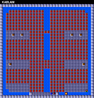

Bootstrapping Understanding
===========================

An Introduction to Reverse Engineering
--------------------------------------

------------------------------------------------------------------------

### Introduction

Reverse engineering an unfamiliar data file could be described as the
bootstrapping of understanding. In many ways the process resembles the
scientific method, only applied to human-made, abstract objects instead
of the natural world. You begin by gathering data, and then you use that
information to put forth one or more hypotheses. You test the
hypotheses, and use the outcome of those tests to refine them. Repeat as
needed.

Developing skills in reverse engineering is largely a matter of
practice. Through an accumulation of experiences, you build up an
intuition of where to investigate first, what patterns to look for, and
what tools to keep handy.

In this essay I will walk through the process of reverse-engineering
some data files from an old computer game, in order to show you a little
bit of how it\'s done.

### Some Backstory

This all started for me when I was attempting to re-create
*Chip\'s Challenge* for Linux.

*Chip\'s Challenge* was a game originally released in 1989 for Atari\'s
now-forgotten hand-held console called the Lynx. The Atari Lynx was an
impressive machine for the time period, but it came out at the same time
as Nintendo\'s Game Boy, which ultimately dominated the market.

*Chip\'s Challenge* is a puzzle game with a top-down view and a
tile-based map. As with most such games, the goal of each level is to
reach the exit. On most levels, the exit is guarded by a chip socket,
which can only be passed once you\'ve collected a specific number of
computer chips.

  ----------------------------------- -----------------------------------
  [\[Video clip                       [\[Video clip
  (1min)\]](bure/lynxdemo.webm)       (1min)\]](bure/gameplay.webm)
                                      
  The Atari Lynx in action            Playthrough of the first level

  ----------------------------------- -----------------------------------

You start a new game at the first level, called \"LESSON 1\". In
addition to chips and the chip socket, the first level introduces you to
keys and doors. Other levels include obstacles such as traps, bombs,
bodies of water, and creatures which (mostly) move around in predictable
patterns. The wide variety of objects and machinery allow for an immense
range of puzzle-based and timing-based challenges. There are over 140
levels to solve in order to complete the game.

Though the Lynx was ultimately unsuccessful, *Chip\'s Challenge* was
popular enough to be ported to many other platforms, eventually
including Microsoft Windows, where it enjoyed widespread exposure. A
small but loyal fan base coalesced around the game, and eventually a
level editor was developed, allowing the creation of countless fan-made
levels.

And here\'s where I came in. I decided I wanted to make an open source
version of the basic game engine, that could play *Chip\'s Challenge* on
Linux as well as Windows, and make it easy for me to play all the
fan-made levels.

The existence of a level editor was wonderful for me, since I could use
it to investigate obscure questions about the game logic by building
custom levels and running tests. Unfortunately, no level editor existed
for the original Lynx game --- only for the more familiar Windows port.

Now, the Windows port wasn\'t done by the original team, and had
introduced a great many changes to the game logic (not all of them
intentional). When I started writing my engine, I wanted to provide both
the original Lynx version\'s game logic and the more well-known Windows
version. But the lack of a Lynx level editor seriously limited my
ability to investigate the original game in detail. The Windows port had
the advantage of having the levels stored in a separate data file,
making it easy for people to isolate and reverse-engineer. In contrast,
the Lynx game was distributed on ROM cartridges, which contained sprite
images, sound effects, and machine code as well as the level data, all
run together. There was no indication where the level data lived in this
128kB ROM dump, or what it looked like, and without that knowledge I had
no way of creating a level editor for the Lynx version.

One day, while doing some idle research, I happened to find a copy of
the MS-DOS port of *Chip\'s Challenge*. Like most of the earlier ports
of the game, the game logic was closer to the original than the Windows
version. When I looked at the program\'s data to see how it was stored,
I was surprised to discover that the level data was broken out into its
own directory, and each level was stored in its own separate file. With
the level data isolated so finely, I guessed that it wouldn\'t be too
hard to reverse-engineer the format of the level data files. This would
make it possible to write a level editor for the MS-DOS version of the
game. An interesting possibility, I thought.

But then another member of the *Chip\'s Challenge* community alerted me
to an interesting fact. The contents of the MS-DOS level files appeared
inside the dump of the Lynx ROM, byte for byte. This meant that if I
could decode the MS-DOS files, I could then use this knowledge to read
and modify the levels inside the Lynx ROM dump. It would be possible to
build a level editor for the original Lynx game directly.

Reverse-engineering the MS-DOS level files was suddenly my top priority.

### The Data Files

Here is a link to a [tarball of the directory containing the data
files](bure/levels.tar.gz). They are provided if you want to follow
along with the process in the essay, or if you want to try your hand at
decoding the data files yourself.

**Is this legal?** That\'s a good question. Since these files are only a
small part of the MS-DOS program, and are useless on their own, and
since I\'m providing them specifically for educational purposes, I
believe that this falls within fair use. Hopefully, any interested
parties agree with me on this. (If I do get a threatening letter from a
bunch of lawyers, though, maybe I can modify this essay to also make fun
of the data files, and then claim protection under parody.)

### Prerequisites

I am assuming that you know what hexadecimal is, even if you aren\'t
proficient at decoding hexadecimal values, and that you have some
familiarity with the Unix shell. The shell session displayed in this
essay takes place on a typical Linux system, but the commands used are
almost all well-established Unix utilities, and are widely available on
other Unices.

### First Look

Here\'s the listing of the directory containing the data files from the
MS-DOS port:

::: {.term}
\$ **ls levels**\
all\_full.pak cake\_wal.pak eeny\_min.pak iceberg.pak lesson\_5.pak
mulligan.pak playtime.pak southpol.pak totally\_.pak\
alphabet.pak castle\_m.pak elementa.pak ice\_cube.pak lesson\_6.pak
nice\_day.pak potpourr.pak special.pak traffic\_.pak\
amsterda.pak catacomb.pak fireflie.pak icedeath.pak lesson\_7.pak
nightmar.pak problems.pak spirals.pak trinity.pak\
apartmen.pak cellbloc.pak firetrap.pak icehouse.pak lesson\_8.pak
now\_you\_.pak refracti.pak spooks.pak trust\_me.pak\
arcticfl.pak chchchip.pak floorgas.pak invincib.pak lobster\_.pak
nuts\_and.pak reverse\_.pak steam.pak undergro.pak\
balls\_o\_.pak chiller.pak forced\_e.pak i.pak lock\_blo.pak
on\_the\_r.pak rink.pak stripes.pak up\_the\_b.pak\
beware\_o.pak chipmine.pak force\_fi.pak i\_slide.pak loop\_aro.pak
oorto\_ge.pak roadsign.pak suicide.pak vanishin.pak\
blink.pak citybloc.pak force\_sq.pak jailer.pak memory.pak open\_que.pak
sampler.pak telebloc.pak victim.pak\
blobdanc.pak colony.pak fortune\_.pak jumping\_.pak metastab.pak
oversea\_.pak scavenge.pak telenet.pak vortex.pak\
blobnet.pak corridor.pak four\_ple.pak kablam.pak mind\_blo.pak pain.pak
scoundre.pak t\_fair.pak wars.pak\
block\_fa.pak cypher.pak four\_squ.pak knot.pak mishmesh.pak
paranoia.pak seeing\_s.pak the\_last.pak writers\_.pak\
block\_ii.pak deceptio.pak glut.pak ladder.pak miss\_dir.pak
partial\_.pak short\_ci.pak the\_mars.pak yorkhous.pak\
block\_n\_.pak deepfree.pak goldkey.pak lemmings.pak mixed\_nu.pak
pentagra.pak shrinkin.pak the\_pris.pak\
block\_ou.pak digdirt.pak go\_with\_.pak lesson\_1.pak mix\_up.pak
perfect\_.pak skelzie.pak three\_do.pak\
block.pak digger.pak grail.pak lesson\_2.pak monster\_.pak pier\_sev.pak
slide\_st.pak time\_lap.pak\
bounce\_c.pak doublema.pak hidden\_d.pak lesson\_3.pak morton.pak
ping\_pon.pak slo\_mo.pak torturec.pak\
brushfir.pak drawn\_an.pak hunt.pak lesson\_4.pak mugger\_s.pak
playhous.pak socialis.pak tossed\_s.pak
:::

As you can see, the files all end in `.pak`. The extension `.pak` is a
common extension for an application-specific data file, and
unfortunately gives no useful guidance to the internal structure. The
names of the files are essentially the first eight characters of the
level name, with a few exceptions. (For example, the levels
\"BLOCK BUSTER\" and \"BLOCK BUSTER II\" both omit the word \"buster\"
from their file names, so they don\'t collide.)

::: {.term}
\$ **ls levels \| wc**\
17 148 1974
:::

The directory contains 148 data files, and in fact there are exactly 148
levels in the game, so that checks out.

Let\'s look at what\'s actually in these files. `xxd` is the standard
hexdump utility, so let\'s see what \"LESSON 1\" looks like on the
inside.

::: {.term}
\$ **xxd levels/lesson\_1.pak**\
00000000: 1100 cb00 0200 0004 0202 0504 0407 0505 \...\...\...\...\....\
00000010: 0807 0709 0001 0a01 010b 0808 0d0a 0a11 \...\...\...\...\....\
00000020: 0023 1509 0718 0200 2209 0d26 0911 270b .\#\...\...\"..&..\'.\
00000030: 0b28 0705 291e 0127 2705 020d 0122 0704 .(..)..\'\'\....\"..\
00000040: 0902 090a 0215 0426 0925 0111 1502 221d \...\....&.%\....\".\
00000050: 0124 011d 0d01 0709 0020 001b 0400 1a00 .\$\...\.... \...\...\
00000060: 2015 2609 1f00 3300 2911 1522 2302 110d .&\...3.)..\"\#\...\
00000070: 0107 2609 1f18 2911 1509 181a 0223 021b ..&\...)\...\...\#..\
00000080: 0215 2201 1c01 1c0d 0a07 0409 0201 0201 ..\"\...\...\...\....\
00000090: 2826 0123 1505 0902 0121 1505 220a 2727 (&.\#\.....!..\".\'\'\
000000a0: 0b05 0400 060b 0828 0418 780b 0828 0418 \...\....(..x..(..\
000000b0: 700b 0828 0418 6400 1710 1e1e 1a19 0103 p..(..d\...\...\...\
000000c0: 000e 1a17 1710 0e1f 010e 1314 1b29 1f1a \...\...\...\....)..\
000000d0: 0012 101f 011b 0c1e 1f01 1f13 1001 0e13 \...\...\...\...\....\
000000e0: 141b 001e 1a0e 1610 1f2d 0020 1e10 0116 \...\...\...-. \....\
000000f0: 1024 291f 1a01 1a1b 1019 000f 1a1a 1d1e .\$)\...\...\...\....\
00000100: 2d02 -.
:::

**What is a hexdump utility?** A hex dump is a standard way to display
the exact bytes of a binary file. Most byte values do not map to
printable ASCII characters, or have ambiguous appearances (such as the
tab character). In a hex dump, the individual bytes are output as
numerical values. The values are displayed in base 16, or hexadecimal
--- thus the name \"hex dump\". In the example shown, there are sixteen
bytes displayed per line of output. The leftmost column shows the
line\'s position in the file --- also in hexadecimal, so this number
goes up by sixteen each line. The bytes are displayed in eight columns,
each column showing two bytes. On the far right, the hex dump shows what
the bytes would look like displayed as characters, but with all of the
non-printable ASCII values replaced with dots. This makes it easier to
identify strings which might be embedded inside a binary file.

Clearly, reverse-engineering these files isn\'t going to be as
straightforward as merely looking at their contents and seeing what
appears where. There isn\'t anything here that looks particularly
obvious as to what function it serves.

### What Are We Expecting To See?

Let\'s step back a moment and clarify: What data are we specifically
expecting to be present in these data files?

The most obvious thing we would expect to see is some kind of \"map\" of
the level --- data which indicates the positions of the walls and the
doors, and everything else that makes each level unique.

(Fortunately for us, fans of the game have painstakingly compiled
complete maps of all 148 levels, so we can use them to see what each
level\'s map should include.)

In addition to the map, each level has a handful of other attributes.
For example, note that each level has a name, such as \"LESSON 1\",
\"PERFECT MATCH\", \"DRAWN AND QUARTERED\", and so on. Different levels
also have different time limits, so presumably that information also
needs to be present in the data. Each level also has a different number
of chips which need to be collected in order to get past the chip
socket. (One might assume that this number would just be determined by
the number of chips in the level, but as it turns out a few of the
levels contain more chips than necessary to open the chip socket. For
those levels at least, the actual minimum number must be specified
explicitly.)

Another piece of data that we\'d expect to find in the level data is the
hint text. Some levels have a \"hint button\", a large question mark on
the ground. When Chip stands on it, a bit of helpful text is shown. Only
20 or so levels have a hint button.

Finally, each level also has a password --- a sequence of four letters
which allows the player to resume the game at that level. (This password
was necessary, because the Lynx had no persistent storage. There was no
way to save games, so the password was how you avoided having to play
the game from the start every time you turned it on.)

So, here\'s our list of data:

-   map layout
-   level name
-   level password
-   time limit
-   chip count
-   hint text

Let\'s take a moment to estimate the total size of this data. The
easiest parts are the time limit and the chip count. Both of these are
numbers which can range from 0 to 999, so they are likely stored as
two-byte integer values, for a total of 4 bytes. The password is always
four letters long, so likely stored as another four bytes, for a total
of 8 bytes. The level names vary in length from four to nineteen
characters. If we assume an extra byte for a string terminator, that\'s
twenty bytes, giving a running total of 28 bytes. The longest hint text
is over eighty bytes in size; if we round this up to ninety, we get 118
bytes total.

And what about the map layout? Well, most levels are 32 × 32 tiles in
size. No levels are larger than this. A few levels appear to be smaller,
although it wouldn\'t be unreasonable to suppose that they are merely
embedded inside of a 32 × 32 layout. If we assume the map requires one
byte per tile, that would be 1024 bytes for the full layout. This gives
us a grand total of 1142 bytes as the estimated data size for each
level. Of course this is just a rough initial estimate. It\'s entirely
possible some of these items are stored differently than we\'ve guessed,
or they may not be in the level files at all. And other data may be
present that we\'ve overlooked or don\'t know about. But it\'s a good
place to start.

Now that we\'ve clarified what we\'re expecting the data files to
contain, let\'s go back to looking at what they actually contain.

### What Is and Isn\'t Present

Even though the file\'s data appears to be completely opaque upon first
glance, there are still a couple of things we can take note of. First
off is what we *don\'t* see. We don\'t see the level\'s name, for
example, or the hint text. We can verify that this isn\'t a fluke by
checking the other files as well:

::: {.term}
\$ **strings levels/\* \| less**\
:!!;\#\
&\>\'\'::4\#\
.,,!\
-54\";\
/&67\
!)60\
\<171\
\*(0\*\
82\>\'=/\
8\>\<171&&\
9\>\#2\')(\
, )9\
0hX\
\`\@PX\
)\"\"\*\
24\*\*5\
;))\<\
B777:..22C1\
E,,F\
-GDED\
EGFF16G;;H\<\
IECJ\
9K444\
=MBBB\>\>N9\"O\"9P3?Q\
[lines 1-24/1544 (more)]{.i}
:::

Nothing shows up but random bits of ASCII garbage.

Presumably the level names and hints are in these files, somewhere, but
either they\'re not stored in ASCII, or they\'ve undergone some sort of
transformation (e.g. due to compression).

Another thing we should notice: this file is barely above 256 bytes in
size. This is rather small, given our initial size estimate of over 1140
bytes.

The `-S` option tells `ls` to sort the files by size, largest to
smallest.

::: {.term}
\$ **ls -lS levels \| head**\
total 592\
-rw-r\--r\-- 1 breadbox breadbox 680 Jun 23 2015 mulligan.pak\
-rw-r\--r\-- 1 breadbox breadbox 675 Jun 23 2015 shrinkin.pak\
-rw-r\--r\-- 1 breadbox breadbox 671 Jun 23 2015 balls\_o\_.pak\
-rw-r\--r\-- 1 breadbox breadbox 648 Jun 23 2015 cake\_wal.pak\
-rw-r\--r\-- 1 breadbox breadbox 647 Jun 23 2015 citybloc.pak\
-rw-r\--r\-- 1 breadbox breadbox 639 Jun 23 2015 four\_ple.pak\
-rw-r\--r\-- 1 breadbox breadbox 636 Jun 23 2015 trust\_me.pak\
-rw-r\--r\-- 1 breadbox breadbox 625 Jun 23 2015 block\_n\_.pak\
-rw-r\--r\-- 1 breadbox breadbox 622 Jun 23 2015 mix\_up.pak
:::

The largest level file is only 680 bytes in size, which isn\'t very big.
How small do they get?

The `-r` option tells `ls` to reverse the sort order.

::: {.term}
\$ **ls -lSr levels \| head**\
total 592\
-rw-r\--r\-- 1 breadbox breadbox 206 Jun 23 2015 kablam.pak\
-rw-r\--r\-- 1 breadbox breadbox 214 Jun 23 2015 fortune\_.pak\
-rw-r\--r\-- 1 breadbox breadbox 219 Jun 23 2015 digdirt.pak\
-rw-r\--r\-- 1 breadbox breadbox 226 Jun 23 2015 lesson\_2.pak\
-rw-r\--r\-- 1 breadbox breadbox 229 Jun 23 2015 lesson\_8.pak\
-rw-r\--r\-- 1 breadbox breadbox 237 Jun 23 2015 partial\_.pak\
-rw-r\--r\-- 1 breadbox breadbox 239 Jun 23 2015 knot.pak\
-rw-r\--r\-- 1 breadbox breadbox 247 Jun 23 2015 cellbloc.pak\
-rw-r\--r\-- 1 breadbox breadbox 248 Jun 23 2015 torturec.pak
:::

The smallest level file is only 206 bytes, which is less than a third of
the largest. This is a pretty wide range, given that we were expecting
each level to be roughly the same size.

In our initial estimate, we figured the map layout would require one
byte per tile, for a total of 1024 bytes. If we cut this estimate in
half, so that each tile only requires 4 bits (or two tiles per byte),
that\'s still 512 bytes for the map. 512 is smaller than 680, but it\'s
still bigger than most level files. And anyway, 4 bits would only give
us 16 different values, and there are far more than 16 different objects
in this game.

So clearly, maps are not stored in the files in such a direct fashion.
They either have a more complex encoding, one that allows for a more
efficient representation, and/or they are explicitly compressed in some
manner. In a level like \"LESSON 1\", for example, we could easily see
how omitting entries for the \"empty\" tiles would dramatically decrease
the overall size of the map data.

We can look at the maps of some of the largest files:

 

and then compare these with the maps of some of the smallest files:

This comparison supports the idea that smaller data files correspond
with levels that are simpler, or contain more redundancy. If the data is
compressed via some type of run-length encoding, for example, this might
easily explain the range of different file sizes.

If the files are in fact compressed, then we will probably need to
decipher the compression before we can start deciphering the map data.

### Looking at Many Files Simultaneously

Our cursory examination of the first data file has allowed us to make
several inferences, but hasn\'t revealed anything concrete. As a next
step, let\'s start looking for patterns in multiple data files. For now,
we assume that all 148 files are using the same organizational scheme to
encode their data, so looking for consistent patterns across files might
help us get our foot in the door.

Let\'s start at the very beginning of the files. The top of the file is
a likely place to store \"metadata\" that tells us about the file\'s
contents. By looking at just the first line of the hex dump for each
file, we can do a quick and easy visual comparison of the first 16
bytes, and look for any pattern that stands out:

Here we\'re using a one-line `sed` program to pull out the first line of
the hexdump output. Using `head -n1` would have also worked.

::: {.term}
\$ **for f in levels/\* ; do xxd \$f \| sed -n 1p ; done \| less**\
00000000: 2300 dc01 0300 0004 0101 0a03 030b 2323
\#\...\...\...\....\#\#\
00000000: 2d00 bf01 0300 0015 0101 2203 0329 2222
-\...\...\...\"..)\"\"\
00000000: 2b00 a101 0301 0105 0000 0601 0207 0505 +\...\...\...\...\...\
00000000: 1d00 d300 0200 0003 0101 0402 0205 0102 \...\...\...\...\....\
00000000: 2d00 7a01 0300 0006 1414 0701 0109 0303 -.z\...\...\...\....\
00000000: 3100 0802 0200 0003 0101 0502 0206 1313 1\...\...\...\...\...\
00000000: 1a00 b700 0200 0003 0100 0502 0206 0101 \...\...\...\...\....\
00000000: 1a00 0601 0300 0005 0001 0601 0107 0303 \...\...\...\...\....\
00000000: 2000 7a01 0200 0003 0202 0401 0105 0028 .z\...\...\...\...(\
00000000: 3a00 a400 0200 0003 2828 0428 0205 0303 :\...\....((.(\....\
00000000: 2600 da00 0300 0004 0507 0901 010a 0303 &\...\...\...\...\...\
00000000: 2400 f000 0300 0004 0303 0504 0407 0101
\$\...\...\...\...\...\
00000000: 2a00 ef01 0300 0005 0101 0614 0007 0303
\*\...\...\...\...\...\
00000000: 2c00 8c01 0300 0004 0303 0500 0107 0101 ,\...\...\...\...\...\
00000000: 2a00 0001 0300 0004 0303 0501 0107 0404
\*\...\...\...\...\...\
00000000: 1b00 6d01 0200 0003 0101 0502 0206 0003 ..m\...\...\...\....\
00000000: 1e00 1701 0200 0003 0202 0401 0105 0013 \...\...\...\...\....\
00000000: 3200 ee01 0f00 0015 0101 270f 0f29 1414 2\...\...\...\'..)..\
00000000: 2a00 5b01 0300 0005 0303 0601 0107 1414
\*.\[\...\...\...\....\
00000000: 2c00 8a01 0200 0003 0202 0401 0105 0303 ,\...\...\...\...\...\
00000000: 1d00 9c00 0216 1604 0000 0516 0107 0205 \...\...\...\...\....\
00000000: 2000 e100 0200 0003 0101 0402 0205 0303 \...\...\...\...\...\
00000000: 2000 2601 0300 0004 0303 0502 0207 0101 .&\...\...\...\....\
00000000: 1f00 f600 0132 0403 0000 0532 3206 0404 \.....2\.....22\...\
[lines 1-24/148 (more)]{.i}
:::

By scrolling up and down through this, we can see what sorts of
similarities appear in each column.

Starting with the first byte, we soon realize that its value appears to
fall into a rather restricted range of values, about hexadecimal
`10`--`40` (or about 20--60 in decimal). This is pretty specific.

Even more interesting, the second byte of each file is always zero,
without exception. Possibly the second byte is unused, or is padding.
Another possibility, though, is that the first two bytes together
represent a single 16-bit value, stored in little-endian order.

**What is little-endian?** When you store a numerical value that is
larger than a single byte, you have to decide beforehand the order the
bytes will be stored in. If you store the byte representing the smaller
part of the number first, that\'s called *little-endian* order; if you
store the byte representing the larger part of the number first, that\'s
*big-endian* order. In English, for example, we write numbers in
big-endian order: the string \"42\" means forty-two, not
four-and-twenty. Little-endian is the native ordering of many
microprocessor families, so it tends to be the more popular ordering
outside of network protocols, which typically require the use of
big-endian.

If we continue on this way, we will quickly see that the third byte in
the file is not like the previous two: its value ranges all over the
place. The fourth byte, however, is always either `00`, `01`, or `02`,
with `01` being the most common. Again, this suggests that these two
bytes comprise another 16-bit value, with a range of approximately
0--700 in decimal. This hypothesis can be further reinforced by noting
that the value of the third byte tends to be low when the fourth byte\'s
value is `02`, and tends to be high when the fourth byte is `00`.

Note, by the way, that this is part of the motivation for the standard
hexdump format displaying bytes in pairs --- it makes it easy to also
read the output as a sequence of 16-bit integers. The hexdump format
became standardized when 16-bit computers were the norm. Try replacing
`xxd` with `xxd -g1` to turn off grouping entirely, and you can see that
identifying pairs of bytes in the middle of the line requires more
effort. This is a simple example of how the tools we use to look at
unfamiliar data bias us to notice certain types of patterns. It\'s good
that `xxd` defaults to highlighting this pattern, because it\'s a common
one (even nowadays, when 64-bit computers are ubiquitous). But it\'s
also good to know how to change these settings when they\'re not
helpful.

Let\'s continue our eyeball investigation, and see if this pattern of
16-bit integers holds up. The fifth byte tends to have very low values:
`02` and `03` are the most common, and `05` seems to be the highest
value. The sixth byte of the file is very frequently zero --- but every
now and then it has a much larger value, such as `32` or `2C`. We don\'t
get as strong a suggestion of values spread out over a range with this
pair.

### Looking Closer at the Initial Values

We can test this feeling more directly by using `od` to generate the hex
dump. The `od` utility is similar to `xxd`, but it provides a much wider
range of output formats. We can use it to dump the output as 16-bit
decimal integers like so:

The `-t` option to `od` specifies the output format. In this case, the
`u` specifies unsigned decimal numbers, and the `2` specifies two bytes
per entry. (You can also request this format with the `-d` option.)

::: {.term}
\$ **for f in levels/\* ; do od -tu2 \$f \| sed -n 1p ; done \| less**\
0000000 35 476 3 1024 257 778 2819 8995\
0000000 45 447 3 5376 257 802 10499 8738\
0000000 43 417 259 1281 0 262 1794 1285\
0000000 29 211 2 768 257 516 1282 513\
0000000 45 378 3 1536 5140 263 2305 771\
0000000 49 520 2 768 257 517 1538 4883\
0000000 26 183 2 768 1 517 1538 257\
0000000 26 262 3 1280 256 262 1793 771\
0000000 32 378 2 768 514 260 1281 10240\
0000000 58 164 2 768 10280 10244 1282 771\
0000000 38 218 3 1024 1797 265 2561 771\
0000000 36 240 3 1024 771 1029 1796 257\
0000000 42 495 3 1280 257 5126 1792 771\
0000000 44 396 3 1024 771 5 1793 257\
0000000 42 256 3 1024 771 261 1793 1028\
0000000 27 365 2 768 257 517 1538 768\
0000000 30 279 2 768 514 260 1281 4864\
0000000 50 494 15 5376 257 3879 10511 5140\
0000000 42 347 3 1280 771 262 1793 5140\
0000000 44 394 2 768 514 260 1281 771\
0000000 29 156 5634 1046 0 5637 1793 1282\
0000000 32 225 2 768 257 516 1282 771\
0000000 32 294 3 1024 771 517 1794 257\
0000000 31 246 12801 772 0 12805 1586 1028\
[lines 1-24/148 (more)]{.i}
:::

This output makes it clear that our intuitions about the first few bytes
were correct. We can see that the file\'s first 16-bit value falls in
the range of 20--70 decimal, and that the second 16-bit value ranges
from 100--600 decimal. The values after these two are not so
well-behaved, however. They do show certain patterns (such as the fact
that 1024 appears in the fourth position surprisingly often), but they
simply don\'t have the consistency of the first values in the file.

So let us tentatively conclude that the first four bytes in the file are
special, and consist of two 16-bit values. Coming as they do at the very
start of the file, they are likely metadata, and help define how to read
the remainder of the file.

In fact, the second value\'s range of 100--600 is rather close to the
range of file sizes we noticed earlier, which was 208--680. Maybe this
isn\'t a coincidence? Let\'s put forth a hypothesis: the 16-bit value
stored in the third and fourth byte of the file correlates with the
overall file size. Now that we have a hypothesis, we can test it. Let\'s
see if the larger files consistently have larger values at this
location, and if smaller files have smaller values.

In order to display the size of a file in bytes, with no other
information, we can use `wc` with the `-c` option. Likewise, we can add
options to `od` to force it to output only the values we\'re interested
in. We can then use command substitution to capture these values in
shell variables and display them side by side:

The `-An` option to `od` suppresses the leftmost column showing the file
offset, while `-N4` tells `od` to stop after the first 4 bytes of the
file.

::: {.term}
\$ **for f in levels/\* ; do size=\$(wc -c \<\$f) ; data=\$(od -tuS -An
-N4 \$f) ; echo \"\$size: \$data\" ; done \| less**\
585: 35 476\
586: 45 447\
550: 43 417\
302: 29 211\
517: 45 378\
671: 49 520\
265: 26 183\
344: 26 262\
478: 32 378\
342: 58 164\
336: 38 218\
352: 36 240\
625: 42 495\
532: 44 396\
386: 42 256\
450: 27 365\
373: 30 279\
648: 50 494\
477: 42 347\
530: 44 394\
247: 29 156\
325: 32 225\
394: 32 294\
343: 31 246\
[lines 1-24/148 (more)]{.i}
:::

When we look at this output, we can see the values do have a rough
correlation. Smaller files tend to have smaller values in the second
position, and larger files tend to have larger values. The correlation
isn\'t exact, though, and it\'s worth noting that the file size is
always considerably larger than the value stored in the file.

The first 16-bit integer also tends to be larger when the file size is
larger, though this is also a bit inconsistent, and it\'s easy to find
examples of medium-sized files with relatively large values in the first
position. But maybe if we add the two values, their sum might correlate
better with the file size?

We can use `read` to extract the two numbers from the output of `od`
into separate variables, and then use shell arithmetic to find their
sum:

The `read` shell command can\'t be used on the right-hand side of a
pipe, because piped-to commands are run in a subshell, which naturally
takes its environment variables with it to the bit bucket when it exits.
So instead, we need to take advantage of `bash`\'s process substitution
feature, and turn the output of `od` into a temporary file which can
then be redirected into the `read` command.

::: {.term}
\$ **for f in levels/\* ; do size=\$(wc -c \<\$f) ; read v1 v2 \< \<(od
-tuS -An -N4 \$f) ; sum=\$((\$v1 + \$v2)) ; echo \"\$size: \$v1 + \$v2 =
\$sum\" ; done \| less**\
585: 35 + 476 = 511\
586: 45 + 447 = 492\
550: 43 + 417 = 460\
302: 29 + 211 = 240\
517: 45 + 378 = 423\
671: 49 + 520 = 569\
265: 26 + 183 = 209\
344: 26 + 262 = 288\
478: 32 + 378 = 410\
342: 58 + 164 = 222\
336: 38 + 218 = 256\
352: 36 + 240 = 276\
625: 42 + 495 = 537\
532: 44 + 396 = 440\
386: 42 + 256 = 298\
450: 27 + 365 = 392\
373: 30 + 279 = 309\
648: 50 + 494 = 544\
477: 42 + 347 = 389\
530: 44 + 394 = 438\
247: 29 + 156 = 185\
325: 32 + 225 = 257\
394: 32 + 294 = 326\
343: 31 + 246 = 277\
[lines 1-24/148 (more)]{.i}
:::

The sum of the two numbers also roughly correlates with the file size,
but it\'s still not quite the same. How far off is it, actually? Let\'s
display the difference between them:

::: {.term}
\$ **for f in levels/\* ; do size=\$(wc -c \<\$f) ; read v1 v2 \< \<(od
-tuS -An -N4 \$f) ; diff=\$((\$size - \$v1 - \$v2)) ; echo \"\$size =
\$v1 + \$v2 + \$diff\" ; done \| less**\
585 = 35 + 476 + 74\
586 = 45 + 447 + 94\
550 = 43 + 417 + 90\
302 = 29 + 211 + 62\
517 = 45 + 378 + 94\
671 = 49 + 520 + 102\
265 = 26 + 183 + 56\
344 = 26 + 262 + 56\
478 = 32 + 378 + 68\
342 = 58 + 164 + 120\
336 = 38 + 218 + 80\
352 = 36 + 240 + 76\
625 = 42 + 495 + 88\
532 = 44 + 396 + 92\
386 = 42 + 256 + 88\
450 = 27 + 365 + 58\
373 = 30 + 279 + 64\
648 = 50 + 494 + 104\
477 = 42 + 347 + 88\
530 = 44 + 394 + 92\
247 = 29 + 156 + 62\
325 = 32 + 225 + 68\
394 = 32 + 294 + 68\
343 = 31 + 246 + 66\
[lines 1-24/148 (more)]{.i}
:::

The difference, or \"leftover\" value, appears as the rightmost number
in this output. This value doesn\'t quite fall into a regular pattern,
but it does seem to stay in a limited range of about 40--120. And again,
the larger files tend to have larger leftover values. But sometimes
small files have large leftover values too, so it\'s not as consistent
as we might wish.

Still, we should note that the leftover values are never negative. So
the idea that the two metadata values are specifying subsections of the
file still has some appeal.

(If you\'re sharp-eyed enough, you might have already spotted something
which provides a hint to an as-yet unnoticed relationship. If you don\'t
see it, then keep reading; the secret will be revealed before long.)

### Cross-File Comparisons on a Larger Scale

At this point, it would be nice if we could do a cross-file comparison
of more than 16 bytes at a time. In order to do this, we\'ll need to use
a different kind of visualization. One good technique would be to create
an image, with each pixel representing a single byte from one of the
files, the color indicating the byte\'s value. The image could show a
cross-section of all 148 files at once, each data file providing one row
of pixels in the image. Since every file is a different size, we\'ll
take the first 200 bytes of each in order to produce a rectangular
image.

The simplest image to produce is a grayscale image, where each byte
value corresponds to a different level of gray. We can very easily
create a PGM file with our data, as the PGM header consists entirely of
ASCII text:

::: {.term}
\$ **echo P5 200 148 255 \>hdr.pgm**
:::

**What is a PGM file?** PGM, short for \"portable graymap\", is one of
three image file formats that were created to be extremely simple to
read and write: after the ASCII header, every byte identifies the
grayscale color of a single pixel. The other two file formats in this
family are PBM, \"portable bitmap\", which specifies monochrome images
as 8 pixels per byte, and PPM, \"portable pixmap\", which specifies
color images as 3 bytes per pixel.

The `P5` is the initial signature indicating the PGM file format. The
next two numbers, `200` and `148`, give the width and height of the
image, and the final `255` specifies the maximum value per pixel. The
PGM header is terminated by a newline, after which follows the pixel
data. (Note that the PGM header is most commonly laid out on three
separate lines of text, but the PGM standard only requires the elements
to be separated by some kind of whitespace.)

We can use the `head` utility to pull the first 200 bytes out of each
file:

::: {.term}
\$ **for f in levels/\* ; do head -c200 \$f ; done \>out.pgm**
:::

Then, we can concatenate this with our header to create a displayable
image:

`xview` is an old X program for displaying images in a window. Feel free
to replace it with your image viewer of choice, e.g. ImageMagick\'s
`display` utility --- although be aware that a surprising number of
image viewing utilities won\'t accept an image file piped to standard
input.

::: {.term}
\$ **cat hdr.pgm out.pgm \| xview /dev/stdin**
:::

![\[IMAGE\]](./bure/cat-hdr-out-xview.png)

If you find it difficult to make out detail in a dark image, you might
find it easier to use a different color scheme. You can use
ImageMagick\'s `pgmtoppm` utility to map the pixels to a different color
range. This version will produce a \"negative\" image:

::: {.term}
\$ **cat hdr.pgm out.pgm \| pgmtoppm white-black \| xview /dev/stdin**
:::

![\[IMAGE\]](./bure/cat-hdr-out-pgmtoppm-whiteblack-xview.png)

And this version makes low values yellow and high values blue:

::: {.term}
\$ **cat hdr.pgm out.pgm \| pgmtoppm yellow-blue \| xview /dev/stdin**
:::

![\[IMAGE\]](./bure/cat-hdr-out-pgmtoppm-yellowblue-xview.png)

Color visibility can be very subjective, so feel free to play around
with this and see what works best for you. In any case, the 200 × 148
image is a little small, so the best thing for improving visibility is
to enlarge it:

::: {.term}
\$ **cat hdr.pgm out.pgm \| xview -zoom 300 /dev/stdin**
:::

![\[IMAGE\]](./bure/cat-hdr-out-xview-zoom-300.png)

The image is dark, indicating that most bytes contain small values. In
contrast to this is a prominent strip of mostly bright pixels near the
left-hand edge. This strip is located at the third byte in the file,
which as we noted earlier varies across the full range of values.

And though there aren\'t many high values outside the third byte, when
we do find them they often appear in runs, creating short bright streaks
in our image. Several of these runs appear to be periodically
interrupted, creating a dotted-line effect. (It\'s possible that with
the right colorization, we might notice such sequences in the dimmer
pixels as well.)

Looking closely at our image will also reveal that much of the left-hand
side is dominated by subtle vertical stripes. These stripes speak to
some regularity which runs through most of the files. Not all of the
files --- there are the odd rows of pixels scattered about where the
stripes are interrupted --- but more than enough to establish the
existence of a real pattern. This pattern disappears on the right-hand
side of the image, the dim background of stripes giving way to something
much more noisy and unpatterned. (The stripes also seem to be absent on
the far-left edge of the image --- but, again, using a different color
scheme may show that they start closer to the left edge than they appear
to here.)

The stripes consist of thin lines of slightly lighter pixels on a
background of slightly darker pixels. This visual pattern should
therefore correlate with a pattern in the data files of slightly higher
byte values regularly interspersed among slightly lower byte values. The
stripes appear to peter out about halfway across the image. Since the
image shows the first 200 bytes of the files, we should expect the byte
pattern to end after approximately 100 bytes.

The fact that these patterns change across the data files might lead us
to wonder what the files look like past the first 200 bytes. Well, we
can easily replace the `head` utility with `tail` and get a view of what
the last 200 bytes look like:

::: {.term}
\$ **for f in levels/\* ; do tail -c200 \$f ; done \>out.pgm ; cat
hdr.pgm out.pgm \| xview -zoom 300 /dev/stdin**
:::

![\[IMAGE\]](./bure/for-f-in-levels-do-tail-c200-f-done-out-cat-hdr-out-xview-zoom-300.png)

Immediately we see that this region of the data files is very different.
There are a lot more occurrences of large byte values, particularly near
the end of the file. (Though as before, they seem to prefer to cluster
together, covering our image in bright horizontal streaks.) The high
byte values seem to increase in frequency until near the end, when they
abruptly give way to a return to low values for the last dozen or so
bytes. And again, the pattern isn\'t universal, but is far too common to
be coincidental.

There might be more areas to be found in the middle of the files, which
we haven\'t really looked at yet. What we\'d like to do next is look at
all of the complete files in this way. But since the files are all
different sizes, they don\'t make a nice rectangular array of pixels. We
could pad out each line with black pixels, but it would be nicer if we
could resize them to all be the same width, so that proportional areas
will line up across files, more or less.

We can in fact do this, with only a little more work, by making use of
some python, along with its imaging library, `PIL` (a.k.a. \"Pillow\"):

*showbytes.py*

    import sys
    from PIL import Image

    # Retrieve the full list of data files.
    filenames = sys.argv[1:]

    # Create a grayscale image, its height equal to the number of data files.
    width = 750
    height = len(filenames)
    image = Image.new('L', (width, height))

    # Fill in the image, one row at a time.
    for y in range(height):
        # Retrieve the contents of one data file.
        data = open(filenames[y]).read()
        linewidth = len(data)
        # Turn the data into a pixel-high image, each byte becoming one pixel.
        line = Image.new(image.mode, (linewidth, 1))
        linepixels = line.load()
        for x in range(linewidth):
            linepixels[x,0] = ord(data[x])
        # Stretch the line out to fit the final image, and paste it into place.
        line = line.resize((width, 1))
        image.paste(line, (0, y))

    # Magnify the final image and display it.
    image = image.resize((width, 3 * height))
    image.show()

When we invoke this script with the full list of data files as
arguments, it constructs a comprehensive image and displays it in a
separate window:

::: {.term}
\$ **python showbytes.py levels/\***
:::

![\[IMAGE\]](./bure/python-showbytes-levels.png)

Unfortunately this image, though comprehensive, doesn\'t really show us
anything new. (It actually shows us less, since the resizing ruins the
pattern of the stripes.) We might need a better visualization process
for looking at the entire set of data.

### Characterizing Data

With this in mind, let\'s pause a moment, and take an overall census of
the data. We\'d like to know if the data files favor certain byte values
over others. If every value tends to be equally common, for example,
this would be strong evidence that the files are in fact compressed.

It only takes a few lines of python to take a complete census of byte
values:

*census.py*

    import sys
    data = sys.stdin.read()
    for c in range(256):
        print c, data.count(chr(c))

By jamming all of the data into a single variable, we can easily produce
a count of how often each byte value appears.

::: {.term}
\$ **cat levels/\* \| python ./census.py \| less**\
0 2458\
1 2525\
2 1626\
3 1768\
4 1042\
5 1491\
6 1081\
7 1445\
8 958\
9 1541\
10 1279\
11 1224\
12 845\
13 908\
14 859\
15 1022\
16 679\
17 1087\
18 881\
19 1116\
20 1007\
21 1189\
22 1029\
23 733\
[lines 1-24/256 (more)]{.i}
:::

We can see that byte values 0 and 1 are the most common, 2 and 3 the
next most common, and from there the populations continue to decrease
(though with less consistency). For a better visualization of this data,
we can give the output to `gnuplot` and turn the census into a bar
graph:

The `-p` option to `gnuplot` tells it to keep the window displaying the
graph open after `gnuplot` itself exits.

::: {.term}
\$ **cat levels/\* \| python ./census.py \| gnuplot -p -e \'plot \"-\"
with boxes\'**
:::

![\[GRAPH\]](./bure/cat-levels-python-census-gnuplot-p-e-plot-with-boxes.png)

It\'s very clear now that first few byte values are significantly more
common than all others. The next several values are still relatively
common, and then the frequencies of values after 50 or so drop off in a
rather smooth, probabilistic curve. However, there is a subset of high
values spaced evenly apart, whose frequency appears to be quite stable.
Looking at the original output, we can confirm that this subset consists
of values evenly divisible by eight.

These differences in population counts suggest that there are a few
different \"classes\" of byte values, and so it might make sense to look
at how these classes are distributed. The first group of byte values
would be just the lowest values: 0, 1, 2, and 3. The second group might
then be values from 4 to 64. And the third group would be values above
64 which are evenly divisible by 8. Everything else, namely values above
64 not divisible by 8, would make up the fourth and final group.

So, with this in mind, let\'s modify our last image-generating script.
Instead of trying to show the actual values of each byte as a separate
color, let\'s simply show which group each byte falls in. We can assign
a distinct color to each of the four groups, and this should make it
easy to see if certain values tend to appear in certain places.

*showbytes2.py*

    import sys
    from PIL import Image

    # Retrieve the full list of data files.
    filenames = sys.argv[1:]

    # Create a color image, its height equal to the number of data files.
    width = 750
    height = len(filenames)
    image = Image.new('RGB', (width, height))

    # Fill in the image, one row at a time.
    for y in range(height):
        # Retrieve the contents of one data file.
        data = open(filenames[y]).read()
        linewidth = len(data)
        # Turn the data into a pixel-high image, each byte becoming one pixel.
        line = Image.new(image.mode, (linewidth, 1))
        linepixels = line.load()
        # Determine which group each byte belongs to and assign it a color.
        for x in range(linewidth):
            byte = ord(data[x])
            if byte < 0x04:     linepixels[x,0] = (255, 0, 0)
            elif byte < 0x40:   linepixels[x,0] = (0, 255, 0)
            elif byte % 8 == 0: linepixels[x,0] = (0, 0, 255)
            else:               linepixels[x,0] = (255, 255, 255)
        # Paste the line of pixels into the final image, stretching to fit.
        line = line.resize((width, 1))
        image.paste(line, (0, y))

    # Magnify the final image and display it.
    image = image.resize((width, 3 * height))
    image.show()

We\'re assigning red, green, blue, and white to the four groups
respectively. (Again, feel free to try out different color assignments
to suit your personal tastes.)

::: {.term}
\$ **python showbytes2.py levels/\***
:::

![\[IMAGE\]](./bure/python-showbytes2-levels.png)

With this image, we can tentatively confirm our division of the data
files into five sections:

1.  The four-byte header which we identified previously.
2.  The striped area, which we can\'t see directly but has lots of red
    pixels (i.e. low byte values).
3.  The main section, which is most of the files and is mostly green
    pixels (i.e. values under 64).
4.  The section near the end where blue pixels suddenly predominate.
5.  The short final section which suddenly returns to mostly green.

These colors make clear that the fourth section, the one dominated by
high byte values as we saw in the grayscale image, is specifically
dominated by high byte values divisible by 8.

We know from the previous image that the second section, a.k.a. the
striped section, extends past the mostly-red area. In fact, we saw in
one of the first images that the striped section seemed to slowly
brighten on average as it went from left to right.

Again, the non-green pixels in the main third section seem to
occasionally form dotted-line patterns, alternating green with red (or
blue or white). This pattern isn\'t terribly regular, though, and might
be spurious.

This division of the file into five sections is very tentative, of
course. The fourth section, with the high byte values divisible by
eight, might turn out to just be the end of the third section. Or the
large third section might turn out to be better divided into multiple
sections that we can\'t currently distinguish. At this point, the
identifying of sections is more about helping us find places to further
dig in. It\'s enough for now to know that there are sections where the
overall population of byte values changes, and knowing roughly how big
they are can help guide us as we continue to investigate.

### Searching for Structure

So where should we look now? Well, as before, it\'s probably easiest to
start at the top. Or rather, near the top. Since we\'ve already pretty
confidently identified the first section as a four-byte header, let\'s
start looking more closely at what comes next --- the area we\'ve been
calling section two, or the striped section. Those stripes are our
biggest hint of the presence of structure, so that\'s the best place to
look for more indications of pattern.

(For the moment, we\'re assuming the striped pattern begins immediately
after the first four bytes. It\'s not visually obvious that it does, but
it seems likely, and an examination of the byte values should quickly
determine the truth.)

Let\'s go back to the hex dump, this time focusing specifically on the
beginning of section two. Remember, what we\'re expecting to find is a
recurring pattern of slightly higher byte values regularly interspersed
among slightly lower byte values.

The `-s4` option tells `xxd` to skip over the first 4 bytes of the file.

::: {.term}
\$ **for f in levels/\* ; do xxd -s4 \$f \| sed -n 1p ; done \| less**\
00000004: 0200 0003 0202 0401 0105 0303 0700 0108 \...\...\...\...\....\
00000004: 0201 0104 0000 0504 0407 0202 0902 010a \...\...\...\...\....\
00000004: 0300 0004 0303 0504 0407 0505 0801 0109 \...\...\...\...\....\
00000004: 0300 0009 0202 1203 0313 0909 1401 0115 \...\...\...\...\....\
00000004: 0203 0305 0000 0602 0207 0505 0901 010a \...\...\...\...\....\
00000004: 0203 0304 0000 0502 0206 0404 0901 010a \...\...\...\...\....\
00000004: 0300 0005 022a 0602 2907 0303 0902 000a \.....\*..)\...\....\
00000004: 0203 0305 0000 0605 0507 0101 0802 0209 \...\...\...\...\....\
00000004: 0300 0007 0303 0901 010a 0707 0b09 090c \...\...\...\...\....\
00000004: 0300 0004 0101 0903 030e 0404 1609 0920 \...\...\...\...\...\
00000004: 0200 0003 1313 0402 0205 0013 0701 0109 \...\...\...\...\....\
00000004: 0500 0006 0505 0701 0109 0606 0e07 070f \...\...\...\...\....\
00000004: 0100 0003 0101 0a03 030b 0a0a 0e32 3216 \...\...\...\....22.\
00000004: 0300 0004 0705 0903 030a 0606 0b08 080c \...\...\...\...\....\
00000004: 0200 0003 0701 0402 0209 0501 0a08 080b \...\...\...\...\....\
00000004: 0200 0003 0202 0901 010a 0303 0b05 010d \...\...\...\...\....\
00000004: 0200 0003 0202 0403 0305 0101 0904 040a \...\...\...\...\....\
00000004: 0300 0007 0303 0f01 0115 0707 2114 1422 \...\...\...\...!..\"\
00000004: 0200 0003 0202 0403 0309 0101 0a04 040b \...\...\...\...\....\
00000004: 0231 3103 0202 0500 0006 0303 0701 0109 .11\...\...\...\....\
00000004: 0200 0003 0202 0b32 320c 0303 0e08 0811 \...\....22\...\....\
00000004: 0201 0103 0000 0902 020a 0303 0b09 090c \...\...\...\...\....\
00000004: 0200 0003 0202 0a01 010b 0303 0d0b 0b0f \...\...\...\...\....\
00000004: 0300 0005 0303 0701 0109 0001 0b05 051b \...\...\...\...\....\
[lines 27-50/148 (more)]{.i}
:::

Looking closely at the sequence of bytes in a line, we can see a pattern
in which the 1st, 4th, 7th, and 10th byte is larger than its immediate
neighbors. It\'s not a perfect pattern --- there are certainly
exceptions --- but it\'s definitely pervasive enough to generate the
visual regularity of stripes we noticed in the images. (And it\'s enough
to confirm our assumption that the pattern of stripes begins immediately
after the four-byte header.)

The consistency of this pattern suggests strongly that this section of
the file is an array or a table, with each entry in the array being
three bytes long.

We can adjust our hexdump format to make it easier to see the output as
a series of triplets:

The `-g3` option sets the grouping to 3 bytes instead of 2. The `-c18`
option sets the number of bytes per line to 18 instead of 16, which is
done just to make it a multiple of 3.

::: {.term}
\$ **for f in levels/\* ; do xxd -s4 -g3 -c18 \$f \| sed -n 1p ; done \|
less**\
00000004: 050000 060505 070101 090606 0e0707 0f0001
\...\...\...\...\...\...\
00000004: 010000 030101 0a0303 0b0a0a 0e3232 161414
\...\...\...\....22\...\
00000004: 030000 040705 090303 0a0606 0b0808 0c0101
\...\...\...\...\...\...\
00000004: 020000 030701 040202 090501 0a0808 0b0101
\...\...\...\...\...\...\
00000004: 020000 030202 090101 0a0303 0b0501 0d0302
\...\...\...\...\...\...\
00000004: 020000 030202 040303 050101 090404 0a0302
\...\...\...\...\...\...\
00000004: 030000 070303 0f0101 150707 211414 221313
\...\...\...\...!..\"..\
00000004: 020000 030202 040303 090101 0a0404 0b0001
\...\...\...\...\...\...\
00000004: 023131 030202 050000 060303 070101 090505
.11\...\...\...\...\...\
00000004: 020000 030202 0b3232 0c0303 0e0808 110b0b
\...\....22\...\...\...\
00000004: 020101 030000 090202 0a0303 0b0909 0c0a0a
\...\...\...\...\...\...\
00000004: 020000 030202 0a0101 0b0303 0d0b0b 0f2323
\...\...\...\...\....\#\#\
00000004: 030000 050303 070101 090001 0b0505 1b0707
\...\...\...\...\...\...\
00000004: 022323 030000 040202 050303 030101 070505
.\#\#\...\...\...\...\...\
00000004: 031414 050000 060303 070505 080101 090707
\...\...\...\...\...\...\
00000004: 030000 050202 060303 070505 080101 090606
\...\...\...\...\...\...\
00000004: 030202 040000 050303 070404 080005 090101
\...\...\...\...\...\...\
00000004: 030202 040000 050303 090404 1d0101 1f0909
\...\...\...\...\...\...\
00000004: 020000 050303 060101 070202 0f0300 110505
\...\...\...\...\...\...\
00000004: 050000 070101 0c0505 0d0007 110c0c 120707
\...\...\...\...\...\...\
00000004: 030202 050000 060303 070505 080101 090606
\...\...\...\...\...\...\
00000004: 020000 030101 050202 060505 070100 080303
\...\...\...\...\...\...\
00000004: 020000 030202 050303 090101 0a0505 0b0302
\...\...\...\...\...\...\
00000004: 022c2c 030000 040202 020303 050101 060202
.,,\...\...\...\...\...\
[lines 38-61/148 (more)]{.i}
:::

With the hex dump formatted this way, some more features of this pattern
start to stand out. As before, the first byte of each triplet tends to
be larger than the bytes surrounding it. We can also see that the second
and third byte in each triplet are frequently duplicated. Running down
the first column, we see the majority of second and third bytes values
are `0000`. But the non-zero ones often come in pairs as well, like
`0101` or `2323`. Again, this isn\'t a perfect pattern, but it\'s much
too common to be coincidental. And glancing at the ASCII column on the
far right confirms that, when we do have byte values high enough to map
to a printable ASCII character, they often do appear in pairs.

Another noteworthy pattern, though not as immediately obvious, is that
the first byte in each triplet increases as we proceed from left to
right. Although this pattern is less immediately visible, it is highly
consistent; we have to look through many lines to find our first
counterexample. And the bytes tend to increase by small amounts, though
not in any kind of regular pattern.

Something we noticed when looking at the original image is that the
striped section doesn\'t end at the same place in each file. There is a
transition from the stripe-forming pattern on the left to the
random-looking noise on the right, but this transition happens at a
different point for each row of pixels. This implies that some kind of
marker must be present, so a program reading the data file would be able
to tell when the array ends and the next set of data begins.

Let\'s return to the hex dump for just the first level, so we can see
the whole thing:

::: {.term}
\$ **xxd -s4 -g3 -c18 levels/lesson\_1.pak**\
00000004: 020000 040202 050404 070505 080707 090001
\...\...\...\...\...\...\
00000016: 0a0101 0b0808 0d0a0a 110023 150907 180200
\...\...\.....\#\...\...\
00000028: 22090d 260911 270b0b 280705 291e01 272705
\"..&..\'..(..)..\'\'.\
0000003a: 020d01 220704 090209 0a0215 042609 250111
\...\"\...\...\...&.%..\
0000004c: 150222 1d0124 011d0d 010709 002000 1b0400 ..\"..\$\...\....
\....\
0000005e: 1a0020 152609 1f0033 002911 152223 02110d ..
.&\...3.)..\"\#\...\
00000070: 010726 091f18 291115 09181a 022302 1b0215
..&\...)\...\...\#\....\
00000082: 22011c 011c0d 0a0704 090201 020128 260123
\"\...\...\...\....(&.\#\
00000094: 150509 020121 150522 0a2727 0b0504 00060b
\.....!..\".\'\'\...\...\
000000a6: 082804 18780b 082804 18700b 082804 186400 .(..x..(..p..(..d.\
000000b8: 17101e 1e1a19 010300 0e1a17 17100e 1f010e
\...\...\...\...\...\...\
000000ca: 13141b 291f1a 001210 1f011b 0c1e1f 011f13
\...)\...\...\...\.....\
000000dc: 10010e 13141b 001e1a 0e1610 1f2d00 201e10 \...\...\...\....-.
..\
000000ee: 011610 24291f 1a011a 1b1019 000f1a 1a1d1e
\...\$)\...\...\...\....\
00000100: 2d02 -.
:::

Looking along the sequence of triplets, we can tentatively guess that
the striped section in this data file ends after 17 triplets, at offset
`00000036`. This isn\'t certain, but the first byte of each triplet is
continually increasing in value, but then decreases at the 18th triplet.
And another piece of evidence is that at the 18th triplet, the second
byte has the same value as the first byte. This isn\'t something we
noticed earlier, but if we go back and look, we\'ll see the first byte
is never the same as the second or third bytes.

If our marker theory is correct, then there are two possibilities. The
first possibility is that there is some kind of special byte value after
the striped section (i.e. immediately following the 17th triplet). The
second possibility is that there is a value stored somewhere which
equals the size of the striped section. This size might be indicated by
the number 17 (to indicate the number of triplets), or 51 (giving the
total number of bytes in the section), or 55 (51 plus 4, the file offset
where the section ends).

For the first possibility, the doubled byte value could conceivably be a
section end marker (assuming such a sequence never actually appears as
part of section two). However, a careful examination of a few other data
files contradicts this idea, as no such pattern appears elsewhere.

For the second possibility, an obvious place to look for this size
indicator would be in section one. Lo and behold, the first 16-bit value
in the file\'s four-byte header is 17:

::: {.term}
\$ **od -An -tuS -N4 levels/lesson\_1.pak**\
17 203
:::

If our theory is correct, then, this value doesn\'t measure the actual
size of the striped section, but rather the number of three-byte
entries. To put this idea to the test, let\'s go back to the calculation
we did earlier comparing the sum of the two 16-bit integers with the
file size. This time, we\'ll multiply the first number by three to get
an actual size in bytes:

::: {.term}
\$ **for f in levels/\* ; do size=\$(wc -c \<\$f) ; read v1 v2 \< \<(od
-tuS -An -N4 \$f) ; diff=\$((\$size - 3 \* \$v1 - \$v2)) ; echo \"\$size
= 3 \* \$v1 + \$v2 + \$diff\" ; done \| less**\
585 = 3 \* 35 + 476 + 4\
586 = 3 \* 45 + 447 + 4\
550 = 3 \* 43 + 417 + 4\
302 = 3 \* 29 + 211 + 4\
517 = 3 \* 45 + 378 + 4\
671 = 3 \* 49 + 520 + 4\
265 = 3 \* 26 + 183 + 4\
344 = 3 \* 26 + 262 + 4\
478 = 3 \* 32 + 378 + 4\
342 = 3 \* 58 + 164 + 4\
336 = 3 \* 38 + 218 + 4\
352 = 3 \* 36 + 240 + 4\
625 = 3 \* 42 + 495 + 4\
532 = 3 \* 44 + 396 + 4\
386 = 3 \* 42 + 256 + 4\
450 = 3 \* 27 + 365 + 4\
373 = 3 \* 30 + 279 + 4\
648 = 3 \* 50 + 494 + 4\
477 = 3 \* 42 + 347 + 4\
530 = 3 \* 44 + 394 + 4\
247 = 3 \* 29 + 156 + 4\
325 = 3 \* 32 + 225 + 4\
394 = 3 \* 32 + 294 + 4\
343 = 3 \* 31 + 246 + 4\
[lines 1-24/148 (more)]{.i}
:::

Aha! With this change, the total sum of values from our header is always
exactly four less than the size of the entire data file. And since four
is also the number of bytes in the header, it is clear that this is not
a coincidence. The first number gives the number of three-byte entries
in the table, and the second number gives the number of bytes which make
up the remainder of the data file.

We have found a consistent formula, so we now completely understand what
the numbers in section one represent.

(By the way, here is the secret pattern that I said sharp-eyed readers
might have spotted, back when we were first experimenting with these
numbers. Looking closely at the equations would reveal that when files
had the same first number, they also had the same leftover difference.
This is because this difference was always just twice the value of the
first number plus four. It\'s not an obvious pattern, but it\'s one that
a meticulous or lucky person might have noticed.)

So we can now characterize the file as having three main sections:

1.  the four-byte header;
2.  the table of three-byte entries; and
3.  the rest of the file, presumably providing most of the actual data.

(The other sections that we roughly identified earlier must therefore be
subsections of the third section.)

### Interpreting the Metadata

Given this layout, it would be natural to assume that the entries in the
section two table are some kind of metadata, which are needed to
interpret the data in the third section.

So ... what kind of metadata does this table contain?

We have noted previously a couple of indicators which suggest that the
data file may be compressed. (This is even more compelling now that we
know the third section of each file, presumably containing the main data
for each level, is only 100--600 bytes in size.) If so, then it is
likely that the table preceding the main data provides compression
metadata --- a dictionary of some kind which is applied during
decompression. Huffman-encoded data, for example, is typically preceded
by a dictionary mapping the original byte values to bit sequences. While
we don\'t expect that these files are Huffman-encoded (as the data shows
clear patterns on the byte level, and thus is unlikely to be a
bitstream), it\'s not unreasonable to try to interpret this table as a
decompression dictionary.

(Of course, not every compression scheme makes use of a stored
dictionary. The deflate algorithm used by `gzip` and `zlib`, for
example, allows the dictionary to be re-created from the data stream
directly. But these tend to be the exception rather than the rule.)

Typically an entry in a dictionary consists of two parts: a key, and a
value. Sometimes the key is implicit, of course, as when the dictionary
is organized as an array instead of a lookup table. However, we\'ve
already observed that the three-byte entries seem to come in two parts
--- specifically, the first byte of each entry follows a pattern which
is distinctly different from the pattern followed by the second and
third bytes. Given this, it seems like a reasonable first hypothesis
would be to treat the first byte as the key and the remaining two bytes
as the value.

If so, then one of the simplest way to interpret the striped section is
that the first byte is the byte value in the compressed data to replace,
and the second and third bytes are the values to replace them with. The
result of this scheme would certainly be larger, though it\'s not clear
by how much. Still, it\'s not an unreasonable hypothesis, and it\'s easy
enough to test it out. We can write a short python program to apply this
decompression scheme:

*decompress.py*

    import struct
    import sys

    # Read the compressed data file.
    data = sys.stdin.read()

    # Extract the two integers of the four-byte header.
    tablesize, datasize = struct.unpack('HH', data[0:4])
    data = data[4:]

    # Separate the dictionary table and the compressed data.
    tablesize *= 3
    table = data[0:tablesize]
    data = data[tablesize:datasize]

    # Apply the dictionary entries to the data section.
    for n in range(0, len(table), 3):
        key = table[n]
        val = table[n+1:n+3]
        data = data.replace(key, val)

    # Output the expanded result.
    sys.stdout.write(data)

We can then try out this script on a sample data file:

::: {.term}
\$ **python ./decompress.py \<levels/lesson\_1.pak \| xxd**\
00000000: 0b0b 0b0b 0404 0000 0a0a 0109 0d05 0502 \...\...\...\...\....\
00000010: 0200 0100 0000 0101 0100 0009 0702 0209 \...\...\...\...\....\
00000020: 1100 0125 0100 2309 0700 0009 0d1d 0124 \...%..\#\...\.....\$\
00000030: 011d 0a0a 0105 0500 0100 2000 1b02 0200 \...\...\.... \.....\
00000040: 1a00 2009 0709 1100 011f 0033 001e 0100 .. \...\.....3\....\
00000050: 2309 0709 0d23 0000 0023 0a0a 0105 0509
\#\....\#\...\#\...\...\
00000060: 1100 011f 0200 1e01 0023 0907 0001 0200
\...\...\...\#\...\...\
00000070: 1a00 0023 0000 1b00 0009 0709 0d01 1c01
\...\#\...\...\...\...\
00000080: 1c0a 0a01 0105 0502 0200 0100 0001 0000 \...\...\...\...\....\
00000090: 0107 0509 1101 2309 0704 0400 0100 0001
\...\...\#\...\...\...\
000000a0: 2109 0704 0409 0d01 010b 0b0b 0b08 0804 !\...\...\...\...\...\
000000b0: 0402 0200 0608 0807 0707 0502 0202 0078 \...\...\...\...\...x\
000000c0: 0808 0707 0705 0202 0200 7008 0807 0707 \...\...\....p\.....\
000000d0: 0502 0202 0064 0017 101e 1e1a 1901 0300 \.....d\...\...\....\
000000e0: 0e1a 1717 100e 1f01 0e13 141b 1e01 1f1a \...\...\...\...\....\
000000f0: 0012 101f 011b 0c1e 1f01 1f13 1001 0e13 \...\...\...\...\....\
00000100: 141b 001e 1a0e 1610 1f2d 0020 1e10 0116 \...\...\...-. \....\
00000110: 1024 1e01 1f1a 011a 1b10 1900 0f1a 1a1d .\$\...\...\...\.....\
00000120: 1e2d 0000 .-..
:::

The results are pretty lackluster, however. The resulting data stream
has in fact expanded from the original, to be sure --- but not much.
Certainly not as much as we need for it to contain all the data that we
expect to find. This decompression scheme is apparently a little too
simple.

If we examine the resulting output more closely, we\'ll quickly see that
it begins with a lot of repeated bytes. `0b`, `04`, `00`, `0a` all
appear in pairs. Looking back at the compressed original, we will see
that all of these pairs came from our replacements using the dictionary.
But in the process, we can hardly fail to notice that all of these
repeated values also correspond to entries in the dictionary. That is,
if we applied the dictionary again, the data would expand further. So
... perhaps we didn\'t decompress enough?

Our first instinct might be to do a second pass, applying each
dictionary entry a second time to expand the data further. Our second
instinct might be to do multiple passes with the dictionary, repeating
the process until all bytes which appear as dictionary keys have been
replaced. However, if we look more closely at the dictionary\'s
organization, we should eventually realize that if we simply apply the
dictionary entries from *right to left*, instead of from left to right,
then all of the values should get expanded in a single pass.

With this hypothesis, we can see the structure for a more plausible
compression algorithm. The program takes the original data, and scans it
to find the most commonly appearing two-byte sequence. It then replaces
this two-byte sequence with a single byte value which currently does not
appear in the data. It then repeats this process, continuing until no
two-byte sequence appears more than twice in the data. In fact, this
compression algorithm has a name: It is known as \"byte pair encoding\"
--- or sometimes as \"re-pair compression\", short for \"recursive
pairs\".

(And this can account for some of the patterns we see in the dictionary.
The dictionary is built up from left to right while compressing, thus it
needs to be applied from right to left when decompressing. Since
dictionary entries often refer to previous entries, it makes sense that
the second and third bytes would frequently be lower in value than the
first byte.)

While byte pair encoding isn\'t particularly impressive, it has the
advantage that the decompressor can be implemented with a minimum of
code. I myself have made use of this technique in a few situations where
I needed to minimize the *combined* size of the compressed data and the
decompression code.

So. We can make a one-line change to our python program to apply the
dictionary from right to left:

*decompress2.py*

    import struct
    import sys

    # Read the compressed data file.
    data = sys.stdin.read()

    # Extract the two integers of the four-byte header.
    tablesize, datasize = struct.unpack('HH', data[0:4])
    data = data[4:]

    # Separate the dictionary table and the compressed data.
    tablesize *= 3
    table = data[0:tablesize]
    data = data[tablesize:datasize]

    # Apply the dictionary entries to the data section in reverse order.
    for n in range(len(table) - 3, -3, -3):
        key = table[n]
        val = table[n+1:n+3]
        data = data.replace(key, val)

    # Output the expanded result.
    sys.stdout.write(data)

When we try this version, we get a much larger output:

::: {.term}
\$ **python ./decompress2.py \<levels/lesson\_1.pak \| xxd \| less**\
00000000: 0000 0000 0000 0000 0000 0000 0000 0000 \...\...\...\...\....\
00000010: 0000 0000 0000 0000 0000 0000 0000 0000 \...\...\...\...\....\
00000020: 0000 0000 0000 0000 0000 0000 0000 0000 \...\...\...\...\....\
00000030: 0000 0000 0000 0000 0000 0000 0000 0000 \...\...\...\...\....\
00000040: 0000 0000 0000 0000 0000 0000 0000 0000 \...\...\...\...\....\
00000050: 0000 0000 0000 0000 0000 0000 0000 0000 \...\...\...\...\....\
00000060: 0000 0000 0000 0000 0000 0000 0000 0000 \...\...\...\...\....\
00000070: 0000 0000 0000 0000 0000 0000 0000 0000 \...\...\...\...\....\
00000080: 0000 0000 0000 0000 0000 0000 0000 0000 \...\...\...\...\....\
00000090: 0000 0000 0000 0000 0000 0000 0000 0000 \...\...\...\...\....\
000000a0: 0000 0000 0000 0000 0000 0000 0000 0000 \...\...\...\...\....\
000000b0: 0000 0000 0000 0000 0000 0000 0000 0000 \...\...\...\...\....\
000000c0: 0000 0000 0000 0000 0000 0000 0000 0000 \...\...\...\...\....\
000000d0: 0000 0000 0000 0000 0000 0000 0000 0000 \...\...\...\...\....\
000000e0: 0000 0000 0000 0000 0000 0000 0000 0000 \...\...\...\...\....\
000000f0: 0000 0000 0000 0000 0000 0000 0000 0000 \...\...\...\...\....\
00000100: 0000 0000 0000 0000 0000 0101 0101 0100 \...\...\...\...\....\
00000110: 0101 0101 0100 0000 0000 0000 0000 0000 \...\...\...\...\....\
00000120: 0000 0000 0000 0000 0000 0100 0000 0101 \...\...\...\...\....\
00000130: 0100 0000 0100 0000 0000 0000 0000 0000 \...\...\...\...\....\
00000140: 0000 0000 0000 0000 0000 0100 2300 0125 \...\...\...\...\#..%\
00000150: 0100 2300 0100 0000 0000 0000 0000 0000 ..\#\...\...\...\....\
00000160: 0000 0000 0000 0000 0101 0101 011d 0124
\...\...\...\...\...\$\
00000170: 011d 0101 0101 0100 0000 0000 0000 0000 \...\...\...\...\....\
[lines 1-24/93 (more)]{.i}
:::

We see a lot of zero bytes in this output --- but this may be consistent
with a mostly-empty map. The non-zero bytes in the data do seem to be
clumped up near each other. Since we\'re hoping to find a 32 × 32 map,
let\'s reformat the output to 32 bytes per line:

::: {.term}
\$ **python ./decompress2.py \<levels/lesson\_1.pak \| xxd -c32 \|
less**\
00000000: 0000 0000 0000 0000 0000 0000 0000 0000 0000 0000 0000 0000
0000 0000 0000 0000 \...\...\...\...\...\...\...\...\...\.....\
00000020: 0000 0000 0000 0000 0000 0000 0000 0000 0000 0000 0000 0000
0000 0000 0000 0000 \...\...\...\...\...\...\...\...\...\.....\
00000040: 0000 0000 0000 0000 0000 0000 0000 0000 0000 0000 0000 0000
0000 0000 0000 0000 \...\...\...\...\...\...\...\...\...\.....\
00000060: 0000 0000 0000 0000 0000 0000 0000 0000 0000 0000 0000 0000
0000 0000 0000 0000 \...\...\...\...\...\...\...\...\...\.....\
00000080: 0000 0000 0000 0000 0000 0000 0000 0000 0000 0000 0000 0000
0000 0000 0000 0000 \...\...\...\...\...\...\...\...\...\.....\
000000a0: 0000 0000 0000 0000 0000 0000 0000 0000 0000 0000 0000 0000
0000 0000 0000 0000 \...\...\...\...\...\...\...\...\...\.....\
000000c0: 0000 0000 0000 0000 0000 0000 0000 0000 0000 0000 0000 0000
0000 0000 0000 0000 \...\...\...\...\...\...\...\...\...\.....\
000000e0: 0000 0000 0000 0000 0000 0000 0000 0000 0000 0000 0000 0000
0000 0000 0000 0000 \...\...\...\...\...\...\...\...\...\.....\
00000100: 0000 0000 0000 0000 0000 0101 0101 0100 0101 0101 0100 0000
0000 0000 0000 0000 \...\...\...\...\...\...\...\...\...\.....\
00000120: 0000 0000 0000 0000 0000 0100 0000 0101 0100 0000 0100 0000
0000 0000 0000 0000 \...\...\...\...\...\...\...\...\...\.....\
00000140: 0000 0000 0000 0000 0000 0100 2300 0125 0100 2300 0100 0000
0000 0000 0000 0000 \...\...\...\...\#..%..\#\...\...\...\....\
00000160: 0000 0000 0000 0000 0101 0101 011d 0124 011d 0101 0101 0100
0000 0000 0000 0000 \...\...\...\...\...\$\...\...\...\...\....\
00000180: 0000 0000 0000 0000 0100 2000 1b00 0000 0000 1a00 2000 0100
0000 0000 0000 0000 \...\...\.... \...\...\... \...\...\.....\
000001a0: 0000 0000 0000 0000 0100 2300 011f 0033 001e 0100 2300 0100
0000 0000 0000 0000 \...\...\....\#\....3\....\#\...\...\.....\
000001c0: 0000 0000 0000 0000 0101 0101 0123 0000 0023 0101 0101 0100
0000 0000 0000 0000 \...\...\...\....\#\...\#\...\...\...\.....\
000001e0: 0000 0000 0000 0000 0100 2300 011f 0000 001e 0100 2300 0100
0000 0000 0000 0000 \...\...\....\#\...\...\...\#\...\...\.....\
00000200: 0000 0000 0000 0000 0100 0000 1a00 0023 0000 1b00 0000 0100
0000 0000 0000 0000 \...\...\...\...\...\#\...\...\...\...\....\
00000220: 0000 0000 0000 0000 0101 0101 0101 1c01 1c01 0101 0101 0100
0000 0000 0000 0000 \...\...\...\...\...\...\...\...\...\.....\
00000240: 0000 0000 0000 0000 0000 0000 0100 0001 0000 0100 0000 0000
0000 0000 0000 0000 \...\...\...\...\...\...\...\...\...\.....\
00000260: 0000 0000 0000 0000 0000 0000 0100 2301 2300 0100 0000 0000
0000 0000 0000 0000 \...\...\...\.....\#.\#\...\...\...\...\...\
00000280: 0000 0000 0000 0000 0000 0000 0100 0001 2100 0100 0000 0000
0000 0000 0000 0000 \...\...\...\...\....!\...\...\...\...\...\
000002a0: 0000 0000 0000 0000 0000 0000 0101 0101 0101 0100 0000 0000
0000 0000 0000 0000 \...\...\...\...\...\...\...\...\...\.....\
000002c0: 0000 0000 0000 0000 0000 0000 0000 0000 0000 0000 0000 0000
0000 0000 0000 0000 \...\...\...\...\...\...\...\...\...\.....\
000002e0: 0000 0000 0000 0000 0000 0000 0000 0000 0000 0000 0000 0000
0000 0000 0000 0000 \...\...\...\...\...\...\...\...\...\.....\
[lines 1-24/47 (more)]{.i}
:::

By focusing on the patterns of non-zero values, we can see what clearly
appears to be a map in the output. In fact, we can make this pattern
more visible by using a \"colorized\" hexdump tool which assigns
different colors to each byte value, making it easier to see patterns of
repeated values:

`xcd` is not a standard tool, but you can find a copy of it
[here](http://www.muppetlabs.com/%7Ebreadbox/software/xcd.html). Note
the `-r` option to `less`, which tells it not to sanitize the escape
sequences.

::: {.term}
\$ **python ./decompress2.py \<levels/lesson\_1.pak \| ./xcd -c32 \|
less -r**\

  ------------------ ----------------------------------------------------------------------------------------------------------------------------------------------------------------------------------------------------------------------------------------------------------------------------------------------------- --- --- --- --- --- --- --- --- --- --- ---- --- ---- ---- ---- ---- ---- ---- ---- --- ---- --- --- --- --- --- --- --- --- --- --- ---
  00000000:          [0000 0000 0000 0000 0000 0000 0000 0000 0000 0000 0000 0000 0000 0000 0000 0000]{.c808080}                                                                                                                                                                                                           ␀   ␀   ␀   ␀   ␀   ␀   ␀   ␀   ␀   ␀   ␀    ␀   ␀    ␀    ␀    ␀    ␀    ␀    ␀    ␀   ␀    ␀   ␀   ␀   ␀   ␀   ␀   ␀   ␀   ␀   ␀   ␀
  00000020:          [0000 0000 0000 0000 0000 0000 0000 0000 0000 0000 0000 0000 0000 0000 0000 0000]{.c808080}                                                                                                                                                                                                           ␀   ␀   ␀   ␀   ␀   ␀   ␀   ␀   ␀   ␀   ␀    ␀   ␀    ␀    ␀    ␀    ␀    ␀    ␀    ␀   ␀    ␀   ␀   ␀   ␀   ␀   ␀   ␀   ␀   ␀   ␀   ␀
  00000040:          [0000 0000 0000 0000 0000 0000 0000 0000 0000 0000 0000 0000 0000 0000 0000 0000]{.c808080}                                                                                                                                                                                                           ␀   ␀   ␀   ␀   ␀   ␀   ␀   ␀   ␀   ␀   ␀    ␀   ␀    ␀    ␀    ␀    ␀    ␀    ␀    ␀   ␀    ␀   ␀   ␀   ␀   ␀   ␀   ␀   ␀   ␀   ␀   ␀
  00000060:          [0000 0000 0000 0000 0000 0000 0000 0000 0000 0000 0000 0000 0000 0000 0000 0000]{.c808080}                                                                                                                                                                                                           ␀   ␀   ␀   ␀   ␀   ␀   ␀   ␀   ␀   ␀   ␀    ␀   ␀    ␀    ␀    ␀    ␀    ␀    ␀    ␀   ␀    ␀   ␀   ␀   ␀   ␀   ␀   ␀   ␀   ␀   ␀   ␀
  00000080:          [0000 0000 0000 0000 0000 0000 0000 0000 0000 0000 0000 0000 0000 0000 0000 0000]{.c808080}                                                                                                                                                                                                           ␀   ␀   ␀   ␀   ␀   ␀   ␀   ␀   ␀   ␀   ␀    ␀   ␀    ␀    ␀    ␀    ␀    ␀    ␀    ␀   ␀    ␀   ␀   ␀   ␀   ␀   ␀   ␀   ␀   ␀   ␀   ␀
  000000A0:          [0000 0000 0000 0000 0000 0000 0000 0000 0000 0000 0000 0000 0000 0000 0000 0000]{.c808080}[  ]{.c}                                                                                                                                                                                                   ␀   ␀   ␀   ␀   ␀   ␀   ␀   ␀   ␀   ␀   ␀    ␀   ␀    ␀    ␀    ␀    ␀    ␀    ␀    ␀   ␀    ␀   ␀   ␀   ␀   ␀   ␀   ␀   ␀   ␀   ␀   ␀
  [000000C0: ]{.c}   [0000 0000 0000 0000 0000 0000 0000 0000 0000 0000 0000 0000 0000 0000 0000 0000]{.c808080}[  ]{.c}                                                                                                                                                                                                   ␀   ␀   ␀   ␀   ␀   ␀   ␀   ␀   ␀   ␀   ␀    ␀   ␀    ␀    ␀    ␀    ␀    ␀    ␀    ␀   ␀    ␀   ␀   ␀   ␀   ␀   ␀   ␀   ␀   ␀   ␀   ␀
  [000000E0: ]{.c}   [0000 0000 0000 0000 0000 0000 0000 0000 0000 0000 0000 0000 0000 0000 0000 0000]{.c808080}[  ]{.c}                                                                                                                                                                                                   ␀   ␀   ␀   ␀   ␀   ␀   ␀   ␀   ␀   ␀   ␀    ␀   ␀    ␀    ␀    ␀    ␀    ␀    ␀    ␀   ␀    ␀   ␀   ␀   ␀   ␀   ␀   ␀   ␀   ␀   ␀   ␀
  [00000100: ]{.c}   [0000 0000 0000 0000 0000 ]{.c808080}[0101 0101 01]{.cFFFF00}[00 ]{.c808080}[0101 0101 01]{.cFFFF00}[00 0000 0000 0000 0000 0000]{.c808080}[  ]{.c}                                                                                                                                                   ␀   ␀   ␀   ␀   ␀   ␀   ␀   ␀   ␀   ␀   ␁    ␁   ␁    ␁    ␁    ␀    ␁    ␁    ␁    ␁   ␁    ␀   ␀   ␀   ␀   ␀   ␀   ␀   ␀   ␀   ␀   ␀
  [00000120: ]{.c}   [0000 0000 0000 0000 0000 ]{.c808080}[01]{.cFFFF00}[00 0000 ]{.c808080}[0101 01]{.cFFFF00}[00 0000 ]{.c808080}[01]{.cFFFF00}[00 0000 0000 0000 0000 0000]{.c808080}[  ]{.c}                                                                                                                           ␀   ␀   ␀   ␀   ␀   ␀   ␀   ␀   ␀   ␀   ␁    ␀   ␀    ␀    ␁    ␁    ␁    ␀    ␀    ␀   ␁    ␀   ␀   ␀   ␀   ␀   ␀   ␀   ␀   ␀   ␀   ␀
  [00000140: ]{.c}   [0000 0000 0000 0000 0000 ]{.c808080}[01]{.cFFFF00}[00 ]{.c808080}[23]{.c5F005F}[00 ]{.c808080}[01]{.cFFFF00}[25 ]{.cFF5F00}[01]{.cFFFF00}[00 ]{.c808080}[23]{.c5F005F}[00 ]{.c808080}[01]{.cFFFF00}[00 0000 0000 0000 0000 0000]{.c808080}[  ]{.c}                                                   ␀   ␀   ␀   ␀   ␀   ␀   ␀   ␀   ␀   ␀   ␁    ␀   \#   ␀    ␁    \%   ␁    ␀    \#   ␀   ␁    ␀   ␀   ␀   ␀   ␀   ␀   ␀   ␀   ␀   ␀   ␀
  [00000160: ]{.c}   [0000 0000 0000 0000 ]{.c808080}[0101 0101 01]{.cFFFF00}[1D ]{.c5FFFFF}[01]{.cFFFF00}[24 ]{.cFF0000}[01]{.cFFFF00}[1D ]{.c5FFFFF}[0101 0101 01]{.cFFFF00}[00 0000 0000 0000 0000]{.c808080}[  ]{.c}                                                                                                   ␀   ␀   ␀   ␀   ␀   ␀   ␀   ␀   ␁   ␁   ␁    ␁   ␁    ␝    ␁    \$   ␁    ␝    ␁    ␁   ␁    ␁   ␁   ␀   ␀   ␀   ␀   ␀   ␀   ␀   ␀   ␀
  [00000180: ]{.c}   [0000 0000 0000 0000 ]{.c808080}[01]{.cFFFF00}[00 ]{.c808080}[20]{.c00D75F}[00 ]{.c808080}[1B]{.cFFAFAF}[00 0000 0000 ]{.c808080}[1A]{.c0087D7}[00 ]{.c808080}[20]{.c00D75F}[00 ]{.c808080}[01]{.cFFFF00}[00 0000 0000 0000 0000]{.c808080}[  ]{.c}                                                   ␀   ␀   ␀   ␀   ␀   ␀   ␀   ␀   ␁   ␀   ␠    ␀   ␛    ␀    ␀    ␀    ␀    ␀    ␚    ␀   ␠    ␀   ␁   ␀   ␀   ␀   ␀   ␀   ␀   ␀   ␀   ␀
  [000001A0: ]{.c}   [0000 0000 0000 0000 ]{.c808080}[01]{.cFFFF00}[00 ]{.c808080}[23]{.c5F005F}[00 ]{.c808080}[01]{.cFFFF00}[1F ]{.cFFD787}[00]{.c808080}[33 ]{.c5F00FF}[00]{.c808080}[1E ]{.cFFAF00}[01]{.cFFFF00}[00 ]{.c808080}[23]{.c5F005F}[00 ]{.c808080}[01]{.cFFFF00}[00 0000 0000 0000 0000]{.c808080}[  ]{.c}   ␀   ␀   ␀   ␀   ␀   ␀   ␀   ␀   ␁   ␀   \#   ␀   ␁    ␟    ␀    3    ␀    ␞    ␁    ␀   \#   ␀   ␁   ␀   ␀   ␀   ␀   ␀   ␀   ␀   ␀   ␀
  [000001C0: ]{.c}   [0000 0000 0000 0000 ]{.c808080}[0101 0101 01]{.cFFFF00}[23 ]{.c5F005F}[0000 00]{.c808080}[23 ]{.c5F005F}[0101 0101 01]{.cFFFF00}[00 0000 0000 0000 0000]{.c808080}[  ]{.c}                                                                                                                           ␀   ␀   ␀   ␀   ␀   ␀   ␀   ␀   ␁   ␁   ␁    ␁   ␁    \#   ␀    ␀    ␀    \#   ␁    ␁   ␁    ␁   ␁   ␀   ␀   ␀   ␀   ␀   ␀   ␀   ␀   ␀
  [000001E0: ]{.c}   [0000 0000 0000 0000 ]{.c808080}[01]{.cFFFF00}[00 ]{.c808080}[23]{.c5F005F}[00 ]{.c808080}[01]{.cFFFF00}[1F ]{.cFFD787}[0000 00]{.c808080}[1E ]{.cFFAF00}[01]{.cFFFF00}[00 ]{.c808080}[23]{.c5F005F}[00 ]{.c808080}[01]{.cFFFF00}[00 0000 0000 0000 0000]{.c808080}[  ]{.c}                           ␀   ␀   ␀   ␀   ␀   ␀   ␀   ␀   ␁   ␀   \#   ␀   ␁    ␟    ␀    ␀    ␀    ␞    ␁    ␀   \#   ␀   ␁   ␀   ␀   ␀   ␀   ␀   ␀   ␀   ␀   ␀
  [00000200: ]{.c}   [0000 0000 0000 0000 ]{.c808080}[01]{.cFFFF00}[00 0000 ]{.c808080}[1A]{.c0087D7}[00 00]{.c808080}[23 ]{.c5F005F}[0000 ]{.c808080}[1B]{.cFFAFAF}[00 0000 ]{.c808080}[01]{.cFFFF00}[00 0000 0000 0000 0000]{.c808080}[  ]{.c}                                                                           ␀   ␀   ␀   ␀   ␀   ␀   ␀   ␀   ␁   ␀   ␀    ␀   ␚    ␀    ␀    \#   ␀    ␀    ␛    ␀   ␀    ␀   ␁   ␀   ␀   ␀   ␀   ␀   ␀   ␀   ␀   ␀
  [00000220: ]{.c}   [0000 0000 0000 0000 ]{.c808080}[0101 0101 0101 ]{.cFFFF00}[1C]{.cAF0087}[01 ]{.cFFFF00}[1C]{.cAF0087}[01 0101 0101 01]{.cFFFF00}[00 0000 0000 0000 0000]{.c808080}[  ]{.c}                                                                                                                           ␀   ␀   ␀   ␀   ␀   ␀   ␀   ␀   ␁   ␁   ␁    ␁   ␁    ␁    ␜    ␁    ␜    ␁    ␁    ␁   ␁    ␁   ␁   ␀   ␀   ␀   ␀   ␀   ␀   ␀   ␀   ␀
  [00000240: ]{.c}   [0000 0000 0000 0000 0000 0000 ]{.c808080}[01]{.cFFFF00}[00 00]{.c808080}[01 ]{.cFFFF00}[0000 ]{.c808080}[01]{.cFFFF00}[00 0000 0000 0000 0000 0000 0000]{.c808080}[  ]{.c}                                                                                                                           ␀   ␀   ␀   ␀   ␀   ␀   ␀   ␀   ␀   ␀   ␀    ␀   ␁    ␀    ␀    ␁    ␀    ␀    ␁    ␀   ␀    ␀   ␀   ␀   ␀   ␀   ␀   ␀   ␀   ␀   ␀   ␀
  [00000260: ]{.c}   [0000 0000 0000 0000 0000 0000 ]{.c808080}[01]{.cFFFF00}[00 ]{.c808080}[23]{.c5F005F}[01 ]{.cFFFF00}[23]{.c5F005F}[00 ]{.c808080}[01]{.cFFFF00}[00 0000 0000 0000 0000 0000 0000]{.c808080}[  ]{.c}                                                                                                   ␀   ␀   ␀   ␀   ␀   ␀   ␀   ␀   ␀   ␀   ␀    ␀   ␁    ␀    \#   ␁    \#   ␀    ␁    ␀   ␀    ␀   ␀   ␀   ␀   ␀   ␀   ␀   ␀   ␀   ␀   ␀
  [00000280: ]{.c}   [0000 0000 0000 0000 0000 0000 ]{.c808080}[01]{.cFFFF00}[00 00]{.c808080}[01 ]{.cFFFF00}[21]{.cD7FF5F}[00 ]{.c808080}[01]{.cFFFF00}[00 0000 0000 0000 0000 0000 0000]{.c808080}[  ]{.c}                                                                                                               ␀   ␀   ␀   ␀   ␀   ␀   ␀   ␀   ␀   ␀   ␀    ␀   ␁    ␀    ␀    ␁    !    ␀    ␁    ␀   ␀    ␀   ␀   ␀   ␀   ␀   ␀   ␀   ␀   ␀   ␀   ␀
  [000002A0: ]{.c}   [0000 0000 0000 0000 0000 0000 ]{.c808080}[0101 0101 0101 01]{.cFFFF00}[00 0000 0000 0000 0000 0000 0000]{.c808080}[  ]{.c}                                                                                                                                                                           ␀   ␀   ␀   ␀   ␀   ␀   ␀   ␀   ␀   ␀   ␀    ␀   ␁    ␁    ␁    ␁    ␁    ␁    ␁    ␀   ␀    ␀   ␀   ␀   ␀   ␀   ␀   ␀   ␀   ␀   ␀   ␀
  [000002C0: ]{.c}   [0000 0000 0000 0000 0000 0000 0000 0000 0000 0000 0000 0000 0000 0000 0000 0000]{.c808080}[  ]{.c}                                                                                                                                                                                                   ␀   ␀   ␀   ␀   ␀   ␀   ␀   ␀   ␀   ␀   ␀    ␀   ␀    ␀    ␀    ␀    ␀    ␀    ␀    ␀   ␀    ␀   ␀   ␀   ␀   ␀   ␀   ␀   ␀   ␀   ␀   ␀
  [000002E0: ]{.c}   [0000 0000 0000 0000 0000 0000 0000 0000 0000 0000 0000 0000 0000 0000 0000 0000]{.c808080}[  ]{.c}                                                                                                                                                                                                   ␀   ␀   ␀   ␀   ␀   ␀   ␀   ␀   ␀   ␀   ␀    ␀   ␀    ␀    ␀    ␀    ␀    ␀    ␀    ␀   ␀    ␀   ␀   ␀   ␀   ␀   ␀   ␀   ␀   ␀   ␀   ␀
  ------------------ ----------------------------------------------------------------------------------------------------------------------------------------------------------------------------------------------------------------------------------------------------------------------------------------------------- --- --- --- --- --- --- --- --- --- --- ---- --- ---- ---- ---- ---- ---- ---- ---- --- ---- --- --- --- --- --- --- --- --- --- --- ---

[lines 1-24/47 (more)]{.i}
:::

Compare this with the fan-made map of the first level:

Unquestionably, we are looking at the data for the level\'s map. We can
feel pretty confident that we have correctly deduced the decompression
algorithm.

### Interpreting the Data

By comparing the byte values to the map image, we can determine that
`00` encodes an empty tile, `01` encodes a wall, and `23` represents a
chip. `1A` represents a red door, `1B` represents a blue door, and so
on. We can assign explicit values to chips, keys, doors, and every other
tile which make up the level\'s map.

We can then proceed to the next level, and identify the byte values for
the objects appearing in there. And so on to the next levels, and
eventually we will have a complete list of byte values and the game
objects that they encode.

As we had originally guessed, the map ends after exactly 1024 bytes (at
offset `000003FF`).

This time `sed` is being used to delete the first 32 lines of the hex
dump. Since we\'re displaying 32 bytes per line, this will omit the
first 1024 bytes.

::: {.term}
\$ **python ./decompress2.py \<levels/lesson\_1.pak \| ./xcd -c32 \| sed
1,32d**\

  ------------------ ----------------------------------------------------------------------------------------------------------------------------------------------------------------------------------------------------------------------------------------------------------------------------------------------------------------------------------------------------------------------------------------------------------------------------------------------------------------------------------------- --- --- --- --- --- --- --- --- --- --- --- --- ---- --- --- --- --- --- --- --- ---- --- --- --- --- --- --- --- ---- --- --- ---
  [00000400: ]{.c}   [06]{.c870000}[00 0000 0000 0000 0000 0000 0000 0000 0000 0000 0000 0000 0000 0000 0000 0000]{.c808080}[  ]{.c}                                                                                                                                                                                                                                                                                                                                                                           ␆   ␀   ␀   ␀   ␀   ␀   ␀   ␀   ␀   ␀   ␀   ␀   ␀    ␀   ␀   ␀   ␀   ␀   ␀   ␀   ␀    ␀   ␀   ␀   ␀   ␀   ␀   ␀   ␀    ␀   ␀   ␀
  [00000420: ]{.c}   [0000 0000 0000 0000 0000 0000 0000 0000 0000 0000 0000 0000 0000 0000 0000 0000]{.c808080}[  ]{.c}                                                                                                                                                                                                                                                                                                                                                                                       ␀   ␀   ␀   ␀   ␀   ␀   ␀   ␀   ␀   ␀   ␀   ␀   ␀    ␀   ␀   ␀   ␀   ␀   ␀   ␀   ␀    ␀   ␀   ␀   ␀   ␀   ␀   ␀   ␀    ␀   ␀   ␀
  [00000440: ]{.c}   [0000 0000 0000 0000 0000 0000 0000 0000 0000 0000 0000 0000 0000 0000 0000 0000]{.c808080}[  ]{.c}                                                                                                                                                                                                                                                                                                                                                                                       ␀   ␀   ␀   ␀   ␀   ␀   ␀   ␀   ␀   ␀   ␀   ␀   ␀    ␀   ␀   ␀   ␀   ␀   ␀   ␀   ␀    ␀   ␀   ␀   ␀   ␀   ␀   ␀   ␀    ␀   ␀   ␀
  [00000460: ]{.c}   [0000 0000 0000 0000 0000 0000 0000 0000 0000 0000 0000 0000 0000 0000 0000 0000]{.c808080}[  ]{.c}                                                                                                                                                                                                                                                                                                                                                                                       ␀   ␀   ␀   ␀   ␀   ␀   ␀   ␀   ␀   ␀   ␀   ␀   ␀    ␀   ␀   ␀   ␀   ␀   ␀   ␀   ␀    ␀   ␀   ␀   ␀   ␀   ␀   ␀   ␀    ␀   ␀   ␀
  [00000480: ]{.c}   [78]{.cAFD700}[00 0000 0000 0000 0000 0000 0000 0000 0000 0000 0000 0000 0000 0000 0000 0000]{.c808080}[  ]{.c}                                                                                                                                                                                                                                                                                                                                                                           x   ␀   ␀   ␀   ␀   ␀   ␀   ␀   ␀   ␀   ␀   ␀   ␀    ␀   ␀   ␀   ␀   ␀   ␀   ␀   ␀    ␀   ␀   ␀   ␀   ␀   ␀   ␀   ␀    ␀   ␀   ␀
  [000004A0: ]{.c}   [0000 0000 0000 0000 0000 0000 0000 0000 0000 0000 0000 0000 0000 0000 0000 0000]{.c808080}[  ]{.c}                                                                                                                                                                                                                                                                                                                                                                                       ␀   ␀   ␀   ␀   ␀   ␀   ␀   ␀   ␀   ␀   ␀   ␀   ␀    ␀   ␀   ␀   ␀   ␀   ␀   ␀   ␀    ␀   ␀   ␀   ␀   ␀   ␀   ␀   ␀    ␀   ␀   ␀
  [000004C0: ]{.c}   [0000 0000 0000 0000 0000 0000 0000 0000 0000 0000 0000 0000 0000 0000 0000 0000]{.c808080}[  ]{.c}                                                                                                                                                                                                                                                                                                                                                                                       ␀   ␀   ␀   ␀   ␀   ␀   ␀   ␀   ␀   ␀   ␀   ␀   ␀    ␀   ␀   ␀   ␀   ␀   ␀   ␀   ␀    ␀   ␀   ␀   ␀   ␀   ␀   ␀   ␀    ␀   ␀   ␀
  [000004E0: ]{.c}   [0000 0000 0000 0000 0000 0000 0000 0000 0000 0000 0000 0000 0000 0000 0000 0000]{.c808080}[  ]{.c}                                                                                                                                                                                                                                                                                                                                                                                       ␀   ␀   ␀   ␀   ␀   ␀   ␀   ␀   ␀   ␀   ␀   ␀   ␀    ␀   ␀   ␀   ␀   ␀   ␀   ␀   ␀    ␀   ␀   ␀   ␀   ␀   ␀   ␀   ␀    ␀   ␀   ␀
  [00000500: ]{.c}   [70]{.c875F00}[00 0000 0000 0000 0000 0000 0000 0000 0000 0000 0000 0000 0000 0000 0000 0000]{.c808080}[  ]{.c}                                                                                                                                                                                                                                                                                                                                                                           p   ␀   ␀   ␀   ␀   ␀   ␀   ␀   ␀   ␀   ␀   ␀   ␀    ␀   ␀   ␀   ␀   ␀   ␀   ␀   ␀    ␀   ␀   ␀   ␀   ␀   ␀   ␀   ␀    ␀   ␀   ␀
  [00000520: ]{.c}   [0000 0000 0000 0000 0000 0000 0000 0000 0000 0000 0000 0000 0000 0000 0000 0000]{.c808080}[  ]{.c}                                                                                                                                                                                                                                                                                                                                                                                       ␀   ␀   ␀   ␀   ␀   ␀   ␀   ␀   ␀   ␀   ␀   ␀   ␀    ␀   ␀   ␀   ␀   ␀   ␀   ␀   ␀    ␀   ␀   ␀   ␀   ␀   ␀   ␀   ␀    ␀   ␀   ␀
  [00000540: ]{.c}   [0000 0000 0000 0000 0000 0000 0000 0000 0000 0000 0000 0000 0000 0000 0000 0000]{.c808080}[  ]{.c}                                                                                                                                                                                                                                                                                                                                                                                       ␀   ␀   ␀   ␀   ␀   ␀   ␀   ␀   ␀   ␀   ␀   ␀   ␀    ␀   ␀   ␀   ␀   ␀   ␀   ␀   ␀    ␀   ␀   ␀   ␀   ␀   ␀   ␀   ␀    ␀   ␀   ␀
  [00000560: ]{.c}   [0000 0000 0000 0000 0000 0000 0000 0000 0000 0000 0000 0000 0000 0000 0000 0000]{.c808080}[  ]{.c}                                                                                                                                                                                                                                                                                                                                                                                       ␀   ␀   ␀   ␀   ␀   ␀   ␀   ␀   ␀   ␀   ␀   ␀   ␀    ␀   ␀   ␀   ␀   ␀   ␀   ␀   ␀    ␀   ␀   ␀   ␀   ␀   ␀   ␀   ␀    ␀   ␀   ␀
  [00000580: ]{.c}   [64]{.cFFAFFF}[00 ]{.c808080}[17]{.c005F00}[10 ]{.cFFFF87}[1E1E ]{.cFFAF00}[1A]{.c0087D7}[19 ]{.c87FFAF}[01]{.cFFFF00}[03 ]{.c000080}[00]{.c808080}[0E ]{.c808000}[1A]{.c0087D7}[17 17]{.c005F00}[10 ]{.cFFFF87}[0E]{.c808000}[1F ]{.cFFD787}[01]{.cFFFF00}[0E ]{.c808000}[13]{.c005F5F}[14 ]{.c008787}[1B]{.cFFAFAF}[1E ]{.cFFAF00}[01]{.cFFFF00}[1F ]{.cFFD787}[1A]{.c0087D7}[00 ]{.c808080}[12]{.cD7AF5F}[10 ]{.cFFFF87}[1F]{.cFFD787}[01]{.cFFFF00}[  ]{.c}                           d   ␀   ␗   ␐   ␞   ␞   ␚   ␙   ␁   ␃   ␀   ␎   ␚    ␗   ␗   ␐   ␎   ␟   ␁   ␎   ␓    ␔   ␛   ␞   ␁   ␟   ␚   ␀   ␒    ␐   ␟   ␁
  [000005A0: ]{.c}   [1B]{.cFFAFAF}[0C ]{.c00FFFF}[1E]{.cFFAF00}[1F ]{.cFFD787}[01]{.cFFFF00}[1F ]{.cFFD787}[13]{.c005F5F}[10 ]{.cFFFF87}[01]{.cFFFF00}[0E ]{.c808000}[13]{.c005F5F}[14 ]{.c008787}[1B]{.cFFAFAF}[00 ]{.c808080}[1E]{.cFFAF00}[1A ]{.c0087D7}[0E]{.c808000}[16 ]{.cFF00FF}[10]{.cFFFF87}[1F ]{.cFFD787}[2D]{.cD7FFFF}[00 ]{.c808080}[20]{.c00D75F}[1E ]{.cFFAF00}[10]{.cFFFF87}[01 ]{.cFFFF00}[16]{.cFF00FF}[10 ]{.cFFFF87}[24]{.cFF0000}[1E ]{.cFFAF00}[01]{.cFFFF00}[1F]{.cFFD787}[  ]{.c}   ␛   ␌   ␞   ␟   ␁   ␟   ␓   ␐   ␁   ␎   ␓   ␔   ␛    ␀   ␞   ␚   ␎   ␖   ␐   ␟   \-   ␀   ␠   ␞   ␐   ␁   ␖   ␐   \$   ␞   ␁   ␟
  [000005C0: ]{.c}   [1A]{.c0087D7}[01 ]{.cFFFF00}[1A]{.c0087D7}[1B ]{.cFFAFAF}[10]{.cFFFF87}[19 ]{.c87FFAF}[00]{.c808080}[0F ]{.c0000FF}[1A1A ]{.c0087D7}[1D]{.c5FFFFF}[1E ]{.cFFAF00}[2D]{.cD7FFFF}[00 00]{.c808080}[                                            ]{.c}                                                                                                                                                                                                                                       ␚   ␁   ␚   ␛   ␐   ␙   ␀   ␏   ␚   ␚   ␝   ␞   \-   ␀   ␀                                                                     
  ------------------ ----------------------------------------------------------------------------------------------------------------------------------------------------------------------------------------------------------------------------------------------------------------------------------------------------------------------------------------------------------------------------------------------------------------------------------------------------------------------------------------- --- --- --- --- --- --- --- --- --- --- --- --- ---- --- --- --- --- --- --- --- ---- --- --- --- --- --- --- --- ---- --- --- ---
:::

Immediately following the map data is a sequence of 384 bytes (ranging
from `00000400`--`0000057F`) which are almost entirely zeros, but with a
few non-zero bytes tossed in. After that is a completely different
pattern of bytes, so it makes sense to assume that this 384-byte
sequence is a section of its own.

If we look at a few other levels, we\'ll quickly see a pattern. The
384-byte section actually consists of three subsections, each 128 bytes
long. Each subsection starts out with a number of non-zero bytes, after
which zeros are used to pad out the remainder of the subsection.

Some levels have a lot of data here; some (like the first level) only
have a minimum. By comparing the levels with their maps, we will soon
see that the amount of data appearing in this section is directly
related to the number of \"mobs\" in the level. In this case, the term
\"mob\" includes the creatures in the level, the dirt blocks (which
don\'t move independently, but can be pushed around), and Chip himself
(the player). So the mobs don\'t appear on the map proper, but are
instead encoded in these three buffers.

Once we know that these three subsections provide the data to specify
the level\'s mobs, it\'s not too difficult to work out what the
individual subsections contain.

The first 128-byte subsection is a list of byte values that specify the
type of mob. For example, the second level\'s buffers look like this:

::: {.term}
\$ **python ./decompress2.py \<levels/lesson\_2.pak \| xxd \| less**\
00000400: 0608 1c1c 0808 0000 0000 0000 0000 0000 \...\...\...\...\....\
00000410: 0000 0000 0000 0000 0000 0000 0000 0000 \...\...\...\...\....\
00000420: 0000 0000 0000 0000 0000 0000 0000 0000 \...\...\...\...\....\
00000430: 0000 0000 0000 0000 0000 0000 0000 0000 \...\...\...\...\....\
00000440: 0000 0000 0000 0000 0000 0000 0000 0000 \...\...\...\...\....\
00000450: 0000 0000 0000 0000 0000 0000 0000 0000 \...\...\...\...\....\
00000460: 0000 0000 0000 0000 0000 0000 0000 0000 \...\...\...\...\....\
00000470: 0000 0000 0000 0000 0000 0000 0000 0000 \...\...\...\...\....\
00000480: a870 98a0 6868 0000 0000 0000 0000 0000 .p..hh\...\...\....\
00000490: 0000 0000 0000 0000 0000 0000 0000 0000 \...\...\...\...\....\
000004a0: 0000 0000 0000 0000 0000 0000 0000 0000 \...\...\...\...\....\
000004b0: 0000 0000 0000 0000 0000 0000 0000 0000 \...\...\...\...\....\
000004c0: 0000 0000 0000 0000 0000 0000 0000 0000 \...\...\...\...\....\
000004d0: 0000 0000 0000 0000 0000 0000 0000 0000 \...\...\...\...\....\
000004e0: 0000 0000 0000 0000 0000 0000 0000 0000 \...\...\...\...\....\
000004f0: 0000 0000 0000 0000 0000 0000 0000 0000 \...\...\...\...\....\
00000500: 6060 6060 5868 0000 0000 0000 0000 0000
\`\`\`\`Xh\...\...\....\
00000510: 0000 0000 0000 0000 0000 0000 0000 0000 \...\...\...\...\....\
00000520: 0000 0000 0000 0000 0000 0000 0000 0000 \...\...\...\...\....\
00000530: 0000 0000 0000 0000 0000 0000 0000 0000 \...\...\...\...\....\
00000540: 0000 0000 0000 0000 0000 0000 0000 0000 \...\...\...\...\....\
00000550: 0000 0000 0000 0000 0000 0000 0000 0000 \...\...\...\...\....\
00000560: 0000 0000 0000 0000 0000 0000 0000 0000 \...\...\...\...\....\
00000570: 0000 0000 0000 0000 0000 0000 0000 0000 \...\...\...\...\....\
[lines 64-87/93 (more)]{.i}
:::

Compare this with the map for the level:

This level contains six mobs: three bugs, two blocks, and Chip. The
first 128-byte subsection contains one `06` byte, three `08` bytes, and
two `1C` bytes. It is reasonable to conclude that `06` indicates Chip,
`08` indicates a bug, and `1C` indicates a block.

(As we continue to compare the data files with the level maps, and to
fill out our dictionary of mobs, we will quickly discover a wrinkle in
this theory: Chip can be represented by four different values, namely
`04`, `05`, `06`, or `07`. This multiplicity of representations holds
for all mobs, in fact. A careful comparison of the different values will
eventually reveal that the byte value indicating the type has a value of
0, 1, 2, or 3 added to it, indicating which way the mob is initially
facing: north, east, south, or west respectively. Thus, a byte value of
`06` specifically indicates Chip facing south.)

The meaning of the other two subsections are less obvious. But, by
focusing on repeated values in these subsections and comparing the maps
for those mobs, eventually it becomes clear that the bytes in the second
subsection provide the x-coordinate of each mob, and the bytes in the
third subsection provide the y-coordinate of each mob. This solution is
made less immediately obvious by the fact that the coordinates stored in
these subsections are actually shifted left 3 bits, i.e. they are
multiplied by 8. This little fact conveniently explains the \"blue\"
population group that we identified in the census. (The reason these
values are shifted is unclear, but a likely explanation is that the
lower three bits are used for representing frames of animation while
mobs are in motion.)

With this section dispensed with, we can now see that many of the data
files only have a few bytes left to account for:

Note that `xxd` will accept a hexadecimal value for the `-s` option.

::: {.term}
\$ **for f in levels/\* ; do python ./decompress2.py \<\$f \| xxd -s
0x580 \| sed -n 1p ; done \| less**\
00000580: 9001 0c17 1701 1120 1717 00 \...\.... \...\
00000580: 0000 0c17 1b13 0c0d 101f 011e 1a20 1b00 \...\...\...\.... ..\
00000580: f401 0c18 1e1f 101d 0f0c 1800 \...\...\...\...\
00000580: 2c01 0c1b 0c1d 1f18 1019 1f00 ,\...\...\.....\
00000580: 9001 0c1d 0e1f 140e 1117 1a22 00 \...\...\.....\".\
00000580: 2c01 0d0c 1717 1e01 1a01 1114 1d10 00 ,\...\...\...\.....\
00000580: 2c01 0d10 220c 1d10 011a 1101 0d20 1200 ,\...\"\...\..... ..\
00000580: 5802 0d17 1419 1600 X\...\....\
00000580: 0000 0d17 1a0d 0f0c 190e 1000 \...\...\...\...\
00000580: f401 0d17 1a0d 1910 1f00 \...\...\....\
00000580: f401 0d17 1a0e 1601 110c 0e1f 1a1d 2400 \...\...\...\.....\$.\
00000580: ee02 0d17 1a0e 1601 0d20 1e1f 101d 0114 \...\...\... \...\...\
00000580: 5802 0d17 1a0e 1601 1901 1d1a 1717 00 X\...\...\...\.....\
00000580: 5e01 0d17 1a0e 1601 1a20 1f00 \^\...\..... ..\
00000580: c201 0d17 1a0e 1601 0d20 1e1f 101d 00 \...\...\... \.....\
00000580: 2c01 0d1a 2019 0e10 010e 141f 2400 ,\... \...\....\$.\
00000580: 5000 0d1d 201e 1311 141d 1000 P\... \...\....\
00000580: e703 0e0c 1610 0122 0c17 1600 \...\....\"\....\
00000580: 5802 0e0c 1e1f 1710 0118 1a0c 1f00 X\...\...\...\....\
00000580: 8f01 0e0c 1f0c 0e1a 180d 1e00 \...\...\...\...\
00000580: 0000 0e10 1717 0d17 1a0e 1610 0f00 1b1d \...\...\...\...\....\
00000580: 2c01 0e13 0e13 0e13 141b 1e00 ,\...\...\.....\
00000580: 8f01 0e13 1417 1710 1d00 \...\...\....\
00000580: bc02 0e13 141b 1814 1910 00 \...\...\.....\
[lines 1-24/148 (more)]{.i}
:::

A survey of the first pair of bytes in the remainder will quickly
suggest they hold yet another 16-bit integer. Read this way, most values
turn out to be round numbers in decimal:

The `od` command uses `-j` instead of `-s` to jump to an initial offset.
Also note the `printf` command: in addition to providing formatting,
it\'s a handy way to output text without a trailing newline.

::: {.term}
\$ **for f in levels/\* ; do printf \"%-20s\" \$f ; python
./decompress2.py \<\$f \| od -An -j 0x580 -tuS -N2 ; done \| less**\
levels/all\_full.pak 400\
levels/alphabet.pak 0\
levels/amsterda.pak 500\
levels/apartmen.pak 300\
levels/arcticfl.pak 400\
levels/balls\_o\_.pak 300\
levels/beware\_o.pak 300\
levels/blink.pak 600\
levels/blobdanc.pak 0\
levels/blobnet.pak 500\
levels/block\_fa.pak 500\
levels/block\_ii.pak 750\
levels/block\_n\_.pak 600\
levels/block\_ou.pak 350\
levels/block.pak 450\
levels/bounce\_c.pak 300\
levels/brushfir.pak 80\
levels/cake\_wal.pak 999\
levels/castle\_m.pak 600\
levels/catacomb.pak 399\
levels/cellbloc.pak 0\
levels/chchchip.pak 300\
levels/chiller.pak 399\
levels/chipmine.pak 700\
[lines 1-24/148 (more)]{.i}
:::

If we refer back to the list we originally made of the data that we
expected to find in the files, we will realize that this number is the
level\'s time limit (with a value of zero for levels which are untimed).

After these two bytes, the data becomes less regular. The fact that most
levels only have a dozen or so bytes left in the file severely limits
what else can be contained here:

::: {.term}
\$ **python ./decompress2.py \<levels/all\_full.pak \| xxd -s 0x0582**\
00000582: 0c17 1701 1120 1717 00 \..... \...
:::

This level, for example, has nine bytes left over. Consider this limited
size, and then add to it the fact that these nine bytes contain four
occurrences of the value `17`, arranged into two pairs. It doesn\'t take
long to notice that the pattern of `17`s correspond to the pattern of
letter `L`s in the title \"ALL FULL\". The title is eight characters
long, so the zero byte at the end is presumably a string terminator.

Once we\'ve discovered this, it\'s a trivial matter to look through the
other levels and use their titles to compile a full character list:

  ------------ ---------------------
      `00`     string terminator
      `01`     space
   `02`--`0B`  digits 0 through 9
   `0C`--`25`  letters A through Z
   `26`--`30`  punctuation marks
  ------------ ---------------------

For most levels, this is the end of the data file. A couple dozen,
however, have data following the title. If we look at the list, we\'ll
quickly see that they are the levels which contain hint buttons, and
this remaining data gives the text of the level\'s hint string, encoded
in the same character set as the titles.

With that, we have reached the end of all of the files. We now have a
full description of the layout of the level data. Our task is complete.

### Loose Ends

The perceptive reader might have noticed that we originally expected to
find two more items in these files, which never made an appearance. We
can explain both of their absences:

The first item was the chip count, i.e. the total number of chips the
player must collect in order to pass through the chip socket. As we
noted originally, this is frequently the same as the total number of
chips present in the level --- but not always. So this data must be
provided somehow. The answer can be found by examining the maps of those
levels which contain an excess of chips. It turns out that there are two
different values used to represent chips. `23` is the value we
identified originally, but `31` is also used to represent a chip, one
that doesn\'t contribute to the total needed to open the chip socket.
(The two types of chip are the same as far as gameplay is concerned,
though. If a level contains one chip of type `31`, then any of the
level\'s chips can be left uncollected.)

The second item is the level\'s four-letter password. This one cannot be
found hidden elsewhere in the level\'s data. Unfortunately, this is one
loose end which further investigation of the data file will not tie up.
We are forced to conclude that the passwords are simply stored
elsewhere. The most likely explanation would be that they are hardcoded
in the program itself. As it happens, though, it turns out the passwords
are not directly stored anywhere. I found out much later, from people
familiar with the code itself, that the passwords are generated
dynamically using a pseudorandom number generator, initialized to a
specific sequence. Thus, the level passwords cannot be changed directly
at all, and only by modifying the assembly code.

### Postscript

Once I had managed to completely reverse-engineer the data in the level
files, I was then able to write a program which could both encode and
decode level data. With that, I was able to create my long-desired level
editor for the Lynx version of *Chip\'s Challenge*, and the availability
of this tool greatly increased my ability to study the logic of the
game, and to improve my emulation of it.

But ... I should mention that the above sequence is not how I,
personally, went about reverse-engineering these data files. I started
at the other end, as it happens, by identifying the string data. I began
by looking at files for the first eight levels. Since they are named
\"LESSON 1\" through \"LESSON 8\", I hunted through the data for common
substrings among them. As it happened, I got lucky: none of these levels
had their titles affected by compression, and so all eight titles appear
in the data files intact. Of course, I was confounded by the non-ASCII
nature of the strings, but the double-S in the title helped me to
identify the pattern repeated across the eight data files. And, once I
had found the title, I then knew the character encoding for the letters,
digits, and the space character. When I applied this encoding to the
rest of the file, the hint strings became visible immediately following
the title, and I began seeing anomalies:

The venerable `tr` utility makes it easy to translate the data files\'
idiosyncratic character set into ASCII.

::: {.term}
\$ **tr \'\\001-\\045\' \' 0-9A-Z\' \<levels/lesson\_1.pak \| xxd**\
00000000: 4600 cb00 3000 0032 3030 3332 3235 3333 F\...0..200322533\
00000010: 3635 3537 0020 3820 2039 3636 4238 3846 6557. 8 966B88F\
00000020: 0058 4a37 354d 3000 5737 4226 3746 2739 .XJ75M0.W7B&7F\'9\
00000030: 3928 3533 2953 2027 2733 3042 2057 3532 9(53)S \'\'30B W52\
00000040: 3730 3738 304a 3226 375a 2046 4a30 5752 70780J2&7Z FJ0WR\
00000050: 2059 2052 4220 3537 0055 0050 3200 4f00 Y RB 57.U.P2.O.\
00000060: 554a 2637 5400 3300 2946 4a57 5830 4642 UJ&7T.3.)FJWX0FB\
00000070: 2035 2637 544d 2946 4a37 4d4f 3058 3050 5&7TM)FJ7MO0X0P\
00000080: 304a 5720 5120 5142 3835 3237 3020 3020 0JW Q QB85270 0\
00000090: 2826 2058 4a33 3730 2056 4a33 5738 2727 (& XJ370 VJ3W8\'\'\
000000a0: 3933 3200 3439 3628 324d 7839 3628 324d 932.496(2Mx96(2M\
000000b0: 7039 3628 324d 6400 4c45 5353 4f4e 2031 p96(2Md.LESSON 1\
000000c0: 0043 4f4c 4c45 4354 2043 4849 5029 544f .COLLECT CHIP)TO\
000000d0: 0047 4554 2050 4153 5420 5448 4520 4348 .GET PAST THE CH\
000000e0: 4950 0053 4f43 4b45 542d 0055 5345 204b IP.SOCKET-.USE K\
000000f0: 4559 2954 4f20 4f50 454e 0044 4f4f 5253 EY)TO OPEN.DOORS\
00000100: 2d30 -0
:::

For example, there are two places in the hint text where the sequence of
an S followed by a space is replaced with a right parenthesis. These
anomalies gave me enough clues to deduce the presence of compression,
and something of its nature. Eventually I connected the anomalous byte
values with their appearances near the top of the data file. (For
example, you can see in the above hex dump at offset `00000035` is a
right parenthesis immediately followed by a capital S and a space.) From
there I worked out the compression scheme in a fashion similar to the
process outlined above. The rest was relatively straightforward.

The lesson to take from this, I feel, is that there is no one right way
to go about examining an unfamiliar data file. Whatever tools that you
can make work are the right tools for reverse engineering.

------------------------------------------------------------------------

[[Texts](http://www.muppetlabs.com/~breadbox/txt/)]{.small}\
[[Brian Raiter](http://www.muppetlabs.com/~breadbox/)]{.small}
